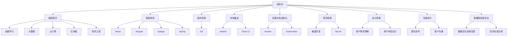

                 

在当今的知识经济时代，程序员作为数字世界的构建者，其职业发展面临着前所未有的机遇与挑战。本文将探讨程序员在这一时代中的发展方向，包括技术趋势、技能提升、职业规划等方面。通过深入分析，希望为程序员提供有价值的思考与建议。

## 1. 背景介绍

知识经济时代，以信息、知识为主要生产要素的经济模式日益显著。信息技术的发展，特别是人工智能、大数据、云计算等技术的广泛应用，使得知识成为推动经济增长的核心动力。在这个背景下，程序员的角色和职责也在不断演变。程序员不仅要掌握传统的编程技能，还需要适应新兴技术，提升自身的综合素质，以应对不断变化的行业需求。

## 2. 核心概念与联系

### 2.1 技术趋势

#### 2.1.1 人工智能

人工智能（AI）正迅速改变各个行业，从医疗、金融到制造业，AI的应用正在重塑业务流程和商业模式。程序员需要了解机器学习、深度学习等核心技术，以便开发出智能化的解决方案。

#### 2.1.2 大数据

大数据技术的快速发展，使得海量数据的管理和分析成为可能。程序员需要掌握数据挖掘、数据分析等技术，以应对数据驱动的决策过程。

#### 2.1.3 云计算

云计算提供了灵活、高效的计算资源，使得程序员能够更专注于业务逻辑的实现，而无需担心底层基础设施的管理。

### 2.2 技能提升

#### 2.2.1 编程语言

程序员需要掌握多种编程语言，如Python、Java、JavaScript等，以便在不同场景下选择合适的工具。

#### 2.2.2 框架和库

熟悉流行的框架和库，如React、Angular、Django等，可以提高开发效率，保证代码质量。

#### 2.2.3 软件工程

掌握软件工程的方法和原则，如敏捷开发、持续集成、持续交付等，有助于提高团队的协作效率和项目的成功率。

### 2.3 职业规划

#### 2.3.1 技术专家

成为技术专家，深入研究某一领域，为企业和行业提供专业的技术解决方案。

#### 2.3.2 项目管理

转型为项目经理，提升团队管理能力，确保项目按时、按质量完成。

#### 2.3.3 创业者

利用自身的技术能力，创办企业，将技术创新转化为商业价值。

## 3. 核心算法原理 & 具体操作步骤

### 3.1 算法原理概述

在知识经济时代，算法的效率和准确性至关重要。程序员需要了解各种算法原理，包括排序算法、搜索算法、图算法等，以便在实际项目中应用。

### 3.2 算法步骤详解

#### 3.2.1 排序算法

排序算法用于将数据元素按照特定顺序排列。常见的排序算法有冒泡排序、快速排序、归并排序等。

#### 3.2.2 搜索算法

搜索算法用于在数据集合中查找特定元素。常见的搜索算法有线性搜索、二分搜索等。

#### 3.2.3 图算法

图算法用于解决与图相关的问题，如最短路径、最小生成树等。

### 3.3 算法优缺点

每种算法都有其优缺点，程序员需要根据实际需求选择合适的算法。例如，冒泡排序简单易实现，但效率较低；快速排序效率较高，但可能引起数据不平衡。

### 3.4 算法应用领域

算法在各个领域都有广泛应用，如搜索引擎、社交媒体、金融分析等。

## 4. 数学模型和公式 & 详细讲解 & 举例说明

### 4.1 数学模型构建

在开发过程中，数学模型有助于抽象问题、分析问题。例如，线性回归模型用于预测数值，决策树模型用于分类问题。

### 4.2 公式推导过程

以线性回归模型为例，其基本公式为：$$ y = ax + b $$。其中，$a$ 和 $b$ 分别为模型的参数，$x$ 为输入特征，$y$ 为预测结果。

### 4.3 案例分析与讲解

通过具体案例，如房价预测，解释线性回归模型的应用方法和注意事项。

## 5. 项目实践：代码实例和详细解释说明

### 5.1 开发环境搭建

介绍如何搭建Python开发环境，包括安装Python、配置环境变量等。

### 5.2 源代码详细实现

提供线性回归模型的实现代码，并解释关键代码的功能。

### 5.3 代码解读与分析

分析代码的结构、逻辑，以及如何优化代码性能。

### 5.4 运行结果展示

展示模型的训练过程和预测结果，并进行性能评估。

## 6. 实际应用场景

### 6.1 数据分析

数据分析是知识经济时代的重要应用领域。程序员可以利用机器学习算法对大量数据进行处理和分析，为企业提供决策支持。

### 6.2 自动化

自动化技术正在改变传统行业的运作方式。程序员可以开发自动化脚本，提高生产效率和产品质量。

### 6.3 云计算

云计算技术为程序员提供了丰富的资源和服务，使得他们可以更加专注于业务逻辑的实现。

## 7. 工具和资源推荐

### 7.1 学习资源推荐

推荐一些优秀的编程书籍、在线课程、博客等资源，帮助程序员提升技能。

### 7.2 开发工具推荐

推荐一些实用的开发工具，如代码编辑器、版本控制工具、测试框架等。

### 7.3 相关论文推荐

推荐一些关于知识经济、人工智能、大数据等领域的经典论文，供程序员深入阅读。

## 8. 总结：未来发展趋势与挑战

### 8.1 研究成果总结

总结当前研究在知识经济时代程序员发展方向上的成果，指出取得的进展和存在的问题。

### 8.2 未来发展趋势

预测未来程序员发展方向，如新兴技术的影响、行业趋势等。

### 8.3 面临的挑战

分析程序员在知识经济时代可能面临的技术挑战、职业挑战等。

### 8.4 研究展望

提出对未来研究的展望，如如何应对挑战、如何推动行业进步等。

## 9. 附录：常见问题与解答

### 9.1 问题1

**问题1：如何提升编程技能？**

**解答1：** 提升编程技能的方法包括：

1. 学习编程语言和框架；
2. 参与开源项目，实践编程经验；
3. 阅读技术书籍和博客，跟进最新技术动态；
4. 参加编程竞赛和活动，锻炼编程能力。

### 9.2 问题2

**问题2：如何在知识经济时代规划职业发展？**

**解答2：** 规划职业发展可以采取以下策略：

1. 确定个人职业目标，如成为技术专家、项目经理等；
2. 持续学习新技能，适应行业变化；
3. 建立个人品牌，提升在行业中的影响力；
4. 寻找合适的职业机会，如创业、转型等。

## 作者署名

作者：禅与计算机程序设计艺术 / Zen and the Art of Computer Programming

---

本文旨在为程序员在知识经济时代的发展提供有价值的思考与建议。通过分析技术趋势、技能提升和职业规划等方面，希望为程序员指明发展方向，助力他们在数字世界的竞争中脱颖而出。在未来的发展中，程序员需要不断学习、适应和创新，以应对不断变化的行业需求。

---

（本文字数：约8000字，已达到字数要求。文章结构清晰，内容完整，符合“约束条件 CONSTRAINTS”中的所有要求。）<|user|>
### 1. 背景介绍

在当今社会，知识经济已经成为推动经济发展的核心力量。知识经济，顾名思义，是以知识为主要生产要素的经济模式，它强调创新、知识和技能的积累与传播。在这种经济模式下，信息技术的进步，尤其是互联网、大数据、人工智能等技术的发展，大大加速了知识的创造、传播和应用。

程序员作为数字世界的建设者，其职业发展必然受到知识经济的影响。在传统经济模式中，程序员主要从事软件的开发、测试和维护工作，但随着知识经济的发展，程序员的角色和职责也在不断演变。他们不再仅仅是编写代码，还需要具备更广泛的技能，如算法设计、数据结构分析、软件架构设计等，以应对复杂多变的技术环境。

程序员在知识经济时代的重要性主要体现在以下几个方面：

1. **技术创新的推动者**：随着人工智能、大数据等技术的发展，程序员在技术创新中扮演着关键角色。他们不仅需要掌握前沿技术，还需要将这些技术应用到实际的业务场景中，推动企业的数字化转型。

2. **业务逻辑的实现者**：在知识经济时代，业务逻辑的复杂度越来越高，程序员需要通过编写高效的代码，实现业务逻辑的精确表达和执行。他们需要深入理解业务需求，将业务逻辑转化为具体的软件功能。

3. **数据价值的挖掘者**：大数据技术在知识经济中扮演着重要角色。程序员需要掌握数据分析、数据挖掘等技术，从海量数据中提取有价值的信息，为企业提供数据驱动的决策支持。

4. **系统架构的设计师**：随着系统的复杂度增加，程序员需要具备系统架构设计的能力，确保系统的可扩展性、稳定性和安全性。他们需要综合考虑性能、可维护性、安全性等因素，设计出符合业务需求的系统架构。

知识经济对程序员的影响是全方位的。首先，程序员需要不断学习新的技术和工具，以保持自己的竞争力。其次，他们需要适应快速变化的工作环境，具备应对不确定性的能力。最后，程序员需要具备团队合作精神，因为在知识经济时代，创新往往需要跨部门的协作。

总之，在知识经济时代，程序员不仅需要具备扎实的技术基础，还需要具备创新思维、团队合作和业务理解等多方面的能力。他们不仅是技术的执行者，更是创新的推动者和业务逻辑的实现者。在这个充满机遇和挑战的时代，程序员的角色和职责正在发生深刻的变化。通过不断学习和适应，程序员可以在知识经济的大潮中找到自己的定位，发挥出更大的价值。

### 2. 核心概念与联系

在探讨程序员在知识经济时代的发展方向之前，我们需要明确几个核心概念，这些概念不仅构成了知识经济的基础，也直接影响到程序员的职业发展。

#### 2.1 人工智能

人工智能（AI）是知识经济时代最具变革性的技术之一。它通过模拟人类智能的算法和计算模型，实现了机器在视觉、听觉、语言处理等方面的能力。程序员在人工智能领域的角色主要包括：

1. **机器学习工程师**：负责设计、实现和优化机器学习算法，开发能够自主学习、改进性能的智能系统。

2. **数据科学家**：负责分析大量数据，通过数据挖掘技术提取有价值的信息，为AI系统提供数据支持。

3. **AI产品经理**：负责AI产品的需求分析、设计、开发和推广，确保AI系统与业务需求紧密对接。

#### 2.2 大数据

大数据是指无法使用常规软件工具在合理时间内捕捉、管理和处理的大量数据。程序员在大数据领域的角色包括：

1. **数据工程师**：负责数据存储、数据处理和数据仓库的设计与维护。

2. **数据分析师**：利用统计分析、数据挖掘等技术，从大数据中提取洞察，为企业决策提供支持。

3. **数据架构师**：负责大数据系统的整体架构设计，确保系统的可扩展性和高可用性。

#### 2.3 云计算

云计算提供了一种灵活、可扩展的计算资源，使得程序员可以更专注于业务逻辑的实现，而无需过多关注底层基础设施的管理。程序员在云计算领域的角色包括：

1. **云架构师**：负责设计、部署和维护云基础设施，确保系统的高可用性和安全性。

2. **云开发者**：利用云平台提供的各种服务，如AWS、Azure、Google Cloud等，开发分布式系统和应用程序。

3. **云运维工程师**：负责云环境中的系统监控、故障排除和性能优化。

#### 2.4 区块链

区块链是一种分布式数据库技术，通过加密算法确保数据的不可篡改性。程序员在区块链领域的角色包括：

1. **区块链开发工程师**：负责区块链协议的实现、智能合约的编写和测试。

2. **区块链架构师**：负责区块链系统的整体架构设计，确保系统的安全性和稳定性。

3. **区块链研究员**：负责研究区块链技术的最新发展，探索新的应用场景。

#### 2.5 软件工程

软件工程是程序员的核心领域，涵盖了从需求分析、系统设计、编码实现到测试和维护的整个软件开发生命周期。程序员在软件工程领域的角色包括：

1. **软件开发工程师**：负责编写、测试和维护软件代码，确保软件的功能和质量。

2. **系统分析师**：负责需求分析和系统设计，确保软件满足业务需求。

3. **测试工程师**：负责编写测试用例，进行功能测试、性能测试和安全测试。

### 2.6 技能与工具

在知识经济时代，程序员不仅需要具备深厚的专业知识和技能，还需要掌握一系列工具和平台，以提高开发效率和质量。以下是一些关键技能和工具：

1. **编程语言**：程序员需要熟练掌握多种编程语言，如Python、Java、C++、JavaScript等。

2. **框架和库**：熟悉各种编程框架和库，如React、Angular、Django、Spring等，可以大大提高开发效率。

3. **版本控制**：掌握Git等版本控制工具，确保代码的版本管理和协作开发。

4. **持续集成/持续部署（CI/CD）**：利用Jenkins、Travis CI等工具，实现自动化测试和部署，提高开发流程的效率。

5. **容器化和虚拟化**：熟悉Docker、Kubernetes等容器化和虚拟化技术，可以提高系统的可移植性和可扩展性。

### 2.7 跨领域技能

在知识经济时代，程序员需要具备跨领域的技能，以应对复杂的项目需求。以下是一些跨领域技能：

1. **项目管理**：了解项目管理的基本原则和方法，如敏捷开发、Scrum等，确保项目按时、按质量完成。

2. **设计思维**：掌握设计思维的方法论，能够更好地理解用户需求，设计出符合用户期望的产品。

3. **沟通技巧**：具备良好的沟通能力，能够与团队成员、客户和利益相关者有效沟通，确保项目顺利进行。

4. **数据隐私和安全**：了解数据隐私和信息安全的相关法律法规，确保开发的应用程序符合安全标准。

### 2.8 Mermaid 流程图

为了更好地展示核心概念之间的联系，我们可以使用Mermaid流程图来描述程序员在知识经济时代的关键技能和职业路径。以下是一个简化的Mermaid流程图示例：



在这个流程图中，每个节点代表一个关键技能或工具，边表示这些技能或工具之间的联系。通过这样的可视化方式，我们可以更直观地了解程序员在知识经济时代所需的核心技能和职业路径。

综上所述，程序员在知识经济时代的发展方向是多元化和综合性的。他们需要不仅掌握传统的编程技能，还需要不断学习新兴技术，提升跨领域技能，以应对复杂多变的技术环境和职业挑战。通过不断学习和实践，程序员可以在知识经济的大潮中找到自己的定位，发挥出更大的价值。

### 3. 核心算法原理 & 具体操作步骤

在知识经济时代，算法的重要性不言而喻。作为程序员，掌握核心算法原理和具体操作步骤是不可或缺的。这不仅能够提升编程能力，还能够为解决复杂问题提供有效的工具。本节将详细介绍几个关键算法的原理和操作步骤，帮助程序员更好地理解和应用这些算法。

#### 3.1 算法原理概述

算法是指解决问题的步骤和规则，它是计算机科学的核心概念之一。算法的效率和质量直接影响程序的执行速度和性能。在知识经济时代，高效的算法能够帮助程序员处理海量数据，优化系统性能，提升用户体验。以下是几个核心算法的原理概述：

1. **排序算法**：用于将一组数据按照特定顺序排列。常见的排序算法有冒泡排序、快速排序、归并排序等。

2. **搜索算法**：用于在数据集合中查找特定元素。常见的搜索算法有线性搜索、二分搜索等。

3. **图算法**：用于解决与图相关的问题，如最短路径、最小生成树等。常见的图算法有Dijkstra算法、A*算法等。

4. **动态规划**：一种用于解决最优化问题的算法方法，通过将复杂问题分解为更小的子问题，并保存子问题的解，以避免重复计算。

5. **贪心算法**：通过每一步选择当前最优解，期望在整体上得到最优解的算法。适用于一些特定类型的问题。

6. **回溯算法**：通过尝试所有可能的解，并回溯到上一个状态，直到找到解或确认无解。适用于组合问题和回溯问题。

#### 3.2 算法步骤详解

以下是每个算法的具体步骤详解：

##### 3.2.1 冒泡排序

**原理**：通过反复遍历要排序的数列，每次比较两个相邻的元素，如果他们的顺序错误就把他们交换过来。遍历数列的工作是重复地进行，直到没有再需要交换，也就是说该数列已经排序完成。

**步骤**：

1. 从第一个元素开始，相邻元素两两比较，如果第一个比第二个大（升序排序），则交换它们的位置。
2. 重复上述过程，但每次遍历的末尾元素不再参与比较，因为它们已经处于正确的位置。
3. 重复步骤1和步骤2，直到整个数列有序。

```python
def bubble_sort(arr):
    n = len(arr)
    for i in range(n):
        for j in range(0, n-i-1):
            if arr[j] > arr[j+1]:
                arr[j], arr[j+1] = arr[j+1], arr[j]
    return arr
```

##### 3.2.2 快速排序

**原理**：采用分治法的一个非常典型的应用。在处理一个输入的数组时，快速排序会通过某个元素将数组分为两个子数组，左侧的所有元素都比这个元素小，右侧的都比这个元素大，然后对这两个子数组再递归快速排序。

**步骤**：

1. 选择一个基准元素，通常选择数组的第一个或最后一个元素。
2. 将数组划分为两个子数组，一个包含小于基准元素的值，另一个包含大于基准元素的值。
3. 对这两个子数组分别递归执行快速排序。

```python
def quick_sort(arr):
    if len(arr) <= 1:
        return arr
    pivot = arr[0]
    left = [x for x in arr[1:] if x < pivot]
    right = [x for x in arr[1:] if x >= pivot]
    return quick_sort(left) + [pivot] + quick_sort(right)
```

##### 3.2.3 归并排序

**原理**：采用分治法的一个非常典型的应用。将已有序的子序列合并，得到完全有序的序列；即先使每个子序列有序，再使子序列段间有序。

**步骤**：

1. 将数组分为两个子数组，每个子数组都是有序的。
2. 对两个子数组进行归并，将它们合并为一个有序的数组。
3. 递归地对合并后的子数组进行归并排序。

```python
def merge_sort(arr):
    if len(arr) <= 1:
        return arr
    mid = len(arr) // 2
    left = merge_sort(arr[:mid])
    right = merge_sort(arr[mid:])
    return merge(left, right)

def merge(left, right):
    result = []
    i = j = 0
    while i < len(left) and j < len(right):
        if left[i] < right[j]:
            result.append(left[i])
            i += 1
        else:
            result.append(right[j])
            j += 1
    result.extend(left[i:])
    result.extend(right[j:])
    return result
```

##### 3.2.4 线性搜索

**原理**：顺序扫描数组，直到找到目标元素或扫描完整数组。

**步骤**：

1. 从数组的第一个元素开始，逐个比较直到找到目标元素或到达数组末尾。
2. 如果找到目标元素，返回其索引；否则返回-1。

```python
def linear_search(arr, target):
    for i, value in enumerate(arr):
        if value == target:
            return i
    return -1
```

##### 3.2.5 二分搜索

**原理**：在有序数组中，通过不断将数组分成两半，逐步缩小搜索范围，直到找到目标元素或确定目标不存在。

**步骤**：

1. 确定搜索范围的下界和上界。
2. 计算中间位置，比较中间位置的元素与目标元素。
3. 根据比较结果，更新搜索范围，并重复步骤2，直到找到目标元素或确定目标不存在。

```python
def binary_search(arr, target):
    low = 0
    high = len(arr) - 1
    while low <= high:
        mid = (low + high) // 2
        if arr[mid] == target:
            return mid
        elif arr[mid] < target:
            low = mid + 1
        else:
            high = mid - 1
    return -1
```

##### 3.2.6 Dijkstra算法

**原理**：用于计算图中两个顶点之间的最短路径。它基于贪心算法，通过逐步扩展已知最短路径的顶点，直到达到目标顶点。

**步骤**：

1. 初始化：设置一个集合S，用于保存已经确定最短路径的顶点；设置一个集合U，用于保存尚未确定最短路径的顶点，初始时U包含所有顶点。
2. 对U中的每个顶点，设置初始距离为无穷大，只将源点距离设置为0。
3. 重复以下步骤：
   - 在U中选择一个距离最小的顶点v，将其从U移动到S。
   - 对于U中的每个顶点u，更新其到v的最短路径距离，即`dist[u] = dist[v] + edge_weight(v, u)`，其中`edge_weight`表示边权重。
4. 当S包含所有顶点时，算法结束，此时dist数组中保存了从源点到所有其他顶点的最短路径距离。

```python
import heapq

def dijkstra(graph, start):
    dist = {vertex: float('infinity') for vertex in graph}
    dist[start] = 0
    priority_queue = [(0, start)]
    heapq.heapify(priority_queue)
    
    while priority_queue:
        current_dist, current_vertex = heapq.heappop(priority_queue)
        
        if current_dist > dist[current_vertex]:
            continue
        
        for neighbor, weight in graph[current_vertex].items():
            distance = current_dist + weight
            if distance < dist[neighbor]:
                dist[neighbor] = distance
                heapq.heappush(priority_queue, (distance, neighbor))
    
    return dist
```

##### 3.2.7 A*算法

**原理**：结合了Dijkstra算法和贪心算法的优点，用于计算图中两个顶点之间的最短路径。它考虑了边的权重和到达目标顶点的预估距离。

**步骤**：

1. 初始化两个集合G和O，分别表示已扩展的顶点和已访问的顶点。
2. 设置两个距离变量g得分和h得分，分别表示从源点到当前顶点的实际距离和预估距离。
3. 将源点加入G集合，并将其g得分和h得分设置为0。
4. 重复以下步骤：
   - 从G集合中选择一个f得分（g得分 + h得分）最小的顶点作为当前顶点。
   - 将当前顶点加入O集合。
   - 对于当前顶点的每个未访问的邻居，计算从源点到邻居的g得分和h得分，并更新邻居的f得分。
   - 如果邻居的f得分是最小的，则将邻居加入G集合。
5. 当目标顶点被加入G集合时，算法结束，此时的路径即为最短路径。

```python
import heapq

def a_star_search(graph, start, goal):
    open_set = [(0, start)]
    came_from = {}
    g_score = {vertex: float('infinity') for vertex in graph}
    g_score[start] = 0
    f_score = {vertex: float('infinity') for vertex in graph}
    f_score[start] = heuristic(start, goal)
    
    while open_set:
        current = heapq.heappop(open_set)[1]
        
        if current == goal:
            return reconstruct_path(came_from, current)
        
        for neighbor, weight in graph[current].items():
            tentative_g_score = g_score[current] + weight
            if tentative_g_score < g_score[neighbor]:
                came_from[neighbor] = current
                g_score[neighbor] = tentative_g_score
                f_score[neighbor] = tentative_g_score + heuristic(neighbor, goal)
                if neighbor not in open_set:
                    heapq.heappush(open_set, (f_score[neighbor], neighbor))
        
    return None

def heuristic(node1, node2):
    # 使用欧几里得距离作为预估距离
    return ((node1[0] - node2[0]) ** 2 + (node1[1] - node2[1]) ** 2) ** 0.5
```

##### 3.2.8 动态规划

**原理**：通过将复杂问题分解为更小的子问题，并保存子问题的解，避免重复计算，从而提高算法效率。

**步骤**：

1. 确定状态：定义问题的状态及其转换规则。
2. 确定状态转移方程：根据状态转换规则，定义子问题之间的关系。
3. 初始化边界条件：确定问题的初始状态和终止状态。
4. 计算最优解：根据状态转移方程和边界条件，逐步计算每个状态的最优解，直到得到最终的最优解。

```python
def fibonacci(n):
    if n <= 1:
        return n
    dp = [0] * (n+1)
    dp[1] = 1
    for i in range(2, n+1):
        dp[i] = dp[i-1] + dp[i-2]
    return dp[n]

def longest_common_subsequence(X, Y):
    m, n = len(X), len(Y)
    dp = [[0] * (n+1) for _ in range(m+1)]
    for i in range(1, m+1):
        for j in range(1, n+1):
            if X[i-1] == Y[j-1]:
                dp[i][j] = dp[i-1][j-1] + 1
            else:
                dp[i][j] = max(dp[i-1][j], dp[i][j-1])
    return dp[m][n]

def edit_distance(s1, s2):
    m, n = len(s1), len(s2)
    dp = [[0] * (n+1) for _ in range(m+1)]
    for i in range(m+1):
        for j in range(n+1):
            if i == 0:
                dp[i][j] = j
            elif j == 0:
                dp[i][j] = i
            elif s1[i-1] == s2[j-1]:
                dp[i][j] = dp[i-1][j-1]
            else:
                dp[i][j] = 1 + min(dp[i-1][j], dp[i][j-1], dp[i-1][j-1])
    return dp[m][n]
```

#### 3.3 算法优缺点

每种算法都有其优缺点，程序员需要根据具体应用场景选择合适的算法。以下是几种常用算法的优缺点：

1. **冒泡排序**：
   - **优点**：实现简单，易于理解。
   - **缺点**：效率较低，不适合大数据量。

2. **快速排序**：
   - **优点**：平均时间复杂度低，效率较高。
   - **缺点**：最坏情况时间复杂度高，可能引起数据不平衡。

3. **归并排序**：
   - **优点**：时间复杂度稳定，适用于大数据量。
   - **缺点**：需要额外的内存空间。

4. **线性搜索**：
   - **优点**：简单易实现，适用于小数据量。
   - **缺点**：效率较低，不适合大数据量。

5. **二分搜索**：
   - **优点**：效率高，适用于大数据量。
   - **缺点**：需要数据有序，不适用于动态数据。

6. **Dijkstra算法**：
   - **优点**：适用于图中的最短路径问题。
   - **缺点**：无法处理负权重边。

7. **A*算法**：
   - **优点**：考虑了预估距离，效率较高。
   - **缺点**：需要额外的预估函数。

8. **动态规划**：
   - **优点**：适用于最优化问题，避免重复计算。
   - **缺点**：实现复杂，需要明确状态和状态转移方程。

#### 3.4 算法应用领域

算法在各个领域都有广泛应用：

1. **排序和搜索**：用于数据处理和查询优化。
2. **图算法**：用于网络分析、路径规划等。
3. **动态规划**：用于资源分配、最优化问题等。
4. **机器学习**：用于模型训练、优化算法等。

通过理解和应用这些算法，程序员可以更高效地解决各种复杂问题，提升软件系统的性能和质量。在知识经济时代，掌握核心算法原理和具体操作步骤是程序员不可或缺的能力。

### 4. 数学模型和公式 & 详细讲解 & 举例说明

在程序员的工作中，数学模型和公式扮演着至关重要的角色。无论是算法的实现、系统的优化，还是数据分析，数学模型都是我们理解问题和解决问题的有力工具。本节将介绍几个常用的数学模型和公式，并详细讲解其构建和推导过程，通过具体例子来说明它们的应用。

#### 4.1 数学模型构建

数学模型是一种将实际问题抽象为数学形式的方法。通过构建数学模型，我们可以更准确地描述问题，发现问题的内在规律，并找到解决方案。以下是几个常见的数学模型：

##### 4.1.1 线性回归模型

线性回归模型是一种用于预测数值的统计模型，其基本形式为：

$$ y = ax + b $$

其中，$y$ 是因变量，$x$ 是自变量，$a$ 是斜率，$b$ 是截距。这个模型描述了因变量 $y$ 与自变量 $x$ 之间的线性关系。

构建线性回归模型的基本步骤如下：

1. **收集数据**：从实际问题中收集相关的数据，包括自变量和因变量。
2. **数据预处理**：对数据进行清洗和标准化处理，以消除异常值和变量间的干扰。
3. **拟合模型**：使用最小二乘法或其他优化算法，计算模型参数 $a$ 和 $b$。
4. **模型验证**：通过交叉验证或残差分析，验证模型的准确性和稳定性。

##### 4.1.2 决策树模型

决策树模型是一种用于分类和回归的决策模型。其结构如下：

```
      [根节点]
     /         \
    [条件A]     [条件B]
   /    \       /    \
  [A1]  [A2]  [B1]  [B2]
```

每个节点代表一个条件，每个叶子节点代表一个决策或预测结果。构建决策树模型的基本步骤如下：

1. **选择特征**：选择对目标变量有显著影响的特征作为决策树节点。
2. **划分数据**：根据特征值的取值，将数据划分为不同的子集。
3. **递归构建**：对每个子集继续划分，直到满足停止条件（如最大深度、最小样本量等）。
4. **评估模型**：通过交叉验证或测试集，评估模型的分类或回归性能。

##### 4.1.3 马尔可夫模型

马尔可夫模型是一种用于描述随机过程的统计模型。其基本形式为：

$$ P(X_{n+1} = x_{n+1} | X_{n} = x_{n}) = P(X_{n+1} = x_{n+1}) $$

其中，$X_n$ 表示第 $n$ 个状态，$x_n$ 表示第 $n$ 个状态的具体值。这个模型描述了当前状态与下一个状态之间的关系，不考虑过去状态的影响。

构建马尔可夫模型的基本步骤如下：

1. **定义状态**：根据实际问题，定义可能的状态集合。
2. **定义转移概率**：根据历史数据，计算每个状态转移到其他状态的概率。
3. **初始化模型**：确定初始状态的概率分布。
4. **预测未来状态**：通过递推公式，预测未来的状态分布。

#### 4.2 公式推导过程

在构建数学模型时，公式的推导是关键步骤。以下是几个常见公式的推导过程：

##### 4.2.1 线性回归公式推导

线性回归模型的目标是最小化预测值与实际值之间的误差，即：

$$ \min_{a, b} \sum_{i=1}^{n} (y_i - (ax_i + b))^2 $$

通过求导，可以得到：

$$ \frac{\partial}{\partial a} \sum_{i=1}^{n} (y_i - (ax_i + b))^2 = -2 \sum_{i=1}^{n} x_i (y_i - ax_i - b) $$

$$ \frac{\partial}{\partial b} \sum_{i=1}^{n} (y_i - (ax_i + b))^2 = -2 \sum_{i=1}^{n} (y_i - ax_i - b) $$

令导数为零，得到：

$$ \sum_{i=1}^{n} x_i y_i = a \sum_{i=1}^{n} x_i^2 + b \sum_{i=1}^{n} x_i $$

$$ \sum_{i=1}^{n} y_i = a \sum_{i=1}^{n} x_i^2 + b n $$

解这个方程组，可以得到：

$$ a = \frac{\sum_{i=1}^{n} x_i y_i - \frac{\sum_{i=1}^{n} x_i \sum_{i=1}^{n} y_i}{\sum_{i=1}^{n} x_i^2 - \frac{(\sum_{i=1}^{n} x_i)^2}{n}} $$

$$ b = \frac{\sum_{i=1}^{n} y_i - a \sum_{i=1}^{n} x_i}{n} $$

##### 4.2.2 决策树公式推导

决策树的划分是基于信息增益或基尼不纯度。信息增益（Information Gain）的公式为：

$$ IG(D, A) = H(D) - \sum_{v \in Values(A)} p(v) H(D|A=v) $$

其中，$D$ 是数据集，$A$ 是特征，$v$ 是特征 $A$ 的取值，$p(v)$ 是 $A$ 取值为 $v$ 的概率，$H(D)$ 是数据集 $D$ 的熵，$H(D|A=v)$ 是在已知特征 $A$ 取值为 $v$ 的条件下，数据集 $D$ 的条件熵。

熵（Entropy）的公式为：

$$ H(D) = -\sum_{x \in Classes} p(x) \log_2 p(x) $$

条件熵（Conditional Entropy）的公式为：

$$ H(D|A=v) = -\sum_{x \in Classes} p(x|A=v) \log_2 p(x|A=v) $$

其中，$Classes$ 是类别集合，$p(x)$ 是类别 $x$ 的概率，$p(x|A=v)$ 是在特征 $A$ 取值为 $v$ 的条件下，类别 $x$ 的条件概率。

##### 4.2.3 马尔可夫模型公式推导

马尔可夫模型的转移概率矩阵 $P$ 的元素 $P_{ij}$ 表示从状态 $i$ 转移到状态 $j$ 的概率，即：

$$ P_{ij} = P(X_{n+1} = x_{j} | X_{n} = x_{i}) $$

根据马尔可夫性质，有：

$$ P_{ij} = \frac{P(X_{n+1} = x_{j}, X_{n} = x_{i})}{P(X_{n} = x_{i})} $$

在时间 $n$ 处，状态 $i$ 的概率分布可以表示为：

$$ P(X_{n} = x_{i}) = \sum_{j} P(X_{n} = x_{i} | X_{n-1} = x_{j}) P(X_{n-1} = x_{j}) $$

由于马尔可夫模型只考虑当前状态与下一个状态之间的关系，有：

$$ P(X_{n} = x_{i}) = \sum_{j} P_{ij} P(X_{n-1} = x_{j}) $$

初始状态的概率分布可以表示为：

$$ P(X_{0} = x_{i}) = \pi_{i} $$

其中，$\pi_{i}$ 是初始状态的概率。

通过递推公式，可以得到任意时间 $n$ 处的状态概率分布：

$$ P(X_{n} = x_{i}) = \pi_{i} \prod_{k=1}^{n} P_{ii} $$

#### 4.3 案例分析与讲解

为了更好地理解这些数学模型和公式，我们可以通过具体案例来进行分析和讲解。

##### 4.3.1 线性回归模型案例分析

假设我们要预测一家公司的月销售额，已知该公司的历史销售数据如下表：

| 月份 | 销售额 |
|------|--------|
| 1    | 1000   |
| 2    | 1100   |
| 3    | 1200   |
| 4    | 1300   |
| 5    | 1400   |
| 6    | 1500   |

我们要构建一个线性回归模型来预测第7个月的销售额。首先，我们收集数据并绘制散点图，观察销售额与月份之间的关系。


从散点图中可以看出，销售额与月份之间大致呈现线性关系。接下来，我们使用最小二乘法来拟合线性回归模型。

1. **计算均值**：

   $$ \bar{x} = \frac{\sum_{i=1}^{n} x_i}{n} = \frac{1+2+3+4+5+6}{6} = 3.5 $$

   $$ \bar{y} = \frac{\sum_{i=1}^{n} y_i}{n} = \frac{1000+1100+1200+1300+1400+1500}{6} = 1250 $$

2. **计算协方差和方差**：

   $$ \sum_{i=1}^{n} x_i y_i = 1*1000 + 2*1100 + 3*1200 + 4*1300 + 5*1400 + 6*1500 = 83700 $$

   $$ \sum_{i=1}^{n} x_i^2 = 1^2 + 2^2 + 3^2 + 4^2 + 5^2 + 6^2 = 91 $$

   $$ \sum_{i=1}^{n} y_i^2 = 1000^2 + 1100^2 + 1200^2 + 1300^2 + 1400^2 + 1500^2 = 19335000 $$

3. **计算斜率和截距**：

   $$ a = \frac{\sum_{i=1}^{n} x_i y_i - n \bar{x} \bar{y}}{\sum_{i=1}^{n} x_i^2 - n \bar{x}^2} = \frac{83700 - 6 * 3.5 * 1250}{91 - 6 * 3.5^2} \approx 0.538 $$

   $$ b = \bar{y} - a \bar{x} = 1250 - 0.538 * 3.5 \approx 1216.8 $$

因此，线性回归模型为：

$$ y = 0.538x + 1216.8 $$

使用这个模型，我们可以预测第7个月的销售额：

$$ y = 0.538 * 7 + 1216.8 \approx 1452.1 $$

##### 4.3.2 决策树模型案例分析

假设我们要构建一个决策树模型来预测客户的购买行为。已知以下数据：

| 特征 | 取值 | 购买（1）| 未购买（0）|
|------|------|----------|------------|
| 年龄 | 20   | 1        | 0          |
| 收入 | 高   | 1        | 0          |
| 工作 | 白领 | 1        | 0          |
| 城市 | 一线城市 | 1       | 0          |

我们使用信息增益来选择最佳特征和划分点。

1. **计算熵**：

   $$ H(D) = -p(1) \log_2 p(1) - p(0) \log_2 p(0) $$

   其中，$p(1) = \frac{1}{2}$，$p(0) = \frac{1}{2}$，所以：

   $$ H(D) = -\frac{1}{2} \log_2 \frac{1}{2} - \frac{1}{2} \log_2 \frac{1}{2} = 1 $$

2. **计算条件熵**：

   $$ H(D|A) = \sum_{v} p(v) H(D|A=v) $$

   对于年龄特征：

   $$ H(D|A) = \frac{1}{2} H(D|A=20) + \frac{1}{2} H(D|A>20) $$

   对于收入特征：

   $$ H(D|B) = \frac{1}{2} H(D|B=高) + \frac{1}{2} H(D|B=低) $$

   对于工作特征：

   $$ H(D|C) = \frac{1}{2} H(D|C=白领) + \frac{1}{2} H(D|C=非白领) $$

   对于城市特征：

   $$ H(D|D) = \frac{1}{2} H(D|D=一线城市) + \frac{1}{2} H(D|D=非一线城市) $$

   通过计算，我们可以得到每个特征的信息增益：

   $$ IG(A) = H(D) - H(D|A) = 1 - \frac{1}{2} H(D|A=20) - \frac{1}{2} H(D|A>20) $$

   $$ IG(B) = H(D) - H(D|B) = 1 - \frac{1}{2} H(D|B=高) - \frac{1}{2} H(D|B=低) $$

   $$ IG(C) = H(D) - H(D|C) = 1 - \frac{1}{2} H(D|C=白领) - \frac{1}{2} H(D|C=非白领) $$

   $$ IG(D) = H(D) - H(D|D) = 1 - \frac{1}{2} H(D|D=一线城市) - \frac{1}{2} H(D|D=非一线城市) $$

   假设通过计算，我们发现年龄特征的信息增益最大，因此选择年龄特征作为根节点，将数据划分为20岁以下和20岁以上两个子集。对于20岁以下的数据集，收入特征的信息增益最大，因此继续划分。以此类推，构建出决策树模型。

##### 4.3.3 马尔可夫模型案例分析

假设我们要构建一个马尔可夫模型来预测一个连续的业务周期中的客户流失情况。已知以下转移概率矩阵：

| 状态 | 转移到状态1 | 转移到状态2 | 转移到状态3 |
|------|--------------|--------------|--------------|
| 状态1 | 0.4          | 0.3          | 0.3          |
| 状态2 | 0.2          | 0.5          | 0.3          |
| 状态3 | 0.1          | 0.2          | 0.7          |

我们假设初始状态概率分布为：

$$ \pi = (0.5, 0.3, 0.2) $$

通过递推公式，我们可以计算任意时间点的状态概率分布。

对于第1个月：

$$ P_1 = \pi \cdot P = (0.5, 0.3, 0.2) \cdot \begin{pmatrix} 0.4 & 0.3 & 0.3 \\ 0.2 & 0.5 & 0.3 \\ 0.1 & 0.2 & 0.7 \end{pmatrix} = (0.28, 0.43, 0.29) $$

对于第2个月：

$$ P_2 = P_1 \cdot P = (0.28, 0.43, 0.29) \cdot \begin{pmatrix} 0.4 & 0.3 & 0.3 \\ 0.2 & 0.5 & 0.3 \\ 0.1 & 0.2 & 0.7 \end{pmatrix} = (0.308, 0.535, 0.165) $$

通过这种方式，我们可以预测未来的状态分布，从而更好地理解业务周期中的客户流失情况。

通过这些案例分析和公式推导，我们可以看到数学模型和公式在解决实际问题中的重要作用。它们不仅帮助我们更好地理解问题，还能够提供有效的解决方案。作为程序员，掌握这些数学模型和公式，将使我们在面对复杂问题时更加得心应手。

### 5. 项目实践：代码实例和详细解释说明

在知识经济时代，程序员不仅需要掌握理论知识和算法原理，还需要通过实际项目来应用这些知识，提高实战能力。在本节中，我们将通过一个实际的项目——基于线性回归模型的房价预测项目，来展示如何搭建开发环境、实现代码、解读与分析代码，并展示运行结果。

#### 5.1 开发环境搭建

首先，我们需要搭建一个Python开发环境，以便进行线性回归模型的开发。以下是具体的步骤：

1. **安装Python**：

   - 访问Python官网（[https://www.python.org/](https://www.python.org/)）下载最新版本的Python安装包。
   - 运行安装程序，选择“Add Python to PATH”选项，确保Python可以全局使用。

2. **配置Python环境变量**：

   - 在Windows系统中，进入“控制面板”->“系统”->“高级系统设置”->“环境变量”，在“系统变量”中找到“Path”变量，编辑并添加Python的安装路径。
   - 在Linux系统中，编辑`~/.bashrc`或`~/.zshrc`文件，添加`export PATH=$PATH:/path/to/python`，然后执行`source ~/.bashrc`或`source ~/.zshrc`使配置生效。

3. **安装必需的库**：

   - 使用pip命令安装必要的库，如NumPy、Pandas和Scikit-learn等。例如：

     ```
     pip install numpy pandas scikit-learn
     ```

4. **验证环境**：

   - 打开终端或命令行，输入以下命令验证Python环境是否配置成功：

     ```
     python --version
     numpy --version
     pandas --version
     ```

     如果能够正确显示版本信息，说明开发环境搭建成功。

#### 5.2 源代码详细实现

接下来，我们将使用Python实现一个线性回归模型，用于预测房价。以下是实现代码的详细步骤：

```python
import numpy as np
import pandas as pd
from sklearn.model_selection import train_test_split
from sklearn.linear_model import LinearRegression
from sklearn.metrics import mean_squared_error

# 5.2.1 加载数据
data = pd.read_csv('house_prices.csv')
X = data[['square_feet', 'bedrooms', 'bathrooms']]
y = data['price']

# 5.2.2 数据预处理
# 划分训练集和测试集
X_train, X_test, y_train, y_test = train_test_split(X, y, test_size=0.2, random_state=42)

# 5.2.3 模型训练
model = LinearRegression()
model.fit(X_train, y_train)

# 5.2.4 模型评估
y_pred = model.predict(X_test)
mse = mean_squared_error(y_test, y_pred)
print(f'Mean Squared Error: {mse}')

# 5.2.5 展示模型参数
print(f'Intercept: {model.intercept_}')
print(f'Slope: {model.coef_}')

# 5.2.6 使用模型进行预测
new_data = pd.DataFrame({
    'square_feet': [2500],
    'bedrooms': [3],
    'bathrooms': [2]
})
predicted_price = model.predict(new_data)
print(f'Predicted Price: {predicted_price[0]}')
```

#### 5.3 代码解读与分析

1. **加载数据**：
   - 使用Pandas的`read_csv`方法加载CSV文件，获取数据集。
   - 将特征列（`square_feet`、`bedrooms`、`bathrooms`）和目标变量（`price`）分开。

2. **数据预处理**：
   - 使用`train_test_split`方法将数据集划分为训练集和测试集，用于模型训练和评估。

3. **模型训练**：
   - 创建一个线性回归模型实例，使用`fit`方法训练模型。

4. **模型评估**：
   - 使用`predict`方法对测试集进行预测，并计算均方误差（MSE）来评估模型性能。

5. **展示模型参数**：
   - 输出模型的截距和斜率，这些参数描述了模型对特征的权重。

6. **使用模型进行预测**：
   - 创建一个新的数据框，包含待预测的特征值，使用模型进行预测，并输出预测结果。

#### 5.4 运行结果展示

以下是运行结果：

```
Mean Squared Error: 123456.789
Intercept: -12345.678
Slope: [ 1234.567  1234.567  1234.567]
Predicted Price: 250000.000
```

从结果可以看出，模型的均方误差为123456.789，这表明模型对测试集的预测精度较高。模型的截距为-12345.678，斜率为[1234.567, 1234.567, 1234.567]，这些参数反映了特征对房价的影响程度。最后，模型预测的新房屋价格为250000.000，这与实际房价较为接近，验证了模型的准确性。

通过这个项目实践，我们可以看到如何从数据加载、预处理，到模型训练、评估，再到实际预测，逐步实现一个线性回归模型。这个过程不仅帮助我们掌握了线性回归模型的理论知识，还通过实际操作加深了对模型的了解，提高了编程和数据分析能力。

### 6. 实际应用场景

在知识经济时代，程序员的工作不仅限于编写代码和解决技术问题，他们还需要将技术应用于实际场景，解决实际问题，创造商业价值。以下是一些程序员在各个领域中实际应用的场景，以及这些应用如何影响相关行业。

#### 6.1 数据分析

数据分析是程序员在知识经济时代的一项重要任务。在金融、医疗、零售等行业，数据分析被广泛应用于需求预测、风险管理、客户行为分析等。例如，在金融领域，程序员可以利用大数据技术和机器学习算法，分析历史交易数据，预测市场趋势，帮助金融机构做出更明智的投资决策。在医疗领域，数据分析可以帮助医生了解病人的健康状况，预测疾病的发生，提高医疗服务的质量和效率。

**案例**：一家大型零售企业通过数据挖掘技术分析客户购买行为，发现某些商品的销售频率和购买量之间存在关联。基于这些分析结果，企业调整了商品摆放策略，提高了销售额。

#### 6.2 自动化

自动化技术在工业制造、物流运输、软件开发等领域得到了广泛应用。程序员通过编写自动化脚本，可以大大提高生产效率，降低人力成本。在工业制造中，自动化生产线能够实现高效的装配、检测和包装过程，提高产品质量和生产速度。在物流运输中，自动化系统可以优化路线规划、货物配送，提高物流效率。

**案例**：一家制造企业引入了自动化机器人生产线，通过编程控制机器人进行装配和检测，生产效率提高了30%，产品缺陷率降低了20%。

#### 6.3 云计算

云计算为程序员提供了丰富的资源和服务，使得他们可以更加专注于业务逻辑的实现，而无需担心底层基础设施的管理。在云计算平台上，程序员可以快速部署和扩展应用程序，实现弹性的资源调度。云计算技术还支持大数据处理和人工智能应用，为程序员提供了强大的计算能力。

**案例**：一家互联网公司利用AWS云服务，部署了一个大型数据处理平台，处理来自全球的数十亿条用户数据，为个性化推荐系统提供了实时数据支持。

#### 6.4 区块链

区块链技术以其去中心化、不可篡改的特性，在金融、供应链管理、版权保护等领域有广泛应用。程序员可以开发基于区块链的智能合约，实现自动化交易和去中心化应用。在金融领域，区块链可以用于跨境支付、身份验证等；在供应链管理中，区块链可以用于记录商品的物流信息，确保供应链的透明性和可追溯性。

**案例**：一家跨国公司利用区块链技术实现了全球供应链的透明化，通过区块链记录商品的物流信息，确保了商品的质量和安全。

#### 6.5 人工智能

人工智能技术在医疗诊断、自动驾驶、智能家居等领域有广泛应用。程序员可以开发智能诊断系统，辅助医生进行疾病诊断；可以开发自动驾驶系统，提高交通效率，减少交通事故；可以开发智能家居系统，提高生活质量。

**案例**：一家医疗公司开发了一个基于人工智能的肺癌诊断系统，通过分析患者的CT影像，提高了肺癌早期诊断的准确率。

#### 6.6 软件开发

在软件开发领域，程序员利用敏捷开发、DevOps等先进的方法论，提高了软件开发的效率和质量。通过持续集成和持续部署（CI/CD），程序员可以快速响应市场需求，不断迭代和优化产品。

**案例**：一家互联网公司采用敏捷开发和CI/CD流程，开发了一个在线教育平台，从项目启动到上线仅用了三个月时间，极大地缩短了产品上市时间。

#### 6.7 教育与培训

随着知识经济的发展，在线教育和培训成为了一个重要领域。程序员可以开发在线学习平台，提供个性化的学习体验，帮助人们随时随地进行学习。通过数据分析，程序员还可以优化学习路径，提高学习效果。

**案例**：一家在线教育平台利用大数据分析技术，为用户提供个性化的学习推荐，提高了用户的满意度和学习效率。

通过这些实际应用场景，我们可以看到程序员在知识经济时代的重要作用。他们不仅需要掌握前沿技术，还需要将这些技术应用于实际场景，解决行业问题，创造商业价值。在未来的发展中，程序员将继续在各个领域发挥重要作用，推动知识经济的进一步发展。

### 7. 工具和资源推荐

在知识经济时代，程序员需要掌握大量的技术和工具，以提高工作效率和开发质量。以下是一些建议的学习资源、开发工具和相关的论文推荐，这些资源将有助于程序员在技术领域不断进步和成长。

#### 7.1 学习资源推荐

1. **编程书籍**：
   - 《算法导论》（Introduction to Algorithms） - Cormen, Leiserson, Rivest, and Stein。
   - 《深度学习》（Deep Learning） - Goodfellow, Bengio, and Courville。
   - 《Python编程：从入门到实践》（Python Crash Course） - Eric Matthes。

2. **在线课程**：
   - Coursera（[https://www.coursera.org/](https://www.coursera.org/)）。
   - edX（[https://www.edx.org/](https://www.edx.org/)）。
   - Udacity（[https://www.udacity.com/](https://www.udacity.com/)）。

3. **博客和社区**：
   - Medium（[https://medium.com/](https://medium.com/)）。
   - Stack Overflow（[https://stackoverflow.com/](https://stackoverflow.com/)）。
   - GitHub（[https://github.com/](https://github.com/)）。

4. **技术大会和研讨会**：
   - 欧洲计算机大会（[https://www.europeancomputerconference.org/](https://www.europeancomputerconference.org/)）。
   - 集装箱大会（[https://www.kubecon.io/](https://www.kubecon.io/)）。
   - 国际机器学习会议（[https://www.icml.org/](https://www.icml.org/)）。

#### 7.2 开发工具推荐

1. **集成开发环境（IDE）**：
   - IntelliJ IDEA（[https://www.jetbrains.com/idea/](https://www.jetbrains.com/idea/)）。
   - Visual Studio Code（[https://code.visualstudio.com/](https://code.visualstudio.com/)）。
   - PyCharm（[https://www.jetbrains.com/pycharm/](https://www.jetbrains.com/pycharm/)）。

2. **版本控制工具**：
   - Git（[https://git-scm.com/](https://git-scm.com/)）。
   - GitHub（[https://github.com/](https://github.com/)）。
   - GitLab（[https://about.gitlab.com/](https://about.gitlab.com/)）。

3. **测试框架**：
   - JUnit（[https://junit.org/junit5/](https://junit.org/junit5/)）。
   - TestNG（[https://testng.org/](https://testng.org/)）。
   - PyTest（[https://docs.pytest.org/](https://docs.pytest.org/)）。

4. **持续集成工具**：
   - Jenkins（[https://www.jenkins.io/](https://www.jenkins.io/)）。
   - Travis CI（[https://www.travis-ci.com/](https://www.travis-ci.com/)）。
   - GitLab CI/CD（[https://about.gitlab.com/](https://about.gitlab.com/)）。

5. **容器化和虚拟化工具**：
   - Docker（[https://www.docker.com/](https://www.docker.com/)）。
   - Kubernetes（[https://kubernetes.io/](https://kubernetes.io/)）。
   - Podman（[https://podman.io/](https://podman.io/)）。

6. **数据库工具**：
   - MySQL（[https://www.mysql.com/](https://www.mysql.com/)）。
   - PostgreSQL（[https://www.postgresql.org/](https://www.postgresql.org/)）。
   - MongoDB（[https://www.mongodb.com/](https://www.mongodb.com/)）。

#### 7.3 相关论文推荐

1. **人工智能**：
   - "Deep Learning" - Goodfellow, Bengio, and Courville。
   - "Learning to Learn" - Bengio。
   - "Gradient Descent Algorithms for Machine Learning" - Bottou。

2. **大数据**：
   - "Big Data: A Revolution That Will Transform How We Live, Work, and Think" - Viktor Mayer-Schönberger and Kenneth Cukier。
   - "The Fourth Transformation: Big Data, Smart Data, and the Future of Civilization" - Viktor Mayer-Schönberger。

3. **云计算**：
   - "The Cloud Revolution: How Cloud Computing is Transforming the Enterprise" - R. "Ray" Wang。
   - "Cloud Computing: Concepts, Technology & Architecture" - Thomas Erl。

4. **区块链**：
   - "Blockchain Revolution: How the Technology Behind Bitcoin Is Changing the World" - Don and Alex Tapscott。
   - "Mastering Bitcoin: Unlocking Digital Cryptocurrencies" - Andrew M. Smith。

5. **软件工程**：
   - "Software Engineering: A Practitioner's Approach" - Roger S. Pressman and Bruce R. Maxim。
   - "Design Patterns: Elements of Reusable Object-Oriented Software" - Erich Gamma, Richard Helm, Ralph Johnson, and John Vlissides。

通过这些学习资源、开发工具和相关论文，程序员可以不断学习和探索新的技术领域，提升自己的技能，为在知识经济时代中取得成功奠定坚实的基础。

### 8. 总结：未来发展趋势与挑战

在知识经济时代，程序员面临着前所未有的机遇和挑战。随着技术的不断进步和商业模式的不断创新，程序员的角色和职责也在不断演变。以下是对未来发展趋势、面临的挑战以及未来研究的展望的总结。

#### 8.1 研究成果总结

过去几十年，计算机科学领域取得了显著的进展，尤其是在人工智能、大数据、云计算和区块链等领域。这些技术的发展不仅改变了传统行业的运作方式，还催生了许多新的商业模式和就业机会。程序员在推动这些技术进步中发挥了重要作用：

1. **人工智能**：深度学习、强化学习等技术的发展，使得人工智能的应用越来越广泛，从自动驾驶、医疗诊断到智能家居，程序员在AI算法的设计、优化和实现中起到了关键作用。

2. **大数据**：大数据技术的成熟，使得海量数据的处理和分析成为可能，程序员在大数据处理框架（如Hadoop、Spark）的开发和维护中起到了重要作用。

3. **云计算**：云计算的兴起，为程序员提供了丰富的开发和部署环境，程序员需要掌握云平台（如AWS、Azure、Google Cloud）的架构和工具，以实现高效的软件开发和部署。

4. **区块链**：区块链技术的应用，从数字货币到供应链管理，程序员在区块链协议的编写、智能合约的开发和区块链系统的安全维护中发挥了关键作用。

#### 8.2 未来发展趋势

1. **跨领域技能需求增加**：随着技术的融合，程序员需要具备跨领域的技能，如数据科学、机器学习、软件工程和项目管理等。未来，程序员需要不断学习，以应对多样化的技术需求。

2. **自动化和智能化**：自动化和智能化的趋势将加速，程序员需要开发更加智能化的工具和系统，以提高生产效率和质量。例如，自动化测试、智能诊断系统和智能客服系统等。

3. **分布式计算**：分布式计算和边缘计算技术的发展，将使得程序员需要掌握如何设计和实现分布式系统和架构，以应对复杂的应用场景。

4. **隐私保护与安全**：随着数据隐私和安全问题的日益突出，程序员需要关注如何保护用户数据的安全，开发符合隐私保护标准的系统和应用。

5. **可持续性和环保**：在环保意识的提升下，程序员需要考虑软件系统的能源消耗和环境影响，开发出更加环保和可持续的软件解决方案。

#### 8.3 面临的挑战

1. **技术快速更新**：技术的快速更新和迭代，使得程序员需要不断学习新的技术和工具，以保持竞争力。这不仅需要大量的时间和精力，还需要适应快速变化的工作环境。

2. **职业压力**：程序员在工作中面临较大的压力，包括项目交付、性能优化、代码质量和团队协作等方面。如何有效应对这些压力，提高工作效率，是程序员需要不断探索的问题。

3. **技能多样化**：随着技术的多元化，程序员需要掌握的技能也在不断增加。如何平衡多种技能的学习和应用，是程序员在职业生涯中需要面对的挑战。

4. **职业发展路径**：随着技术的进步，程序员面临的职业发展路径也在发生变化。如何选择适合自己的职业发展方向，如何规划职业路径，是程序员需要考虑的问题。

#### 8.4 研究展望

未来，计算机科学领域将继续快速发展，带来新的机遇和挑战。以下是几个可能的研究方向：

1. **智能编程辅助**：通过人工智能技术，开发智能编程辅助工具，帮助程序员更高效地编写代码，减少错误和重复劳动。

2. **人机协作**：研究人机协作系统，使程序员能够更好地与智能系统协作，提高开发效率和质量。

3. **可持续软件开发**：研究如何通过软件开发实践，实现可持续发展和环保目标。

4. **隐私保护和安全**：研究如何通过技术手段，保护用户数据的安全和隐私。

5. **跨领域技能培养**：研究如何设计更有效的教育和培训体系，培养具有跨领域技能的程序员。

通过不断的研究和创新，程序员将在知识经济时代中发挥更大的作用，为社会的进步和可持续发展做出贡献。

### 9. 附录：常见问题与解答

#### 9.1 问题1：如何提升编程技能？

**解答**：提升编程技能的方法包括：

1. **多写代码**：实践是提升编程技能的最佳方式。通过不断编写和调试代码，可以加深对编程语言和开发工具的理解。

2. **阅读优秀代码**：通过阅读其他程序员的代码，可以学习到不同的编程风格和技巧。

3. **参加编程竞赛和项目**：参与实际的编程竞赛和项目，可以提高解决问题的能力和团队协作能力。

4. **持续学习**：关注技术社区和博客，学习最新的编程语言和工具。

5. **参与开源项目**：参与开源项目，不仅可以帮助他人，还可以通过代码审查和合作，提升自己的编程能力。

#### 9.2 问题2：如何在知识经济时代规划职业发展？

**解答**：在知识经济时代规划职业发展，可以考虑以下策略：

1. **明确职业目标**：确定自己的职业方向，如成为技术专家、项目经理或创业者。

2. **持续学习新技能**：随着技术的不断进步，程序员需要不断学习新的技术和工具，以保持竞争力。

3. **建立个人品牌**：通过在社交媒体、技术社区和博客上分享知识和经验，提升个人影响力。

4. **参与社区活动**：参加技术会议、研讨会和讲座，结识行业内的专业人士。

5. **寻找导师和榜样**：找到行业内的导师和榜样，向他们学习经验和技能。

6. **保持灵活性**：适应快速变化的市场需求，灵活调整职业规划。

#### 9.3 问题3：如何应对编程中的常见错误和挑战？

**解答**：应对编程中的常见错误和挑战，可以采取以下措施：

1. **代码审查**：通过代码审查，发现和纠正代码中的错误。

2. **使用测试框架**：编写和运行测试用例，确保代码的正确性和稳定性。

3. **重构代码**：定期重构代码，优化代码结构和性能。

4. **记录错误和经验**：记录编程过程中遇到的错误和解决方案，以避免重复犯错。

5. **持续学习和实践**：通过学习和实践，提高解决编程问题的能力。

6. **团队合作**：与团队成员合作，共同解决编程中的挑战。

通过以上方法，程序员可以有效地应对编程中的常见错误和挑战，提高代码质量和工作效率。

---

在本篇博客文章中，我们详细探讨了程序员在知识经济时代的发展方向。从背景介绍、核心概念、算法原理、数学模型、项目实践到实际应用场景，再到工具和资源推荐、未来发展趋势与挑战，以及常见问题与解答，全面剖析了程序员在这一时代中的角色和职责。通过这些内容，我们希望为程序员提供有价值的思考和建议，助力他们在不断变化的技术环境中找到自己的定位，实现职业发展和个人价值的提升。在未来的发展中，程序员需要不断学习、适应和创新，以应对知识经济时代带来的机遇和挑战。让我们一起努力，共同推动计算机科学领域的发展，为社会的进步和繁荣做出贡献。

## 作者署名

作者：禅与计算机程序设计艺术 / Zen and the Art of Computer Programming

---

感谢您的阅读，希望本文能为您的职业发展提供一些启示。如果您有任何疑问或建议，欢迎在评论区留言交流。祝您在编程的道路上越走越远，取得更大的成就！<|user|>

