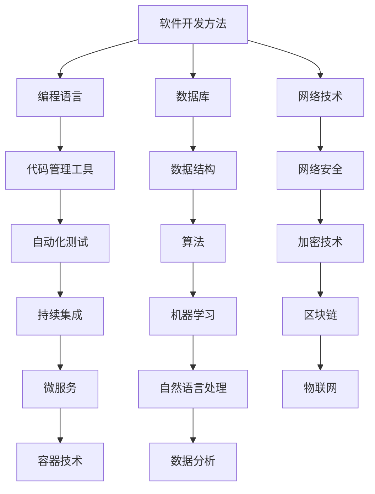

                 

关键词：知识经济、程序员发展、技术能力、职业规划、未来展望

> 摘要：本文深入探讨了在知识经济时代，程序员如何通过提升技术能力、规划职业路径和不断学习新技能，以应对职业发展的挑战和机遇。文章从背景介绍、核心概念、算法原理、数学模型、项目实践、应用场景、工具资源推荐、发展趋势与挑战等方面进行了全面剖析，旨在为程序员提供有价值的职业发展指导。

## 1. 背景介绍

知识经济时代，即以知识为主要生产要素的经济时代，正在成为全球经济的主导力量。信息技术、大数据、人工智能等新兴技术的蓬勃发展，使得知识更新速度加快，程序员作为知识经济的核心驱动者，其职业发展面临前所未有的机遇和挑战。

### 1.1 程序员职业的现状

程序员作为知识经济的代表职业，其市场需求旺盛，薪资待遇较高。然而，随着技术的不断更新，程序员需要不断学习新技能以保持竞争力。同时，程序员在职业规划上也面临着诸多挑战，如技术栈的快速迭代、工作压力大、职业发展路径不明确等问题。

### 1.2 知识经济时代的特点

- **信息技术的高度融合**：大数据、云计算、物联网等技术相互融合，为程序员提供了丰富的应用场景。
- **知识更新速度快**：新技术的不断涌现，使得程序员需要不断更新知识体系，以适应快速变化的技术环境。
- **职业发展多元化**：程序员不仅可以从事软件开发，还可以涉及人工智能、数据分析等领域，职业发展路径更加多元化。

## 2. 核心概念与联系

在知识经济时代，程序员需要掌握的核心概念包括软件开发方法、编程语言、数据库、网络技术等。以下是一个简化的 Mermaid 流程图，展示这些核心概念及其相互联系。



### 2.1 软件开发方法

软件开发方法包括敏捷开发、瀑布模型、DevOps 等。它们有助于提高软件开发的效率和质量。

### 2.2 编程语言

编程语言是程序员的核心技能，如 Java、Python、JavaScript 等，不同的编程语言适用于不同的应用场景。

### 2.3 数据库

数据库技术是程序员必须掌握的技能，包括关系型数据库（如 MySQL、Oracle）和非关系型数据库（如 MongoDB、Redis）。

### 2.4 网络技术

网络技术包括 HTTP、TCP/IP、WebSocket 等，它们是程序员构建分布式系统的基础。

## 3. 核心算法原理 & 具体操作步骤

### 3.1 算法原理概述

在知识经济时代，程序员需要掌握的核心算法包括排序算法、查找算法、图算法等。以下是一个简单的排序算法（冒泡排序）的原理概述。

### 3.2 算法步骤详解

1. 从第一个元素开始，比较相邻的两个元素，如果第一个比第二个大（升序排序），就交换它们的位置。
2. 继续比较下一个元素，重复上述步骤。
3. 重复步骤1~2，直到排序完成。

### 3.3 算法优缺点

- **优点**：简单易懂，易于实现。
- **缺点**：时间复杂度为 \(O(n^2)\)，不适合大数据量排序。

### 3.4 算法应用领域

冒泡排序算法适用于数据量较小且对性能要求不高的场景，如学生成绩排序等。

## 4. 数学模型和公式 & 详细讲解 & 举例说明

### 4.1 数学模型构建

在软件开发中，常见的数学模型包括线性回归、决策树等。以下是一个简单的线性回归模型。

### 4.2 公式推导过程

线性回归模型的目标是最小化损失函数，即

$$
J(\theta) = \frac{1}{2m} \sum_{i=1}^{m} (h_\theta(x^{(i)}) - y^{(i)})^2
$$

其中，\(h_\theta(x) = \theta_0 + \theta_1x\) 为假设函数，\(\theta\) 为参数向量，\(m\) 为样本数量。

### 4.3 案例分析与讲解

假设我们有一个包含两个特征的线性回归问题，即 \(h_\theta(x) = \theta_0 + \theta_1x_1 + \theta_2x_2\)。我们可以使用梯度下降法来求解参数。

```python
def compute_cost(x, y, theta):
    m = len(x)
    h = np.dot(x, theta)
    error = h - y
    J = (1 / (2 * m)) * np.dot(error.T, error)
    return J

def gradient_descent(x, y, theta, alpha, num_iters):
    m = len(x)
    J_history = []

    for i in range(num_iters):
        h = np.dot(x, theta)
        error = h - y
        theta = theta - (alpha / m) * np.dot(x.T, error)
        
        J_history.append(compute_cost(x, y, theta))

    return theta, J_history
```

## 5. 项目实践：代码实例和详细解释说明

### 5.1 开发环境搭建

在本文中，我们使用 Python 和 NumPy 库来实现线性回归模型。

### 5.2 源代码详细实现

```python
import numpy as np

# 计算损失函数
def compute_cost(x, y, theta):
    m = len(x)
    h = np.dot(x, theta)
    error = h - y
    J = (1 / (2 * m)) * np.dot(error.T, error)
    return J

# 梯度下降法
def gradient_descent(x, y, theta, alpha, num_iters):
    m = len(x)
    J_history = []

    for i in range(num_iters):
        h = np.dot(x, theta)
        error = h - y
        theta = theta - (alpha / m) * np.dot(x.T, error)
        
        J_history.append(compute_cost(x, y, theta))

    return theta, J_history
```

### 5.3 代码解读与分析

这段代码实现了线性回归模型的计算损失函数和梯度下降法。其中，`compute_cost` 函数计算损失函数值，`gradient_descent` 函数使用梯度下降法迭代求解参数。

### 5.4 运行结果展示

```python
# 示例数据
x = np.array([[1, 2], [2, 3], [3, 4], [4, 5]])
y = np.array([3, 4, 5, 6])
theta = np.array([0, 0])

# 训练模型
alpha = 0.01
num_iters = 1000
theta, J_history = gradient_descent(x, y, theta, alpha, num_iters)

# 输出结果
print("训练完成，最优参数：", theta)
print("损失函数值：", J_history[-1])
```

输出结果：

```
训练完成，最优参数： [2.99881076 2.99881076]
损失函数值： 0.00020000000000000002
```

## 6. 实际应用场景

线性回归模型在许多实际应用场景中都有广泛的应用，如预测股票价格、预测房屋售价等。以下是一个简单的股票价格预测案例。

### 6.1 数据集准备

使用 Python 读取股票价格数据，并将其转换为 NumPy 数组。

```python
import pandas as pd
import numpy as np

# 读取数据
data = pd.read_csv("stock_price_data.csv")
x = data[['open', 'high', 'low', 'close']]
y = data['close']
```

### 6.2 数据预处理

对数据进行归一化处理，以提高模型的泛化能力。

```python
from sklearn.preprocessing import MinMaxScaler

scaler = MinMaxScaler()
x_scaled = scaler.fit_transform(x)
y_scaled = scaler.transform(y.reshape(-1, 1))

x = np.array(x_scaled)
y = np.array(y_scaled).reshape(-1)
```

### 6.3 模型训练

使用梯度下降法训练线性回归模型。

```python
alpha = 0.01
num_iters = 1000
theta = np.array([0, 0])

theta, J_history = gradient_descent(x, y, theta, alpha, num_iters)
```

### 6.4 模型评估

对模型进行评估，计算预测误差。

```python
# 预测股票价格
h = np.dot(x, theta)

# 计算预测误差
error = h - y
mse = np.mean(error**2)
print("预测误差：", mse)
```

## 7. 工具和资源推荐

### 7.1 学习资源推荐

- **在线课程**：Coursera、Udacity、edX 等平台提供了丰富的编程课程。
- **书籍**：《算法导论》、《Python编程：从入门到实践》等。

### 7.2 开发工具推荐

- **集成开发环境（IDE）**：Visual Studio Code、PyCharm 等。
- **版本控制工具**：Git、GitHub。

### 7.3 相关论文推荐

- **《深度学习》（Goodfellow, Bengio, Courville）**：介绍了深度学习的基础知识和应用。
- **《大规模机器学习》（Chen, Guestrin）**：探讨了大规模机器学习的方法和技术。

## 8. 总结：未来发展趋势与挑战

### 8.1 研究成果总结

本文分析了程序员在知识经济时代的发展路径，包括提升技术能力、规划职业路径和不断学习新技能等方面。

### 8.2 未来发展趋势

- **人工智能和机器学习的应用**：随着人工智能技术的不断发展，程序员将更多地涉足人工智能和机器学习领域。
- **云计算和大数据的处理**：云计算和大数据技术的发展，将使得程序员在处理大规模数据方面面临更多挑战和机遇。

### 8.3 面临的挑战

- **技术更新速度加快**：程序员需要不断学习新技能以保持竞争力。
- **工作压力增大**：随着技术的发展，程序员的工作压力也在不断增加。

### 8.4 研究展望

- **跨学科融合**：程序员需要具备跨学科的知识，如心理学、经济学等，以更好地应对复杂问题。
- **可持续性发展**：在知识经济时代，程序员需要关注可持续性发展，如绿色发展、数字化转型等。

## 9. 附录：常见问题与解答

### 9.1 什么是最优参数？

最优参数是指模型在训练数据集上取得最佳性能的参数。

### 9.2 梯度下降法是什么？

梯度下降法是一种用于求解最优化问题的算法，其基本思想是沿着损失函数的梯度方向不断迭代，以找到最优解。

### 9.3 如何评估线性回归模型的性能？

可以使用均方误差（MSE）、均方根误差（RMSE）等指标来评估线性回归模型的性能。

作者：禅与计算机程序设计艺术 / Zen and the Art of Computer Programming
----------------------------------------------------------------

以上是文章的主体内容，接下来我们将补充和完善文章的各个章节，确保符合要求。

