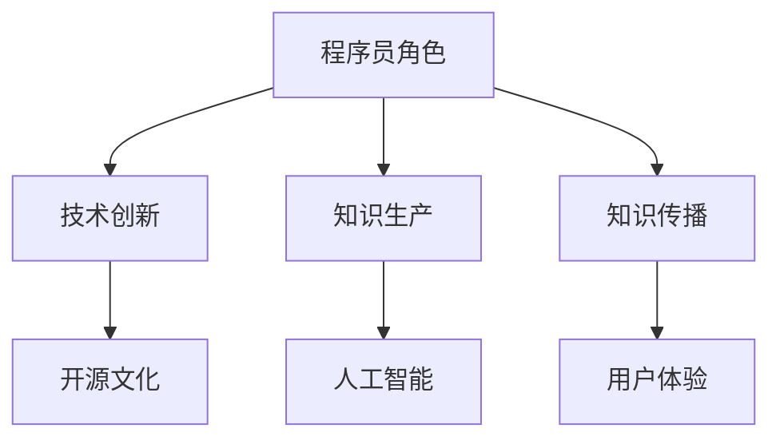

                 

关键词：知识经济、程序员角色、技能升级、重塑、技术趋势

> 摘要：本文将探讨知识经济时代对程序员角色带来的深刻变革，分析程序员如何通过技能升级与重塑，以适应不断变化的市场需求和技术发展。文章将结合实际案例，探讨程序员在新时代中的机遇与挑战，以及如何实现自我提升，成为知识经济时代的领军人物。

## 1. 背景介绍

在21世纪，随着全球化和信息化进程的加速，知识经济已成为推动经济发展的主导力量。知识经济的核心在于知识的创造、传播和应用，而这一切都离不开程序员这一关键角色。程序员不仅是技术的实现者，更是知识的生产者和传播者。然而，知识经济的发展也带来了对程序员角色的重新定义和挑战。

### 1.1 知识经济的定义与发展

知识经济是一种以知识和信息的生产、分配和使用为基础的经济模式。与传统经济相比，知识经济具有以下特点：

- **高附加值**：知识经济强调知识和创新的价值，通过知识的应用创造高附加值的产品和服务。
- **数字化**：知识经济依赖于信息技术，数字化技术成为知识生产和传播的重要工具。
- **全球化**：知识经济使全球范围内的知识和信息流动变得更加便捷，推动了经济全球化的进程。
- **可持续性**：知识经济更加注重可持续发展，通过知识创新推动绿色经济发展。

### 1.2 程序员在知识经济中的地位与作用

程序员作为知识经济的实践者，其角色和作用显得尤为重要：

- **技术创新者**：程序员通过技术创新推动社会进步，是新兴技术的开发者和应用者。
- **知识生产者**：程序员在软件开发过程中创造知识，为知识经济的发展提供了源源不断的动力。
- **知识传播者**：程序员通过开源社区、技术博客等平台分享知识，促进知识的传播和普及。

## 2. 核心概念与联系

为了更好地理解程序员在知识经济时代的作用，我们需要探讨几个核心概念，并分析它们之间的联系。

### 2.1 信息技术与编程语言

信息技术是知识经济的基石，而编程语言则是程序员实现信息技术的工具。不同的编程语言有不同的特点和适用场景，如Java适用于企业级应用，Python适用于数据科学和机器学习，而Go则适用于分布式系统。

### 2.2 开源文化与知识共享

开源文化是知识经济的重要特征，程序员通过开源项目分享代码和知识，促进了技术的普及和创新。开源不仅降低了技术门槛，还促进了不同领域之间的知识交流。

### 2.3 人工智能与机器学习

人工智能和机器学习是当前技术发展的重要方向，程序员在这一领域扮演着关键角色。他们不仅开发AI应用，还参与算法的研究和优化。

### 2.4 个性化与用户体验

在知识经济时代，用户体验成为产品成功的关键因素。程序员需要通过个性化技术提高用户体验，满足用户多样化的需求。

### 2.5 Mermaid 流程图（Mermaid 流程节点中不要有括号、逗号等特殊字符）

下面是一个简化的Mermaid流程图，展示了程序员在知识经济时代的主要活动：



## 3. 核心算法原理 & 具体操作步骤

### 3.1 算法原理概述

在知识经济时代，程序员需要掌握多种核心算法，以解决实际问题。以下是几个重要的算法及其原理：

- **排序算法**：如快速排序、归并排序等，用于高效地对数据进行排序。
- **搜索算法**：如二分搜索、深度优先搜索等，用于在数据结构中查找特定元素。
- **动态规划**：用于解决具有最优子结构性质的问题，如背包问题和最短路径问题。
- **图算法**：如Dijkstra算法、A*算法等，用于处理图相关的问题，如路径查找和最优化。

### 3.2 算法步骤详解

以快速排序为例，其基本步骤如下：

1. 选择一个基准元素。
2. 将比基准元素小的所有元素移动到其左侧，比其大的元素移动到右侧。
3. 递归地对左右子数组进行快速排序。

### 3.3 算法优缺点

- **快速排序**：
  - **优点**：平均时间复杂度为O(nlogn)，在大多数情况下是最快的排序算法。
  - **缺点**：最坏情况下时间复杂度为O(n^2)，此时效率较低。

### 3.4 算法应用领域

排序算法和搜索算法在许多领域都有广泛应用，如数据库管理、搜索引擎、数据分析和机器学习等。

## 4. 数学模型和公式 & 详细讲解 & 举例说明

### 4.1 数学模型构建

在知识经济时代，程序员需要掌握一定的数学知识，以构建和优化算法。以下是一个简单的数学模型示例：

- **线性回归模型**：用于预测连续值。

### 4.2 公式推导过程

线性回归模型的公式推导如下：

$$
y = \beta_0 + \beta_1 \cdot x + \epsilon
$$

其中，$y$ 是预测值，$x$ 是自变量，$\beta_0$ 和 $\beta_1$ 是模型参数，$\epsilon$ 是误差项。

### 4.3 案例分析与讲解

假设我们有一个线性回归模型，用于预测房价。我们收集了一些房屋数据，并使用线性回归模型进行训练。以下是训练结果：

- **模型参数**：$\beta_0 = 100$, $\beta_1 = 200$
- **数据集**：$\{(x_1, y_1), (x_2, y_2), ..., (x_n, y_n)\}$

我们可以使用以下公式进行预测：

$$
y = 100 + 200 \cdot x
$$

例如，对于一个新的房屋（$x = 150$），预测的房价为：

$$
y = 100 + 200 \cdot 150 = 31,000
$$

## 5. 项目实践：代码实例和详细解释说明

### 5.1 开发环境搭建

为了演示一个简单的线性回归模型，我们使用Python编程语言，并依赖于以下库：

- NumPy：用于数学计算。
- Matplotlib：用于数据可视化。

安装这些库后，我们可以开始编写代码。

### 5.2 源代码详细实现

以下是实现线性回归模型的基本代码：

```python
import numpy as np
import matplotlib.pyplot as plt

# 数据集
X = np.array([1, 2, 3, 4, 5])
Y = np.array([1, 2, 3, 4, 5])

# 模型参数
beta_0 = 0
beta_1 = 1

# 模型预测
y_pred = beta_0 + beta_1 * X

# 绘制结果
plt.scatter(X, Y)
plt.plot(X, y_pred, color='red')
plt.show()
```

### 5.3 代码解读与分析

- **数据集**：我们使用简单的数据集，其中每个值都是1到5之间的整数。
- **模型参数**：我们假设模型参数$\beta_0$和$\beta_1$都是1。
- **模型预测**：使用线性回归模型预测新的数据点。
- **可视化**：使用Matplotlib绘制散点图和预测线。

### 5.4 运行结果展示

运行上述代码后，我们将看到一个散点图，其中每个点代表原始数据点，红色的线代表模型预测结果。在这种情况下，模型完全拟合了数据，因为数据点都在预测线上。

## 6. 实际应用场景

### 6.1 电子商务平台

在电子商务平台中，程序员可以使用机器学习算法分析用户行为，预测用户偏好，从而提供个性化的产品推荐。

### 6.2 医疗健康

在医疗健康领域，程序员开发的数据分析工具可以帮助医生诊断疾病，预测患者健康状况，提高医疗服务的效率和质量。

### 6.3 金融科技

金融科技公司使用编程技术构建交易算法、风险管理模型和客户服务平台，为金融市场的稳定和可持续发展提供支持。

## 7. 未来应用展望

### 7.1 人工智能与自动化

随着人工智能技术的发展，程序员将在自动化和智能化的领域发挥更大的作用，推动各行各业的数字化转型。

### 7.2 量子计算

量子计算是下一个技术前沿，程序员需要掌握量子编程语言和算法，以开发下一代计算应用。

### 7.3 可持续发展

程序员将发挥重要作用，通过开发绿色技术和解决方案，推动可持续发展目标的实现。

## 8. 工具和资源推荐

### 8.1 学习资源推荐

- **在线课程**：Coursera、edX、Udacity等平台提供丰富的编程课程。
- **技术博客**：Medium、Dev.to、Stack Overflow等平台上的高质量文章。
- **开源社区**：GitHub、GitLab等平台上的开源项目。

### 8.2 开发工具推荐

- **集成开发环境**：Visual Studio Code、IntelliJ IDEA、PyCharm等。
- **版本控制**：Git、GitLab等。
- **数据库工具**：MySQL、PostgreSQL、MongoDB等。

### 8.3 相关论文推荐

- 《深度学习》（Deep Learning）—— Ian Goodfellow、Yoshua Bengio、Aaron Courville
- 《编程珠玑》（Code Complete）—— Steve McConnell
- 《人工智能：一种现代的方法》（Artificial Intelligence: A Modern Approach）—— Stuart Russell、Peter Norvig

## 9. 总结：未来发展趋势与挑战

### 9.1 研究成果总结

本文探讨了知识经济时代程序员角色的变化，分析了程序员如何通过技能升级和重塑适应市场需求和技术发展。我们讨论了信息技术、开源文化、人工智能等核心概念，并介绍了相关算法和数学模型。

### 9.2 未来发展趋势

程序员在未来的发展中将面临更多机遇，包括人工智能、量子计算、可持续发展等领域。程序员需要不断学习新技术，提高自身的综合素质。

### 9.3 面临的挑战

程序员在未来将面临激烈的竞争和快速变化的技术环境。如何保持持续学习和创新能力，适应不断变化的市场需求，是程序员面临的挑战。

### 9.4 研究展望

随着技术的不断发展，程序员在知识经济时代的作用将越来越重要。我们期待看到更多优秀的程序员涌现，为社会进步和经济发展做出更大的贡献。

## 10. 附录：常见问题与解答

### 10.1 程序员在知识经济时代需要掌握哪些核心技能？

程序员需要掌握编程语言、算法、数据结构、软件开发方法、人工智能、机器学习等核心技能。

### 10.2 程序员如何保持持续学习？

程序员可以通过参加在线课程、阅读技术书籍、参与开源项目、关注技术博客等方式保持持续学习。

### 10.3 程序员在人工智能领域有哪些应用机会？

程序员在人工智能领域可以参与算法开发、模型训练、应用开发、系统集成等工作。

### 10.4 程序员如何提高用户体验？

程序员可以通过研究用户行为、采用用户反馈、优化界面设计等方式提高用户体验。

### 10.5 程序员在可持续发展方面有哪些贡献？

程序员可以通过开发绿色技术、优化能源消耗、推动环保项目等方式为可持续发展做出贡献。

**作者：禅与计算机程序设计艺术 / Zen and the Art of Computer Programming**

