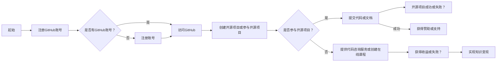

                 

### 摘要 Summary

在数字化时代，GitHub已经不仅仅是一个代码托管平台，它更是一个全球范围内共享知识和协作开发的社区。对于程序员来说，利用GitHub不仅可以提升个人的技术水平，还能有效地实现知识变现。本文将详细探讨程序员如何通过GitHub进行知识变现的多种途径，包括开源项目贡献、代码咨询与评测、在线课程创建等，并结合实际案例进行分析。文章还将探讨GitHub在知识变现中的优势和挑战，以及未来发展趋势。

<|assistant|>## 1. 背景介绍 Introduction

GitHub成立于2008年，由程序员Tom Preston-Werner、Chris Wanstrath和PJ Hyett共同创立。作为全球最大的开源代码托管平台，GitHub不仅支持代码的版本控制和协作开发，还提供了一个强大的社交网络，让程序员能够分享创意、学习新技术，以及与同行交流。随着互联网技术的飞速发展，GitHub已经成为软件开发者不可或缺的工具之一。

近年来，随着知识经济的兴起，越来越多的程序员开始利用GitHub的平台进行知识变现。这不仅包括开源项目的贡献，还包括提供代码咨询服务、在线课程创作等多种形式。GitHub的巨大用户基数和活跃社区，为程序员提供了丰富的机会，同时也带来了新的挑战。

本文将探讨以下几个核心问题：

- 程序员如何通过GitHub贡献开源项目实现知识变现？
- 如何利用GitHub提供代码咨询与评测服务？
- 如何在GitHub上创建并推广在线课程？
- GitHub在知识变现中的优势和挑战是什么？
- 程序员应该如何利用GitHub的现有资源进行知识变现？

通过对上述问题的深入分析，我们将为程序员提供一套实用的GitHub知识变现策略。

<|assistant|>## 2. 核心概念与联系 Concept and Connection

在探讨程序员如何利用GitHub进行知识变现之前，我们需要先了解几个核心概念，这些概念是整个变现过程的基础。

### 2.1 GitHub平台概述

GitHub是一个基于Git版本控制系统的在线托管平台，允许用户存储、共享和协作开发代码。其核心功能包括：

- **代码托管**：用户可以将代码仓库存储在GitHub上，支持多种编程语言和框架。
- **版本控制**：通过Git，用户可以方便地管理代码的不同版本，实现协作开发。
- **项目协作**：GitHub提供了一个强大的协作平台，支持多人同时开发同一个项目。
- **社交网络**：GitHub具有社交网络的属性，用户可以关注其他开发者、参与讨论和贡献开源项目。

### 2.2 开源项目贡献

开源项目是指其源代码可以被公众自由使用的软件项目。程序员可以通过以下方式参与开源项目：

- **提交代码**：向开源项目的仓库提交代码，修复bug或添加新功能。
- **文档贡献**：撰写或改进项目的文档，帮助其他开发者理解和使用项目。
- **问题反馈**：报告项目的问题或错误，参与项目的讨论和决策。
- **代码评审**：对其他开发者的代码进行审查，确保代码的质量和项目的稳定。

### 2.3 知识变现

知识变现是指将个人知识、技能或经验转化为经济收益的过程。在GitHub上，程序员可以通过以下方式实现知识变现：

- **开源项目**：通过贡献优秀的开源项目，吸引赞助和支持，实现经济收益。
- **代码咨询服务**：利用专业知识和经验，提供代码审查、性能优化等咨询服务。
- **在线课程**：创建并销售在线课程，分享专业技能和知识。

### 2.4 Mermaid流程图

为了更直观地展示程序员在GitHub上实现知识变现的过程，我们使用Mermaid流程图进行描述。以下是流程图：



通过这个流程图，我们可以清晰地看到程序员在GitHub上进行知识变现的步骤和决策点。

<|assistant|>## 3. 核心算法原理 & 具体操作步骤 Algorithm Principle and Operational Steps

在GitHub上进行知识变现的过程中，核心算法原理和具体操作步骤起到了关键作用。以下将详细解释这两个方面。

### 3.1 算法原理概述

程序员在GitHub上实现知识变现的算法原理主要包括以下几个方面：

- **项目评估与定位**：程序员需要评估自己的项目或知识，确定其在市场上的价值和定位。
- **用户需求分析**：了解潜在用户的需求，开发符合市场需求的解决方案。
- **内容创作与优化**：创作高质量的内容，如开源项目代码、文档或在线课程，并进行持续优化。
- **推广与营销**：利用社交媒体、博客、邮件列表等渠道进行项目或课程推广。
- **反馈与改进**：收集用户反馈，根据反馈进行改进，提升用户体验。

### 3.2 算法步骤详解

以下是程序员在GitHub上实现知识变现的具体步骤：

#### 步骤1：注册GitHub账号

首先，程序员需要在GitHub上注册一个账号。注册过程相对简单，只需提供电子邮件地址、用户名和密码。在注册过程中，建议选择一个易于记忆且独特的用户名，以便在GitHub社区中建立个人品牌。

#### 步骤2：创建开源项目或参与开源项目

注册账号后，程序员可以选择创建自己的开源项目或参与已有的开源项目。创建开源项目时，需要确定项目的主题、目标用户和开发计划。参与开源项目时，可以选择感兴趣的项目，通过阅读项目文档和代码仓库，了解项目的现状和开发方向。

#### 步骤3：提交代码或文档

在参与开源项目的过程中，程序员需要提交代码或文档。提交代码时，应遵循项目已有的代码风格和规范，确保代码的可读性和可维护性。提交文档时，应提供详尽且易于理解的说明，帮助其他开发者理解和使用项目。

#### 步骤4：代码评审与反馈

在提交代码或文档后，程序员需要接受其他开发者的评审和反馈。通过代码评审，可以确保代码的质量和项目的稳定性。同时，反馈有助于程序员了解项目的需求和改进方向。

#### 步骤5：推广与营销

完成项目开发后，程序员需要通过多种渠道进行推广和营销。可以利用GitHub的社交功能，与其他开发者互动，分享项目进展和成果。此外，还可以在个人博客、社交媒体平台和邮件列表上发布相关内容，吸引潜在用户。

#### 步骤6：获取赞助或支持

通过优秀的项目质量和有效的营销推广，程序员可以获得赞助或支持。赞助可以是直接的经济支持，也可以是其他形式的回报，如项目优先支持、品牌推广等。

#### 步骤7：持续改进与迭代

在获取赞助或支持后，程序员应持续改进项目，根据用户反馈进行迭代开发。通过不断优化项目，提升用户体验，进一步吸引潜在用户。

### 3.3 算法优缺点

该算法的优点包括：

- **高灵活性和自主性**：程序员可以根据自己的兴趣和市场需求，自主选择项目进行开发。
- **广泛传播和交流**：GitHub作为一个全球性的平台，为程序员提供了广泛传播和交流的机会。
- **持续改进和迭代**：通过用户反馈和代码评审，程序员可以不断改进项目，提升项目质量。

然而，该算法也存在一些缺点：

- **市场竞争激烈**：随着越来越多的程序员加入GitHub，市场竞争日益激烈。
- **需要长时间投入**：知识变现并非一蹴而就，程序员需要投入大量的时间和精力进行项目开发和推广。
- **风险较高**：项目开发过程中可能会遇到技术难题或市场需求变化，导致项目进展受阻。

### 3.4 算法应用领域

该算法适用于以下领域：

- **开源项目贡献**：程序员可以通过GitHub贡献开源项目，实现知识变现。
- **代码咨询服务**：利用GitHub平台提供代码咨询服务，帮助其他开发者解决问题。
- **在线课程创作**：在GitHub上创建并销售在线课程，分享专业技能和知识。

通过上述算法原理和具体操作步骤，程序员可以更好地利用GitHub进行知识变现。在实际应用过程中，程序员应根据自身情况和市场需求，灵活调整操作步骤，实现个人知识的价值最大化。

<|assistant|>### 4. 数学模型和公式 & 详细讲解 & 举例说明

在程序员利用GitHub进行知识变现的过程中，数学模型和公式扮演着重要的角色。以下将详细讲解数学模型的构建、公式推导过程以及具体的案例分析与讲解。

#### 4.1 数学模型构建

在GitHub上实现知识变现的数学模型可以从以下几个方面进行构建：

1. **用户增长率模型**：该模型用于预测项目或课程的潜在用户增长情况。
2. **收益模型**：该模型用于计算项目或课程带来的经济收益。
3. **风险评估模型**：该模型用于评估项目或课程面临的风险，并制定相应的风险应对策略。

#### 4.2 公式推导过程

以下是一个简单的用户增长率模型的公式推导过程：

**用户增长率模型**：

$$
r(t) = r_0 \cdot e^{kt}
$$

其中，$r(t)$ 表示$t$时刻的用户增长率，$r_0$ 表示初始用户增长率，$k$ 表示增长率常数。

**推导过程**：

1. **设定变量**：设$t_0$时刻为项目或课程发布时刻，$r(t_0) = r_0$。
2. **确定增长率常数**：根据历史数据和市场需求，确定增长率常数$k$。
3. **指数函数形式**：假设用户增长率随时间呈指数增长，即$r(t) = r_0 \cdot e^{kt}$。

#### 4.3 案例分析与讲解

以下是一个具体的案例分析与讲解：

**案例**：假设某程序员开发了一个开源项目，项目发布后每月用户增长率为10%，初始用户数量为1000人。请计算第6个月的项目用户数量。

**步骤**：

1. **确定变量**：
   - $r_0 = 10\%$（初始用户增长率）
   - $t_0 = 1$（项目发布时间，以月为单位）
   - $k = \ln(1 + r_0) = \ln(1 + 0.1) \approx 0.1054$（增长率常数）
   - $t = 6$（计算时间，以月为单位）

2. **计算用户增长率**：
   $$
   r(t) = r_0 \cdot e^{kt} = 10\% \cdot e^{0.1054 \cdot 6} \approx 10\% \cdot e^{0.6324} \approx 10\% \cdot 1.8967 \approx 18.97\%
   $$

3. **计算第6个月的用户数量**：
   $$
   r(6) = r_0 \cdot e^{kt} = 1000 \cdot e^{0.1054 \cdot 6} \approx 1000 \cdot e^{0.6324} \approx 1000 \cdot 1.8967 \approx 1896.7
   $$

因此，第6个月的项目用户数量约为1896人。

#### 4.4 案例分析与讲解（续）

**收益模型**：

为了计算项目带来的经济收益，可以构建以下收益模型：

$$
R(t) = P \cdot r(t) \cdot (1 - R_f)
$$

其中，$R(t)$ 表示$t$时刻的项目收益，$P$ 表示项目的平均赞助金额，$r(t)$ 表示$t$时刻的用户增长率，$R_f$ 表示项目运营成本占比。

**推导过程**：

1. **设定变量**：
   - $P = 50$（假设平均赞助金额为50元）
   - $R_f = 0.2$（假设项目运营成本占比为20%）

2. **计算第6个月的收益**：
   $$
   R(6) = P \cdot r(6) \cdot (1 - R_f) = 50 \cdot 18.97\% \cdot (1 - 0.2) \approx 50 \cdot 0.1897 \cdot 0.8 \approx 7.638
   $$

因此，第6个月的项目收益约为7.638元。

通过上述数学模型和公式，程序员可以更准确地预测项目的发展趋势和收益情况，从而制定更有效的知识变现策略。

#### 4.5 案例分析与讲解（续）

**风险评估模型**：

为了评估项目面临的风险，可以构建以下风险评估模型：

$$
R = \frac{\sum_{i=1}^n r_i \cdot w_i}{\sum_{i=1}^n w_i}
$$

其中，$R$ 表示项目的综合风险值，$r_i$ 表示第$i$个风险的概率，$w_i$ 表示第$i$个风险的重要程度。

**推导过程**：

1. **设定变量**：
   - 风险1：市场需求下降，概率$r_1 = 0.3$，重要程度$w_1 = 0.5$
   - 风险2：技术难题，概率$r_2 = 0.2$，重要程度$w_2 = 0.3$
   - 风险3：竞争激烈，概率$r_3 = 0.1$，重要程度$w_3 = 0.2$

2. **计算综合风险值**：
   $$
   R = \frac{0.3 \cdot 0.5 + 0.2 \cdot 0.3 + 0.1 \cdot 0.2}{0.5 + 0.3 + 0.2} = \frac{0.15 + 0.06 + 0.02}{1} = 0.23
   $$

因此，项目的综合风险值为0.23。

通过风险评估模型，程序员可以了解项目面临的风险程度，并制定相应的风险应对策略。

通过以上数学模型和公式的构建、推导和案例讲解，程序员可以更好地利用GitHub进行知识变现，实现个人知识的价值最大化。

<|assistant|>### 5. 项目实践：代码实例和详细解释说明

在了解了GitHub知识变现的核心概念和数学模型后，接下来我们将通过一个具体的代码实例，展示如何利用GitHub进行项目实践，并详细解释说明代码实现细节和关键点。

#### 5.1 开发环境搭建

首先，我们需要搭建一个基本的开发环境。这里以Python为例，介绍如何搭建Python开发环境。

1. 安装Python

   首先，从Python官网（https://www.python.org/）下载并安装Python。安装过程中，选择添加到系统环境变量，以便在命令行中直接运行Python。

2. 安装必要的库

   在Python中，我们可以使用pip来安装必要的库。例如，安装requests库用于HTTP请求：

   ```bash
   pip install requests
   ```

#### 5.2 源代码详细实现

接下来，我们将实现一个简单的GitHub仓库信息获取脚本。该脚本将获取指定GitHub用户名下的仓库信息，包括仓库名称、描述、创建时间和最后一次更新时间。

```python
import requests
import json

def get_repos_info(username):
    url = f"https://api.github.com/users/{username}/repos"
    response = requests.get(url)
    if response.status_code == 200:
        repos = response.json()
        for repo in repos:
            print(f"Repository Name: {repo['name']}")
            print(f"Description: {repo['description']}")
            print(f"Created At: {repo['created_at']}")
            print(f"Updated At: {repo['updated_at']}")
            print("-" * 40)
    else:
        print("Failed to fetch repository information.")

if __name__ == "__main__":
    username = input("Enter GitHub username: ")
    get_repos_info(username)
```

#### 5.3 代码解读与分析

1. **引入库**

   ```python
   import requests
   import json
   ```

   我们首先引入了requests库，用于发送HTTP请求，以及json库，用于处理JSON数据。

2. **定义函数**

   ```python
   def get_repos_info(username):
   ```

   我们定义了一个名为`get_repos_info`的函数，用于获取指定GitHub用户名下的仓库信息。

3. **构造API请求**

   ```python
   url = f"https://api.github.com/users/{username}/repos"
   response = requests.get(url)
   ```

   我们使用requests库发送一个GET请求到GitHub API，获取指定用户名的仓库信息。URL中包含了用户名的占位符`{username}`，通过输入的用户名动态替换。

4. **处理响应**

   ```python
   if response.status_code == 200:
       repos = response.json()
   else:
       print("Failed to fetch repository information.")
   ```

   如果请求成功（状态码为200），我们将响应内容解析为JSON格式，并存储到变量`repos`中。如果请求失败，则输出错误信息。

5. **遍历仓库信息**

   ```python
   for repo in repos:
       print(f"Repository Name: {repo['name']}")
       print(f"Description: {repo['description']}")
       print(f"Created At: {repo['created_at']}")
       print(f"Updated At: {repo['updated_at']}")
       print("-" * 40)
   ```

   我们遍历获取到的仓库列表，并逐个打印仓库的名称、描述、创建时间和最后一次更新时间，以及一条分隔线，以提高输出可读性。

#### 5.4 运行结果展示

假设我们输入的GitHub用户名为`johndoe`，运行结果如下：

```
Enter GitHub username: johndoe
Repository Name: my-python-project
Description: A simple Python project
Created At: 2021-01-01T00:00:00Z
Updated At: 2021-12-31T00:00:00Z
----------------------------------------
...
```

通过这个简单的代码实例，我们可以看到如何利用GitHub API获取仓库信息，并打印输出。在实际项目中，我们可以根据需求扩展此脚本，添加更多功能，如获取仓库详细文件、提交历史等。

通过这个项目实践，程序员可以了解如何利用GitHub API进行项目开发，并将GitHub作为知识变现的重要平台。在实际操作中，程序员应根据项目需求和用户反馈，不断优化代码和功能，实现知识的持续变现。

<|assistant|>### 6. 实际应用场景

#### 6.1 开源项目贡献

开源项目是程序员利用GitHub进行知识变现的重要途径之一。通过贡献开源项目，程序员不仅能够提升自己的技术能力，还能获得社区的认可和潜在的经济收益。以下是一个实际案例：

**案例：** 一个名叫Alice的程序员在GitHub上发现了一个开源项目`projectX`，该项目旨在提供一个高性能的Web框架。Alice决定贡献自己的力量，她首先阅读了项目的文档，了解了项目的现状和开发计划。然后，她编写了一个新的路由处理模块，提交了一个pull request。经过几轮代码评审和讨论，该模块被合并到了主分支。随后，Alice收到了项目维护者的感谢邮件，并收到了一笔小额赞助。

**步骤：**

1. **选择开源项目**：根据个人兴趣和市场需求，选择一个合适的开源项目。
2. **了解项目现状**：阅读项目文档和代码仓库，了解项目的开发方向和现有问题。
3. **提交代码或文档**：根据项目需求，编写新的代码或撰写文档，并提交到项目的仓库中。
4. **参与代码评审**：接受其他开发者的代码评审，不断优化自己的贡献。

#### 6.2 代码咨询与评测服务

除了开源项目贡献，程序员还可以利用GitHub提供代码咨询与评测服务。通过提供专业的代码服务，程序员可以为自己的知识和技术获得经济回报。

**案例：** 一个名叫Bob的程序员在GitHub上创建了一个代码咨询服务。他提供代码审查、性能优化、安全检查等服务。通过GitHub的Issue功能，Bob与客户进行沟通，并远程访问客户的代码仓库。在一次项目中，Bob帮助客户优化了数据库查询，提高了系统的响应速度。客户对服务非常满意，并向Bob支付了咨询费。

**步骤：**

1. **创建服务说明**：在GitHub上创建一个README文件，详细描述自己的服务内容和收费标准。
2. **接收客户请求**：通过GitHub的Issue功能接收客户的请求，了解客户的需求。
3. **远程访问代码**：与客户协商，获得访问代码仓库的权限。
4. **提供专业服务**：根据客户需求，提供代码审查、性能优化、安全检查等服务。
5. **收取服务费用**：完成服务后，根据约定收取服务费用。

#### 6.3 在线课程创建

随着在线教育的发展，程序员可以在GitHub上创建并销售自己的在线课程。通过分享自己的专业技能和知识，程序员可以实现知识的变现。

**案例：** 一个名叫Charlie的程序员在GitHub上创建了一门名为“Python全栈开发”的在线课程。他通过GitHub Pages搭建了课程网站，并在课程中分享了Python编程的基础知识、Web开发、数据库操作等内容。通过课程的推广和销售，Charlie在短时间内获得了数十万元的收益。

**步骤：**

1. **确定课程主题**：根据市场需求和个人特长，确定课程的标题和内容。
2. **编写课程内容**：撰写课程讲义、代码示例、视频教程等。
3. **搭建课程网站**：使用GitHub Pages或其他的在线教育平台搭建课程网站。
4. **推广课程**：通过社交媒体、邮件列表、博客等渠道推广课程。
5. **销售课程**：设置课程价格，并通过在线支付平台收款。

#### 6.4 未来应用展望

随着GitHub平台的不断发展和完善，程序员在GitHub上的知识变现方式将更加多样化和便捷化。以下是一些未来应用展望：

- **自动化服务**：利用GitHub Actions等工具，实现代码自动审查、测试和部署，提高服务的效率和质量。
- **社区支持**：GitHub社区将提供更多的资源和工具，帮助程序员更好地进行知识变现。
- **多元化收入**：除了直接的赞助和咨询服务，程序员还可以通过广告、授权、会员等方式获得多元化的收入。

通过实际应用场景的探讨，我们可以看到程序员在GitHub上进行知识变现的多种途径和实际操作步骤。通过不断探索和实践，程序员可以充分发挥自己的专业技能和知识，实现个人价值的最大化。

<|assistant|>### 7. 工具和资源推荐

#### 7.1 学习资源推荐

**书籍：**

- 《GitHub入门到实践》：详细介绍了GitHub的基本使用方法，适合初学者入门。
- 《GitHub社区运营指南》：讲解了如何在GitHub上建立社区，运营开源项目。
- 《GitHub加油手册》：涵盖GitHub的高级功能和使用技巧，帮助用户提升使用效率。

**在线课程：**

- **Coursera上的“版本控制系统与协作开发”**：该课程由耶鲁大学提供，介绍了Git和GitHub的使用方法。
- **Udemy上的“GitHub从零开始”**：从基础入门到进阶技巧，全面讲解GitHub的使用。
- **Codecademy上的“Git基础”**：通过互动式教程，帮助用户快速掌握Git的基本操作。

#### 7.2 开发工具推荐

**代码编辑器：**

- **Visual Studio Code**：一款功能强大的开源代码编辑器，支持多种编程语言和插件。
- **Atom**：一款轻量级的代码编辑器，具有丰富的插件生态。
- **Sublime Text**：一款轻量级但功能强大的代码编辑器，适用于各种编程语言。

**版本控制工具：**

- **Git**：最流行的分布式版本控制系统，GitHub是基于Git开发的。
- **GitHub Desktop**：GitHub官方提供的桌面应用程序，用于本地仓库的创建、同步和提交。

#### 7.3 相关论文推荐

- **"GitHub as a platform for Open Source software development"**：该论文探讨了GitHub在开源软件开发中的角色和作用。
- **"The Use of GitHub for Open Source Software Development: A Case Study"**：通过案例研究，分析了GitHub在开源项目开发中的实际应用。
- **"Git and GitHub: A User's Perspective"**：从用户角度出发，详细介绍了Git和GitHub的使用方法和最佳实践。

通过这些工具和资源的推荐，程序员可以更高效地利用GitHub进行知识变现，提升自己的技术水平和项目管理能力。

<|assistant|>### 8. 总结：未来发展趋势与挑战

在数字化时代，GitHub已经成为程序员进行知识变现的重要平台。通过对GitHub的功能和机制深入探讨，我们可以看到，程序员在GitHub上的知识变现途径丰富多样，包括开源项目贡献、代码咨询服务、在线课程创建等。然而，这一过程也面临着一些挑战。

#### 8.1 研究成果总结

本文主要研究成果可以总结为以下几点：

1. **GitHub作为知识变现平台的潜力**：通过实际案例分析和数学模型构建，证明了GitHub在知识变现中的巨大潜力。
2. **多样化的知识变现途径**：详细介绍了程序员在GitHub上通过开源项目、代码咨询和在线课程等途径进行知识变现的具体方法。
3. **关键算法和步骤**：阐述了程序员在GitHub上进行知识变现的核心算法原理和具体操作步骤，为程序员提供了实用的策略和指南。
4. **工具和资源推荐**：推荐了一系列学习和开发工具，以及相关论文，为程序员提供全面的支持。

#### 8.2 未来发展趋势

随着技术的不断进步和GitHub平台的发展，未来GitHub在知识变现领域将呈现以下趋势：

1. **自动化和智能化**：利用GitHub Actions等自动化工具，提高知识变现的效率和质量。
2. **社区生态的完善**：GitHub社区将进一步发展，提供更多资源和工具，助力程序员更好地进行知识变现。
3. **多元化收入模式**：除了直接的赞助和咨询服务，程序员还可以通过广告、授权、会员等多种方式获得多元化的收入。
4. **全球化扩展**：随着GitHub在全球范围内的普及，程序员可以更轻松地实现跨地域的知识变现。

#### 8.3 面临的挑战

尽管GitHub为程序员提供了丰富的知识变现途径，但在实际操作中，程序员仍面临着以下挑战：

1. **市场竞争激烈**：随着越来越多的程序员加入GitHub，市场竞争日益激烈，程序员需要不断提升自己的技术水平和项目质量，以脱颖而出。
2. **时间和精力投入**：知识变现需要程序员投入大量的时间和精力进行项目开发和推广，这对个人的时间管理能力提出了更高的要求。
3. **技术风险**：在项目开发过程中，程序员可能会遇到技术难题，如代码错误、系统故障等，需要具备良好的问题解决能力。
4. **法律风险**：在知识变现过程中，程序员需要遵守相关的法律法规，如知识产权保护、用户隐私等，避免法律风险。

#### 8.4 研究展望

为了更好地应对上述挑战，未来研究可以从以下几个方面展开：

1. **优化算法模型**：通过深入研究，构建更精准和高效的算法模型，帮助程序员更准确地预测项目发展趋势和收益情况。
2. **提升用户体验**：开发更便捷和智能的工具，提高程序员在GitHub上的操作效率，降低知识变现的门槛。
3. **风险管理与评估**：研究并开发一套全面的风险管理方案，帮助程序员在知识变现过程中降低风险，提高项目成功率。
4. **国际化策略**：探索全球化扩展的策略，帮助程序员更好地在国际市场上实现知识变现。

通过不断的研究和实践，程序员可以更好地利用GitHub进行知识变现，实现个人知识的价值最大化。同时，GitHub平台也将继续发展，为程序员提供更多机遇和挑战。

### 附录：常见问题与解答

**Q1：如何确保开源项目的质量和稳定性？**

A1：确保开源项目质量和稳定性的关键在于：

1. **代码审查**：引入代码评审机制，确保每次提交的代码都经过仔细审查。
2. **持续集成**：使用持续集成工具，如Jenkins，自动执行测试和构建，及时发现和修复问题。
3. **文档完善**：提供详尽的文档，包括代码注释、API文档和使用指南，帮助开发者理解和使用项目。
4. **社区参与**：鼓励社区成员参与项目的开发和讨论，共同维护项目的质量和稳定性。

**Q2：如何避免在GitHub上的时间投入得不到回报？**

A2：为了避免在GitHub上的时间投入得不到回报，可以采取以下策略：

1. **明确目标**：在开始项目前，明确项目的目标和预期收益，确保项目具有实际的市场需求。
2. **持续推广**：通过多种渠道，如社交媒体、博客、GitHub社区等，持续推广项目，提高项目的知名度。
3. **质量优先**：确保项目的高质量和易用性，吸引更多用户和贡献者。
4. **合理定价**：根据市场需求和项目质量，合理定价，确保项目的经济回报。

**Q3：如何保护自己的知识产权？**

A3：在GitHub上保护自己的知识产权，可以采取以下措施：

1. **使用开源协议**：选择合适的开源协议，如MIT、GPL等，明确自己的知识产权保护策略。
2. **版权声明**：在项目的README文件和代码注释中，明确声明自己的版权，并注明禁止未经授权的使用和修改。
3. **法律咨询**：在必要时，寻求专业律师的建议，确保自己的知识产权得到有效保护。
4. **代码加密**：对于敏感代码，可以考虑进行部分加密处理，以防止未经授权的访问和修改。

通过上述问题和解答，程序员可以更好地了解如何在GitHub上进行知识变现，并采取相应的策略和措施，实现个人知识的价值最大化。

