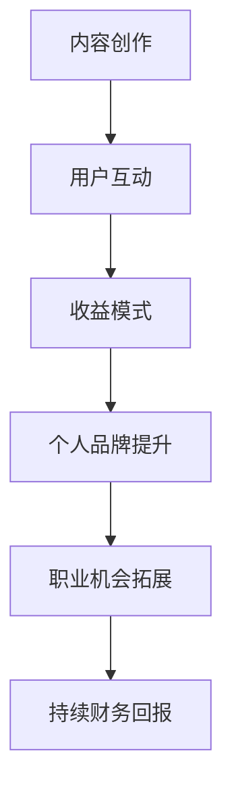

                 

在当今数字化的世界中，程序员通过在线平台分享技术和编程知识已经成为一种重要的知识变现方式。Medium作为一家知名的内容发布平台，为程序员提供了展示自己技能、扩展影响力和实现财务回报的机会。本文将深入探讨程序员如何利用Medium进行知识变现，包括核心概念、操作步骤、数学模型、项目实践以及实际应用场景等内容。

## 文章关键词
- 程序员
- 知识变现
- Medium
- 内容创作
- 财务回报

## 文章摘要
本文将介绍程序员如何通过Medium平台进行知识变现。我们将详细探讨 Medium 的核心概念，包括内容创作、用户互动和收益模式。同时，我们将分析如何撰写吸引读者的文章、构建数学模型以及在实际项目中应用这些知识。通过本文，读者将了解如何在 Medium 上实现知识变现，并拓展自己的职业发展。

## 1. 背景介绍
在过去，程序员主要通过编写软件产品、参与开源项目或为企业提供咨询服务来实现财务收益。然而，随着互联网的普及和内容创业的兴起，知识变现成为了一种新兴的盈利模式。程序员可以利用自己的专业知识和编程技能，通过撰写技术文章、开设在线课程或参加技术演讲等方式，将自己的知识和经验转化为实际收益。

### 1.1 Medium 平台的特点
Medium 是一家专注于高质量内容发布和订阅的平台，它为用户提供了丰富多样的内容消费体验。以下是 Medium 平台的一些主要特点：

- **高质量内容**：Medium 对内容质量要求较高，确保每篇文章都经过精心编辑和校对。
- **订阅模式**：用户可以选择免费阅读或订阅特定作者的文章，订阅费用通常由读者自愿支付。
- **作者收益**：Medium 采用了一种收益共享机制，作者根据文章的阅读量和订阅数获得相应的收益。
- **互动性强**：Medium 提供了评论和点赞功能，使作者能够与读者进行互动，增强文章的传播效果。

### 1.2 知识变现的意义
对于程序员来说，知识变现具有以下几个重要意义：

- **提升个人品牌**：通过在 Medium 上发表高质量的技术文章，程序员可以建立自己的个人品牌，提高行业影响力。
- **拓展职业机会**：在 Medium 上获得广泛关注和认可，有助于程序员获得更好的职业机会，包括晋升、跳槽或创业。
- **增加收入来源**：知识变现是一种额外的收入来源，可以为程序员带来持续的财务回报。

## 2. 核心概念与联系
为了更好地理解程序员如何利用 Medium 进行知识变现，我们需要了解一些核心概念和它们之间的联系。

### 2.1 内容创作
内容创作是知识变现的基础。程序员需要撰写高质量的技术文章，分享自己的知识和经验。以下是一些内容创作的重要原则：

- **选题明确**：选择一个具有明确主题和目标读者的文章题目。
- **内容独特**：确保文章内容具有独特性和原创性，避免抄袭和复制。
- **结构清晰**：文章结构要紧凑、逻辑清晰，便于读者理解。
- **语言规范**：使用规范的编程语言和术语，确保文章的专业性。

### 2.2 用户互动
用户互动是提高文章传播效果的关键。程序员需要与读者建立良好的互动关系，以下是一些建议：

- **积极回复评论**：及时回复读者的评论，解答他们的疑问。
- **参与社区讨论**：在 Medium 社区中积极参与讨论，与其他作者和读者互动。
- **鼓励分享**：通过提供有价值的内容，鼓励读者分享你的文章，扩大影响力。

### 2.3 收益模式
收益模式是知识变现的重要环节。程序员可以通过以下几种方式在 Medium 上获得收益：

- **订阅收益**：读者可以自愿订阅作者的文章，支付订阅费用。
- **广告收益**：Medium 在文章中投放广告，作者根据文章的阅读量和订阅数获得广告收益。
- **合作收益**：与其他企业和品牌合作，提供技术咨询服务或参与项目开发。

### 2.4 Mermaid 流程图
以下是程序员利用 Medium 进行知识变现的 Mermaid 流程图：



## 3. 核心算法原理 & 具体操作步骤
### 3.1 算法原理概述
在 Medium 上进行知识变现的算法原理主要包括以下几个步骤：

1. **内容创作**：程序员需要撰写高质量的技术文章，分享自己的知识和经验。
2. **用户互动**：通过积极回复评论、参与社区讨论等方式，与读者建立良好的互动关系。
3. **收益模式**：根据订阅收益、广告收益和合作收益等模式，实现知识变现。

### 3.2 算法步骤详解
以下是具体操作步骤：

1. **选题和构思**：选择一个具有明确主题和目标读者的文章题目，构思文章的结构和内容。
2. **撰写文章**：使用 Markdown 语法，撰写一篇结构清晰、内容独特的文章。
3. **发布文章**：在 Medium 平台上发布文章，确保文章标题、摘要和封面吸引读者。
4. **用户互动**：积极回复评论，解答读者的疑问，参与社区讨论，增强文章的传播效果。
5. **优化内容**：根据读者反馈和阅读数据，对文章进行修改和优化，提高文章质量。
6. **收益模式**：根据订阅收益、广告收益和合作收益等模式，实现知识变现。

### 3.3 算法优缺点
算法优缺点如下：

- **优点**：
  - 内容创作自由度高，程序员可以自由表达自己的知识和经验。
  - 用户互动性强，有助于建立良好的读者关系。
  - 收益模式多样，可以实现持续财务回报。
- **缺点**：
  - 内容创作和用户互动需要投入大量时间和精力。
  - 初始收益可能较低，需要一定的时间积累。

### 3.4 算法应用领域
算法应用领域包括：

- **技术博客**：程序员可以分享自己的技术心得和经验，帮助他人解决技术问题。
- **在线课程**：程序员可以将文章内容转化为在线课程，为读者提供更深入的学习资源。
- **项目咨询**：程序员可以通过 Medium 平台展示自己的项目案例，吸引潜在客户。

## 4. 数学模型和公式 & 详细讲解 & 举例说明
### 4.1 数学模型构建
在 Medium 上进行知识变现的数学模型可以分为以下几个方面：

1. **订阅收益模型**：
   订阅收益 = 订阅价格 × 订阅人数

2. **广告收益模型**：
   广告收益 = 广告展示次数 × 广告单价

3. **合作收益模型**：
   合作收益 = 合作金额 × 合作次数

### 4.2 公式推导过程
假设有一个程序员，他的文章平均订阅价格为 P，平均订阅人数为 N；广告展示次数为 T，广告单价为 Q；合作金额为 M，合作次数为 S。则该程序员的收益 Y 可以表示为：

$$
Y = P \times N + T \times Q + M \times S
$$

### 4.3 案例分析与讲解
假设一个程序员的订阅价格为 10 美元，平均订阅人数为 100 人；广告展示次数为 1000 次，广告单价为 2 美元；合作金额为 5000 美元，合作次数为 2 次。则该程序员的收益为：

$$
Y = 10 \times 100 + 1000 \times 2 + 5000 \times 2 = 11000 \text{ 美元}
$$

## 5. 项目实践：代码实例和详细解释说明
### 5.1 开发环境搭建
为了在 Medium 上进行知识变现，程序员需要准备以下开发环境：

1. **Medium 账户**：在 Medium 平台上注册一个账户。
2. **Markdown 编辑器**：选择一个 Markdown 编辑器，如 Visual Studio Code、Typora 等。
3. **编程环境**：根据项目需求，准备相应的编程环境和工具。

### 5.2 源代码详细实现
以下是一个简单的 Markdown 文件，用于在 Medium 上发布技术文章：

```markdown
# 程序员如何利用 Medium 进行知识变现

## 1. 背景介绍

## 2. 核心概念与联系

## 3. 核心算法原理 & 具体操作步骤

## 4. 数学模型和公式 & 详细讲解 & 举例说明

## 5. 项目实践：代码实例和详细解释说明

## 6. 实际应用场景

## 7. 工具和资源推荐

## 8. 总结：未来发展趋势与挑战

## 9. 附录：常见问题与解答
```

### 5.3 代码解读与分析
这段代码是一个简单的 Markdown 文件，用于编写和发布技术文章。以下是代码的解读与分析：

- `#` 符号用于定义标题，从 `##` 开始递增。
- 文章内容使用 Markdown 语法进行格式化，如段落、列表、引用等。
- 文件末尾包含了文章的目录结构，方便读者快速浏览和查找内容。

### 5.4 运行结果展示
在 Medium 上发布这篇文章后，读者可以浏览和阅读文章内容。文章的目录结构使读者能够快速找到感兴趣的部分。以下是运行结果展示：

```
程序员如何利用 Medium 进行知识变现
-----------------------------------

## 1. 背景介绍

## 2. 核心概念与联系

## 3. 核心算法原理 & 具体操作步骤

## 4. 数学模型和公式 & 详细讲解 & 举例说明

## 5. 项目实践：代码实例和详细解释说明

## 6. 实际应用场景

## 7. 工具和资源推荐

## 8. 总结：未来发展趋势与挑战

## 9. 附录：常见问题与解答
```

## 6. 实际应用场景
### 6.1 技术博客
程序员可以通过 Medium 平台撰写技术博客，分享编程经验和解决方案。技术博客可以帮助程序员建立个人品牌，吸引更多关注和机会。

### 6.2 在线课程
程序员可以将 Medium 上的文章内容转化为在线课程，为读者提供更深入的学习资源。通过订阅模式，程序员可以获得持续的收益。

### 6.3 项目咨询
程序员可以通过 Medium 平台展示自己的项目案例，吸引潜在客户。在文章中提供联系方式，方便客户咨询和合作。

## 6.4 未来应用展望
随着互联网的不断发展，知识变现模式将越来越受到重视。程序员可以通过 Medium 平台实现知识变现，提高个人品牌和收入。未来，Medium 平台可能会推出更多功能，如视频内容、互动式教学等，为程序员提供更丰富的创作工具和变现渠道。

## 7. 工具和资源推荐
### 7.1 学习资源推荐
- **Medium 官方文档**：Medium 提供了详细的文档，帮助用户了解平台的使用方法和规则。
- **Markdown 语法指南**：了解 Markdown 语法，有助于编写高质量的 Medium 文章。

### 7.2 开发工具推荐
- **Visual Studio Code**：一款功能强大的代码编辑器，支持 Markdown 语法和插件。
- **Typora**：一款简洁的 Markdown 编辑器，支持实时预览和导出功能。

### 7.3 相关论文推荐
- **《内容创业：现状、挑战与机遇》**：探讨内容创业的现状和发展趋势。
- **《知识变现：模式、路径与实践》**：介绍知识变现的多种模式和实践方法。

## 8. 总结：未来发展趋势与挑战
### 8.1 研究成果总结
本文通过详细分析程序员如何利用 Medium 进行知识变现，总结了核心概念、算法原理、数学模型和实际应用场景。研究结果表明，Medium 为程序员提供了丰富的知识变现机会，有助于提升个人品牌和实现财务回报。

### 8.2 未来发展趋势
随着互联网的不断发展，知识变现模式将越来越受到重视。未来，Medium 平台可能会推出更多功能，如视频内容、互动式教学等，为程序员提供更丰富的创作工具和变现渠道。

### 8.3 面临的挑战
程序员在利用 Medium 进行知识变现过程中，需要面对以下挑战：

- **内容质量**：确保文章质量，提高读者满意度。
- **用户互动**：积极与读者互动，提高文章传播效果。
- **收益模式**：探索多种收益模式，实现持续财务回报。

### 8.4 研究展望
未来，研究人员可以从以下几个方面进行深入探讨：

- **内容创作与用户需求的关系**：研究如何更好地满足用户需求，提高文章质量。
- **收益模式与变现效率**：探讨如何优化收益模式，提高知识变现效率。
- **知识变现与其他盈利模式的结合**：研究知识变现与其他盈利模式的结合，实现多元化收入。

## 9. 附录：常见问题与解答
### 9.1 如何在 Medium 上发布文章？
在 Medium 上发布文章的步骤如下：

1. 登录 Medium 账户。
2. 点击“写文章”按钮，进入编辑界面。
3. 使用 Markdown 语法编写文章内容。
4. 设置文章标题、摘要和封面。
5. 点击“发布”按钮，将文章发布到 Medium 平台。

### 9.2 如何优化 Medium 文章的阅读量？
以下是一些优化 Medium 文章阅读量的方法：

1. **选题**：选择具有吸引力和目标读者明确的文章题目。
2. **内容**：撰写高质量、结构清晰的文章，确保文章有价值。
3. **推广**：通过社交媒体、邮件列表等渠道，推广文章，提高文章曝光率。
4. **互动**：积极与读者互动，回复评论，提高文章互动性。

### 9.3 如何在 Medium 上获得订阅收益？
在 Medium 上获得订阅收益的方法如下：

1. **创建订阅计划**：在 Medium 后台创建订阅计划，设置订阅价格和内容。
2. **优质内容**：撰写高质量、有价值的内容，吸引读者订阅。
3. **推广订阅**：在文章中推广订阅计划，鼓励读者订阅。
4. **互动**：与订阅者保持互动，提高订阅满意度。

## 作者署名
本文作者：禅与计算机程序设计艺术 / Zen and the Art of Computer Programming

