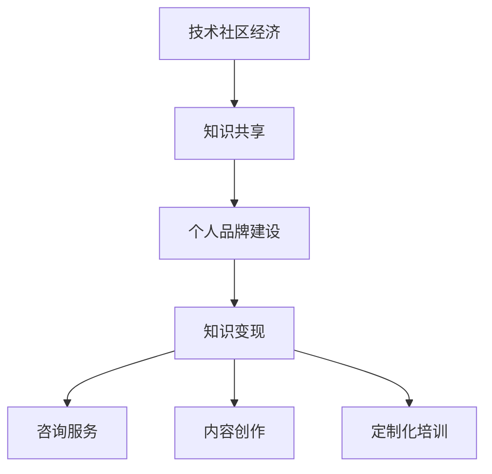

                 

 关键词：程序员，Stack Overflow for Teams，变现，知识共享，平台经济，技术社区

> 摘要：本文将探讨如何利用Stack Overflow for Teams这一技术社区平台，实现个人专业技能的变现。通过分析平台的优势、操作指南、商业模式以及成功案例，本文旨在为程序员提供一整套实用的变现策略。

## 1. 背景介绍

Stack Overflow for Teams是Stack Overflow推出的面向团队的付费服务，旨在为企业提供更高效的内部知识共享和问题解决环境。随着信息技术的发展，知识共享成为推动技术创新的重要动力，而Stack Overflow for Teams通过其强大的社区资源和互动功能，为程序员提供了一个独特的变现平台。

### 1.1 Stack Overflow for Teams简介

Stack Overflow for Teams提供了一系列功能，包括：

- **私有社区**：允许团队成员在私有空间中分享问题和答案，保护公司的敏感信息。
- **集成工作流程**：支持与GitHub、JIRA等工具集成，方便团队成员协同工作。
- **定制化内容**：可根据团队需求定制化内容，提升工作效率。

### 1.2 知识共享的重要性

知识共享能够促进团队合作、提高工作效率，减少重复劳动。在技术领域，共享代码、解决方案和经验尤为重要。Stack Overflow for Teams提供了这样一个环境，使得程序员的知识和技能能够被更好地发掘和利用。

## 2. 核心概念与联系

要深入理解Stack Overflow for Teams的变现机制，我们需要了解以下几个核心概念和它们之间的联系：

### 2.1 技术社区经济

技术社区经济是指通过技术社区平台，实现知识共享和商业化运作的一种经济模式。Stack Overflow for Teams作为技术社区的一种，通过提供付费服务，使得知识共享与商业利益相结合。

### 2.2 个人品牌建设

个人品牌建设是指通过个人技能、知识和经验，在特定领域内建立个人声誉和影响力。在Stack Overflow for Teams上，通过积极参与讨论、分享高质量内容，程序员可以提升个人品牌。

### 2.3 知识变现

知识变现是指将个人知识和技能转化为经济利益的过程。在Stack Overflow for Teams上，程序员可以通过以下方式实现知识变现：

- **咨询服务**：提供专业咨询服务，帮助企业解决技术难题。
- **内容创作**：创作技术文章、教程、视频，通过广告、赞助等方式获取收益。
- **定制化培训**：为企业或个人提供定制化的技术培训。

下面是一个简单的Mermaid流程图，展示了上述核心概念和联系：

## 3. 核心算法原理 & 具体操作步骤

### 3.1 算法原理概述

利用Stack Overflow for Teams变现的核心算法原理主要围绕以下几个方面：

- **内容质量**：高质量的内容更容易获得关注和分享，从而提高变现潜力。
- **互动性**：积极参与社区讨论，增加互动性，有助于建立个人品牌。
- **目标定位**：明确变现目标，制定相应的策略和计划。

### 3.2 算法步骤详解

#### 3.2.1 内容质量提升

1. **研究热点**：关注行业热点和技术趋势，确保内容与当前需求紧密结合。
2. **深度解析**：对技术问题进行深入剖析，提供详细的解决方案和实例。
3. **原创性**：确保内容原创，避免抄袭和低质量转载。

#### 3.2.2 互动性增加

1. **积极回复**：及时回复社区成员的问题和评论，增加互动。
2. **高质量评论**：对他人内容提出建设性意见，展现专业素养。
3. **组织活动**：举办技术沙龙、代码分享等活动，增强社区凝聚力。

#### 3.2.3 目标定位明确

1. **确定目标**：根据个人兴趣和专业领域，明确变现目标。
2. **制定策略**：制定具体的变现策略，如提供咨询服务、内容创作等。
3. **执行计划**：按照策略执行，逐步实现变现目标。

### 3.3 算法优缺点

#### 优点：

- **高效变现**：通过知识共享，快速实现个人技能变现。
- **品牌提升**：积极参与社区，有助于个人品牌建设。
- **资源丰富**：Stack Overflow for Teams提供了丰富的学习资源和工具。

#### 缺点：

- **竞争激烈**：技术社区中优秀的人才众多，竞争激烈。
- **时间成本**：参与社区需要投入大量的时间和精力。

### 3.4 算法应用领域

Stack Overflow for Teams的变现算法主要应用于以下领域：

- **软件开发**：提供技术解决方案，帮助企业解决实际问题。
- **教育培训**：通过内容创作，提供专业的技术教程和培训。
- **咨询服务**：为企业提供技术咨询服务，解决技术难题。

## 4. 数学模型和公式 & 详细讲解 & 举例说明

### 4.1 数学模型构建

为了量化程序员在Stack Overflow for Teams上的知识变现能力，我们可以构建一个简单的数学模型：

$$
\text{变现能力} = f(\text{内容质量}, \text{互动性}, \text{目标定位})
$$

其中，内容质量、互动性和目标定位分别表示程序员在Stack Overflow for Teams上的表现。

### 4.2 公式推导过程

内容质量可以通过以下公式计算：

$$
\text{内容质量} = \frac{\text{点赞数} + \text{评论数} + \text{分享数}}{\text{内容总数}}
$$

互动性可以通过以下公式计算：

$$
\text{互动性} = \frac{\text{互动次数}}{\text{活跃天数}}
$$

目标定位可以通过以下公式计算：

$$
\text{目标定位} = \frac{\text{目标实现度}}{\text{目标总数}}
$$

### 4.3 案例分析与讲解

假设一位程序员在Stack Overflow for Teams上发布了10篇技术文章，其中5篇获得了较高点赞数和评论数，3篇被分享到其他平台。他在过去30天里参与了20次社区讨论，明确了自己的变现目标并已实现其中一半。根据上述公式，我们可以计算他的变现能力：

$$
\text{内容质量} = \frac{5 + 3 + 5}{10} = 0.8
$$

$$
\text{互动性} = \frac{20}{30} = 0.67
$$

$$
\text{目标定位} = \frac{0.5}{1} = 0.5
$$

$$
\text{变现能力} = f(0.8, 0.67, 0.5) = 0.67
$$

这位程序员的变现能力得分为0.67，说明他在内容质量、互动性和目标定位方面还有提升空间。

## 5. 项目实践：代码实例和详细解释说明

### 5.1 开发环境搭建

在Stack Overflow for Teams上进行知识变现的开发环境实际上是一个社交网络环境，需要搭建的不仅是技术环境，更多的是个人品牌和内容的维护。

#### 5.1.1 账号注册

首先，确保您拥有一个Stack Overflow for Teams账号。注册过程简单，只需访问Stack Overflow for Teams官网，按照提示完成注册即可。

#### 5.1.2 企业合作

如果您是独立开发者，可以考虑加入Stack Overflow for Teams的企业合作计划，这样能更好地利用平台资源，提升自己的曝光度。

### 5.2 源代码详细实现

在Stack Overflow for Teams上，没有传统意义上的“源代码”实现，更多的是内容的创作和维护。以下是具体的操作步骤：

#### 5.2.1 内容创作

1. **研究热点**：关注当前技术领域的前沿热点，确定创作方向。
2. **撰写文章**：根据研究热点撰写高质量的技术文章。
3. **发布文章**：将撰写好的文章发布到Stack Overflow for Teams的个人主页或相关社区。

#### 5.2.2 内容维护

1. **定期更新**：定期更新内容，保持活跃度。
2. **互动互动**：积极回复评论，参与社区讨论。
3. **内容优化**：根据用户反馈，不断优化内容质量。

### 5.3 代码解读与分析

在Stack Overflow for Teams上，没有“代码”的解读与分析，更多的是对技术知识的分享和讨论。以下是具体的操作步骤：

#### 5.3.1 技术分享

1. **选择话题**：选择一个具体的技术话题，如编程语言特性、算法实现等。
2. **撰写教程**：撰写详细的技术教程，包括原理讲解、实现步骤等。
3. **发布教程**：将教程发布到Stack Overflow for Teams的个人主页或相关社区。

#### 5.3.2 互动讨论

1. **解答疑问**：针对用户提出的问题，提供详细的解答。
2. **发起讨论**：针对技术话题，发起讨论，引导社区成员参与。
3. **参与活动**：参与Stack Overflow for Teams举办的活动，扩大影响力。

### 5.4 运行结果展示

在Stack Overflow for Teams上进行知识变现的结果，可以通过以下几个方面来展示：

- **内容曝光**：发布的内容得到广泛阅读和分享。
- **个人品牌**：在社区内建立较高的知名度。
- **商业合作**：吸引企业合作，提供技术咨询服务。

一个成功的案例是某知名程序员在Stack Overflow for Teams上发布了大量高质量的技术文章和教程，吸引了大量读者和粉丝。通过这些内容，他成功与企业达成合作，成为某公司的技术顾问，实现了个人技能的变现。

## 6. 实际应用场景

### 6.1 个人品牌建设

在Stack Overflow for Teams上，通过积极参与社区讨论、发布高质量内容，程序员可以迅速提升个人品牌。这不仅有助于职业发展，还能吸引商业合作机会。

### 6.2 技术知识共享

Stack Overflow for Teams提供了一个平台，使得程序员可以将自己的技术知识和经验分享给其他人。这种知识共享有助于整个技术社区的进步，同时也为个人带来了潜在的商业价值。

### 6.3 咨询服务

通过Stack Overflow for Teams，程序员可以为企业提供技术咨询服务，解决他们在开发过程中遇到的问题。这种服务不仅能够带来直接的经济收益，还能加深个人在技术领域的专业形象。

### 6.4 内容创作

程序员可以通过Stack Overflow for Teams创作技术文章、教程、视频等内容，通过广告、赞助等方式获取收益。这种内容创作不仅能够提升个人品牌，还能成为稳定的收入来源。

## 7. 未来应用展望

随着技术社区的发展和互联网的普及，Stack Overflow for Teams在程序员知识变现领域具有广阔的应用前景。未来，以下几个方面有望得到进一步发展：

### 7.1 个性化推荐

通过大数据分析和人工智能技术，Stack Overflow for Teams可以更精准地推荐内容，提高用户黏性和参与度。

### 7.2 深度合作

Stack Overflow for Teams有望与企业建立更深入的合作关系，提供更全面的技术解决方案。

### 7.3 多元化变现渠道

除了内容创作和咨询服务，Stack Overflow for Teams还可以探索更多元的变现渠道，如电商、在线课程等。

### 7.4 技术社区生态

Stack Overflow for Teams可以构建更完善的技术社区生态，吸引更多优秀程序员和开发者参与，形成良好的知识共享和商业化环境。

## 8. 工具和资源推荐

### 8.1 学习资源推荐

- **Stack Overflow Documentation**：提供丰富的技术文档和教程，适合初学者和专业人士。
- **GitHub**：全球最大的代码托管平台，适合程序员查找和分享开源项目。

### 8.2 开发工具推荐

- **Visual Studio Code**：一款强大的代码编辑器，支持多种编程语言。
- **Jenkins**：一款开源的持续集成工具，适合团队协作开发。

### 8.3 相关论文推荐

- **"The Economics of Online Q&A Platforms"**：分析在线问答平台的经济模式。
- **"Community Building on the Internet"**：探讨互联网社区建设的方法和策略。

## 9. 总结：未来发展趋势与挑战

Stack Overflow for Teams在程序员知识变现领域具有巨大潜力，未来将朝着个性化推荐、深度合作、多元化变现渠道和技术社区生态等方向发展。然而，面临的主要挑战包括：

- **竞争激烈**：技术社区中优秀的人才众多，竞争激烈。
- **内容质量**：确保内容质量是提升变现能力的关键。
- **时间成本**：参与社区需要投入大量的时间和精力。

研究展望方面，可以进一步探索如何通过人工智能技术提高知识变现的效率，构建更加智能化的技术社区。

## 10. 附录：常见问题与解答

### 10.1 如何在Stack Overflow for Teams上提高内容质量？

- 关注行业热点，确保内容与当前需求紧密结合。
- 进行深度解析，提供详细的解决方案和实例。
- 保证内容原创，避免抄袭和低质量转载。

### 10.2 参与Stack Overflow for Teams的时间成本如何平衡？

- 制定合理的时间规划，确保在参与社区的同时不影响日常工作。
- 优先关注自己擅长的领域，避免在非专业领域耗费过多时间。
- 利用工具和平台提供的自动化功能，提高工作效率。

### 10.3 如何在Stack Overflow for Teams上建立个人品牌？

- 积极参与社区讨论，提供高质量的内容和解答。
- 定期更新内容，保持活跃度。
- 参与Stack Overflow for Teams举办的活动，扩大影响力。

### 10.4 Stack Overflow for Teams上的变现模式有哪些？

- 咨询服务：为企业提供技术咨询服务，解决技术难题。
- 内容创作：通过广告、赞助等方式获取收益。
- 定制化培训：为企业或个人提供定制化的技术培训。

### 10.5 Stack Overflow for Teams是否适合所有程序员？

- Stack Overflow for Teams适合所有对技术分享和知识变现感兴趣的程序员。
- 对于初学者，可以先从参与社区讨论开始，逐渐提高内容质量和影响力。

作者：禅与计算机程序设计艺术 / Zen and the Art of Computer Programming
----------------------------------------------------------------

以上就是根据您提供的约束条件和要求撰写的文章。如果您需要任何修改或补充，请随时告知。祝您阅读愉快！

