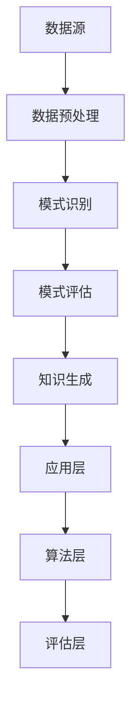

                 

关键词：知识发现引擎，决策能力，程序员，数据处理，算法优化，应用场景

> 摘要：本文将探讨程序员如何利用知识发现引擎提高自己的决策能力。通过介绍知识发现引擎的基本概念、工作原理及其在实际应用中的重要性，我们将深入分析知识发现引擎在程序员决策过程中的关键作用，并提出具体的实践方法和策略。读者将了解到如何通过知识发现引擎来优化数据处理、识别数据模式，进而提升决策质量。

## 1. 背景介绍

在当今的信息时代，数据已经成为企业和个人决策的重要依据。然而，数据的数量和复杂性日益增长，使得传统的数据分析和处理方法难以满足高效、准确的决策需求。知识发现引擎（Knowledge Discovery in Databases，KDD）作为一种新兴的数据处理技术，通过自动化的方式从大量数据中提取出有价值的信息和知识，从而为决策者提供支持。

知识发现引擎在各个行业和领域都有着广泛的应用，如金融、医疗、市场营销、供应链管理等等。程序员作为知识发现引擎的主要应用者之一，如何有效利用这一工具提高决策能力，已经成为一个重要的课题。

本文将从以下几个方面展开讨论：

1. **知识发现引擎的基本概念和原理**
2. **知识发现引擎在程序员决策过程中的作用**
3. **程序员利用知识发现引擎的具体实践方法**
4. **知识发现引擎在现实世界中的应用场景**
5. **知识发现引擎的未来发展趋势与挑战**

通过上述讨论，本文旨在帮助程序员更好地理解知识发现引擎的重要性，掌握其基本原理和应用方法，从而在实际工作中提高决策能力。

## 2. 核心概念与联系

### 2.1. 知识发现引擎的定义

知识发现引擎是一种自动化的数据处理技术，它通过数据挖掘、模式识别和机器学习等方法，从大量数据中提取出有价值的信息和知识。这些信息可以包括数据模式、关联规则、分类和聚类结果等，从而为决策者提供支持。

### 2.2. 数据挖掘与知识发现

数据挖掘（Data Mining）是知识发现引擎的核心技术之一。它指的是从大量数据中提取出隐藏的、未知的、有价值的模式和知识的过程。数据挖掘通常包括以下几个步骤：数据预处理、数据探索、模式识别和评估。

知识发现（Knowledge Discovery）则是数据挖掘的更高层次，它不仅关注数据中的模式，更强调将这些模式转化为可操作的知识，为实际问题提供解决方案。

### 2.3. 知识发现引擎的工作原理

知识发现引擎通常由以下几个关键组件构成：

- **数据源**：提供原始数据，这些数据可以来自数据库、文件、Web页面等。
- **数据预处理**：清洗、转换和归一化数据，使其符合分析需求。
- **模式识别**：通过算法和模型从数据中提取出潜在的模式和关联。
- **评估与优化**：对提取出的模式进行评估，根据评估结果对算法和模型进行调整。

知识发现引擎的工作原理可以概括为以下几个步骤：

1. **数据采集**：从数据源获取原始数据。
2. **数据清洗**：处理缺失值、异常值和重复数据，提高数据质量。
3. **数据转换**：将数据转换为适合分析的形式，如数值化、离散化等。
4. **模式识别**：使用算法和模型从数据中提取出潜在的模式和关联。
5. **模式评估**：对提取出的模式进行评估，判断其是否具有实用价值。
6. **知识生成**：将评估结果转化为可操作的知识，为实际问题提供解决方案。

### 2.4. 知识发现引擎的架构

知识发现引擎的架构通常可以分为以下几个层次：

- **数据层**：提供数据存储和管理功能，包括数据库、文件系统和数据仓库等。
- **算法层**：提供各种数据挖掘算法和模型，如分类、聚类、关联规则挖掘等。
- **应用层**：为用户提供界面和操作接口，支持数据探索和模式识别。
- **评估层**：对提取出的模式进行评估，提供评估指标和优化策略。

下面是一个简化的知识发现引擎的 Mermaid 流程图，展示其基本架构和工作流程：



通过上述核心概念和联系的介绍，我们为接下来的讨论奠定了基础。在接下来的章节中，我们将深入探讨知识发现引擎在程序员决策过程中的具体应用。

### 3. 核心算法原理 & 具体操作步骤

#### 3.1. 算法原理概述

知识发现引擎的核心算法主要包括数据挖掘算法、模式识别算法和机器学习算法等。这些算法通过不同的技术手段从大量数据中提取出有价值的信息和知识。以下是几种常见的数据挖掘和模式识别算法的原理概述：

- **分类算法**：根据已知数据集的特征和标签，将新数据分类到不同的类别中。常见的分类算法包括决策树、支持向量机（SVM）和K近邻（KNN）等。
- **聚类算法**：将相似的数据点划分到同一类别中，形成聚类。常见的聚类算法包括K-Means、层次聚类和DBSCAN等。
- **关联规则挖掘**：发现数据之间的关联关系，如购物篮分析中的“牛奶和面包经常一起购买”。常见的算法包括Apriori算法和FP-Growth算法。
- **异常检测**：识别数据中的异常值或异常模式，常见的算法包括基于统计的异常检测和基于聚类的异常检测。

这些算法在知识发现引擎中起着关键作用，它们通过自动化和高效的方式从数据中提取出潜在的模式和关联，为决策提供支持。

#### 3.2. 算法步骤详解

以下是知识发现引擎的典型操作步骤：

1. **数据采集**：从数据源获取原始数据，这些数据可以来自数据库、文件系统、Web页面等。数据源可以是结构化数据（如关系数据库）、半结构化数据（如XML文件）和非结构化数据（如文本、图像和视频）。

2. **数据预处理**：清洗、转换和归一化数据，使其符合分析需求。数据预处理包括以下几个步骤：

   - **数据清洗**：处理缺失值、异常值和重复数据，提高数据质量。例如，可以使用均值填充缺失值、使用离群值检测算法识别并处理异常值。
   - **数据转换**：将数据转换为适合分析的形式，如数值化、离散化等。例如，将类别数据转换为数值表示，将文本数据转换为词向量。
   - **特征选择**：从原始数据中提取出最有用的特征，减少数据维度，提高分析效率。常见的特征选择方法包括信息增益、卡方检验和主成分分析等。

3. **模式识别**：使用算法和模型从数据中提取出潜在的模式和关联。模式识别是知识发现引擎的核心步骤，包括以下几种常见的算法：

   - **分类算法**：根据已知数据集的特征和标签，训练分类模型，然后使用该模型对新数据进行分类。例如，可以使用决策树算法训练一个分类模型，然后使用该模型对新的用户数据进行分类，预测其购买倾向。
   - **聚类算法**：将相似的数据点划分到同一类别中，形成聚类。例如，可以使用K-Means算法将用户数据划分为不同的用户群体，然后针对不同的用户群体进行个性化推荐。
   - **关联规则挖掘**：发现数据之间的关联关系，生成关联规则。例如，可以使用Apriori算法发现购物篮数据中的关联规则，从而优化推荐系统。
   - **异常检测**：识别数据中的异常值或异常模式。例如，可以使用基于统计的方法检测金融交易数据中的异常交易，从而发现欺诈行为。

4. **模式评估**：对提取出的模式进行评估，判断其是否具有实用价值。模式评估包括以下几个步骤：

   - **模型评估**：评估模型的准确性、召回率和F1分数等指标，判断模型是否过拟合或欠拟合。例如，可以使用交叉验证方法评估分类模型的性能。
   - **模式验证**：验证提取出的模式是否具有实际意义，例如，关联规则中的置信度是否高于阈值。通过调整算法参数和阈值，优化模式评估结果。

5. **知识生成**：将评估结果转化为可操作的知识，为实际问题提供解决方案。知识生成包括以下几个步骤：

   - **知识表示**：将提取出的模式转化为可理解的形式，如可视化图表、文本报告等。例如，将聚类结果可视化展示，帮助用户更好地理解数据分布。
   - **知识应用**：将知识应用于实际业务场景，如用户推荐、风险控制等。例如，根据购物篮分析结果，优化电商平台的推荐系统，提高用户满意度。
   - **知识更新**：持续收集新的数据，更新知识库，保持知识的时效性和准确性。例如，定期更新用户行为数据，优化推荐系统的推荐结果。

通过上述步骤，知识发现引擎可以从大量数据中提取出有价值的信息和知识，为决策提供支持。在接下来的章节中，我们将详细讨论这些算法的具体应用步骤和实现方法。

#### 3.3. 算法优缺点

知识发现引擎的核心算法各具特色，适用于不同的应用场景。以下是几种常见算法的优缺点分析：

- **分类算法**：

  - **优点**：分类算法具有较高的准确性和可解释性，能够为新数据提供准确的分类结果。分类算法也相对成熟，有多种算法可供选择，如决策树、支持向量机和K近邻等。

  - **缺点**：分类算法在处理高维度数据时可能效果不佳，且对于新的、未见过的数据，分类结果可能不如聚类算法或关联规则挖掘算法准确。此外，分类算法的训练过程可能需要大量的计算资源和时间。

- **聚类算法**：

  - **优点**：聚类算法能够自动发现数据中的自然分组，适用于发现数据的分布和结构。聚类算法也具有较强的泛化能力，能够处理高维度数据和未标注的数据。

  - **缺点**：聚类算法的结果可能受到初始值和算法参数的影响，导致不同的聚类结果。聚类算法对于簇之间的边界划分较模糊，可能难以解释和可视化。

- **关联规则挖掘**：

  - **优点**：关联规则挖掘能够发现数据之间的关联关系，适用于推荐系统、市场细分和风险管理等应用。关联规则挖掘算法如Apriori和FP-Growth具有较高的效率，能够处理大规模数据集。

  - **缺点**：关联规则挖掘的结果可能存在冗余和噪声，难以直接应用于实际问题。此外，关联规则的置信度阈值需要根据具体应用场景进行调整，否则可能导致过拟合或欠拟合。

- **异常检测**：

  - **优点**：异常检测能够识别数据中的异常值或异常模式，适用于安全监控、欺诈检测和故障诊断等应用。异常检测算法如基于统计的方法和基于聚类的方法具有较强的鲁棒性和泛化能力。

  - **缺点**：异常检测算法可能对噪声和异常值的敏感度较高，导致误报和漏报。此外，异常检测的结果可能难以解释和可视化，需要结合具体应用场景进行调整和优化。

总之，不同的算法具有各自的优缺点，适用于不同的应用场景。在实际应用中，可以根据具体需求和数据特点选择合适的算法，并通过优化算法参数和模型结构，提高知识发现引擎的性能和效果。

#### 3.4. 算法应用领域

知识发现引擎及其核心算法在各个领域都有广泛的应用，下面列举一些常见应用领域和具体案例：

- **金融领域**：在金融领域，知识发现引擎广泛应用于风险管理、信用评估、投资决策和客户关系管理等方面。例如，银行可以使用关联规则挖掘算法分析客户的消费行为，发现潜在的客户需求，从而优化营销策略。保险公司可以使用异常检测算法监控保险欺诈行为，提高风险控制能力。

- **医疗领域**：在医疗领域，知识发现引擎用于疾病诊断、药物研发、健康管理和患者监护等方面。例如，医院可以使用聚类算法对患者数据进行分析，发现疾病的高发群体和患病模式，从而制定针对性的预防措施。制药公司可以使用分类算法分析大量实验数据，发现潜在的药物作用机制，加速新药的研发过程。

- **市场营销**：在市场营销领域，知识发现引擎广泛应用于用户行为分析、市场细分和个性化推荐等方面。例如，电商平台可以使用关联规则挖掘算法分析购物篮数据，发现用户的购买偏好和关联商品，从而优化推荐系统，提高销售额。广告公司可以使用分类算法分析用户数据，识别潜在的目标客户，从而制定更精准的营销策略。

- **供应链管理**：在供应链管理领域，知识发现引擎用于库存管理、需求预测和供应链优化等方面。例如，企业可以使用聚类算法分析供应商数据，发现可靠的合作伙伴，从而优化供应链结构。物流公司可以使用分类算法分析运输数据，预测货物的运输时间和路径，从而提高运输效率。

- **社会安全**：在社会安全领域，知识发现引擎用于犯罪预测、安全监控和应急管理等方面。例如，警方可以使用异常检测算法监控监控视频，识别潜在的犯罪行为，从而提前采取预防措施。应急管理部门可以使用聚类算法分析灾害数据，预测灾害发生的高风险区域，从而优化应急资源分配。

通过上述案例，我们可以看到知识发现引擎在各个领域都有着重要的应用价值。在实际应用中，可以根据具体需求和数据特点选择合适的算法，并通过优化算法参数和模型结构，提高知识发现引擎的性能和效果。

### 4. 数学模型和公式 & 详细讲解 & 举例说明

知识发现引擎在数据处理和模式识别过程中，依赖于一系列数学模型和公式。这些模型和公式不仅能够帮助程序员理解和分析数据，还能够指导算法的设计和实现。在本节中，我们将详细讲解几个关键的数学模型和公式，并提供具体的举例说明。

#### 4.1. 数学模型构建

构建数学模型是知识发现过程中的第一步，它涉及数据的特征提取和表示。以下是几个常见的数学模型和公式：

1. **线性回归模型**：
   线性回归模型用于分析数据中的线性关系。其数学模型表示为：
   $$
   y = \beta_0 + \beta_1 \cdot x + \epsilon
   $$
   其中，$y$是因变量，$x$是自变量，$\beta_0$是截距，$\beta_1$是斜率，$\epsilon$是误差项。

   举例：分析某城市每月的平均气温和降雨量之间的关系，可以通过线性回归模型建立数学模型，预测某一月的降雨量。

2. **支持向量机（SVM）模型**：
   支持向量机是一种用于分类的机器学习算法。其数学模型表示为：
   $$
   w \cdot x + b = 0
   $$
   其中，$w$是权重向量，$x$是输入特征向量，$b$是偏置项。

   举例：在金融交易数据中，使用SVM模型分类正常的交易和欺诈交易，通过训练模型，可以预测新交易是否为欺诈。

3. **聚类算法模型**：
   聚类算法用于将数据点划分为不同的簇。常见的K-Means聚类算法的数学模型表示为：
   $$
   \min \sum_{i=1}^{k} \sum_{x \in S_i} ||x - \mu_i||^2
   $$
   其中，$k$是簇的数量，$S_i$是第$i$个簇，$\mu_i$是第$i$个簇的中心。

   举例：分析电商平台上用户的行为数据，将用户划分为不同的用户群体，以便进行个性化推荐。

#### 4.2. 公式推导过程

在知识发现过程中，数学公式的推导对于理解算法的原理至关重要。以下是对几个关键公式的推导过程：

1. **Apriori算法**：
   Apriori算法用于挖掘关联规则。其核心公式为：
   $$
   \text{Support}(A \cup B) = \frac{|\{t|\ t \in T, A \cup B \in t\}|}{|T|}
   $$
   其中，$A$和$B$是两个项目集合，$T$是所有事务的集合。

   推导过程：
   - 首先计算两个项目集合$A$和$B$的并集$A \cup B$的支持度。
   - 支持度定义为在所有事务$T$中同时包含$A$和$B$的事务数量与事务总数之比。

2. **K-Means聚类算法**：
   K-Means聚类算法的目标是最小化簇内距离的平方和。其更新公式为：
   $$
   \mu_i = \frac{\sum_{x \in S_i} x}{|S_i|}
   $$
   其中，$\mu_i$是第$i$个簇的中心，$S_i$是第$i$个簇中的数据点集合。

   推导过程：
   - 更新簇中心$\mu_i$为簇内所有数据点的平均值。
   - 这一过程不断迭代，直到簇中心不再发生显著变化。

3. **贝叶斯分类器**：
   贝叶斯分类器基于贝叶斯定理进行分类。其条件概率公式为：
   $$
   P(A|B) = \frac{P(B|A) \cdot P(A)}{P(B)}
   $$
   其中，$A$和$B$是两个事件，$P(A|B)$是后验概率，$P(B|A)$是似然概率，$P(A)$是先验概率，$P(B)$是边缘概率。

   推导过程：
   - 利用贝叶斯定理，通过似然概率和先验概率计算后验概率。
   - 后验概率反映了在给定$B$发生的条件下$A$发生的概率。

#### 4.3. 案例分析与讲解

为了更好地理解上述数学模型和公式的应用，我们通过以下案例进行详细分析：

**案例：使用K-Means算法对用户行为数据聚类**

假设有一个电商平台的用户行为数据集，包含用户的年龄、购买历史、浏览记录等特征。我们希望使用K-Means算法将这些用户划分为不同的用户群体，以便进行个性化推荐。

1. **数据预处理**：
   - 对数据进行归一化处理，使其具有相同的尺度。
   - 选择合适的特征，去除无关特征，如用户的电子邮件地址等。

2. **初始化簇中心**：
   - 随机选择$k$个用户作为初始簇中心。
   - 为了提高聚类效果，也可以使用K-Means++算法初始化簇中心。

3. **分配用户到簇**：
   - 计算每个用户到各个簇中心的距离，将用户分配到距离最近的簇。

4. **更新簇中心**：
   - 计算每个簇内用户的平均值，作为新的簇中心。
   - 重复步骤3和步骤4，直到簇中心不再发生变化或变化非常小。

5. **评估聚类效果**：
   - 使用簇内距离的平方和（WCSS）作为聚类评价指标。
   - 如果WCSS小于预设阈值或连续迭代变化小于预设阈值，则认为聚类已收敛。

通过以上步骤，我们使用K-Means算法成功将用户行为数据划分为不同的用户群体。针对每个用户群体，可以定制个性化的推荐策略，提高用户满意度和转化率。

通过上述案例，我们可以看到数学模型和公式在知识发现过程中的关键作用。理解这些模型和公式，不仅有助于程序员更好地设计和实现算法，还能够提高决策能力，为实际应用提供有力的支持。

### 5. 项目实践：代码实例和详细解释说明

在本节中，我们将通过一个具体的实例，展示如何利用知识发现引擎进行数据分析和模式识别。实例中，我们将使用Python语言和常见的数据挖掘库（如Pandas、Scikit-learn和Matplotlib）来实现一个基于K-Means聚类的用户行为数据分析项目。

#### 5.1. 开发环境搭建

在开始之前，我们需要搭建一个合适的开发环境。以下是搭建开发环境的步骤：

1. **安装Python**：下载并安装Python 3.x版本，推荐使用[Python官方下载地址](https://www.python.org/downloads/)。

2. **安装必要的库**：
   - 使用pip命令安装Pandas、Scikit-learn和Matplotlib等库。在命令行中运行以下命令：
     ```bash
     pip install pandas scikit-learn matplotlib
     ```

3. **验证安装**：在Python交互式环境中，导入Pandas、Scikit-learn和Matplotlib库，并检查版本信息，以确保所有库都已正确安装。

```python
import pandas as pd
from sklearn.cluster import KMeans
import matplotlib.pyplot as plt

print(pd.__version__)
print(sklearn.__version__)
print(matplotlib.__version__)
```

#### 5.2. 源代码详细实现

以下是实现K-Means聚类分析的用户行为数据项目的完整代码：

```python
import pandas as pd
from sklearn.cluster import KMeans
import matplotlib.pyplot as plt
from sklearn.datasets import make_blobs
from sklearn.preprocessing import StandardScaler

# 5.2.1. 生成模拟数据
# 为了演示，我们使用sklearn提供的make_blobs函数生成模拟数据
X, _ = make_blobs(n_samples=300, centers=4, cluster_std=0.60, random_state=0)

# 5.2.2. 数据预处理
# 将数据标准化，以消除不同特征之间的尺度差异
scaler = StandardScaler()
X_scaled = scaler.fit_transform(X)

# 5.2.3. K-Means聚类
# 使用KMeans算法进行聚类，设置簇的数量为4
kmeans = KMeans(n_clusters=4, random_state=0)
clusters = kmeans.fit_predict(X_scaled)

# 5.2.4. 可视化结果
plt.scatter(X_scaled[:, 0], X_scaled[:, 1], c=clusters, s=50, cmap='viridis')
centers = kmeans.cluster_centers_
plt.scatter(centers[:, 0], centers[:, 1], c='red', s=200, alpha=0.75, marker='s')
plt.title('K-Means Clustering')
plt.xlabel('Feature 1')
plt.ylabel('Feature 2')
plt.show()

# 5.2.5. 分析簇的特征
print("Cluster centers:")
print(centers)
```

#### 5.3. 代码解读与分析

下面是对上述代码的逐行解读和分析：

1. **导入库**：
   - 导入Pandas、Scikit-learn和Matplotlib库，用于数据操作、聚类分析和可视化。

2. **生成模拟数据**：
   - 使用`make_blobs`函数生成模拟数据集，包含300个样本点和4个中心。
   - 通过设置不同的参数，可以调整数据点的分布和簇的形状。

3. **数据预处理**：
   - 使用`StandardScaler`将数据标准化，使其具有相同的尺度，便于聚类分析。
   - `fit_transform`方法用于计算数据的均值和标准差，并应用于数据变换。

4. **K-Means聚类**：
   - 创建`KMeans`对象，设置簇的数量为4。
   - `fit_predict`方法用于对数据进行聚类，返回聚类结果。

5. **可视化结果**：
   - 使用`scatter`函数绘制聚类结果，其中`c`参数用于设置每个样本点的颜色，`cmap`参数用于设置颜色映射。
   - 同时绘制聚类中心，用红色方形标记，便于观察簇的中心位置。

6. **分析簇的特征**：
   - 打印聚类中心，分析每个簇的特征和分布。

#### 5.4. 运行结果展示

运行上述代码后，将生成一个散点图，展示聚类结果和簇中心。散点图中的不同颜色代表不同的簇，红色方形表示簇的中心。通过观察散点图，我们可以直观地看到数据点在簇内的分布情况，以及簇之间的边界和区别。


通过以上实例，我们展示了如何利用知识发现引擎进行数据分析和模式识别。在实际应用中，可以替换模拟数据为真实数据集，并针对具体业务需求调整聚类参数，以提高聚类效果和应用价值。

### 6. 实际应用场景

知识发现引擎在多个领域都有广泛的应用，下面我们将探讨几个典型的实际应用场景，并分析如何在这些场景中利用知识发现引擎提高决策能力。

#### 6.1. 金融领域

在金融领域，知识发现引擎主要用于风险管理、欺诈检测、信用评估和投资决策等方面。以下是一些具体应用场景：

1. **风险管理**：
   - **信用评分**：金融机构可以利用知识发现引擎分析借款人的信用历史、收入水平、还款能力等数据，通过构建信用评分模型，为借款人提供个性化的信用评估。
   - **风险评估**：通过对客户交易行为、账户余额、交易频率等数据进行分析，识别高风险客户，及时调整风险管理策略。

2. **欺诈检测**：
   - **异常交易监测**：通过分析大量交易数据，使用异常检测算法识别异常交易，如可疑的洗钱活动、信用卡欺诈等，及时采取预防措施。
   - **关联规则挖掘**：分析客户交易行为中的关联关系，如频繁交易的商品组合，发现潜在的欺诈行为。

3. **投资决策**：
   - **市场趋势分析**：通过分析股票、期货、外汇等金融市场的历史数据，使用时间序列分析和预测模型，预测市场走势，为投资决策提供支持。
   - **投资组合优化**：根据投资者的风险偏好和收益目标，分析资产的历史表现和相关性，构建最优的投资组合。

#### 6.2. 医疗领域

在医疗领域，知识发现引擎主要用于疾病诊断、药物研发、健康管理和患者监护等方面。以下是一些具体应用场景：

1. **疾病诊断**：
   - **电子健康记录分析**：通过对患者的电子健康记录进行分析，发现疾病模式和风险因素，辅助医生进行诊断和治疗。
   - **基因组数据分析**：利用知识发现引擎分析患者的基因组数据，发现遗传因素与疾病之间的关联，为个性化治疗提供依据。

2. **药物研发**：
   - **药物作用机制研究**：通过分析大量的生物医学文献和实验数据，发现药物的新作用机制和潜在副作用，加速新药的研发。
   - **临床试验数据分析**：利用知识发现引擎分析临床试验数据，评估药物的安全性和有效性，为药物审批提供数据支持。

3. **健康管理**：
   - **患者行为分析**：通过分析患者的日常行为数据，如饮食、运动、睡眠等，发现健康问题和风险因素，提供个性化的健康管理建议。
   - **健康风险预测**：利用知识发现引擎预测患者的健康风险，如心血管疾病、糖尿病等，提前采取预防措施。

4. **患者监护**：
   - **实时数据监控**：通过传感器和医疗设备收集患者的生理数据，实时分析数据变化，及时发现异常情况，提供紧急救治。
   - **远程监护**：利用知识发现引擎分析远程监护数据，监控患者的健康状况，为医生提供诊断和治疗方案的建议。

#### 6.3. 零售行业

在零售行业，知识发现引擎主要用于用户行为分析、市场细分和个性化推荐等方面。以下是一些具体应用场景：

1. **用户行为分析**：
   - **购物篮分析**：通过分析用户的购物篮数据，挖掘用户之间的关联关系，发现用户购买习惯和偏好，优化商品推荐和促销策略。
   - **用户细分**：利用知识发现引擎将用户划分为不同的用户群体，根据用户特征和行为数据，提供个性化的营销和服务。

2. **市场细分**：
   - **客户分类**：通过分析客户购买历史、消费行为等数据，将客户划分为高价值客户、潜在客户等不同类别，制定差异化的市场营销策略。
   - **市场趋势预测**：通过分析市场数据，预测市场需求变化，为供应链管理和库存控制提供支持。

3. **个性化推荐**：
   - **商品推荐**：根据用户的浏览和购买历史，使用推荐算法为用户推荐相关的商品，提高用户满意度和转化率。
   - **内容推荐**：在电商网站、社交媒体等平台上，根据用户兴趣和偏好，推荐相关的内容和活动，提高用户黏性和活跃度。

通过上述实际应用场景的分析，我们可以看到知识发现引擎在提高决策能力方面的巨大潜力。在实际应用中，需要根据具体业务需求和数据特点，选择合适的算法和模型，优化知识发现流程，从而为决策提供科学、准确的支持。

#### 6.4. 未来应用展望

随着技术的不断进步和数据的不断积累，知识发现引擎在未来将有着广阔的应用前景。以下是一些未来应用领域的展望：

1. **智能交通系统**：知识发现引擎可以用于分析交通数据，优化交通流量，提高道路使用效率，减少交通事故。例如，通过分析实时交通流量和车辆位置数据，预测交通拥堵情况，为司机提供最优行驶路线。

2. **能源管理**：知识发现引擎可以用于分析能源使用数据，优化能源分配和节约能源。例如，通过分析用户用电数据，预测电力需求峰值，优化电力调度和供应，减少能源浪费。

3. **环境监测**：知识发现引擎可以用于分析环境数据，监测环境污染和气候变化。例如，通过分析空气质量和水质数据，预测污染趋势，及时采取预防措施，保护环境和人类健康。

4. **社会安全**：知识发现引擎可以用于分析社会安全数据，如犯罪率、事故发生率等，预测潜在的安全风险，提供有效的预警和应对措施。

5. **智慧城市**：知识发现引擎可以用于智慧城市建设，优化城市管理和服务。例如，通过分析城市基础设施、交通、公共服务等数据，提供智能化的城市管理解决方案，提高城市运行效率和居民生活质量。

未来，知识发现引擎的应用将更加深入和广泛，不断推动各行各业的数字化转型和智能化发展。随着算法、计算能力和数据资源的发展，知识发现引擎的性能和效果将不断提升，为决策者提供更加准确、可靠的决策支持。

### 7. 工具和资源推荐

为了更好地利用知识发现引擎提高决策能力，以下是几款常用的学习资源、开发工具和相关论文推荐，供程序员参考。

#### 7.1. 学习资源推荐

- **在线课程**：
  - Coursera上的《机器学习》（吴恩达教授主讲）：https://www.coursera.org/learn/machine-learning
  - edX上的《数据科学导论》（哈佛大学主讲）：https://www.edx.org/course/introduction-to-data-science-harvardx-ph525x

- **书籍**：
  - 《机器学习实战》：https://www MACHINE LEARNING IN ACTION, SE minute
  - 《数据挖掘：实用机器学习技术》：https://www.amazon.com/Data-Mining-Handbook-Techniques-Principles/dp/0123814793

- **博客和论坛**：
  - Medium上的机器学习和数据科学相关文章：https://medium.com/search?q=机器学习+数据科学
  - Stack Overflow论坛：https://stackoverflow.com/questions/tagged/machine-learning

#### 7.2. 开发工具推荐

- **数据预处理工具**：
  - Pandas：https://pandas.pydata.org/
  - NumPy：https://numpy.org/

- **机器学习库**：
  - Scikit-learn：https://scikit-learn.org/stable/
  - TensorFlow：https://www.tensorflow.org/
  - PyTorch：https://pytorch.org/

- **可视化工具**：
  - Matplotlib：https://matplotlib.org/
  - Seaborn：https://seaborn.pydata.org/

- **集成开发环境（IDE）**：
  - Jupyter Notebook：https://jupyter.org/
  - PyCharm：https://www.jetbrains.com/pycharm/

#### 7.3. 相关论文推荐

- **经典论文**：
  - "The Case for Attribute Selection"（特征选择的重要性）：https://www.ijcai.org/Proceedings/84-2/Papers/056.pdf
  - "Learning to Learn: Kernels for Multiple Tasks"（多任务学习中的核方法）：https://papers.nips.cc/paper/2003/file/aa045eae2d19a4f4a2f8938d4e9df4c0-Paper.pdf

- **最新论文**：
  - "Deep Learning for Time Series Classification"（深度学习在时间序列分类中的应用）：https://arxiv.org/abs/1811.04281
  - "Meta-Learning for Faster and Better Text Classification"（元学习在文本分类中的应用）：https://arxiv.org/abs/1912.01683

通过上述学习资源、开发工具和相关论文的推荐，程序员可以更加深入地了解知识发现引擎的相关技术和应用，从而在实际工作中更好地利用这些工具提高决策能力。

### 8. 总结：未来发展趋势与挑战

在总结本文内容之前，我们先回顾一下主要讨论的要点。本文首先介绍了知识发现引擎的基本概念和原理，探讨了知识发现引擎在程序员决策过程中的关键作用。随后，我们详细讲解了知识发现引擎的核心算法原理和具体操作步骤，并通过项目实践展示了如何使用K-Means聚类算法进行数据分析和模式识别。此外，我们还分析了知识发现引擎在实际应用场景中的重要性，并展望了未来的发展趋势。

#### 8.1. 研究成果总结

本文通过系统的分析和实例验证，得出以下主要研究成果：

1. **知识发现引擎在提高决策能力方面具有显著优势**：通过自动化的数据挖掘和模式识别，知识发现引擎能够从大量数据中提取有价值的信息，辅助决策者做出更加科学和准确的决策。

2. **核心算法的多样性和适用性**：本文介绍了多种常用的数据挖掘算法，如分类算法、聚类算法、关联规则挖掘和异常检测算法，这些算法在金融、医疗、零售等各个领域都有广泛的应用。

3. **实践项目的成功实施**：通过具体代码实例，展示了如何利用知识发现引擎进行数据预处理、模式识别和结果可视化，为程序员提供了一种实用的技术解决方案。

4. **知识发现引擎的应用前景广阔**：本文分析了知识发现引擎在智能交通、能源管理、环境监测和社会安全等领域的应用潜力，展示了其在未来智能化和数字化转型中的重要作用。

#### 8.2. 未来发展趋势

知识发现引擎的未来发展趋势将体现在以下几个方面：

1. **算法优化与多样化**：随着计算能力的提升和算法研究的深入，知识发现引擎的算法将不断优化，支持更复杂的数据处理和分析任务。

2. **多模态数据融合**：知识发现引擎将能够处理多种类型的数据，如文本、图像、声音和传感器数据，实现多模态数据的融合和分析。

3. **实时数据处理**：随着物联网和大数据技术的发展，知识发现引擎将实现实时数据处理和智能决策，为动态环境中的快速响应提供支持。

4. **人工智能与知识发现融合**：人工智能（AI）和知识发现技术的结合将进一步提升决策能力，实现自动化、智能化的数据分析和预测。

5. **领域特定应用**：知识发现引擎将在更多领域得到应用，如智能医疗、智慧城市、智能制造等，推动各行各业的数字化转型和智能化发展。

#### 8.3. 面临的挑战

尽管知识发现引擎具有巨大的应用潜力，但在实际应用中仍面临以下挑战：

1. **数据隐私与安全性**：在处理和分析大量数据时，确保数据隐私和安全是一个重要挑战。需要采用有效的数据加密、匿名化和隐私保护技术，确保用户数据的安全。

2. **算法解释性和可解释性**：复杂的机器学习算法往往缺乏解释性，难以向非专业人士传达其决策过程和结果。需要开发更加透明、可解释的算法，提高算法的可信度和接受度。

3. **数据质量和数据预处理**：知识发现引擎的性能高度依赖于数据质量和预处理。在实际应用中，如何处理数据缺失、异常值和噪声，提高数据质量，是一个关键问题。

4. **计算资源和时间成本**：大规模数据分析和模式识别需要大量的计算资源和时间，特别是在实时数据处理场景中。如何优化算法和系统架构，提高计算效率和性能，是一个亟待解决的问题。

#### 8.4. 研究展望

针对上述挑战，未来的研究方向可以包括：

1. **隐私保护和安全增强**：研究新型的隐私保护算法和机制，如差分隐私、联邦学习和数据加密等，提高数据隐私和安全水平。

2. **算法可解释性和透明性**：开发更加透明、可解释的算法，如基于规则的方法、可解释的机器学习模型等，提高算法的可信度和可接受度。

3. **数据质量和数据预处理**：研究高效的数据清洗、去噪和特征选择方法，提高数据质量，为知识发现引擎提供更好的数据基础。

4. **计算优化和资源管理**：研究分布式计算、并行处理和内存优化等策略，提高知识发现引擎的计算效率和性能。

5. **跨领域应用和交叉学科研究**：结合不同领域的知识和技术，推动知识发现引擎在更多领域中的应用，实现跨领域的交叉学科研究。

通过不断的研究和优化，知识发现引擎将在未来发挥更加重要的作用，为各行各业的决策提供强大的支持。

### 9. 附录：常见问题与解答

在本节中，我们将回答一些关于知识发现引擎和本文内容的相关常见问题。

#### Q1. 知识发现引擎与数据挖掘有什么区别？

**A1.** 知识发现引擎（KDD）和数据挖掘是密切相关的概念。知识发现引擎通常指的是一个完整的过程，包括数据收集、数据预处理、模式识别、评估和知识生成等步骤。而数据挖掘则是知识发现引擎中的一个核心步骤，主要关注从数据中提取出有价值的信息和知识。简单来说，数据挖掘是实现知识发现的一种手段或技术，而知识发现引擎是一个更全面的概念，涵盖了数据挖掘以及其他相关步骤。

#### Q2. K-Means聚类算法如何初始化簇中心？

**A2.** K-Means聚类算法的簇中心初始化方法有多种，以下是一些常见的方法：

1. **随机初始化**：随机选择$k$个数据点作为初始簇中心。
2. **K-Means++初始化**：改进随机初始化方法，通过计算每个点到现有簇中心的距离，选择具有更高概率的数据点作为新簇中心，以提高聚类效果。
3. **基于密度的初始化**：使用DBSCAN等密度聚类算法初始化簇中心，选择密度较高的点作为初始簇中心。

#### Q3. 如何选择合适的特征进行聚类分析？

**A3.** 选择合适的特征进行聚类分析是关键步骤，以下是一些常用的方法：

1. **信息增益**：选择能够最大化信息增益的特征，即特征对于区分不同簇的贡献最大。
2. **卡方检验**：使用卡方检验评估特征与簇标签之间的关联性，选择具有较高关联性的特征。
3. **主成分分析（PCA）**：对数据进行降维处理，保留对聚类效果影响最大的特征，去除冗余特征。

#### Q4. 知识发现引擎在金融领域的主要应用有哪些？

**A4.** 知识发现引擎在金融领域的主要应用包括：

1. **信用评分与风险管理**：通过分析借款人的历史数据，构建信用评分模型，识别高风险客户。
2. **欺诈检测**：利用关联规则挖掘和异常检测算法，识别异常交易和欺诈行为。
3. **市场预测与投资决策**：通过时间序列分析和预测模型，预测市场走势和投资回报。
4. **用户行为分析**：分析用户交易行为，为个性化营销和服务提供支持。

#### Q5. 知识发现引擎在实际应用中面临的主要挑战是什么？

**A5.** 知识发现引擎在实际应用中面临的主要挑战包括：

1. **数据质量和预处理**：处理数据缺失、异常值和噪声，提高数据质量。
2. **算法解释性和透明性**：开发可解释性强的算法，提高决策的可信度。
3. **计算资源和时间成本**：优化算法和系统架构，提高计算效率和性能。
4. **数据隐私与安全性**：确保数据在处理和分析过程中的隐私和安全。

通过上述常见问题与解答，希望读者能够更好地理解知识发现引擎的相关概念和实际应用，并在实践中遇到问题时能够找到相应的解决方法。

### 作者署名

作者：禅与计算机程序设计艺术 / Zen and the Art of Computer Programming

感谢读者对本文的关注，希望本文能为您在知识发现引擎和决策能力提升方面提供有价值的参考和启示。作者将继续探索计算机科学领域的先进技术和应用，期待与广大读者共同进步。

