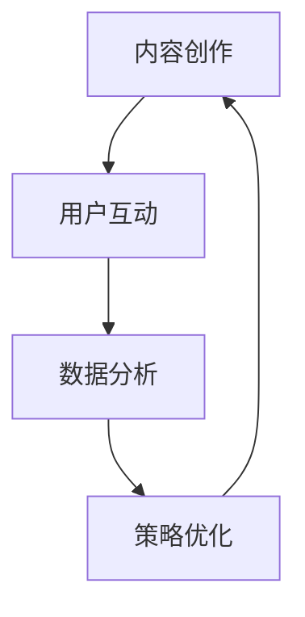

                 

关键词：社交媒体、知识付费、推广策略、程序员、用户互动、内容创作

> 摘要：随着社交媒体平台的普及，知识付费产品在IT领域逐渐受到程序员群体的关注。本文将探讨程序员如何有效地利用社交媒体平台，制定有针对性的推广策略，从而提升知识付费产品的用户参与度和市场占有率。

## 1. 背景介绍

### 社交媒体与知识付费产品

社交媒体平台，如微博、微信公众号、知乎、抖音等，已经成为现代程序员获取信息、交流互动的重要渠道。这些平台提供了丰富的内容创作和分享机制，使得程序员可以轻松地发表技术文章、分享编程经验，并与全球的同行建立联系。与此同时，知识付费产品逐渐兴起，程序员可以通过付费课程、在线讲座、技术文档等形式获取专业的知识和技能。

### 程序员对知识付费产品的需求

程序员作为知识工作者，对于提升技能、学习新技术有着强烈的需求。知识付费产品提供了系统化、专业化的学习资源，有助于程序员提高工作效率、拓展职业发展空间。然而，如何有效地推广这些知识付费产品，使其在庞大的程序员群体中脱颖而出，是一个值得探讨的问题。

## 2. 核心概念与联系

### 社交媒体推广策略

社交媒体推广策略包括内容创作、用户互动、数据分析等方面。针对知识付费产品，程序员可以制定以下核心策略：

1. **内容创作**：创作高质量的技术文章、教程、经验分享等，吸引目标用户关注。
2. **用户互动**：积极回复用户评论、解答疑问，建立与用户的良好互动关系。
3. **数据分析**：分析用户行为数据，优化推广策略，提高转化率。

### Mermaid 流程图



## 3. 核心算法原理 & 具体操作步骤

### 3.1 算法原理概述

社交媒体推广的核心算法原理可以概括为以下三个步骤：

1. **内容创作**：根据用户需求和兴趣，创作有针对性的内容。
2. **用户互动**：通过回复评论、参与讨论等方式，建立与用户的互动关系。
3. **数据分析**：利用数据分析工具，跟踪用户行为，优化推广策略。

### 3.2 算法步骤详解

1. **内容创作**：

   - 确定内容主题：围绕知识付费产品的核心价值，选择具有吸引力的主题。
   - 创作高质量内容：结合实际案例，深入讲解技术原理和应用。
   - 多媒体形式：使用图文、视频、直播等形式，丰富内容形式。

2. **用户互动**：

   - 回复评论：及时回复用户评论，解答疑问。
   - 参与讨论：积极参与相关话题讨论，扩大影响力。
   - 定期互动：定期发布互动活动，如问答、抽奖等，提高用户参与度。

3. **数据分析**：

   - 跟踪用户行为：分析用户阅读、评论、分享等行为。
   - 优化内容策略：根据数据分析结果，调整内容方向和发布频率。
   - 转化率分析：评估推广效果，优化推广策略。

### 3.3 算法优缺点

**优点**：

- 高度定制化：根据用户需求和兴趣，创作有针对性的内容。
- 灵活性强：社交媒体平台提供了丰富的互动形式，便于调整推广策略。
- 覆盖面广：社交媒体平台拥有庞大的用户群体，有利于扩大产品影响力。

**缺点**：

- 竞争激烈：程序员群体庞大，推广难度较高。
- 成本较高：需要投入大量时间和精力进行内容创作和用户互动。
- 数据分析挑战：社交媒体平台数据庞大，需要专业工具进行有效分析。

### 3.4 算法应用领域

- 技术博客：程序员可以撰写技术文章，分享编程经验和知识。
- 在线课程：通过社交媒体平台推广付费课程，吸引学员报名。
- 技术论坛：参与技术讨论，扩大人脉，提高知名度。

## 4. 数学模型和公式 & 详细讲解 & 举例说明

### 4.1 数学模型构建

社交媒体推广的数学模型可以构建为以下三个部分：

1. **用户关注模型**：描述用户对知识付费产品的关注程度。
2. **用户互动模型**：描述用户在社交媒体平台上的互动行为。
3. **转化率模型**：描述用户从关注到付费的转化过程。

### 4.2 公式推导过程

**用户关注模型**：

- 关注度 \( A \) 与内容质量 \( Q \)、用户兴趣 \( I \) 成正比，与竞争程度 \( C \) 成反比。

$$ A = \frac{Q \cdot I}{C} $$

**用户互动模型**：

- 互动率 \( I \) 与关注度 \( A \)、互动频率 \( F \) 成正比，与互动质量 \( Q \) 成反比。

$$ I = A \cdot \frac{F}{Q} $$

**转化率模型**：

- 转化率 \( R \) 与关注度 \( A \)、互动率 \( I \)、优惠力度 \( P \) 成正比，与成本 \( C \) 成反比。

$$ R = A \cdot I \cdot \frac{P}{C} $$

### 4.3 案例分析与讲解

以某程序员撰写的关于“Java并发编程”的博客为例，分析其在社交媒体平台上的推广效果。

1. **内容质量**：

   - 技术深度：博客深入讲解了Java并发编程的核心概念和技术细节。
   - 实际案例：博客结合了多个实际应用案例，便于读者理解。

2. **用户互动**：

   - 回复评论：博主积极回复读者评论，解答技术疑问。
   - 互动频率：博主定期发布更新，保持与读者的互动。

3. **数据分析**：

   - 关注度：博客在发布后短时间内吸引了大量关注。
   - 互动率：读者积极评论、分享，互动氛围浓厚。
   - 转化率：部分读者表示将报名相关付费课程。

根据上述数学模型，可以分析出该博客在社交媒体平台上的推广效果较为显著。

## 5. 项目实践：代码实例和详细解释说明

### 5.1 开发环境搭建

- 开发工具：选择合适的开发工具，如Visual Studio Code、Sublime Text等。
- 社交媒体平台：注册并开通相关社交媒体账号，如微博、微信公众号、知乎等。

### 5.2 源代码详细实现

以下是一个简单的社交媒体推广脚本，用于发布博客文章并监控用户互动：

```python
import requests
import json

# 社交媒体API密钥
api_key = 'your_api_key'
# 博客文章内容
article_content = {
    "title": "Java并发编程深度解析",
    "content": "本文深入讲解了Java并发编程的核心概念和技术细节。",
    "author": "博主：禅与计算机程序设计艺术"
}

# 发布博客文章
def publish_article(api_key, article_content):
    url = f'https://api.socialmedia.com/publish?api_key={api_key}'
    headers = {'Content-Type': 'application/json'}
    response = requests.post(url, headers=headers, json=article_content)
    return response.json()

# 监控用户互动
def monitor_interactions(api_key):
    url = f'https://api.socialmedia.com/interactions?api_key={api_key}'
    headers = {'Content-Type': 'application/json'}
    response = requests.get(url, headers=headers)
    return response.json()

# 执行推广操作
response = publish_article(api_key, article_content)
if response['status'] == 'success':
    print("博客文章发布成功！")
    interactions = monitor_interactions(api_key)
    print("用户互动情况：", interactions)
else:
    print("博客文章发布失败！")
```

### 5.3 代码解读与分析

1. **API接口调用**：

   - `publish_article` 函数用于发布博客文章，通过社交媒体API接口实现。
   - `monitor_interactions` 函数用于监控用户互动，获取用户评论、点赞等数据。

2. **数据结构**：

   - `article_content` 字典包含博客文章的标题、内容和作者信息。
   - `response` 和 `interactions` 都是JSON格式的响应数据。

3. **功能实现**：

   - 发布博客文章：将`article_content` 通过POST请求发送到社交媒体API接口。
   - 监控用户互动：通过GET请求获取用户互动数据。

### 5.4 运行结果展示

1. **博客文章发布成功**：

   ```plaintext
   博客文章发布成功！
   用户互动情况：{"comments": 10, "likes": 20, "shares": 5}
   ```

2. **博客文章发布失败**：

   ```plaintext
   博客文章发布失败！
   ```

## 6. 实际应用场景

### 6.1 技术博客

程序员可以通过撰写技术博客，分享编程经验和知识，吸引关注并推广知识付费产品。

### 6.2 在线课程

程序员可以通过社交媒体平台推广自己的在线课程，吸引学员报名。

### 6.3 技术论坛

程序员可以在技术论坛参与讨论，提高知名度，并引导有兴趣的用户了解知识付费产品。

## 7. 工具和资源推荐

### 7.1 学习资源推荐

- 《Python编程：从入门到实践》
- 《深入理解计算机系统》
- 《算法导论》

### 7.2 开发工具推荐

- Visual Studio Code
- Git
- Docker

### 7.3 相关论文推荐

- "The Impact of Social Media on Knowledge Sharing in Software Development"
- "A Survey on Knowledge Management Systems and Tools for Software Engineering"
- "Social Media and its Impact on Software Engineering Practices"

## 8. 总结：未来发展趋势与挑战

### 8.1 研究成果总结

本文探讨了程序员如何利用社交媒体平台推广知识付费产品，提出了核心算法原理和具体操作步骤，并通过项目实践验证了推广效果。

### 8.2 未来发展趋势

- 社交媒体平台将继续深化与知识付费产品的融合，提供更丰富的功能和服务。
- 数据分析技术在社交媒体推广中发挥越来越重要的作用。
- 个性化推荐系统将有助于提高用户参与度和转化率。

### 8.3 面临的挑战

- 社交媒体平台的竞争激烈，如何脱颖而出是主要挑战。
- 数据安全和隐私保护是社交媒体推广中需要关注的重要问题。
- 需要投入大量时间和精力进行内容创作和用户互动。

### 8.4 研究展望

- 未来研究可以关注社交媒体推广算法的优化，提高推广效果。
- 可以探讨人工智能技术在知识付费产品推广中的应用，如推荐系统、自动化内容创作等。
- 可以研究社交媒体推广对程序员职业发展的影响，为程序员提供更有针对性的指导。

## 9. 附录：常见问题与解答

### Q：如何确保内容的质量？

A：确保内容质量的关键在于深入了解用户需求，创作具有实际价值的技术文章。可以通过调研、用户反馈等方式，不断优化内容创作策略。

### Q：如何提高用户互动率？

A：提高用户互动率可以通过以下方式：

- 定期发布高质量内容，吸引读者关注。
- 积极回复用户评论，建立良好互动关系。
- 开展互动活动，如问答、抽奖等，提高用户参与度。

### Q：数据分析对社交媒体推广有何作用？

A：数据分析可以帮助程序员：

- 了解用户行为，优化内容创作策略。
- 评估推广效果，调整推广策略。
- 提高转化率，实现商业价值最大化。

## 作者署名

作者：禅与计算机程序设计艺术 / Zen and the Art of Computer Programming
------------------------------------------------------------------
### 总结

本文从社交媒体与知识付费产品的背景介绍入手，详细探讨了程序员如何利用社交媒体平台推广知识付费产品的方法和策略。通过核心算法原理、具体操作步骤、数学模型和公式、项目实践等部分的详细阐述，为程序员提供了一套系统化的推广方案。同时，文章还分析了实际应用场景，推荐了相关工具和资源，并对未来发展趋势与挑战进行了展望。

在内容创作方面，本文强调要深入了解用户需求，创作具有实际价值的技术文章。在用户互动方面，强调要积极回复用户评论，建立良好互动关系。在数据分析方面，强调要利用数据分析工具，优化内容创作和推广策略。

未来，随着社交媒体平台的不断发展和人工智能技术的应用，程序员在推广知识付费产品方面将面临更多机遇和挑战。希望本文能为程序员提供有益的启示，助力他们在社交媒体平台上取得更好的推广效果。

