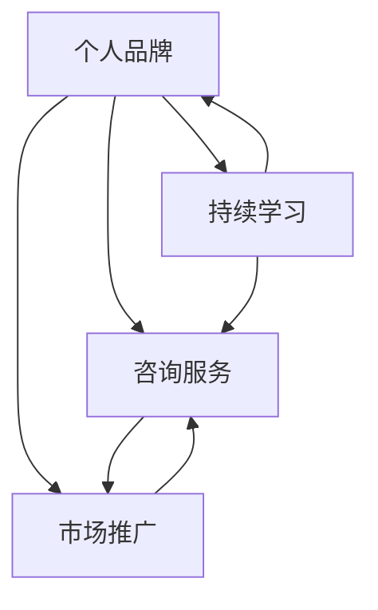

                 

关键词：程序员，开发经验，付费咨询服务，转型，知识变现

摘要：本文将探讨程序员如何将自己的开发经验转化为付费咨询服务，包括定位个人优势、构建专业形象、制定服务策略、建立信任关系以及持续学习和市场推广等方面的关键步骤。

## 1. 背景介绍

在技术日新月异的今天，编程技能已经成为了许多行业的核心竞争力。许多程序员在积累了丰富的开发经验后，开始考虑如何将自身的知识转化为实际的收入来源。付费咨询服务成为了一种受欢迎的方式，它不仅能够帮助程序员发挥自己的专长，还能够为他们提供一个持续学习和成长的机会。本文将探讨程序员如何实现这一转型，分享一些成功经验和实用策略。

## 2. 核心概念与联系

在讨论如何将开发经验转化为付费咨询服务之前，我们需要了解几个核心概念：

### 2.1 个人品牌

个人品牌是你在行业内所建立的专业形象。一个强大的个人品牌能够帮助你吸引客户、建立信任，并且为你提供更多机会。

### 2.2 咨询服务

咨询服务是指利用你的专业知识和经验，为客户解决实际问题的一种服务形式。它可以是项目咨询、技术培训、代码审查等多种形式。

### 2.3 市场推广

市场推广是让你潜在客户知道你的专业服务和价值的过程。这包括社交媒体、网络平台、博客、线下活动等多种渠道。

### 2.4 持续学习

持续学习是保持你专业技能和知识更新、与行业保持同步的关键。它包括阅读最新技术文献、参加技术会议、在线课程等。

下面是一个简单的Mermaid流程图，展示了这四个核心概念的相互关系：



## 3. 核心算法原理 & 具体操作步骤

### 3.1 算法原理概述

将开发经验转化为付费咨询服务的过程可以看作是一个算法，其核心原理包括以下几个步骤：

1. **自我评估**：明确自己的专业领域和技能。
2. **定位客户**：确定目标客户群体。
3. **构建服务框架**：定义你的服务内容和模式。
4. **建立信任**：通过专业知识和良好服务建立客户信任。
5. **市场推广**：通过各种渠道宣传你的服务和价值。

### 3.2 算法步骤详解

1. **自我评估**

   首先，你需要对自己的技能和经验进行评估。列出你在编程领域内的所有技能，并确定你擅长和感兴趣的领域。这有助于你找到自己的定位。

2. **定位客户**

   确定你的目标客户群体。他们可能是在某个特定领域工作的开发者，或者是有特定技术需求的企业。了解他们的需求，将有助于你制定合适的服务策略。

3. **构建服务框架**

   基于你的技能和目标客户，构建你的服务框架。这包括确定服务类型、价格模式、服务流程等。例如，你可以提供项目咨询、代码审查、技术培训等服务。

4. **建立信任**

   建立信任是咨询服务成功的关键。你可以通过以下方式来建立信任：

   - **展示专业知识和经验**：通过博客、GitHub、Stack Overflow等平台分享你的技术见解和经验。
   - **提供优质的咨询服务**：确保你的服务能够真正解决客户的问题。
   - **建立良好的沟通**：与客户保持良好的沟通，确保他们的需求得到满足。

5. **市场推广**

   市场推广是让更多人知道你的服务的过程。你可以通过以下方式来推广：

   - **社交媒体**：在LinkedIn、Twitter等平台上分享你的专业知识和服务。
   - **网络平台**：在Upwork、Freelancer等自由职业者平台上创建个人页面。
   - **线下活动**：参加技术会议、研讨会等活动，建立人脉。

### 3.3 算法优缺点

**优点：**

- **灵活性**：咨询服务可以根据客户需求灵活调整，提供定制化服务。
- **收入稳定**：如果你能够吸引足够的客户，咨询服务可以为你提供稳定的收入来源。
- **持续学习**：为客户提供服务的同时，你也可以通过解决实际问题来不断学习和提升自己。

**缺点：**

- **市场竞争激烈**：许多程序员都在提供咨询服务，竞争激烈。
- **客户信任建立难度**：建立客户信任需要时间和努力。

### 3.4 算法应用领域

算法的原理和步骤适用于所有需要咨询服务的技术领域，包括前端开发、后端开发、移动应用开发、数据分析等。

## 4. 数学模型和公式 & 详细讲解 & 举例说明

### 4.1 数学模型构建

在构建付费咨询服务时，一个简单的数学模型可以用于估算你的潜在收入。这个模型包括以下几个变量：

- \( C \)：你的平均咨询费用（每小时或每项目）。
- \( T \)：你每月可工作的总小时数。
- \( R \)：你的月收入。

数学模型如下：

\[ R = C \times T \]

### 4.2 公式推导过程

- \( C \)：通过调研市场需求和你的技能水平，确定一个合理的咨询费用。
- \( T \)：根据你的工作时间安排，估算你每月可工作的总小时数。
- \( R \)：将 \( C \) 和 \( T \) 相乘，得到你的月收入。

### 4.3 案例分析与讲解

假设你的平均咨询费用是每小时100美元，你每月可以工作160小时。那么，你的月收入将是：

\[ R = 100 \times 160 = 16000 \]

这意味着，如果你能够保持这个收入水平，你每个月可以赚取16000美元。

## 5. 项目实践：代码实例和详细解释说明

### 5.1 开发环境搭建

为了更好地理解和实践本文的内容，你可以使用一个在线代码编辑器，例如CodeSandbox或JSFiddle，来搭建一个简单的项目环境。

### 5.2 源代码详细实现

以下是一个简单的JavaScript代码示例，用于计算你的月收入：

```javascript
const hourlyRate = 100; // 咨询费用（每小时）
const hoursPerMonth = 160; // 每月工作小时数

function calculateMonthlyIncome(hourlyRate, hoursPerMonth) {
  return hourlyRate * hoursPerMonth;
}

const monthlyIncome = calculateMonthlyIncome(hourlyRate, hoursPerMonth);
console.log(`你的月收入是：$${monthlyIncome}`);
```

### 5.3 代码解读与分析

- `hourlyRate`：表示你的平均咨询费用。
- `hoursPerMonth`：表示你每月可以工作的总小时数。
- `calculateMonthlyIncome`：一个函数，用于计算月收入。
- `monthlyIncome`：存储计算结果的变量。

当你运行这段代码时，它会输出你的月收入。

### 5.4 运行结果展示

运行上述代码，你将看到如下输出：

```
你的月收入是：$16000
```

这表明，如果你每小时收费100美元，并且每月工作160小时，你的月收入将是16000美元。

## 6. 实际应用场景

### 6.1 项目管理咨询

许多公司需要专业的项目管理咨询，以优化他们的开发流程。作为有经验的程序员，你可以提供项目管理方面的咨询服务，帮助他们解决项目规划、进度控制、资源分配等方面的问题。

### 6.2 技术培训

随着技术的不断发展，许多开发人员需要不断学习新的技能。你可以提供定制化的技术培训服务，帮助他们掌握最新的编程语言、框架或工具。

### 6.3 代码审查

代码审查是一种确保代码质量和安全性的有效方法。许多企业和个人开发者都愿意为此付费。你可以提供专业的代码审查服务，帮助他们识别和修复代码中的问题。

### 6.4 未来应用展望

随着人工智能、大数据、区块链等新兴技术的应用，程序员在咨询服务领域的应用前景将更加广阔。未来，程序员可以通过提供定制化的AI咨询、大数据分析服务、区块链解决方案等，帮助企业和个人实现技术突破。

## 7. 工具和资源推荐

### 7.1 学习资源推荐

- **在线课程**：Coursera、Udemy、edX等平台提供丰富的编程和技术课程。
- **技术博客**：GitHub、Stack Overflow、Medium等平台上有许多优秀的程序员博客。

### 7.2 开发工具推荐

- **在线代码编辑器**：CodeSandbox、JSFiddle、Visual Studio Code等。
- **项目管理工具**：Jira、Trello、Asana等。

### 7.3 相关论文推荐

- **《程序员心理学》**：探讨程序员在工作中的心理状态和行为。
- **《敏捷开发实践指南》**：介绍敏捷开发的方法和实践。

## 8. 总结：未来发展趋势与挑战

### 8.1 研究成果总结

本文探讨了程序员如何将开发经验转化为付费咨询服务，包括定位个人优势、构建专业形象、制定服务策略、建立信任关系以及持续学习和市场推广等方面的关键步骤。通过数学模型和项目实践，我们展示了如何估算和实现咨询服务的收入。

### 8.2 未来发展趋势

随着技术的不断发展，程序员在咨询服务领域的应用前景将更加广阔。未来，程序员可以通过提供定制化的AI咨询、大数据分析服务、区块链解决方案等，帮助企业和个人实现技术突破。

### 8.3 面临的挑战

尽管咨询服务具有广阔的前景，但程序员也面临着激烈的竞争和建立客户信任的挑战。此外，持续学习和市场推广也是保持竞争力的重要手段。

### 8.4 研究展望

未来，我们可以进一步研究程序员如何利用新兴技术提升咨询服务质量，以及如何通过数据分析和人工智能优化咨询服务流程。

## 9. 附录：常见问题与解答

### 9.1 如何确定合理的咨询费用？

- 调研市场需求：了解同行业内其他程序员的收费标准。
- 评估自身价值：根据你的技能和经验，合理定价。
- 考虑成本：包括你的时间成本、机会成本等。

### 9.2 如何建立客户信任？

- 展示专业知识和经验。
- 提供优质的服务。
- 建立良好的沟通。

### 9.3 咨询服务有哪些形式？

- 项目咨询
- 技术培训
- 代码审查
- 技术支持

---

作者：禅与计算机程序设计艺术 / Zen and the Art of Computer Programming

