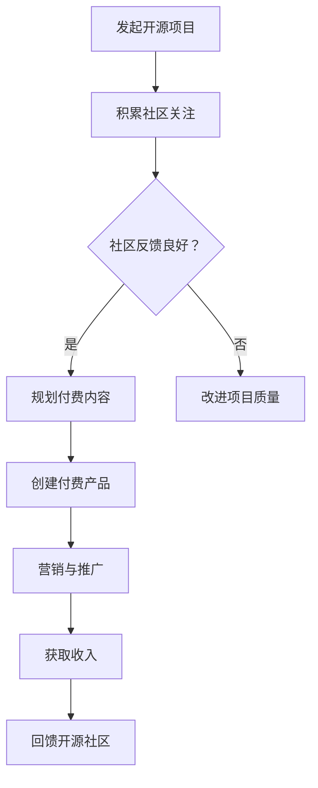

                 

关键词：开源项目，知识付费，商业模式，价值转化，用户体验

> 摘要：随着开源社区的蓬勃发展，越来越多的程序员选择将自己的项目贡献给公共领域。然而，如何从开源项目中挖掘商业价值，将其转化为知识付费产品，成为许多开发者的新课题。本文将探讨这一转变的路径和方法，帮助程序员在保持项目开源的同时，实现商业收益的最大化。

## 1. 背景介绍

开源项目在过去几十年里已经成为软件开发的基石。开发者通过共享代码、资源和经验，极大地推动了技术的进步和创新。然而，开源项目的商业化问题也逐渐浮现。尽管许多开发者在开源社区中获得了关注和声誉，但如何将这份关注转化为实质性的收入却是一个挑战。知识付费作为一种新兴的商业模式，提供了将开源项目商业化的新途径。

知识付费的核心在于将专业知识和技能转化为有价值的商品或服务，通过收费获取回报。在开源项目中，开发者可以通过多种方式实现这一目标。本文将深入探讨如何进行这一转变，并分析其优势和挑战。

## 2. 核心概念与联系

### 2.1 开源项目与知识付费的关系

开源项目通常基于以下原则：
- **开放性**：项目代码公开，任何人都可以自由查看、修改和分发。
- **协作性**：鼓励全球开发者共同参与，协作改进项目。

知识付费则基于以下原则：
- **独占性**：知识内容通常具有独占性，只有付费用户才能获取。
- **价值性**：用户支付费用以获取有价值的信息或服务。

两者之间的关系在于，开源项目可以为知识付费提供基础资源，而知识付费则可以为开源项目带来经济支持，促进项目的持续发展和完善。

### 2.2 Mermaid 流程图

以下是一个简化的流程图，展示了开源项目向知识付费产品转化的过程：



## 3. 核心算法原理 & 具体操作步骤

### 3.1 算法原理概述

将开源项目转化为知识付费产品，需要以下几步核心操作：

1. **项目评估**：确定项目是否有足够的用户基础和市场需求。
2. **内容规划**：规划哪些部分可以转化为付费内容，如何组织这些内容。
3. **产品创建**：创建知识付费产品，包括网站、课程、文档等。
4. **营销推广**：通过各种渠道推广产品，吸引潜在客户。
5. **用户管理**：管理付费用户，提供优质服务。
6. **持续迭代**：根据用户反馈，持续改进产品和项目。

### 3.2 算法步骤详解

#### 3.2.1 项目评估

- **用户分析**：统计项目的活跃用户数量、用户反馈、社区活跃度。
- **市场调研**：调查类似项目的市场表现，了解用户需求。
- **成本评估**：计算维持项目所需的成本，包括服务器、带宽、人力等。

#### 3.2.2 内容规划

- **确定收费点**：根据项目特点和用户需求，确定可以收费的功能或内容。
- **内容组织**：将收费内容与非收费内容区分开来，确保用户体验良好。
- **定价策略**：根据市场调研和成本评估，制定合理的价格策略。

#### 3.2.3 产品创建

- **搭建平台**：选择合适的技术栈和平台，搭建知识付费网站或平台。
- **内容制作**：制作高质量的付费内容，包括视频、文档、代码示例等。
- **用户界面**：设计简洁、直观的用户界面，提升用户体验。

#### 3.2.4 营销推广

- **社交媒体**：利用社交媒体平台宣传产品。
- **内容营销**：发布高质量的内容，吸引用户关注。
- **合作伙伴**：寻找合作伙伴，共同推广产品。
- **广告投放**：根据预算，合理投放广告。

#### 3.2.5 用户管理

- **用户注册与登录**：设计用户注册和登录流程。
- **权限管理**：为不同权限的用户提供不同的访问内容。
- **用户反馈**：收集用户反馈，不断改进产品。

#### 3.2.6 持续迭代

- **产品更新**：根据用户反馈，不断更新和改进产品。
- **市场监控**：定期监控市场动态，调整策略。
- **技术支持**：提供及时的技术支持，解决用户问题。

### 3.3 算法优缺点

#### 优点：

- **增加收入**：通过知识付费，开发者可以获得额外的经济收益。
- **社区激励**：付费产品可以激励开源社区的贡献者，促进项目发展。
- **内容质量提升**：付费用户更愿意支持高质量的内容，从而推动内容质量的提升。

#### 缺点：

- **用户流失**：部分用户可能因为付费而不愿意继续参与开源项目。
- **管理复杂**：需要投入大量时间和精力进行用户管理、内容制作和市场推广。
- **盈利不确定性**：尽管可以增加收入，但无法保证盈利，需要持续投入和优化。

### 3.4 算法应用领域

- **教育领域**：开源项目可以转化为在线课程、教程等。
- **软件开发**：开源项目可以转化为工具、插件等。
- **技术咨询**：开源项目的开发者可以提供专业的咨询服务。
- **社区管理**：开源项目可以转化为付费社区，提供高级会员服务。

## 4. 数学模型和公式 & 详细讲解 & 举例说明

### 4.1 数学模型构建

知识付费产品的收益模型可以通过以下公式表示：

\[ R = P \times S \times U \]

其中：
- \( R \) 是总收益（Revenue）。
- \( P \) 是价格（Price）。
- \( S \) 是销售量（Sales）。
- \( U \) 是用户转化率（User Conversion Rate）。

### 4.2 公式推导过程

总收益 \( R \) 等于单价 \( P \) 乘以销售量 \( S \)，再乘以用户转化率 \( U \)。这个公式反映了价格、销售量和用户转化率对总收益的影响。

### 4.3 案例分析与讲解

假设一个开源项目，其付费内容的价格为 \( P = \$20 \) 每月，每月访问量为 \( S = 1000 \) 人，用户转化率为 \( U = 10\% \)。

那么，每月的总收益 \( R \) 为：

\[ R = \$20 \times 1000 \times 10\% = \$2000 \]

通过调整价格、销售量和用户转化率，开发者可以优化总收益。例如，如果提高用户转化率到 20%，则每月总收益将增加至：

\[ R = \$20 \times 1000 \times 20\% = \$4000 \]

## 5. 项目实践：代码实例和详细解释说明

### 5.1 开发环境搭建

为了将一个开源项目转化为知识付费产品，首先需要搭建一个稳定且易于访问的开发环境。以下是搭建步骤：

1. **选择编程语言**：根据项目需求选择合适的编程语言，如 Python、JavaScript 等。
2. **设置版本控制**：使用 Git 进行版本控制，确保代码的可维护性和可追踪性。
3. **搭建开发环境**：安装必要的开发工具和依赖库，如 IDE、数据库等。
4. **配置代码库**：在 GitHub 或 GitLab 上创建代码库，便于协作和分享。

### 5.2 源代码详细实现

以下是一个简单的示例，展示如何将开源项目的部分功能转化为付费内容：

```python
# 示例：将开源项目中的功能部分封装为付费内容

class PaidFeature:
    def __init__(self, license_key):
        self.license_key = license_key
        self.validate_license()

    def validate_license(self):
        if not self.license_key:
            raise ValueError("无效的许可证密钥")
        # 这里添加许可证验证逻辑，例如与服务器交互验证

    def advanced_function(self):
        if not self.license_key:
            raise ValueError("您需要购买许可证才能使用此功能")
        # 这里实现高级功能

# 使用示例
try:
    license_key = "valid_license_key"
    paid_feature = PaidFeature(license_key)
    result = paid_feature.advanced_function()
    print("高级功能执行结果：", result)
except ValueError as e:
    print("错误：", e)
```

### 5.3 代码解读与分析

上述代码创建了一个名为 `PaidFeature` 的类，用于封装付费功能。通过传入许可证密钥，该类可以验证用户是否有权限使用高级功能。

- **初始化**：在创建对象时，传入许可证密钥，并调用 `validate_license` 方法进行验证。
- **验证方法**：`validate_license` 方法用于验证许可证密钥的有效性。
- **高级功能方法**：`advanced_function` 方法实现了高级功能，但只有通过许可证验证的用户才能调用。

这种设计确保了付费功能的独占性，同时保持了开源项目的核心功能可自由访问。

### 5.4 运行结果展示

假设用户拥有有效的许可证密钥，调用 `advanced_function` 方法将返回执行结果。否则，会抛出 `ValueError` 异常，提示用户需要购买许可证。

```python
# 输出
高级功能执行结果： 高级功能的返回值
```

## 6. 实际应用场景

开源项目转化为知识付费产品在实际中有多种应用场景，以下是一些典型的例子：

- **在线教育平台**：开源的在线教育平台可以提供付费课程，如 Coursera、edX 等。
- **开发工具**：开源的开发工具可以提供高级功能，如付费插件或扩展，如 Visual Studio Code、Webstorm 等。
- **技术咨询**：开源项目的开发者可以提供专业的技术咨询和定制服务。
- **企业解决方案**：开源项目可以转化为企业解决方案，提供定制化服务，如 Red Hat 的 OpenShift。

### 6.1 未来应用展望

随着技术的发展和开源社区的壮大，开源项目转化为知识付费产品的前景将更加广阔。以下是一些未来应用展望：

- **增值服务**：开源项目可以提供更多的增值服务，如实时技术支持、个性化定制等。
- **社区合作**：开源项目可以与社区合作伙伴共同推出付费产品，实现共赢。
- **区块链技术**：区块链技术可以提供更安全、透明的付费机制，促进知识付费的发展。

## 7. 工具和资源推荐

### 7.1 学习资源推荐

- **在线课程**：Udemy、Coursera、Pluralsight 等。
- **技术博客**：Medium、Dev.to、Stack Overflow Blog 等。
- **开源指南**：GitHub Help、Open Source Guides、The Open Source Way 等。

### 7.2 开发工具推荐

- **版本控制**：Git、GitLab、GitHub 等。
- **集成开发环境**：Visual Studio Code、Webstorm、IntelliJ IDEA 等。
- **项目管理**：Jira、Trello、Asana 等。

### 7.3 相关论文推荐

- **"Open Source and Commercial Software: The Case of MySQL" by Manuel G. Veloso.
- **"Free as in Freedom" by Sam Williams.
- **"The Business of Open Source" by Redmonk.

## 8. 总结：未来发展趋势与挑战

### 8.1 研究成果总结

本文探讨了如何将开源项目转化为知识付费产品的过程和方法。通过项目评估、内容规划、产品创建、营销推广等步骤，开发者可以有效地实现这一转化。数学模型和案例实践进一步验证了这一过程的可行性和效果。

### 8.2 未来发展趋势

随着技术的发展和用户需求的多样化，开源项目转化为知识付费产品的趋势将越来越显著。尤其是在在线教育、软件开发、技术咨询等领域，付费产品的需求将不断增长。

### 8.3 面临的挑战

尽管前景广阔，但开发者仍需面对一系列挑战。包括用户管理、内容质量、营销推广等方面，都需要投入大量资源和精力。此外，如何平衡开源社区和付费用户的利益，也是一个需要深入思考的问题。

### 8.4 研究展望

未来的研究可以进一步探讨如何优化知识付费产品的商业模式，提高用户体验和满意度。同时，探索新兴技术，如区块链、人工智能等在知识付费领域的应用，也将是一个重要的方向。

## 9. 附录：常见问题与解答

### 9.1 问题1：开源项目适合转化为知识付费产品吗？

答：开源项目本身适合转化为知识付费产品，但这取决于项目的内容、市场需求和用户基础。如果一个项目有足够的用户群体和市场潜力，且付费内容具有独特性和价值，那么将其转化为知识付费产品是一个可行的选择。

### 9.2 问题2：如何确保付费内容的质量？

答：确保付费内容的质量是知识付费产品的核心。开发者可以通过以下方式提高内容质量：

- **专业团队**：组建专业的编辑和开发团队，负责内容制作。
- **用户反馈**：定期收集用户反馈，根据反馈改进内容。
- **合作伙伴**：与行业专家和机构合作，共同开发高质量内容。

### 9.3 问题3：如何平衡开源社区和付费用户的需求？

答：平衡开源社区和付费用户的需求是一个挑战。开发者可以采取以下措施：

- **透明沟通**：与开源社区保持透明沟通，及时回应社区反馈。
- **社区贡献**：鼓励付费用户参与开源项目，为社区贡献力量。
- **付费优惠**：为开源项目的贡献者提供付费优惠，鼓励其支持项目发展。

---

作者：禅与计算机程序设计艺术 / Zen and the Art of Computer Programming
----------------------------------------------------------------
这篇文章详尽地探讨了如何将开源项目转化为知识付费产品，从背景介绍、核心概念、操作步骤，到数学模型和实际案例，再到应用场景、未来展望和工具资源推荐，内容全面而深入。希望这篇文章能够帮助到那些在开源和商业之间寻求平衡的开发者们。

