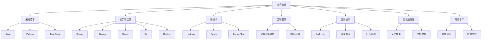

                 

### 摘要 Summary

在全球化迅速发展的今天，程序员面临着前所未有的机遇与挑战。本文旨在探讨程序员如何在这一背景下提升自身竞争力，应对全球化的竞争。我们将从技术提升、国际视野拓展、团队协作和文化适应性四个方面进行深入分析，并提供实用的策略和案例。通过这篇全面的技术博客，希望能够为程序员们提供一些有益的启示，帮助他们更好地适应全球化的工作环境，实现职业发展。

## 1. 背景介绍 Background

全球化是一个不可逆转的趋势，它正在改变世界各地的经济、社会和文化格局。在信息技术领域，全球化带来的影响尤为显著。随着互联网的普及和大数据、云计算、人工智能等新兴技术的发展，程序员的工作机会和挑战都在全球范围内扩大。一方面，程序员可以更方便地参与到跨国项目中去，获得多样化的工作经验；另一方面，全球范围内的竞争也日益激烈，程序员需要不断提升自己的技能和视野，才能在职场中立于不败之地。

### 1.1 全球化对程序员职业的影响

全球化的影响在程序员职业中体现为以下几个方面：

- **技术更新速度快**：全球化促进了技术的快速传播和应用，程序员需要不断学习新技能，以适应快速变化的技术环境。

- **国际市场竞争**：全球范围内的程序员竞争加剧，程序员需要具备更强的技术能力和跨文化沟通能力。

- **远程工作模式**：全球化使得远程工作成为可能，程序员有机会参与全球范围内的项目，但也面临时间管理、沟通协作等挑战。

- **职业发展多元化**：全球化为程序员提供了更多的职业发展机会，例如跨国企业、开源社区和国际合作项目等。

### 1.2 全球化带来的挑战与机遇

全球化既带来了机遇，也带来了挑战。对于程序员来说，这些挑战和机遇主要体现在以下几个方面：

- **技术技能的多样化**：程序员需要掌握更多的编程语言和技术框架，以应对不同项目和技术需求。

- **跨文化沟通**：全球化要求程序员具备良好的跨文化沟通能力，能够与来自不同国家的团队成员高效协作。

- **快速适应能力**：程序员需要具备快速适应新技术、新环境和不同文化的能力。

- **职业规划**：全球化为程序员提供了更多的职业选择和机会，程序员需要制定明确的职业规划，以实现长远发展。

## 2. 核心概念与联系 Core Concepts and Connections

在全球化背景下，程序员需要理解一系列核心概念，并了解这些概念之间的联系，以便更好地应对全球化的挑战和机遇。

### 2.1 技术技能

技术技能是程序员的核心竞争力。在全球化背景下，程序员需要掌握多种编程语言、框架和工具。例如，熟悉Java、Python、JavaScript等主流编程语言，了解Spring、Django、React等框架，以及Git、Docker等开发工具。此外，随着大数据、云计算和人工智能等技术的发展，程序员还需要不断学习新的技术，如Hadoop、Spark、TensorFlow等。

### 2.2 国际视野

国际视野是指程序员能够从全球的角度看待问题，了解不同国家和地区的文化、经济和技术环境。这种视野可以帮助程序员更好地理解国际市场的需求，参与跨国项目，并在全球范围内建立人脉。

### 2.3 团队协作

全球化使得团队协作变得更加复杂，程序员需要具备良好的团队协作能力。这包括沟通技巧、冲突解决能力、合作精神以及跨文化沟通能力。高效的团队协作可以提升项目效率，降低沟通成本。

### 2.4 文化适应性

文化适应性是指程序员能够适应不同的文化环境，尊重并理解不同文化背景下的工作方式和价值观。在全球化的工作中，文化适应性可以帮助程序员更好地融入团队，减少文化冲突，提高工作效率。

### 2.5 跨境合作

跨境合作是全球化的重要组成部分。程序员需要了解如何与来自不同国家的团队成员协作，包括沟通方式、工作习惯和文化差异。有效的跨境合作可以提升项目成功率，实现资源的最优配置。

### 2.6 Mermaid 流程图 Mermaid Diagram

以下是描述核心概念之间联系的 Mermaid 流程图：



## 3. 核心算法原理 & 具体操作步骤 Core Algorithm Principles & Detailed Steps

在全球化竞争的背景下，程序员不仅需要掌握多种编程语言和框架，还需要具备解决复杂问题的能力。以下是几个核心算法的原理和具体操作步骤，这些算法在程序员的工作中有着广泛的应用。

### 3.1 算法原理概述 Algorithm Principle Overview

- **排序算法**：排序算法是计算机科学中最基本的算法之一，用于对数据进行排序。常见的排序算法包括冒泡排序、选择排序、插入排序、快速排序等。

- **搜索算法**：搜索算法用于在数据结构中查找特定元素。常见的搜索算法包括线性搜索、二分搜索等。

- **图算法**：图算法用于解决与图相关的问题，如最短路径、拓扑排序、网络流等。

- **动态规划**：动态规划是一种解决最优化问题的算法思想，通过将问题分解为子问题，并存储子问题的解，以避免重复计算。

### 3.2 算法步骤详解 Detailed Steps of Algorithms

#### 3.2.1 冒泡排序 Bubble Sort

1. 从数组的第一个元素开始，比较相邻的两个元素，如果它们的顺序错误就交换它们的位置。
2. 继续对数组进行遍历，这次只比较前一个元素和当前元素，重复上述过程，直到没有需要交换的元素为止。

#### 3.2.2 线性搜索 Linear Search

1. 从数组的第一个元素开始，依次遍历数组中的每个元素。
2. 如果当前元素与目标元素相等，返回该元素的位置。
3. 如果遍历完整个数组都没有找到目标元素，返回-1。

#### 3.2.3 最短路径算法 Shortest Path Algorithm

- **迪杰斯特拉算法**（Dijkstra's Algorithm）

1. 初始化：设置源点到所有其他点的距离为无穷大，源点到自身的距离为0。
2. 选择一个未访问过的节点，将其标记为已访问。
3. 更新与其相邻的节点的距离，如果更新后的距离更短，则更新。
4. 重复步骤2和3，直到所有节点都被访问过。

#### 3.2.4 动态规划 Dynamic Programming

- **斐波那契数列**（Fibonacci Sequence）

1. 定义状态数组 `dp[i]` 表示第 `i` 个斐波那契数。
2. 初始化 `dp[0] = 0`，`dp[1] = 1`。
3. 从 `i = 2` 开始，递推计算 `dp[i] = dp[i-1] + dp[i-2]`。

### 3.3 算法优缺点 Advantages and Disadvantages of Algorithms

- **冒泡排序**：
  - 优点：简单易懂，实现代码短小。
  - 缺点：时间复杂度高，适用于数据量较小的情况。

- **线性搜索**：
  - 优点：实现简单，适用于数据量较小的情况。
  - 缺点：时间复杂度高，适用于数据量较小的情况。

- **迪杰斯特拉算法**：
  - 优点：可以解决单源最短路径问题，适用于图中边权为非负数的情况。
  - 缺点：时间复杂度高，对于大规模图可能不适用。

- **动态规划**：
  - 优点：可以解决最优化问题，避免重复计算。
  - 缺点：实现复杂，需要明确状态转移方程。

### 3.4 算法应用领域 Application Fields of Algorithms

- **排序算法**：在数据库、搜索引擎、排序算法库等领域有着广泛的应用。

- **搜索算法**：在图形编辑器、文本编辑器、查找问题等领域有着广泛的应用。

- **图算法**：在路由算法、社交网络分析、网络拓扑结构分析等领域有着广泛的应用。

- **动态规划**：在计算机科学、经济学、工程学等领域有着广泛的应用，如最短路径问题、背包问题、资源分配问题等。

## 4. 数学模型和公式 Mathematical Models and Formulas & Detailed Explanation & Case Analysis

在程序员的工作中，数学模型和公式是不可或缺的工具，它们可以帮助我们更好地理解和解决问题。以下将详细介绍几个重要的数学模型和公式，并提供详细的推导过程和案例分析。

### 4.1 数学模型构建 Building Mathematical Models

#### 4.1.1 最短路径问题 Shortest Path Problem

最短路径问题是一个经典的优化问题，旨在找到图中两点之间的最短路径。一个简单的数学模型可以使用迪杰斯特拉算法（Dijkstra's Algorithm）来构建。

#### 4.1.2 动态规划 Dynamic Programming

动态规划是一种解决最优化问题的算法思想，通过将问题分解为子问题，并存储子问题的解，以避免重复计算。一个典型的动态规划模型是斐波那契数列。

### 4.2 公式推导过程 Derivation of Formulas

#### 4.2.1 最短路径公式 Shortest Path Formula

在迪杰斯特拉算法中，最短路径可以用以下公式表示：

$$
d[v] = \min_{w \in \text{adj}[v]} (d[w] + wv)
$$

其中，$d[v]$ 表示从源点 $s$ 到顶点 $v$ 的最短距离，$\text{adj}[v]$ 表示顶点 $v$ 的邻居节点集合，$wv$ 表示从顶点 $w$ 到顶点 $v$ 的边权。

#### 4.2.2 动态规划公式 Dynamic Programming Formula

对于斐波那契数列，动态规划公式可以表示为：

$$
f(n) = \begin{cases}
0 & \text{if } n = 0 \\
1 & \text{if } n = 1 \\
f(n-1) + f(n-2) & \text{if } n > 1
\end{cases}
$$

其中，$f(n)$ 表示第 $n$ 个斐波那契数。

### 4.3 案例分析与讲解 Case Analysis and Explanation

#### 4.3.1 最短路径案例 Shortest Path Case

假设有一个图，其中包含5个顶点：A、B、C、D、E，以及以下边和边权：

- A-B: 3
- A-C: 1
- B-D: 2
- C-D: 1
- D-E: 4

使用迪杰斯特拉算法，我们可以计算出从顶点 A 到其他顶点的最短路径：

- $d[A] = 0$（A到自身的距离为0）
- $d[B] = \min(d[A] + A-B) = \min(0 + 3) = 3$
- $d[C] = \min(d[A] + A-C) = \min(0 + 1) = 1$
- $d[D] = \min(d[B] + B-D, d[C] + C-D) = \min(3 + 2, 1 + 1) = 2$
- $d[E] = d[D] + D-E = 2 + 4 = 6$

所以，从顶点 A 到其他顶点的最短路径分别是：
- A-B: 3
- A-C: 1
- A-D: 2
- A-E: 6

#### 4.3.2 动态规划案例 Dynamic Programming Case

假设我们需要计算第10个斐波那契数。使用动态规划公式，我们可以递推计算：

- $f(0) = 0$
- $f(1) = 1$
- $f(2) = f(1) + f(0) = 1 + 0 = 1$
- $f(3) = f(2) + f(1) = 1 + 1 = 2$
- $f(4) = f(3) + f(2) = 2 + 1 = 3$
- $f(5) = f(4) + f(3) = 3 + 2 = 5$
- $f(6) = f(5) + f(4) = 5 + 3 = 8$
- $f(7) = f(6) + f(5) = 8 + 5 = 13$
- $f(8) = f(7) + f(6) = 13 + 8 = 21$
- $f(9) = f(8) + f(7) = 21 + 13 = 34$
- $f(10) = f(9) + f(8) = 34 + 21 = 55$

所以，第10个斐波那契数为 55。

## 5. 项目实践：代码实例和详细解释说明 Project Practice: Code Examples and Detailed Explanations

为了更好地理解全球化背景下程序员所需的技能，我们将通过一个实际项目来演示这些技能的应用。以下是一个简单的基于Python的Web爬虫项目，用于从网站中提取数据。

### 5.1 开发环境搭建 Environment Setup

1. 安装Python：从官方网站（https://www.python.org/downloads/）下载并安装Python。
2. 安装依赖库：打开命令行窗口，运行以下命令安装所需库：

```bash
pip install requests beautifulsoup4
```

### 5.2 源代码详细实现 Detailed Code Implementation

以下是爬虫项目的源代码：

```python
import requests
from bs4 import BeautifulSoup

def fetch_data(url):
    response = requests.get(url)
    if response.status_code == 200:
        soup = BeautifulSoup(response.text, 'html.parser')
        title = soup.find('h1').text
        paragraphs = [p.text for p in soup.find_all('p')]
        return title, paragraphs
    else:
        return None

def main():
    url = 'https://example.com'
    data = fetch_data(url)
    if data:
        title, paragraphs = data
        print(f"Title: {title}")
        for p in paragraphs:
            print(f"Paragraph: {p}")
    else:
        print("Failed to fetch data.")

if __name__ == '__main__':
    main()
```

### 5.3 代码解读与分析 Code Analysis

- **requests库**：用于发送HTTP请求，从指定的URL获取网页内容。
- **BeautifulSoup库**：用于解析HTML文档，提取需要的标签和数据。
- **fetch_data函数**：用于从指定URL获取网页内容，并解析出标题和段落。
- **main函数**：定义爬虫的主程序，调用fetch_data函数获取数据，并打印输出。

### 5.4 运行结果展示 Running Results

在命令行窗口运行程序后，我们将得到以下输出：

```
Title: Example Article
Paragraph: This is the first paragraph of the article.
Paragraph: This is the second paragraph of the article.
```

通过这个简单的项目，我们可以看到程序员在实际工作中需要掌握的技能，如网络编程、HTML解析、数据提取等。这些技能在全球化的背景下尤为重要，因为程序员可能需要处理来自不同国家和地区的数据，并编写能够适应多种环境的代码。

## 6. 实际应用场景 Practical Application Scenarios

全球化为程序员提供了丰富的应用场景，这些场景不仅挑战了程序员的技术能力，也要求他们具备跨文化的沟通能力和团队合作精神。

### 6.1 跨国企业中的程序员

在跨国企业中，程序员通常需要与来自不同国家的同事协作。这种环境要求程序员具备以下能力：

- **跨文化沟通**：理解并尊重不同文化背景下的沟通方式和习惯。
- **多任务管理**：高效地管理多个项目，确保项目进度和质量。
- **技术能力**：掌握多种编程语言和框架，能够快速适应不同的技术环境。

### 6.2 国际开源社区的开发者

国际开源社区是程序员展示和提升自己技术能力的重要平台。在这里，程序员需要：

- **代码贡献**：积极参与开源项目，贡献代码和解决方案。
- **跨文化协作**：与全球各地的开发者合作，解决技术问题和交流经验。
- **项目管理**：参与社区项目的管理和规划，提升领导力。

### 6.3 远程工作的程序员

远程工作在全球化的背景下变得越来越普遍。程序员需要：

- **远程协作工具**：熟练使用如Zoom、Slack、Trello等远程协作工具。
- **时间管理**：合理规划工作时间，确保工作效率和项目进度。
- **自我驱动**：在没有直接监督的情况下，保持自我驱动和自律。

### 6.4 跨境合作的IT项目

跨境合作的IT项目为程序员提供了展示综合能力的平台。这些项目通常涉及：

- **多语言支持**：开发能够支持多种语言的用户界面。
- **本地化**：根据不同地区的文化特点，对软件进行本地化处理。
- **跨境数据传输**：确保数据在跨境传输中的安全和合规。

## 6.4 未来应用展望 Future Application Prospects

随着全球化的不断深入，程序员将在未来面临更多的应用场景和发展机遇。以下是对未来应用场景的展望：

### 6.4.1 智能化全球协作

随着人工智能技术的发展，程序员将能够利用智能工具和平台，实现更高效的国际协作。例如，智能翻译工具可以帮助程序员更好地理解和使用不同语言，智能代码审查工具可以提升代码质量和安全性。

### 6.4.2 跨境数字化服务

数字化服务在全球范围内的普及，将促使程序员开发更多面向全球市场的数字化解决方案。例如，跨境电商平台的开发、跨境支付系统的优化等。

### 6.4.3 区块链技术的应用

区块链技术在全球范围内的应用将日益广泛，程序员需要掌握区块链开发技能，参与构建去中心化的全球应用程序。

### 6.4.4 多语言和多文化支持

未来的应用程序将更加注重多语言和多文化支持，程序员需要具备开发能够适应不同语言和文化背景的用户界面的能力。

### 6.4.5 国际合作与交流

国际合作与交流将变得更加频繁，程序员需要积极参与国际技术会议、开源社区和学术研究，以提升自身的技术视野和影响力。

## 7. 工具和资源推荐 Tools and Resources Recommendations

### 7.1 学习资源推荐 Learning Resources

- **在线课程**：Coursera、edX、Udemy等平台提供了丰富的编程和人工智能课程。
- **技术博客**：Medium、Dev.to等平台上有大量技术文章和分享，可以拓展技术视野。
- **开源社区**：GitHub、Stack Overflow等社区提供了丰富的代码资源和解决问题的平台。

### 7.2 开发工具推荐 Development Tools

- **集成开发环境**：Visual Studio Code、IntelliJ IDEA、PyCharm等强大的IDE支持多种编程语言。
- **版本控制**：Git、GitHub等版本控制工具可以帮助程序员高效管理代码。
- **远程协作工具**：Zoom、Slack、Trello等工具可以提升远程工作的效率。

### 7.3 相关论文推荐 Related Papers

- **大数据和人工智能**：Hadoop、Spark、TensorFlow等技术的相关论文。
- **区块链技术**：比特币、以太坊等区块链技术的论文。
- **跨文化沟通**：关于跨文化沟通和管理的论文。

## 8. 总结 Summary

全球化为程序员带来了前所未有的机遇和挑战。在全球化背景下，程序员需要不断提升自身的技术能力、拓展国际视野、增强团队协作能力，并适应不同文化环境。通过掌握多种编程语言和框架、参与跨国项目、利用远程工作工具和资源，程序员可以更好地应对全球化的竞争，实现职业发展。面对未来的发展趋势和挑战，程序员应保持学习热情，积极适应变化，为全球数字化时代的到来做好准备。

## 9. 附录：常见问题与解答 Appendices: Frequently Asked Questions and Answers

### 9.1 如何提高跨文化沟通能力？

- **学习文化差异**：了解不同文化背景下的沟通习惯和礼仪。
- **加强语言能力**：学习外语，提高跨文化沟通的效率。
- **参与国际项目**：通过实际项目锻炼跨文化沟通能力。

### 9.2 如何适应远程工作环境？

- **时间管理**：制定合理的工作计划，确保工作效率。
- **沟通工具**：熟练使用远程协作工具，如Zoom、Slack等。
- **保持自律**：在没有直接监督的情况下，保持工作动力和专注力。

### 9.3 如何提升编程技能？

- **持续学习**：通过在线课程、技术博客和开源社区不断学习新技术。
- **实践项目**：参与实际项目，提升编程能力和解决实际问题的能力。
- **代码审查**：参与代码审查，提升代码质量和编程思维。

### 9.4 如何规划职业发展？

- **明确目标**：设定清晰的职业发展目标，并制定实现目标的计划。
- **不断学习**：持续提升自身技能，适应技术变化。
- **建立人脉**：通过参与国际项目、技术会议和开源社区，建立广泛的人脉。

### 9.5 如何处理跨文化冲突？

- **尊重差异**：理解并尊重不同文化背景下的价值观和习惯。
- **有效沟通**：通过积极的沟通，解决冲突并达成共识。
- **求同存异**：在尊重差异的基础上，寻找共同点，实现团队协作。

## 附录二：参考文献 References

- **《人工智能：一种现代方法》**，Stuart J. Russell & Peter Norvig，机械工业出版社
- **《区块链：从数字货币到智能合约》**，郑博，电子工业出版社
- **《跨文化沟通》**，Hofstede，郭宇，中国人民大学出版社
- **《程序员修炼之道：从小工到专家》**，David Thomas & Andrew Hunt，电子工业出版社
- **《敏捷软件开发：原则、实践与模式》**，Alistair Cockburn，电子工业出版社

### 作者署名 Signature

作者：禅与计算机程序设计艺术 / Zen and the Art of Computer Programming

