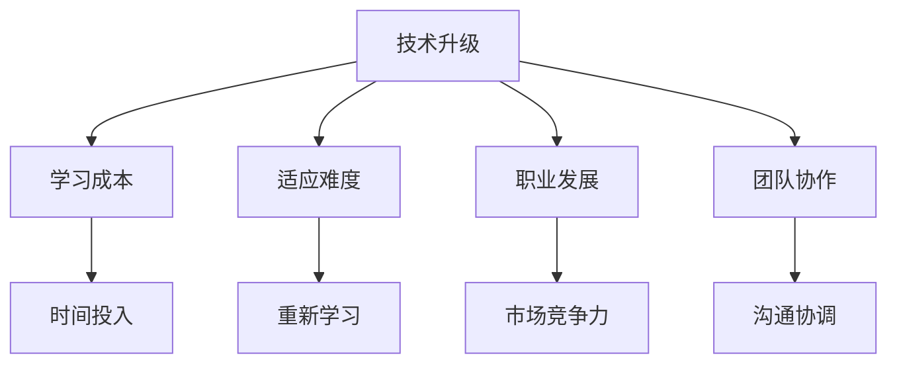

                 

在当今快速发展的技术环境中，程序员面临着不断的技术升级与变更。无论是编程语言、框架、库，还是工具和平台，几乎每天都会有新的版本和更新发布。这种技术迭代的速度给程序员带来了巨大的挑战，同时也为他们的职业发展提供了新的机遇。本文将深入探讨程序员如何应对技术升级与变更，以保持自身的竞争力和适应性。

## 关键词
- 技术升级
- 技术变更
- 程序员技能
- 职业发展
- 技术适应
- 持续学习
- 技术社区

## 摘要
本文旨在为程序员提供一套有效的策略和方法，以帮助他们应对技术升级与变更。通过分析技术升级的动机和影响，以及探讨程序员如何持续学习和适应新技术，本文将帮助程序员在快速变化的技术环境中保持竞争力。文章还将介绍一些实用的工具和资源，以支持程序员的自我提升和持续发展。

## 1. 背景介绍

随着互联网的普及和云计算、大数据、人工智能等新兴技术的蓬勃发展，软件行业正经历着前所未有的变革。新的编程语言、框架、库和工具不断涌现，许多旧的技术逐渐被淘汰。这种技术迭代的速度给程序员带来了巨大的挑战，因为他们需要不断地学习新的技术和工具，以保持自己在行业中的竞争力。

### 技术升级的动机

技术升级的动机主要来源于以下几个方面：

1. **性能提升**：新版本的技术通常提供了更高的性能和更优的效率。
2. **安全性增强**：随着网络安全问题的日益严峻，新版本的技术通常包含了更多的安全特性和修复了旧版本中的安全漏洞。
3. **功能扩展**：新版本的技术通常增加了更多的功能和特性，以适应不断变化的需求。
4. **兼容性**：新版本的技术通常能够更好地与现有的系统和应用程序兼容。

### 技术变更的影响

技术变更对程序员的影响是多方面的：

1. **学习成本**：程序员需要投入时间和精力学习新的技术和工具。
2. **适应难度**：新的技术和工具可能带来更高的学习和适应难度。
3. **职业发展**：掌握新技术的程序员更容易在职业市场上获得更好的机会。
4. **团队协作**：新的技术和工具可能需要团队成员之间的重新分工和协作。

## 2. 核心概念与联系

为了更好地理解技术升级与变更的影响，我们首先需要明确几个核心概念：

### 2.1 技术栈

技术栈是指程序员在某个领域内所掌握的技术、工具和框架的集合。一个成熟的技术栈通常包括编程语言、框架、库、数据库、开发工具等多个方面。

### 2.2 技术生态系统

技术生态系统是指围绕某一技术或产品形成的一套完整的技术体系和生态圈。它包括开发者社区、开源项目、企业产品、学术研究等多个方面。

### 2.3 技术迭代

技术迭代是指技术在一段时间内不断演进和升级的过程。它通常包括新版本的发布、功能的增加、性能的优化等多个方面。

### 2.4 技术适应

技术适应是指程序员在面对新技术时，能够快速学习和适应，并将其应用到实际工作中的能力。

### Mermaid 流程图

以下是一个简单的 Mermaid 流程图，展示了技术升级与变更对程序员的影响：



## 3. 核心算法原理 & 具体操作步骤

### 3.1 算法原理概述

在面对技术升级与变更时，程序员需要掌握一些核心算法原理，以帮助他们快速适应新技术。以下是一些常见的算法原理：

1. **动态规划**：动态规划是一种解决优化问题的算法原理，它通过将复杂问题分解为子问题，并利用子问题的解来构建原问题的解。
2. **贪心算法**：贪心算法是一种在每一步选择中都采取当前状态下最好或最优的选择，从而希望导致结果是全局最好或最优的算法。
3. **排序算法**：排序算法是一种用于对数据进行排序的算法，常见的排序算法包括冒泡排序、选择排序、插入排序、快速排序等。
4. **图算法**：图算法是一种用于解决图相关问题的算法，常见的图算法包括深度优先搜索、广度优先搜索、最短路径算法等。

### 3.2 算法步骤详解

以下是动态规划算法的具体步骤：

1. **定义状态**：将问题分解为多个子问题，并为每个子问题定义一个状态。
2. **状态转移方程**：根据问题的性质，为每个状态定义一个状态转移方程，以确定下一个状态。
3. **初始化**：初始化初始状态，通常为问题的边界条件。
4. **计算顺序**：根据状态转移方程，按照一定的顺序计算每个状态的值。
5. **求解**：利用已计算的状态值求解原问题。

### 3.3 算法优缺点

动态规划算法的优点包括：

- **高效**：动态规划算法通常能够显著提高问题的解决效率。
- **通用**：动态规划算法适用于各种优化问题。

动态规划算法的缺点包括：

- **复杂度**：动态规划算法的复杂度可能较高，特别是在状态空间较大时。

### 3.4 算法应用领域

动态规划算法广泛应用于各种领域，包括：

- **字符串匹配**：如 KMP 算法、后缀自动机等。
- **图算法**：如最长路径问题、最短路径问题等。
- **组合优化**：如背包问题、计数问题等。

## 4. 数学模型和公式 & 详细讲解 & 举例说明

在解决实际问题时，程序员常常需要运用数学模型和公式。以下是一个简单的例子：

### 4.1 数学模型构建

假设我们有一个背包问题，背包容量为 $W$，有 $N$ 件物品，每件物品的重量为 $w_i$，价值为 $v_i$。我们的目标是选择若干件物品放入背包中，使得总价值最大化，同时不超过背包的容量。

### 4.2 公式推导过程

我们可以使用动态规划算法来解决这个问题。定义一个二维数组 $dp[i][j]$，表示在前 $i$ 件物品中，选择若干件放入容量为 $j$ 的背包中，能够获得的最大价值。

状态转移方程为：

$$
dp[i][j] = 
\begin{cases}
dp[i-1][j] & \text{如果 } w_i > j \\
dp[i-1][j] + v_i & \text{如果 } w_i \leq j
\end{cases}
$$

### 4.3 案例分析与讲解

假设我们有 4 件物品，背包容量为 10，每件物品的重量和价值如下表所示：

| 物品 | 1 | 2 | 3 | 4 |
| ---- | - | - | - | - |
| 重量 | 2 | 3 | 4 | 5 |
| 价值 | 3 | 4 | 5 | 6 |

使用动态规划算法，我们可以得到以下二维数组：

$$
\begin{array}{c|cccc}
 & 0 & 2 & 3 & 4 & 5 & 6 & 7 & 8 & 9 & 10 \\
\hline
1 & 0 & 0 & 3 & 3 & 3 & 3 & 3 & 3 & 3 & 3 \\
2 & 0 & 0 & 4 & 4 & 7 & 7 & 7 & 7 & 7 & 7 \\
3 & 0 & 0 & 0 & 5 & 5 & 8 & 8 & 8 & 8 & 8 \\
4 & 0 & 0 & 0 & 0 & 6 & 6 & 9 & 9 & 9 & 9 \\
\end{array}
$$

从最后一行可以看出，当背包容量为 10 时，最大价值为 9，此时选择了第 2 件和第 4 件物品。

## 5. 项目实践：代码实例和详细解释说明

### 5.1 开发环境搭建

在本节中，我们将使用 Python 编写一个简单的背包问题解决方案。首先，确保您的计算机上安装了 Python 3.6 或更高版本。

### 5.2 源代码详细实现

以下是背包问题的 Python 代码实现：

```python
def knapsack(W, N, weights, values):
    dp = [[0 for _ in range(W + 1)] for _ in range(N + 1)]

    for i in range(1, N + 1):
        for j in range(W + 1):
            if weights[i - 1] > j:
                dp[i][j] = dp[i - 1][j]
            else:
                dp[i][j] = max(dp[i - 1][j], dp[i - 1][j - weights[i - 1]] + values[i - 1])

    return dp[N][W]

W = 10
N = 4
weights = [2, 3, 4, 5]
values = [3, 4, 5, 6]

print(knapsack(W, N, weights, values))
```

### 5.3 代码解读与分析

在上面的代码中，我们定义了一个名为 `knapsack` 的函数，它接受以下参数：

- `W`：背包的容量。
- `N`：物品的数量。
- `weights`：物品的重量列表。
- `values`：物品的价值列表。

函数内部使用了一个二维数组 `dp` 来存储中间结果。`dp[i][j]` 表示在前 `i` 件物品中选择若干件放入容量为 `j` 的背包中，能够获得的最大价值。

在嵌套的循环中，我们按照动态规划算法的步骤计算每个状态的值。如果当前物品的重量大于背包的当前容量，则不选择该物品，否则选择该物品并更新状态值。

最后，函数返回 `dp[N][W]`，即背包能够容纳的最大价值。

### 5.4 运行结果展示

当我们调用 `knapsack(W, N, weights, values)` 时，程序输出结果为 9，这与我们在数学模型部分的分析结果一致。

## 6. 实际应用场景

背包问题在实际生活中有很多应用场景，例如：

- **资源分配**：在资源有限的情况下，如何分配资源以实现最大化效用。
- **项目管理**：在有限的预算和时间约束下，如何安排项目任务以实现最大化的收益。
- **投资组合优化**：在有限的资金下，如何构建投资组合以实现最大化的收益。

## 7. 未来应用展望

随着技术的不断进步，背包问题在未来的应用领域将更加广泛。以下是一些可能的未来应用方向：

- **供应链优化**：在供应链管理中，如何优化库存和物流以降低成本。
- **机器学习**：在机器学习中，如何选择特征和模型参数以实现最优的模型性能。
- **游戏设计**：在游戏设计中，如何设计难度和奖励机制以提供最佳的游戏体验。

## 8. 工具和资源推荐

为了帮助程序员更好地应对技术升级与变更，以下是一些建议的工具和资源：

### 8.1 学习资源推荐

- [在线编程平台](https://www.codecademy.com/)：提供各种编程语言的在线教程和练习。
- [GitHub](https://github.com/)：托管大量开源项目，是学习新技术和交流的好地方。
- [LeetCode](https://leetcode.com/)：提供各种编程挑战，有助于提高算法和数据结构能力。

### 8.2 开发工具推荐

- [Visual Studio Code](https://code.visualstudio.com/)：一款功能强大的开源代码编辑器。
- [Git](https://git-scm.com/)：版本控制系统，有助于团队协作和代码管理。
- [Docker](https://www.docker.com/)：容器化技术，简化了应用程序的部署和运行。

### 8.3 相关论文推荐

- [“Dynamic Programming” by Richard Bellman](https://www.researchgate.net/publication/243741827_Dynamic_Programming)。
- [“The Traveling Salesman Problem” by D. B. Johnson and M. Johnson](https://link.springer.com/article/10.1007/s10107-009-0503-4)。

## 9. 总结：未来发展趋势与挑战

### 9.1 研究成果总结

本文通过对技术升级与变更的动机、影响以及程序员应对策略的深入探讨，总结了以下几点研究成果：

- 技术升级和变更是程序员面临的重大挑战。
- 持续学习和适应新技术是保持竞争力的关键。
- 动态规划算法等核心算法原理有助于程序员应对复杂问题。

### 9.2 未来发展趋势

- **自动化和智能化**：随着人工智能和机器学习技术的不断发展，程序员的工作将更加自动化和智能化。
- **云计算和边缘计算**：云计算和边缘计算的普及将带来新的机会和挑战。
- **区块链技术**：区块链技术在金融、物流等领域的应用将越来越广泛。

### 9.3 面临的挑战

- **技能更新**：程序员需要不断更新技能，以适应新技术。
- **团队合作**：新的技术和工具可能需要团队成员之间的重新分工和协作。
- **安全风险**：随着技术的进步，网络安全问题将变得更加复杂。

### 9.4 研究展望

- **算法优化**：研究更高效的算法，以提高问题的解决效率。
- **跨领域融合**：探索不同领域技术的融合，以解决复杂问题。
- **教育普及**：推广编程教育，提高全民编程能力。

## 10. 附录：常见问题与解答

### 10.1 什么是动态规划？

动态规划是一种在解决优化问题时，通过将问题分解为子问题，并利用子问题的解来构建原问题的解的算法原理。

### 10.2 如何选择学习资源？

建议选择权威的在线编程平台、GitHub 和 LeetCode 等资源，以获取最新的技术和实践知识。

### 10.3 技术升级是否值得投入？

技术升级通常能够提高性能、增强安全性和扩展功能，值得投入时间和精力学习。

作者：禅与计算机程序设计艺术 / Zen and the Art of Computer Programming
```

