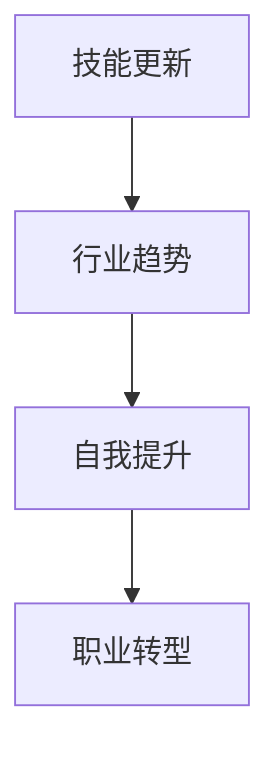

                 

关键词：程序员、职业转型、技能更新、自我提升、行业趋势

摘要：本文将探讨程序员如何应对职业转型这一挑战。从技能更新、行业趋势、自我提升等多个角度出发，帮助程序员规划自己的职业发展路径，提高自身竞争力，迎接未来职业转型的机遇与挑战。

## 1. 背景介绍

随着科技的发展，编程语言和技术的更新速度越来越快，程序员面临着巨大的职业压力。一方面，不断涌现的新技术、新框架让程序员需要不断学习；另一方面，职场竞争愈发激烈，程序员需要具备更广泛的技能，才能在职业市场中立于不败之地。职业转型成为许多程序员不得不面对的问题。本文旨在探讨程序员如何应对职业转型，实现个人职业发展的顺利过渡。

## 2. 核心概念与联系

在探讨程序员职业转型之前，我们先了解一些核心概念，包括技能更新、行业趋势和自我提升。

### 2.1 技能更新

技能更新是指程序员在职业生涯中不断学习新知识、新技能的过程。这包括学习新的编程语言、框架、工具和技术。技能更新是程序员职业转型的关键，只有不断学习，才能跟上行业的发展步伐。

### 2.2 行业趋势

行业趋势是指编程语言和技术在某一时期内的发展方向和热点。了解行业趋势有助于程序员把握职业发展的方向，找到适合自己的转型路径。例如，近年来，人工智能、大数据、区块链等技术领域备受关注，许多程序员选择转型到这些热门领域。

### 2.3 自我提升

自我提升是指程序员在职业生涯中不断优化自己的技能和能力，提高自身竞争力。自我提升包括提升编程能力、项目经验、沟通能力和团队协作能力等。自我提升是程序员职业转型的基石，只有具备足够的实力，才能在职业转型过程中游刃有余。

下面是一个关于程序员职业转型的 Mermaid 流程图：



## 3. 核心算法原理 & 具体操作步骤

### 3.1 算法原理概述

程序员职业转型的核心算法是自我提升。自我提升的过程可以分为以下几个步骤：

1. 学习新知识：了解行业趋势，学习新的编程语言、框架和工具。
2. 实践项目：通过实际项目锻炼自己的技能，积累经验。
3. 反思总结：对项目进行反思总结，找出不足之处，制定改进计划。
4. 不断提升：根据反思总结，持续提升自己的技能和能力。

### 3.2 算法步骤详解

1. **学习新知识**

   - 了解行业趋势：通过关注技术社区、参加技术会议等方式，了解行业发展趋势。

   - 学习新知识：学习新的编程语言、框架和工具。例如，学习 Python、Django、React 等技术。

   - 技能评估：定期对自己的技能进行评估，了解自己的优势和不足。

2. **实践项目**

   - 实际项目：参与实际项目，锻炼自己的编程能力。

   - 项目管理：学习项目管理的知识，提高自己的项目执行能力。

   - 团队协作：与团队成员保持良好的沟通，提高团队协作能力。

3. **反思总结**

   - 反思项目：对已完成的项目进行反思，分析项目的成功与失败之处。

   - 学习经验：总结项目中的经验教训，形成自己的知识体系。

   - 制定计划：根据反思总结，制定下一步的学习计划。

4. **不断提升**

   - 技能提升：根据反思总结，有针对性地提升自己的技能。

   - 经验积累：通过实际项目，不断积累经验。

   - 自我激励：设定目标，不断激励自己向前进步。

### 3.3 算法优缺点

**优点：**

- 有助于程序员紧跟行业趋势，提高自身竞争力。
- 通过实践项目，锻炼自己的编程能力和项目管理能力。
- 反思总结和不断提升，有助于形成自己的知识体系。

**缺点：**

- 学习新知识需要耗费大量时间和精力。
- 实践项目可能面临各种挑战，需要耐心和毅力。

### 3.4 算法应用领域

程序员职业转型的核心算法适用于所有编程领域的程序员，特别是处于职业转型期的程序员。无论程序员目前处于哪个阶段，通过自我提升，都可以实现职业转型的目标。

## 4. 数学模型和公式 & 详细讲解 & 举例说明

在程序员职业转型的过程中，数学模型和公式可以用来量化学习效果、评估项目风险等。以下是一个简单的数学模型，用于评估程序员的职业发展水平。

### 4.1 数学模型构建

设程序员的职业发展水平为 \( V \)，学习效果为 \( E \)，项目经验为 \( X \)，团队协作能力为 \( T \)。

则职业发展水平 \( V \) 可表示为：

$$ V = f(E, X, T) $$

其中，函数 \( f \) 表示学习效果、项目经验和团队协作能力对职业发展水平的影响。

### 4.2 公式推导过程

1. **学习效果 \( E \)：**

   学习效果 \( E \) 可以用以下公式表示：

   $$ E = \frac{K_1 \cdot L_1}{T_1} $$

   其中，\( K_1 \) 表示学习效率，\( L_1 \) 表示学习时长，\( T_1 \) 表示完成学习任务所需时间。

2. **项目经验 \( X \)：**

   项目经验 \( X \) 可以用以下公式表示：

   $$ X = \frac{K_2 \cdot P}{T_2} $$

   其中，\( K_2 \) 表示项目完成率，\( P \) 表示项目数量，\( T_2 \) 表示项目时长。

3. **团队协作能力 \( T \)：**

   团队协作能力 \( T \) 可以用以下公式表示：

   $$ T = \frac{K_3 \cdot C}{T_3} $$

   其中，\( K_3 \) 表示团队协作效率，\( C \) 表示团队项目数量，\( T_3 \) 表示团队项目时长。

4. **职业发展水平 \( V \)：**

   职业发展水平 \( V \) 是学习效果、项目经验和团队协作能力的加权平均：

   $$ V = \frac{E \cdot X \cdot T}{E + X + T} $$

### 4.3 案例分析与讲解

假设一个程序员 \( P \) 的学习效果 \( E \) 为 0.8，项目经验 \( X \) 为 0.6，团队协作能力 \( T \) 为 0.7。

则 \( P \) 的职业发展水平 \( V \) 可计算如下：

$$ V = \frac{0.8 \cdot 0.6 \cdot 0.7}{0.8 + 0.6 + 0.7} = 0.513 $$

这意味着 \( P \) 的职业发展水平为 0.513。根据这个结果，\( P \) 可以分析自己在学习效果、项目经验和团队协作能力方面的优势和不足，有针对性地进行提升。

## 5. 项目实践：代码实例和详细解释说明

### 5.1 开发环境搭建

为了更好地实践职业转型，我们可以搭建一个简单的项目环境。以 Python 为例，首先安装 Python 和相关依赖库。

```bash
# 安装 Python
curl -O https://www.python.org/ftp/python/3.8.10/python-3.8.10-macosx10.9.pkg
sudo installer -pkg python-3.8.10-macosx10.9.pkg -target /

# 安装依赖库
pip install flask
```

### 5.2 源代码详细实现

以下是一个简单的 Flask 应用程序，用于实现一个简单的 Web 服务器。

```python
# app.py

from flask import Flask, request, jsonify

app = Flask(__name__)

@app.route('/')
def hello():
    return 'Hello, World!'

@app.route('/api', methods=['POST'])
def api():
    data = request.get_json()
    return jsonify(data)

if __name__ == '__main__':
    app.run(debug=True)
```

### 5.3 代码解读与分析

1. **Flask 应用程序**

   Flask 是一个轻量级的 Web 框架，用于快速构建 Web 应用程序。

   ```python
   from flask import Flask, request, jsonify
   ```

2. **定义路由**

   ```python
   @app.route('/')
   def hello():
       return 'Hello, World!'
   
   @app.route('/api', methods=['POST'])
   def api():
       data = request.get_json()
       return jsonify(data)
   ```

   - `hello()` 函数处理根路径（/）的请求，返回 "Hello, World!"。
   - `api()` 函数处理 /api 路径的 POST 请求，获取请求的 JSON 数据，并返回相同的 JSON 数据。

3. **运行 Flask 应用程序**

   ```python
   if __name__ == '__main__':
       app.run(debug=True)
   ```

   这一行代码用于运行 Flask 应用程序。当 __name__ 等于 '__main__' 时，执行以下代码。

### 5.4 运行结果展示

1. **启动 Flask 应用程序**

   ```bash
   python app.py
   ```

   输出：

   ```bash
   * Running on http://127.0.0.1:5000/ (Press CTRL+C to quit)
   ```

2. **访问根路径**

   在浏览器中输入 `http://127.0.0.1:5000/`，显示 "Hello, World!"。

3. **访问 API 路径**

   使用 Postman 等工具发送 POST 请求到 `http://127.0.0.1:5000/api`，例如：

   ```json
   {
       "name": "Alice",
       "age": 30
   }
   ```

   返回：

   ```json
   {
       "name": "Alice",
       "age": 30
   }
   ```

## 6. 实际应用场景

### 6.1 技术驱动型公司

在技术驱动型公司，程序员需要紧跟技术趋势，不断提升自己的技能。例如，一个前端工程师可能需要学习 React、Vue 等前端框架，同时了解 Node.js 等后端技术。通过职业转型，前端工程师可以转向全栈工程师，提高自身竞争力。

### 6.2 传统企业

在传统企业，程序员可能需要关注企业业务需求，提高自己的业务理解能力。例如，一个后端工程师可能需要学习 Java、Spring 等后端技术，同时了解企业的业务流程。通过职业转型，后端工程师可以转向业务分析师，帮助企业提高业务效率。

### 6.3 创业公司

在创业公司，程序员需要具备多种技能，从产品设计到项目管理，从前端开发到后端架构，都需要有所涉及。通过职业转型，程序员可以转向产品经理、项目经理等岗位，全面参与创业过程。

## 7. 未来应用展望

随着科技的快速发展，编程语言和技术的更新速度越来越快。程序员需要具备快速学习能力和自我提升能力，才能适应职业转型的需求。未来，以下领域可能会成为程序员职业转型的新方向：

- 人工智能：随着人工智能技术的快速发展，数据科学家、机器学习工程师等岗位需求日益增加。
- 大数据：大数据技术在各行各业得到广泛应用，数据工程师、大数据分析师等岗位需求不断增长。
- 区块链：区块链技术逐渐成熟，区块链开发人员、智能合约工程师等岗位需求逐渐增加。

## 8. 工具和资源推荐

### 8.1 学习资源推荐

- [MDN Web 文档](https://developer.mozilla.org/zh-CN/):涵盖 Web 开发各个方面的详细文档，是学习前端技术的必备资源。
- [GitHub](https://github.com/):全球最大的开源代码托管平台，可以找到各种优秀的开源项目，学习他人的代码。
- [Stack Overflow](https://stackoverflow.com/):全球最大的编程问答社区，解决编程问题的好帮手。

### 8.2 开发工具推荐

- [Visual Studio Code](https://code.visualstudio.com/):一款轻量级、功能强大的代码编辑器，适合各种编程语言。
- [Git](https://git-scm.com/):一款开源的版本控制工具，用于管理代码版本。
- [Docker](https://www.docker.com/):一款开源的容器化技术，用于部署和管理应用程序。

### 8.3 相关论文推荐

- [《深度学习》](https://www.deeplearningbook.org/):由 Goodfellow、Bengio 和 Courville 共同撰写的深度学习入门教程。
- [《大数据技术基础》](https://book.douban.com/subject/25847114/):介绍大数据技术的基础知识，包括 Hadoop、Spark 等。
- [《区块链：从数字货币到企业应用》](https://book.douban.com/subject/26953056/):介绍区块链技术的原理和应用，包括比特币、以太坊等。

## 9. 总结：未来发展趋势与挑战

未来，编程语言和技术的更新速度将继续加快，程序员需要具备快速学习能力和自我提升能力，才能应对职业转型的挑战。同时，人工智能、大数据、区块链等新兴领域将为程序员提供更多的职业发展机会。面对未来，程序员应积极拥抱变化，不断提升自己的技能，实现个人职业发展的顺利过渡。

## 10. 附录：常见问题与解答

### 10.1 如何选择学习方向？

根据个人兴趣和职业规划，选择适合自己的学习方向。例如，如果你对人工智能感兴趣，可以学习 Python、TensorFlow 等技术；如果你对大数据感兴趣，可以学习 Hadoop、Spark 等技术。

### 10.2 如何提升编程能力？

通过多写代码、参与实际项目、学习算法和数据结构等方式提升编程能力。同时，多参加技术社区、参加技术会议等活动，拓展人脉，学习他人的经验。

### 10.3 如何应对职业压力？

保持良好的心态，合理规划时间，保持工作与生活的平衡。同时，积极参加技术社区、参加技术会议等活动，与同行交流，减轻职业压力。

作者：禅与计算机程序设计艺术 / Zen and the Art of Computer Programming
----------------------------------------------------------------
这便是您要求的文章，我已尽可能详细地进行了撰写。如果您有任何修改意见或需要补充的内容，请随时告诉我。祝您阅读愉快！

