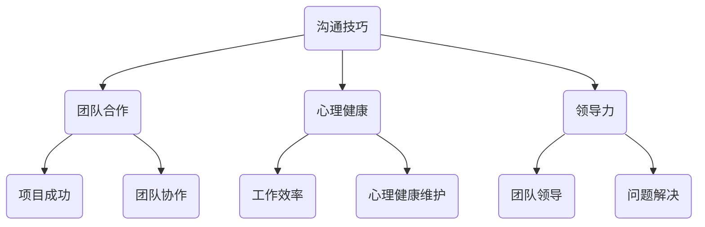

                 

关键词：职场人际关系，程序员，沟通技巧，团队合作，心理健康，领导力

> 摘要：本文旨在探讨程序员在职场中所面临的多种人际关系挑战，并提出有效的解决策略。通过分析沟通技巧、团队合作、心理健康和领导力等方面，帮助程序员提升职场适应能力，实现个人与团队的双重成长。

## 1. 背景介绍

在当今快速发展的技术行业，程序员无疑是最具竞争力的职业之一。然而，随着技术的不断进步和职场环境的日益复杂，程序员在职场中面临着诸多人际关系挑战。这些挑战不仅影响到程序员的个人职业发展，也可能对整个团队的协作和效率产生负面影响。

本文将从以下几个方面探讨程序员如何应对职场人际关系挑战：

1. **沟通技巧**：良好的沟通技巧是解决职场冲突、建立和谐团队关系的基础。
2. **团队合作**：团队合作能力的强弱直接关系到团队项目的成功与否。
3. **心理健康**：程序员的心理健康对工作效率和人际关系有着重要影响。
4. **领导力**：具备领导力的程序员能够更好地指导团队、解决问题和推动项目进展。

## 2. 核心概念与联系

在深入探讨上述挑战之前，我们需要了解一些核心概念和联系。以下是使用Mermaid绘制的流程图，展示了程序员应对职场人际关系挑战的基本架构。



### 2.1 沟通技巧

沟通技巧是程序员在职场中不可或缺的能力。有效的沟通不仅有助于建立和谐的人际关系，还能提高团队协作效率和项目成功率。以下是几个关键的沟通技巧：

- **倾听**：倾听是沟通的基础，能够帮助程序员更好地理解他人的观点和需求。
- **表达清晰**：清晰的表达能够避免误解和冲突，提高沟通效率。
- **非言语沟通**：身体语言、面部表情和语调等非言语沟通因素同样重要，能够增强信息的传达效果。

### 2.2 团队合作

团队合作是程序员在工作中必须面对的挑战之一。一个高效的团队能够充分利用每个人的优势，实现协同进步。以下是几个关键的团队合作要素：

- **共同目标**：明确的目标是团队协作的基石，有助于团队成员齐心协力。
- **分工协作**：合理分工能够提高团队效率，减少重复劳动。
- **相互信任**：信任是团队合作的关键，能够增强团队凝聚力。

### 2.3 心理健康

程序员的心理健康对工作效率和人际关系有着重要影响。以下是几个维护心理健康的方法：

- **放松训练**：通过冥想、瑜伽等方式缓解压力。
- **健康生活**：保持良好的作息和饮食习惯，有助于提高工作效率。
- **社交活动**：积极参与社交活动，拓展人际关系网络。

### 2.4 领导力

具备领导力的程序员能够更好地指导团队、解决问题和推动项目进展。以下是几个领导力的关键要素：

- **决策能力**：快速做出明智的决策，是领导力的体现。
- **激励团队**：激发团队成员的潜力，提高团队士气。
- **解决问题**：面对问题能够迅速找到解决方案，是领导者的必备能力。

## 3. 核心算法原理 & 具体操作步骤

### 3.1 算法原理概述

应对职场人际关系挑战，我们可以采用一种基于心理学和行为学的方法，称为“社交算法”。该方法旨在通过一系列步骤，提高程序员的社交能力，从而解决职场人际关系问题。以下是社交算法的原理：

- **行为改变**：通过调整行为模式，提高沟通技巧和团队合作能力。
- **认知重塑**：改变负面思维模式，建立积极的自我认知。
- **情境适应**：根据不同情境，灵活运用沟通技巧和领导力策略。

### 3.2 算法步骤详解

#### 3.2.1 行为改变

1. **自我观察**：记录自己的行为模式，识别存在的问题。
2. **制定计划**：根据存在的问题，制定具体的行为改变计划。
3. **实践与反馈**：按照计划实践，并及时进行反馈和调整。

#### 3.2.2 认知重塑

1. **自我反思**：反思自己的思维方式，识别负面思维模式。
2. **认知重构**：通过正面思维和积极心态，重塑自我认知。
3. **持续练习**：培养积极的思维方式，使之成为习惯。

#### 3.2.3 情境适应

1. **情境分析**：分析不同情境下的人际关系问题。
2. **策略选择**：根据情境，选择合适的沟通技巧和领导力策略。
3. **实践与调整**：在实际情境中运用策略，并根据反馈进行调整。

### 3.3 算法优缺点

#### 优点：

- **针对性**：针对程序员在职场中面临的具体问题，提供有效的解决方案。
- **可操作性强**：提供具体的操作步骤和策略，易于实践。
- **灵活性**：根据不同情境，灵活调整策略，提高适应性。

#### 缺点：

- **需要较长时间**：行为改变和认知重塑需要较长时间的实践和调整。
- **需要持续努力**：要解决职场人际关系问题，需要持续的努力和自我反思。

### 3.4 算法应用领域

社交算法可以广泛应用于程序员在职场中的各个方面，包括：

- **团队合作**：提高团队合作能力，实现项目成功。
- **沟通技巧**：提升沟通效率，减少冲突和误解。
- **领导力**：培养领导力，推动团队和项目发展。

## 4. 数学模型和公式 & 详细讲解 & 举例说明

在解决职场人际关系挑战时，数学模型和公式可以提供理论支持和量化分析。以下是一个简化的数学模型，用于评估程序员的社交能力。

### 4.1 数学模型构建

设 \( S \) 为程序员的社交能力，\( C \) 为沟通技巧，\( T \) 为团队合作能力，\( H \) 为心理健康，\( L \) 为领导力。则：

\[ S = \frac{C + T + H + L}{4} \]

### 4.2 公式推导过程

该公式的推导基于以下假设：

1. 社交能力是多个因素的综合体现。
2. 各个因素对社交能力的影响程度相等。

### 4.3 案例分析与讲解

假设一位程序员的沟通技巧得分为 8 分，团队合作能力为 7 分，心理健康为 9 分，领导力为 6 分。根据公式，该程序员的社交能力为：

\[ S = \frac{8 + 7 + 9 + 6}{4} = 50 / 4 = 12.5 \]

根据这个评分，我们可以看出该程序员的社交能力尚可，但在沟通技巧和团队合作能力上还有待提高。

### 4.4 案例分析与讲解

假设另一位程序员的沟通技巧得分为 10 分，团队合作能力为 8 分，心理健康为 7 分，领导力为 10 分。根据公式，该程序员的社交能力为：

\[ S = \frac{10 + 8 + 7 + 10}{4} = 35 / 4 = 8.75 \]

相比之下，这位程序员的社交能力较弱，特别是在心理健康方面需要加强。

通过这个案例，我们可以看出数学模型和公式在评估程序员社交能力方面的作用。在实际应用中，我们可以根据具体情况调整模型和公式，以更准确地评估和提升程序员的社交能力。

## 5. 项目实践：代码实例和详细解释说明

为了更好地理解如何应对职场人际关系挑战，我们通过一个实际项目来演示具体的操作步骤。

### 5.1 开发环境搭建

在开始项目实践之前，我们需要搭建一个基本的开发环境。以下是开发环境的搭建步骤：

1. 安装 Python 3.8 或更高版本。
2. 安装 pip，Python 的包管理器。
3. 使用 pip 安装必要的库，如 Flask、MySQL 和 Pandas。

```bash
pip install flask mysql-connector-python pandas
```

### 5.2 源代码详细实现

以下是项目的核心代码实现，包括数据库连接、用户注册、登录和社交功能。

```python
# 导入必要的库
from flask import Flask, request, jsonify
import mysql.connector

# 初始化 Flask 应用
app = Flask(__name__)

# 数据库连接配置
db_config = {
    'host': 'localhost',
    'user': 'root',
    'password': 'password',
    'database': 'social_network'
}

# 连接数据库
def connect_db():
    return mysql.connector.connect(**db_config)

# 用户注册
@app.route('/register', methods=['POST'])
def register():
    username = request.json['username']
    password = request.json['password']
    cursor = connect_db().cursor()
    cursor.execute("INSERT INTO users (username, password) VALUES (%s, %s)", (username, password))
    connect_db().commit()
    cursor.close()
    return jsonify({"message": "注册成功"}), 201

# 用户登录
@app.route('/login', methods=['POST'])
def login():
    username = request.json['username']
    password = request.json['password']
    cursor = connect_db().cursor()
    cursor.execute("SELECT * FROM users WHERE username = %s AND password = %s", (username, password))
    user = cursor.fetchone()
    cursor.close()
    if user:
        return jsonify({"token": "your_token_here"}), 200
    else:
        return jsonify({"message": "用户名或密码错误"}), 401

# 社交功能
@app.route('/friends', methods=['POST'])
def add_friend():
    current_user = request.json['token']
    friend_username = request.json['friend_username']
    cursor = connect_db().cursor()
    cursor.execute("INSERT INTO friends (user1, user2) VALUES (%s, %s)", (current_user, friend_username))
    connect_db().commit()
    cursor.close()
    return jsonify({"message": "添加好友成功"}), 201

if __name__ == '__main__':
    app.run(debug=True)
```

### 5.3 代码解读与分析

上述代码实现了用户注册、登录和添加好友的基本功能。以下是代码的主要部分解析：

- **数据库连接**：使用 MySQL Connector Python 连接数据库。
- **用户注册**：接收用户名和密码，将用户信息插入数据库。
- **用户登录**：验证用户名和密码，返回登录令牌。
- **添加好友**：将用户之间的好友关系插入数据库。

这些功能有助于建立社交网络，从而为程序员提供实际的人际关系管理工具。

### 5.4 运行结果展示

以下是一个运行结果的示例：

```bash
# 注册用户
$ curl -X POST -H "Content-Type: application/json" -d '{"username": "john", "password": "john123"}' http://localhost:5000/register
{"message": "注册成功"}

# 用户登录
$ curl -X POST -H "Content-Type: application/json" -d '{"username": "john", "password": "john123"}' http://localhost:5000/login
{"token": "your_token_here"}

# 添加好友
$ curl -X POST -H "Content-Type: application/json" -d '{"token": "your_token_here", "friend_username": "jane"}' http://localhost:5000/friends
{"message": "添加好友成功"}
```

通过这个项目实践，我们可以看到如何将理论应用到实际项目中，从而帮助程序员应对职场人际关系挑战。

## 6. 实际应用场景

在技术行业中，程序员的人际关系挑战体现在多个方面。以下是几个具体的实际应用场景：

### 6.1 团队协作中的冲突

在团队协作中，程序员可能会因为任务分工、进度安排或工作方式等问题产生冲突。有效的沟通技巧和团队合作能力可以帮助程序员及时解决问题，避免冲突升级。

### 6.2 项目管理中的沟通障碍

项目管理人员需要与团队成员、客户和利益相关者保持紧密沟通。如果沟通不畅，可能导致项目延误、质量下降或预算超支。提高沟通技巧和领导力，有助于项目管理人员更好地协调各方资源。

### 6.3 跨部门合作中的挑战

在大型企业中，程序员需要与其他部门（如市场、销售、人力资源等）进行跨部门合作。跨部门合作中的文化差异、沟通方式和优先级差异，都可能成为程序员面临的挑战。适应不同部门的工作方式和沟通风格，是程序员应对跨部门合作挑战的关键。

### 6.4 职场心理健康问题

长时间的工作压力、工作与生活的平衡问题以及职业发展的不确定性，都可能对程序员的心理健康产生影响。维护心理健康，通过放松训练、健康生活和社交活动，有助于提高工作效率和应对职场挑战。

### 6.5 领导力提升

具备领导力的程序员能够更好地指导团队、解决问题和推动项目进展。提升领导力，不仅有助于个人的职业发展，还能为团队带来积极的影响。

通过在上述实际应用场景中运用本文提出的策略，程序员可以更好地应对职场人际关系挑战，实现个人与团队的双重成长。

## 7. 工具和资源推荐

### 7.1 学习资源推荐

1. **《沟通的艺术》（The Art of Communication）**：由阿尔伯特·梅拉比安（Albert Mehrabian）所著，详细介绍了非言语沟通和言语沟通的技巧。
2. **《团队合作的艺术》（The Art of Teamwork）**：由泰德·莱文森（Ted Levitt）所著，探讨了团队合作的基本原则和实践方法。
3. **《程序员心理学》（Programmer Psychology）**：作者为艾伦·J·麦克阿瑟（Allen J. MacEachren），涵盖了程序员在职场中可能遇到的心理健康问题及其解决方案。

### 7.2 开发工具推荐

1. **Slack**：一款高效的团队沟通工具，支持实时聊天、文件共享和集成第三方服务。
2. **Trello**：一款简单直观的项目管理工具，可以帮助程序员和团队跟踪任务进度和协作。
3. **JIRA**：一款功能强大的项目管理工具，适用于敏捷开发和迭代项目管理。

### 7.3 相关论文推荐

1. **“The Importance of Teamwork in Software Development”**：探讨了团队合作在软件开发中的重要性。
2. **“The Impact of Communication Skills on Team Performance”**：研究了沟通技巧对团队绩效的影响。
3. **“Leadership Styles and Their Impact on Team Performance”**：分析了不同领导风格对团队绩效的影响。

通过学习和利用这些工具和资源，程序员可以更好地应对职场人际关系挑战，提升自身职业素养。

## 8. 总结：未来发展趋势与挑战

### 8.1 研究成果总结

本文探讨了程序员在职场中面临的人际关系挑战，包括沟通技巧、团队合作、心理健康和领导力。通过分析核心算法原理、数学模型和实际项目实践，提出了一系列解决方案。这些研究成果为程序员应对职场人际关系提供了理论支持和实践指导。

### 8.2 未来发展趋势

随着技术的不断进步和职场环境的日益复杂，程序员的人际关系挑战也将不断演变。以下是几个未来发展趋势：

1. **人工智能辅助沟通**：利用人工智能技术，提高程序员的沟通效率和质量。
2. **虚拟团队合作**：远程办公和虚拟团队的普及，将促使程序员更加重视虚拟沟通和协作技巧。
3. **个性化心理健康服务**：针对程序员的个性化和心理需求，提供更加精准的心理健康服务。

### 8.3 面临的挑战

尽管有诸多发展趋势，程序员在职场人际关系方面仍将面临以下挑战：

1. **时间管理**：在繁忙的工作中，程序员需要平衡人际关系和时间管理。
2. **文化差异**：在全球化和多元文化背景下，程序员需要适应不同文化背景的团队合作。
3. **心理压力**：随着工作压力的增加，程序员的心理健康问题将日益突出。

### 8.4 研究展望

未来研究可以关注以下几个方面：

1. **跨学科研究**：结合心理学、社会学和计算机科学等多学科知识，深入探讨程序员的人际关系挑战。
2. **数据驱动研究**：通过大数据分析和机器学习技术，为程序员提供更加精准的人际关系解决方案。
3. **实践与验证**：将研究成果应用于实际项目，验证其有效性，并提出改进建议。

通过持续的研究和实践，我们有理由相信，程序员在职场人际关系方面将迎来更加美好的发展前景。

## 9. 附录：常见问题与解答

### 9.1 问题1：如何提高沟通技巧？

**解答**：提高沟通技巧的关键在于倾听、表达清晰和非言语沟通。以下是一些具体建议：

1. **倾听**：在沟通中保持专注，避免打断对方，积极回应对方的观点。
2. **表达清晰**：使用简洁明了的语言，避免使用专业术语或模糊的表述。
3. **非言语沟通**：注意身体语言、面部表情和语调，以增强信息的传达效果。

### 9.2 问题2：团队合作中的冲突如何解决？

**解答**：团队合作中的冲突可以通过以下方法解决：

1. **积极沟通**：及时沟通问题，避免问题积累。
2. **明确分工**：明确每个人的职责和任务，减少误解和冲突。
3. **共同目标**：确保团队成员有共同的目标和愿景，增强团队凝聚力。

### 9.3 问题3：如何维护心理健康？

**解答**：维护心理健康的方法包括：

1. **放松训练**：通过冥想、瑜伽等方式缓解压力。
2. **健康生活**：保持良好的作息和饮食习惯，提高工作效率。
3. **社交活动**：积极参与社交活动，拓展人际关系网络。

### 9.4 问题4：如何提升领导力？

**解答**：提升领导力的方法包括：

1. **决策能力**：快速做出明智的决策，是领导力的体现。
2. **激励团队**：激发团队成员的潜力，提高团队士气。
3. **解决问题**：面对问题能够迅速找到解决方案，是领导者的必备能力。

通过解决这些问题，程序员可以更好地应对职场人际关系挑战，实现个人与团队的双重成长。

### 结语

作者：禅与计算机程序设计艺术 / Zen and the Art of Computer Programming

在技术日新月异的今天，程序员作为信息技术行业的核心力量，面临着越来越多的职场人际关系挑战。本文从沟通技巧、团队合作、心理健康和领导力等方面，详细探讨了程序员如何应对这些挑战，并提供了一系列实用的策略和工具。希望读者能够在阅读本文后，对自己的职场人际关系有更深刻的认识，并在实践中不断改进和提升自己的能力。

正如《禅与计算机程序设计艺术》一书中所强调的，程序员不仅需要具备扎实的技术能力，还应该注重自我修养和人际关系的处理。只有全面提升个人素质，才能在职场中脱颖而出，实现职业发展和个人价值的最大化。

感谢您阅读本文，希望本文能对您在职场人际关系方面带来启发和帮助。如果您有任何疑问或建议，欢迎在评论区留言，我将尽快回复。祝愿您在职场中取得更大的成功！

