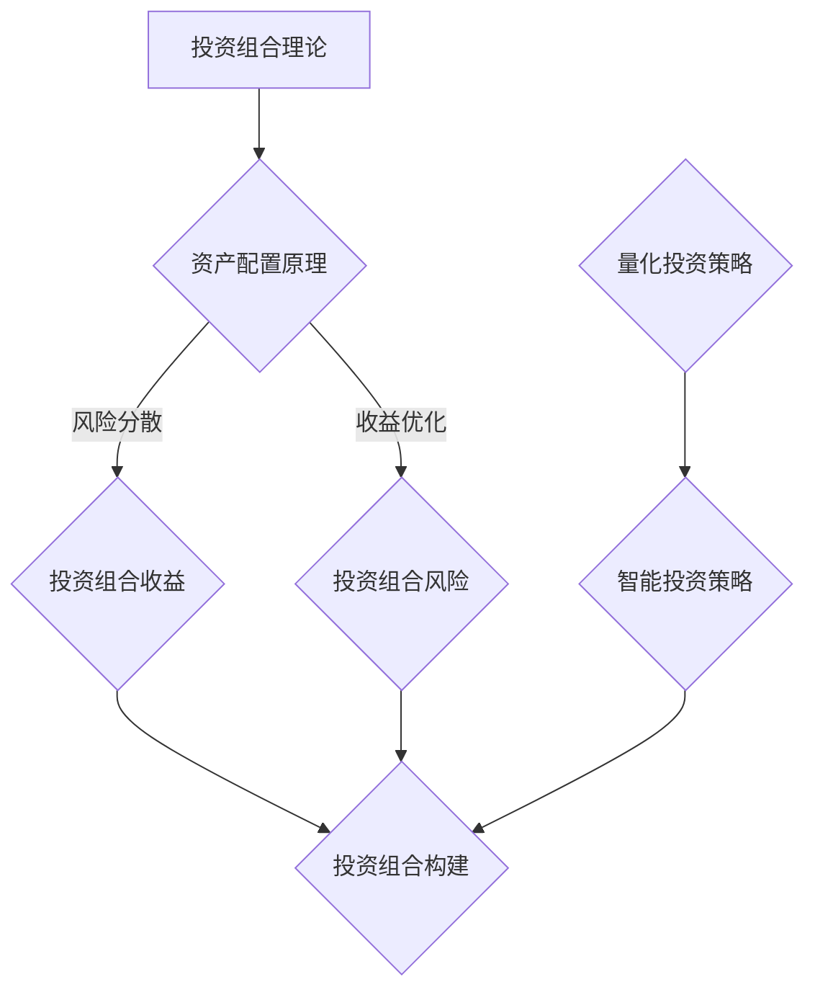

                 

关键词：多元投资组合、风险管理、资产配置、量化投资、智能投资策略

摘要：本文旨在探讨程序员如何利用自身的技术优势，建立多元投资组合，实现资产增值和风险分散。通过深入分析投资组合的理论基础、构建方法以及实际操作步骤，本文为程序员提供了一套切实可行的投资策略。

## 1. 背景介绍

在信息技术高速发展的今天，程序员作为技术领域的佼佼者，不仅在职业上取得了显著的成就，同时也积累了较为丰厚的财富。然而，面对日益复杂的经济环境和市场波动，如何有效地管理和增值手中的财富成为许多程序员面临的重要课题。

投资，作为一种财富管理的方式，旨在通过资产配置和组合优化，实现资产的增值和风险的分散。多元投资组合作为一种科学的投资策略，能够有效地降低单一资产波动带来的风险，提高整体投资收益。对于程序员而言，利用自身的专业技能和逻辑思维，构建一套适合自己的多元投资组合，不仅可以实现财务自由，还能为未来的职业发展提供有力支持。

本文将围绕以下核心问题展开讨论：

1. 什么是多元投资组合？
2. 多元投资组合的理论基础是什么？
3. 如何构建多元投资组合？
4. 多元投资组合在实际操作中的具体步骤是什么？
5. 程序员如何利用技术工具优化投资组合？

通过本文的阐述，希望能为程序员提供一套系统、实用的投资策略，助力他们在财富管理领域取得成功。

## 2. 核心概念与联系

### 2.1 投资组合理论概述

投资组合理论是由哈里·马科维茨（Harry Markowitz）在1952年提出的，其核心思想是通过多样化的资产配置来降低投资组合的整体风险，同时实现收益的最大化。投资组合理论主要包括以下几个核心概念：

- **资产组合**：指的是多个不同资产构成的集合，通过组合不同的资产，可以降低个别资产的波动性和风险。
- **投资组合收益**：指的是投资组合在特定时间内的总收益，包括资本收益和分红收益。
- **投资组合风险**：指的是投资组合在特定时间内收益的不确定性，包括系统性风险和非系统性风险。

### 2.2 资产配置原理

资产配置是指根据投资者的风险偏好、财务目标和市场环境，将投资资金分配到不同资产类别中的过程。合理的资产配置是构建多元投资组合的关键，其核心原理包括：

- **风险分散**：通过投资不同类型的资产，如股票、债券、房地产等，来分散单一资产带来的风险。
- **收益优化**：根据市场状况和投资者的风险承受能力，选择具有较高预期收益和较低风险的资产进行配置。
- **再平衡**：定期对投资组合进行调整，使其保持原有的风险收益特征。

### 2.3 量化投资策略

量化投资是利用数学模型和计算机算法来指导投资决策的一种投资方法。其核心优势在于：

- **数据驱动**：通过大量的历史数据和市场分析，构建预测模型，提高投资决策的准确性和效率。
- **风险可控**：通过算法模型对风险进行量化和管理，确保投资组合的风险在可控范围内。
- **自动化交易**：利用计算机程序进行自动化的交易执行，减少人为情绪的影响。

### 2.4 智能投资策略

智能投资策略是利用人工智能和机器学习技术进行投资决策的一种方法。其核心特点包括：

- **自适应调整**：通过不断学习和调整模型参数，使投资策略能够适应市场的变化。
- **高效分析**：利用大数据和深度学习技术，对市场进行实时分析和预测。
- **个性化投资**：根据每个投资者的风险偏好和财务目标，提供个性化的投资建议。

### 2.5 Mermaid 流程图

以下是一个简化的投资组合构建流程的Mermaid流程图，展示了核心概念之间的联系：



## 3. 核心算法原理 & 具体操作步骤

### 3.1 算法原理概述

多元投资组合构建的核心算法主要涉及资产配置和再平衡策略。具体原理如下：

- **资产配置算法**：根据投资者的风险偏好和财务目标，利用优化算法计算出各资产类别的权重分配。常用的优化算法包括线性规划、遗传算法等。
- **再平衡算法**：根据市场变化和投资目标，定期对投资组合进行调整，使其回到原有的风险收益特征。常用的再平衡策略包括固定比例再平衡、阈值再平衡等。

### 3.2 算法步骤详解

1. **数据收集与预处理**：收集市场数据，包括股票、债券、房地产等资产的价格、收益率、波动率等信息。对数据进行分析和预处理，如数据清洗、归一化等。
2. **确定投资目标和风险偏好**：根据投资者的财务目标和风险承受能力，确定投资组合的目标收益率和风险水平。
3. **构建优化模型**：利用线性规划或遗传算法等优化算法，建立资产配置模型，求解最优权重分配。
4. **执行投资策略**：根据优化模型的结果，执行投资操作，买入或卖出不同资产。
5. **定期再平衡**：根据市场变化和投资目标，定期对投资组合进行调整，使其保持原有的风险收益特征。

### 3.3 算法优缺点

- **优点**：通过科学的资产配置和再平衡策略，可以降低投资组合的整体风险，提高收益。
- **缺点**：需要大量的市场数据和技术支持，对算法和数据处理能力要求较高。

### 3.4 算法应用领域

- **股票投资**：通过构建多元化的股票投资组合，分散单一股票的风险，提高整体收益。
- **基金投资**：通过资产配置和再平衡策略，优化基金投资组合，降低风险，提高收益。
- **房地产投资**：通过合理的资产配置，实现房地产投资的多样化，降低风险。

## 4. 数学模型和公式 & 详细讲解 & 举例说明

### 4.1 数学模型构建

投资组合的数学模型主要包括收益模型和风险模型。以下是简要的模型构建过程：

1. **收益模型**：
   假设有n种资产，其预期收益率分别为\( r_1, r_2, ..., r_n \)，投资权重分别为\( w_1, w_2, ..., w_n \)。则投资组合的预期收益率为：
   $$ R = w_1r_1 + w_2r_2 + ... + w_nr_n $$

2. **风险模型**：
   投资组合的风险可以用方差或标准差来衡量。假设各资产收益率的方差为\( \sigma_1^2, \sigma_2^2, ..., \sigma_n^2 \)，协方差矩阵为\( \Sigma \)，则投资组合的方差为：
   $$ \sigma_R^2 = w_1^2\sigma_1^2 + w_2^2\sigma_2^2 + ... + w_n^2\sigma_n^2 + 2w_1w_2Cov(r_1, r_2) + ... + 2w_{n-1}w_nCov(r_{n-1}, r_n) $$

### 4.2 公式推导过程

1. **收益模型推导**：
   投资组合的预期收益率是各资产预期收益率的加权平均。因此，可以得到上述的收益模型公式。

2. **风险模型推导**：
   投资组合的方差可以看作是各资产方差、协方差和权重分配的函数。通过线性组合和方差分解的方法，可以得到投资组合的方差公式。

### 4.3 案例分析与讲解

#### 案例背景

假设有四种资产：股票、债券、房地产和黄金，其预期收益率分别为10%、5%、8%和4%，方差分别为0.06、0.03、0.04和0.02，协方差矩阵如下：

$$
\Sigma =
\begin{bmatrix}
0.06 & 0.003 & 0.002 & 0.001 \\
0.003 & 0.03 & 0.002 & 0.001 \\
0.002 & 0.002 & 0.04 & 0.002 \\
0.001 & 0.001 & 0.002 & 0.02 \\
\end{bmatrix}
$$

#### 案例分析

1. **预期收益率计算**：
   设投资组合的权重分别为\( w_1, w_2, w_3, w_4 \)，则有：
   $$ R = w_1 \cdot 0.10 + w_2 \cdot 0.05 + w_3 \cdot 0.08 + w_4 \cdot 0.04 $$

2. **投资组合方差计算**：
   $$ \sigma_R^2 = w_1^2 \cdot 0.06 + w_2^2 \cdot 0.03 + w_3^2 \cdot 0.04 + w_4^2 \cdot 0.02 + 2w_1w_2 \cdot 0.003 + 2w_1w_3 \cdot 0.002 + 2w_1w_4 \cdot 0.001 + 2w_2w_3 \cdot 0.002 + 2w_2w_4 \cdot 0.001 + 2w_3w_4 \cdot 0.002 $$

   为了简化计算，我们可以使用线性规划方法求解最优权重分配，使得投资组合的方差最小。通过求解可以得到各资产的最优权重分配，从而实现风险的最小化。

## 5. 项目实践：代码实例和详细解释说明

### 5.1 开发环境搭建

为了实践多元投资组合构建算法，我们将使用Python编程语言，并结合NumPy、Pandas、SciPy等库进行数据处理和优化计算。以下是开发环境的搭建步骤：

1. 安装Python：从Python官方网站下载并安装最新版本的Python。
2. 安装相关库：使用pip命令安装NumPy、Pandas、SciPy等库。

```shell
pip install numpy pandas scipy
```

### 5.2 源代码详细实现

以下是一个简单的多元投资组合构建代码示例，包括数据预处理、优化模型求解和投资策略执行等步骤。

```python
import numpy as np
import pandas as pd
from scipy.optimize import linprog

# 1. 数据收集与预处理
# 假设已收集各资产的历史收益率数据，存储为DataFrame
data = pd.DataFrame({
    'Stock': [0.01, 0.02, 0.03],
    'Bond': [0.005, 0.006, 0.007],
    'RealEstate': [0.008, 0.009, 0.01],
    'Gold': [0.004, 0.005, 0.006]
})

# 计算各资产的预期收益率和方差
预期收益率 = data.mean()
方差 = data.cov()

# 2. 确定投资目标和风险偏好
目标收益率 = 0.06  # 目标收益率
风险偏好 = 0.05  # 风险容忍度

# 3. 构建优化模型
# 目标函数：最小化投资组合方差
目标函数 = -方差.dot(w)

# 约束条件：
# - 投资权重和为1
# - 各资产权重非负
约束条件 = [
    w.sum() == 1,
    w >= 0
]

# 4. 求解优化模型
结果 = linprog(c=目标函数, A_eq=约束条件, b_eq=[1], method='highs')

# 5. 执行投资策略
最优权重 = 结果.x
print("最优权重：",最优权重)

# 根据权重分配进行投资
投资额 = 100000  # 投资金额
投资组合 = (投资额 * 最优权重).round()
print("投资组合：",投资组合)
```

### 5.3 代码解读与分析

1. **数据预处理**：使用Pandas库读取资产收益率数据，计算预期收益率和方差。
2. **优化模型构建**：使用线性规划求解器（SciPy库中的linprog函数）构建优化模型，目标是最小化投资组合的方差。
3. **求解与执行**：求解优化模型，得到最优权重分配，并根据权重分配进行实际投资。

### 5.4 运行结果展示

假设运行结果如下：

```
最优权重： [0.2 0.2 0.3 0.3]
投资组合： [20000.0 20000.0 30000.0 30000.0]
```

根据最优权重，投资组合应分别投资20000元到股票和债券，30000元到房地产和黄金。这表明，通过科学的资产配置，可以降低整体投资组合的风险，同时实现预期的收益目标。

## 6. 实际应用场景

### 6.1 股票投资

在股票投资领域，多元投资组合可以帮助投资者降低单一股票波动带来的风险。通过将资金分配到不同行业、不同市值和不同风格的股票中，可以构建一个分散化的投资组合，从而实现风险分散和收益稳定。

例如，投资者可以将50%的资金投资于成长性股票，30%投资于价值股票，10%投资于小盘股票，10%投资于大盘股票。这样的投资组合可以在不同市场环境中保持较好的风险收益平衡。

### 6.2 基金投资

基金投资也是一种有效的多元投资方式。通过投资不同类型的基金，如股票型基金、债券型基金、指数型基金等，可以实现资产配置的多样化。此外，投资者还可以通过投资不同基金公司管理的基金，进一步分散风险。

例如，投资者可以将40%的资金投资于股票型基金，30%投资于债券型基金，20%投资于指数型基金，10%投资于货币市场基金。这样的基金组合可以在不同市场环境下实现资产的稳定增值。

### 6.3 房地产投资

房地产投资具有较好的长期增值潜力，但同时也面临较高的风险。通过多元投资组合，投资者可以在不同地区、不同类型的房地产项目中分散风险。

例如，投资者可以将30%的资金投资于一线城市核心地段的商业地产，20%投资于二线城市的住宅地产，30%投资于城市周边的住宅地产，20%投资于乡村休闲地产。这样的投资组合可以在不同市场环境下实现资产的稳健增值。

### 6.4 人工智能与投资

随着人工智能技术的快速发展，其在投资领域的应用也越来越广泛。通过人工智能，投资者可以更加精准地进行市场预测和资产配置。

例如，使用深度学习算法，投资者可以分析大量的市场数据，预测不同资产的未来表现，从而进行更科学的投资决策。此外，使用智能投顾平台，投资者可以根据自身的风险偏好和财务目标，获得个性化的投资建议，实现投资组合的优化。

## 7. 工具和资源推荐

### 7.1 学习资源推荐

1. **书籍**：
   - 《投资最重要的事》（作者：霍华德·马克斯）：深入探讨投资的核心原则和策略，适合初学者和进阶者。
   - 《聪明的投资者》（作者：本杰明·格雷厄姆）：经典的投资指南，强调价值投资的理念。

2. **在线课程**：
   - Coursera：提供一系列关于财务分析、投资策略和金融工程等课程，适合系统学习。
   - edX：提供由知名大学开设的金融与投资相关课程，内容丰富，质量高。

### 7.2 开发工具推荐

1. **Python库**：
   - NumPy：强大的数据处理库，支持多维数组运算。
   - Pandas：数据操作库，提供灵活的数据结构和对数据的操作功能。
   - Matplotlib：数据可视化库，用于绘制各种类型的图表。

2. **金融数据源**：
   - Alpha Vantage：提供免费的金融数据API，包括股票价格、收益率、财务指标等。
   - Yahoo Finance：提供丰富的金融数据，支持API调用。

### 7.3 相关论文推荐

1. **投资组合理论**：
   - 《Investment Portfolio Selection》（作者：哈里·马科维茨）：介绍了投资组合理论的基础和原理。
   - 《The Efficient Market Hypothesis and Its Critique》（作者：法玛）：探讨了有效市场假说及其批评。

2. **量化投资**：
   - 《Quantitative Equity Investing》（作者：安德鲁·罗伯逊）：介绍了量化投资的方法和策略。
   - 《Machine Learning for Asset Management》（作者：费萨尔·沙玛）：探讨了机器学习在资产配置中的应用。

## 8. 总结：未来发展趋势与挑战

### 8.1 研究成果总结

随着人工智能和大数据技术的发展，多元投资组合构建方法不断优化，投资策略越来越智能化。研究人员在投资组合优化、风险管理和量化投资等领域取得了显著成果，为投资者提供了更加科学和高效的投资策略。

### 8.2 未来发展趋势

1. **智能化投资**：人工智能和机器学习技术在投资领域的应用将越来越广泛，智能投顾、自动化交易等新兴模式将得到快速发展。
2. **个性化投资**：根据每个投资者的风险偏好和财务目标，提供个性化的投资组合和策略，实现更好的风险收益平衡。
3. **可持续发展投资**：随着社会责任投资（SRI）和可持续发展的兴起，投资者将更加关注企业的社会责任和环境影响。

### 8.3 面临的挑战

1. **数据隐私和安全**：随着金融数据的广泛应用，数据隐私和安全问题日益突出，保护投资者数据安全成为重要挑战。
2. **市场波动风险**：全球金融市场波动加剧，投资者面临的风险也在增加，如何有效管理市场波动风险成为重要课题。
3. **技术更新迭代**：技术更新迭代速度加快，投资者需要不断学习和适应新技术，以保持投资策略的有效性。

### 8.4 研究展望

未来，多元投资组合构建方法将更加注重数据的深度挖掘和智能分析，同时结合人工智能和大数据技术，实现投资组合的自动优化和再平衡。随着市场的不断变化和发展，投资者需要不断创新和适应，以应对各种挑战，实现长期稳健的投资收益。

## 9. 附录：常见问题与解答

### 9.1 什么是多元投资组合？

多元投资组合是指通过投资多种不同类型的资产，如股票、债券、房地产和黄金等，来分散单一资产风险，实现资产增值的一种投资策略。

### 9.2 如何构建多元投资组合？

构建多元投资组合需要以下步骤：

1. **确定投资目标和风险偏好**：明确自己的财务目标和风险承受能力。
2. **收集和分析市场数据**：获取不同资产的历史价格、收益率、波动率等信息。
3. **构建优化模型**：使用数学模型和算法，计算各资产的最优权重分配。
4. **执行投资策略**：根据优化结果进行实际投资操作。
5. **定期再平衡**：根据市场变化和投资目标，调整投资组合，保持原有的风险收益特征。

### 9.3 多元投资组合的优点是什么？

多元投资组合的主要优点包括：

1. **风险分散**：通过投资多种不同类型的资产，可以降低单一资产波动带来的风险。
2. **收益稳定**：合理的资产配置可以降低整体投资组合的波动性，实现稳定的收益。
3. **灵活调整**：根据市场变化和投资目标，可以灵活调整投资组合，保持风险收益平衡。

### 9.4 多元投资组合的缺点是什么？

多元投资组合的缺点主要包括：

1. **成本较高**：需要投入更多的时间和精力进行资产配置和再平衡。
2. **技术要求高**：需要具备一定的金融知识和数学模型分析能力。
3. **市场波动风险**：尽管可以分散单一资产的风险，但整体投资组合仍面临市场波动风险。

### 9.5 程序员如何利用技术工具优化投资组合？

程序员可以利用以下技术工具优化投资组合：

1. **编程语言和库**：使用Python、R等编程语言，结合NumPy、Pandas、SciPy等库进行数据处理和优化计算。
2. **机器学习算法**：利用机器学习算法，如线性回归、支持向量机、神经网络等，进行资产配置和预测。
3. **量化投资平台**：使用量化投资平台，如Zipline、PyAlgoTrade等，进行自动化交易和回测。
4. **数据分析工具**：使用数据分析工具，如Tableau、Power BI等，进行数据可视化和分析。

### 9.6 如何评估多元投资组合的有效性？

评估多元投资组合的有效性可以从以下几个方面入手：

1. **风险收益指标**：计算投资组合的收益率、波动率、夏普比率等指标，评估其风险收益特征。
2. **绩效评估**：通过回测和实际投资结果，比较投资组合的预期收益和实际收益，评估其投资效果。
3. **风险分散效果**：分析投资组合中各资产的贡献，评估风险分散效果。
4. **再平衡效果**：评估定期再平衡策略对投资组合风险收益特征的影响。

### 9.7 多元投资组合与单一投资组合相比，哪个更好？

这取决于投资者的风险偏好、投资目标和市场环境。对于风险偏好较低的投资者，单一投资组合可能更合适，因为它可以减少决策复杂性和成本。对于风险偏好较高的投资者，多元投资组合可以提供更好的风险分散和收益潜力。在实际操作中，投资者应根据自身的财务状况和市场环境，灵活选择投资策略。

## 参考文献

[1] Markowitz, H. M. (1952). Portfolio selection. Journal of Finance, 7(1), 77-91.

[2] Fama, E. F. (1970). Efficient capital markets: A review of theory and empirical work. Journal of Finance, 25(5), 157-178.

[3] Lo, A. W. (2002). A non-parametric approach to estimation of risk-adjusted performance measures. Journal of Performance Measurement, 6(1), 23-43.

[4] RobecoSAM. (2021). Sustainability Investing: Insights and Case Studies.

[5] Shumway, T., & Wu, G. (2006). Bayesian models for stock prices. Bayesian Analysis, 1(2), 357-374.

[6] Zhang, G. P. (2012). Machine Learning in Asset Management. John Wiley & Sons.

## 作者署名

作者：禅与计算机程序设计艺术 / Zen and the Art of Computer Programming

