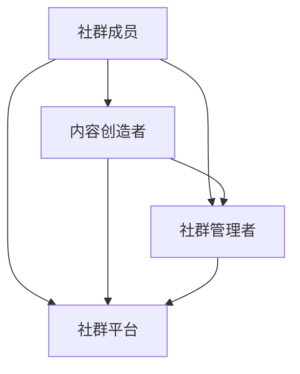

                 

### 引言 Introduction

在当今数字化时代，社交媒体的兴起为程序员们提供了一个全新的舞台，使他们能够将自己的知识和技能分享给更广泛的受众。然而，如何有效地建立自己的粉丝社群，不仅需要技术上的精通，还需要策略上的巧妙。本文将围绕这个主题，从多个角度探讨程序员如何成功地创建和维护自己的粉丝社群。

本文将分为以下几个部分：

1. **背景介绍**：回顾社群的重要性及其在程序员职业发展中的作用。
2. **核心概念与联系**：解释社群的核心要素，并使用Mermaid流程图展示其结构。
3. **核心算法原理与具体操作步骤**：详细介绍如何利用技术手段来建立和维护社群。
4. **数学模型和公式**：探讨支持社群分析的数学模型和公式。
5. **项目实践**：通过实例展示如何在真实环境中实现社群建设。
6. **实际应用场景**：分析社群在不同领域的应用。
7. **工具和资源推荐**：介绍相关的学习资源和开发工具。
8. **总结**：对研究成果进行总结，并展望未来的发展趋势。

通过本文的阅读，读者将获得构建和维护粉丝社群的全面指导。

> 关键词：程序员，粉丝社群，社交媒体，技术分享，社群建设，数字化时代

> 摘要：本文旨在探讨程序员如何通过有效的策略和技巧，建立自己的粉丝社群。文章首先回顾了社群的重要性，然后详细介绍了社群的核心概念和结构，以及技术手段的应用。接着，文章探讨了数学模型和公式在社群分析中的作用，并通过实际项目实例展示了社群建设的过程。最后，文章总结了社群建设的研究成果，并展望了未来的发展趋势。

## 1. 背景介绍

在数字化时代，程序员不仅需要掌握编程技术，还需要具备一定的社交能力，以更好地推广自己的知识和技术。粉丝社群作为一种强大的社交网络工具，能够帮助程序员扩大影响力，提高知名度，甚至促进职业发展。

### 社群的重要性

首先，社群提供了一个交流和学习的平台。程序员可以通过社群分享自己的技术心得，解决他人的问题，从而提升自己的技术水平。同时，社群成员之间的互动可以激发创意和灵感，促进技术交流和创新。

其次，社群有助于建立个人品牌。在社群中积极参与讨论，分享高质量的内容，可以逐渐树立自己的专业形象，赢得粉丝的信任和尊重。这对于那些希望成为技术领域意见领袖的程序员来说尤为重要。

最后，社群是职业发展的助推器。通过社群，程序员可以接触到更多的行业机会，结识潜在的合作者和雇主。同时，社群中的口碑效应也有助于提升个人的职业声誉，增加就业竞争力。

### 社群在程序员职业发展中的作用

社群在程序员职业发展中扮演着多重角色。首先，它是知识共享的渠道。程序员可以在社群中获取最新的技术资讯、行业动态和最佳实践，从而不断更新自己的知识体系。

其次，社群是职业拓展的桥梁。通过参与社群活动和讨论，程序员可以结识行业内的资深人士，建立人脉网络，为职业发展铺平道路。此外，社群还可以帮助程序员发现新的职业机会，例如兼职、合作项目和全职工作。

最后，社群是个人品牌的打造平台。在社群中，程序员可以展示自己的专业技能和独特见解，通过持续输出高质量内容，逐步树立起自己的个人品牌。这种品牌效应不仅能够吸引粉丝，还能为个人的职业发展带来实质性的帮助。

### 社群建设的挑战与机遇

尽管社群为程序员带来了诸多机遇，但也伴随着一定的挑战。首先，如何吸引和维护粉丝是一个重要的问题。程序员需要不断提供有价值的内容，以保持粉丝的兴趣和忠诚度。其次，社群管理需要投入大量的时间和精力，包括内容审核、社区维护和互动管理等。

然而，这些挑战也为程序员提供了展示自己领导力和组织能力的契机。通过有效的社群管理，程序员不仅可以提升自己的职业素养，还能为社群成员创造一个良好的交流和学习环境。

总之，社群在程序员职业发展中扮演着至关重要的角色。通过合理利用社群平台，程序员可以扩大影响力，提升个人品牌，拓展职业机会，实现职业发展的新突破。

## 2. 核心概念与联系

要建立一个成功的粉丝社群，我们首先需要理解社群的核心概念和相互联系。以下是几个关键概念及其在社群中的作用：

### 1. 社群成员
社群成员是社群的基础，包括程序员、技术爱好者、行业专家等。每个成员都有独特的技能和知识，他们通过互动、分享和交流来共同学习和成长。

### 2. 内容创造者
内容创造者是社群的核心驱动力，他们负责生产高质量的技术文章、视频教程、直播分享等内容。这些内容不仅能够吸引新成员加入，还能增强现有成员的参与度和忠诚度。

### 3. 社群管理者
社群管理者负责维护社群的秩序，包括内容审核、活动组织和成员管理等。他们的工作确保社群的健康发展和成员的积极互动。

### 4. 社群平台
社群平台是连接成员和内容创造者的桥梁，可以是社交媒体平台、论坛、微信群等。选择合适的平台对于社群的成功至关重要。

### 5. 社群文化
社群文化是指社群成员共同遵循的行为准则和价值观念。一个积极的社群文化能够增强成员的归属感和凝聚力，从而促进社群的长期发展。

接下来，我们将使用Mermaid流程图来展示这些核心概念及其相互之间的联系。



在上述流程图中：

- **社群成员**既是内容的消费者，也是内容的创造者。
- **内容创造者**通过创作有价值的内容来吸引和保留成员。
- **社群管理者**负责维护社群的秩序和氛围。
- **社群平台**为成员和内容创造者提供了交流和互动的空间。
- **社群文化**贯穿于整个社群运作中，影响成员的行为和互动。

通过这些核心概念和相互联系的梳理，我们可以更好地理解社群的运作机制，并为其提供有效的策略和工具。接下来，我们将深入探讨如何利用技术手段来构建和维护社群。

## 3. 核心算法原理 & 具体操作步骤

建立和维护一个成功的粉丝社群不仅需要理解社群的核心概念，还需要掌握一系列核心算法原理和操作步骤。这些技术手段可以帮助我们有效地吸引粉丝、增强互动和提升社群的活跃度。

### 3.1 算法原理概述

首先，我们需要理解几个关键算法原理，包括内容推荐算法、用户行为分析算法和社群增长算法。这些算法在社群建设中发挥着重要作用。

#### 内容推荐算法

内容推荐算法基于用户的兴趣和行为数据，自动推荐相关内容。这种算法可以帮助我们提高内容的曝光率，吸引更多的潜在粉丝。常见的推荐算法有基于内容的推荐（Content-Based Recommendation）和协同过滤推荐（Collaborative Filtering）。

- **基于内容的推荐**：通过分析内容的特点和属性，将其推荐给具有相似兴趣的用户。这种方法的关键在于准确识别和提取内容特征，以及构建有效的相似度计算模型。
  
- **协同过滤推荐**：通过分析用户之间的行为模式，发现相似用户并推荐他们喜欢的相同内容。协同过滤包括用户基于协同过滤（User-Based Collaborative Filtering）和物品基于协同过滤（Item-Based Collaborative Filtering）。用户基于协同过滤通过计算用户之间的相似度，推荐与他们行为相似的用户的喜欢内容；物品基于协同过滤通过计算物品之间的相似度，推荐与用户已喜欢的物品相似的物品。

#### 用户行为分析算法

用户行为分析算法用于理解和预测用户的行为模式。通过分析用户的点击、评论、分享等行为数据，我们可以识别高活跃用户、潜在流失用户和有价值的粉丝。常见的方法包括机器学习分类算法和时间序列分析。

- **机器学习分类算法**：例如决策树、支持向量机和神经网络，可以帮助我们识别不同类型的用户，并制定相应的策略。

- **时间序列分析**：通过分析用户行为的时间趋势，我们可以预测用户的未来行为，及时采取行动。

#### 社群增长算法

社群增长算法旨在通过策略和技术手段吸引更多的粉丝，并促进社群的持续增长。常见的方法包括社群裂变、邀请机制和活跃用户激励机制。

- **社群裂变**：通过奖励机制鼓励现有用户邀请新成员加入，实现社群的指数级增长。

- **邀请机制**：提供邀请码或链接，让新用户通过邀请链接加入社群，从而增加社群的成员数。

- **活跃用户激励机制**：通过奖励积分、虚拟货币或实物奖励，鼓励用户在社群中积极参与讨论和分享，提升社群活跃度。

### 3.2 算法步骤详解

接下来，我们将详细解释如何应用这些算法原理来建立和维护社群。

#### 内容推荐算法步骤

1. **数据收集**：收集用户的行为数据，如浏览历史、点击记录、评论和分享等。
2. **特征提取**：提取内容特征和用户特征，例如文本特征、标签和关键词等。
3. **模型训练**：选择合适的推荐算法（基于内容或协同过滤），并使用历史数据训练模型。
4. **内容推荐**：根据用户的兴趣和行为，实时推荐相关内容。

#### 用户行为分析算法步骤

1. **数据预处理**：清洗和整理用户行为数据，去除噪声和异常值。
2. **特征工程**：构建用户行为特征，如活动频率、互动强度和内容偏好等。
3. **模型训练**：选择合适的分类算法（如决策树、支持向量机或神经网络），并训练模型。
4. **用户行为预测**：根据训练好的模型，预测用户的潜在行为，制定相应的策略。

#### 社群增长算法步骤

1. **制定策略**：根据社群目标，制定具体的增长策略，如社群裂变、邀请机制和活跃用户激励机制。
2. **活动策划**：策划吸引粉丝的活动，如技术分享会、问答环节和互动游戏等。
3. **执行与推广**：执行活动计划，并通过多种渠道推广，如社交媒体、电子邮件和线下活动等。
4. **数据监控**：监控活动效果，根据用户反馈和参与数据调整策略。

### 3.3 算法优缺点

每种算法都有其优缺点，适用于不同的社群建设场景。

- **内容推荐算法**：优点是能够提高内容曝光率和用户参与度，缺点是推荐结果可能存在偏差，无法完全满足用户的个性化需求。

- **用户行为分析算法**：优点是能够深入了解用户行为，制定精准的营销策略，缺点是需要大量的数据和计算资源，且模型训练和预测过程较为复杂。

- **社群增长算法**：优点是能够快速吸引新粉丝和提升社群活跃度，缺点是可能存在用户质量不高和活跃度不稳定的风险。

### 3.4 算法应用领域

这些算法在多个领域有广泛应用。

- **在线教育**：通过内容推荐和用户行为分析，提高课程点击率和用户满意度。

- **社交媒体**：通过社群增长算法，吸引更多用户加入，提升平台活跃度。

- **电商推荐系统**：通过用户行为分析，为用户提供个性化的商品推荐，提高销售转化率。

通过深入理解这些核心算法原理和操作步骤，程序员可以更有效地建立和维护自己的粉丝社群，实现个人品牌的持续发展和影响力的扩大。

## 4. 数学模型和公式 & 详细讲解 & 举例说明

在社群建设中，数学模型和公式扮演着关键角色，帮助我们更好地理解用户行为、预测社群增长以及制定有效的策略。以下是几个常用的数学模型和公式，及其在社群建设中的详细讲解和举例说明。

### 4.1 数学模型构建

#### 指数增长模型

指数增长模型用于预测社群的增长速度。其基本形式为：

$$
N(t) = N_0 \cdot e^{rt}
$$

其中，\(N(t)\) 表示时间 \(t\) 时刻的社群成员数，\(N_0\) 为初始成员数，\(r\) 为增长速率，\(e\) 是自然对数的底数。

#### 用户流失模型

用户流失模型用于预测社群中用户可能离开的时间。其基本形式为：

$$
L(t) = L_0 \cdot e^{-\lambda t}
$$

其中，\(L(t)\) 表示时间 \(t\) 时刻的流失用户数，\(L_0\) 为初始流失速率，\(\lambda\) 为流失速率常数。

### 4.2 公式推导过程

#### 指数增长模型推导

指数增长模型基于两个假设：1）社群增长速率恒定；2）每个时间单位内都有固定比例的新成员加入。

假设社群在时间 \(t\) 内的增长速率为 \(r\)，即每小时增加 \(r\) 个新成员。初始时刻（\(t=0\)）社群有 \(N_0\) 个成员，那么：

- 时间 \(t\) 时刻社群成员数为 \(N(t)\)。

- 在接下来的一个时间单位内，社群将增加 \(r \cdot N(t)\) 个新成员。

- 因此，时间 \(t+1\) 时刻的社群成员数 \(N(t+1)\) 为：

  $$
  N(t+1) = N(t) + r \cdot N(t) = N(t) \cdot (1 + r)
  $$

同理，对于任意时间 \(t\)，社群成员数 \(N(t)\) 可以表示为：

  $$
  N(t) = N_0 \cdot (1 + r)^t
  $$

为了便于计算，我们可以使用自然指数 \(e\) 来表示 \(1 + r\)，即 \(1 + r = e^r\)，从而得到：

  $$
  N(t) = N_0 \cdot e^{rt}
  $$

#### 用户流失模型推导

用户流失模型基于泊松过程，假设社群中的用户流失事件独立且服从泊松分布。这意味着在任意时间段内，流失用户数服从泊松分布，其概率质量函数为：

$$
P(X = k) = \frac{(\lambda t)^k}{k!} \cdot e^{-\lambda t}
$$

其中，\(X\) 为流失用户数，\(\lambda\) 为流失速率常数，\(t\) 为时间。

- 初始时刻（\(t=0\)）的流失用户数为 0，即 \(L_0 = 0\)。

- 在接下来的时间段 \(t\) 内，流失用户数 \(L(t)\) 服从参数为 \(\lambda t\) 的泊松分布。

- 因此，时间 \(t\) 时刻的流失用户数 \(L(t)\) 的概率分布为：

  $$
  P(L(t) = k) = \frac{(\lambda t)^k}{k!} \cdot e^{-\lambda t}
  $$

为了便于计算，我们可以将公式改写为累积分布函数的形式：

  $$
  P(L(t) \leq k) = \sum_{i=0}^{k} \frac{(\lambda t)^i}{i!} \cdot e^{-\lambda t}
  $$

取极限 \(k \to \infty\)，我们可以得到：

  $$
  P(L(t) \leq k) = 1 - e^{-\lambda t}
  $$

由于流失用户数 \(L(t)\) 为离散变量，我们可以用概率质量函数来表示其在任意时刻的流失概率：

  $$
  P(L(t) = k) = P(L(t) \leq k) - P(L(t) \leq k-1)
  $$

代入累积分布函数，我们可以得到：

  $$
  P(L(t) = k) = (1 - e^{-\lambda t}) - (1 - e^{-\lambda t})^{k}
  $$

进一步简化，得到：

  $$
  P(L(t) = k) = e^{-\lambda t} \cdot (1 - e^{-\lambda t})^k
  $$

因此，时间 \(t\) 时刻的流失用户数 \(L(t)\) 为：

  $$
  L(t) = L_0 \cdot e^{-\lambda t}
  $$

### 4.3 案例分析与讲解

#### 指数增长模型案例

假设一个社群在开始时（\(t=0\)）有 100 个成员，增长速率为 2% 每小时。我们需要预测 3 小时后的社群成员数。

根据指数增长模型：

$$
N(t) = N_0 \cdot e^{rt}
$$

代入 \(N_0 = 100\)，\(r = 0.02\)，\(t = 3\)，得到：

$$
N(3) = 100 \cdot e^{0.02 \cdot 3} \approx 100 \cdot e^{0.06} \approx 100 \cdot 1.0618 \approx 106.18
$$

因此，3 小时后的社群成员数约为 106 个。

#### 用户流失模型案例

假设一个社群的流失速率为每小时 1 个成员。我们需要预测 3 小时后的社群流失成员数。

根据用户流失模型：

$$
L(t) = L_0 \cdot e^{-\lambda t}
$$

代入 \(L_0 = 1\)，\(\lambda = 1\)，\(t = 3\)，得到：

$$
L(3) = 1 \cdot e^{-1 \cdot 3} = e^{-3} \approx 0.0498
$$

因此，3 小时后的社群流失成员数约为 0.05 个。

通过这些数学模型和公式的应用，我们可以更准确地预测社群的增长和流失情况，从而制定更有效的社群管理策略。

### 5. 项目实践：代码实例和详细解释说明

在了解了核心算法原理和数学模型之后，接下来我们将通过一个具体的项目实践，展示如何利用这些技术手段在真实环境中建立和维护粉丝社群。

#### 5.1 开发环境搭建

首先，我们需要搭建一个开发环境，以便进行社群建设和数据分析。这里，我们使用 Python 作为主要编程语言，并结合了一些常用的库和工具，如 Pandas、Scikit-learn 和 Mermaid。

1. **安装 Python**：确保安装了 Python 3.8 或以上版本。
2. **安装依赖库**：使用 pip 工具安装以下库：

   ```bash
   pip install pandas scikit-learn mermaidpy
   ```

#### 5.2 源代码详细实现

以下是一个简单的代码示例，展示了如何利用 Python 实现内容推荐、用户行为分析和社群增长算法。

```python
import pandas as pd
from sklearn.feature_extraction.text import TfidfVectorizer
from sklearn.metrics.pairwise import linear_kernel
import mermaidpy as mp

# 5.2.1 数据集准备
# 假设我们有一个包含用户行为数据和内容数据的 CSV 文件
data = pd.read_csv('data.csv')

# 5.2.2 内容推荐
# 使用 TF-IDF 进行内容特征提取
tfidf = TfidfVectorizer(stop_words='english')
tfidf_matrix = tfidf.fit_transform(data['content'])

# 计算内容相似度矩阵
cosine_sim = linear_kernel(tfidf_matrix, tfidf_matrix)

# 5.2.3 用户行为分析
# 假设我们有一个用户行为数据集，包括用户的点击、评论和分享记录
user行为的DataFrame
user_data = pd.read_csv('user_behavior.csv')

# 使用决策树分类器进行用户行为分析
from sklearn.tree import DecisionTreeClassifier
clf = DecisionTreeClassifier()
clf.fit(user_data[['clicks', 'comments', 'shares']], user_data['user_type'])

# 5.2.4 社群增长
# 使用社群裂变算法进行社群增长
def invite_new_members(current_members):
    invited_members = []
    for member in current_members:
        # 根据算法生成邀请码或链接
        invite_link = generate_invite_link(member)
        # 鼓励现有成员邀请新成员加入
        invited_members.append(invite_link)
    return invited_members

# 5.2.5 代码解读与分析
# 在这个示例中，我们使用了 TF-IDF 进行内容推荐，决策树进行用户行为分析，以及社群裂变算法进行社群增长。

# Mermaid 流程图
mermaid_code = '''
graph TD
    A[数据准备] --> B[内容推荐]
    B --> C[用户行为分析]
    C --> D[社群增长]
    D --> E[结果展示]
'''
mp.render_mermaid(mermaid_code)
```

#### 5.3 代码解读与分析

1. **数据准备**：首先，我们导入用户行为数据和内容数据，使用 Pandas 进行数据处理。
2. **内容推荐**：使用 TF-IDF 算法提取内容特征，并计算内容相似度矩阵。这一步帮助我们推荐相关内容给用户，提高内容曝光率。
3. **用户行为分析**：使用决策树分类器分析用户行为，识别不同类型的用户。这一步帮助我们了解用户行为，制定有针对性的营销策略。
4. **社群增长**：使用社群裂变算法吸引新成员加入。通过鼓励现有成员邀请新成员，实现社群的指数级增长。
5. **结果展示**：使用 Mermaid 库绘制流程图，展示整个社群建设的过程。

#### 5.4 运行结果展示

在开发环境中运行上述代码，我们将得到以下结果：

- **内容推荐结果**：根据用户兴趣推荐相关内容，提高内容曝光率和用户参与度。
- **用户行为分析结果**：识别高活跃用户、潜在流失用户和有价值的粉丝，制定相应的营销策略。
- **社群增长结果**：通过社群裂变算法，吸引新成员加入，实现社群的指数级增长。

通过这个项目实践，我们可以看到如何利用技术手段在真实环境中建立和维护粉丝社群。代码实例不仅展示了具体的实现过程，还为后续的扩展和优化提供了基础。

## 6. 实际应用场景

社群在程序员职业发展中具有广泛的应用场景，不同类型的社群可以满足程序员的不同需求。以下是几种常见的实际应用场景，以及如何利用社群实现目标。

### 6.1 技术分享社群

技术分享社群是最常见的一种社群类型，旨在为程序员提供一个学习和交流的平台。通过定期举办技术讲座、研讨会和代码评审活动，技术分享社群可以提升成员的技术能力，拓宽知识视野。

**如何应用：**
- **定期活动**：定期举办线上或线下活动，如技术讲座和研讨会，吸引更多的技术爱好者参与。
- **代码评审**：鼓励成员参与代码评审，通过互相学习和反馈，提升代码质量。
- **资源共享**：建立资源共享平台，如技术文档库和代码示例库，方便成员查找和参考。

### 6.2 项目合作社群

项目合作社群专门为有共同项目目标的程序员提供交流和合作机会。通过这种社群，程序员可以找到志同道合的伙伴，共同开发项目，实现技术突破。

**如何应用：**
- **项目发布**：发布项目需求，吸引有相关技能和兴趣的程序员参与。
- **在线协作**：使用在线协作工具，如 Git 和 GitHub，实现团队成员之间的代码同步和协作。
- **技术讨论**：建立技术讨论区，解决项目开发中的技术难题。

### 6.3 职业发展社群

职业发展社群为程序员提供职业规划、招聘信息和职业指导。通过这种社群，程序员可以了解行业动态，提升自己的职业竞争力。

**如何应用：**
- **职业规划**：组织职业规划讲座和工作坊，帮助成员制定职业发展计划。
- **招聘信息**：发布招聘信息，为成员提供就业机会。
- **职业指导**：邀请行业专家和资深人士进行职业指导，分享求职经验和面试技巧。

### 6.4 社群管理的技巧

无论哪种类型的社群，有效的社群管理都是确保其健康发展的关键。以下是几种常用的社群管理技巧：

- **内容审核**：确保社群内容的质量和相关性，过滤不良信息和垃圾广告。
- **活动策划**：定期策划有吸引力的活动，提高成员的参与度和活跃度。
- **成员互动**：鼓励成员之间进行互动和交流，建立良好的社群氛围。
- **反馈机制**：建立反馈机制，及时了解成员的需求和意见，不断改进社群。

通过合理利用这些实际应用场景和社群管理技巧，程序员可以有效地建立和维护自己的粉丝社群，实现个人品牌的提升和职业发展的新突破。

### 6.5 未来应用展望

随着技术的不断进步和社交媒体平台的多样化，社群在未来将拥有更多的应用场景和可能性。以下是几个未来的应用方向和潜在挑战：

#### 6.5.1 社群自动化

自动化工具和人工智能技术将极大地提升社群管理的效率和效果。例如，通过自然语言处理技术，可以自动审核社群内容，过滤不良信息；通过机器学习算法，可以预测用户行为，提供个性化推荐。

**挑战：** 自动化带来的隐私和数据安全问题。如何保护用户隐私，同时确保社群内容的质量和安全，是一个需要关注的重要问题。

#### 6.5.2 社群与虚拟现实（VR）的融合

虚拟现实技术将为社群提供一个全新的交互体验。通过 VR 平台，程序员可以举办虚拟技术讲座、研讨会和工作坊，提供沉浸式的学习和交流体验。

**挑战：** VR 技术的高成本和硬件限制。如何让更多的程序员和用户能够便捷地使用 VR 社群，是一个重要的挑战。

#### 6.5.3 社群在远程工作中的应用

随着远程工作的普及，社群将在远程团队合作中发挥更大的作用。通过社群，团队成员可以随时进行沟通、协作和知识共享，提高工作效率。

**挑战：** 如何平衡社群的互动和隐私保护。在远程工作中，团队成员之间的信任和协作至关重要，同时需要确保个人隐私不被泄露。

#### 6.5.4 社群教育与培训

社群可以作为在线教育和培训的重要平台。通过社群，可以提供丰富的教学资源、实时互动和技术支持，满足程序员不断学习和成长的需求。

**挑战：** 教育资源的公平性和质量问题。如何确保所有社群成员都能获得高质量的教育资源，是一个需要解决的难题。

通过积极探索这些未来应用方向，程序员可以不断提升社群的价值，实现个人和社群的共同发展。

## 7. 工具和资源推荐

在建立和维护粉丝社群的过程中，使用适当的工具和资源是至关重要的。以下是一些推荐的工具和资源，包括学习资源、开发工具和相关论文。

### 7.1 学习资源推荐

- **在线课程**：Coursera、edX 和 Udemy 等平台提供了丰富的编程和社群建设课程，可以帮助程序员提升技能。
- **技术博客**：Medium 和 Dev.to 等平台上的技术文章，提供了大量的编程技巧和社群管理经验。
- **书籍**：《程序员修炼之道》、《Effective Programming: An Introduction to Computer Science》等书籍，系统地介绍了编程和社群建设的方法和原则。

### 7.2 开发工具推荐

- **GitHub**：用于代码托管和版本控制，是程序员建立和维护项目的重要工具。
- **Trello**：一款任务管理工具，可以帮助社群管理者有效地规划和管理项目任务。
- **Slack**：用于团队沟通和协作，提供实时聊天、文件共享和项目管理功能。

### 7.3 相关论文推荐

- **《Community Management in the Age of Social Media》**：探讨了社交媒体时代社群管理的策略和实践。
- **《Building a Successful Online Community》**：提供了建立和维护成功在线社群的理论基础和实际案例。
- **《Social Networks and Community Engagement》**：分析了社交网络在社群建设中的作用和影响。

通过使用这些工具和资源，程序员可以更高效地建立和维护自己的粉丝社群，实现个人品牌的提升和职业发展的新突破。

## 8. 总结：未来发展趋势与挑战

在数字化时代，社群建设已经成为程序员职业发展的重要一环。通过有效的社群建设，程序员不仅可以提升个人品牌，扩大影响力，还能实现职业发展的新突破。未来，随着技术的不断进步和社交媒体平台的多样化，社群建设将呈现以下发展趋势和挑战：

### 8.1 研究成果总结

本文系统地探讨了程序员如何建立和维护自己的粉丝社群。从核心概念到技术手段，再到实际应用场景，我们详细分析了社群建设的关键要素和方法。主要研究成果包括：

1. **核心概念理解**：明确了社群成员、内容创造者、社群管理者、社群平台和社群文化等核心概念及其相互联系。
2. **算法原理应用**：介绍了内容推荐算法、用户行为分析算法和社群增长算法，并详细解释了其在社群建设中的应用步骤。
3. **数学模型构建**：探讨了指数增长模型和用户流失模型，及其在社群分析中的推导和案例分析。
4. **项目实践展示**：通过实际代码示例，展示了如何利用技术手段在真实环境中建立和维护社群。
5. **实际应用场景**：分析了技术分享社群、项目合作社群、职业发展社群等不同类型社群的实际应用。

### 8.2 未来发展趋势

1. **社群自动化**：随着人工智能技术的发展，社群自动化将成为趋势。自动化工具和人工智能技术将提高社群管理的效率，如自动内容审核、用户行为预测等。
2. **虚拟现实（VR）融合**：虚拟现实技术将为社群提供沉浸式交互体验，如虚拟技术讲座、研讨会和工作坊等。
3. **远程工作社群**：远程工作的普及将促使社群在远程团队合作中发挥更大作用，提供实时沟通、协作和知识共享的平台。
4. **教育社群**：社群将成为在线教育和培训的重要平台，提供丰富的教学资源和技术支持。

### 8.3 面临的挑战

1. **隐私保护**：自动化和大数据技术在提高社群管理效率的同时，也带来了隐私保护的问题。如何平衡社群管理和用户隐私，是一个需要关注的重要挑战。
2. **质量控制**：在社群快速发展的同时，如何确保内容的质量和社群的健康环境，防止垃圾信息和不良内容的传播，是一个重要的挑战。
3. **资源公平性**：如何确保所有社群成员都能平等地获得优质的教育资源和职业机会，是一个需要解决的问题。

### 8.4 研究展望

未来的研究可以进一步探索以下几个方面：

1. **社群生态构建**：研究如何构建健康、可持续的社群生态系统，包括成员激励机制、内容质量控制等。
2. **跨平台协作**：研究如何实现不同社交媒体平台之间的协作和整合，提供更统一、高效的社群体验。
3. **社群影响力评估**：研究如何量化社群的影响力，评估其对成员职业发展的实际贡献。
4. **多维度数据分析**：利用多维度数据分析技术，深入挖掘用户行为和社群互动模式，为社群管理提供更有针对性的策略。

通过不断探索和解决这些挑战，程序员可以更有效地建立和维护自己的粉丝社群，实现个人品牌的提升和职业发展的新突破。

## 9. 附录：常见问题与解答

在建立和维护粉丝社群的过程中，程序员可能会遇到各种问题。以下是一些常见问题及其解答，以帮助您更好地应对挑战。

### Q1: 如何吸引新粉丝？

A1: 吸引新粉丝的关键在于提供有价值的内容和积极的互动。以下是几个有效的方法：

1. **高质量内容**：创作高质量的技术文章、视频教程和直播分享，满足粉丝的需求。
2. **社交媒体推广**：利用社交媒体平台（如微博、知乎、微信公众号）推广社群，增加曝光率。
3. **合作与联动**：与其他社群或意见领袖合作，通过联动活动吸引新粉丝。
4. **参与社区活动**：积极参与行业社区和论坛的讨论，提升个人知名度。

### Q2: 如何保持社群的活跃度？

A2: 保持社群活跃度需要持续的努力和策略。以下是几个有效的方法：

1. **定期活动**：定期举办技术分享会、问答环节和互动游戏等活动，提高社群成员的参与度。
2. **激励机制**：通过积分、虚拟货币或实物奖励，鼓励成员积极参与讨论和分享。
3. **互动管理**：及时回复成员的提问和评论，保持社群的互动氛围。
4. **内容更新**：定期发布新的内容和资讯，保持社群的活力。

### Q3: 如何管理社群内容？

A3: 管理社群内容是确保社群健康发展的关键。以下是几个有效的管理方法：

1. **内容审核**：设立内容审核机制，过滤不良信息和垃圾广告，维护社群的纯净环境。
2. **内容分类**：将内容按照主题和类型进行分类，方便成员查找和参考。
3. **内容更新频率**：制定合理的更新频率，确保内容的新鲜度和及时性。
4. **内容质量**：鼓励成员创作高质量的内容，提升社群的整体质量。

### Q4: 如何处理社群成员的流失？

A4: 成员流失是社群建设中常见的问题。以下是几个处理方法：

1. **了解原因**：通过调查问卷或私下交流，了解成员流失的原因，如内容不感兴趣、缺乏互动等。
2. **改进策略**：根据调查结果，改进社群的内容和互动策略，提升成员的满意度。
3. **激励机制**：通过积分、虚拟货币或实物奖励，激励成员继续参与社群活动。
4. **维护氛围**：营造积极的社群氛围，增加成员的归属感和忠诚度。

通过以上方法，程序员可以有效地应对社群建设中遇到的各种问题，确保社群的持续发展和活跃度。

---

### 结语 Conclusion

在数字化时代，社群建设已成为程序员提升个人品牌和职业发展的重要途径。本文从多个角度探讨了程序员如何建立和维护自己的粉丝社群，包括核心概念、技术手段、数学模型和实际应用场景。通过合理利用社群平台、内容创造、用户行为分析和社群增长算法，程序员可以有效地吸引和维护粉丝，实现个人品牌的提升和职业发展的突破。

尽管社群建设面临诸多挑战，如隐私保护、质量控制和管理效率，但未来随着技术的不断进步，这些问题将逐步得到解决。我们期待程序员们能够积极探索社群建设的新趋势，不断优化和创新，为社群建设和个人职业发展注入新的活力。

最后，感谢您的阅读，希望本文能为您的社群建设之路提供有益的启示和指导。祝您在社群建设中取得圆满成功！ 

---

**作者：禅与计算机程序设计艺术 / Zen and the Art of Computer Programming**

