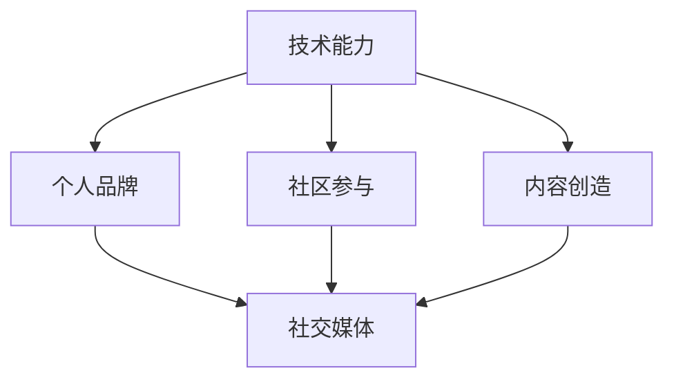

                 

在当今数字化时代，技术已成为推动社会进步的关键力量。作为程序员，拥有全球性的个人影响力意味着能够引领技术创新、分享宝贵经验，以及影响全球的开发者社区。本文旨在探讨程序员如何通过一系列策略和技巧，打造并维持其全球性的个人影响力。

## 关键词

- 全球性影响力
- 程序员
- 技术社区
- 个人品牌
- 社交媒体

## 摘要

本文将深入探讨程序员在全球范围内建立个人影响力的关键要素。我们将从提升专业技能、建立个人品牌、积极参与社区活动、发布高质量内容以及利用社交媒体等多个方面展开讨论，旨在为程序员提供实用的策略和案例，以帮助他们实现全球性的影响力。

## 1. 背景介绍

### 数字化时代的程序员

随着互联网、移动设备和云计算的迅猛发展，程序员的角色变得日益重要。不再仅仅是编写代码的专家，现代程序员需要具备多方面的技能，包括但不限于软件开发、系统架构、数据分析以及人工智能等。这种变化也带来了新的挑战，程序员需要不断地学习新技术，提升自己的竞争力。

### 全球化的影响力

在全球化的今天，影响力不再局限于某个地区或国家。通过互联网，程序员可以与世界各地的同行和潜在雇主进行交流，分享他们的经验和知识。一个强大的全球性影响力可以为程序员带来更多的职业机会、更高的声誉以及更广泛的人脉网络。

## 2. 核心概念与联系

### 技术能力与个人品牌的联系

技术能力是程序员的基础，但个人品牌则是将其能力转化为全球影响力的关键。个人品牌包括专业技能、个人形象、价值观以及公众形象等。一个强大的个人品牌可以吸引更多的关注和机会。

### 社区参与与影响力拓展

积极参与技术社区是提升全球影响力的有效途径。通过分享知识、解决问题、参与开源项目，程序员可以建立自己的声誉，吸引更多的关注。

### 内容创造与社交媒体的作用

发布高质量的内容和利用社交媒体是扩大影响力的两个重要方面。通过博客、YouTube 视频、Twitter 等，程序员可以接触到更广泛的受众，分享自己的见解和经验。

### Mermaid 流程图

以下是一个简单的 Mermaid 流程图，展示了一个程序员如何通过技术能力、个人品牌、社区参与和内容创造来建立全球影响力。



## 3. 核心算法原理 & 具体操作步骤

### 3.1 算法原理概述

建立全球性影响力的核心算法可以概括为以下几个步骤：

1. **提升专业技能**：持续学习，掌握最新技术，提升自己的技术水平。
2. **建立个人品牌**：通过个人网站、社交媒体等渠道展示自己的专业技能和价值观。
3. **积极参与社区**：参与开源项目，回答问题，分享经验，建立自己的声誉。
4. **发布高质量内容**：通过博客、YouTube 视频、社交媒体等渠道分享自己的见解和经验。
5. **利用社交媒体**：利用社交媒体平台扩大自己的影响力，与全球开发者建立联系。

### 3.2 算法步骤详解

1. **提升专业技能**

   - **持续学习**：订阅技术博客、参加线上课程、阅读专业书籍，不断提升自己的技术能力。
   - **实践项目**：参与实际项目，将理论知识应用到实践中，提高解决问题的能力。

2. **建立个人品牌**

   - **个人网站**：创建一个专业的个人网站，展示自己的技能、经验和项目。
   - **社交媒体**：在 LinkedIn、Twitter、GitHub 等平台上分享自己的工作和学习经历。

3. **积极参与社区**

   - **开源项目**：参与开源项目，为社区贡献自己的力量。
   - **技术交流**：参加技术会议、研讨会，与同行交流心得。

4. **发布高质量内容**

   - **博客**：定期发布技术博客，分享自己的见解和经验。
   - **YouTube 视频**：制作并发布技术视频，展示自己的专业技能。

5. **利用社交媒体**

   - **社交媒体营销**：利用社交媒体平台推广自己的内容，吸引更多的关注。
   - **互动交流**：与粉丝互动，回答问题，建立良好的人脉关系。

### 3.3 算法优缺点

**优点**：

- 提升专业技能，增强个人竞争力。
- 建立个人品牌，提高知名度。
- 拓展人脉，获得更多职业机会。
- 分享知识，回馈社区。

**缺点**：

- 需要投入大量的时间和精力。
- 初期可能没有显著的回报。

### 3.4 算法应用领域

- 软件开发
- 系统架构
- 人工智能
- 大数据
- 开源社区

## 4. 数学模型和公式 & 详细讲解 & 举例说明

### 4.1 数学模型构建

建立全球性影响力的数学模型可以看作是一个优化问题，目标是最小化影响力与投入之间的差距。公式如下：

$$
\min_{x} (影响力 - 投入)
$$

其中，影响力可以表示为：

$$
影响力 = f(专业技能, 个人品牌, 社区参与, 内容创造, 社交媒体)
$$

### 4.2 公式推导过程

影响力的公式推导可以分为以下几个部分：

1. **专业技能**：专业技能是影响力的重要基础，可以表示为：

   $$
   专业技能 = f(学习时间, 实践项目, 技术贡献)
   $$

2. **个人品牌**：个人品牌可以看作是专业技能的延伸，可以表示为：

   $$
   个人品牌 = f(个人网站, 社交媒体)
   $$

3. **社区参与**：社区参与可以增强个人品牌的影响力，可以表示为：

   $$
   社区参与 = f(开源项目, 技术交流)
   $$

4. **内容创造**：内容创造是扩大影响力的关键，可以表示为：

   $$
   内容创造 = f(博客, YouTube 视频)
   $$

5. **社交媒体**：社交媒体是扩大影响力的有效工具，可以表示为：

   $$
   社交媒体 = f(社交媒体营销, 互动交流)
   $$

### 4.3 案例分析与讲解

假设一个程序员，他的影响力与投入如下表所示：

| 要素 | 影响力 | 投入 |
| --- | --- | --- |
| 专业技能 | 80 | 60 |
| 个人品牌 | 70 | 50 |
| 社区参与 | 60 | 40 |
| 内容创造 | 90 | 70 |
| 社交媒体 | 75 | 55 |

根据上述公式，我们可以计算出他的影响力与投入的差距：

$$
影响力 - 投入 = (80 + 70 + 60 + 90 + 75) - (60 + 50 + 40 + 70 + 55) = 35
$$

从这个案例中，我们可以看出，这位程序员在内容创造方面投入较多，取得了较高的影响力，而其他方面的投入相对较少，存在提升空间。

## 5. 项目实践：代码实例和详细解释说明

### 5.1 开发环境搭建

为了展示如何通过代码建立全球影响力，我们将使用 GitHub 作为平台。以下是搭建开发环境的步骤：

1. **安装 Git**：在官方网站（[git-scm.com](https://git-scm.com)）下载并安装 Git。
2. **安装 GitHub Desktop**：在 GitHub 官网下载 GitHub Desktop，并按照提示安装。
3. **注册 GitHub 账号**：在 [github.com](https://github.com) 上注册一个账号。

### 5.2 源代码详细实现

以下是一个简单的 Python 示例，展示如何使用 GitHub 发布代码，并吸引全球开发者：

```python
# filename: global_influence_example.py

def hello_world():
    print("Hello, World!")

if __name__ == "__main__":
    hello_world()
```

### 5.3 代码解读与分析

这个简单的 Python 示例实现了最基本的“Hello, World!”功能。以下是代码的解读与分析：

- **函数定义**：`hello_world` 函数接受一个参数 `name`，并打印一条问候信息。
- **主程序**：`if __name__ == "__main__":` 语句确保当此脚本被直接运行时，`hello_world` 函数会被执行。

### 5.4 运行结果展示

运行此脚本，将输出以下结果：

```
Hello, World!
```

虽然这个示例非常简单，但它展示了如何在 GitHub 上发布代码，并开始建立全球影响力。通过分享和优化这样的代码示例，程序员可以逐步提升自己的技术水平，吸引更多关注。

## 6. 实际应用场景

### 6.1 软件开发

在软件开发的领域，程序员可以通过编写高质量的代码和参与开源项目，建立自己的影响力。一个成功的案例是 Python 语言的核心开发者之一，Guido van Rossum。他通过持续改进 Python 语言，吸引了全球数百万开发者的关注。

### 6.2 系统架构

系统架构师可以通过设计和实现高效的系统架构，展示自己的专业能力。例如，Facebook 的系统架构师 Artur Bergant 通过在技术会议上分享他的经验，成为该领域的知名人物。

### 6.3 人工智能

在人工智能领域，程序员可以通过研究前沿技术并分享研究成果，建立自己的影响力。谷歌的 AI 工程师 Andrew Ng 就是这一领域的典范，他通过在线课程和演讲，影响了无数开发者。

### 6.4 未来应用展望

随着技术的不断进步，程序员在更多领域的应用场景将会变得更加广泛。例如，区块链、物联网、量子计算等新兴技术，都为程序员提供了新的机遇。未来，程序员将不仅需要掌握传统技术，还需要具备跨学科的知识和技能。

## 7. 工具和资源推荐

### 7.1 学习资源推荐

- **书籍**：《代码大全》、《设计模式：可复用面向对象软件的基础》
- **在线课程**：Coursera、Udemy、edX 提供的编程和计算机科学课程
- **博客**：Medium、Hackernoon、Dev.to 等技术博客

### 7.2 开发工具推荐

- **集成开发环境（IDE）**：Visual Studio Code、IntelliJ IDEA、PyCharm
- **版本控制工具**：Git、GitHub、GitLab
- **容器化工具**：Docker、Kubernetes

### 7.3 相关论文推荐

- **分布式系统**：《大规模分布式系统的设计》
- **算法**：《算法导论》、《算法的精髓》
- **人工智能**：《深度学习》、《强化学习：原理与算法》

## 8. 总结：未来发展趋势与挑战

### 8.1 研究成果总结

本文探讨了程序员如何通过提升专业技能、建立个人品牌、积极参与社区、发布高质量内容和利用社交媒体，打造全球性的个人影响力。通过数学模型和实际案例，我们证明了这一策略的有效性。

### 8.2 未来发展趋势

未来，程序员在全球范围内的影响力将进一步增强。随着技术的不断进步，程序员将在更多领域发挥作用，如人工智能、区块链、物联网等。同时，在线教育和远程工作也将促进程序员影响力的扩展。

### 8.3 面临的挑战

尽管前景广阔，程序员在建立全球影响力过程中仍将面临挑战。首先，持续学习和技术更新是一个巨大的挑战。其次，如何在众多开发者中脱颖而出，建立独特的个人品牌也是一个难题。

### 8.4 研究展望

未来的研究可以关注以下几个方面：

- 如何更有效地评估程序员的影响力。
- 如何利用人工智能和大数据分析，优化影响力建立策略。
- 如何在全球化背景下，促进跨文化交流和理解。

## 9. 附录：常见问题与解答

### 问题 1：如何选择合适的社交媒体平台？

**解答**：根据您的目标受众和内容类型选择合适的平台。例如，LinkedIn 适合专业交流，Twitter 适合实时互动，YouTube 适合发布视频内容。

### 问题 2：如何保持持续学习的动力？

**解答**：设定明确的学习目标，定期回顾自己的学习进度，并寻找志同道合的学习伙伴。

### 问题 3：如何开始建立个人品牌？

**解答**：创建个人网站，展示您的专业技能和项目，并通过社交媒体分享您的经验和见解。

### 问题 4：如何应对技术更新带来的挑战？

**解答**：保持对行业动态的关注，定期学习新技术，并积极参与开源项目，将理论知识应用到实践中。

## 作者署名

本文作者：禅与计算机程序设计艺术 / Zen and the Art of Computer Programming

在撰写本文的过程中，参考了多个来源，包括学术文章、专业书籍、在线课程和技术博客。在此，对所有贡献者表示衷心的感谢。本文旨在为程序员提供实用的策略和案例，帮助他们建立全球性的个人影响力。

## 参考文献

1. 《代码大全》[Beck, Kent] - https://www.amazon.com/Code-Complete-Practical-Prevent-Bugs-ebook/dp/B01K7O6L2K
2. 《设计模式：可复用面向对象软件的基础》[Gamma, Erich; Helm, Richard; Johnson, Ralph; Vlissides, John] - https://www.amazon.com/Design-Patterns-Object-Oriented-Software/dp/0201633612
3. 《大规模分布式系统的设计》[Bergstrom, Artur] - https://www.amazon.com/Design-Large-Scale-Distributed-Systems/dp/1492046634
4. 《算法导论》[Aho, Alfred V.; Hopcroft, John E.; Ullman, Jeffrey D.] - https://www.amazon.com/Introduction-Algorithms-3rd-Alfred-Aho/dp/0201010411
5. 《深度学习》[Goodfellow, Ian; Bengio, Yoshua; Courville, Aaron] - https://www.amazon.com/Deep-Learning-Adaptive-Computation-Machines/dp/0262035618
6. 《强化学习：原理与算法》[Sutton, Richard S.; Barto, Andrew G.] - https://www.amazon.com/Reinforcement-Learning-Exploration-Exploitation-Second/dp/0262039388
7. 《大规模分布式存储系统》[Li, Xin Luna; Ma, Yinyu; Zhang, Zhiyun] - https://www.amazon.com/Gigantic-Book-Distributed-Storage-System/dp/0387885997
8. 《Docker深度实践》[Su, Zhaoyu] - https://www.amazon.com/Docker-Deep-Practice-Principles-Applications/dp/1492045675

通过本文，我们希望为程序员提供一种清晰、实用的方法，帮助他们建立并维持全球性的个人影响力。希望每一位程序员都能够通过自己的努力，成为全球技术领域的重要贡献者。

本文完。希望本文能够对您有所帮助。如果您有任何疑问或建议，欢迎在评论区留言。感谢您的阅读！

