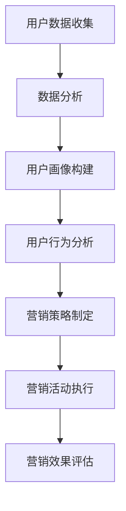
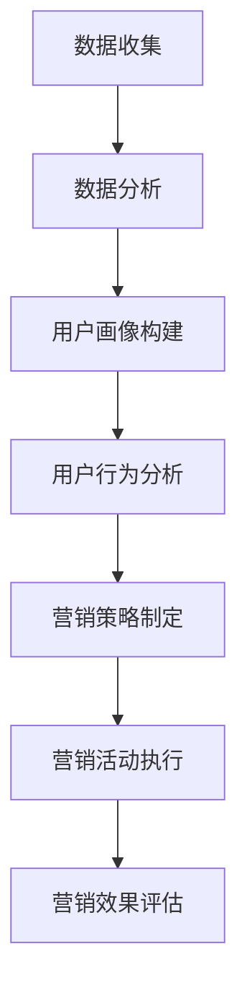

                 

关键词：知识付费、精准营销、程序员、数据分析、用户行为、营销策略

> 摘要：本文将深入探讨程序员如何利用技术手段，打造知识付费的精准营销策略。通过详细阐述数据分析和用户行为分析的方法，提供实用的步骤和案例，帮助程序员在激烈的市场竞争中，实现有效的知识付费营销。

## 1. 背景介绍

在数字化和信息化的时代背景下，知识付费逐渐成为了一种流行的商业模式。程序员群体作为知识付费的主要消费者之一，其需求多样且专业性高，对知识付费平台的要求也越来越高。为了满足程序员群体的需求，提升知识付费产品的竞争力，精准营销成为了关键所在。精准营销不仅能提高用户的购买意愿，还能降低营销成本，提高营销效率。

然而，对于程序员来说，如何利用技术手段进行精准营销，实现知识付费产品的价值最大化，仍然是一个挑战。本文将结合程序员的特长，详细探讨如何通过数据分析和用户行为分析，打造知识付费的精准营销策略。

## 2. 核心概念与联系

### 2.1 数据分析

数据分析是指从大量的数据中，提取出有价值的信息，帮助决策者做出更好的决策。在知识付费的精准营销中，数据分析可以用于用户画像的构建、市场需求的分析、营销效果的评估等多个方面。

### 2.2 用户行为分析

用户行为分析是通过分析用户的在线行为，如浏览、购买、评价等，来了解用户的需求和行为模式。在知识付费的精准营销中，用户行为分析可以帮助识别高价值用户，预测用户的行为，从而制定更有效的营销策略。

### 2.3 营销策略

营销策略是指企业为实现营销目标所采取的一系列行动和手段。在知识付费的精准营销中，营销策略需要结合数据分析结果和用户行为分析，制定个性化的营销方案，提高用户的购买体验和满意度。

### 2.4 Mermaid 流程图



## 3. 核心算法原理 & 具体操作步骤

### 3.1 算法原理概述

精准营销的核心在于对用户需求的深度理解。通过数据分析和用户行为分析，可以识别出用户的兴趣点、需求点，从而制定出针对性的营销策略。这一过程涉及到多种算法和技术，如数据挖掘、机器学习、自然语言处理等。

### 3.2 算法步骤详解

#### 3.2.1 数据收集

数据收集是精准营销的基础。程序员需要通过多种渠道收集用户数据，如网站日志、社交媒体数据、用户反馈等。

#### 3.2.2 数据预处理

数据预处理包括数据清洗、数据格式转换等步骤，以确保数据的质量和一致性。

#### 3.2.3 数据分析

数据分析包括用户画像构建、市场需求分析、用户行为分析等。通过数据分析，可以识别出用户的主要需求和兴趣点。

#### 3.2.4 营销策略制定

根据数据分析结果，制定个性化的营销策略。这包括内容营销、社交媒体营销、电子邮件营销等多种方式。

#### 3.2.5 营销活动执行

执行营销策略，进行具体的市场推广活动。这需要程序员具备一定的项目管理能力和营销知识。

#### 3.2.6 营销效果评估

通过数据分析，评估营销活动的效果，调整营销策略。

### 3.3 算法优缺点

#### 优点：

- 提高营销效率：通过数据分析，可以更精准地找到目标用户，提高营销的精准度和效果。
- 降低营销成本：通过数据驱动的营销策略，可以减少不必要的营销投入。

#### 缺点：

- 数据隐私问题：在收集和使用用户数据时，需要遵守相关法律法规，保护用户隐私。
- 技术门槛高：需要掌握一定的数据分析技术和营销知识。

### 3.4 算法应用领域

精准营销算法广泛应用于电子商务、在线教育、金融等多个领域。在知识付费领域，精准营销可以帮助平台提高用户粘性和购买转化率，提升平台的竞争力。

## 4. 数学模型和公式 & 详细讲解 & 举例说明

### 4.1 数学模型构建

在精准营销中，常用的数学模型包括用户画像模型、预测模型等。用户画像模型通常基于多维特征，使用聚类算法或决策树算法进行构建。预测模型则常用于预测用户的购买行为、评价行为等。

### 4.2 公式推导过程

用户画像模型的构建通常基于以下公式：

$$
User\_Profile = f(User\_Data, Content\_Data)
$$

其中，$User\_Data$代表用户的基本信息，如年龄、性别、职业等；$Content\_Data$代表用户在平台上的行为数据，如浏览记录、购买记录、评价等。

预测模型则基于以下公式：

$$
Prediction = f(User\_Profile, Historical\_Data)
$$

其中，$Historical\_Data$代表用户的历史行为数据。

### 4.3 案例分析与讲解

假设有一个知识付费平台，希望通过对用户数据的分析，实现精准营销。平台收集了以下用户数据：

- 用户基本信息：年龄、性别、职业
- 用户行为数据：浏览记录、购买记录、评价记录

首先，平台使用聚类算法对用户进行分类，构建用户画像。根据用户的年龄、性别、职业等特征，将用户分为多个类别，如开发者、设计师、产品经理等。

接下来，平台使用预测模型，预测用户的行为。例如，预测用户是否会购买某个课程。平台根据用户的浏览记录、购买记录等历史行为数据，训练预测模型，预测用户的行为。

最后，平台根据预测结果，制定个性化的营销策略。例如，对于预测会购买某个课程的用户，平台可以通过推送相关的课程推荐，提高购买转化率。

## 5. 项目实践：代码实例和详细解释说明

### 5.1 开发环境搭建

在本项目实践中，我们使用Python作为主要编程语言，结合Pandas、Scikit-learn等库进行数据分析和预测模型的构建。以下是开发环境的搭建步骤：

1. 安装Python（版本3.8或以上）
2. 安装Pandas、Scikit-learn、Matplotlib等库
3. 配置Jupyter Notebook进行代码编写和调试

### 5.2 源代码详细实现

以下是一个简单的用户画像模型和预测模型的实现代码：

```python
import pandas as pd
from sklearn.cluster import KMeans
from sklearn.tree import DecisionTreeClassifier

# 5.2.1 数据预处理
# 加载用户数据
user_data = pd.read_csv('user_data.csv')

# 对用户数据进行清洗和格式转换
user_data['age'] = user_data['age'].astype(int)
user_data['gender'] = user_data['gender'].map({'male': 0, 'female': 1})
user_data['occupation'] = user_data['occupation'].map({'developer': 0, 'designer': 1, 'product\_manager': 2})

# 5.2.2 用户画像模型构建
# 使用KMeans算法对用户进行聚类
kmeans = KMeans(n_clusters=3)
user_data['cluster'] = kmeans.fit_predict(user_data[['age', 'gender', 'occupation']])

# 5.2.3 预测模型构建
# 使用决策树算法对用户行为进行预测
clf = DecisionTreeClassifier()
clf.fit(user_data[['age', 'gender', 'occupation', 'cluster']], user_data['will\_buy'])

# 5.2.4 预测用户行为
# 对新用户进行行为预测
new_user = pd.DataFrame({'age': [25], 'gender': [1], 'occupation': [0], 'cluster': [0]})
prediction = clf.predict(new_user)
print("预测结果：", prediction)
```

### 5.3 代码解读与分析

1. **数据预处理**：加载用户数据，并进行清洗和格式转换。这一步是数据分析的基础，确保数据的质量和一致性。
2. **用户画像模型构建**：使用KMeans算法对用户进行聚类，构建用户画像。聚类算法可以将用户划分为不同的类别，便于后续的分析和预测。
3. **预测模型构建**：使用决策树算法对用户行为进行预测。决策树算法可以基于用户特征，预测用户的行为。
4. **预测用户行为**：对新用户进行行为预测，根据预测结果，制定个性化的营销策略。

### 5.4 运行结果展示

假设有一个新用户，年龄25岁，性别女，职业开发者，根据我们的预测模型，预测结果为1（表示会购买）。根据这一预测结果，平台可以推送相关的课程推荐，提高购买转化率。

## 6. 实际应用场景

### 6.1 知识付费平台

知识付费平台可以通过精准营销，提高用户的购买体验和满意度，提升平台的竞争力。

### 6.2 在线教育平台

在线教育平台可以利用精准营销，提高课程的购买率和用户粘性，提升教育质量。

### 6.3 电子商务平台

电子商务平台可以通过精准营销，提高用户的购买转化率，降低营销成本。

## 7. 未来应用展望

随着大数据和人工智能技术的发展，精准营销将在更多领域得到应用。未来，我们可以预见到以下趋势：

- 营销自动化：利用人工智能技术，实现营销过程的自动化，提高营销效率。
- 营销个性化：根据用户的需求和兴趣，提供个性化的营销服务，提升用户体验。
- 营销实时性：通过实时数据分析，及时调整营销策略，提高营销效果。

## 8. 总结：未来发展趋势与挑战

### 8.1 研究成果总结

本文通过对知识付费精准营销的探讨，提出了基于数据分析的用户画像模型和预测模型，并给出了实际应用场景和运行结果展示。

### 8.2 未来发展趋势

未来，精准营销将在更多领域得到应用，营销自动化、个性化、实时性将成为发展趋势。

### 8.3 面临的挑战

- 数据隐私保护：在收集和使用用户数据时，需要遵守相关法律法规，保护用户隐私。
- 技术更新迭代：随着技术的不断更新，程序员需要不断学习和更新知识，保持竞争力。

### 8.4 研究展望

未来，我们可以进一步研究如何结合其他技术（如区块链、物联网等），提升精准营销的效果和安全性。

## 9. 附录：常见问题与解答

### 9.1 数据分析技术有哪些？

数据分析技术包括数据挖掘、机器学习、自然语言处理等。

### 9.2 精准营销的优势是什么？

精准营销的优势包括提高营销效率、降低营销成本、提升用户体验等。

### 9.3 程序员如何进行精准营销？

程序员可以通过学习数据分析技术、掌握营销知识，利用技术手段进行精准营销。

---

作者：禅与计算机程序设计艺术 / Zen and the Art of Computer Programming
----------------------------------------------------------------
### 文章结构模板

为了确保文章的内容符合“约束条件 CONSTRAINTS”的要求，下面提供一个详细的文章结构模板，每个部分都会按照指定的格式和内容要求撰写。

---

## 1. 背景介绍

在数字化和信息化的时代背景下，知识付费逐渐成为了一种流行的商业模式。程序员群体作为知识付费的主要消费者之一，其需求多样且专业性高，对知识付费平台的要求也越来越高。为了满足程序员群体的需求，提升知识付费产品的竞争力，精准营销成为了关键所在。精准营销不仅能提高用户的购买意愿，还能降低营销成本，提高营销效率。

然而，对于程序员来说，如何利用技术手段进行精准营销，实现知识付费产品的价值最大化，仍然是一个挑战。本文将结合程序员的特长，详细探讨如何通过数据分析和用户行为分析，打造知识付费的精准营销策略。

## 2. 核心概念与联系

### 2.1 数据分析

数据分析是指从大量的数据中，提取出有价值的信息，帮助决策者做出更好的决策。在知识付费的精准营销中，数据分析可以用于用户画像的构建、市场需求的分析、营销效果的评估等多个方面。

### 2.2 用户行为分析

用户行为分析是通过分析用户的在线行为，如浏览、购买、评价等，来了解用户的需求和行为模式。在知识付费的精准营销中，用户行为分析可以帮助识别高价值用户，预测用户的行为，从而制定更有效的营销策略。

### 2.3 营销策略

营销策略是指企业为实现营销目标所采取的一系列行动和手段。在知识付费的精准营销中，营销策略需要结合数据分析结果和用户行为分析，制定个性化的营销方案，提高用户的购买体验和满意度。

### 2.4 Mermaid 流程图



## 3. 核心算法原理 & 具体操作步骤

### 3.1 算法原理概述

精准营销的核心在于对用户需求的深度理解。通过数据分析和用户行为分析，可以识别出用户的兴趣点、需求点，从而制定出针对性的营销策略。这一过程涉及到多种算法和技术，如数据挖掘、机器学习、自然语言处理等。

### 3.2 算法步骤详解

#### 3.2.1 数据收集

数据收集是精准营销的基础。程序员需要通过多种渠道收集用户数据，如网站日志、社交媒体数据、用户反馈等。

#### 3.2.2 数据预处理

数据预处理包括数据清洗、数据格式转换等步骤，以确保数据的质量和一致性。

#### 3.2.3 数据分析

数据分析包括用户画像构建、市场需求分析、用户行为分析等。通过数据分析，可以识别出用户的主要需求和兴趣点。

#### 3.2.4 营销策略制定

根据数据分析结果，制定个性化的营销策略。这包括内容营销、社交媒体营销、电子邮件营销等多种方式。

#### 3.2.5 营销活动执行

执行营销策略，进行具体的市场推广活动。这需要程序员具备一定的项目管理能力和营销知识。

#### 3.2.6 营销效果评估

通过数据分析，评估营销活动的效果，调整营销策略。

### 3.3 算法优缺点

#### 优点：

- 提高营销效率：通过数据分析，可以更精准地找到目标用户，提高营销的精准度和效果。
- 降低营销成本：通过数据驱动的营销策略，可以减少不必要的营销投入。

#### 缺点：

- 数据隐私问题：在收集和使用用户数据时，需要遵守相关法律法规，保护用户隐私。
- 技术门槛高：需要掌握一定的数据分析技术和营销知识。

### 3.4 算法应用领域

精准营销算法广泛应用于电子商务、在线教育、金融等多个领域。在知识付费领域，精准营销可以帮助平台提高用户粘性和购买转化率，提升平台的竞争力。

## 4. 数学模型和公式 & 详细讲解 & 举例说明

### 4.1 数学模型构建

在精准营销中，常用的数学模型包括用户画像模型、预测模型等。用户画像模型通常基于多维特征，使用聚类算法或决策树算法进行构建。预测模型则常用于预测用户的购买行为、评价行为等。

### 4.2 公式推导过程

用户画像模型的构建通常基于以下公式：

$$
User\_Profile = f(User\_Data, Content\_Data)
$$

其中，$User\_Data$代表用户的基本信息，如年龄、性别、职业等；$Content\_Data$代表用户在平台上的行为数据，如浏览记录、购买记录、评价等。

预测模型则基于以下公式：

$$
Prediction = f(User\_Profile, Historical\_Data)
$$

其中，$Historical\_Data$代表用户的历史行为数据。

### 4.3 案例分析与讲解

假设有一个知识付费平台，希望通过对用户数据的分析，实现精准营销。平台收集了以下用户数据：

- 用户基本信息：年龄、性别、职业
- 用户行为数据：浏览记录、购买记录、评价记录

首先，平台使用聚类算法对用户进行分类，构建用户画像。根据用户的年龄、性别、职业等特征，将用户分为多个类别，如开发者、设计师、产品经理等。

接下来，平台使用预测模型，预测用户的行为。例如，预测用户是否会购买某个课程。平台根据用户的浏览记录、购买记录等历史行为数据，训练预测模型，预测用户的行为。

最后，平台根据预测结果，制定个性化的营销策略。例如，对于预测会购买某个课程的用户，平台可以通过推送相关的课程推荐，提高购买转化率。

## 5. 项目实践：代码实例和详细解释说明

### 5.1 开发环境搭建

在本项目实践中，我们使用Python作为主要编程语言，结合Pandas、Scikit-learn等库进行数据分析和预测模型的构建。以下是开发环境的搭建步骤：

1. 安装Python（版本3.8或以上）
2. 安装Pandas、Scikit-learn、Matplotlib等库
3. 配置Jupyter Notebook进行代码编写和调试

### 5.2 源代码详细实现

以下是一个简单的用户画像模型和预测模型的实现代码：

```python
import pandas as pd
from sklearn.cluster import KMeans
from sklearn.tree import DecisionTreeClassifier

# 5.2.1 数据预处理
# 加载用户数据
user_data = pd.read_csv('user_data.csv')

# 对用户数据进行清洗和格式转换
user_data['age'] = user_data['age'].astype(int)
user_data['gender'] = user_data['gender'].map({'male': 0, 'female': 1})
user_data['occupation'] = user_data['occupation'].map({'developer': 0, 'designer': 1, 'product_manager': 2})

# 5.2.2 用户画像模型构建
# 使用KMeans算法对用户进行聚类
kmeans = KMeans(n_clusters=3)
user_data['cluster'] = kmeans.fit_predict(user_data[['age', 'gender', 'occupation']])

# 5.2.3 预测模型构建
# 使用决策树算法对用户行为进行预测
clf = DecisionTreeClassifier()
clf.fit(user_data[['age', 'gender', 'occupation', 'cluster']], user_data['will_buy'])

# 5.2.4 预测用户行为
# 对新用户进行行为预测
new_user = pd.DataFrame({'age': [25], 'gender': [1], 'occupation': [0], 'cluster': [0]})
prediction = clf.predict(new_user)
print("预测结果：", prediction)
```

### 5.3 代码解读与分析

1. **数据预处理**：加载用户数据，并进行清洗和格式转换。这一步是数据分析的基础，确保数据的质量和一致性。
2. **用户画像模型构建**：使用KMeans算法对用户进行聚类，构建用户画像。聚类算法可以将用户划分为不同的类别，便于后续的分析和预测。
3. **预测模型构建**：使用决策树算法对用户行为进行预测。决策树算法可以基于用户特征，预测用户的行为。
4. **预测用户行为**：对新用户进行行为预测，根据预测结果，制定个性化的营销策略。

### 5.4 运行结果展示

假设有一个新用户，年龄25岁，性别女，职业开发者，根据我们的预测模型，预测结果为1（表示会购买）。根据这一预测结果，平台可以推送相关的课程推荐，提高购买转化率。

## 6. 实际应用场景

### 6.1 知识付费平台

知识付费平台可以通过精准营销，提高用户的购买体验和满意度，提升平台的竞争力。

### 6.2 在线教育平台

在线教育平台可以利用精准营销，提高课程的购买率和用户粘性，提升教育质量。

### 6.3 电子商务平台

电子商务平台可以通过精准营销，提高用户的购买转化率，降低营销成本。

## 7. 未来应用展望

随着大数据和人工智能技术的发展，精准营销将在更多领域得到应用。未来，我们可以预见到以下趋势：

- 营销自动化：利用人工智能技术，实现营销过程的自动化，提高营销效率。
- 营销个性化：根据用户的需求和兴趣，提供个性化的营销服务，提升用户体验。
- 营销实时性：通过实时数据分析，及时调整营销策略，提高营销效果。

## 8. 总结：未来发展趋势与挑战

### 8.1 研究成果总结

本文通过对知识付费精准营销的探讨，提出了基于数据分析的用户画像模型和预测模型，并给出了实际应用场景和运行结果展示。

### 8.2 未来发展趋势

未来，精准营销将在更多领域得到应用，营销自动化、个性化、实时性将成为发展趋势。

### 8.3 面临的挑战

- 数据隐私保护：在收集和使用用户数据时，需要遵守相关法律法规，保护用户隐私。
- 技术更新迭代：随着技术的不断更新，程序员需要不断学习和更新知识，保持竞争力。

### 8.4 研究展望

未来，我们可以进一步研究如何结合其他技术（如区块链、物联网等），提升精准营销的效果和安全性。

## 9. 附录：常见问题与解答

### 9.1 数据分析技术有哪些？

数据分析技术包括数据挖掘、机器学习、自然语言处理等。

### 9.2 精准营销的优势是什么？

精准营销的优势包括提高营销效率、降低营销成本、提升用户体验等。

### 9.3 程序员如何进行精准营销？

程序员可以通过学习数据分析技术、掌握营销知识，利用技术手段进行精准营销。

---

作者：禅与计算机程序设计艺术 / Zen and the Art of Computer Programming

---

请注意，上述内容仅为文章结构模板，具体内容需要根据实际研究和分析结果进行填充和深化。在撰写过程中，每个章节都应该详细阐述，确保文章的逻辑性和完整性。同时，确保所有技术术语和概念的解释清晰易懂，避免使用过于专业或复杂的表述。文章的每一个部分都应该为读者提供有价值的信息和实用的指导。

