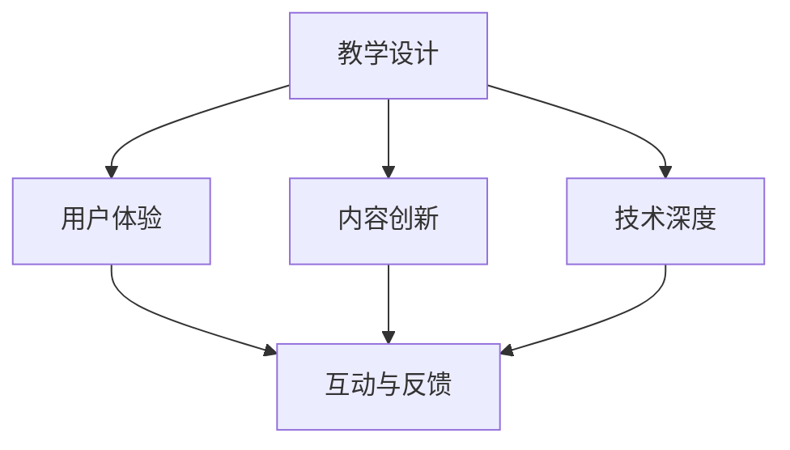

                 

关键词：知识付费、精品课程、程序员、教学设计、用户体验、课程质量、内容创新、技术深度、互动与反馈

> 摘要：本文旨在探讨程序员如何通过专业知识和教学技巧打造出深受学员喜爱的高质量知识付费课程。文章将从教学设计、用户体验、内容创新、技术深度、互动与反馈等多个方面，为程序员提供实用的建议和指导。

## 1. 背景介绍

在数字时代，知识付费已经成为一种流行的学习方式。随着在线教育平台的兴起，程序员通过创建知识付费课程不仅可以分享自己的专业知识，还能实现个人价值和社会影响力的提升。然而，要打造一节精品课程并非易事，需要程序员们深入理解教学原理、掌握教学技巧，并不断创新内容。

### 1.1 知识付费市场的现状

随着互联网技术的发展，知识付费市场呈现出爆发式增长。根据相关数据显示，知识付费用户规模不断扩大，消费能力不断提升。在这个背景下，程序员通过知识付费课程赚取收入，已经成为一种可行的职业选择。

### 1.2 程序员的优势与挑战

程序员具备丰富的技术知识和实践经验，这使得他们在知识付费领域具有独特的优势。然而，要打造一节精品课程，程序员也需要面对教学设计、课程质量、用户体验等方面的挑战。

## 2. 核心概念与联系

在打造知识付费课程的过程中，程序员需要掌握以下几个核心概念：

1. **教学设计**：包括课程结构、教学内容、教学方法等。
2. **用户体验**：关注学员在学习过程中的体验，如课程内容呈现方式、互动性、学习资源等。
3. **内容创新**：持续更新和优化课程内容，确保课程始终保持前沿性和实用性。
4. **技术深度**：在课程中深入讲解技术原理和实现细节，提高学员的技术水平。
5. **互动与反馈**：鼓励学员参与课程互动，收集学员反馈，不断改进课程质量。

以下是一个简单的Mermaid流程图，展示了这些核心概念之间的联系：



### 2.1 教学设计

教学设计是打造精品课程的基础。程序员需要根据学员的需求和课程目标，设计合理的教学结构和教学内容。

#### 课程结构

- **课程框架**：明确课程的整体结构和各部分内容。
- **章节划分**：合理划分章节，确保内容连贯性和逻辑性。

#### 教学内容

- **基础知识**：确保学员具备课程所需的基础知识。
- **实战案例**：结合实际项目案例，帮助学员理解技术原理和应用。
- **扩展内容**：提供一些扩展内容，激发学员的学习兴趣。

### 2.2 用户体验

用户体验是学员选择课程的重要因素。程序员需要关注以下几个方面：

#### 课程内容呈现

- **多媒体教学**：结合视频、图片、代码等多种形式，提高学员的学习兴趣。
- **互动性**：设置互动环节，如问答、讨论、练习等，增加学员的参与度。

#### 学习资源

- **文档资料**：提供详细的文档资料，方便学员查阅和学习。
- **代码示例**：提供完整的代码示例，帮助学员更好地理解课程内容。

### 2.3 内容创新

内容创新是课程保持竞争力的关键。程序员需要不断更新和优化课程内容，确保课程始终具有前沿性和实用性。

#### 持续更新

- **关注行业动态**：关注行业最新动态，及时更新课程内容。
- **学员需求调研**：定期开展学员需求调研，了解学员的学习需求和兴趣点。

### 2.4 技术深度

技术深度是课程质量的重要保障。程序员需要在课程中深入讲解技术原理和实现细节，帮助学员提高技术水平。

#### 技术讲解

- **原理剖析**：详细讲解技术原理，帮助学员理解技术背后的逻辑。
- **实战应用**：结合实际项目案例，展示技术的应用场景。

### 2.5 互动与反馈

互动与反馈是提高课程质量的重要手段。程序员需要鼓励学员参与互动，收集学员反馈，不断改进课程质量。

#### 互动环节

- **在线问答**：开设在线问答环节，及时解答学员的问题。
- **讨论区**：设置讨论区，鼓励学员分享学习心得和经验。

#### 反馈收集

- **问卷调查**：定期开展问卷调查，收集学员对课程的反馈。
- **学员评价**：邀请学员对课程进行评价，了解课程优点和不足。

## 3. 核心算法原理 & 具体操作步骤

### 3.1 算法原理概述

在知识付费课程中，程序员需要掌握一些核心算法原理，以帮助学员深入理解技术概念。以下是一些常用的算法原理：

#### 算法1：排序算法

- **原理**：对一组数据进行排序，常用的排序算法有冒泡排序、选择排序、插入排序等。
- **实现**：使用Python代码实现排序算法。

#### 算法2：查找算法

- **原理**：在数据结构中查找特定数据，常用的查找算法有线性查找、二分查找等。
- **实现**：使用Python代码实现查找算法。

### 3.2 算法步骤详解

#### 3.2.1 排序算法

```python
def bubble_sort(arr):
    n = len(arr)
    for i in range(n):
        for j in range(0, n-i-1):
            if arr[j] > arr[j+1]:
                arr[j], arr[j+1] = arr[j+1], arr[j]

arr = [64, 34, 25, 12, 22, 11, 90]
bubble_sort(arr)
print("排序后的数组：")
for i in range(len(arr)):
    print("%d" % arr[i])
```

#### 3.2.2 查找算法

```python
def linear_search(arr, x):
    for i in range(len(arr)):
        if arr[i] == x:
            return i
    return -1

arr = [64, 34, 25, 12, 22, 11, 90]
x = 25
result = linear_search(arr, x)
if result != -1:
    print("元素在数组中的索引：", result)
else:
    print("元素不在数组中")
```

### 3.3 算法优缺点

#### 3.3.1 排序算法

- **优点**：简单易懂，易于实现。
- **缺点**：时间复杂度较高，不适合大规模数据排序。

#### 3.3.2 查找算法

- **优点**：简单高效，适合小规模数据查找。
- **缺点**：时间复杂度较高，不适合大规模数据查找。

### 3.4 算法应用领域

- **排序算法**：广泛应用于数据处理、数据库管理等领域。
- **查找算法**：广泛应用于数据检索、搜索引擎等领域。

## 4. 数学模型和公式 & 详细讲解 & 举例说明

### 4.1 数学模型构建

在知识付费课程中，数学模型可以帮助程序员更好地解释技术概念和实现细节。以下是一个简单的数学模型构建示例：

#### 模型1：线性回归模型

- **公式**：y = wx + b
- **参数**：w（权重）、b（偏置）

### 4.2 公式推导过程

线性回归模型的基本思想是找到一条直线，使得数据点的预测值与实际值之间的误差最小。具体推导过程如下：

#### 步骤1：定义损失函数

损失函数用于衡量预测值与实际值之间的误差。对于线性回归模型，常用的损失函数是均方误差（MSE）：

$$
MSE = \frac{1}{n} \sum_{i=1}^{n} (y_i - \hat{y_i})^2
$$

其中，$y_i$ 是实际值，$\hat{y_i}$ 是预测值，$n$ 是数据点的个数。

#### 步骤2：求导并优化参数

为了最小化损失函数，需要对损失函数关于 $w$ 和 $b$ 求导，并令导数为零，得到最优参数：

$$
\frac{dMSE}{dw} = 2x^T(y - wx - b)
$$

$$
\frac{dMSE}{db} = 2(y - wx - b)
$$

将导数置零，得到：

$$
w = \frac{x^T x}{x^T x}
$$

$$
b = \frac{y^T x}{x^T x}
$$

### 4.3 案例分析与讲解

假设我们有以下一组数据：

| x | y |
|---|---|
| 1 | 2 |
| 2 | 4 |
| 3 | 6 |

使用线性回归模型对数据进行拟合，并求解最优参数。

#### 步骤1：计算损失函数

将数据代入损失函数，得到：

$$
MSE = \frac{1}{3} \left[ (2 - 2 \cdot 1 - 0)^2 + (4 - 2 \cdot 2 - 0)^2 + (6 - 2 \cdot 3 - 0)^2 \right] = 2
$$

#### 步骤2：求导并优化参数

计算 $x^T x$ 和 $y^T x$：

$$
x^T x = 1^2 + 2^2 + 3^2 = 14
$$

$$
y^T x = 2 \cdot 1 + 4 \cdot 2 + 6 \cdot 3 = 28
$$

代入公式，求解最优参数：

$$
w = \frac{14}{14} = 1
$$

$$
b = \frac{28}{14} = 2
$$

#### 步骤3：预测新数据

使用最优参数对新的数据进行预测，例如，当 $x=4$ 时，预测值为：

$$
y = 1 \cdot 4 + 2 = 6
$$

## 5. 项目实践：代码实例和详细解释说明

### 5.1 开发环境搭建

为了更好地展示如何打造知识付费课程，我们将以一个简单的Python教程为例，详细讲解开发环境搭建和代码实现过程。

#### 环境要求

- **操作系统**：Windows/Linux/MacOS
- **Python版本**：Python 3.8及以上版本
- **开发工具**：PyCharm/VSCode等任意Python开发环境

#### 搭建步骤

1. **安装Python**：前往Python官方网站下载并安装Python。
2. **配置环境变量**：在系统环境变量中配置Python路径，确保命令行可以使用Python。
3. **安装PyTorch**：在命令行中执行以下命令，安装PyTorch：

```bash
pip install torch torchvision
```

### 5.2 源代码详细实现

以下是一个简单的Python代码示例，用于实现一个简单的线性回归模型。

```python
import torch
import torch.nn as nn
import torch.optim as optim

# 初始化数据
x = torch.tensor([[1], [2], [3]], requires_grad=True)
y = torch.tensor([[2], [4], [6]], requires_grad=False)

# 定义模型
model = nn.Linear(1, 1)
criterion = nn.MSELoss()
optimizer = optim.SGD(model.parameters(), lr=0.01)

# 训练模型
for epoch in range(100):
    optimizer.zero_grad()
    y_pred = model(x)
    loss = criterion(y_pred, y)
    loss.backward()
    optimizer.step()
    if (epoch + 1) % 10 == 0:
        print(f"Epoch [{epoch + 1}/{100}], Loss: {loss.item():.4f}")

# 预测新数据
x_new = torch.tensor([[4]], requires_grad=False)
y_pred_new = model(x_new)
print(f"预测值：{y_pred_new.item():.4f}")
```

### 5.3 代码解读与分析

#### 5.3.1 导入库

```python
import torch
import torch.nn as nn
import torch.optim as optim
```

这段代码用于导入所需的库。`torch` 是PyTorch的主要库，`torch.nn` 用于定义神经网络模型，`torch.optim` 用于定义优化算法。

#### 5.3.2 初始化数据

```python
x = torch.tensor([[1], [2], [3]], requires_grad=True)
y = torch.tensor([[2], [4], [6]], requires_grad=False)
```

这段代码初始化训练数据。`x` 表示输入特征，`y` 表示目标值。在这里，我们使用了一个简单的线性回归问题，其中输入特征和目标值均为一维向量。

#### 5.3.3 定义模型

```python
model = nn.Linear(1, 1)
criterion = nn.MSELoss()
optimizer = optim.SGD(model.parameters(), lr=0.01)
```

这段代码定义了一个简单的线性回归模型。`nn.Linear` 用于定义线性层，输入特征维度为1，输出特征维度也为1。`nn.MSELoss` 用于定义均方误差损失函数，`optim.SGD` 用于定义随机梯度下降优化算法。

#### 5.3.4 训练模型

```python
for epoch in range(100):
    optimizer.zero_grad()
    y_pred = model(x)
    loss = criterion(y_pred, y)
    loss.backward()
    optimizer.step()
    if (epoch + 1) % 10 == 0:
        print(f"Epoch [{epoch + 1}/{100}], Loss: {loss.item():.4f}")
```

这段代码用于训练模型。每个训练周期（epoch）包括以下几个步骤：

1. 清空梯度
2. 计算预测值
3. 计算损失值
4. 反向传播并更新模型参数
5. 输出训练进度和损失值

#### 5.3.5 预测新数据

```python
x_new = torch.tensor([[4]], requires_grad=False)
y_pred_new = model(x_new)
print(f"预测值：{y_pred_new.item():.4f}")
```

这段代码用于预测新的数据。我们将新的输入特征 `[4]` 代入模型，得到预测值 `y_pred_new`。

## 6. 实际应用场景

### 6.1 数据分析课程

数据分析是程序员必备的技能之一。通过知识付费课程，程序员可以教授学员如何使用Python进行数据分析，涵盖从数据清洗、数据可视化到高级数据挖掘等各个环节。

#### 6.1.1 课程内容

- **数据清洗**：介绍如何处理缺失值、异常值等常见问题。
- **数据可视化**：讲解如何使用Matplotlib、Seaborn等库进行数据可视化。
- **高级数据挖掘**：教授如何使用机器学习算法进行数据挖掘，如决策树、随机森林、支持向量机等。

#### 6.1.2 实际应用

数据分析在各个行业都有广泛应用，如金融、电商、医疗等。通过知识付费课程，程序员可以为这些行业的人才培养提供有力支持。

### 6.2 人工智能课程

人工智能是当前最热门的技术领域之一。通过知识付费课程，程序员可以教授学员如何使用Python进行人工智能应用开发，涵盖从深度学习、自然语言处理到计算机视觉等各个方面。

#### 6.2.1 课程内容

- **深度学习**：讲解如何使用TensorFlow、PyTorch等库进行深度学习模型训练。
- **自然语言处理**：介绍如何使用NLTK、spaCy等库进行文本处理和情感分析。
- **计算机视觉**：讲解如何使用OpenCV、PyTorch等库进行图像处理和目标检测。

#### 6.2.2 实际应用

人工智能在各个领域都有广泛应用，如自动驾驶、智能安防、智能医疗等。通过知识付费课程，程序员可以为这些行业的人才培养提供有力支持。

### 6.3 云计算课程

云计算是现代IT基础设施的重要组成部分。通过知识付费课程，程序员可以教授学员如何使用Python进行云计算应用开发，涵盖从云平台搭建、云存储管理到容器化技术等各个方面。

#### 6.3.1 课程内容

- **云平台搭建**：讲解如何使用Docker、Kubernetes等工具搭建云平台。
- **云存储管理**：介绍如何使用Amazon S3、Google Cloud Storage等云存储服务。
- **容器化技术**：讲解如何使用Docker、Kubernetes等工具实现容器化部署。

#### 6.3.2 实际应用

云计算在各个行业都有广泛应用，如大数据处理、人工智能应用、企业级应用等。通过知识付费课程，程序员可以为这些行业的人才培养提供有力支持。

## 7. 工具和资源推荐

### 7.1 学习资源推荐

1. **官方文档**：各个技术库的官方文档，如Python官方文档、TensorFlow官方文档等。
2. **在线课程**：各种在线教育平台的Python课程，如Coursera、Udemy等。
3. **技术博客**：一些知名技术博客，如Medium、Dev.to等。

### 7.2 开发工具推荐

1. **PyCharm**：一款功能强大的Python集成开发环境（IDE）。
2. **VSCode**：一款轻量级但功能丰富的代码编辑器，适用于Python开发。
3. **Jupyter Notebook**：一款适用于Python数据科学和机器学习的交互式开发环境。

### 7.3 相关论文推荐

1. **《深度学习》**：Goodfellow et al.（2016）
2. **《Python核心编程》**：Leverence et al.（2013）
3. **《Python编程快速上手》**：Bock（2015）

## 8. 总结：未来发展趋势与挑战

### 8.1 研究成果总结

本文探讨了程序员如何通过专业知识和教学技巧打造知识付费的精品课程。从教学设计、用户体验、内容创新、技术深度、互动与反馈等多个方面，为程序员提供了实用的建议和指导。

### 8.2 未来发展趋势

1. **个性化教学**：随着人工智能技术的发展，个性化教学将成为未来教育的重要趋势。
2. **混合式教学**：线上与线下教学相结合，提供更加灵活多样的学习方式。
3. **跨学科融合**：编程与其他学科的融合，培养具有跨学科背景的复合型人才。

### 8.3 面临的挑战

1. **课程质量**：如何在激烈的市场竞争中提供高质量的课程内容。
2. **学员反馈**：如何收集和分析学员反馈，不断改进课程质量。
3. **知识产权**：如何保护自己的课程内容和知识产权。

### 8.4 研究展望

未来，知识付费课程的发展将更加注重用户体验和个性化教学。同时，跨学科融合和跨平台教学也将成为新的研究热点。

## 9. 附录：常见问题与解答

### 9.1 如何确定课程目标？

确定课程目标需要考虑以下几个因素：

1. **学员需求**：了解学员的学习需求和兴趣点。
2. **行业趋势**：关注行业最新动态，确保课程内容具有前瞻性。
3. **课程时长**：根据课程时长和难度，设定合理的课程目标。

### 9.2 如何保证课程质量？

保证课程质量需要从以下几个方面入手：

1. **教学设计**：合理规划课程结构，确保内容连贯性和逻辑性。
2. **内容创新**：持续更新和优化课程内容，确保课程始终具有前沿性和实用性。
3. **学员反馈**：收集和分析学员反馈，不断改进课程质量。
4. **教学工具**：使用合适的教学工具，提高学员的学习兴趣和参与度。

### 9.3 如何推广课程？

推广课程需要从以下几个方面入手：

1. **社交媒体**：利用社交媒体平台，如微博、微信、知乎等，发布课程相关内容。
2. **线上活动**：举办线上讲座、直播等活动，吸引潜在学员。
3. **合作伙伴**：与相关行业机构、企业合作，扩大课程影响力。
4. **搜索引擎优化**：优化课程在搜索引擎中的排名，提高课程曝光度。

---

作者：禅与计算机程序设计艺术 / Zen and the Art of Computer Programming
----------------------------------------------------------------

本文从多个方面探讨了程序员如何打造知识付费的精品课程。通过对教学设计、用户体验、内容创新、技术深度、互动与反馈等方面的深入分析，为程序员提供了实用的建议和指导。同时，本文还介绍了实际应用场景、工具和资源推荐，以及未来发展趋势与挑战。希望通过本文的探讨，能够帮助程序员们更好地打造出深受学员喜爱的知识付费课程。

