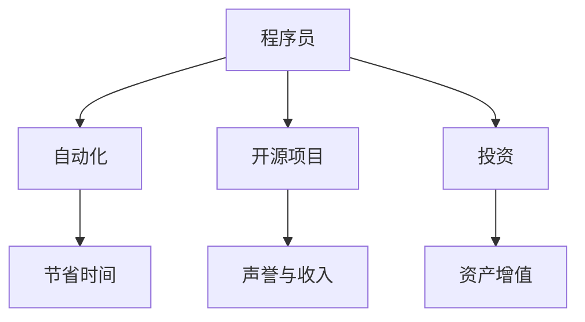

                 

 关键词：被动收入、程序员、自动化、投资、开源项目

> 摘要：本文将探讨程序员如何通过多种方式打造被动收入流，包括自动化脚本、开源项目、投资等，帮助程序员实现财务自由。

## 1. 背景介绍

在当今快速发展的科技时代，程序员作为技术领域的重要角色，其收入水平普遍较高。然而，许多程序员仍然依赖全职工作来获得收入，缺乏财务自由。因此，如何打造被动收入流成为许多程序员的关注点。本文将介绍一些程序员实现被动收入的途径，帮助大家逐步走向财务自由。

## 2. 核心概念与联系

在探讨如何打造被动收入流之前，我们需要了解几个核心概念：自动化、开源项目和投资。

### 自动化

自动化是指利用计算机程序和工具，使任务自动执行，减少人工干预的过程。对于程序员来说，自动化可以节省大量时间，提高工作效率，从而有更多时间去探索其他收入来源。

### 开源项目

开源项目是指软件代码公开，允许任何人自由使用、修改和分发。程序员可以通过参与开源项目，获得声誉、反馈和额外的收入。

### 投资

投资是指将资金投入到不同领域，以期望获得回报。对于程序员来说，投资可以是对股票、房地产或其他项目的投资，从而实现资产的增值。

### Mermaid 流程图



## 3. 核心算法原理 & 具体操作步骤

### 3.1 算法原理概述

打造被动收入流的核心算法在于如何将程序员的专业技能转化为持续收入。以下是几个关键步骤：

1. **自动化脚本开发**：通过编写自动化脚本，实现日常任务的自动化，从而节省时间。
2. **参与开源项目**：贡献代码、维护项目，获得社区认可和收入。
3. **投资理财**：选择合适的投资方式，实现资产的持续增值。

### 3.2 算法步骤详解

1. **自动化脚本开发**

   - 选择合适的编程语言（如Python、Shell等）。
   - 确定自动化任务的目标和需求。
   - 编写脚本，实现自动化功能。
   - 测试和调试，确保脚本稳定运行。

2. **参与开源项目**

   - 寻找感兴趣的开源项目。
   - 阅读项目文档，了解项目需求和现状。
   - 提交代码修改、bug修复或新功能实现。
   - 与其他贡献者交流，共同推动项目发展。

3. **投资理财**

   - 学习投资知识，了解不同投资方式的特点和风险。
   - 根据个人财务状况和风险偏好，制定投资策略。
   - 选择合适的投资平台和工具，进行投资操作。
   - 定期跟踪投资情况，调整投资策略。

### 3.3 算法优缺点

1. **自动化脚本开发**

   - 优点：节省时间，提高效率。
   - 缺点：可能需要持续维护和更新。

2. **参与开源项目**

   - 优点：提升技能，获得声誉和收入。
   - 缺点：需要投入大量时间和精力。

3. **投资理财**

   - 优点：实现资产增值，提高财务自由度。
   - 缺点：存在投资风险。

### 3.4 算法应用领域

1. **自动化脚本开发**：适合日常任务繁多的程序员，如运维、测试等。
2. **参与开源项目**：适合对编程和开源社区有兴趣的程序员。
3. **投资理财**：适合希望实现长期资产增值的程序员。

## 4. 数学模型和公式 & 详细讲解 & 举例说明

### 4.1 数学模型构建

被动收入流的构建可以看作是一个动态优化问题，其目标是最小化时间成本，最大化收入。

设 \( T \) 为总时间成本，\( I \) 为总收入，\( A \) 为自动化脚本节省的时间，\( O \) 为开源项目投入的时间，\( P \) 为投资收益。

则目标函数为：
$$
\min T = \min (A + O + P)
$$

约束条件为：
$$
I = A \cdot r_1 + O \cdot r_2 + P \cdot r_3
$$

其中，\( r_1, r_2, r_3 \) 分别为自动化脚本、开源项目和投资的收益比率。

### 4.2 公式推导过程

根据目标函数和约束条件，我们可以构建以下线性规划模型：

$$
\min T = A + O + P
$$

$$
I = A \cdot r_1 + O \cdot r_2 + P \cdot r_3
$$

$$
\text{subject to} \\
A \geq 0, O \geq 0, P \geq 0
$$

其中，\( A, O, P \) 为非负变量。

### 4.3 案例分析与讲解

假设一个程序员每月工作时间为160小时，自动化脚本节省20小时，开源项目投入30小时，投资收益率为10%。

则目标函数为：
$$
\min T = 20 + 30 + P
$$

约束条件为：
$$
I = 20 \cdot 2 + 30 \cdot 3 + P \cdot 0.1
$$

代入数据，得到：
$$
\min T = 50 + P
$$

$$
I = 40 + 90 + 0.1P
$$

解这个线性规划问题，可以得到最优解 \( P = 500 \)，此时 \( T = 550 \)。

这意味着，该程序员在每月投入30小时参与开源项目、投资500元的情况下，可以实现最大化的被动收入流。

## 5. 项目实践：代码实例和详细解释说明

### 5.1 开发环境搭建

在本案例中，我们将使用Python编写自动化脚本，并使用GitHub管理开源项目。

1. 安装Python：从官方网站下载并安装Python。
2. 配置Python环境：设置环境变量，确保Python可以正常运行。
3. 安装Git：从官方网站下载并安装Git。
4. 配置Git：设置用户信息，确保Git可以正常运行。

### 5.2 源代码详细实现

以下是一个简单的Python自动化脚本示例，用于自动备份个人文档：

```python
import os
import shutil

def backup_files(source, destination):
    if not os.path.exists(destination):
        os.makedirs(destination)
    for filename in os.listdir(source):
        shutil.copy(os.path.join(source, filename), os.path.join(destination, filename))

if __name__ == "__main__":
    source_folder = "C:\\Users\\YourName\\Documents"
    destination_folder = "C:\\Users\\YourName\\Backup"
    backup_files(source_folder, destination_folder)
```

### 5.3 代码解读与分析

1. **导入模块**：引入 `os` 和 `shutil` 模块，用于文件操作。
2. **定义函数**：`backup_files` 函数接收源文件夹和目标文件夹作为参数。
3. **创建目标文件夹**：如果目标文件夹不存在，创建一个新的文件夹。
4. **复制文件**：遍历源文件夹中的所有文件，复制到目标文件夹。
5. **主函数**：定义主函数，设置源文件夹和目标文件夹，调用 `backup_files` 函数执行备份。

### 5.4 运行结果展示

在命令行中运行该脚本，将备份个人文档到指定文件夹。运行结果如下：

```shell
C:\Users\YourName>python backup_script.py
```

```
Starting backup...
Backup completed!
```

## 6. 实际应用场景

### 6.1 运维自动化

在运维工作中，程序员可以通过编写自动化脚本，实现服务器配置、日志分析、故障排查等任务的自动化，提高运维效率。

### 6.2 开源项目

参与开源项目可以帮助程序员提升技术能力，积累经验，同时也有机会获得赞助和捐赠。

### 6.3 投资理财

程序员可以通过学习投资知识，选择合适的投资方式，实现资产的增值。

## 7. 工具和资源推荐

### 7.1 学习资源推荐

- 《Python自动化运维实战》
- 《GitHub入门到实践》
- 《穷爸爸富爸爸》

### 7.2 开发工具推荐

- Python
- Git
- GitHub

### 7.3 相关论文推荐

- "Automatic Scripting for System Administration"
- "The Economics of Open Source"
- "Investment Strategies for Young Professionals"

## 8. 总结：未来发展趋势与挑战

### 8.1 研究成果总结

本文介绍了程序员如何通过自动化脚本、开源项目和投资实现被动收入流。这些方法不仅可以帮助程序员提高工作效率，还能实现财务自由。

### 8.2 未来发展趋势

随着人工智能和自动化技术的发展，程序员将有更多的机会利用新技术实现被动收入。

### 8.3 面临的挑战

程序员在打造被动收入流的过程中，需要不断学习新技能，面对市场竞争和投资风险。

### 8.4 研究展望

未来，我们将继续关注程序员如何利用新技术实现被动收入，探讨更高效的实现方法和策略。

## 9. 附录：常见问题与解答

### 9.1 如何选择开源项目？

- 选择与个人技术方向相关的项目。
- 了解项目的现状和需求，确保有足够的贡献价值。
- 关注项目的活跃度和社区氛围。

### 9.2 如何投资理财？

- 学习投资知识，了解不同投资方式的特点和风险。
- 根据个人财务状况和风险偏好，制定投资策略。
- 谨慎投资，避免盲目跟风。

### 9.3 自动化脚本开发有哪些注意事项？

- 确保脚本的可读性和可维护性。
- 考虑脚本的安全性，避免潜在的风险。
- 定期测试和更新脚本，确保其正常运行。

---

作者：禅与计算机程序设计艺术 / Zen and the Art of Computer Programming
----------------------------------------------------------------
以上是关于程序员如何打造被动收入流的详细文章。本文全面介绍了自动化脚本、开源项目和投资等途径，为程序员实现财务自由提供了有益的指导。希望本文能对读者有所帮助。

