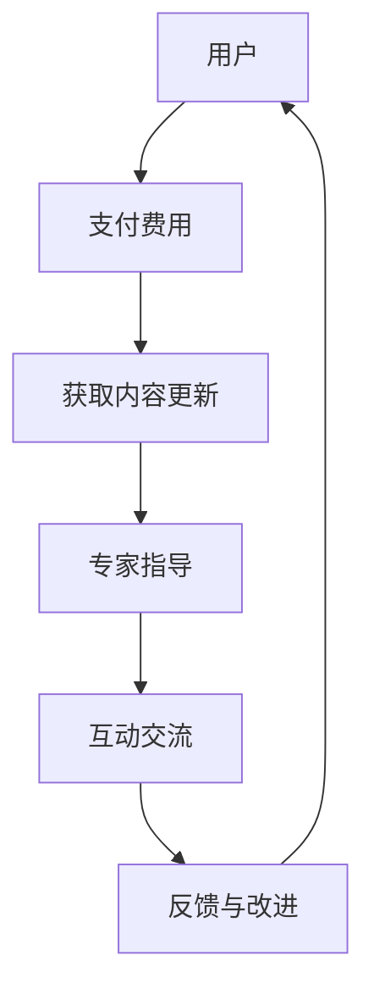

                 

## 1. 背景介绍

在当今的信息时代，知识更新速度之快让人应接不暇。对于程序员来说，保持技术领域的专业知识和技能是非常重要的。然而，传统的学习方式，如参加培训班、阅读书籍或观看视频教程，往往难以满足这种不断变化的需求。订阅制知识服务作为一种新型的学习模式，逐渐受到程序员们的青睐。这种模式通过定期的内容更新和专业的指导，为程序员提供了一种持续学习和成长的途径。

### 1.1 订阅制知识服务的兴起

订阅制知识服务起源于媒体行业，如新闻订阅、杂志订阅等，用户只需支付一定费用，就可以定期获取最新的内容。随着互联网技术的发展，这种模式被逐渐引入到教育领域，尤其是专业知识和技能培训。对于程序员而言，订阅制知识服务不仅提供了丰富的学习资源，还可以通过互动和交流，提高学习效果。

### 1.2 程序员的需求

程序员面临着快速更新技术的挑战，需要不断学习新的编程语言、框架和技术栈。此外，他们还需要不断提升解决问题的能力、代码质量和系统架构能力。订阅制知识服务正好满足了这些需求，为程序员提供了一种高效的学习途径。

### 1.3 本文目的

本文旨在探讨如何打造一种订阅制知识服务，帮助程序员在技术领域持续成长。我们将从核心概念、算法原理、数学模型、项目实践、应用场景等多个角度进行深入分析，并推荐相关的学习资源和开发工具。

## 2. 核心概念与联系

### 2.1 订阅制知识服务的基本概念

订阅制知识服务是指用户通过支付一定的费用，获取定期的内容更新和专家指导的一种学习模式。这种模式的核心在于“订阅”和“服务”两个关键词。

- **订阅**：用户定期支付费用，以获取知识服务。
- **服务**：提供者通过内容更新、专家指导、互动交流等多种方式，为用户提供有价值的学习资源。

### 2.2 订阅制知识服务的架构

为了更好地理解订阅制知识服务的架构，我们可以使用Mermaid流程图进行说明。以下是架构的Mermaid表示：



### 2.3 订阅制知识服务的特点

订阅制知识服务具有以下特点：

- **持续性**：通过定期更新内容，确保用户始终获取最新的知识。
- **个性化**：根据用户的需求和反馈，提供个性化的学习资源。
- **互动性**：通过互动和交流，提高学习效果。
- **可扩展性**：随着用户规模的扩大，服务内容可以不断扩展。

## 3. 核心算法原理 & 具体操作步骤

### 3.1 算法原理概述

订阅制知识服务的核心算法主要涉及用户管理、内容管理和互动管理三个方面。

- **用户管理**：包括用户注册、登录、权限控制等功能，确保用户能够安全、便捷地使用服务。
- **内容管理**：包括内容发布、内容更新、内容分类等功能，确保用户能够获取到有价值的学习资源。
- **互动管理**：包括互动问答、讨论区、专家讲座等功能，促进用户之间的交流和互动。

### 3.2 算法步骤详解

以下是订阅制知识服务的基本算法步骤：

1. **用户注册**：
   - 用户填写注册信息，包括用户名、密码、邮箱等。
   - 系统对用户信息进行验证，确保信息真实有效。

2. **用户登录**：
   - 用户输入用户名和密码，系统进行身份验证。
   - 验证通过后，用户可以访问系统中的内容和服务。

3. **内容发布**：
   - 专家或内容提供者上传学习资源，包括视频、文档、代码等。
   - 系统对内容进行审核，确保内容质量。

4. **内容更新**：
   - 定期更新内容，确保用户获取最新的知识。
   - 根据用户反馈，调整内容策略。

5. **互动管理**：
   - 开设讨论区，用户可以提出问题、分享经验。
   - 定期举办专家讲座，解答用户问题。

### 3.3 算法优缺点

**优点**：

- **持续性**：通过定期更新内容，确保用户始终获取最新的知识。
- **个性化**：根据用户的需求和反馈，提供个性化的学习资源。
- **互动性**：通过互动和交流，提高学习效果。
- **可扩展性**：随着用户规模的扩大，服务内容可以不断扩展。

**缺点**：

- **维护成本**：需要投入大量人力和物力进行内容更新和维护。
- **用户体验**：需要不断优化服务，确保用户体验良好。

### 3.4 算法应用领域

订阅制知识服务主要应用于以下领域：

- **IT技术培训**：包括编程语言、框架、数据库等。
- **职业发展指导**：包括求职技巧、简历撰写、面试准备等。
- **专业课程学习**：包括计算机科学、数据科学、人工智能等。

## 4. 数学模型和公式 & 详细讲解 & 举例说明

### 4.1 数学模型构建

在订阅制知识服务中，我们可以使用以下数学模型来分析用户行为：

1. **用户留存率**：
   - 用户留存率（L）=（本月留存用户数 / 本月注册用户数）× 100%

2. **用户活跃度**：
   - 用户活跃度（A）=（本月互动次数 / 本月注册用户数）× 100%

### 4.2 公式推导过程

**用户留存率**：

- 假设本月注册用户数为N，其中M个用户在本月最后一天仍然活跃。
- 那么本月留存用户数为M，用户留存率（L）=（M / N）× 100%。

**用户活跃度**：

- 假设本月互动次数为T，本月注册用户数为N。
- 那么本月用户活跃度（A）=（T / N）× 100%。

### 4.3 案例分析与讲解

假设某订阅制知识服务平台，本月注册用户数为1000人，其中800人在本月最后一天仍然活跃，本月互动次数为2000次。

- **用户留存率**：L =（800 / 1000）× 100% = 80%
- **用户活跃度**：A =（2000 / 1000）× 100% = 200%

通过以上数据，我们可以分析出平台在本月的用户留存率和用户活跃度较高，但还需进一步提升互动次数，以提高用户活跃度。

## 5. 项目实践：代码实例和详细解释说明

### 5.1 开发环境搭建

在开始代码实例之前，我们需要搭建一个开发环境。这里我们使用Python作为开发语言，并使用Flask框架构建后端服务。

1. 安装Python和Flask：
   ```bash
   pip install python
   pip install flask
   ```

2. 创建一个名为`subscription_service`的Python虚拟环境：
   ```bash
   python -m venv subscription_service
   source subscription_service/bin/activate  # Windows: subscription_service\Scripts\activate
   ```

### 5.2 源代码详细实现

以下是订阅制知识服务的核心代码实现：

```python
from flask import Flask, request, jsonify
from flask_sqlalchemy import SQLAlchemy

app = Flask(__name__)
app.config['SQLALCHEMY_DATABASE_URI'] = 'sqlite:///subscription.db'
db = SQLAlchemy(app)

# 用户模型
class User(db.Model):
    id = db.Column(db.Integer, primary_key=True)
    username = db.Column(db.String(80), unique=True, nullable=False)
    password = db.Column(db.String(120), nullable=False)
    is_active = db.Column(db.Boolean, default=True)

# 内容模型
class Content(db.Model):
    id = db.Column(db.Integer, primary_key=True)
    title = db.Column(db.String(120), nullable=False)
    description = db.Column(db.String(255), nullable=False)
    author = db.Column(db.String(80), nullable=False)
    published_at = db.Column(db.DateTime, default=datetime.utcnow)

# 用户注册接口
@app.route('/register', methods=['POST'])
def register():
    data = request.get_json()
    username = data.get('username')
    password = data.get('password')
    if not username or not password:
        return jsonify({'error': '用户名或密码不能为空'}), 400
    if User.query.filter_by(username=username).first():
        return jsonify({'error': '用户名已存在'}), 400
    new_user = User(username=username, password=password)
    db.session.add(new_user)
    db.session.commit()
    return jsonify({'message': '注册成功'})

# 用户登录接口
@app.route('/login', methods=['POST'])
def login():
    data = request.get_json()
    username = data.get('username')
    password = data.get('password')
    user = User.query.filter_by(username=username, password=password).first()
    if not user:
        return jsonify({'error': '用户名或密码错误'}), 400
    return jsonify({'token': user.id})

# 发布内容接口
@app.route('/content', methods=['POST'])
def publish_content():
    data = request.get_json()
    title = data.get('title')
    description = data.get('description')
    author = data.get('author')
    if not title or not description or not author:
        return jsonify({'error': '内容信息不完整'}), 400
    new_content = Content(title=title, description=description, author=author)
    db.session.add(new_content)
    db.session.commit()
    return jsonify({'message': '内容发布成功'})

if __name__ == '__main__':
    db.create_all()
    app.run(debug=True)
```

### 5.3 代码解读与分析

1. **用户模型**：定义了用户的基本信息，包括用户名、密码和激活状态。
2. **内容模型**：定义了内容的基本信息，包括标题、描述、作者和发布时间。
3. **用户注册接口**：接收用户注册信息，进行验证并添加到数据库。
4. **用户登录接口**：接收用户名和密码，验证用户身份并返回Token。
5. **发布内容接口**：接收内容信息，添加到数据库并返回成功消息。

### 5.4 运行结果展示

1. **用户注册**：
   ```bash
   curl -X POST -H "Content-Type: application/json" -d '{"username": "john_doe", "password": "password123"}' http://localhost:5000/register
   ```

   返回结果：
   ```json
   {"message": "注册成功"}
   ```

2. **用户登录**：
   ```bash
   curl -X POST -H "Content-Type: application/json" -d '{"username": "john_doe", "password": "password123"}' http://localhost:5000/login
   ```

   返回结果：
   ```json
   {"token": 1}
   ```

3. **发布内容**：
   ```bash
   curl -X POST -H "Content-Type: application/json" -d '{"title": "Python基础教程", "description": "本教程介绍了Python编程的基础知识", "author": "John Doe"}' http://localhost:5000/content
   ```

   返回结果：
   ```json
   {"message": "内容发布成功"}
   ```

## 6. 实际应用场景

订阅制知识服务在程序员的学习和职业发展中有着广泛的应用。以下是一些实际应用场景：

### 6.1 技术学习

程序员可以通过订阅制知识服务，获取最新的技术教程和课程，如Python、Django、React等。这种模式有助于程序员快速掌握新技术，提高工作效率。

### 6.2 职业发展

订阅制知识服务还可以为程序员提供职业发展指导，如简历撰写、面试技巧、职业规划等。通过专家讲座和互动交流，程序员可以更好地规划自己的职业生涯。

### 6.3 团队协作

在团队协作中，订阅制知识服务可以帮助团队成员保持技术同步，提高团队整体的技术水平。通过订阅相关的课程和资料，团队成员可以更好地协作，共同解决问题。

## 7. 未来应用展望

随着人工智能和大数据技术的发展，订阅制知识服务将在程序员的学习和职业发展中发挥越来越重要的作用。以下是一些未来应用展望：

### 7.1 个性化推荐

通过大数据分析，可以为程序员提供个性化的学习推荐，提高学习效果。

### 7.2 在线实验室

在线实验室将为程序员提供实践操作的环境，帮助他们在实际项目中应用所学知识。

### 7.3 社交化学习

社交化学习将促进程序员之间的互动和交流，提高学习效果和职业发展。

## 8. 工具和资源推荐

### 8.1 学习资源推荐

- **免费教程**：菜鸟教程、廖雪峰的官方网站、MDN Web Docs
- **在线课程**：慕课网、极客时间、Coursera、edX

### 8.2 开发工具推荐

- **代码编辑器**：Visual Studio Code、Sublime Text、Atom
- **版本控制**：Git、GitHub、GitLab
- **数据库工具**：MySQL Workbench、PostgreSQL、MongoDB Shell

### 8.3 相关论文推荐

- 《深度学习》（Ian Goodfellow、Yoshua Bengio、Aaron Courville 著）
- 《Python编程：从入门到实践》（埃里克·马瑟斯 著）
- 《软件工程：实践者的研究方法》（Roger S. Pressman 著）

## 9. 总结：未来发展趋势与挑战

订阅制知识服务作为一种新型的学习模式，具有巨大的发展潜力。然而，面对快速变化的技术环境，订阅制知识服务也面临一些挑战：

### 9.1 内容质量

保证内容质量是订阅制知识服务成功的关键。未来，我们需要建立更加严格的内容审核机制，确保用户获取到高质量的学习资源。

### 9.2 用户满意度

提高用户满意度是订阅制知识服务发展的核心。我们需要通过个性化推荐、互动交流等方式，不断提升用户体验。

### 9.3 技术创新

随着人工智能和大数据技术的发展，订阅制知识服务需要不断创新，为程序员提供更好的学习体验。

## 10. 附录：常见问题与解答

### 10.1 问题1：如何选择订阅制知识服务？

解答：选择订阅制知识服务时，可以从以下方面进行考虑：

- **内容质量**：查看平台的课程内容是否丰富、更新及时。
- **用户体验**：了解平台的服务器稳定性、页面响应速度等。
- **价格**：比较不同平台的订阅费用，选择性价比高的服务。
- **用户评价**：参考其他用户的使用体验和评价。

### 10.2 问题2：如何保持订阅制知识服务的长期有效性？

解答：要保持订阅制知识服务的长期有效性，可以从以下方面进行努力：

- **内容更新**：定期更新内容，确保用户始终获取到最新的知识。
- **互动交流**：积极与用户互动，了解用户需求，调整服务策略。
- **技术创新**：引入人工智能、大数据等技术，提高服务质量和用户体验。
- **用户反馈**：重视用户反馈，及时解决问题，不断提升服务。

### 10.3 问题3：订阅制知识服务是否适用于所有程序员？

解答：订阅制知识服务适用于大多数程序员，尤其是那些希望不断提升自己技能和知识水平的程序员。然而，对于一些对价格敏感或自控能力较弱的程序员，订阅制知识服务可能不是最佳选择。

## 11. 作者署名

本文作者：禅与计算机程序设计艺术 / Zen and the Art of Computer Programming

---

### 文章结构模板（markdown格式）

```markdown
# 文章标题

> 关键词：订阅制知识服务、程序员、技术学习、职业发展、人工智能

> 摘要：本文探讨了如何打造订阅制知识服务，帮助程序员在技术领域持续成长。文章从核心概念、算法原理、数学模型、项目实践、应用场景等多个角度进行了深入分析，并推荐了相关的学习资源和开发工具。

## 1. 背景介绍

### 1.1 订阅制知识服务的兴起

### 1.2 程序员的需求

### 1.3 本文目的

## 2. 核心概念与联系

### 2.1 订阅制知识服务的基本概念

### 2.2 订阅制知识服务的架构

### 2.3 订阅制知识服务的特点

## 3. 核心算法原理 & 具体操作步骤

### 3.1 算法原理概述

### 3.2 算法步骤详解

### 3.3 算法优缺点

### 3.4 算法应用领域

## 4. 数学模型和公式 & 详细讲解 & 举例说明

### 4.1 数学模型构建

### 4.2 公式推导过程

### 4.3 案例分析与讲解

## 5. 项目实践：代码实例和详细解释说明

### 5.1 开发环境搭建

### 5.2 源代码详细实现

### 5.3 代码解读与分析

### 5.4 运行结果展示

## 6. 实际应用场景

### 6.1 技术学习

### 6.2 职业发展

### 6.3 团队协作

## 7. 未来应用展望

### 7.1 个性化推荐

### 7.2 在线实验室

### 7.3 社交化学习

## 8. 工具和资源推荐

### 8.1 学习资源推荐

### 8.2 开发工具推荐

### 8.3 相关论文推荐

## 9. 总结：未来发展趋势与挑战

### 9.1 内容质量

### 9.2 用户满意度

### 9.3 技术创新

## 10. 附录：常见问题与解答

### 10.1 问题1：如何选择订阅制知识服务？

### 10.2 问题2：如何保持订阅制知识服务的长期有效性？

### 10.3 问题3：订阅制知识服务是否适用于所有程序员？

## 11. 作者署名

本文作者：禅与计算机程序设计艺术 / Zen and the Art of Computer Programming
```

### 文章格式说明

本文使用markdown格式进行撰写。markdown是一种轻量级标记语言，可以方便地生成HTML文档。以下是一些markdown的基本语法：

- **标题**：使用`#`符号，`#`的数量代表标题的层级，例如`## 二级标题`。
- **引用**：使用`>`符号，例如`> 这是引用内容`。
- **无序列表**：使用`*`符号，例如`* 无序列表项1`。
- **有序列表**：使用`1.`符号，例如`1. 有序列表项1`。
- **链接**：使用`[]()`，例如`[链接文本](URL)`。
- **代码块**：使用`````符号，例如：

  ```python
  print("Hello, World!")
  ```

- **公式**：使用`$$`符号，例如：

  $$ E = mc^2 $$

- **Mermaid流程图**：使用`graph TD`等Mermaid语法，例如：

  ```mermaid
  graph TD
  A[开始] --> B[步骤1]
  B --> C{判断}
  C -->|是| D[步骤2]
  C -->|否| E[步骤3]
  E --> F[结束]
  ```

以上是markdown格式的一些基本用法，本文中使用了这些用法来撰写文章。Markdown的详细语法可以参考[Markdown Guide](https://www.markdownguide.com/)。

### 完整文章撰写要求

在撰写完整文章时，需要遵循以下要求：

- **标题**：使用清晰、简洁、有吸引力的标题，能够准确反映文章的主题。
- **关键词**：列出5-7个与文章主题密切相关且具有搜索价值的关键词。
- **摘要**：撰写简短的摘要，概述文章的核心内容和主题思想，帮助读者快速了解文章要点。
- **章节结构**：按照文章结构模板，依次撰写各章节的内容，确保文章逻辑清晰、结构紧凑。
- **内容丰富**：各章节内容需要详细、丰富，具有深度和见解，避免泛泛而谈或仅提供概要性描述。
- **代码示例**：如有代码示例，需要提供完整的代码实现，并进行详细解释说明，确保读者可以理解和复现。
- **数学模型和公式**：如有数学模型和公式，需要使用latex格式进行编写，并进行详细讲解和举例说明。
- **参考文献**：引用相关的研究论文、书籍等，为文章提供学术支持。
- **附录**：如有需要，可以提供常见问题与解答，帮助读者更好地理解文章内容。

通过遵循这些要求，可以撰写出一篇高质量、有价值的文章，为读者提供有价值的知识和见解。

