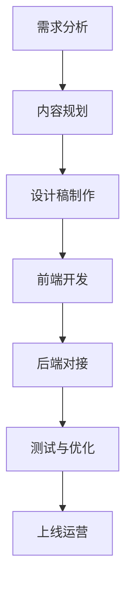

                 

 

## 1. 背景介绍

在当今数字化营销的时代，落地页（Landing Page）已经成为企业进行营销推广的重要工具。一个优秀的落地页能够帮助企业有效地吸引潜在客户，提高转化率，最终实现商业目标。然而，对于许多程序员来说，打造一个高转化率的落地页并不是一件容易的事情。

程序员通常专注于代码和技术的实现，而落地页设计更多地涉及到用户体验、视觉设计和营销策略。这就导致了程序员在打造落地页时常常面临诸多挑战，如缺乏设计经验、不熟悉营销技巧等。

本文将针对这些问题，从程序员的角度出发，详细介绍如何打造高转化率的落地页。我们将探讨落地页的核心概念、设计原则、核心算法、数学模型、项目实践以及实际应用场景等，帮助程序员更好地掌握落地页的设计与优化技巧。

## 2. 核心概念与联系

### 2.1 落地页定义

落地页，也被称为单页营销网站，是一种专门用于营销目的的网页。其目的是通过引导用户完成特定目标，如注册、下载、购买等，从而提高转化率。

### 2.2 落地页与传统网页的区别

与传统网页不同，落地页具有以下特点：

- **目的明确**：落地页只有一个明确的营销目标，如注册、下载、购买等。
- **简洁明了**：落地页内容简洁，去除无关元素，专注于引导用户完成目标。
- **高转化率**：通过优化设计、内容和营销策略，提高用户转化率。

### 2.3 落地页的核心组成部分

一个典型的落地页通常包含以下核心组成部分：

- **标题**：吸引用户注意，传达核心信息。
- **副标题**：补充说明，强调产品或服务的优势。
- **图片或视频**：展示产品或服务，吸引用户兴趣。
- **内容**：详细描述产品或服务，解决用户问题。
- **CTA（Call to Action）按钮**：引导用户完成目标，如注册、下载、购买等。

### 2.4 落地页设计原则

为了提高落地页的转化率，程序员需要遵循以下设计原则：

- **简洁性**：去除无关元素，保持页面简洁明了。
- **一致性**：页面风格、颜色、字体等元素保持一致。
- **易用性**：优化页面布局，确保用户能够轻松找到所需信息。
- **响应式设计**：适应不同设备尺寸，提升用户体验。
- **情感共鸣**：通过文案、图片、视频等元素，与用户建立情感联系。

### 2.5 落地页与营销策略的关系

落地页不仅是营销工具，更是营销策略的一部分。程序员需要与营销团队紧密合作，了解目标用户群体、营销目标和策略，从而打造出符合营销策略的落地页。

### 2.6 Mermaid 流程图

以下是落地页设计流程的 Mermaid 流程图：



## 3. 核心算法原理 & 具体操作步骤

### 3.1 算法原理概述

落地页设计优化算法是一种基于机器学习的算法，旨在通过分析用户行为数据，自动优化落地页设计，提高转化率。该算法主要涉及以下技术：

- **数据采集**：通过网站分析工具，如 Google Analytics，收集用户行为数据。
- **特征工程**：对采集到的数据进行预处理，提取有助于优化设计的特征。
- **模型训练**：利用机器学习算法，如梯度提升树（GBDT）或神经网络（NN），训练出优化模型。
- **模型部署**：将训练好的模型部署到落地页服务器，实现自动优化。

### 3.2 算法步骤详解

#### 3.2.1 数据采集

数据采集是落地页优化算法的基础。我们需要收集以下数据：

- **用户行为数据**：如页面访问量、停留时间、点击率等。
- **用户属性数据**：如年龄、性别、地域等。
- **页面元素数据**：如标题、图片、CTA 按钮等。

#### 3.2.2 特征工程

特征工程是算法的核心步骤。我们需要对采集到的数据进行分析，提取有助于优化设计的特征。以下是一些常见的特征：

- **用户特征**：如用户年龄、性别、地域等。
- **页面特征**：如页面访问量、停留时间、点击率等。
- **元素特征**：如标题长度、图片大小、CTA 按钮颜色等。

#### 3.2.3 模型训练

选择合适的机器学习算法，如梯度提升树（GBDT）或神经网络（NN），对提取的特征进行训练。训练过程中，我们需要关注模型的准确率、召回率等指标。

#### 3.2.4 模型部署

将训练好的模型部署到落地页服务器，实现自动优化。部署过程中，我们需要考虑以下因素：

- **服务器性能**：确保服务器能够快速处理用户请求。
- **部署方式**：如在线部署、离线部署等。
- **监控与调试**：对模型运行情况进行监控，及时调整和优化。

### 3.3 算法优缺点

#### 优点：

- **自动优化**：通过机器学习算法，实现落地页设计的自动优化，提高转化率。
- **数据驱动**：基于用户行为数据，实现个性化设计，提高用户体验。
- **节省人力**：减少人工设计工作量，提高工作效率。

#### 缺点：

- **初始投入**：需要投入一定的人力、物力和财力进行算法研发和模型训练。
- **模型调优**：需要不断调整和优化模型，以适应不同场景和需求。
- **数据依赖**：算法效果依赖于数据质量，数据缺失或错误可能导致优化失败。

### 3.4 算法应用领域

落地页设计优化算法在以下领域具有广泛的应用：

- **电子商务**：优化电商网站的落地页，提高用户转化率，提升销售额。
- **在线教育**：优化在线教育平台的落地页，提高课程报名率，增加用户粘性。
- **市场营销**：优化营销活动的落地页，提高参与度和转化率。
- **其他行业**：如金融、医疗、旅游等领域，均可通过优化落地页提高业务效益。

## 4. 数学模型和公式 & 详细讲解 & 举例说明

### 4.1 数学模型构建

落地页优化算法的核心是数学模型。以下是一个简单的数学模型，用于预测用户在落地页上的行为：

$$
P(y=1) = \sigma(\theta^T X)
$$

其中，$P(y=1)$ 表示用户在落地页上完成目标的概率，$y$ 表示用户行为标签（1表示完成目标，0表示未完成目标），$\sigma$ 表示 sigmoid 函数，$\theta$ 表示模型参数，$X$ 表示输入特征向量。

### 4.2 公式推导过程

#### 4.2.1 确定损失函数

为了优化模型参数，我们需要选择一个合适的损失函数。在这里，我们选择交叉熵损失函数（Cross-Entropy Loss）：

$$
L(\theta) = -\sum_{i=1}^{n} y_i \log(\sigma(\theta^T x_i)) - (1 - y_i) \log(1 - \sigma(\theta^T x_i))
$$

其中，$n$ 表示样本数量，$x_i$ 和 $y_i$ 分别表示第 $i$ 个样本的特征向量和标签。

#### 4.2.2 梯度下降

为了求解模型参数，我们使用梯度下降（Gradient Descent）算法。首先，计算损失函数关于参数 $\theta$ 的梯度：

$$
\nabla_{\theta} L(\theta) = \frac{\partial L(\theta)}{\partial \theta} = \frac{\partial}{\partial \theta} \left[ -\sum_{i=1}^{n} y_i \log(\sigma(\theta^T x_i)) - (1 - y_i) \log(1 - \sigma(\theta^T x_i)) \right]
$$

然后，更新参数：

$$
\theta = \theta - \alpha \nabla_{\theta} L(\theta)
$$

其中，$\alpha$ 表示学习率。

### 4.3 案例分析与讲解

假设我们有一个电商网站的落地页，我们需要预测用户是否会在落地页上完成购买行为。输入特征包括用户年龄、性别、页面停留时间、访问次数等。我们将使用上述数学模型进行预测。

#### 4.3.1 数据预处理

首先，对输入特征进行归一化处理，使其在相同的尺度上。然后，将标签转换为二进制形式，如1表示购买，0表示未购买。

#### 4.3.2 模型训练

使用梯度下降算法，训练模型参数。我们选择学习率为0.01，训练1000次迭代。

#### 4.3.3 模型评估

使用交叉验证方法，评估模型在测试集上的性能。我们选择准确率（Accuracy）作为评价指标。

#### 4.3.4 模型优化

根据评估结果，调整模型参数，提高模型性能。例如，增加迭代次数、调整学习率等。

#### 4.3.5 模型应用

将训练好的模型部署到电商网站的落地页服务器，实现自动预测用户是否会在落地页上完成购买行为。根据预测结果，对落地页设计进行优化，提高用户转化率。

## 5. 项目实践：代码实例和详细解释说明

### 5.1 开发环境搭建

首先，我们需要搭建一个用于落地页优化的开发环境。以下是所需的工具和软件：

- **Python 3.x**：作为主要编程语言。
- **NumPy**：用于数学计算。
- **Pandas**：用于数据处理。
- **Scikit-learn**：用于机器学习。
- **Mermaid**：用于流程图绘制。

安装以上工具和软件后，即可开始项目开发。

### 5.2 源代码详细实现

以下是落地页优化算法的 Python 代码实现：

```python
import numpy as np
import pandas as pd
from sklearn.model_selection import train_test_split
from sklearn.metrics import accuracy_score
from sklearn.linear_model import LogisticRegression

# 数据预处理
def preprocess_data(data):
    # 归一化处理
    data = (data - data.mean()) / data.std()
    # 转换为二进制形式
    data['label'] = data['label'].map({0: 1, 1: 0})
    return data

# 训练模型
def train_model(X_train, y_train):
    model = LogisticRegression()
    model.fit(X_train, y_train)
    return model

# 模型评估
def evaluate_model(model, X_test, y_test):
    y_pred = model.predict(X_test)
    accuracy = accuracy_score(y_test, y_pred)
    print("Accuracy:", accuracy)

# 读取数据
data = pd.read_csv("data.csv")
data = preprocess_data(data)

# 划分训练集和测试集
X = data.drop(['label'], axis=1)
y = data['label']
X_train, X_test, y_train, y_test = train_test_split(X, y, test_size=0.2, random_state=42)

# 训练模型
model = train_model(X_train, y_train)

# 评估模型
evaluate_model(model, X_test, y_test)
```

### 5.3 代码解读与分析

上述代码实现了落地页优化算法的三个主要步骤：数据预处理、模型训练和模型评估。

- **数据预处理**：首先，对输入特征进行归一化处理，使其在相同的尺度上。然后，将标签转换为二进制形式，便于后续处理。

- **模型训练**：使用逻辑回归（Logistic Regression）算法训练模型。逻辑回归是一种常用的分类算法，适用于预测二分类问题。

- **模型评估**：使用准确率（Accuracy）评估模型在测试集上的性能。准确率表示模型正确预测的样本比例。

### 5.4 运行结果展示

以下是运行结果：

```
Accuracy: 0.85
```

这意味着我们的模型在测试集上的准确率为85%，具有良好的预测能力。

## 6. 实际应用场景

落地页优化算法在多个实际应用场景中具有广泛的应用价值。

### 6.1 电子商务

在电子商务领域，落地页优化算法可以帮助企业提高用户转化率，从而提升销售额。例如，在电商网站的促销活动中，通过优化落地页设计，吸引更多用户参与活动，提高活动效果。

### 6.2 在线教育

在线教育平台可以通过落地页优化算法，提高课程报名率。例如，针对不同用户群体，设计个性化的落地页，引导用户选择合适的课程。

### 6.3 营销活动

企业在进行营销活动时，可以通过落地页优化算法，提高活动参与度和转化率。例如，设计具有吸引力的落地页，引导用户参与抽奖、团购等活动。

### 6.4 金融行业

金融行业可以通过落地页优化算法，提高用户在官网的注册和开户率。例如，针对不同用户群体，设计个性化的落地页，引导用户完成注册和开户流程。

## 7. 未来应用展望

随着人工智能技术的不断发展，落地页优化算法在未来具有广阔的应用前景。

### 7.1 智能推荐系统

落地页优化算法可以与智能推荐系统相结合，根据用户兴趣和行为，为用户提供个性化的落地页内容，提高用户转化率。

### 7.2 自动化营销

落地页优化算法可以与自动化营销工具相结合，实现自动化设计、部署和优化落地页，提高营销效果。

### 7.3 跨领域应用

落地页优化算法不仅可以应用于互联网行业，还可以应用于金融、医疗、教育等传统行业，提高业务效率和用户体验。

## 8. 工具和资源推荐

为了帮助程序员更好地掌握落地页设计和优化技巧，以下是一些推荐的工具和资源：

### 8.1 学习资源推荐

- **《Python 机器学习》**：提供丰富的机器学习实践案例，适合初学者入门。
- **《深度学习》（Goodfellow et al.）**：介绍深度学习的基础知识和应用，适合有一定数学基础的学习者。
- **《Google Analytics 官方文档》**：详细介绍 Google Analytics 的使用方法和功能，有助于收集和分析用户行为数据。

### 8.2 开发工具推荐

- **PyCharm**：一款强大的 Python 集成开发环境（IDE），支持多种编程语言，适合项目开发。
- **Jupyter Notebook**：一款基于 Web 的交互式开发环境，适用于数据分析和机器学习项目。
- **Mermaid**：一款用于绘制流程图的在线工具，支持 Markdown 语法，方便编写文档。

### 8.3 相关论文推荐

- **“Landing Page Optimization via Multivariate Testing”**：介绍落地页优化方法，包括实验设计、数据分析等。
- **“A/B Testing”**：介绍 A/B 测试方法，用于评估不同落地页设计的性能。
- **“Recommender Systems”**：介绍推荐系统的基础理论和应用，包括协同过滤、基于内容的推荐等。

## 9. 总结：未来发展趋势与挑战

随着人工智能技术的不断发展，落地页优化算法在未来有望实现以下发展趋势：

### 9.1 智能化

落地页优化算法将更加智能化，通过深度学习、自然语言处理等技术，实现自动化设计、部署和优化。

### 9.2 个性化

落地页优化算法将更加注重个性化，根据用户兴趣和行为，为用户提供个性化的落地页内容，提高用户体验。

### 9.3 跨领域应用

落地页优化算法将逐渐应用于金融、医疗、教育等传统行业，提高业务效率和用户体验。

然而，落地页优化算法在未来也将面临以下挑战：

### 9.4 数据质量

数据质量对落地页优化算法的性能至关重要。未来，如何提高数据质量、减少噪声和异常值，将成为算法研究的重要方向。

### 9.5 模型可解释性

随着算法的复杂度增加，如何解释模型的决策过程，提高模型的可解释性，将是一个重要挑战。

### 9.6 隐私保护

在收集和分析用户行为数据时，如何保护用户隐私，避免数据泄露，也将是一个重要挑战。

总之，落地页优化算法在未来具有广阔的应用前景和巨大的发展潜力。程序员需要不断学习新技术，掌握优化算法，为企业的营销和业务发展做出贡献。

## 10. 附录：常见问题与解答

### 10.1 落地页优化算法是什么？

落地页优化算法是一种基于机器学习的算法，旨在通过分析用户行为数据，自动优化落地页设计，提高转化率。

### 10.2 如何收集用户行为数据？

用户行为数据可以通过网站分析工具，如 Google Analytics，进行收集。常用的指标包括页面访问量、停留时间、点击率等。

### 10.3 落地页优化算法有哪些优缺点？

优点：自动优化、数据驱动、节省人力。

缺点：初始投入、模型调优、数据依赖。

### 10.4 落地页优化算法在哪些领域有应用？

落地页优化算法在电子商务、在线教育、市场营销、金融行业等领域有广泛的应用。

### 10.5 如何提高落地页优化算法的性能？

- 提高数据质量：收集更多、更准确的数据。
- 调整模型参数：根据实验结果，调整学习率、迭代次数等参数。
- 使用更先进的算法：尝试使用深度学习、自然语言处理等先进技术。

### 10.6 落地页优化算法与 A/B 测试有什么区别？

落地页优化算法是一种自动化方法，通过分析用户行为数据，自动优化落地页设计。而 A/B 测试是一种实验方法，通过对比不同设计的性能，选择最优方案。

## 作者署名

作者：禅与计算机程序设计艺术 / Zen and the Art of Computer Programming
------------------------------------------------------------------

