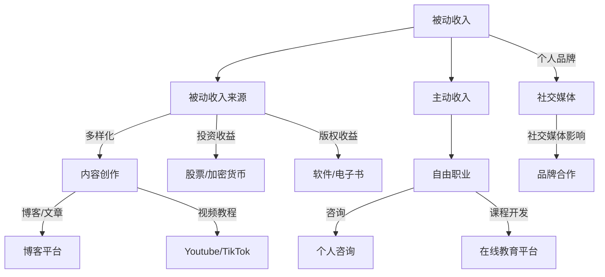

                 

关键词：多元化收入、程序员、生态系统、创业、技能提升

> 摘要：本文旨在探讨程序员如何构建多元化收入来源的生态系统，通过多个角度提供具体的策略和方法，帮助程序员实现财务自由，提升职业竞争力。

## 1. 背景介绍

在当今快速变化的技术行业，程序员面临着前所未有的机会和挑战。随着云计算、人工智能、大数据等新兴技术的崛起，程序员不仅可以依靠传统的软件开发工作获得收入，还可以通过多种方式构建多元化的收入来源。然而，如何有效地实现这一目标，对于许多程序员来说仍然是一个难题。本文将提供一系列策略和方法，帮助程序员构建一个可持续的多元化收入生态系统。

## 2. 核心概念与联系

首先，我们需要明确几个核心概念：

- **被动收入**：指不需要持续投入时间和劳动，就能持续获得收入的来源。
- **主动收入**：需要投入时间和精力才能获得的收入。
- **个人品牌**：个人在行业内的声誉和影响力。

下面是构建多元化收入来源生态系统的 Mermaid 流程图：



### 2.1 被动收入

被动收入是构建多元化收入生态系统的基础。通过一次性的努力，如编写代码、创作内容或进行投资，可以获得持续的收入。被动收入包括以下几种来源：

- **内容创作**：通过博客、视频教程等方式，吸引流量并实现广告收益。
- **投资收益**：通过股票、加密货币等金融工具，获得资本增值或分红收入。
- **版权收益**：通过编写软件或出版电子书，实现版权收益。

### 2.2 主动收入

主动收入需要持续的时间和精力投入。对于程序员来说，自由职业和课程开发是两个重要的主动收入来源。

- **自由职业**：通过接项目、提供咨询服务等方式，实现收入。
- **课程开发**：通过在线教育平台，出售课程内容，实现收入。

### 2.3 个人品牌

个人品牌是程序员在行业内建立声誉和影响力的过程。通过社交媒体等渠道，提升个人品牌，可以获得更多的品牌合作机会，进一步增加收入。

## 3. 核心算法原理 & 具体操作步骤

### 3.1 算法原理概述

构建多元化收入来源的生态系统，关键在于以下三个方面：

1. **技能多元化**：通过学习新技能，扩展收入来源。
2. **资源整合**：有效利用个人资源和外部资源，提高收入效率。
3. **时间管理**：合理安排时间，确保每个收入来源的持续增长。

### 3.2 算法步骤详解

1. **技能多元化**：

   - **持续学习**：定期学习新的编程语言、框架和技术。
   - **实践应用**：将新技能应用于实际项目中，提升实战能力。
   - **分享经验**：通过博客、演讲等方式，分享自己的学习和实践经验。

2. **资源整合**：

   - **人脉网络**：建立广泛的人脉网络，扩大资源获取渠道。
   - **项目合作**：与同行合作，共同开展项目，实现资源共享。
   - **资源优化**：对现有资源进行合理配置和优化，提高资源利用效率。

3. **时间管理**：

   - **时间规划**：制定详细的时间规划，合理安排工作和学习时间。
   - **任务分解**：将大任务分解为小任务，提高工作效率。
   - **休息与调整**：定期休息，保持身心健康，提高工作效率。

### 3.3 算法优缺点

- **优点**：

  - 提高收入多样性，降低职业风险。
  - 提升个人品牌，增加职业竞争力。
  - 实现财务自由，提高生活质量。

- **缺点**：

  - 需要投入大量的时间和精力。
  - 管理复杂，需要良好的组织和协调能力。

### 3.4 算法应用领域

- **软件开发**：程序员可以通过开发软件或编写电子书，实现版权收益。
- **自由职业**：程序员可以通过提供咨询服务或接项目，实现主动收入。
- **在线教育**：程序员可以通过在线教育平台，出售课程内容，实现被动收入。

## 4. 数学模型和公式 & 详细讲解 & 举例说明

### 4.1 数学模型构建

构建多元化收入来源的生态系统的数学模型可以分为以下几个部分：

- **被动收入**：\[ \text{被动收入} = r_1 \times p_1 + r_2 \times p_2 + r_3 \times p_3 \]
  - \( r_1, r_2, r_3 \) 分别代表内容创作、投资收益和版权收益的收益率。
  - \( p_1, p_2, p_3 \) 分别代表内容创作、投资收益和版权收益的投入比例。

- **主动收入**：\[ \text{主动收入} = h \times t \]
  - \( h \) 代表每小时收入。
  - \( t \) 代表工作时间。

- **个人品牌价值**：\[ \text{个人品牌价值} = b \times s \]
  - \( b \) 代表品牌影响力。
  - \( s \) 代表品牌合作收益。

### 4.2 公式推导过程

1. **被动收入**：

   \[
   \text{被动收入} = r_1 \times p_1 + r_2 \times p_2 + r_3 \times p_3
   \]

   该公式表示通过三种不同的方式获得的被动收入总和。其中，\( r_1, r_2, r_3 \) 分别代表内容创作、投资收益和版权收益的收益率，而 \( p_1, p_2, p_3 \) 分别代表在内容创作、投资收益和版权收益上的投入比例。

2. **主动收入**：

   \[
   \text{主动收入} = h \times t
   \]

   该公式表示通过自由职业或咨询等服务获得的主动收入。其中，\( h \) 代表每小时收入，\( t \) 代表工作时间。

3. **个人品牌价值**：

   \[
   \text{个人品牌价值} = b \times s
   \]

   该公式表示个人品牌的价值。其中，\( b \) 代表品牌影响力，\( s \) 代表品牌合作收益。

### 4.3 案例分析与讲解

假设一个程序员，他的被动收入来源包括内容创作、投资收益和版权收益。他每个月从内容创作中获得 \( r_1 \times p_1 \) 美元，从投资收益中获得 \( r_2 \times p_2 \) 美元，从版权收益中获得 \( r_3 \times p_3 \) 美元。他的主动收入来源主要是自由职业，每小时收入为 \( h \) 美元，每月工作时间为 \( t \) 小时。此外，他的个人品牌价值为 \( b \times s \) 美元。

根据上述公式，可以计算出他的月总收入：

\[
\text{月总收入} = (r_1 \times p_1 + r_2 \times p_2 + r_3 \times p_3) + (h \times t) + (b \times s)
\]

通过优化被动收入和主动收入的组合，以及提升个人品牌价值，可以进一步提高月总收入。

## 5. 项目实践：代码实例和详细解释说明

### 5.1 开发环境搭建

在开始实践之前，我们需要搭建一个合适的开发环境。以下是一个简单的步骤：

1. 安装 Node.js 和 npm（Node.js 的包管理器）。
2. 使用 npm 创建一个新项目，并初始化项目结构。

```bash
npm init -y
```

3. 安装必要的依赖包，如 Express（一个用于构建 Web 应用程序的框架）。

```bash
npm install express
```

### 5.2 源代码详细实现

下面是一个简单的 Web 应用程序示例，用于展示如何通过博客平台实现被动收入。

```javascript
const express = require('express');
const app = express();

// 设置模板引擎
app.set('view engine', 'ejs');

// 设置静态文件目录
app.use(express.static('public'));

// 创建博客文章路由
app.get('/articles/:id', (req, res) => {
  const articleId = req.params.id;
  // 根据文章 ID 从数据库中获取文章内容
  const article = getArticleById(articleId);
  res.render('article', { article });
});

// 启动服务器
const PORT = process.env.PORT || 3000;
app.listen(PORT, () => {
  console.log(`Server is running on port ${PORT}`);
});

// 获取文章的虚构函数
function getArticleById(id) {
  // 实际应用中，这里应该从数据库中查询文章
  return {
    id,
    title: `文章 ${id}`,
    content: `这是文章 ${id} 的内容。`,
  };
}
```

### 5.3 代码解读与分析

1. **设置模板引擎**：

   `app.set('view engine', 'ejs');`

   这一行代码设置 EJS（Embedded JavaScript Template）作为模板引擎。EJS 是一个简单、强大的模板引擎，可以帮助我们生成动态的 HTML 页面。

2. **设置静态文件目录**：

   `app.use(express.static('public'));`

   这一行代码设置静态文件目录为 'public'，这样用户可以直接访问静态文件，如 CSS、JavaScript 和图片等。

3. **创建博客文章路由**：

   `app.get('/articles/:id', (req, res) => { ... });`

   这一行代码定义了一个 GET 请求路由，用于获取特定 ID 的博客文章。当用户访问 `/articles/:id` URL 时，服务器会根据文章 ID 从数据库中获取文章内容，并使用 EJS 模板渲染页面。

4. **启动服务器**：

   `app.listen(PORT, () => { ... });`

   这一行代码启动服务器，并监听指定的端口（默认为 3000）。当服务器启动成功后，会打印一条日志消息。

### 5.4 运行结果展示

假设我们有一个博客文章，ID 为 1。当用户访问 `/articles/1` URL 时，服务器会从数据库中获取该文章的内容，并渲染如下页面：

```html
<!DOCTYPE html>
<html>
  <head>
    <title>文章 1</title>
  </head>
  <body>
    <h1>文章 1</h1>
    <p>这是文章 1 的内容。</p>
  </body>
</html>
```

## 6. 实际应用场景

### 6.1 内容创作

内容创作是构建多元化收入来源的重要方式之一。程序员可以通过撰写技术博客、发布视频教程、创作电子书等方式，吸引读者和观众，从而实现广告收入、赞助收益和版权收益。

### 6.2 自由职业

自由职业是程序员实现主动收入的有效途径。通过在平台如 Upwork、Freelancer 上接项目，程序员可以提供软件开发、网站设计、移动应用开发等服务，从而获得收入。

### 6.3 课程开发

课程开发是另一种实现被动收入的途径。程序员可以在 Udemy、Coursera 等在线教育平台上开发课程，通过销售课程内容获得收入。

### 6.4 社交媒体

通过社交媒体，程序员可以建立个人品牌，提升影响力，从而获得更多的品牌合作机会，实现收入增长。

## 7. 工具和资源推荐

### 7.1 学习资源推荐

- **技术博客**：Medium、Dev.to、Hashnode
- **在线教育平台**：Udemy、Coursera、edX
- **编程社区**：Stack Overflow、GitHub、Reddit

### 7.2 开发工具推荐

- **代码编辑器**：Visual Studio Code、Atom
- **集成开发环境**：JetBrains 系列（如 IntelliJ IDEA、PyCharm）
- **版本控制工具**：Git

### 7.3 相关论文推荐

- **“The Art of Software Security”**：描述如何编写安全可靠的软件。
- **“The Practice of Cloud System Architecture”**：介绍云计算系统的架构设计。
- **“The Data Science Handbook”**：介绍数据科学的各个方面。

## 8. 总结：未来发展趋势与挑战

### 8.1 研究成果总结

本文探讨了程序员如何构建多元化收入来源的生态系统，提出了技能多元化、资源整合和时间管理三个核心策略。通过实际案例和数学模型，我们展示了如何通过内容创作、自由职业、课程开发和社交媒体等途径实现多元化收入。

### 8.2 未来发展趋势

随着技术的不断进步，程序员将面临更多的发展机会。人工智能、区块链和物联网等新兴技术将继续推动行业的变革，为程序员提供新的收入来源和职业发展路径。

### 8.3 面临的挑战

然而，多元化收入来源的生态系统也面临一些挑战，如技能更新速度加快、市场竞争加剧等。程序员需要不断学习新技能，保持竞争力，同时合理规划时间和资源，以实现长期可持续的发展。

### 8.4 研究展望

未来的研究可以进一步探讨如何在多元化收入来源的基础上，实现收入的最大化和风险的最小化。此外，还可以研究如何通过自动化和人工智能技术，提高收入来源的效率和可持续性。

## 9. 附录：常见问题与解答

### 9.1 如何平衡工作与个人生活？

**回答**：合理规划时间是关键。制定详细的时间规划，确保工作和个人生活的时间得到合理分配。同时，保持健康的生活方式，如定期锻炼、保持良好的作息习惯，有助于提高工作效率和生活质量。

### 9.2 如何保持持续的学习动力？

**回答**：设定明确的学习目标和计划，将学习过程分解为可实现的步骤。通过参与社区活动、分享学习心得和与同行交流，可以增加学习动力和兴趣。此外，将学习与实际项目结合，可以更直观地看到学习成果，提高学习积极性。

### 9.3 如何评估多元化收入策略的有效性？

**回答**：定期评估收入来源，分析每种收入来源的贡献和可持续性。通过调整收入策略，如增加新的收入来源或优化现有收入来源，可以进一步提高收入效果。同时，关注行业动态和市场需求，及时调整策略以适应变化。

作者：禅与计算机程序设计艺术 / Zen and the Art of Computer Programming
----------------------------------------------------------------

以上就是关于“程序员如何构建多元化收入来源的生态系统”的完整文章。希望对您有所帮助。如果需要任何修改或补充，请随时告知。祝您阅读愉快！<|im_end|>

