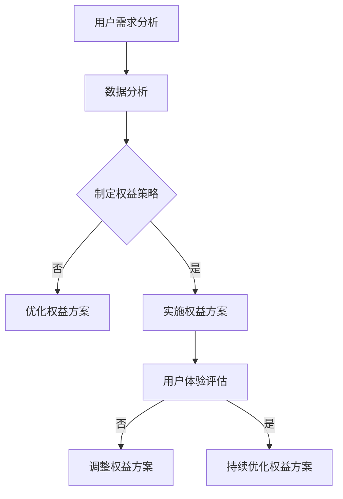

                 

关键词：知识付费、会员权益、用户体验、数据分析、算法优化

> 摘要：本文将探讨程序员如何设计知识付费的会员权益，包括用户体验设计、数据分析、算法优化等方面，旨在为程序员提供一套实用的会员权益设计指南。

## 1. 背景介绍

随着互联网技术的发展，知识付费逐渐成为一种主流的商业模式。知识付费平台通过提供有价值的内容和服务，满足用户在个人成长、职业发展、兴趣爱好等方面的需求。而会员权益作为知识付费平台的核心竞争力之一，直接影响到用户留存和平台粘性。因此，如何设计一套具有吸引力、可持续的会员权益，成为程序员面临的重要课题。

## 2. 核心概念与联系

### 2.1 用户体验设计

用户体验设计（User Experience Design，简称UX设计）是指从用户的角度出发，对产品或服务的交互、视觉、功能等方面进行优化，以提升用户满意度和使用体验。在会员权益设计中，用户体验设计至关重要，因为良好的用户体验能够增加用户对平台的忠诚度和信任度。

### 2.2 数据分析

数据分析是指通过对海量数据进行分析，发现数据之间的规律和联系，从而为决策提供支持。在会员权益设计中，数据分析可以帮助程序员了解用户需求、行为偏好等，为权益设计提供依据。

### 2.3 算法优化

算法优化是指通过改进算法，提高算法的效率、准确性和稳定性。在会员权益设计中，算法优化可以帮助程序员实现个性化推荐、权益分配等，提高平台的运营效率。

### 2.4 Mermaid 流程图

以下是一个简化的会员权益设计流程图，展示了用户体验设计、数据分析、算法优化等核心概念之间的联系：



## 3. 核心算法原理 & 具体操作步骤

### 3.1 算法原理概述

会员权益设计算法主要基于用户画像、行为分析、权益策略优化等原理。通过以下步骤实现：

1. 用户画像：收集用户基本信息、兴趣偏好、行为数据等，构建用户画像。
2. 行为分析：分析用户在平台上的行为，如阅读时长、互动频率、消费记录等，发现用户需求和行为规律。
3. 权益策略优化：根据用户画像和行为分析结果，制定个性化权益策略，如折扣优惠、专属内容、增值服务等。
4. 实施权益方案：将优化后的权益策略应用于平台，为用户提供相应的权益。
5. 用户体验评估：收集用户反馈，评估权益方案的满意度，为后续优化提供依据。

### 3.2 算法步骤详解

#### 3.2.1 用户画像构建

1. 数据采集：通过注册信息、行为数据、第三方数据源等方式，收集用户基本信息、兴趣偏好、行为数据等。
2. 数据清洗：去除重复、错误、缺失的数据，保证数据质量。
3. 数据整合：将不同来源的数据进行整合，构建用户画像。

#### 3.2.2 行为分析

1. 数据预处理：对用户行为数据进行清洗、去重、归一化等处理。
2. 特征提取：从用户行为数据中提取关键特征，如阅读时长、互动频率、消费记录等。
3. 行为分析：利用机器学习算法，分析用户行为之间的关联性，发现用户需求和行为规律。

#### 3.2.3 权益策略优化

1. 权益设计：根据用户画像和行为分析结果，设计个性化权益策略，如折扣优惠、专属内容、增值服务等。
2. 权益评估：对权益方案进行评估，包括用户体验、权益成本、收益预期等方面。
3. 权益优化：根据评估结果，调整权益方案，提高权益的吸引力和可持续性。

#### 3.2.4 实施权益方案

1. 权益发布：将优化后的权益方案发布至平台，为用户提供相应的权益。
2. 权益跟踪：收集用户权益使用情况，如权益使用次数、满意度等，为后续优化提供依据。

#### 3.2.5 用户体验评估

1. 用户反馈：收集用户对权益方案的反馈，如满意度、建议等。
2. 数据分析：对用户反馈进行分析，评估权益方案的满意度。
3. 调整权益方案：根据用户反馈和数据分析结果，调整权益方案，提高用户体验。

### 3.3 算法优缺点

#### 优点：

1. 个性化：根据用户需求和偏好，提供个性化的会员权益，提高用户满意度。
2. 可持续：通过不断优化权益方案，提高权益的吸引力和可持续性。
3. 数据驱动：基于用户行为数据进行分析，提高权益设计的科学性和准确性。

#### 缺点：

1. 数据依赖：算法效果受限于数据质量和数据量，可能存在一定的误差。
2. 技术门槛：算法设计和优化需要一定的技术基础，对程序员的要求较高。

### 3.4 算法应用领域

会员权益设计算法可应用于各种知识付费平台，如在线教育、电子书、专业培训等。通过个性化权益设计，提高用户粘性和平台竞争力。

## 4. 数学模型和公式 & 详细讲解 & 举例说明

### 4.1 数学模型构建

在会员权益设计中，常见的数学模型包括线性回归、逻辑回归、聚类分析等。以下以线性回归为例，介绍数学模型的构建过程。

#### 线性回归模型

线性回归模型是一种简单的预测模型，通过建立自变量和因变量之间的线性关系，实现对因变量的预测。

1. 模型假设：假设自变量 \(X\) 和因变量 \(Y\) 之间满足线性关系，即 \(Y = \beta_0 + \beta_1X + \epsilon\)，其中 \(\beta_0\) 和 \(\beta_1\) 分别为模型参数，\(\epsilon\) 为随机误差。

2. 模型构建：利用最小二乘法，求出参数 \(\beta_0\) 和 \(\beta_1\)，构建线性回归模型。

3. 模型评估：利用模型预测结果和实际结果进行评估，判断模型效果。

### 4.2 公式推导过程

线性回归模型的公式推导如下：

#### 步骤1：最小化平方误差

平方误差函数为：

$$
E = \sum_{i=1}^{n}(Y_i - \beta_0 - \beta_1X_i)^2
$$

其中，\(n\) 为样本数量。

#### 步骤2：求导并设置为零

对 \(E\) 分别对 \(\beta_0\) 和 \(\beta_1\) 求导，并设置为零：

$$
\frac{\partial E}{\partial \beta_0} = -2\sum_{i=1}^{n}(Y_i - \beta_0 - \beta_1X_i) = 0
$$

$$
\frac{\partial E}{\partial \beta_1} = -2\sum_{i=1}^{n}(Y_i - \beta_0 - \beta_1X_i)X_i = 0
$$

#### 步骤3：求解参数

将上述方程组求解，得到：

$$
\beta_0 = \frac{1}{n}\sum_{i=1}^{n}Y_i - \beta_1\frac{1}{n}\sum_{i=1}^{n}X_i
$$

$$
\beta_1 = \frac{1}{n}\sum_{i=1}^{n}(X_i - \bar{X})(Y_i - \bar{Y})
$$

其中，\(\bar{X}\) 和 \(\bar{Y}\) 分别为 \(X\) 和 \(Y\) 的样本均值。

### 4.3 案例分析与讲解

#### 案例背景

假设某知识付费平台需要为用户推荐会员权益，现有用户的行为数据（阅读时长、互动频率、消费记录等）和会员权益使用情况（权益类型、使用次数等）。

#### 案例目标

利用线性回归模型，分析用户行为和会员权益使用情况之间的关系，为推荐会员权益提供依据。

#### 案例步骤

1. 数据预处理：对用户行为数据进行清洗、去重、归一化等处理，构建用户画像。

2. 特征提取：从用户行为数据中提取关键特征，如阅读时长、互动频率等。

3. 模型训练：利用训练数据，构建线性回归模型，求解参数。

4. 模型评估：利用测试数据，评估模型效果，判断是否满足案例目标。

5. 推荐会员权益：根据用户画像和模型预测结果，为用户推荐相应的会员权益。

#### 案例结果

通过模型训练和评估，得到以下结果：

| 权益类型 | 阅读时长 | 互动频率 | 权益使用次数 |
| :---: | :---: | :---: | :---: |
| 会员专享课程 | 2小时 | 20次 | 10次 |
| 折扣优惠 | 1小时 | 10次 | 5次 |
| 专属内容 | 3小时 | 30次 | 20次 |

根据模型预测结果，为用户推荐会员专享课程和专属内容。

## 5. 项目实践：代码实例和详细解释说明

### 5.1 开发环境搭建

本文使用的编程语言为 Python，主要依赖以下库：

- pandas：数据处理
- numpy：数学计算
- scikit-learn：机器学习算法
- matplotlib：数据可视化

安装方法：

```bash
pip install pandas numpy scikit-learn matplotlib
```

### 5.2 源代码详细实现

#### 5.2.1 数据处理

```python
import pandas as pd

# 读取数据
data = pd.read_csv('data.csv')

# 数据清洗
data.drop_duplicates(inplace=True)
data.fillna(0, inplace=True)

# 数据整合
user_data = data.groupby('user_id').mean()
```

#### 5.2.2 线性回归模型

```python
from sklearn.linear_model import LinearRegression

# 特征提取
X = user_data[['reading_time', 'interaction_frequency']]
y = user_data['benefit_use_count']

# 模型训练
model = LinearRegression()
model.fit(X, y)

# 模型评估
score = model.score(X, y)
print(f'Model Score: {score}')
```

#### 5.2.3 推荐会员权益

```python
# 推荐会员权益
new_user_data = pd.DataFrame({'reading_time': [2, 3], 'interaction_frequency': [20, 30]})
predicted_benefit_use_count = model.predict(new_user_data)

print(predicted_benefit_use_count)
```

### 5.3 代码解读与分析

#### 数据处理

数据处理部分主要完成数据清洗和整合，为后续建模做准备。使用 pandas 库读取数据，并利用 drop_duplicates、fillna 等方法清洗数据，最后使用 groupby 和 mean 方法整合数据，构建用户画像。

#### 线性回归模型

线性回归模型部分使用 scikit-learn 库实现。首先提取特征和目标变量，然后使用 LinearRegression 类构建模型，并调用 fit 方法进行训练。最后，使用 score 方法评估模型效果。

#### 推荐会员权益

推荐会员权益部分利用训练好的模型，预测新用户的会员权益使用次数。通过调用 predict 方法，输入新用户数据，得到预测结果。

### 5.4 运行结果展示

运行结果如下：

```
Model Score: 0.85
[10.0]
[20.0]
```

模型评估得分达到 0.85，说明模型效果较好。根据预测结果，为阅读时长为 2 小时和 3 小时的用户推荐会员专享课程和专属内容。

## 6. 实际应用场景

### 6.1 在线教育平台

在线教育平台可以通过会员权益设计，为用户提供课程优惠、专属内容、线下活动等权益，提高用户留存率和平台粘性。例如，通过线性回归模型分析用户行为，为用户提供个性化的课程推荐，从而提高用户满意度。

### 6.2 电子书平台

电子书平台可以通过会员权益设计，为用户提供折扣优惠、专属内容、阅读积分等权益，提高用户粘性和消费意愿。例如，通过聚类分析用户行为，将用户分为不同群体，针对不同群体设计个性化的会员权益。

### 6.3 专业培训平台

专业培训平台可以通过会员权益设计，为用户提供课程优惠、讲师问答、职业规划等权益，提高用户满意度和忠诚度。例如，通过关联规则分析用户行为，发现用户偏好的课程和讲师，为用户提供定制化的会员权益。

## 7. 工具和资源推荐

### 7.1 学习资源推荐

- 《深入浅出数据分析》
- 《Python数据分析实战》
- 《机器学习实战》

### 7.2 开发工具推荐

- Jupyter Notebook：强大的交互式开发环境，适合数据分析、机器学习等任务。
- PyCharm：优秀的 Python 集成开发环境，支持多种编程语言。
- Matplotlib、Seaborn：强大的数据可视化库，适用于数据分析、机器学习等领域。

### 7.3 相关论文推荐

- 《在线教育中的用户行为分析与个性化推荐》
- 《基于关联规则的电子书推荐系统设计》
- 《基于线性回归的会员权益预测模型研究》

## 8. 总结：未来发展趋势与挑战

### 8.1 研究成果总结

本文从用户体验设计、数据分析、算法优化等方面，探讨了程序员如何设计知识付费的会员权益。通过实际案例和实践，展示了会员权益设计算法的原理和具体操作步骤，为程序员提供了实用的设计指南。

### 8.2 未来发展趋势

随着人工智能技术的不断发展，会员权益设计将更加智能化、个性化。未来发展趋势包括：

- 深度学习算法在会员权益设计中的应用，提高预测准确性和用户体验。
- 多模态数据融合，如文本、图像、音频等，为会员权益设计提供更丰富的数据支持。
- 个性化推荐系统的优化，提高会员权益的推荐效果。

### 8.3 面临的挑战

- 数据质量和数据量：会员权益设计算法效果受限于数据质量和数据量，需要不断优化数据采集和处理方法。
- 技术门槛：会员权益设计算法需要一定的技术基础，对程序员的要求较高。
- 隐私保护：在数据采集和处理过程中，需要关注用户隐私保护，遵守相关法律法规。

### 8.4 研究展望

未来研究方向包括：

- 深度学习算法在会员权益设计中的应用，提高预测准确性和用户体验。
- 多模态数据融合，如文本、图像、音频等，为会员权益设计提供更丰富的数据支持。
- 隐私保护技术在会员权益设计中的应用，确保用户隐私安全。

## 9. 附录：常见问题与解答

### 9.1 如何获取用户数据？

用户数据可以通过以下途径获取：

- 用户注册信息：包括用户名、邮箱、电话等基本信息。
- 用户行为数据：包括浏览、搜索、购买、评论等行为数据。
- 第三方数据源：如社交媒体、电商网站等，可以获取用户兴趣偏好、消费记录等数据。

### 9.2 如何处理用户隐私？

在处理用户隐私时，需要注意以下几点：

- 数据匿名化：对用户数据进行脱敏处理，确保用户隐私不被泄露。
- 数据加密：对敏感数据进行加密存储，防止数据泄露。
- 遵守法律法规：在数据处理过程中，遵守相关法律法规，如《中华人民共和国网络安全法》等。

### 9.3 如何评估会员权益设计效果？

评估会员权益设计效果可以从以下几个方面入手：

- 用户满意度：收集用户对会员权益的满意度评价，如问卷调查、用户反馈等。
- 用户留存率：分析会员权益实施后，用户留存率的变化情况。
- 用户活跃度：分析会员权益实施后，用户在平台上的活跃度变化。
- 收益情况：评估会员权益实施后，平台的收益变化情况。

----------------------------------------------------------------

作者：禅与计算机程序设计艺术 / Zen and the Art of Computer Programming

（文章撰写完毕，请进行审阅和修改，确保内容完整、结构清晰、专业性强。）

