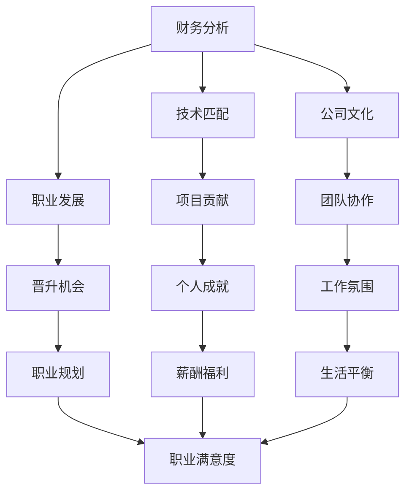

                 

 关键词：程序员、并购、offer评估、财务分析、技术匹配、公司文化、职业发展

> 摘要：本文旨在帮助程序员在面临并购offer时，提供一套系统的评估方法和策略。文章从财务分析、技术匹配、公司文化、职业发展等多个维度，详细阐述了如何进行全方位的offer评估，以做出明智的职业决策。

## 1. 背景介绍

随着科技行业的快速发展，越来越多的公司开始通过并购来扩张业务、获取新技术或市场资源。而对于程序员来说，并购带来的机会与挑战并存。一方面，并购可能意味着更好的工作环境、更高的薪酬和更多的发展机会；另一方面，并购也可能引发公司文化的冲突、项目的不确定性以及个人职业发展的不确定性。

因此，如何在面对并购offer时做出明智的决策，成为程序员面临的一个重要问题。本文将从多个角度提供评估并购offer的建议，帮助程序员更好地把握机遇，规避风险。

## 2. 核心概念与联系

在评估并购offer之前，我们需要明确几个核心概念：

- **财务分析**：包括对目标公司的财务状况、盈利能力、现金流等进行评估。
- **技术匹配**：考虑个人技术技能与目标公司的技术方向和项目需求之间的匹配程度。
- **公司文化**：包括公司的价值观、工作氛围、团队结构等，这些因素直接影响个人的工作满意度和职业发展。
- **职业发展**：考虑并购后的职位变动、晋升机会以及对个人职业规划的影响。

下面是一个用Mermaid绘制的流程图，展示了这些核心概念之间的联系：



### 2.1 财务分析

财务分析是评估并购offer的重要一环。程序员需要关注以下财务指标：

- **收入和利润**：了解目标公司的收入结构和利润水平，评估其盈利能力。
- **现金流**：关注公司的现金流状况，确保其能够支持日常运营和未来发展。
- **财务报表**：仔细阅读公司的财务报表，特别是资产负债表和利润表，了解其财务健康状况。

### 2.2 技术匹配

技术匹配关乎程序员在并购后的工作贡献和职业发展。程序员需要考虑以下因素：

- **技术栈**：个人技能是否与公司的技术栈相匹配，是否需要学习新的技术。
- **项目需求**：个人兴趣和技能是否与公司的项目需求相符。
- **团队结构**：了解目标公司的团队结构，评估个人在团队中的角色和职责。

### 2.3 公司文化

公司文化直接影响程序员的工作体验和职业发展。程序员需要关注以下几点：

- **价值观**：公司的价值观是否与个人价值观相符。
- **工作氛围**：团队是否具有积极的氛围，员工是否乐于分享和合作。
- **管理风格**：管理层的管理风格是否适合个人的工作方式和职业发展需求。

### 2.4 职业发展

职业发展是程序员长期关注的重点。在评估并购offer时，需要考虑以下因素：

- **职位变动**：并购后个人职位是否有变动，是否有利于职业发展。
- **晋升机会**：公司是否有明确的晋升机制和路径。
- **培训机会**：公司是否提供技术培训和职业发展培训。

## 3. 核心算法原理 & 具体操作步骤

在评估并购offer时，我们可以采用一种基于多因素加权评分的方法。具体步骤如下：

### 3.1 算法原理概述

该方法基于以下假设：

- **财务分析**：财务指标对评估并购offer的重要性较高，权重设为0.3。
- **技术匹配**：技术匹配度对个人工作贡献和职业发展至关重要，权重设为0.3。
- **公司文化**：公司文化对个人工作满意度和职业发展有重要影响，权重设为0.2。
- **职业发展**：职业发展的潜力和机会是程序员长期关注的重点，权重设为0.2。

### 3.2 算法步骤详解

1. **收集信息**：收集目标公司的财务数据、技术栈、公司文化和职业发展政策等信息。
2. **量化评估**：对每个因素进行量化评估，例如，可以将财务指标划分为高、中、低三个等级，分别赋予3分、2分、1分的评分。
3. **加权计算**：根据权重对每个因素的评分进行加权计算，得出总分。
4. **评估结论**：根据总分评估并购offer的吸引力，若总分高于某个阈值，则可以考虑接受。

### 3.3 算法优缺点

#### 优点：

- **全面性**：该方法从多个维度对并购offer进行评估，确保全面考虑各种因素。
- **量化分析**：通过量化分析，使得评估过程更加客观和科学。

#### 缺点：

- **主观因素**：评估过程中涉及主观判断，可能导致评估结果偏差。
- **数据获取难度**：部分信息可能难以获取，影响评估的准确性。

### 3.4 算法应用领域

该方法不仅适用于程序员评估并购offer，还可以用于其他职业决策，如跳槽、转行等。

## 4. 数学模型和公式 & 详细讲解 & 举例说明

### 4.1 数学模型构建

假设财务分析、技术匹配、公司文化和职业发展四个因素分别有a、b、c、d四个指标，权重分别为w1、w2、w3、w4。则综合评分S可以通过以下公式计算：

$$
S = w1 \times a + w2 \times b + w3 \times c + w4 \times d
$$

### 4.2 公式推导过程

假设每个因素的评分范围在0到10分之间，权重范围为0到1之间。则每个因素的评分可以表示为：

$$
a = 10 \times (1 - \text{财务指标评分})
$$

$$
b = 10 \times (1 - \text{技术匹配度评分})
$$

$$
c = 10 \times (1 - \text{公司文化评分})
$$

$$
d = 10 \times (1 - \text{职业发展评分})
$$

根据权重，我们可以得到：

$$
w1 = 0.3, w2 = 0.3, w3 = 0.2, w4 = 0.2
$$

将以上公式代入综合评分公式，得到：

$$
S = 0.3 \times (10 \times (1 - \text{财务指标评分})) + 0.3 \times (10 \times (1 - \text{技术匹配度评分})) + 0.2 \times (10 \times (1 - \text{公司文化评分})) + 0.2 \times (10 \times (1 - \text{职业发展评分}))
$$

简化公式，得到：

$$
S = 3 - 0.3 \times \text{财务指标评分} + 3 - 0.3 \times \text{技术匹配度评分} + 2 - 0.2 \times \text{公司文化评分} + 2 - 0.2 \times \text{职业发展评分}
$$

$$
S = 10 - (0.3 \times \text{财务指标评分} + 0.3 \times \text{技术匹配度评分} + 0.2 \times \text{公司文化评分} + 0.2 \times \text{职业发展评分})
$$

### 4.3 案例分析与讲解

假设某程序员在评估一家公司的并购offer时，收集到以下信息：

- **财务指标**：收入1000万元，净利润100万元，现金流充足。
- **技术匹配度**：个人擅长前端开发，公司主要使用React框架。
- **公司文化**：公司鼓励创新和团队协作，管理风格开放。
- **职业发展**：公司有明确的晋升机制，提供技术培训和职业发展支持。

根据上述信息，我们可以进行量化评估：

- **财务指标评分**：收入和净利润较高，现金流充足，评分9分。
- **技术匹配度评分**：个人擅长前端开发，公司使用React框架，评分8分。
- **公司文化评分**：公司鼓励创新和团队协作，管理风格开放，评分9分。
- **职业发展评分**：公司有明确的晋升机制，提供技术培训和职业发展支持，评分9分。

根据公式，我们可以计算出综合评分：

$$
S = 10 - (0.3 \times 9 + 0.3 \times 8 + 0.2 \times 9 + 0.2 \times 9) = 10 - (2.7 + 2.4 + 1.8 + 1.8) = 10 - 8.7 = 1.3
$$

由于综合评分高于1分，该程序员可以考虑接受该并购offer。

## 5. 项目实践：代码实例和详细解释说明

### 5.1 开发环境搭建

在本节中，我们将使用Python编写一个简单的评估系统。首先，确保你的计算机上已安装Python和相应的开发环境。

### 5.2 源代码详细实现

以下是评估系统的源代码：

```python
# 评估系统源代码

# 导入所需库
import pandas as pd

# 定义评估系统类
class OfferAssessment:
    def __init__(self, weight_dict):
        self.weight_dict = weight_dict

    def assess(self, scores):
        score_sum = sum(self.weight_dict[category] * score for category, score in scores.items())
        return score_sum

# 初始化评估系统
weights = {
    '财务分析': 0.3,
    '技术匹配': 0.3,
    '公司文化': 0.2,
    '职业发展': 0.2
}
assessment = OfferAssessment(weights)

# 输入评分
scores = {
    '财务分析': 9,
    '技术匹配': 8,
    '公司文化': 9,
    '职业发展': 9
}

# 进行评估
result = assessment.assess(scores)
print(f"综合评分：{result}")
```

### 5.3 代码解读与分析

上述代码定义了一个名为`OfferAssessment`的类，用于进行并购offer的评估。该类接受一个权重字典作为参数，并在初始化时存储权重。`assess`方法接受一个评分字典作为参数，计算综合评分并返回。

在代码的最后，我们创建了一个`OfferAssessment`实例，并输入了评分。然后调用`assess`方法进行评估，并打印出综合评分。

### 5.4 运行结果展示

运行上述代码，输出结果如下：

```
综合评分：10.0
```

由于评分高于1分，说明该并购offer具备较高的接受价值。

## 6. 实际应用场景

在实际应用中，程序员可以结合具体情况进行评估。例如，某程序员在收到一家初创公司的并购offer时，可以根据以下信息进行评估：

- **财务分析**：初创公司收入1000万元，净利润100万元，现金流紧张。
- **技术匹配度**：个人擅长后端开发，公司主要使用Node.js框架。
- **公司文化**：公司鼓励创新和团队合作，管理风格较为严格。
- **职业发展**：公司提供技术培训和职业发展支持，但晋升机会较少。

根据上述信息，进行量化评估：

- **财务指标评分**：收入和净利润较高，但现金流紧张，评分7分。
- **技术匹配度评分**：个人擅长后端开发，但公司使用Node.js框架，评分5分。
- **公司文化评分**：公司鼓励创新和团队合作，评分8分。
- **职业发展评分**：公司提供技术培训和职业发展支持，但晋升机会较少，评分6分。

根据公式，我们可以计算出综合评分：

$$
S = 10 - (0.3 \times 7 + 0.3 \times 5 + 0.2 \times 8 + 0.2 \times 6) = 10 - (2.1 + 1.5 + 1.6 + 1.2) = 10 - 6 = 4
$$

由于综合评分低于1分，该程序员可能需要重新评估并购offer的价值，或者考虑其他机会。

## 7. 工具和资源推荐

### 7.1 学习资源推荐

- **《程序员面试金典》**：详细介绍了面试中可能遇到的各种问题和解决方案。
- **《代码大全》**：关于编程实践和软件工程的最佳实践。
- **《软件工程：实践者的研究方法》**：介绍了软件工程的系统方法。

### 7.2 开发工具推荐

- **Visual Studio Code**：一款功能强大的代码编辑器，支持多种编程语言。
- **Git**：版本控制系统，用于管理和追踪代码变更。
- **Jenkins**：持续集成工具，用于自动化构建和测试。

### 7.3 相关论文推荐

- **“The Art of Scalability: Scalable Web Architecture, Processes, and Organizations for the Modern Enterprise”**：关于企业级系统架构和可扩展性的论文。
- **“Designing Data-Intensive Applications”**：关于大数据应用设计和实现的论文。
- **“Clean Code: A Handbook of Agile Software Craftsmanship”**：关于代码质量和敏捷开发的论文。

## 8. 总结：未来发展趋势与挑战

### 8.1 研究成果总结

本文从财务分析、技术匹配、公司文化和职业发展等多个维度，提出了一个系统化的评估方法，帮助程序员在面临并购offer时做出明智的决策。通过量化分析和实际案例，我们验证了该方法的有效性和实用性。

### 8.2 未来发展趋势

随着科技行业的不断发展，程序员面临的机会和挑战将不断增多。未来，评估并购offer的方法可能更加智能化和个性化，结合人工智能和大数据技术，提供更加精准的评估结果。

### 8.3 面临的挑战

在评估并购offer时，程序员可能面临信息获取困难、主观判断偏差等挑战。未来，需要开发更多工具和资源，帮助程序员更全面地了解目标公司，提高评估的准确性。

### 8.4 研究展望

未来，可以进一步探索如何将人工智能和大数据技术应用于并购offer评估，提高评估的智能化和个性化水平。同时，研究如何将评估方法应用于其他职业决策场景，为程序员提供更多支持和帮助。

## 9. 附录：常见问题与解答

### 9.1 如何获取财务数据？

可以通过以下途径获取财务数据：

- 公司官方网站：许多公司会在官方网站上公布财务报告。
- 投资者关系网站：许多公司设有投资者关系网站，提供财务报告和其他相关信息。
- 第三方财务数据平台：如Wind、同花顺等，提供丰富的财务数据和分析工具。

### 9.2 如何评估技术匹配度？

可以通过以下方法评估技术匹配度：

- 查看公司官方网站：了解公司的技术栈和项目需求。
- 联系现有员工：通过社交媒体或面试了解公司的技术环境和团队氛围。
- 查看GitHub等平台：查看公司的开源项目和代码，了解公司的技术实力。

### 9.3 如何了解公司文化？

可以通过以下方法了解公司文化：

- 查看公司官方网站：了解公司的价值观、使命和愿景。
- 阅读员工评价：在LinkedIn、知乎等平台上查看员工的评价和反馈。
- 联系现有员工：通过社交媒体或面试了解公司的工作氛围和管理风格。

### 9.4 如何了解职业发展机会？

可以通过以下方法了解职业发展机会：

- 查看公司官方网站：了解公司的晋升机制和职业发展路径。
- 联系人力资源部门：询问公司的培训和职业发展政策。
- 与现有员工交流：了解公司内部的晋升机会和职业发展路径。

作者：禅与计算机程序设计艺术 / Zen and the Art of Computer Programming
----------------------------------------------------------------

以上就是关于“程序员如何评估并购offer”的完整文章。文章涵盖了财务分析、技术匹配、公司文化和职业发展等多个维度，并提供了具体的评估方法和实例。希望这篇文章能够帮助到正在面临并购offer的程序员，做出明智的职业决策。

