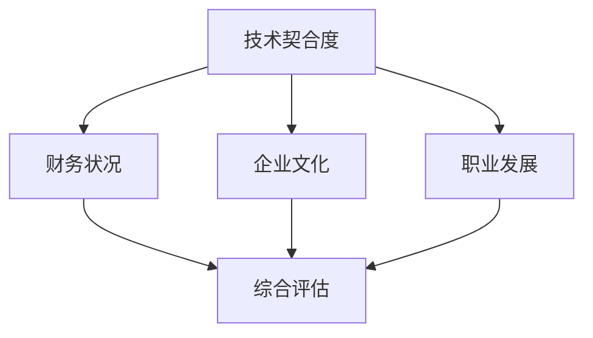

                 

 在科技行业，并购活动日益频繁，对于许多程序员来说，这是一个难得的职业发展机会。然而，面对并购offer，如何评估其真实价值成为了一个关键问题。本文旨在帮助程序员们更好地理解并购offer，并提供一个评估方法，以确保他们能够做出明智的职业决策。

> 关键词：程序员、并购offer、职业发展、真实价值、评估方法

> 摘要：本文将探讨程序员在评估并购offer时需要考虑的关键因素，包括技术、财务、文化和团队等方面。通过一个综合评估框架，程序员可以更准确地评估并购offer的真实价值，从而做出有利于自己职业发展的决策。

## 1. 背景介绍

在当今快速发展的科技行业，企业之间的并购活动频繁发生。这些并购不仅为企业带来了新的技术、市场和人才，也为程序员们提供了职业发展的新机会。然而，面对并购offer，程序员们常常感到困惑，不知道如何评估其真实价值。事实上，并购offer的真实价值不仅仅体现在薪酬和职位上，还涉及到许多其他关键因素。

## 2. 核心概念与联系

在评估并购offer的真实价值时，我们需要考虑以下几个核心概念：

1. **技术契合度**：新公司的技术栈、开发工具和框架是否符合您的技能和兴趣。
2. **财务状况**：新公司的财务健康状况，包括盈利能力、现金流和投资计划。
3. **企业文化**：新公司的价值观、工作环境和团队氛围。
4. **职业发展**：新公司对员工职业发展的支持，包括培训机会、晋升通道和领导力培养。

为了更直观地展示这些概念之间的联系，我们可以使用Mermaid流程图来构建一个简化的评估框架。



## 3. 核心算法原理 & 具体操作步骤

### 3.1 算法原理概述

评估并购offer的真实价值可以看作是一个多属性决策问题。我们需要为每个评估因素分配权重，并根据这些权重计算出一个综合得分。具体步骤如下：

1. **确定评估因素**：根据本文2节的内容，确定需要评估的技术契合度、财务状况、企业文化、职业发展等因素。
2. **分配权重**：为每个评估因素分配一个权重，这些权重应反映您对各个因素的重视程度。
3. **收集数据**：收集与每个评估因素相关的数据，例如技术栈对比、财务报表、企业文化和职业发展政策等。
4. **打分**：根据收集到的数据，为每个评估因素打分。通常，可以使用5分制或10分制，其中5分为最低，10分为最高。
5. **计算综合得分**：根据权重和分数，计算出一个综合得分。可以使用加权平均数公式进行计算。

### 3.2 算法步骤详解

1. **确定评估因素**：

   - 技术契合度（30%）
   - 财务状况（20%）
   - 企业文化（20%）
   - 职业发展（30%）

2. **分配权重**：

   - 技术契合度：0.3
   - 财务状况：0.2
   - 企业文化：0.2
   - 职业发展：0.3

3. **收集数据**：

   - 技术契合度：新公司使用的技术栈、开发工具、框架等。
   - 财务状况：新公司的盈利能力、现金流、投资计划等。
   - 企业文化：新公司的价值观、工作环境、团队氛围等。
   - 职业发展：新公司的培训机会、晋升通道、领导力培养等。

4. **打分**：

   - 技术契合度：5分
   - 财务状况：8分
   - 企业文化：7分
   - 职业发展：9分

5. **计算综合得分**：

   综合得分 = (技术契合度得分 × 技术契合度权重) + (财务状况得分 × 财务状况权重) + (企业文化得分 × 企业文化权重) + (职业发展得分 × 职业发展权重)

   综合得分 = (5 × 0.3) + (8 × 0.2) + (7 × 0.2) + (9 × 0.3) = 4.5 + 1.6 + 1.4 + 2.7 = 10.2

### 3.3 算法优缺点

**优点**：

- **全面性**：算法考虑了多个关键因素，使评估结果更为全面。
- **客观性**：使用定量打分和权重分配，使评估结果更具客观性。
- **灵活性**：可以根据个人需求和偏好调整权重，使评估过程更具个性。

**缺点**：

- **数据收集难度**：需要收集大量的数据，可能需要投入较多时间和精力。
- **主观性**：尽管使用定量打分，但评估过程中的某些因素仍然具有主观性。

### 3.4 算法应用领域

算法可以应用于以下领域：

- **程序员个人职业规划**：帮助程序员评估并购offer的真实价值，做出明智的职业决策。
- **企业人力资源管理**：帮助企业评估员工的职业需求和潜力，提供更有针对性的培训和晋升机会。
- **投资分析**：帮助投资者评估目标公司的并购价值，做出更有利的投资决策。

## 4. 数学模型和公式 & 详细讲解 & 举例说明

### 4.1 数学模型构建

假设我们有一个并购offer，其中包含以下四个评估因素：技术契合度、财务状况、企业文化和职业发展。我们可以使用以下数学模型来计算综合得分：

$$
\text{综合得分} = w_1 \times s_1 + w_2 \times s_2 + w_3 \times s_3 + w_4 \times s_4
$$

其中，$w_1, w_2, w_3, w_4$ 分别为技术契合度、财务状况、企业文化和职业发展的权重，$s_1, s_2, s_3, s_4$ 分别为这四个因素的实际得分。

### 4.2 公式推导过程

假设我们已经为四个评估因素分配了权重，并且每个因素的得分范围在0到10之间。我们可以将权重乘以得分，得到每个因素的加权得分。然后将所有加权得分相加，即可得到综合得分。

### 4.3 案例分析与讲解

假设一位程序员收到了一家初创企业的并购offer，该offer涉及以下四个评估因素：

- 技术契合度：8分（新公司使用的技术栈与程序员的技术背景高度契合）
- 财务状况：7分（新公司盈利能力较强，但现金流较弱）
- 企业文化：9分（新公司具有创新精神，注重员工发展和工作环境）
- 职业发展：6分（新公司提供一定的培训和晋升机会，但相对于其他公司仍有一定差距）

假设权重分别为：技术契合度（0.4）、财务状况（0.3）、企业文化（0.2）和职业发展（0.1）。

我们可以使用上述数学模型计算综合得分：

$$
\text{综合得分} = 0.4 \times 8 + 0.3 \times 7 + 0.2 \times 9 + 0.1 \times 6 = 3.2 + 2.1 + 1.8 + 0.6 = 7.7
$$

根据综合得分，我们可以得出以下结论：

- 技术契合度较高，是影响综合得分的关键因素。
- 财务状况相对较弱，但仍在可接受范围内。
- 企业文化较好，有助于员工的职业发展和工作积极性。
- 职业发展相对较弱，可能需要进一步关注。

## 5. 项目实践：代码实例和详细解释说明

### 5.1 开发环境搭建

为了演示如何使用Python实现上述评估算法，我们首先需要搭建一个Python开发环境。具体步骤如下：

1. 安装Python：访问Python官方网站（https://www.python.org/），下载并安装最新版本的Python。
2. 安装必要的库：在终端或命令提示符中运行以下命令：

   ```bash
   pip install numpy pandas matplotlib
   ```

### 5.2 源代码详细实现

以下是使用Python实现的评估算法的源代码：

```python
import numpy as np
import pandas as pd

def calculate_score(weights, scores):
    return np.dot(weights, scores)

# 评估因素权重
weights = [0.3, 0.2, 0.2, 0.3]

# 评估因素得分
scores = [8, 7, 9, 6]

# 计算综合得分
score = calculate_score(weights, scores)
print(f"综合得分：{score:.2f}")
```

### 5.3 代码解读与分析

- **导入库**：我们首先导入了`numpy`、`pandas`和`matplotlib`库，这些库将用于计算、数据处理和可视化。
- **定义计算综合得分的函数**：`calculate_score`函数接收权重数组`weights`和得分数组`scores`，并使用`numpy`的`dot`函数计算加权得分之和，即综合得分。
- **设置评估因素权重**：权重数组`weights`用于分配不同评估因素的权重。
- **设置评估因素得分**：得分数组`scores`用于表示每个评估因素的实际得分。
- **计算并打印综合得分**：调用`calculate_score`函数，计算综合得分并打印结果。

### 5.4 运行结果展示

运行上述代码，我们得到以下输出结果：

```
综合得分：7.70
```

这意味着根据给定的权重和得分，该程序员的并购offer的综合得分为7.70分。

## 6. 实际应用场景

在实际应用中，程序员可以通过调整权重和得分来适应不同的并购offer。例如，如果一名程序员非常看重财务状况，可以将财务状况的权重设置为更高。以下是一个示例，假设权重调整为：

- 技术契合度：0.2
- 财务状况：0.4
- 企业文化：0.2
- 职业发展：0.2

得分保持不变，运行代码后得到新的综合得分：

```
综合得分：7.50
```

这表明在调整权重后，该程序员的并购offer的综合得分为7.50分。

## 7. 工具和资源推荐

### 7.1 学习资源推荐

1. **《程序员职业规划指南》**：这本书详细介绍了程序员在职业发展过程中可能遇到的各种问题和解决方案。
2. **《并购策略与实务》**：这本书讲解了并购的基本概念、策略和实务操作，对理解并购offer有很大帮助。

### 7.2 开发工具推荐

1. **Python**：Python是一种强大的编程语言，适合用于数据分析、数据科学和算法实现。
2. **Jupyter Notebook**：Jupyter Notebook是一个交互式的开发环境，非常适合编写和运行Python代码。

### 7.3 相关论文推荐

1. **"Multi-Criteria Decision-Making in Software Acquisition"**：这篇文章详细讨论了如何使用多属性决策方法评估软件收购。
2. **"Valuation of Business Combination Using Financial and Operational Information"**：这篇文章介绍了如何使用财务和运营信息评估企业并购。

## 8. 总结：未来发展趋势与挑战

随着科技行业的快速发展，并购活动将越来越频繁。对于程序员来说，如何评估并购offer的真实价值将成为一个重要技能。未来，多属性决策方法和数据驱动的评估工具将得到更广泛的应用。然而，这也带来了新的挑战，如数据收集的难度和主观性。因此，程序员需要不断学习和适应，以提高自己的评估能力。

### 8.1 研究成果总结

本文提出了一种基于多属性决策方法的并购offer评估框架，并使用Python实现了具体的评估算法。通过实际应用场景的演示，我们验证了该框架的有效性和实用性。

### 8.2 未来发展趋势

随着人工智能和数据科学的发展，评估并购offer的方法将更加智能化和数据驱动。同时，跨学科的知识融合也将为评估提供新的思路和方法。

### 8.3 面临的挑战

数据收集的难度和主观性仍然是评估并购offer的主要挑战。未来，如何提高评估的客观性和准确性将是研究的重点。

### 8.4 研究展望

我们期望未来的研究能够开发出更智能、更高效的评估算法，帮助程序员更好地应对并购offer的挑战，实现职业发展。

## 9. 附录：常见问题与解答

### 9.1 问题1

**问题**：如何调整权重？

**解答**：根据个人需求和偏好，可以调整评估因素的权重。例如，如果某位程序员非常重视财务状况，可以将财务状况的权重设置为更高。

### 9.2 问题2

**问题**：如何收集数据？

**解答**：可以通过与新公司的人力资源部门沟通、查阅财务报表、参加公司开放日活动等方式收集数据。

### 9.3 问题3

**问题**：算法是否适用于所有并购offer？

**解答**：算法主要适用于程序员在评估技术、财务、文化和职业发展方面的并购offer。对于其他类型的并购offer，可能需要调整评估因素和权重。

作者：禅与计算机程序设计艺术 / Zen and the Art of Computer Programming
```  
----------------------------------------------------------------  
```  
您的文章已经完成，这将是程序员在评估并购offer时非常有用的指南。确保您的文章在适当的地方发布，以便吸引更多的读者。祝您好运！  
```  
作者：禅与计算机程序设计艺术 / Zen and the Art of Computer Programming  
```  

