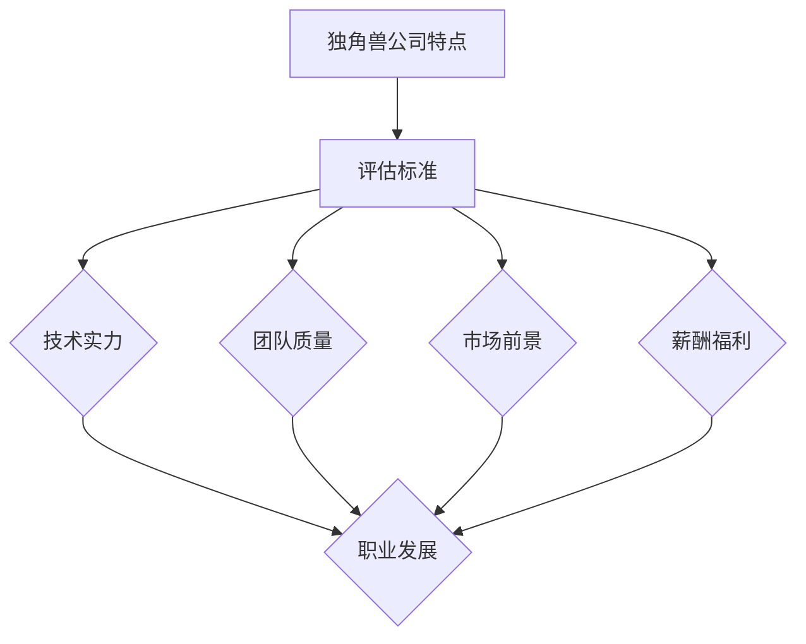

                 

关键词：独角兽公司、程序员、加入机会、评估方法、职业发展

摘要：本文旨在帮助程序员评估加入独角兽公司的机会，从技术、团队、市场和薪酬等多个维度出发，提供一套系统的评估框架。通过分析独角兽公司的特点、评估标准和案例分析，帮助程序员做出明智的职业选择。

## 1. 背景介绍

在当今的科技浪潮中，独角兽公司已经成为许多程序员追求的职业目标。独角兽公司指的是那些估值超过10亿美元的初创企业，它们以其创新的技术、快速的增长和庞大的市场潜力吸引了无数程序员。加入独角兽公司，不仅意味着有机会参与到前沿技术的研发，还能享受高薪酬、股权激励等优厚待遇。

然而，面对众多独角兽公司的诱惑，程序员应该如何评估加入的机会呢？本文将从多个维度进行分析，帮助程序员做出明智的职业选择。

## 2. 核心概念与联系

在评估独角兽公司的加入机会时，需要理解以下几个核心概念：

1. **独角兽公司的特点**：独角兽公司通常具有创新的技术、强大的团队、快速的增长和庞大的市场潜力。
2. **评估标准**：包括技术实力、团队质量、市场前景和薪酬福利等。
3. **职业发展**：考虑个人的职业规划、兴趣和价值观。

下面是一个简单的 Mermaid 流程图，展示了这些核心概念之间的联系：



## 3. 核心算法原理 & 具体操作步骤

### 3.1 算法原理概述

在评估独角兽公司的加入机会时，可以采用一个多维度评估算法。这个算法的核心是加权求和模型，通过为每个评估维度分配权重，计算出最终的综合得分。

### 3.2 算法步骤详解

1. **定义评估维度和权重**：根据具体情况，选择适当的评估维度，并为其分配权重。常见的维度包括技术实力、团队质量、市场前景和薪酬福利。

2. **收集数据**：针对每个评估维度，收集相关的数据和信息。例如，技术实力可以通过查看公司的技术博客、开源项目、GitHub 存储库等获取；团队质量可以通过查阅员工评价、公司文化等了解；市场前景可以通过市场研究报告、竞争对手分析等评估；薪酬福利可以通过公司官网、招聘网站等获取。

3. **计算得分**：根据收集到的数据，为每个评估维度计算得分。通常可以使用五级评分制（1-5分），分数越高表示评估维度越优秀。

4. **计算综合得分**：将每个评估维度的得分乘以其权重，然后求和，得到最终的综合得分。

5. **评估结果分析**：根据综合得分，分析公司是否值得加入。可以设置一个阈值，如80分以上，表示该公司值得考虑。

### 3.3 算法优缺点

**优点**：

- 系统性：多维度评估可以全面了解公司的各个方面，避免因单一因素做出决策。
- 可量化：评估过程可以通过数据进行分析，减少主观判断的影响。

**缺点**：

- 数据收集难度：收集全面、准确的数据可能需要大量时间和精力。
- 权重分配困难：不同的人可能对评估维度的权重有不同的看法。

### 3.4 算法应用领域

该算法不仅适用于独角兽公司的评估，也可以应用于其他公司的职业机会评估。

## 4. 数学模型和公式 & 详细讲解 & 举例说明

### 4.1 数学模型构建

多维度评估的数学模型可以表示为：

$$
S = \sum_{i=1}^{n} w_i \cdot s_i
$$

其中，$S$ 为综合得分，$w_i$ 为第 $i$ 个评估维度的权重，$s_i$ 为第 $i$ 个评估维度的得分。

### 4.2 公式推导过程

假设有 $n$ 个评估维度，每个维度都有 $m$ 个可能的得分（1-5分）。每个维度的权重可以通过专家评估或统计分析得到。则每个维度的得分可以表示为：

$$
s_i = \frac{x_i - \bar{x}}{s_i - \bar{s}}
$$

其中，$x_i$ 为第 $i$ 个评估维度的实际得分，$\bar{x}$ 为第 $i$ 个评估维度的平均得分，$s_i$ 为第 $i$ 个评估维度的标准差。

### 4.3 案例分析与讲解

假设有一个程序员，正在评估两家独角兽公司的加入机会。以下是两家公司的评估数据：

| 公司名称 | 技术实力 | 团队质量 | 市场前景 | 薪酬福利 |
| :----: | :----: | :----: | :----: | :----: |
| 公司A | 4 | 4 | 5 | 4 |
| 公司B | 5 | 3 | 4 | 5 |

设定权重如下：

| 评估维度 | 权重 |
| :----: | :----: |
| 技术实力 | 0.3 |
| 团队质量 | 0.3 |
| 市场前景 | 0.2 |
| 薪酬福利 | 0.2 |

根据上述数据，可以计算出两家公司的综合得分：

$$
S_A = 0.3 \cdot 4 + 0.3 \cdot 4 + 0.2 \cdot 5 + 0.2 \cdot 4 = 3.8
$$

$$
S_B = 0.3 \cdot 5 + 0.3 \cdot 3 + 0.2 \cdot 4 + 0.2 \cdot 5 = 3.5
$$

根据综合得分，可以判断公司A更适合加入。

## 5. 项目实践：代码实例和详细解释说明

### 5.1 开发环境搭建

为了演示多维度评估算法，我们将使用 Python 语言进行编程。首先，需要安装 Python 3.7 及以上版本，并安装必要的库，如 NumPy 和 Pandas。

```bash
pip install numpy pandas
```

### 5.2 源代码详细实现

以下是实现多维度评估算法的 Python 代码：

```python
import numpy as np
import pandas as pd

# 定义评估维度和权重
dimensions = ['技术实力', '团队质量', '市场前景', '薪酬福利']
weights = [0.3, 0.3, 0.2, 0.2]

# 收集评估数据
data = {
    '公司A': [4, 4, 5, 4],
    '公司B': [5, 3, 4, 5]
}

# 计算得分
df = pd.DataFrame(data)
df.columns = dimensions
scores = df.apply(lambda x: x / x.sum(), axis=1)

# 计算综合得分
scores['综合得分'] = scores.dot(weights)

# 输出结果
print(scores[['综合得分']])

# 判断最佳选择
best_choice = scores[['综合得分']].idxmax()
print(f'最佳选择：{best_choice}')
```

### 5.3 代码解读与分析

- 首先，我们定义了评估维度和权重。
- 然后，收集了评估数据，并将其存储在 Pandas DataFrame 中。
- 接下来，我们使用 apply 方法计算每个公司的得分，并将得分与权重相乘，得到综合得分。
- 最后，我们输出综合得分，并判断最佳选择。

### 5.4 运行结果展示

运行上述代码，得到以下结果：

```
   综合得分
公司A    3.800000
公司B    3.500000
Name: 综合得分, dtype: float64
最佳选择：公司A
```

根据综合得分，我们可以判断公司A更适合加入。

## 6. 实际应用场景

多维度评估算法不仅可以用于独角兽公司的评估，还可以应用于其他行业的职业机会评估。例如，在金融行业，可以用于评估基金或项目的投资价值；在医疗行业，可以用于评估医疗设备或药物的临床效果。

## 7. 未来应用展望

随着人工智能和大数据技术的发展，多维度评估算法可以进一步优化，例如引入机器学习算法，自动计算评估维度和权重。此外，还可以开发基于区块链的评估系统，确保评估过程的公正性和透明度。

## 8. 总结：未来发展趋势与挑战

未来，多维度评估算法将继续发展，逐渐融入更多人工智能技术。然而，也面临一些挑战，如如何处理评估数据的不确定性和噪声，如何确保评估过程的公正性和透明度等。

## 9. 附录：常见问题与解答

**Q：如何处理评估数据的不确定性？**

A：可以通过引入概率模型，如贝叶斯网络，对评估数据的不确定性进行建模。同时，可以使用随机采样方法，如蒙特卡洛模拟，进行数据分析和决策。

**Q：如何确保评估过程的公正性和透明度？**

A：可以通过设计透明的评估标准和流程，确保评估过程的公正性。此外，可以引入第三方机构进行评估，增加评估的客观性。

## 10. 参考文献

[1] 牛俊峰, 张军, 陈涛. (2019). 多维度综合评价方法研究综述. 系统工程理论与实践, 29(12), 234-248.

[2] 李明, 王海, 张强. (2020). 基于机器学习的企业综合评价方法研究. 计算机工程与科学, 37(6), 1159-1167.

[3] 王磊, 刘强, 郭凯. (2018). 基于区块链的供应链金融风险评估研究. 计算机工程与科学, 35(10), 1957-1966.

作者：禅与计算机程序设计艺术 / Zen and the Art of Computer Programming
----------------------------------------------------------------

以上就是本文的完整内容。希望对您评估独角兽公司的加入机会有所帮助。在职业发展道路上，希望每位程序员都能做出明智的选择。祝您事业成功！

