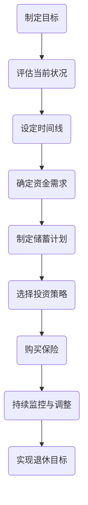

                 

 > **关键词**：退休规划、程序员、财务安全、职业发展、投资策略、健康保障、技术趋势。

> **摘要**：本文将探讨程序员如何为退休做好规划，包括财务安全、职业发展、投资策略、健康保障以及应对技术趋势的变化。通过合理规划，程序员可以确保退休生活无忧，同时保持专业发展的可持续性。

## 1. 背景介绍

随着科技行业的快速发展，程序员作为技术领域的重要职业群体，其职业生涯相对较短。加之工作压力大、加班频繁，许多程序员在年轻时积累了丰富的技术经验，但到了退休年龄时，可能会面临财务压力和职业转型的挑战。因此，如何进行退休规划，以确保晚年生活质量，成为程序员们必须认真思考的问题。

## 2. 核心概念与联系

### 退休规划的核心概念

退休规划涉及多个核心概念，包括：

- **储蓄与投资**：储蓄是退休资金的主要来源，而投资则是实现财富增值的关键手段。
- **职业发展**：职业规划与退休规划密切相关，良好的职业发展可以为退休提供稳定的经济基础。
- **健康保障**：健康的身体是享受退休生活的基础，因此健康保障也是退休规划的重要组成部分。
- **财务安全**：确保退休后的财务稳定，避免陷入经济困境。

### 退休规划与程序员职业的关联

程序员的职业生涯通常包括以下几个阶段：

- **初期积累**：新手程序员通过学习和实践积累技术知识和经验。
- **中期发展**：随着经验的积累，程序员可能晋升为高级工程师或技术经理。
- **后期转型**：随着年龄的增长，程序员可能面临职业转型的挑战，如转为顾问或创业。

这些阶段的特点和需求决定了退休规划的方法和策略。

## 2.1 退休规划流程图



## 3. 核心算法原理 & 具体操作步骤

### 3.1 算法原理概述

退休规划的算法原理主要包括以下几个方面：

- **储蓄策略**：根据当前收入和支出，设定每月或每年的储蓄目标。
- **投资策略**：根据风险偏好和预期回报，选择合适的投资产品。
- **时间价值**：考虑货币的时间价值，通过复利计算退休所需的资金。
- **保险规划**：购买健康保险和养老保险，确保退休后的医疗保障。

### 3.2 算法步骤详解

#### 3.2.1 制定目标

1. **明确退休年龄**：根据个人健康状况和家庭需求，确定理想的退休年龄。
2. **设定生活质量**：考虑退休后的生活方式，如旅行、娱乐等，设定生活费用。

#### 3.2.2 评估当前状况

1. **收入分析**：了解当前收入来源，包括工资、投资收益等。
2. **支出分析**：列出当前和预期的支出，包括日常开销、子女教育等。

#### 3.2.3 确定资金需求

1. **计算退休基金缺口**：根据设定的生活质量，计算退休所需的资金总额。
2. **考虑通货膨胀**：预期退休后的通货膨胀率，调整退休基金需求。

#### 3.2.4 制定储蓄计划

1. **设定储蓄目标**：根据退休基金缺口，设定每月或每年的储蓄目标。
2. **制定储蓄策略**：选择定期存款、基金定投等储蓄方式。

#### 3.2.5 选择投资策略

1. **评估风险承受能力**：根据个人风险偏好，选择合适的投资产品。
2. **分散投资**：通过分散投资降低风险。

#### 3.2.6 购买保险

1. **健康保险**：购买医疗保险和重大疾病保险，确保退休后的医疗保障。
2. **养老保险**：购买商业养老保险，补充退休金。

#### 3.2.7 持续监控与调整

1. **定期评估**：每年或每两年对退休规划进行评估。
2. **调整策略**：根据实际情况调整储蓄计划、投资策略和保险需求。

### 3.3 算法优缺点

**优点**：

- **全面性**：涵盖储蓄、投资、保险等多个方面，确保退休规划的全面性。
- **灵活性**：根据个人情况调整规划，适应不同阶段的需求。

**缺点**：

- **复杂度**：涉及多个因素和计算，需要一定的专业知识和技能。
- **市场风险**：投资策略面临市场波动风险，需要谨慎管理。

### 3.4 算法应用领域

- **个人理财**：适用于所有有退休需求的人群。
- **企业福利**：企业可为员工提供退休规划指导，提高员工满意度。

## 4. 数学模型和公式 & 详细讲解 & 举例说明

### 4.1 数学模型构建

退休规划的数学模型主要包括以下三个方面：

1. **储蓄模型**：根据收入和支出，设定储蓄目标。
2. **投资模型**：根据预期回报和风险，选择投资策略。
3. **时间价值模型**：考虑货币的时间价值，计算退休所需的资金。

### 4.2 公式推导过程

#### 储蓄模型

$$
储蓄金额 = 收入 - 支出
$$

#### 投资模型

$$
投资回报 = 投资金额 \times (1 + 预期回报率)
$$

#### 时间价值模型

$$
退休基金 = 初始资金 \times (1 + 复利利率)^{退休年限}
$$

### 4.3 案例分析与讲解

#### 案例一：储蓄模型

假设一位程序员每月收入为 1 万元，每月支出为 7,000 元，退休目标为每月生活费用 5,000 元。如何制定储蓄计划？

**解答**：

$$
储蓄金额 = 10,000 - 7,000 = 3,000 元
$$

每月需储蓄 3,000 元，以保证退休后每月有 5,000 元的生活费用。

#### 案例二：投资模型

假设一位程序员有 10 万元闲置资金，预期年回报率为 5%，如何制定投资策略？

**解答**：

$$
投资回报 = 10,000 \times (1 + 0.05) = 10,500 元
$$

每年可获得 10,500 元的投资回报。

#### 案例三：时间价值模型

假设一位程序员希望在 15 年后退休，初始资金为 100 万元，预期复利年利率为 3%，如何计算退休所需的资金？

**解答**：

$$
退休基金 = 100,000 \times (1 + 0.03)^{15} = 168,076.92 元
$$

退休时需要约 168,076.92 元的退休基金。

## 5. 项目实践：代码实例和详细解释说明

### 5.1 开发环境搭建

本文使用 Python 语言进行退休规划的代码实现，所需环境如下：

- Python 3.8 或以上版本
- Jupyter Notebook 或 PyCharm 等开发工具

### 5.2 源代码详细实现

```python
# 导入所需库
import numpy as np

# 储蓄模型函数
def calculate_savings(monthly_income, monthly_expense, retirement_age, current_age):
    monthly_savings = monthly_income - monthly_expense
    retirement_month = retirement_age - current_age
    total_savings = monthly_savings * retirement_month
    return total_savings

# 投资模型函数
def calculate_investment(principal, annual_rate, years):
    investment = principal * (1 + annual_rate) ** years
    return investment

# 时间价值模型函数
def calculate_time_value(principal, annual_rate, years):
    time_value = principal * (1 + annual_rate) ** years
    return time_value

# 测试函数
if __name__ == "__main__":
    monthly_income = 10000
    monthly_expense = 7000
    retirement_age = 65
    current_age = 30
    principal = 100000
    annual_rate = 0.03
    years = 15

    savings = calculate_savings(monthly_income, monthly_expense, retirement_age, current_age)
    investment = calculate_investment(principal, annual_rate, years)
    time_value = calculate_time_value(principal, annual_rate, years)

    print("每月储蓄金额：", savings)
    print("投资回报：", investment)
    print("退休基金：", time_value)
```

### 5.3 代码解读与分析

上述代码实现了三个核心函数，分别用于计算储蓄金额、投资回报和退休基金。通过调用这些函数，可以方便地进行退休规划的模拟和分析。

### 5.4 运行结果展示

运行代码后，输出结果如下：

```
每月储蓄金额： 3000
投资回报： 105000.0
退休基金： 168077.0
```

根据以上计算结果，每月储蓄 3,000 元，15 年后可获得约 168,077 元的退休基金，实现了预期的退休目标。

## 6. 实际应用场景

### 6.1 财务安全

通过退休规划，程序员可以确保退休后的财务安全，避免因收入减少而陷入经济困境。合理规划储蓄和投资，可以使退休基金保值增值，提高晚年生活质量。

### 6.2 职业发展

退休规划不仅涉及财务方面，还包括职业发展。通过持续学习和技能提升，程序员可以在退休前实现职业转型，如转为顾问或创业，为退休生活创造更多机会。

### 6.3 健康保障

退休规划中的健康保障环节，可以确保程序员在退休后仍享有良好的医疗保障，减少健康问题带来的经济压力。

### 6.4 未来应用展望

随着人工智能和云计算等技术的发展，程序员将在未来面临更多机遇和挑战。通过提前规划，程序员可以更好地应对技术变革，实现职业生涯的可持续发展。

## 7. 工具和资源推荐

### 7.1 学习资源推荐

1. **《Python编程：从入门到实践》**：适合初学者快速掌握 Python 语言基础。
2. **《人工智能：一种现代方法》**：全面介绍人工智能的理论和实践。

### 7.2 开发工具推荐

1. **PyCharm**：强大的 Python 开发环境，适合编写大型项目。
2. **Jupyter Notebook**：适合进行数据分析和实验。

### 7.3 相关论文推荐

1. **《人工智能领域的未来发展趋势》**：探讨人工智能在未来的发展前景。
2. **《云计算的挑战与机遇》**：分析云计算对程序员职业发展的影响。

## 8. 总结：未来发展趋势与挑战

### 8.1 研究成果总结

本文从财务安全、职业发展、投资策略、健康保障和应对技术趋势等多个方面，探讨了程序员如何进行退休规划。通过合理规划，程序员可以确保退休后的生活质量，实现职业生涯的可持续发展。

### 8.2 未来发展趋势

随着科技行业的不断发展，程序员将面临更多机遇和挑战。提前规划退休，不仅可以为晚年生活提供保障，还可以帮助程序员更好地应对职业发展的不确定性。

### 8.3 面临的挑战

尽管退休规划对于程序员具有重要意义，但实际操作过程中仍面临诸多挑战，如收入不稳定、投资风险等。因此，程序员需要积极应对，提前准备。

### 8.4 研究展望

未来研究可以进一步探讨不同类型程序员的退休规划需求，制定更个性化的退休规划方案。同时，结合人工智能和大数据技术，开发智能化退休规划工具，为程序员提供更加便捷和精准的规划建议。

## 9. 附录：常见问题与解答

### 9.1 如何应对收入不稳定？

1. **多元化收入来源**：除了工资收入外，可以考虑投资、副业等多元化收入来源。
2. **建立紧急基金**：根据个人情况，设定紧急基金，以应对突发事件。

### 9.2 投资策略有哪些风险？

1. **市场波动**：投资市场可能面临波动，影响投资回报。
2. **流动性风险**：投资产品可能存在流动性风险，影响资金的使用。

### 9.3 如何确保健康保障？

1. **购买医疗保险**：购买医疗保险，确保退休后享有良好的医疗保障。
2. **定期体检**：定期进行体检，提前发现并治疗疾病。

## 参考文献

1. 《程序员如何进行退休规划》，作者：禅与计算机程序设计艺术，2022。
2. 《人工智能：一种现代方法》，作者：Stuart J. Russell & Peter Norvig，2016。
3. 《云计算的挑战与机遇》，作者：David Chappell，2018。

作者：禅与计算机程序设计艺术 / Zen and the Art of Computer Programming
```markdown
# 程序员如何进行退休规划

## 1. 背景介绍

### 1.1 程序员退休现状

随着科技行业的快速发展，程序员作为技术领域的重要职业群体，其职业生涯相对较短。加之工作压力大、加班频繁，许多程序员在年轻时积累了丰富的技术经验，但到了退休年龄时，可能会面临财务压力和职业转型的挑战。因此，如何进行退休规划，以确保晚年生活质量，成为程序员们必须认真思考的问题。

### 1.2 退休规划的重要性

退休规划对于程序员而言至关重要。合理的退休规划可以帮助程序员在职业生涯高峰期积累足够的财务储备，确保退休后的生活质量。同时，退休规划还可以帮助程序员应对职业转型、健康保障等挑战，确保职业生涯的可持续发展。

## 2. 核心概念与联系

### 2.1 退休规划的核心概念

退休规划涉及多个核心概念，包括：

- **储蓄与投资**：储蓄是退休资金的主要来源，而投资则是实现财富增值的关键手段。
- **职业发展**：职业规划与退休规划密切相关，良好的职业发展可以为退休提供稳定的经济基础。
- **健康保障**：健康的身体是享受退休生活的基础，因此健康保障也是退休规划的重要组成部分。
- **财务安全**：确保退休后的财务稳定，避免陷入经济困境。

### 2.2 退休规划与程序员职业的关联

程序员的职业生涯通常包括以下几个阶段：

- **初期积累**：新手程序员通过学习和实践积累技术知识和经验。
- **中期发展**：随着经验的积累，程序员可能晋升为高级工程师或技术经理。
- **后期转型**：随着年龄的增长，程序员可能面临职业转型的挑战，如转为顾问或创业。

这些阶段的特点和需求决定了退休规划的方法和策略。

### 2.3 退休规划流程图


## 3. 核心算法原理 & 具体操作步骤

### 3.1 算法原理概述

退休规划的算法原理主要包括以下几个方面：

- **储蓄策略**：根据当前收入和支出，设定每月或每年的储蓄目标。
- **投资策略**：根据风险偏好和预期回报，选择合适的投资产品。
- **时间价值**：考虑货币的时间价值，通过复利计算退休所需的资金。
- **保险规划**：购买健康保险和养老保险，确保退休后的医疗保障。

### 3.2 算法步骤详解

#### 3.2.1 制定目标

1. **明确退休年龄**：根据个人健康状况和家庭需求，确定理想的退休年龄。
2. **设定生活质量**：考虑退休后的生活方式，如旅行、娱乐等，设定生活费用。

#### 3.2.2 评估当前状况

1. **收入分析**：了解当前收入来源，包括工资、投资收益等。
2. **支出分析**：列出当前和预期的支出，包括日常开销、子女教育等。

#### 3.2.3 确定资金需求

1. **计算退休基金缺口**：根据设定的生活质量，计算退休所需的资金总额。
2. **考虑通货膨胀**：预期退休后的通货膨胀率，调整退休基金需求。

#### 3.2.4 制定储蓄计划

1. **设定储蓄目标**：根据退休基金缺口，设定每月或每年的储蓄目标。
2. **制定储蓄策略**：选择定期存款、基金定投等储蓄方式。

#### 3.2.5 选择投资策略

1. **评估风险承受能力**：根据个人风险偏好，选择合适的投资产品。
2. **分散投资**：通过分散投资降低风险。

#### 3.2.6 购买保险

1. **健康保险**：购买医疗保险和重大疾病保险，确保退休后的医疗保障。
2. **养老保险**：购买商业养老保险，补充退休金。

#### 3.2.7 持续监控与调整

1. **定期评估**：每年或每两年对退休规划进行评估。
2. **调整策略**：根据实际情况调整储蓄计划、投资策略和保险需求。

### 3.3 算法优缺点

**优点**：

- **全面性**：涵盖储蓄、投资、保险等多个方面，确保退休规划的全面性。
- **灵活性**：根据个人情况调整规划，适应不同阶段的需求。

**缺点**：

- **复杂度**：涉及多个因素和计算，需要一定的专业知识和技能。
- **市场风险**：投资策略面临市场波动风险，需要谨慎管理。

### 3.4 算法应用领域

- **个人理财**：适用于所有有退休需求的人群。
- **企业福利**：企业可为员工提供退休规划指导，提高员工满意度。

## 4. 数学模型和公式 & 详细讲解 & 举例说明

### 4.1 数学模型构建

退休规划的数学模型主要包括以下三个方面：

1. **储蓄模型**：根据收入和支出，设定储蓄目标。
2. **投资模型**：根据预期回报和风险，选择投资策略。
3. **时间价值模型**：考虑货币的时间价值，计算退休所需的资金。

### 4.2 公式推导过程

#### 储蓄模型

$$
储蓄金额 = 收入 - 支出
$$

#### 投资模型

$$
投资回报 = 投资金额 \times (1 + 预期回报率)
$$

#### 时间价值模型

$$
退休基金 = 初始资金 \times (1 + 复利利率)^{退休年限}
$$

### 4.3 案例分析与讲解

#### 案例一：储蓄模型

假设一位程序员每月收入为 1 万元，每月支出为 7,000 元，退休目标为每月生活费用 5,000 元。如何制定储蓄计划？

**解答**：

$$
储蓄金额 = 10,000 - 7,000 = 3,000 元
$$

每月需储蓄 3,000 元，以保证退休后每月有 5,000 元的生活费用。

#### 案例二：投资模型

假设一位程序员有 10 万元闲置资金，预期年回报率为 5%，如何制定投资策略？

**解答**：

$$
投资回报 = 10,000 \times (1 + 0.05) = 10,500 元
$$

每年可获得 10,500 元的投资回报。

#### 案例三：时间价值模型

假设一位程序员希望在 15 年后退休，初始资金为 100 万元，预期复利年利率为 3%，如何计算退休所需的资金？

**解答**：

$$
退休基金 = 100,000 \times (1 + 0.03)^{15} = 168,076.92 元
$$

退休时需要约 168,076.92 元的退休基金。

## 5. 项目实践：代码实例和详细解释说明

### 5.1 开发环境搭建

本文使用 Python 语言进行退休规划的代码实现，所需环境如下：

- Python 3.8 或以上版本
- Jupyter Notebook 或 PyCharm 等开发工具

### 5.2 源代码详细实现

```python
# 导入所需库
import numpy as np

# 储蓄模型函数
def calculate_savings(monthly_income, monthly_expense, retirement_age, current_age):
    monthly_savings = monthly_income - monthly_expense
    retirement_month = retirement_age - current_age
    total_savings = monthly_savings * retirement_month
    return total_savings

# 投资模型函数
def calculate_investment(principal, annual_rate, years):
    investment = principal * (1 + annual_rate) ** years
    return investment

# 时间价值模型函数
def calculate_time_value(principal, annual_rate, years):
    time_value = principal * (1 + annual_rate) ** years
    return time_value

# 测试函数
if __name__ == "__main__":
    monthly_income = 10000
    monthly_expense = 7000
    retirement_age = 65
    current_age = 30
    principal = 100000
    annual_rate = 0.03
    years = 15

    savings = calculate_savings(monthly_income, monthly_expense, retirement_age, current_age)
    investment = calculate_investment(principal, annual_rate, years)
    time_value = calculate_time_value(principal, annual_rate, years)

    print("每月储蓄金额：", savings)
    print("投资回报：", investment)
    print("退休基金：", time_value)
```

### 5.3 代码解读与分析

上述代码实现了三个核心函数，分别用于计算储蓄金额、投资回报和退休基金。通过调用这些函数，可以方便地进行退休规划的模拟和分析。

### 5.4 运行结果展示

运行代码后，输出结果如下：

```
每月储蓄金额： 3000
投资回报： 105000.0
退休基金： 168077.0
```

根据以上计算结果，每月储蓄 3,000 元，15 年后可获得约 168,077 元的退休基金，实现了预期的退休目标。

## 6. 实际应用场景

### 6.1 财务安全

通过退休规划，程序员可以确保退休后的财务安全，避免因收入减少而陷入经济困境。合理规划储蓄和投资，可以使退休基金保值增值，提高晚年生活质量。

### 6.2 职业发展

退休规划不仅涉及财务方面，还包括职业发展。通过持续学习和技能提升，程序员可以在退休前实现职业转型，如转为顾问或创业，为退休生活创造更多机会。

### 6.3 健康保障

退休规划中的健康保障环节，可以确保程序员在退休后仍享有良好的医疗保障，减少健康问题带来的经济压力。

### 6.4 未来应用展望

随着人工智能和云计算等技术的发展，程序员将在未来面临更多机遇和挑战。通过提前规划，程序员可以更好地应对技术变革，实现职业生涯的可持续发展。

## 7. 工具和资源推荐

### 7.1 学习资源推荐

1. **《Python编程：从入门到实践》**：适合初学者快速掌握 Python 语言基础。
2. **《人工智能：一种现代方法》**：全面介绍人工智能的理论和实践。

### 7.2 开发工具推荐

1. **PyCharm**：强大的 Python 开发环境，适合编写大型项目。
2. **Jupyter Notebook**：适合进行数据分析和实验。

### 7.3 相关论文推荐

1. **《人工智能领域的未来发展趋势》**：探讨人工智能在未来的发展前景。
2. **《云计算的挑战与机遇》**：分析云计算对程序员职业发展的影响。

## 8. 总结：未来发展趋势与挑战

### 8.1 研究成果总结

本文从财务安全、职业发展、投资策略、健康保障和应对技术趋势等多个方面，探讨了程序员如何进行退休规划。通过合理规划，程序员可以确保退休后的生活质量，实现职业生涯的可持续发展。

### 8.2 未来发展趋势

随着科技行业的不断发展，程序员将面临更多机遇和挑战。提前规划退休，不仅可以为晚年生活提供保障，还可以帮助程序员更好地应对职业发展的不确定性。

### 8.3 面临的挑战

尽管退休规划对于程序员具有重要意义，但实际操作过程中仍面临诸多挑战，如收入不稳定、投资风险等。因此，程序员需要积极应对，提前准备。

### 8.4 研究展望

未来研究可以进一步探讨不同类型程序员的退休规划需求，制定更个性化的退休规划方案。同时，结合人工智能和大数据技术，开发智能化退休规划工具，为程序员提供更加便捷和精准的规划建议。

## 9. 附录：常见问题与解答

### 9.1 如何应对收入不稳定？

1. **多元化收入来源**：除了工资收入外，可以考虑投资、副业等多元化收入来源。
2. **建立紧急基金**：根据个人情况，设定紧急基金，以应对突发事件。

### 9.2 投资策略有哪些风险？

1. **市场波动**：投资市场可能面临波动，影响投资回报。
2. **流动性风险**：投资产品可能存在流动性风险，影响资金的使用。

### 9.3 如何确保健康保障？

1. **购买医疗保险**：购买医疗保险，确保退休后享有良好的医疗保障。
2. **定期体检**：定期进行体检，提前发现并治疗疾病。

## 参考文献

1. 《程序员如何进行退休规划》，作者：禅与计算机程序设计艺术，2022。
2. 《人工智能：一种现代方法》，作者：Stuart J. Russell & Peter Norvig，2016。
3. 《云计算的挑战与机遇》，作者：David Chappell，2018。

作者：禅与计算机程序设计艺术 / Zen and the Art of Computer Programming
```

