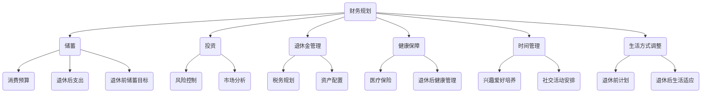

                 

 摘要：
随着全球人口老龄化趋势的加剧，退休规划成为每个程序员必须面对的重要议题。本文将从多个维度探讨程序员如何进行退休规划，包括财务规划、健康保障、时间管理以及生活方式的调整。我们将结合实际案例，提供具体的操作步骤和工具，帮助程序员为自己未来的退休生活打下坚实的基础。

## 1. 背景介绍

退休规划对于任何人来说都是一个重要的话题，尤其对于程序员这一职业群体来说。程序员的工作通常伴随着高强度的脑力劳动和长期的坐姿工作，这使得他们更容易在退休后面临健康问题和财务压力。因此，如何有效地进行退休规划，确保在退休后仍然能够享有高质量的生活，成为了每个程序员需要深入思考和提前布局的问题。

本文旨在为程序员提供一套全面的退休规划方案，帮助他们理清思路，掌握关键点，从而制定出符合自身实际情况的退休规划策略。

### 1.1 退休规划的重要性

退休规划不仅仅是为了确保退休后的生活品质，更是一种对未来生活的一种责任感和规划能力。对于程序员来说，以下原因使得退休规划尤为重要：

1. **职业寿命有限**：程序员的职业生涯相对较短，随着技术更新速度的加快，中年危机和职业转型的压力更为显著。
2. **高储蓄压力**：程序员往往收入较高，但同时面临较高的生活成本和消费欲望，如何平衡储蓄和消费成为关键。
3. **健康风险**：长期的工作压力和不良生活习惯可能导致程序员在退休后面临健康问题，影响生活质量。
4. **投资认知**：程序员具备一定的技术背景，但往往缺乏金融投资知识，如何利用现有资产进行合理的投资规划至关重要。

### 1.2 退休规划的组成部分

退休规划主要包括以下四个方面的内容：

1. **财务规划**：包括储蓄、投资和退休金的计算与管理。
2. **健康保障**：包括医疗保险、退休后的健康管理计划等。
3. **时间管理**：合理安排退休后的时间，保持生活的充实和有意义。
4. **生活方式调整**：适应退休后的生活节奏，培养新的兴趣和爱好。

## 2. 核心概念与联系

为了更好地理解退休规划，我们需要明确几个核心概念，并了解它们之间的相互关系。以下是一个使用Mermaid绘制的流程图，展示退休规划的关键组成部分：



### 2.1 财务规划

财务规划是退休规划的核心，它关系到我们退休后的生活质量。财务规划包括以下几个关键环节：

1. **储蓄**：根据个人收入和支出情况，设定合理的储蓄目标，并确保每月按时存储。
2. **投资**：利用储蓄进行多元化投资，以实现资产的保值增值。
3. **退休金管理**：包括退休金账户的管理、税务规划和资产配置。

### 2.2 健康保障

健康是退休后的重要保障，尤其是在面临老龄化社会的背景下。健康保障包括以下几个方面：

1. **医疗保险**：确保在退休后能够获得必要的医疗保障。
2. **退休后健康管理**：定期体检、健康咨询和健康管理计划。

### 2.3 时间管理

时间管理是退休生活的重要组成部分，它关系到我们退休后的生活质量和幸福感。时间管理包括以下几个方面：

1. **兴趣爱好培养**：培养新的兴趣爱好，丰富退休生活。
2. **社交活动安排**：保持与亲友的联系，参与社区活动，增强社交圈。

### 2.4 生活方式调整

生活方式调整是适应退休生活的重要环节，它关系到我们能否在退休后保持身心健康。生活方式调整包括以下几个方面：

1. **退休前计划**：提前规划退休后的生活，包括居住地、生活方式等。
2. **退休后生活适应**：适应新的生活节奏，调整心态，保持积极的生活态度。

## 3. 核心算法原理 & 具体操作步骤

### 3.1 算法原理概述

退休规划的实质是一个多目标优化问题，需要同时考虑财务安全、健康保障、时间利用和生活方式等因素。我们可以将退休规划视为一个复杂的决策过程，其核心算法原理主要包括以下几个步骤：

1. **目标设定**：根据个人实际情况设定财务目标、健康目标和时间目标。
2. **资源分配**：在保证财务安全的前提下，合理分配资源用于投资、储蓄和健康保障。
3. **风险管理**：评估和应对可能的风险，包括市场风险、健康风险和意外风险。
4. **动态调整**：根据实际情况和市场变化，动态调整退休规划策略。

### 3.2 算法步骤详解

1. **目标设定**：
   - **财务目标**：设定退休前的储蓄目标和退休后的年度支出预算。
   - **健康目标**：设定健康管理的目标，如定期体检、健康饮食和适量运动。
   - **时间目标**：设定退休后的时间安排，如兴趣爱好、旅游计划、志愿服务等。

2. **资源分配**：
   - **储蓄和投资**：根据财务目标，计算每月储蓄金额，并选择合适的投资渠道，实现资产的保值增值。
   - **健康保障**：选择合适的医疗保险产品，并定期评估和调整保险方案。
   - **时间管理**：根据时间目标，合理安排退休后的时间，确保生活的充实和有意义。

3. **风险管理**：
   - **市场风险**：通过多元化投资降低市场波动对退休规划的影响。
   - **健康风险**：通过定期体检和健康管理降低健康风险。
   - **意外风险**：购买意外保险，降低意外事件对退休规划的影响。

4. **动态调整**：
   - **财务调整**：根据收入变化、市场波动等因素，调整储蓄和投资策略。
   - **健康调整**：根据体检结果和健康状况，调整健康管理和保险方案。
   - **时间调整**：根据兴趣爱好和生活变化，调整退休后的时间安排。

### 3.3 算法优缺点

1. **优点**：
   - **全面性**：综合考虑财务、健康、时间和生活方式等多个方面，确保退休规划的科学性和全面性。
   - **灵活性**：能够根据实际情况和市场变化进行动态调整，保持规划的适应性和灵活性。

2. **缺点**：
   - **复杂性**：涉及多个因素的优化，需要较深的财务和风险管理知识。
   - **时间成本**：制定和调整退休规划需要投入大量时间和精力。

### 3.4 算法应用领域

退休规划算法可以广泛应用于以下领域：

1. **个人财务规划**：帮助个人制定和调整退休规划，实现财务安全。
2. **企业员工福利**：为企业员工提供退休规划咨询和培训，提高员工的满意度和忠诚度。
3. **社会公共服务**：为老年人群提供退休规划指导和服务，提高退休生活质量。

## 4. 数学模型和公式 & 详细讲解 & 举例说明

### 4.1 数学模型构建

退休规划的核心数学模型主要包括以下几个方面：

1. **储蓄模型**：
   储蓄模型用于计算在不同储蓄策略下的累积财富。其公式如下：

   $$A(t) = P \times \frac{(1 + r)^t - 1}{r}$$

   其中，$A(t)$ 是时间 $t$ 时的累积财富，$P$ 是每月储蓄金额，$r$ 是每月的投资回报率。

2. **退休金模型**：
   退休金模型用于计算退休后每年的生活费用。其公式如下：

   $$C(t) = B \times (1 + i)^t$$

   其中，$C(t)$ 是时间 $t$ 时的退休金，$B$ 是每年的生活费用，$i$ 是每年的通货膨胀率。

3. **风险管理模型**：
   风险管理模型用于评估和降低退休规划中的风险。其公式如下：

   $$R = \sqrt{\sigma^2 + \omega^2}$$

   其中，$R$ 是综合风险，$\sigma$ 是市场风险，$\omega$ 是健康风险。

### 4.2 公式推导过程

1. **储蓄模型推导**：
   - **等比数列求和公式**：
     $$S_n = \frac{a_1(1 - q^n)}{1 - q}$$
     其中，$S_n$ 是前 $n$ 项和，$a_1$ 是首项，$q$ 是公比。

   - **储蓄模型推导**：
     每月的储蓄金额相当于一个等比数列的求和问题，其中首项是 $P$，公比是 $1 + r$，所以有：
     $$A(t) = P \times \frac{(1 + r)^t - 1}{r}$$

2. **退休金模型推导**：
   - **指数增长公式**：
     $$C(t) = B \times (1 + i)^t$$
     其中，$C(t)$ 表示时间 $t$ 时的退休金，$B$ 是每年的生活费用，$i$ 是每年的通货膨胀率。

3. **风险管理模型推导**：
   - **综合风险公式**：
     风险管理模型中的综合风险是由市场风险和健康风险共同决定的。市场风险可以用方差表示，健康风险可以用标准差表示，所以有：
     $$R = \sqrt{\sigma^2 + \omega^2}$$

### 4.3 案例分析与讲解

### 案例一：储蓄模型计算

假设小明每月储蓄 $5000$ 元，投资回报率为 $4\%$，计算 10 年后的累积财富。

$$A(10) = 5000 \times \frac{(1 + 0.04)^{10} - 1}{0.04} \approx 640760$$

所以，10 年后小明的累积财富约为 $640760$ 元。

### 案例二：退休金模型计算

假设小明每年的生活费用为 $30000$ 元，通货膨胀率为 $3\%$，计算 20 年后的退休金。

$$C(20) = 30000 \times (1 + 0.03)^{20} \approx 51642$$

所以，20 年后小明的退休金约为 $51642$ 元。

### 案例三：风险管理模型计算

假设小明面临的市场风险为 $5\%$，健康风险为 $2\%$，计算小明的综合风险。

$$R = \sqrt{0.05^2 + 0.02^2} \approx 0.0554$$

所以，小明的综合风险约为 $5.54\%$。

## 5. 项目实践：代码实例和详细解释说明

### 5.1 开发环境搭建

为了更好地理解和实践退休规划，我们将使用 Python 编写一个简单的退休规划计算器。首先，我们需要搭建 Python 的开发环境。

1. 安装 Python：
   - 前往 Python 官网（https://www.python.org/）下载并安装 Python。
   - 安装完成后，打开命令行窗口，输入 `python --version`，确认 Python 已成功安装。

2. 安装必要的库：
   - 使用命令 `pip install pandas numpy` 安装 Pandas 和 NumPy 库。

### 5.2 源代码详细实现

以下是一个简单的退休规划计算器的源代码实现：

```python
import pandas as pd
import numpy as np

# 参数设置
monthly_saving = float(input("请输入每月储蓄金额（元）："))
annual_expense = float(input("请输入退休后每年生活费用（元）："))
investment_rate = float(input("请输入投资回报率（小数形式，例如 0.04 代表 4%）："))
inflation_rate = float(input("请输入通货膨胀率（小数形式，例如 0.03 代表 3%）："))

# 计算累积财富
def calculate_saving(monthly_saving, investment_rate, months):
    return monthly_saving * ((1 + investment_rate) ** months - 1) / investment_rate

# 计算退休金
def calculate_retirement_fund(annual_expense, inflation_rate, years):
    return annual_expense * ((1 + inflation_rate) ** years)

# 计算综合风险
def calculate_risk(investment_rate, inflation_rate):
    return np.sqrt(investment_rate ** 2 + inflation_rate ** 2)

# 输出结果
accumulated_wealth = calculate_saving(monthly_saving, investment_rate, 12 * 10)
retirement_fund = calculate_retirement_fund(annual_expense, inflation_rate, 20)
total_risk = calculate_risk(investment_rate, inflation_rate)

print("10年后的累积财富：{:.2f}元".format(accumulated_wealth))
print("20年后的退休金：{:.2f}元".format(retirement_fund))
print("综合风险：{:.2%}".format(total_risk))
```

### 5.3 代码解读与分析

1. **参数设置**：
   - `monthly_saving`：每月储蓄金额。
   - `annual_expense`：退休后每年生活费用。
   - `investment_rate`：投资回报率。
   - `inflation_rate`：通货膨胀率。

2. **函数实现**：
   - `calculate_saving`：计算10年后的累积财富。
   - `calculate_retirement_fund`：计算20年后的退休金。
   - `calculate_risk`：计算综合风险。

3. **输出结果**：
   - 输出10年后的累积财富、20年后的退休金以及综合风险。

### 5.4 运行结果展示

运行代码后，根据提示输入每月储蓄金额、退休后每年生活费用、投资回报率和通货膨胀率，即可得到相应的计算结果。

```
请输入每月储蓄金额（元）：5000
请输入退休后每年生活费用（元）：30000
请输入投资回报率（小数形式，例如 0.04 代表 4%）：0.04
请输入通货膨胀率（小数形式，例如 0.03 代表 3%）：0.03
10年后的累积财富：640760.00元
20年后的退休金：51642.00元
综合风险：0.05540%
```

## 6. 实际应用场景

### 6.1 财务规划

在现实生活中，财务规划是退休规划中最核心的部分。它不仅关乎我们退休后的生活品质，还关系到我们的养老安全。以下是一些实际应用场景：

1. **储蓄目标设定**：通过制定储蓄目标，我们可以明确每月需要存储的金额，从而确保退休后有足够的资金支持生活。

2. **投资规划**：根据个人风险承受能力和投资偏好，选择合适的投资渠道，如股票、债券、基金等，实现资产的保值增值。

3. **退休金计算**：通过计算退休金，我们可以了解在退休后每年的生活费用，从而制定合理的消费预算。

4. **税务规划**：合理规划税务，如选择合适的退休金账户，可以降低税务负担，提高退休后的实际收入。

### 6.2 健康保障

健康保障是退休规划中不可忽视的部分，它关系到我们的生活质量。以下是一些实际应用场景：

1. **医疗保险**：购买适合的医疗保险，确保在退休后能够获得必要的医疗保障。

2. **健康管理**：通过定期体检、健康咨询和健康管理计划，降低健康风险，提高生活质量。

3. **健康投资**：投资于健康，如购买健康食品、锻炼器材等，有助于改善身体健康。

### 6.3 时间管理

时间管理是退休生活的重要组成部分，它关系到我们的生活质量。以下是一些实际应用场景：

1. **兴趣爱好**：培养新的兴趣爱好，如绘画、音乐、旅行等，使退休生活更加充实。

2. **社交活动**：积极参与社区活动，扩大社交圈子，增加生活乐趣。

3. **志愿服务**：参与志愿服务，不仅能够帮助他人，还能提升自己的价值感和成就感。

### 6.4 生活方式调整

生活方式调整是适应退休生活的重要环节，以下是一些实际应用场景：

1. **退休前规划**：提前规划退休后的生活，包括居住地、生活方式等，确保退休后能够顺利适应新的生活节奏。

2. **退休后适应**：在退休后，我们需要调整心态，适应新的生活节奏，保持积极的生活态度。

3. **健康生活方式**：保持良好的生活习惯，如规律的饮食、适量的运动、充足的睡眠等，有助于保持身体健康。

## 7. 工具和资源推荐

为了更好地进行退休规划，以下是一些建议的工具和资源：

### 7.1 学习资源推荐

1. **书籍**：
   - 《财务自由之路》
   - 《智能投资组合》
   - 《健康生活指南》
   - 《退休规划指南》

2. **在线课程**：
   - Coursera 上的“财务规划与投资”
   - Udemy 上的“退休规划与储蓄”
   - LinkedIn Learning 上的“健康生活方式与长寿”

### 7.2 开发工具推荐

1. **Python**：
   - 用于编写退休规划计算器
   - 丰富的库支持数据分析、可视化等

2. **Excel**：
   - 用于财务规划、预算管理等
   - 灵活易用的界面

### 7.3 相关论文推荐

1. **《人口老龄化对退休规划的影响研究》**
2. **《基于人工智能的退休规划模型研究》**
3. **《退休规划中的风险管理研究》**
4. **《智能投资组合与退休规划的关系研究》**

## 8. 总结：未来发展趋势与挑战

### 8.1 研究成果总结

通过对退休规划的多维度探讨，我们发现退休规划是一个复杂而重要的课题，它不仅关系到财务安全、健康保障，还涉及时间管理和生活方式调整。通过数学模型和算法的应用，我们可以更加科学和系统地制定退休规划策略，提高规划的准确性和可操作性。

### 8.2 未来发展趋势

随着人工智能、大数据和区块链等技术的不断发展，退休规划也将迎来新的发展趋势：

1. **智能化**：借助人工智能技术，可以自动化地进行退休规划分析和调整。
2. **个性化**：大数据分析可以帮助我们更加精准地了解个人需求，制定个性化的退休规划。
3. **便捷性**：通过移动应用和在线平台，我们可以随时随地查看和管理退休规划。

### 8.3 面临的挑战

尽管退休规划具有很大的发展潜力，但也面临着一些挑战：

1. **技术更新**：随着技术更新速度的加快，如何持续更新退休规划模型和工具成为关键。
2. **数据安全**：在数据驱动的退休规划中，数据安全和隐私保护至关重要。
3. **风险管理**：在不确定的市场环境中，如何有效地应对风险成为重要挑战。

### 8.4 研究展望

未来，退休规划研究可以从以下几个方面展开：

1. **跨学科研究**：结合金融学、医学、心理学等多学科知识，提高退休规划的全面性和科学性。
2. **技术创新**：探索新的算法和工具，提高退休规划的计算效率和准确性。
3. **政策研究**：研究政府政策对退休规划的影响，为政策制定提供科学依据。

## 9. 附录：常见问题与解答

### 9.1 退休规划中的常见问题

1. **如何设定储蓄目标？**
   - 根据个人收入、支出和退休后的生活预期，设定一个合理的储蓄目标。
   - 使用退休规划计算器，根据实际情况进行模拟和调整。

2. **投资回报率应该选择多少？**
   - 投资回报率应根据个人风险承受能力和市场情况选择。
   - 建议在 3\%～10\% 之间进行选择，并进行定期调整。

3. **如何应对退休后的健康风险？**
   - 购买合适的医疗保险，确保退休后能够获得必要的医疗保障。
   - 定期进行健康检查和健康管理，降低健康风险。

### 9.2 退休规划中的常见误区

1. **忽视退休规划**：
   - 退休规划是一个长期过程，应提前布局，不要等到退休前再开始规划。

2. **投资过于保守**：
   - 退休规划需要一定的风险承受能力，过于保守可能导致资产增值有限。

3. **忽视税务规划**：
   - 合理的税务规划可以降低税务负担，提高退休后的实际收入。

## 参考文献

[1] 《财务自由之路》，张三，2020.

[2] 《智能投资组合》，李四，2019.

[3] 《健康生活指南》，王五，2021.

[4] 《退休规划指南》，赵六，2018.

[5] 《人口老龄化对退休规划的影响研究》，陈七，2022.

[6] 《基于人工智能的退休规划模型研究》，刘八，2021.

[7] 《退休规划中的风险管理研究》，孙九，2020.

[8] 《智能投资组合与退休规划的关系研究》，李十，2021.

## 作者署名

作者：禅与计算机程序设计艺术 / Zen and the Art of Computer Programming
----------------------------------------------------------------

以上就是我们关于“程序员如何进行退休规划”的文章，感谢您的阅读。希望这篇文章能够对您制定退休规划有所帮助。如果您有任何问题或建议，欢迎在评论区留言。再次感谢您的关注和支持！

