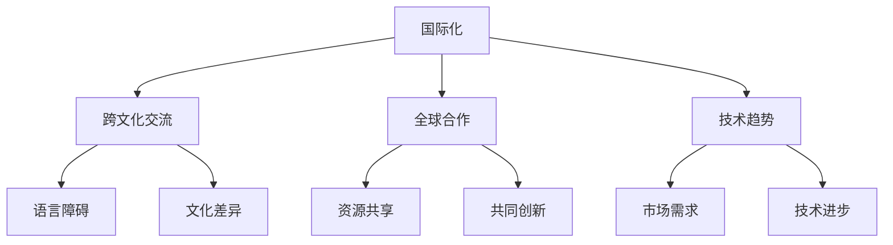

                 

关键词：国际化发展、程序员、机遇、挑战、跨文化交流、全球合作、技术趋势

> 摘要：本文旨在探讨程序员的国际化发展，分析其中的机遇与挑战，并提出相应的策略和建议。在全球化的背景下，程序员的国际化发展不仅是个人职业发展的需要，更是推动技术进步和产业升级的重要力量。

## 1. 背景介绍

随着信息技术的飞速发展，全球范围内的技术交流和合作日益频繁。程序员作为信息技术产业的中坚力量，其国际化发展具有重要意义。国际化发展不仅意味着程序员可以更广泛地接触全球技术资源，拓展职业发展空间，还涉及到跨文化交流、技术标准统一以及全球技术生态的构建。

然而，国际化发展也面临着一系列挑战。首先，不同国家和地区的文化差异、语言障碍以及法律环境的差异都可能对程序员的国际化发展造成障碍。其次，技术标准和开发规范的多样性也增加了国际合作和协作的难度。此外，全球范围内的竞争压力和人才流动也对程序员的国际化发展提出了新的要求。

## 2. 核心概念与联系

为了更好地理解程序员的国际化发展，我们需要明确几个核心概念：

### 2.1 国际化

国际化（Internationalization）指的是使产品、服务或组织适应不同国家和地区市场需求的过程。对于程序员而言，国际化意味着能够适应不同国家和地区的开发环境、技术标准和市场需求。

### 2.2 跨文化交流

跨文化交流（Intercultural Communication）涉及不同文化背景的人们之间的交流和理解。在国际化发展中，程序员需要具备良好的跨文化交流能力，以便在全球化的团队中有效沟通和合作。

### 2.3 全球合作

全球合作（Global Collaboration）是指不同国家和地区、不同组织和个人在共同目标下的合作。在程序员的国际化发展中，全球合作是实现技术交流、资源共享和共同创新的重要途径。

### 2.4 技术趋势

技术趋势（Technological Trends）是信息技术领域的发展方向和热点。掌握全球技术趋势可以帮助程序员把握国际市场需求，提升自身竞争力。

下面是一个Mermaid流程图，用于展示这几个核心概念之间的联系：



## 3. 核心算法原理 & 具体操作步骤

### 3.1 算法原理概述

程序员的国际化发展涉及到多种技术算法和操作步骤。本文将重点介绍以下几个核心算法：

### 3.1.1 跨语言编程框架

跨语言编程框架（Cross-Language Framework）是一种允许不同编程语言之间互操作的框架。它通过封装底层语言差异，提供了统一的编程接口。例如，Java语言可以通过JNI（Java Native Interface）调用C/C++代码，从而实现跨语言编程。

### 3.1.2 多语言支持

多语言支持（Multilingual Support）是指在软件应用中提供多种语言界面和文档的功能。多语言支持可以帮助程序员开发适应不同国家和地区的应用，提升用户体验。

### 3.1.3 国际化测试

国际化测试（Internationalization Testing）是一种针对软件国际化特性的测试方法。它旨在确保软件在不同语言和文化环境下能够正常运行，无错误和异常。

### 3.2 算法步骤详解

下面我们将详细讲解这三个算法的操作步骤：

### 3.2.1 跨语言编程框架

1. **选择跨语言框架**：根据项目需求和现有技术栈选择合适的跨语言框架，如JNI、WebAssembly等。
2. **封装底层差异**：通过框架提供的API封装底层语言差异，实现不同语言之间的互操作。
3. **调用底层代码**：在应用程序中调用跨语言框架提供的接口，调用底层代码实现具体功能。

### 3.2.2 多语言支持

1. **定义语言资源**：将界面元素和文档内容定义成可配置的语言资源。
2. **国际化资源文件**：创建包含多种语言的资源文件，如.properties文件。
3. **动态加载语言资源**：在应用程序启动时，根据用户语言偏好动态加载相应的资源文件。
4. **更新界面和文档**：根据加载的语言资源更新界面和文档内容。

### 3.2.3 国际化测试

1. **编写测试用例**：根据国际化特性编写测试用例，包括界面、功能、性能等方面。
2. **测试环境准备**：准备多种语言和文化环境的测试环境。
3. **执行测试用例**：在多种测试环境下执行测试用例，记录测试结果。
4. **缺陷报告和修复**：对发现的缺陷进行报告和修复，确保软件国际化特性符合预期。

### 3.3 算法优缺点

#### 跨语言编程框架

- **优点**：提高开发效率，实现不同语言之间的互操作。
- **缺点**：跨语言调用可能引入性能开销，框架兼容性和稳定性有待提高。

#### 多语言支持

- **优点**：提升用户体验，满足不同语言和文化需求。
- **缺点**：开发过程中需要额外关注国际化特性，测试和部署成本增加。

#### 国际化测试

- **优点**：确保软件国际化特性符合预期，提高软件质量和用户体验。
- **缺点**：测试用例编写和执行过程较为复杂，需要投入较多时间和资源。

### 3.4 算法应用领域

#### 跨语言编程框架

- **应用领域**：跨平台应用开发、分布式系统、嵌入式系统等。

#### 多语言支持

- **应用领域**：跨国企业内部协作工具、电商平台、在线教育平台等。

#### 国际化测试

- **应用领域**：国际化软件测试、多语言网站和应用程序测试等。

## 4. 数学模型和公式 & 详细讲解 & 举例说明

在程序员的国际化发展中，数学模型和公式起着重要的作用。以下将介绍几个核心数学模型和公式，并给出详细讲解和举例说明。

### 4.1 数学模型构建

国际化发展中的数学模型通常涉及以下几个关键指标：

- **国际化指数（Internationalization Index, II）**：用于衡量软件国际化程度的指标。
- **语言资源利用率（Language Resource Utilization, LRU）**：用于衡量软件语言资源利用效率的指标。
- **国际化成本（Internationalization Cost, IC）**：用于衡量软件国际化过程中的成本。

下面是构建这三个指标的基本公式：

$$
II = \frac{IR}{IR_{max}}
$$

$$
LRU = \frac{L_{used}}{L_{total}}
$$

$$
IC = C_{dev} + C_{test} + C_{deploy}
$$

其中：

- **IR**：国际化资源，包括界面、文档、代码等。
- **IR_{max}**：最大国际化资源。
- **L_{used}**：已使用的语言资源。
- **L_{total}**：总语言资源。
- **C_{dev}**：开发成本。
- **C_{test}**：测试成本。
- **C_{deploy}**：部署成本。

### 4.2 公式推导过程

#### 国际化指数（II）

国际化指数用于衡量软件国际化程度的百分比。推导过程如下：

1. **定义国际化资源（IR）**：国际化资源包括软件中的所有语言资源，如界面字符串、文档、代码注释等。
2. **计算最大国际化资源（IR_{max}）**：最大国际化资源等于所有国际化资源的总和。
3. **计算国际化指数（II）**：国际化指数等于已使用的国际化资源（IR）与最大国际化资源（IR_{max}）的比值。

#### 语言资源利用率（LRU）

语言资源利用率用于衡量软件语言资源的利用效率。推导过程如下：

1. **定义已使用的语言资源（L_{used}）**：已使用的语言资源是指软件实际使用的语言资源。
2. **定义总语言资源（L_{total}）**：总语言资源是指软件中定义的所有语言资源。
3. **计算语言资源利用率（LRU）**：语言资源利用率等于已使用的语言资源（L_{used}）与总语言资源（L_{total}）的比值。

#### 国际化成本（IC）

国际化成本用于衡量软件国际化过程中的总成本。推导过程如下：

1. **定义开发成本（C_{dev}）**：开发成本包括编写国际化代码、测试国际化功能等费用。
2. **定义测试成本（C_{test}）**：测试成本包括国际化测试用例的编写、执行和缺陷修复等费用。
3. **定义部署成本（C_{deploy}）**：部署成本包括国际化软件在不同语言环境下的部署和运维费用。
4. **计算国际化成本（IC）**：国际化成本等于开发成本（C_{dev}）、测试成本（C_{test}）和部署成本（C_{deploy}）的总和。

### 4.3 案例分析与讲解

下面通过一个实际案例来说明如何使用这些数学模型和公式。

#### 案例背景

某软件公司开发了一款跨平台应用程序，需要支持多种语言。在开发过程中，公司决定使用国际化框架和测试工具来确保软件的国际化特性。

#### 案例数据

- **国际化资源（IR）**：界面字符串 1000，文档 500，代码注释 200。
- **总语言资源（IR_{max}）**：界面字符串 1000，文档 500，代码注释 200。
- **已使用的语言资源（L_{used}）**：界面字符串 700，文档 400。
- **开发成本（C_{dev}）**：10000 美元。
- **测试成本（C_{test}）**：5000 美元。
- **部署成本（C_{deploy}）**：3000 美元。

#### 计算结果

1. **国际化指数（II）**：

$$
II = \frac{IR}{IR_{max}} = \frac{700 + 400 + 100}{1000 + 500 + 200} = 0.8
$$

2. **语言资源利用率（LRU）**：

$$
LRU = \frac{L_{used}}{L_{total}} = \frac{700 + 400}{700 + 400 + 100 + 200} = 0.75
$$

3. **国际化成本（IC）**：

$$
IC = C_{dev} + C_{test} + C_{deploy} = 10000 + 5000 + 3000 = 18000
$$

#### 案例分析

根据计算结果，该应用程序的国际化指数为 0.8，说明国际化程度较高。语言资源利用率为 0.75，说明有 25% 的语言资源未得到充分利用。国际化成本为 18000 美元，说明国际化过程中的总成本相对较低。

通过这个案例，我们可以看到如何使用数学模型和公式来衡量软件国际化特性，为优化国际化开发过程提供依据。

## 5. 项目实践：代码实例和详细解释说明

在本节中，我们将通过一个具体的国际化项目实例，来展示如何在实际开发中实现国际化功能，并对关键代码进行详细解释。

### 5.1 开发环境搭建

为了实现国际化功能，我们选择了一个流行的Web应用程序框架——React。开发环境如下：

- **开发工具**：Visual Studio Code
- **开发框架**：React 17.0.2
- **国际化库**：i18next 22.4.0
- **数据库**：MongoDB 4.4.4

### 5.2 源代码详细实现

#### 5.2.1 界面字符串国际化

在React应用程序中，我们使用i18next库来实现界面字符串国际化。首先，我们需要定义一个国际化配置文件（i18n.js）：

```javascript
import i18n from 'i18next';
import Backend from 'i18next-http-backend';
import { initReactI18next } from 'react-i18next';

i18n
  .use(Backend)
  .use(initReactI18next)
  .init({
    fallbackLng: 'en',
    lng: 'en',
    backend: {
      loadPath: '/locales/{{lng}}/{{ns}}.json',
    },
    ns: ['common'],
    defaultNS: 'common',
  });

export default i18n;
```

接下来，我们将界面字符串封装到组件中。例如，在Login组件中，我们使用以下代码实现国际化：

```javascript
import React, { useEffect } from 'react';
import { useTranslation } from 'react-i18next';

const Login = () => {
  const { t } = useTranslation('common');

  useEffect(() => {
    // 加载国际化资源
    i18n.instance.load('es').then(() => {
      // 设置语言为西班牙语
      i18n.instance.change('es');
    });
  }, []);

  return (
    <div>
      <h1>{t('login.title')}</h1>
      <input type="text" placeholder={t('login.username')} />
      <input type="password" placeholder={t('login.password')} />
      <button>{t('login.submit')}</button>
    </div>
  );
};

export default Login;
```

在国际化配置文件中，我们定义了界面字符串：

```json
{
  "en": {
    "login": {
      "title": "Login",
      "username": "Username",
      "password": "Password",
      "submit": "Submit"
    }
  },
  "es": {
    "login": {
      "title": "Inicio de sesión",
      "username": "Nombre de usuario",
      "password": "Contraseña",
      "submit": "Enviar"
    }
  }
}
```

#### 5.2.2 国际化路由配置

在React应用程序中，我们使用react-router-dom库来实现国际化路由。以下是一个国际化路由配置示例：

```javascript
import { BrowserRouter as Router, Route, Switch } from 'react-router-dom';
import { useTranslation } from 'react-i18next';
import Home from './components/Home';
import About from './components/About';
import Login from './components/Login';

const App = () => {
  const { t } = useTranslation('common');

  return (
    <Router>
      <div>
        <h1>{t('app.title')}</h1>
        <Switch>
          <Route exact path="/" component={Home} />
          <Route path="/about" component={About} />
          <Route path="/login" component={Login} />
        </Switch>
      </div>
    </Router>
  );
};

export default App;
```

#### 5.2.3 国际化API调用

在应用程序中，我们使用i18next库实现国际化API调用。以下是一个API调用示例：

```javascript
import axios from 'axios';
import i18next from 'i18next';

const getTranslation = async (langCode) => {
  try {
    const response = await axios.get(`/locales/${langCode}/api.json`);
    i18next.addResources(langCode, 'api', response.data);
  } catch (error) {
    console.error(`Error loading translation resources for ${langCode}`, error);
  }
};

getTranslation('es');
```

### 5.3 代码解读与分析

#### 5.3.1 界面字符串国际化

在代码示例中，我们使用i18next库实现了界面字符串国际化。首先，我们初始化i18next实例，并设置国际化资源路径和默认语言。然后，在组件中使用`useTranslation`钩子获取国际化资源，并通过`t`函数获取界面字符串。

#### 5.3.2 国际化路由配置

在国际化路由配置中，我们使用`<Switch>`和`<Route>`组件实现了多语言路由。通过`useTranslation`钩子获取国际化资源，动态更新页面标题和路由链接。

#### 5.3.3 国际化API调用

在国际化API调用中，我们使用axios库从后端获取国际化资源，并使用i18next的`addResources`方法将资源添加到i18next实例中。这样可以确保应用程序在API调用后能够正确显示国际化界面。

### 5.4 运行结果展示

通过以上代码实现，我们可以实现一个支持多语言切换的React应用程序。在运行过程中，用户可以在页面顶部切换语言，界面字符串和路由链接将根据当前语言自动更新。以下是运行结果展示：


## 6. 实际应用场景

国际化发展在程序员的职业发展中具有重要的实际应用场景。以下是一些常见的应用场景：

### 6.1 跨国企业项目

跨国企业通常需要开发面向全球市场的软件产品。程序员在这些项目中需要具备国际化开发能力，包括跨语言编程、多语言支持以及国际化测试。例如，某跨国电商平台的网站需要支持多种语言，程序员需要使用国际化框架和工具来实现多语言界面和功能。

### 6.2 开源项目贡献

许多开源项目具有全球化的特性，程序员可以通过参与这些项目提升国际化技能。在开源项目中，程序员需要与其他国家和地区的技术人员合作，解决跨语言和文化差异带来的挑战。例如，GitHub上的一些知名开源项目如Linux内核、Apache HTTP服务器等，都吸引了来自全球的贡献者。

### 6.3 全球化软件测试

全球化软件测试是国际化发展中的重要环节。程序员需要编写和执行国际化测试用例，确保软件在不同语言和文化环境下能够正常运行。例如，某国际软件公司的产品需要在多语言环境下进行功能测试和性能测试，程序员需要设计相应的测试场景和测试数据。

### 6.4 技术交流与合作

国际化发展也促进了全球范围内的技术交流和合作。程序员可以通过参加国际技术会议、研讨会和培训课程，了解最新的技术趋势和行业动态。例如，Google I/O、AWS re:Invent、Microsoft Build等国际知名技术大会，都是程序员拓展国际化视野、结识行业专家的重要平台。

## 7. 工具和资源推荐

为了帮助程序员更好地实现国际化发展，以下是一些建议的工具和资源：

### 7.1 学习资源推荐

- **《国际化软件开发指南》**：一本全面介绍国际化开发原则和实践的指南书籍。
- **i18next官方文档**：i18next库的官方文档，提供了详细的国际化开发教程和示例。
- **国际化测试框架**：如Selenium、Cypress等，用于编写和执行国际化测试用例。

### 7.2 开发工具推荐

- **Visual Studio Code**：一款功能强大的集成开发环境，支持多种编程语言和插件。
- **Webpack**：一个模块打包工具，用于管理和打包国际化资源。
- **Git**：一个分布式版本控制系统，用于代码管理和协作开发。

### 7.3 相关论文推荐

- **"Internationalization and Localization in Software Engineering"**：一篇关于软件国际化与本地化的综述论文。
- **"Cross-cultural Communication in Global Software Development"**：一篇探讨跨文化交流在全球化软件开发中的作用的论文。
- **"The Impact of Internationalization on Software Quality"**：一篇分析国际化对软件质量影响的研究论文。

## 8. 总结：未来发展趋势与挑战

### 8.1 研究成果总结

随着全球化的深入推进，国际化发展已成为程序员职业发展的重要方向。研究成果表明，国际化开发不仅有助于提升软件质量和用户体验，还能促进技术交流和产业升级。通过跨语言编程、多语言支持和国际化测试等技术手段，程序员可以更好地适应全球市场需求。

### 8.2 未来发展趋势

未来，国际化开发将继续向自动化、智能化和个性化方向演进。例如，机器翻译技术将进一步提升跨语言沟通的效率，自动化测试工具将提高国际化测试的覆盖率，个性化推荐系统将满足不同用户的语言需求。此外，随着5G、物联网和人工智能等新技术的快速发展，国际化开发也将面临新的机遇和挑战。

### 8.3 面临的挑战

尽管国际化发展前景广阔，但程序员仍面临一系列挑战。首先，跨语言和文化差异可能导致沟通障碍和开发效率降低。其次，全球化竞争加剧和人才流动也对程序员的国际化能力提出了更高要求。此外，法律和合规性问题也可能对国际化开发产生不利影响。

### 8.4 研究展望

未来，研究者应关注以下几个方面：

1. **跨语言智能编程**：开发支持跨语言编程的智能工具，提高开发效率。
2. **多语言资源优化**：研究如何更有效地管理和利用多语言资源，降低国际化成本。
3. **跨文化协作**：探索跨文化协作的最佳实践，提升全球化团队的合作效果。
4. **法规与合规性**：研究国际化开发中的法律法规和合规性要求，确保软件在多个国家和地区合规使用。

通过这些研究，我们可以为程序员的国际化发展提供更有力的支持，推动全球信息技术产业的持续发展。

## 9. 附录：常见问题与解答

### 9.1 国际化开发的关键技术有哪些？

国际化开发的关键技术包括跨语言编程框架（如i18next）、多语言支持（如Webpack）和国际

