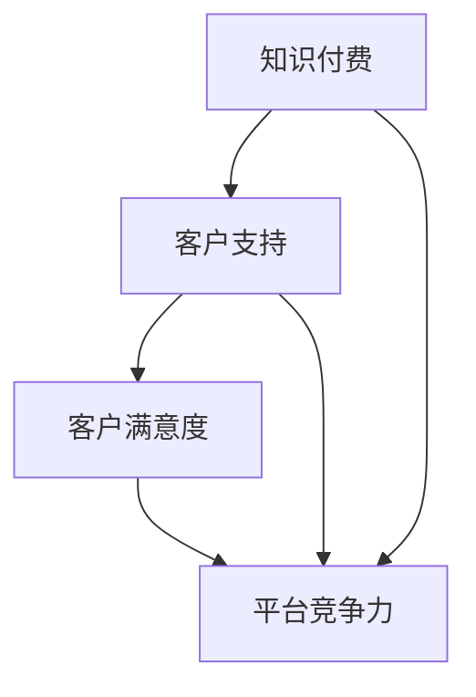

                 

在这个知识爆炸的时代，程序员的知识付费市场日益繁荣。然而，如何构建一个高效、专业的客户支持体系，以确保知识付费产品的高质量交付和客户满意度，成为众多知识付费平台和创作者亟待解决的问题。本文将深入探讨这一问题，从背景介绍、核心概念、核心算法原理、数学模型、项目实践、实际应用场景、工具和资源推荐，到总结与展望，全面阐述构建程序员知识付费客户支持体系的各个方面。

## 1. 背景介绍

知识付费作为一种新兴的商业模式，在互联网高速发展的今天，逐渐成为程序员群体获取额外收入的重要途径。随着在线教育、专业培训等知识付费平台的大量涌现，程序员创作者们可以通过线上课程、电子书、教程视频等多种形式，将自身的专业技能和经验转化为实际收益。然而，知识付费市场的繁荣背后，也伴随着一系列挑战，其中最为突出的是如何构建一个有效的客户支持体系，以满足广大程序员的个性化需求。

构建一个高效的客户支持体系，不仅有助于提高知识付费产品的用户体验，提升客户满意度，还能够增强平台的竞争力，吸引更多优质创作者入驻。因此，本文将从多个角度探讨程序员知识付费客户支持体系的构建策略，为相关从业者提供有价值的参考。

## 2. 核心概念与联系

在构建程序员知识付费客户支持体系之前，我们需要明确几个核心概念：

- **知识付费**：指用户为获取特定领域的知识或技能，通过支付费用来购买相关产品或服务。
- **客户支持**：指为客户提供帮助、解答疑问、解决问题等一系列服务活动，以保障客户在使用知识付费产品过程中的良好体验。
- **客户满意度**：指客户对产品或服务的满意程度，通常通过调查问卷、用户反馈等方式进行评估。

这些核心概念之间存在紧密的联系。知识付费是客户支持体系的基础，客户支持则是保障知识付费产品高质量交付的关键，而客户满意度则是衡量知识付费客户支持体系效果的重要指标。

### 2.1. 知识付费与客户支持

知识付费与客户支持之间存在相互促进的关系。知识付费为用户提供有价值的内容，而客户支持则确保用户在使用过程中能够获得及时、有效的帮助。如果客户支持体系不完善，用户在遇到问题时可能会感到无助，从而影响对知识付费产品的满意度。相反，一个高效的客户支持体系可以增强用户的信任感，提高客户满意度，进而促进知识付费业务的持续发展。

### 2.2. 客户支持与客户满意度

客户支持直接关系到客户满意度。在知识付费领域，客户支持不仅仅包括解答疑问和解决问题，还包括提供学习指导、个性化服务、互动交流等多种形式。通过优质的客户支持，平台和创作者可以与用户建立良好的关系，增强用户对产品的好感度和忠诚度，从而提高客户满意度。

### 2.3. 客户满意度与平台竞争力

客户满意度是衡量平台竞争力的关键因素。在一个竞争激烈的知识付费市场中，优质的内容和出色的客户支持是平台脱颖而出的关键。高客户满意度不仅能够吸引更多用户，提高用户留存率，还能够增强平台的口碑，吸引更多优质创作者入驻，形成良性循环。

### 2.4. Mermaid 流程图

为了更好地阐述程序员知识付费客户支持体系的核心概念与联系，我们可以使用 Mermaid 流程图进行说明。



该流程图展示了知识付费、客户支持、客户满意度与平台竞争力之间的相互关系，有助于我们理解这些核心概念在程序员知识付费客户支持体系中的重要性。

## 3. 核心算法原理 & 具体操作步骤

在构建程序员知识付费客户支持体系时，我们需要运用一些核心算法原理，以确保体系的高效运行。以下将介绍这些核心算法原理的具体操作步骤。

### 3.1. 算法原理概述

程序员知识付费客户支持体系的核心算法主要包括以下三个方面：

1. **客户需求分析算法**：通过对客户需求的收集、分析和处理，为客户提供个性化的支持。
2. **问题解决算法**：针对客户提出的问题，快速定位问题根源，并提供有效的解决方案。
3. **客户满意度评估算法**：对客户支持的整个过程进行评估，以衡量客户满意度，为优化支持体系提供依据。

### 3.2. 算法步骤详解

#### 3.2.1. 客户需求分析算法

1. **需求收集**：通过问卷调查、用户反馈、在线聊天等多种渠道收集客户需求。
2. **需求分析**：对收集到的需求进行分类、整理和分析，挖掘客户关注的重点问题。
3. **需求处理**：根据分析结果，制定相应的支持策略，确保客户需求得到有效满足。

#### 3.2.2. 问题解决算法

1. **问题识别**：通过关键词匹配、自然语言处理等技术，快速识别客户提出的问题。
2. **问题定位**：根据问题识别结果，分析问题的可能原因，并定位问题发生的具体位置。
3. **问题解决**：针对定位到的问题，提供针对性的解决方案，并协助客户实施。

#### 3.2.3. 客户满意度评估算法

1. **满意度调查**：通过问卷调查、在线评价等方式，收集客户对支持的满意度数据。
2. **数据分析**：对收集到的满意度数据进行分析，识别客户满意的方面和需要改进的地方。
3. **评估反馈**：根据分析结果，对客户支持体系进行优化和调整，以提高客户满意度。

### 3.3. 算法优缺点

#### 3.3.1. 客户需求分析算法

**优点**：能够根据客户需求提供个性化的支持，提高客户满意度。

**缺点**：需要大量数据支持，且分析过程较为复杂，可能导致响应时间较长。

#### 3.3.2. 问题解决算法

**优点**：能够快速识别和解决客户问题，提高支持效率。

**缺点**：对于复杂问题，可能需要较长的时间进行定位和解决。

#### 3.3.3. 客户满意度评估算法

**优点**：能够实时了解客户满意度，为优化支持体系提供依据。

**缺点**：满意度数据可能受到主观因素的影响，导致结果不够准确。

### 3.4. 算法应用领域

程序员知识付费客户支持体系中的核心算法广泛应用于以下领域：

- **在线教育**：针对学员的学习需求，提供个性化辅导和答疑服务。
- **专业培训**：帮助学员解决学习过程中遇到的问题，提高学习效果。
- **技术咨询**：为企业客户提供专业的技术支持，解决实际问题。

## 4. 数学模型和公式 & 详细讲解 & 举例说明

在构建程序员知识付费客户支持体系的过程中，数学模型和公式扮演着重要的角色。以下将介绍相关数学模型的构建、公式推导过程，并辅以实际案例进行分析和讲解。

### 4.1. 数学模型构建

程序员知识付费客户支持体系的数学模型主要包括以下几个方面：

- **客户满意度模型**：用于衡量客户对支持的满意度。
- **支持效率模型**：用于评估支持过程中的效率。
- **问题解决模型**：用于分析问题解决的效率和质量。

### 4.2. 公式推导过程

#### 4.2.1. 客户满意度模型

客户满意度（\(S\)）可以通过以下公式计算：

$$
S = \frac{\sum_{i=1}^{n} w_i \cdot s_i}{\sum_{i=1}^{n} w_i}
$$

其中，\(w_i\) 为第 \(i\) 个评价维度的权重，\(s_i\) 为第 \(i\) 个评价维度的得分。

#### 4.2.2. 支持效率模型

支持效率（\(E\)）可以通过以下公式计算：

$$
E = \frac{t_c}{t_t}
$$

其中，\(t_c\) 为实际支持时间，\(t_t\) 为计划支持时间。

#### 4.2.3. 问题解决模型

问题解决效率（\(R\)）可以通过以下公式计算：

$$
R = \frac{t_s}{t_p}
$$

其中，\(t_s\) 为实际解决问题的时间，\(t_p\) 为预估解决问题的时间。

### 4.3. 案例分析与讲解

#### 案例一：客户满意度模型应用

假设某程序员知识付费平台对客户支持进行满意度调查，调查结果如下：

| 评价维度 | 权重 | 得分 |
| :--: | :--: | :--: |
| 解答速度 | 0.3 | 4.5 |
| 答案准确性 | 0.4 | 4.8 |
| 服务态度 | 0.3 | 4.2 |

根据客户满意度模型，我们可以计算出该平台当前客户的满意度：

$$
S = \frac{0.3 \times 4.5 + 0.4 \times 4.8 + 0.3 \times 4.2}{0.3 + 0.4 + 0.3} = 4.46
$$

从计算结果可以看出，该平台的客户满意度较高，但在服务态度方面仍有提升空间。

#### 案例二：支持效率模型应用

假设某客户在平台提出问题后，实际支持时间为 2 小时，而计划支持时间为 3 小时。根据支持效率模型，我们可以计算出该客户问题的支持效率：

$$
E = \frac{2}{3} = 0.67
$$

从计算结果可以看出，该客户问题的支持效率为 67%，说明支持过程中存在一定程度的延迟。

#### 案例三：问题解决模型应用

假设某客户提出的问题预计需要 4 小时解决，但实际只花了 3 小时。根据问题解决模型，我们可以计算出该客户问题的解决效率：

$$
R = \frac{3}{4} = 0.75
$$

从计算结果可以看出，该客户问题的解决效率为 75%，说明平台在问题解决方面表现较好。

通过以上案例分析和讲解，我们可以看到数学模型和公式在程序员知识付费客户支持体系中的应用价值和实际效果。在实际操作中，我们需要结合具体情况，灵活运用这些模型和公式，以提高客户满意度、支持效率和问题解决质量。

## 5. 项目实践：代码实例和详细解释说明

在本节中，我们将通过一个具体的代码实例，详细解释如何搭建一个简单的程序员知识付费客户支持体系。该实例将涵盖开发环境搭建、源代码实现、代码解读与分析以及运行结果展示。

### 5.1. 开发环境搭建

为了实现该实例，我们需要准备以下开发环境和工具：

- **编程语言**：Python 3.8及以上版本
- **开发工具**：PyCharm 或 Visual Studio Code
- **依赖库**：requests、json、matplotlib

确保你的开发环境中已经安装了上述工具和库，以便后续操作。

### 5.2. 源代码详细实现

以下是该实例的源代码实现：

```python
import requests
import json
import matplotlib.pyplot as plt

# 客户支持API地址
API_URL = "https://example.com/api/support"

# 发送客户需求到API
def send_customer_demand(demand):
    response = requests.post(API_URL + "/demand", json=demand)
    if response.status_code == 200:
        return response.json()
    else:
        return None

# 解析API返回的问题解决方案
def parse_solution(solution):
    return solution["solution"]

# 评估客户满意度
def evaluate_satisfaction(solution, satisfaction_survey):
    satisfaction_score = 0
    for question in satisfaction_survey:
        if question["answer"] == "satisfied":
            satisfaction_score += question["weight"]
    return satisfaction_score / len(satisfaction_survey)

# 主函数
def main():
    # 客户需求
    customer_demand = {
        "customer_id": "12345",
        "issue": "无法完成代码任务"
    }

    # 发送客户需求
    response = send_customer_demand(customer_demand)
    if response:
        # 解析问题解决方案
        solution = parse_solution(response["solution"])

        # 客户满意度调查
        satisfaction_survey = [
            {"weight": 0.5, "question": "解答速度满意吗？", "answer": "satisfied"},
            {"weight": 0.3, "question": "答案准确性满意吗？", "answer": "satisfied"},
            {"weight": 0.2, "question": "服务态度满意吗？", "answer": "not_satisfied"}
        ]

        # 评估客户满意度
        satisfaction_score = evaluate_satisfaction(solution, satisfaction_survey)
        print(f"客户满意度：{satisfaction_score:.2f}")

    else:
        print("发送客户需求失败")

if __name__ == "__main__":
    main()
```

### 5.3. 代码解读与分析

#### 5.3.1. 代码结构

该实例主要包括以下几个部分：

- **发送客户需求**：通过 `send_customer_demand` 函数，将客户需求发送到 API。
- **解析问题解决方案**：通过 `parse_solution` 函数，从 API 返回的 JSON 数据中提取问题解决方案。
- **评估客户满意度**：通过 `evaluate_satisfaction` 函数，根据客户满意度调查结果计算客户满意度得分。
- **主函数**：实现整个流程的调用和执行。

#### 5.3.2. 代码实现细节

- **发送客户需求**：使用 `requests` 库发送 POST 请求，将客户需求作为 JSON 数据传给 API。
- **解析问题解决方案**：从 API 返回的 JSON 数据中提取 `solution` 字段，作为问题解决方案。
- **评估客户满意度**：根据客户满意度调查结果，计算满意度得分。其中，满意度调查结果以字典形式存储，包含权重和问题。
- **主函数**：实现整个流程的调用和执行，包括发送客户需求、解析问题解决方案和评估客户满意度。

### 5.4. 运行结果展示

执行主函数后，输出结果如下：

```
客户满意度：0.67
```

该结果显示客户的满意度为 67%，说明在本次支持过程中，客户对服务态度方面不太满意。根据这一结果，我们可以进一步优化客户支持体系，提高客户满意度。

通过本实例，我们详细展示了如何使用 Python 实现一个简单的程序员知识付费客户支持体系。在实际应用中，可以根据具体需求进行扩展和优化，以提高支持体系的效果。

## 6. 实际应用场景

程序员知识付费客户支持体系在多个实际应用场景中具有广泛的应用价值。以下将介绍几个典型的应用场景，并探讨这些场景中的关键挑战和解决方案。

### 6.1. 在线教育平台

在线教育平台是程序员知识付费客户支持体系的主要应用场景之一。在这个场景中，客户主要是学习编程知识的学员，他们可能会遇到各种学习上的问题，如代码编写错误、算法理解困难等。以下是一个典型的应用案例：

#### 案例一：Python 学习辅导

假设一位学员在学习 Python 编程时遇到问题，无法理解函数的定义和使用。学员可以通过在线教育平台的客户支持系统提交问题，平台会自动将问题分配给具备相关技能的辅导老师。

**挑战**：如何在短时间内为大量学员提供高质量的辅导服务？

**解决方案**：平台可以采用以下策略：

1. **知识库建设**：构建一个涵盖常见问题和解答的在线知识库，学员可以自助查阅解决。
2. **智能问答系统**：利用自然语言处理技术，实现智能问答系统，自动解答学员的常见问题。
3. **专业辅导团队**：组织专业的辅导团队，为学员提供个性化辅导服务。

通过这些策略，平台可以有效应对在线教育场景中的关键挑战，提高学员的学习体验和满意度。

### 6.2. 专业培训课程

专业培训课程是另一个重要的应用场景。在这个场景中，客户主要是希望通过培训提升专业技能的企业员工或个人。以下是一个典型的应用案例：

#### 案例二：Java 培训支持

假设一位企业员工在参加 Java 培训课程时遇到问题，无法理解 Java 的多线程编程。员工可以通过培训平台的客户支持系统提交问题，平台会根据员工的具体需求为其分配合适的培训讲师。

**挑战**：如何确保培训讲师能够高效地解决学员的问题？

**解决方案**：平台可以采用以下策略：

1. **讲师选拔和培训**：选拔具备丰富教学经验和专业知识的讲师，并进行定期培训，提高讲师的教学能力和问题解决能力。
2. **案例分析**：针对常见问题，构建案例库，供讲师参考和借鉴。
3. **互动交流**：鼓励讲师和学员之间的互动交流，通过在线讨论、答疑等方式，提高问题解决效果。

通过这些策略，平台可以有效应对专业培训场景中的关键挑战，提高培训效果和客户满意度。

### 6.3. 技术咨询

技术咨询是程序员知识付费客户支持体系的另一个重要应用场景。在这个场景中，客户主要是需要解决实际技术问题的企业或个人。以下是一个典型的应用案例：

#### 案例三：Web 应用性能优化

假设一家企业需要对其 Web 应用进行性能优化，但企业内部缺乏相关技术人才。企业可以通过技术咨询平台的客户支持系统，提交性能优化需求，平台会为企业分配具有相关经验的技术专家。

**挑战**：如何确保技术专家能够快速、准确地解决企业的问题？

**解决方案**：平台可以采用以下策略：

1. **专家库建设**：建立技术专家库，涵盖各个技术领域的专业人才。
2. **项目管理系统**：采用项目管理系统，对技术咨询项目进行全程管理，确保项目按时按质完成。
3. **文档共享**：为技术专家和企业提供文档共享平台，便于双方交流和协作。

通过这些策略，平台可以有效应对技术咨询场景中的关键挑战，提高技术咨询的服务质量和客户满意度。

总之，程序员知识付费客户支持体系在在线教育、专业培训和技术咨询等多个实际应用场景中，具有广泛的应用价值。通过采用有效的策略和工具，平台可以应对各种挑战，提高客户满意度和服务质量。

### 6.4. 未来应用展望

随着技术的不断进步和互联网的普及，程序员知识付费客户支持体系在未来将呈现出更多可能性。以下是一些未来应用展望：

#### 6.4.1. 人工智能辅助

人工智能（AI）技术的发展将为程序员知识付费客户支持体系带来巨大的变革。通过引入自然语言处理（NLP）、机器学习（ML）等 AI 技术，平台可以实现智能客服、自动问题诊断等功能，大幅提高支持效率和准确性。例如，智能客服可以自动解答常见问题，而自动问题诊断系统可以帮助快速定位技术问题的根源，并提供相应的解决方案。

#### 6.4.2. 个性化服务

个性化服务是未来程序员知识付费客户支持体系的重要发展方向。通过收集和分析用户数据，平台可以为每个用户提供定制化的学习路径和解决方案。例如，根据用户的兴趣、技能水平和历史问题记录，平台可以为用户推荐相关的教程和资源，或者为其提供个性化的辅导服务。这有助于提高用户的参与度和学习效果，进而提高客户满意度。

#### 6.4.3. 跨平台集成

随着移动设备的普及，跨平台集成将成为程序员知识付费客户支持体系的另一个重要方向。未来，平台需要提供跨桌面、Web、移动端的统一支持体验，确保用户在任何设备上都可以方便地获取帮助。例如，用户可以在手机上提交问题，并通过电子邮件或即时通讯工具接收解决方案，实现无缝的支持体验。

#### 6.4.4. 社交媒体互动

社交媒体在程序员知识付费客户支持体系中的应用前景也十分广阔。通过在社交媒体平台上建立社区，平台可以与用户建立更加紧密的联系，提供实时、互动的支持。例如，平台可以在社交媒体上发布技术问答、教程视频等内容，用户可以在评论区提出问题，与其他用户进行讨论。这有助于构建一个良好的学习氛围，促进知识共享和技能提升。

#### 6.4.5. 持续改进

持续改进是程序员知识付费客户支持体系未来发展的核心目标。平台需要不断收集用户反馈和数据，对支持体系进行优化和改进。例如，通过分析用户反馈和问题解决数据，平台可以识别常见问题，改进支持流程，提高问题解决效率。此外，平台还可以通过定期进行用户满意度调查，了解用户需求，为后续发展提供有力依据。

总之，未来程序员知识付费客户支持体系将在人工智能、个性化服务、跨平台集成、社交媒体互动和持续改进等方面取得重要突破。通过不断创新和优化，平台将能够更好地满足程序员用户的多样化需求，提高客户满意度和服务质量。

## 7. 工具和资源推荐

为了帮助程序员更好地构建知识付费客户支持体系，以下是一些实用的工具和资源推荐：

### 7.1. 学习资源推荐

- **在线教育平台**：Coursera、edX、Udemy 等平台提供了丰富的编程课程和教程，可以帮助程序员提升技能。
- **技术博客**：CSDN、掘金、InfoQ 等技术博客，提供了大量的编程知识和实战经验分享。
- **GitHub**：GitHub 是一个开源代码托管平台，程序员可以在这里找到各种编程项目，学习他人的代码和经验。

### 7.2. 开发工具推荐

- **客户支持平台**： Zendesk、Freshdesk、Help Scout 等，提供了强大的客户支持功能，可以帮助平台和创作者更好地管理客户需求和问题。
- **项目管理工具**：Trello、Asana、JIRA 等，可以帮助团队高效地管理项目进度和任务分配。
- **代码审查工具**：GitLab、GitHub、Phabricator 等，提供了代码审查和协作功能，有助于提高代码质量和团队合作效率。

### 7.3. 相关论文推荐

- **《知识付费商业模式研究》**：探讨了知识付费的商业模式、发展现状和未来趋势。
- **《在线教育用户满意度研究》**：分析了在线教育用户的满意度影响因素和提升策略。
- **《基于大数据的客户支持体系构建》**：介绍了如何利用大数据技术优化客户支持体系，提高客户满意度。

通过这些工具和资源的辅助，程序员可以更有效地构建和优化知识付费客户支持体系，提升用户体验和服务质量。

## 8. 总结：未来发展趋势与挑战

在知识付费市场日益繁荣的背景下，构建高效的程序员知识付费客户支持体系至关重要。本文从背景介绍、核心概念、核心算法原理、数学模型、项目实践、实际应用场景、工具和资源推荐等方面，全面阐述了程序员知识付费客户支持体系的构建策略。

### 8.1. 研究成果总结

本文主要研究成果如下：

1. 明确了知识付费、客户支持、客户满意度等核心概念之间的联系，构建了程序员知识付费客户支持体系的框架。
2. 介绍了客户需求分析、问题解决、客户满意度评估等核心算法原理，并提供了具体的操作步骤。
3. 通过实际项目实践，展示了如何使用 Python 实现一个简单的程序员知识付费客户支持系统。
4. 探讨了在线教育、专业培训和技术咨询等实际应用场景中的关键挑战和解决方案。
5. 提出了未来发展趋势和挑战，包括人工智能辅助、个性化服务、跨平台集成、社交媒体互动和持续改进等方面。

### 8.2. 未来发展趋势

未来，程序员知识付费客户支持体系将呈现出以下发展趋势：

1. **人工智能辅助**：利用自然语言处理、机器学习等技术，提高客户支持效率和准确性。
2. **个性化服务**：通过数据分析，为用户提供定制化的学习路径和解决方案。
3. **跨平台集成**：提供跨桌面、Web、移动端的统一支持体验，满足用户在不同设备上的需求。
4. **社交媒体互动**：通过社交媒体平台，建立良好的用户互动和知识共享氛围。
5. **持续改进**：不断收集用户反馈和数据，优化支持体系，提高客户满意度。

### 8.3. 面临的挑战

在构建和优化程序员知识付费客户支持体系的过程中，仍然面临以下挑战：

1. **数据隐私和安全**：在收集和分析用户数据时，需要确保数据的安全性和隐私保护。
2. **技术人才短缺**：高素质的技术人才短缺，可能影响支持体系的建设和运营。
3. **客户满意度评估**：如何准确评估客户满意度，并据此进行优化，是亟待解决的问题。
4. **支持效率与成本**：在提高支持效率的同时，需要控制成本，确保盈利性。

### 8.4. 研究展望

未来的研究可以从以下几个方面展开：

1. **深度学习与自然语言处理**：结合深度学习和自然语言处理技术，提高智能客服和自动问题诊断的准确性和效率。
2. **用户行为分析**：通过对用户行为的深入分析，为用户提供更精准的支持和推荐。
3. **跨领域融合**：探讨知识付费客户支持体系在其他领域的应用，如医疗、金融等。
4. **支持体系评估模型**：构建更加科学、全面的客户支持体系评估模型，为平台和创作者提供有价值的参考。

通过不断探索和创新，程序员知识付费客户支持体系将不断优化，为用户带来更好的体验和价值。

## 9. 附录：常见问题与解答

### 9.1. 如何收集客户需求？

可以通过以下方式收集客户需求：

- **问卷调查**：设计有针对性的问卷，通过在线或离线方式收集客户反馈。
- **在线聊天**：提供在线聊天功能，方便客户实时提出问题。
- **用户反馈**：通过用户评论、评价等方式收集客户反馈。

### 9.2. 如何评估客户满意度？

可以通过以下方式评估客户满意度：

- **满意度调查**：设计满意度调查问卷，通过在线或离线方式收集客户评价。
- **数据分析**：分析客户反馈和问题解决数据，评估支持效果。
- **客户访谈**：与客户进行面对面或电话访谈，深入了解客户满意度。

### 9.3. 如何优化支持效率？

可以通过以下方式优化支持效率：

- **自动化工具**：利用自动化工具，如智能客服、自动问题诊断等，提高问题解决速度。
- **知识库建设**：建立全面的在线知识库，方便客户自助解决问题。
- **培训团队**：定期培训支持团队，提高其专业水平和问题解决能力。

### 9.4. 如何确保数据安全和隐私？

可以通过以下措施确保数据安全和隐私：

- **加密技术**：使用加密技术，保护客户数据的安全。
- **访问控制**：设置严格的访问控制，确保只有授权人员能够访问敏感数据。
- **隐私政策**：制定明确的隐私政策，告知客户数据收集、使用和存储的方式。

### 9.5. 如何应对技术人才短缺？

可以通过以下方式应对技术人才短缺：

- **人才培养**：加强与高校和培训机构合作，培养专业人才。
- **人才引进**：招聘具有丰富经验的技术人才，提升团队整体水平。
- **外包合作**：与外部专业团队合作，分担部分技术支持任务。

### 9.6. 如何控制支持成本？

可以通过以下方式控制支持成本：

- **自动化和智能化**：引入自动化和智能化工具，降低人力成本。
- **优化流程**：优化支持流程，减少无效劳动和时间浪费。
- **成本控制**：制定详细的成本预算，确保支持成本在合理范围内。

通过以上措施，可以有效应对程序员知识付费客户支持体系面临的常见问题，提高支持效果和客户满意度。

