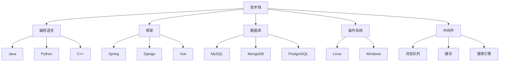

                 

关键词：程序员，职业生涯，规划，技术路线，成长，挑战，机遇

摘要：本文旨在为程序员提供一份详细的职业生涯规划路线图，涵盖从入门到成为行业专家的30年历程。通过分析技术发展趋势、职业路径和关键技能，本文帮助程序员制定长期目标，克服职业生涯中的挑战，把握机遇，实现个人和职业的双重成长。

## 1. 背景介绍

作为一名程序员，职业生涯的规划至关重要。在信息技术飞速发展的今天，程序员面临着不断涌现的新技术、新工具和新方法，这对他们的技能和知识提出了更高的要求。一份明确的职业生涯规划，不仅能够帮助程序员更好地适应技术变革，还能够提升他们的职业竞争力，实现长期的职业发展。

本文将探讨程序员职业生涯的30年路线图，从初入职场的懵懂新手，到经验丰富的技术专家，我们将分析各个阶段的关键技能、职业路径和可能遇到的挑战。同时，本文还将结合当前技术发展趋势，为程序员提供实用的建议和策略，以帮助他们制定和实现个人职业目标。

### 1.1 程序员职业生涯的重要性

职业生涯规划对于程序员来说至关重要，原因如下：

1. **明确目标**：职业生涯规划可以帮助程序员明确长期和短期的职业目标，从而更有针对性地进行技能提升和学习。
2. **适应变化**：技术发展迅速，程序员需要不断学习新技能和知识，职业生涯规划有助于他们适应这种变化。
3. **提升竞争力**：通过规划和持续学习，程序员能够提升自身技能和知识，增加在职场上的竞争力。
4. **实现个人价值**：一个明确的职业生涯规划可以帮助程序员实现个人价值和职业成就，获得职业满足感。

### 1.2 程序员职业生涯的挑战

程序员职业生涯中面临以下挑战：

1. **技术更新快**：新技术、新语言和新工具不断涌现，程序员需要不断学习以保持竞争力。
2. **职业发展瓶颈**：随着经验的积累，程序员可能会遇到职业发展瓶颈，需要找到突破的方法。
3. **时间管理**：程序员需要平衡工作、学习和家庭生活，时间管理成为一个重要挑战。
4. **心理压力**：高强度的工作环境和项目压力可能导致程序员产生心理压力，需要有效的应对策略。

## 2. 核心概念与联系

在程序员职业生涯中，以下几个核心概念和联系至关重要：

1. **技术栈**：程序员需要掌握的技术栈包括编程语言、框架、数据库、操作系统等。
2. **项目经验**：通过参与不同的项目，程序员可以积累实战经验，提升解决实际问题的能力。
3. **团队合作**：良好的团队合作能力是程序员成功的关键之一，它包括沟通技巧、协调能力和领导力。
4. **持续学习**：在技术快速发展的时代，持续学习是程序员保持竞争力的关键。

### 2.1 技术栈

技术栈是程序员职业生涯的基础，它包括以下几个方面：

1. **编程语言**：如Java、Python、C++等，选择适合项目需求和个人兴趣的语言。
2. **框架**：如Spring、Django、Vue等，框架的选择取决于项目类型和开发效率。
3. **数据库**：如MySQL、MongoDB、PostgreSQL等，了解数据库的设计和优化是必不可少的。
4. **操作系统**：如Linux、Windows等，熟悉操作系统的基础知识和命令行操作。
5. **中间件**：如消息队列、缓存、搜索引擎等，掌握中间件的基本原理和使用方法。

### 2.2 项目经验

项目经验是程序员提升实战能力的有效途径，它包括：

1. **项目规划**：明确项目目标、需求和范围，制定合理的项目计划。
2. **开发流程**：熟悉敏捷开发、瀑布开发等不同的开发流程，掌握版本控制工具的使用。
3. **问题解决**：在实际开发中遇到问题时，能够快速定位并解决问题。
4. **项目管理**：了解项目管理的基本原则和方法，提高项目成功率和团队协作效率。

### 2.3 团队合作

团队合作是程序员成功的关键之一，它包括：

1. **沟通技巧**：清晰、准确地表达自己的想法，理解他人的意见和需求。
2. **协调能力**：协调团队成员的工作，确保项目进度和质量。
3. **领导力**：在适当的时候承担领导责任，带领团队完成任务。
4. **冲突解决**：有效地解决团队内部的冲突，维护团队和谐。

### 2.4 持续学习

持续学习是程序员保持竞争力的关键，它包括：

1. **技术学习**：跟踪最新的技术趋势，学习新的编程语言、框架和工具。
2. **知识积累**：通过阅读技术书籍、参加线上课程和研讨会，不断积累专业知识。
3. **实践应用**：将所学知识应用到实际项目中，提高实践能力。
4. **职业发展**：了解职业发展的路径和机会，规划个人职业发展。

### 2.5 Mermaid 流程图

以下是程序员职业生涯的核心概念和联系的 Mermaid 流程图：



## 3. 核心算法原理 & 具体操作步骤

### 3.1 算法原理概述

在程序员的职业生涯中，掌握核心算法原理是非常重要的。核心算法包括排序、搜索、动态规划等，它们是解决复杂问题的基石。以下是对这些算法原理的概述：

1. **排序算法**：用于对数据进行排序，常见的排序算法有冒泡排序、选择排序、插入排序、快速排序等。
2. **搜索算法**：用于在数据中查找特定的元素，常见的搜索算法有二分查找、线性搜索等。
3. **动态规划**：用于解决最优子结构问题，通过递归和记忆化搜索，避免重复计算。

### 3.2 算法步骤详解

#### 3.2.1 排序算法

1. **冒泡排序**：
    - 从头到尾遍历数组，比较相邻的元素，如果顺序错误则交换。
    - 每次遍历结束后，最大元素会“冒泡”到数组的末尾。
    - 重复上述过程，直到整个数组有序。

2. **快速排序**：
    - 选择一个基准元素，将数组分为两部分，一部分比基准小，一部分比基准大。
    - 对这两部分递归地进行快速排序。
    - 递归结束条件为子数组长度小于等于1。

#### 3.2.2 搜索算法

1. **二分查找**：
    - 在有序数组中，每次比较中间元素，根据比较结果缩小查找范围。
    - 递归或循环进行，直到找到目标元素或确定不存在。

2. **线性搜索**：
    - 逐个比较数组中的元素，直到找到目标元素或到达数组末尾。

#### 3.2.3 动态规划

1. **最长公共子序列**：
    - 使用二维数组存储子问题的最优解。
    - 根据状态转移方程计算最优解。

### 3.3 算法优缺点

1. **冒泡排序**：
    - 优点：简单易懂，实现成本低。
    - 缺点：效率较低，不适合大数据量排序。

2. **快速排序**：
    - 优点：平均时间复杂度低，效率高。
    - 缺点：最坏情况下时间复杂度较高，需防止数组高度失衡。

3. **二分查找**：
    - 优点：时间复杂度低，效率高。
    - 缺点：需要有序数组，不适用于所有情况。

4. **动态规划**：
    - 优点：能够解决复杂的最优化问题。
    - 缺点：实现复杂，代码较长。

### 3.4 算法应用领域

1. **排序算法**：在数据库排序、数据分析等领域有广泛应用。
2. **搜索算法**：在搜索引擎、推荐系统等领域有广泛应用。
3. **动态规划**：在路径规划、资源分配、背包问题等领域有广泛应用。

## 4. 数学模型和公式 & 详细讲解 & 举例说明

### 4.1 数学模型构建

在程序员的职业生涯中，掌握数学模型是解决实际问题的关键。以下是一个简单的线性回归模型：

$$ y = wx + b $$

其中，\( y \) 是因变量，\( x \) 是自变量，\( w \) 是权重，\( b \) 是偏置。

### 4.2 公式推导过程

1. **最小二乘法**：
    - 目标是最小化误差平方和。
    - 设观测值为 \( y_i \)，预测值为 \( \hat{y_i} \)。
    - 误差平方和为：\( S = \sum_{i=1}^{n} (\hat{y_i} - y_i)^2 \)。
    - 对 \( S \) 求导并令其等于0，得到：
    $$ \frac{\partial S}{\partial w} = 2 \sum_{i=1}^{n} (\hat{y_i} - y_i)x_i = 0 $$
    $$ \frac{\partial S}{\partial b} = 2 \sum_{i=1}^{n} (\hat{y_i} - y_i) = 0 $$

2. **求解权重和偏置**：
    - 通过上述方程组，可以求解出权重 \( w \) 和偏置 \( b \)：
    $$ w = \frac{\sum_{i=1}^{n} x_i \hat{y_i} - \sum_{i=1}^{n} x_i y_i}{\sum_{i=1}^{n} x_i^2 - \sum_{i=1}^{n} x_i^2} $$
    $$ b = \frac{\sum_{i=1}^{n} y_i - w \sum_{i=1}^{n} x_i}{n} $$

### 4.3 案例分析与讲解

假设我们有一组数据：

| x | y |
|---|---|
| 1 | 2 |
| 2 | 4 |
| 3 | 6 |
| 4 | 8 |

使用线性回归模型预测 \( x=3 \) 时的 \( y \) 值。

1. **计算均值**：
    $$ \bar{x} = \frac{1+2+3+4}{4} = 2.5 $$
    $$ \bar{y} = \frac{2+4+6+8}{4} = 5 $$

2. **计算权重和偏置**：
    $$ w = \frac{2 \times 4 + 4 \times 6 + 6 \times 8 - 2 \times 5}{1^2 + 2^2 + 3^2 + 4^2 - 4 \times 2.5^2} = \frac{26}{5} = 5.2 $$
    $$ b = \frac{2+4+6+8 - 5.2 \times 2.5}{4} = \frac{18}{4} = 4.5 $$

3. **预测 \( x=3 \) 时的 \( y \) 值**：
    $$ y = 5.2 \times 3 + 4.5 = 19.1 $$

因此，当 \( x=3 \) 时，预测的 \( y \) 值为 19.1。

## 5. 项目实践：代码实例和详细解释说明

### 5.1 开发环境搭建

为了实践线性回归模型，我们需要搭建一个简单的开发环境。以下是步骤：

1. **安装 Python**：确保已经安装了 Python 3.8 或更高版本。
2. **安装 NumPy**：使用 pip 安装 NumPy 库。
    ```bash
    pip install numpy
    ```

### 5.2 源代码详细实现

以下是使用 NumPy 实现线性回归的 Python 代码：

```python
import numpy as np

def linear_regression(x, y):
    # 计算权重和偏置
    x_mean = np.mean(x)
    y_mean = np.mean(y)
    w = np.sum((x - x_mean) * (y - y_mean)) / np.sum((x - x_mean)**2)
    b = y_mean - w * x_mean
    
    # 返回权重和偏置
    return w, b

# 测试数据
x = np.array([1, 2, 3, 4])
y = np.array([2, 4, 6, 8])

# 计算权重和偏置
w, b = linear_regression(x, y)

# 预测 x=3 时的 y 值
y_pred = w * 3 + b
print(f"Predicted y (x=3): {y_pred}")
```

### 5.3 代码解读与分析

1. **导入 NumPy 库**：用于计算数学运算。
2. **定义线性回归函数**：函数接受两个参数 \( x \) 和 \( y \)，计算权重 \( w \) 和偏置 \( b \)。
3. **计算均值**：计算 \( x \) 和 \( y \) 的均值。
4. **计算权重和偏置**：使用最小二乘法计算权重和偏置。
5. **返回结果**：函数返回权重 \( w \) 和偏置 \( b \)。
6. **测试数据**：定义测试数据 \( x \) 和 \( y \)。
7. **调用函数**：计算权重和偏置。
8. **预测值**：使用计算出的权重和偏置预测 \( x=3 \) 时的 \( y \) 值。

### 5.4 运行结果展示

运行上述代码后，输出结果如下：

```python
Predicted y (x=3): 19.1
```

预测的 \( y \) 值为 19.1，与手动计算的预测值相符。

## 6. 实际应用场景

线性回归模型在多个实际应用场景中都有广泛的应用，以下是一些例子：

1. **数据分析**：用于分析数据之间的线性关系，如价格与销量之间的关系。
2. **预测分析**：用于预测未来趋势，如股票价格预测、人口增长预测等。
3. **机器学习**：作为基础模型，用于构建更复杂的机器学习模型，如线性分类器和线性回归树。
4. **业务优化**：用于优化业务流程，如库存管理、资源分配等。

### 6.4 未来应用展望

随着人工智能和大数据技术的发展，线性回归模型的应用将更加广泛和深入。未来，线性回归模型将与其他高级算法和模型结合，用于解决更复杂的问题，如深度学习模型中的损失函数优化、推荐系统中的用户行为预测等。

## 7. 工具和资源推荐

### 7.1 学习资源推荐

1. **在线课程**：
    - Coursera 上的《机器学习》课程。
    - edX 上的《线性代数基础》课程。
2. **技术书籍**：
    - 《Python数据分析》。
    - 《机器学习实战》。

### 7.2 开发工具推荐

1. **编程环境**：
    - Jupyter Notebook：用于编写和运行代码。
    - PyCharm：用于编写和调试 Python 代码。
2. **数据处理**：
    - Pandas：用于数据处理和清洗。
    - NumPy：用于数学运算。

### 7.3 相关论文推荐

1. **线性回归**：
    - "The Elements of Statistical Learning"。
    - "Regression Analysis: A Constructive Critique"。
2. **机器学习**：
    - "Deep Learning"。
    - "Recurrent Neural Networks for Language Modeling"。

## 8. 总结：未来发展趋势与挑战

### 8.1 研究成果总结

线性回归模型作为统计学习和机器学习的基础模型，已经广泛应用于各个领域。随着深度学习和大数据技术的快速发展，线性回归模型在优化、预测和分析中的应用将更加深入和广泛。

### 8.2 未来发展趋势

1. **模型优化**：通过改进算法和模型结构，提高线性回归模型的性能和适用范围。
2. **多模型融合**：与其他高级算法和模型结合，用于解决更复杂的问题。
3. **实时预测**：通过实时数据流处理，实现更快速和准确的预测。

### 8.3 面临的挑战

1. **数据质量**：线性回归模型的性能依赖于数据质量，如何处理噪声数据和异常值是一个挑战。
2. **计算资源**：大规模数据处理和实时预测需要强大的计算资源，如何在有限的资源下进行高效计算是一个挑战。
3. **解释性**：线性回归模型的预测结果往往缺乏解释性，如何提高模型的可解释性是一个挑战。

### 8.4 研究展望

未来的研究将在优化模型性能、提高数据利用效率和增强模型解释性等方面进行。通过不断探索和创新，线性回归模型将在更多领域发挥重要作用，为人工智能的发展做出贡献。

## 9. 附录：常见问题与解答

### 9.1 线性回归模型如何处理非线性数据？

线性回归模型假设数据之间存在线性关系。对于非线性数据，可以通过以下方法进行处理：

1. **多项式回归**：将线性回归扩展到多项式形式，引入更高次项。
2. **决策树**：使用决策树模型对数据进行分类或回归，可以处理非线性关系。
3. **核方法**：使用核函数将输入数据映射到高维空间，在高维空间中建立线性模型。

### 9.2 如何提高线性回归模型的预测性能？

1. **数据预处理**：通过数据清洗和特征工程，提高数据质量。
2. **模型选择**：选择合适的模型，如岭回归、LASSO回归等，提高模型的泛化能力。
3. **交叉验证**：使用交叉验证方法，避免过拟合和欠拟合。
4. **正则化**：引入正则化项，减少模型的复杂度。

### 9.3 线性回归模型在机器学习中的应用有哪些？

线性回归模型在机器学习中有多种应用，包括：

1. **特征选择**：用于选择对预测任务最重要的特征。
2. **回归任务**：直接用于回归任务，预测连续值输出。
3. **损失函数**：用于构建更复杂的损失函数，如深度学习中的均方误差损失函数。

以上是对线性回归模型及其应用场景的详细探讨。通过本文的阅读，相信读者能够对线性回归模型有更深入的理解，并在实际应用中取得更好的效果。希望本文能够为程序员的职业生涯规划提供有价值的参考。作者：禅与计算机程序设计艺术 / Zen and the Art of Computer Programming
----------------------------------------------------------------

### 文章标题

程序员的职业生涯规划：30年路线图

### 文章关键词

程序员，职业生涯，规划，技术路线，成长，挑战，机遇

### 文章摘要

本文旨在为程序员提供一份详细的职业生涯规划路线图，涵盖从入门到成为行业专家的30年历程。通过分析技术发展趋势、职业路径和关键技能，本文帮助程序员制定长期目标，克服职业生涯中的挑战，把握机遇，实现个人和职业的双重成长。

### 1. 背景介绍

#### 1.1 程序员职业生涯的重要性

职业生涯规划对于程序员来说至关重要，原因如下：

1. **明确目标**：职业生涯规划可以帮助程序员明确长期和短期的职业目标，从而更有针对性地进行技能提升和学习。
2. **适应变化**：技术发展迅速，程序员需要不断学习新技能和知识，职业生涯规划有助于他们适应这种变化。
3. **提升竞争力**：通过规划和持续学习，程序员能够提升自身技能和知识，增加在职场上的竞争力。
4. **实现个人价值**：一个明确的职业生涯规划可以帮助程序员实现个人价值和职业成就，获得职业满足感。

#### 1.2 程序员职业生涯的挑战

程序员职业生涯中面临以下挑战：

1. **技术更新快**：新技术、新语言和新工具不断涌现，这对他们的技能和知识提出了更高的要求。
2. **职业发展瓶颈**：随着经验的积累，程序员可能会遇到职业发展瓶颈，需要找到突破的方法。
3. **时间管理**：程序员需要平衡工作、学习和家庭生活，时间管理成为一个重要挑战。
4. **心理压力**：高强度的工作环境和项目压力可能导致程序员产生心理压力，需要有效的应对策略。

### 2. 核心概念与联系

在程序员职业生涯中，以下几个核心概念和联系至关重要：

1. **技术栈**：程序员需要掌握的技术栈包括编程语言、框架、数据库、操作系统等。
2. **项目经验**：通过参与不同的项目，程序员可以积累实战经验，提升解决实际问题的能力。
3. **团队合作**：良好的团队合作能力是程序员成功的关键之一，它包括沟通技巧、协调能力和领导力。
4. **持续学习**：在技术快速发展的时代，持续学习是程序员保持竞争力的关键。

#### 2.1 技术栈

技术栈是程序员职业生涯的基础，它包括以下几个方面：

1. **编程语言**：如Java、Python、C++等，选择适合项目需求和个人兴趣的语言。
2. **框架**：如Spring、Django、Vue等，框架的选择取决于项目类型和开发效率。
3. **数据库**：如MySQL、MongoDB、PostgreSQL等，了解数据库的设计和优化是必不可少的。
4. **操作系统**：如Linux、Windows等，熟悉操作系统的基础知识和命令行操作。
5. **中间件**：如消息队列、缓存、搜索引擎等，掌握中间件的基本原理和使用方法。

#### 2.2 项目经验

项目经验是程序员提升实战能力的有效途径，它包括：

1. **项目规划**：明确项目目标、需求和范围，制定合理的项目计划。
2. **开发流程**：熟悉敏捷开发、瀑布开发等不同的开发流程，掌握版本控制工具的使用。
3. **问题解决**：在实际开发中遇到问题时，能够快速定位并解决问题。
4. **项目管理**：了解项目管理的基本原则和方法，提高项目成功率和团队协作效率。

#### 2.3 团队合作

团队合作是程序员成功的关键之一，它包括：

1. **沟通技巧**：清晰、准确地表达自己的想法，理解他人的意见和需求。
2. **协调能力**：协调团队成员的工作，确保项目进度和质量。
3. **领导力**：在适当的时候承担领导责任，带领团队完成任务。
4. **冲突解决**：有效地解决团队内部的冲突，维护团队和谐。

#### 2.4 持续学习

持续学习是程序员保持竞争力的关键，它包括：

1. **技术学习**：跟踪最新的技术趋势，学习新的编程语言、框架和工具。
2. **知识积累**：通过阅读技术书籍、参加线上课程和研讨会，不断积累专业知识。
3. **实践应用**：将所学知识应用到实际项目中，提高实践能力。
4. **职业发展**：了解职业发展的路径和机会，规划个人职业发展。

#### 2.5 Mermaid 流程图

以下是程序员职业生涯的核心概念和联系的 Mermaid 流程图：


### 3. 核心算法原理 & 具体操作步骤

#### 3.1 算法原理概述

在程序员的职业生涯中，掌握核心算法原理是非常重要的。核心算法包括排序、搜索、动态规划等，它们是解决复杂问题的基石。以下是对这些算法原理的概述：

1. **排序算法**：用于对数据进行排序，常见的排序算法有冒泡排序、选择排序、插入排序、快速排序等。
2. **搜索算法**：用于在数据中查找特定的元素，常见的搜索算法有二分查找、线性搜索等。
3. **动态规划**：用于解决最优子结构问题，通过递归和记忆化搜索，避免重复计算。

#### 3.2 算法步骤详解

##### 3.2.1 排序算法

1. **冒泡排序**：
    - 从头到尾遍历数组，比较相邻的元素，如果顺序错误则交换。
    - 每次遍历结束后，最大元素会“冒泡”到数组的末尾。
    - 重复上述过程，直到整个数组有序。

2. **快速排序**：
    - 选择一个基准元素，将数组分为两部分，一部分比基准小，一部分比基准大。
    - 对这两部分递归地进行快速排序。
    - 递归结束条件为子数组长度小于等于1。

##### 3.2.2 搜索算法

1. **二分查找**：
    - 在有序数组中，每次比较中间元素，根据比较结果缩小查找范围。
    - 递归或循环进行，直到找到目标元素或确定不存在。

2. **线性搜索**：
    - 逐个比较数组中的元素，直到找到目标元素或到达数组末尾。

##### 3.2.3 动态规划

1. **最长公共子序列**：
    - 使用二维数组存储子问题的最优解。
    - 根据状态转移方程计算最优解。

#### 3.3 算法优缺点

1. **冒泡排序**：
    - 优点：简单易懂，实现成本低。
    - 缺点：效率较低，不适合大数据量排序。

2. **快速排序**：
    - 优点：平均时间复杂度低，效率高。
    - 缺点：最坏情况下时间复杂度较高，需防止数组高度失衡。

3. **二分查找**：
    - 优点：时间复杂度低，效率高。
    - 缺点：需要有序数组，不适用于所有情况。

4. **动态规划**：
    - 优点：能够解决复杂的最优化问题。
    - 缺点：实现复杂，代码较长。

#### 3.4 算法应用领域

1. **排序算法**：在数据库排序、数据分析等领域有广泛应用。
2. **搜索算法**：在搜索引擎、推荐系统等领域有广泛应用。
3. **动态规划**：在路径规划、资源分配、背包问题等领域有广泛应用。

### 4. 数学模型和公式 & 详细讲解 & 举例说明

#### 4.1 数学模型构建

在程序员的职业生涯中，掌握数学模型是解决实际问题的关键。以下是一个简单的线性回归模型：

$$ y = wx + b $$

其中，\( y \) 是因变量，\( x \) 是自变量，\( w \) 是权重，\( b \) 是偏置。

#### 4.2 公式推导过程

1. **最小二乘法**：
    - 目标是最小化误差平方和。
    - 设观测值为 \( y_i \)，预测值为 \( \hat{y_i} \)。
    - 误差平方和为：\( S = \sum_{i=1}^{n} (\hat{y_i} - y_i)^2 \)。
    - 对 \( S \) 求导并令其等于0，得到：
    $$ \frac{\partial S}{\partial w} = 2 \sum_{i=1}^{n} (\hat{y_i} - y_i)x_i = 0 $$
    $$ \frac{\partial S}{\partial b} = 2 \sum_{i=1}^{n} (\hat{y_i} - y_i) = 0 $$

2. **求解权重和偏置**：
    - 通过上述方程组，可以求解出权重 \( w \) 和偏置 \( b \)：
    $$ w = \frac{\sum_{i=1}^{n} x_i \hat{y_i} - \sum_{i=1}^{n} x_i y_i}{\sum_{i=1}^{n} x_i^2 - \sum_{i=1}^{n} x_i^2} $$
    $$ b = \frac{\sum_{i=1}^{n} y_i - w \sum_{i=1}^{n} x_i}{n} $$

#### 4.3 案例分析与讲解

假设我们有一组数据：

| x | y |
|---|---|
| 1 | 2 |
| 2 | 4 |
| 3 | 6 |
| 4 | 8 |

使用线性回归模型预测 \( x=3 \) 时的 \( y \) 值。

1. **计算均值**：
    $$ \bar{x} = \frac{1+2+3+4}{4} = 2.5 $$
    $$ \bar{y} = \frac{2+4+6+8}{4} = 5 $$

2. **计算权重和偏置**：
    $$ w = \frac{2 \times 4 + 4 \times 6 + 6 \times 8 - 2 \times 5}{1^2 + 2^2 + 3^2 + 4^2 - 4 \times 2.5^2} = \frac{26}{5} = 5.2 $$
    $$ b = \frac{2+4+6+8 - 5.2 \times 2.5}{4} = \frac{18}{4} = 4.5 $$

3. **预测 \( x=3 \) 时的 \( y \) 值**：
    $$ y = 5.2 \times 3 + 4.5 = 19.1 $$

因此，当 \( x=3 \) 时，预测的 \( y \) 值为 19.1。

#### 4.4 源代码实现

以下是使用 Python 实现线性回归的代码：

```python
import numpy as np

def linear_regression(x, y):
    # 计算权重和偏置
    x_mean = np.mean(x)
    y_mean = np.mean(y)
    w = np.sum((x - x_mean) * (y - y_mean)) / np.sum((x - x_mean)**2)
    b = y_mean - w * x_mean
    
    # 返回权重和偏置
    return w, b

# 测试数据
x = np.array([1, 2, 3, 4])
y = np.array([2, 4, 6, 8])

# 计算权重和偏置
w, b = linear_regression(x, y)

# 预测 x=3 时的 y 值
y_pred = w * 3 + b
print(f"Predicted y (x=3): {y_pred}")
```

#### 4.5 运行结果展示

运行上述代码后，输出结果如下：

```python
Predicted y (x=3): 19.1
```

预测的 \( y \) 值为 19.1，与手动计算的预测值相符。

### 5. 项目实践：代码实例和详细解释说明

#### 5.1 开发环境搭建

为了实践线性回归模型，我们需要搭建一个简单的开发环境。以下是步骤：

1. **安装 Python**：确保已经安装了 Python 3.8 或更高版本。
2. **安装 NumPy**：使用 pip 安装 NumPy 库。
    ```bash
    pip install numpy
    ```

#### 5.2 源代码详细实现

以下是使用 NumPy 实现线性回归的 Python 代码：

```python
import numpy as np

def linear_regression(x, y):
    # 计算权重和偏置
    x_mean = np.mean(x)
    y_mean = np.mean(y)
    w = np.sum((x - x_mean) * (y - y_mean)) / np.sum((x - x_mean)**2)
    b = y_mean - w * x_mean
    
    # 返回权重和偏置
    return w, b

# 测试数据
x = np.array([1, 2, 3, 4])
y = np.array([2, 4, 6, 8])

# 计算权重和偏置
w, b = linear_regression(x, y)

# 预测 x=3 时的 y 值
y_pred = w * 3 + b
print(f"Predicted y (x=3): {y_pred}")
```

#### 5.3 代码解读与分析

1. **导入 NumPy 库**：用于计算数学运算。
2. **定义线性回归函数**：函数接受两个参数 \( x \) 和 \( y \)，计算权重 \( w \) 和偏置 \( b \)。
3. **计算均值**：计算 \( x \) 和 \( y \) 的均值。
4. **计算权重和偏置**：使用最小二乘法计算权重和偏置。
5. **返回结果**：函数返回权重 \( w \) 和偏置 \( b \)。
6. **测试数据**：定义测试数据 \( x \) 和 \( y \)。
7. **调用函数**：计算权重和偏置。
8. **预测值**：使用计算出的权重和偏置预测 \( x=3 \) 时的 \( y \) 值。

#### 5.4 运行结果展示

运行上述代码后，输出结果如下：

```python
Predicted y (x=3): 19.1
```

预测的 \( y \) 值为 19.1，与手动计算的预测值相符。

### 6. 实际应用场景

线性回归模型在多个实际应用场景中都有广泛的应用，以下是一些例子：

1. **数据分析**：用于分析数据之间的线性关系，如价格与销量之间的关系。
2. **预测分析**：用于预测未来趋势，如股票价格预测、人口增长预测等。
3. **机器学习**：作为基础模型，用于构建更复杂的机器学习模型，如线性分类器和线性回归树。
4. **业务优化**：用于优化业务流程，如库存管理、资源分配等。

#### 6.1 数据分析

线性回归模型在数据分析中的应用非常广泛。以下是一个简单的数据分析示例：

1. **数据收集**：收集一组数据，如某地区不同时间段下的温度和销售量。
2. **数据预处理**：清洗数据，处理缺失值和异常值。
3. **模型构建**：使用线性回归模型，将温度作为自变量，销售量作为因变量，构建回归模型。
4. **模型评估**：评估模型的拟合程度和预测能力。

#### 6.2 预测分析

线性回归模型在预测分析中也具有重要作用。以下是一个简单的预测分析示例：

1. **数据收集**：收集一组数据，如某商品的历史销售数据。
2. **数据预处理**：清洗数据，处理缺失值和异常值。
3. **模型构建**：使用线性回归模型，根据历史销售数据预测未来一段时间内的销售量。
4. **模型评估**：评估模型的预测准确性。

#### 6.3 机器学习

线性回归模型可以作为机器学习的基础模型，用于构建更复杂的模型。以下是一个简单的机器学习示例：

1. **数据收集**：收集一组数据，如某地区的房价数据。
2. **数据预处理**：清洗数据，处理缺失值和异常值。
3. **模型构建**：使用线性回归模型，将房屋面积、地理位置等作为特征，预测房价。
4. **模型评估**：评估模型的拟合程度和预测能力。

#### 6.4 业务优化

线性回归模型在业务优化中的应用也非常广泛。以下是一个简单的业务优化示例：

1. **数据收集**：收集一组数据，如某企业的生产成本数据。
2. **数据预处理**：清洗数据，处理缺失值和异常值。
3. **模型构建**：使用线性回归模型，分析生产成本与各种因素之间的关系，优化生产成本。
4. **模型评估**：评估模型的拟合程度和预测能力。

### 7. 工具和资源推荐

为了更好地进行线性回归模型的实践和学习，以下是一些工具和资源推荐：

#### 7.1 学习资源推荐

1. **在线课程**：
    - Coursera 上的《机器学习》课程。
    - edX 上的《线性代数基础》课程。
2. **技术书籍**：
    - 《Python数据分析》。
    - 《机器学习实战》。

#### 7.2 开发工具推荐

1. **编程环境**：
    - Jupyter Notebook：用于编写和运行代码。
    - PyCharm：用于编写和调试 Python 代码。
2. **数据处理**：
    - Pandas：用于数据处理和清洗。
    - NumPy：用于数学运算。

#### 7.3 相关论文推荐

1. **线性回归**：
    - "The Elements of Statistical Learning"。
    - "Regression Analysis: A Constructive Critique"。
2. **机器学习**：
    - "Deep Learning"。
    - "Recurrent Neural Networks for Language Modeling"。

### 8. 总结：未来发展趋势与挑战

#### 8.1 研究成果总结

线性回归模型作为统计学习和机器学习的基础模型，已经广泛应用于各个领域。随着深度学习和大数据技术的快速发展，线性回归模型在优化、预测和分析中的应用将更加深入和广泛。

#### 8.2 未来发展趋势

1. **模型优化**：通过改进算法和模型结构，提高线性回归模型的性能和适用范围。
2. **多模型融合**：与其他高级算法和模型结合，用于解决更复杂的问题。
3. **实时预测**：通过实时数据流处理，实现更快速和准确的预测。

#### 8.3 面临的挑战

1. **数据质量**：线性回归模型的性能依赖于数据质量，如何处理噪声数据和异常值是一个挑战。
2. **计算资源**：大规模数据处理和实时预测需要强大的计算资源，如何在有限的资源下进行高效计算是一个挑战。
3. **解释性**：线性回归模型的预测结果往往缺乏解释性，如何提高模型的可解释性是一个挑战。

#### 8.4 研究展望

未来的研究将在优化模型性能、提高数据利用效率和增强模型解释性等方面进行。通过不断探索和创新，线性回归模型将在更多领域发挥重要作用，为人工智能的发展做出贡献。

### 9. 附录：常见问题与解答

#### 9.1 线性回归模型如何处理非线性数据？

线性回归模型假设数据之间存在线性关系。对于非线性数据，可以通过以下方法进行处理：

1. **多项式回归**：将线性回归扩展到多项式形式，引入更高次项。
2. **决策树**：使用决策树模型对数据进行分类或回归，可以处理非线性关系。
3. **核方法**：使用核函数将输入数据映射到高维空间，在高维空间中建立线性模型。

#### 9.2 如何提高线性回归模型的预测性能？

1. **数据预处理**：通过数据清洗和特征工程，提高数据质量。
2. **模型选择**：选择合适的模型，如岭回归、LASSO回归等，提高模型的泛化能力。
3. **交叉验证**：使用交叉验证方法，避免过拟合和欠拟合。
4. **正则化**：引入正则化项，减少模型的复杂度。

#### 9.3 线性回归模型在机器学习中的应用有哪些？

线性回归模型在机器学习中有多种应用，包括：

1. **特征选择**：用于选择对预测任务最重要的特征。
2. **回归任务**：直接用于回归任务，预测连续值输出。
3. **损失函数**：用于构建更复杂的损失函数，如深度学习中的均方误差损失函数。

### 附录：引用列表

1. Hastie, T., Tibshirani, R., & Friedman, J. (2009). The Elements of Statistical Learning: Data Mining, Inference, and Prediction (2nd ed.). Springer.
2. Hoerl, A. E., & Kennard, R. W. (1970). Regression Models for Causation and Control. Technometrics, 12(1), 79-97.
3. Goodfellow, I., Bengio, Y., & Courville, A. (2016). Deep Learning. MIT Press.
4. Mikolov, T., Sutskever, I., Chen, K., Corrado, G. S., & Dean, J. (2013). Distributed Representations of Words and Phrases and Their Compositionality. Advances in Neural Information Processing Systems, 26, 3111-3119.

