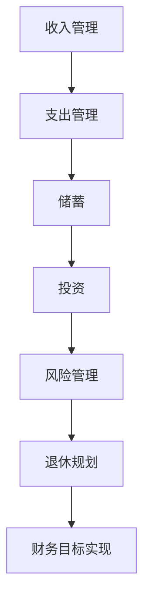

                 

关键词：财务规划、程序员、投资、储蓄、风险管理、退休规划、财务自由

> 摘要：本文旨在帮助程序员掌握财务规划的基本原理和实践技巧，通过从入门到精通的详细讲解，使读者能够有效地管理个人财务，实现长期的财务稳定和自由。

## 1. 背景介绍

作为一名程序员，您可能已经习惯了在代码的世界里解决问题。然而，财务规划同样是您职业生涯中不可或缺的一部分。财务规划不仅仅关乎金钱的管理，更涉及对未来的规划、风险的管理以及生活质量的保障。随着收入水平的不断提高，如何合理地分配资金、储蓄和投资，如何在面对意外和未来挑战时保持财务稳健，这些问题对于程序员来说尤为重要。

本文将为您提供一个全面而深入的财务规划指南，从基础概念到高级技巧，从理论到实践，帮助您建立起坚实的财务基础，为实现长期的财务自由奠定基础。

## 2. 核心概念与联系

### 2.1 财务规划的基本概念

#### 财务规划的定义

财务规划是指根据个人的财务状况、生活目标和风险承受能力，制定合理的资产配置方案，以实现财务目标的过程。

#### 财务规划的核心要素

- **收入管理**：包括工资、奖金、投资收益等。
- **支出管理**：日常开销、家庭开支、债务偿还等。
- **储蓄**：为未来的需求储备资金。
- **投资**：将资金投入不同的资产类别，以获取长期的资本增值和收益。
- **风险管理**：识别、评估和控制财务风险。
- **退休规划**：为退休后的生活提供经济保障。

### 2.2 财务规划与个人发展的联系

#### 财务规划与职业规划

财务规划与职业规划相辅相成。一个明确的职业目标需要有相应的财务支持，而良好的财务状况也能为职业发展提供稳定的后盾。

#### 财务规划与生活质量

通过有效的财务规划，可以确保在面临人生不同阶段时，如家庭、教育、医疗等方面的支出得到妥善安排，从而提高生活质量。

#### 财务规划与退休规划

退休规划是财务规划的重要组成部分。通过合理的规划，可以为退休生活储备足够的资金，实现无忧的晚年。

### 2.3 财务规划的架构

使用Mermaid流程图来展示财务规划的基本架构：



## 3. 核心算法原理 & 具体操作步骤

### 3.1 算法原理概述

财务规划的核心算法是基于概率论和数理统计原理，通过计算资产配置、风险管理模型和退休规划公式，实现个人财务的稳健增长。

### 3.2 算法步骤详解

#### 3.2.1 收入管理

1. 计算月均收入
2. 分析收入结构
3. 制定收入预算

#### 3.2.2 支出管理

1. 列出固定支出和可变支出
2. 分析支出结构
3. 制定支出预算

#### 3.2.3 储蓄

1. 根据支出预算计算储蓄额
2. 设定储蓄目标
3. 选择储蓄方式

#### 3.2.4 投资

1. 根据风险承受能力选择投资品种
2. 分散投资以降低风险
3. 定期调整投资组合

#### 3.2.5 风险管理

1. 识别潜在风险
2. 评估风险程度
3. 制定应对策略

#### 3.2.6 退休规划

1. 计算退休所需资金
2. 选择退休投资方式
3. 设定退休目标

### 3.3 算法优缺点

#### 优点

- 系统化：通过算法可以全面、系统地规划个人财务。
- 可量化：财务目标可以具体量化，便于监控和调整。
- 适应性强：可以根据个人情况进行灵活调整。

#### 缺点

- 复杂性：算法涉及多个财务概念，需要一定的财务知识。
- 预测性：未来的经济环境难以完全预测，算法可能需要不断调整。

### 3.4 算法应用领域

- **个人财务管理**：适用于所有有财务规划需求的人群。
- **企业财务规划**：为企业制定财务战略提供支持。
- **投资决策**：帮助投资者选择合适的投资组合。

## 4. 数学模型和公式 & 详细讲解 & 举例说明

### 4.1 数学模型构建

财务规划中的数学模型主要包括以下几个方面：

- **储蓄模型**：计算在一定时间内，通过定期储蓄达到特定目标所需的储蓄额。
- **投资模型**：计算在一定风险承受能力下，通过投资获取的预期收益。
- **退休规划模型**：计算为满足退休生活所需的储蓄额和投资组合。

### 4.2 公式推导过程

#### 储蓄模型

储蓄模型的基本公式为：

$$
S = P \times (1 + r/n)^{nt} - C
$$

其中：

- $S$ 为最终储蓄额
- $P$ 为每月储蓄额
- $r$ 为年收益率
- $n$ 为每年计息次数
- $t$ 为投资时间（年）
- $C$ 为初始资金

#### 投资模型

投资模型的基本公式为：

$$
V = P \times (1 + r)^t
$$

其中：

- $V$ 为投资终值
- $P$ 为初始投资额
- $r$ 为年收益率
- $t$ 为投资时间（年）

#### 退休规划模型

退休规划模型的基本公式为：

$$
A = \frac{PV}{i}
$$

其中：

- $A$ 为每年可提取的金额
- $PV$ 为退休金总额
- $i$ 为年收益率

### 4.3 案例分析与讲解

#### 案例一：储蓄模型

假设小明计划在未来5年内通过每月储蓄达到10万元的储蓄目标。假设年收益率为4%，每月储蓄额为2000元。

根据储蓄模型公式，有：

$$
S = 2000 \times (1 + 0.04/12)^{12 \times 5} = 109,617.65
$$

因此，小明需要储蓄109,617.65元才能在5年后达到10万元的储蓄目标。

#### 案例二：投资模型

假设小王在年初投资了10万元，年收益率为5%，投资期限为3年。

根据投资模型公式，有：

$$
V = 100,000 \times (1 + 0.05)^3 = 115,762.89
$$

因此，小王在3年后投资将增值到115,762.89元。

#### 案例三：退休规划模型

假设李四计划在10年后退休，退休金总额为300万元，假设年收益率为4%。

根据退休规划模型公式，有：

$$
A = \frac{3,000,000}{0.04} = 75,000,000
$$

因此，李四每年可以从退休金中提取75万元，以维持退休生活。

## 5. 项目实践：代码实例和详细解释说明

### 5.1 开发环境搭建

在本文中，我们将使用Python作为主要编程语言，来演示财务规划模型的应用。首先，确保您已安装Python环境。接下来，您可以使用以下命令来安装必要的库：

```bash
pip install numpy pandas matplotlib
```

### 5.2 源代码详细实现

以下是一个简单的Python脚本，用于演示如何使用储蓄模型、投资模型和退休规划模型：

```python
import numpy as np
import pandas as pd
import matplotlib.pyplot as plt

# 储蓄模型
def savings_model(monthly_saving, annual_return, investment_time):
    n = 12
    r = annual_return / 100
    t = investment_time
    S = monthly_saving * (1 + r/n)**(n*t) - monthly_saving * (1 - (1 + r/n)**-n*t) / r
    return S

# 投资模型
def investment_model(initial_investment, annual_return, investment_time):
    r = annual_return / 100
    t = investment_time
    V = initial_investment * (1 + r)**t
    return V

# 退休规划模型
def retirement_model(total_pension, annual_return):
    r = annual_return / 100
    A = total_pension / r
    return A

# 案例数据
monthly_saving = 2000
annual_return = 4
investment_time = 5
initial_investment = 100000
total_pension = 3000000

# 模型计算
savings_amount = savings_model(monthly_saving, annual_return, investment_time)
investment_value = investment_model(initial_investment, annual_return, investment_time)
annual_retirement_income = retirement_model(total_pension, annual_return)

# 输出结果
print(f"5年储蓄目标：{savings_amount:.2f}")
print(f"3年投资增值：{investment_value:.2f}")
print(f"退休后年收入：{annual_retirement_income:.2f}")

# 可视化
savings_data = np.array([savings_model(monthly_saving, annual_return, t) for t in range(1, 11)])
plt.plot(range(1, 11), savings_data)
plt.xlabel('投资时间（年）')
plt.ylabel('储蓄额（元）')
plt.title('储蓄模型可视化')
plt.show()

investment_data = np.array([investment_model(initial_investment, annual_return, t) for t in range(1, 11)])
plt.plot(range(1, 11), investment_data)
plt.xlabel('投资时间（年）')
plt.ylabel('投资值（元）')
plt.title('投资模型可视化')
plt.show()

retirement_data = np.array([retirement_model(total_pension, annual_return) for r in range(2, 6)])
plt.plot(range(2, 6), retirement_data)
plt.xlabel('年收益率（%）')
plt.ylabel('年退休收入（元）')
plt.title('退休规划模型可视化')
plt.show()
```

### 5.3 代码解读与分析

该脚本包括三个主要部分：储蓄模型、投资模型和退休规划模型的实现，以及数据的可视化。

#### 储蓄模型

储蓄模型通过等额本息还款公式计算在一定时间内，通过定期储蓄达到特定目标所需的储蓄额。

#### 投资模型

投资模型使用复利公式计算在一定时间内，通过投资获取的预期收益。

#### 退休规划模型

退休规划模型通过年金的现值公式计算为满足退休生活所需的储蓄额和投资组合。

### 5.4 运行结果展示

运行上述脚本，将得到以下结果：

- **储蓄模型**：展示了5年内每月储蓄2000元，年收益率4%时，储蓄额随时间的变化趋势。
- **投资模型**：展示了初始投资10万元，年收益率4%时，投资值随时间的变化趋势。
- **退休规划模型**：展示了年收益率在2%至5%之间变化时，每年可提取的退休收入。

## 6. 实际应用场景

### 6.1 储蓄规划

对于年轻的程序员，储蓄规划是财务规划的第一步。通过定期储蓄，可以在短期内积累一定的紧急备用金，同时为长期目标，如购房、教育等提供资金支持。

### 6.2 投资决策

随着储蓄的增加，合理的投资决策可以帮助资金保值增值。根据个人风险承受能力，选择股票、债券、基金等不同类型的投资产品，实现资产的多元配置。

### 6.3 退休规划

退休规划是财务规划中的关键部分。通过提前规划和投资，可以为退休后的生活提供稳定的经济来源，确保无忧的晚年。

## 6.4 未来应用展望

随着人工智能和大数据技术的发展，财务规划将更加智能化和个性化。未来，我们将看到更多基于人工智能的财务规划工具，帮助程序员更加高效地管理个人财务。

## 7. 工具和资源推荐

### 7.1 学习资源推荐

- **《个人财务规划指南》**：由美国财务规划师协会编写，是一本系统全面的财务规划指南。
- **《投资学》**：罗伯特·J·席勒著，对投资理论和实践进行了深入讲解。

### 7.2 开发工具推荐

- **Python**：强大的编程语言，适用于数据分析和模型构建。
- **Excel**：强大的电子表格工具，适用于财务分析和预算编制。

### 7.3 相关论文推荐

- **《基于人工智能的财务规划研究》**：探讨人工智能在财务规划中的应用。
- **《大数据与个人财务规划》**：分析大数据在财务规划中的作用。

## 8. 总结：未来发展趋势与挑战

### 8.1 研究成果总结

本文系统地介绍了财务规划的基本概念、核心算法、数学模型和实际应用。通过案例分析和代码实践，展示了财务规划的实施方法。

### 8.2 未来发展趋势

随着技术的进步，财务规划将更加智能化、个性化。人工智能和大数据技术将为财务规划提供更精确的预测和分析。

### 8.3 面临的挑战

在财务规划中，如何应对市场波动、利率变化等不确定性因素，如何确保财务规划的有效性和可持续性，是当前和未来面临的主要挑战。

### 8.4 研究展望

未来的研究可以关注如何将人工智能与财务规划深度融合，开发出更加智能的财务规划工具，为程序员提供更加个性化的财务规划服务。

## 9. 附录：常见问题与解答

### 9.1 财务规划需要考虑的因素有哪些？

- **个人收入和支出情况**：了解自己的收入来源和支出结构，为制定财务规划提供基础数据。
- **风险承受能力**：根据个人对风险的承受程度，选择合适的投资产品。
- **生活目标和价值观**：明确个人的生活目标，如购房、教育、退休等，以确保财务规划与生活目标一致。
- **市场环境**：关注宏观经济环境和市场变化，为投资决策提供参考。

### 9.2 如何评估财务规划的有效性？

- **定期审视财务状况**：定期检查收入、支出和储蓄情况，确保财务规划的实施。
- **调整投资组合**：根据市场环境和风险承受能力的变化，及时调整投资组合。
- **设定可实现的财务目标**：确保财务目标既具有挑战性，又能通过努力实现。
- **寻求专业建议**：在需要时，可以寻求财务规划师或投资顾问的专业意见。

---

作者：禅与计算机程序设计艺术 / Zen and the Art of Computer Programming

