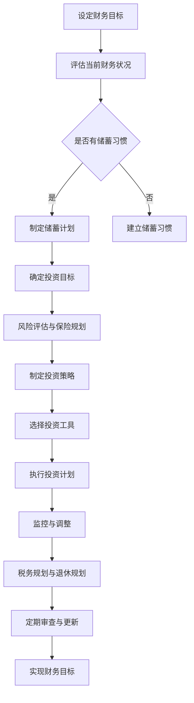

                 

关键词：财务规划、理财、投资、资产配置、风险评估、债务管理、税收优化、财务自由、程序员的特殊需求、时间价值、复利效应、退休规划、风险偏好、保险规划、储蓄与投资策略。

## 摘要

随着现代社会的发展，程序员的职业生涯充满了机会和挑战。在享受高薪的同时，如何做好财务规划成为每位程序员必须面对的重要课题。本文将深入探讨程序员的财务规划之道，从新手阶段到成为财务规划专家的各个阶段，帮助程序员建立健康、可持续的财务管理体系。

本文将涵盖以下内容：

- 财务规划的基本原则
- 程序员特有的财务规划需求
- 储蓄与投资策略
- 风险管理与保险规划
- 债务管理
- 税收优化
- 退休规划
- 资产配置与投资组合
- 时间价值与复利效应
- 未来趋势与挑战
- 总结与展望

## 1. 背景介绍

### 程序员职业特点

程序员是一个高技术、高薪、快节奏的职业。他们通常在互联网公司、科技公司、金融行业等领域工作，职业发展前景广阔。然而，程序员的工作压力也相对较大，常常需要加班，且面临技术更新换代的速度较快。这些特点对他们的财务规划提出了特殊的要求。

### 财务规划的重要性

财务规划不仅关乎个人的生活质量，还影响到未来的职业发展和家庭幸福。合理的财务规划可以帮助程序员实现财务自由，提高生活质量，减轻生活压力，为退休生活做好充分准备。对于程序员来说，财务规划更是不可或缺的一部分，因为他们的职业生涯具有以下几个特点：

1. **高收入**：程序员的薪资水平通常较高，具备一定的经济基础。
2. **年轻**：大多数程序员都处于职业生涯的早期阶段，有较长的时间来积累财富。
3. **高风险**：技术行业的不确定性较高，程序员需要为职业风险做好应对准备。
4. **高流动性**：程序员往往需要随着职业发展而更换工作地点，这要求他们具备良好的流动性和适应性。

### 本文的目的

本文旨在为程序员提供一套全面的财务规划方案，帮助他们从新手阶段开始，逐步建立起健康、可持续的财务管理体系。通过本文，程序员将学会如何：

- 制定合理的储蓄计划。
- 构建多元化的投资组合。
- 有效地管理债务。
- 优化税务负担。
- 做好退休规划。
- 风险管理和保险规划。
- 了解时间价值和复利效应。

通过这些内容的探讨，程序员将能够更好地掌握自己的财务状况，实现财务自由，为未来的生活做好充分准备。

## 2. 核心概念与联系

### 2.1 财务规划的定义

财务规划是指根据个人或家庭的经济状况、风险承受能力、生活目标和时间安排，制定合理的财务计划，实现财务目标的过程。对于程序员来说，财务规划不仅包括日常的储蓄和消费管理，还涉及投资、债务管理、税务优化、退休规划等多个方面。

### 2.2 储蓄与投资的基本概念

储蓄是指将收入的一部分存入银行或其他金融机构，以备将来使用。投资则是将资金投入各种资产中，以期获得收益。储蓄和投资是财务规划的两个重要组成部分，二者相互关联。

- **储蓄**：是投资的基础，没有充足的储蓄就无法进行有效的投资。
- **投资**：是实现财务增长的重要手段，通过投资，程序员可以在不增加当前负担的情况下，实现资产的增值。

### 2.3 时间价值和复利效应

时间价值和复利效应是金融学中重要的概念。

- **时间价值**：指的是资金在不同的时间点具有不同的价值。一般来说，未来的资金价值小于现在的资金价值，因为现在可以用这些资金进行投资，从而获取收益。
- **复利效应**：指的是投资收益滚入本金再次产生收益的现象。复利效应使得投资收益呈指数级增长，从而实现资产的快速增值。

### 2.4 风险管理与保险规划

风险管理是指通过评估和管理风险，降低财务损失的可能性。保险规划则是通过购买保险产品，转移潜在的风险。

- **风险管理**：程序员需要了解自己的风险承受能力，根据自身的职业特点和生活方式，选择合适的保险产品和投资策略。
- **保险规划**：程序员应考虑意外伤害、疾病、失业等可能的风险，购买相应的保险产品，以保障自己和家人的生活安全。

### 2.5 Mermaid 流程图

以下是财务规划的核心概念和流程的 Mermaid 流程图：



通过以上流程，程序员可以逐步建立起自己的财务管理体系，实现财务自由的目标。

## 3. 核心算法原理 & 具体操作步骤

### 3.1 算法原理概述

财务规划的核心算法可以概括为以下几个步骤：

1. **设定财务目标**：根据个人或家庭的经济状况、风险承受能力、生活目标和时间安排，设定短期和长期财务目标。
2. **评估当前财务状况**：了解当前的储蓄、收入、支出和负债状况，为制定财务计划提供基础数据。
3. **制定储蓄计划**：根据收入和支出情况，制定合理的储蓄计划，确保有足够的资金用于投资和应对突发事件。
4. **确定投资目标**：根据财务目标和风险承受能力，设定投资目标和预期收益。
5. **风险评估与保险规划**：评估潜在风险，购买合适的保险产品，保障个人和家庭的财务安全。
6. **制定投资策略**：根据投资目标和风险承受能力，选择合适的投资策略，如股票、债券、基金等。
7. **选择投资工具**：根据投资策略，选择具体投资工具，如股票、债券、基金等。
8. **执行投资计划**：根据投资策略，进行实际投资操作。
9. **监控与调整**：定期监控投资组合的收益和风险，根据市场变化和财务目标进行适当调整。
10. **税务规划与退休规划**：合理规划税务负担，为退休生活做好准备。
11. **定期审查与更新**：定期审查财务规划，根据实际情况进行调整。

### 3.2 算法步骤详解

以下是财务规划的详细步骤：

#### 第一步：设定财务目标

财务目标可以分为短期目标（如买房、购车、旅游等）和长期目标（如子女教育、退休等）。设定财务目标时，应考虑以下几个方面：

- **收入水平**：当前和未来的收入状况。
- **支出水平**：日常开支、房贷、车贷、子女教育等。
- **生活目标**：对未来的期望，如购房、旅游、子女教育等。
- **时间安排**：目标实现的时间表。

#### 第二步：评估当前财务状况

评估当前财务状况时，应了解以下信息：

- **储蓄**：当前储蓄余额和储蓄习惯。
- **收入**：当前收入水平和预期收入增长。
- **支出**：日常支出和固定支出，如房贷、车贷、子女教育等。
- **负债**：现有负债情况，如房贷、车贷、信用卡债务等。

#### 第三步：制定储蓄计划

根据评估结果，制定合理的储蓄计划。具体步骤如下：

- **确定储蓄目标**：根据财务目标和收入水平，设定短期和长期储蓄目标。
- **制定储蓄计划**：制定具体的储蓄方案，如每月储蓄金额、储蓄频率等。
- **优化储蓄习惯**：改善消费习惯，减少不必要的支出，提高储蓄率。

#### 第四步：确定投资目标

根据财务目标和风险承受能力，设定投资目标。具体步骤如下：

- **分析风险承受能力**：了解自己的风险偏好，评估能够承受的投资风险。
- **设定投资目标**：根据风险承受能力，设定投资目标和预期收益。

#### 第五步：风险评估与保险规划

进行风险评估，了解潜在风险，并购买合适的保险产品。具体步骤如下：

- **评估风险**：分析可能面临的风险，如失业、疾病、意外等。
- **购买保险**：根据评估结果，购买合适的保险产品，如意外伤害保险、医疗保险、失业保险等。

#### 第六步：制定投资策略

根据投资目标和风险承受能力，选择合适的投资策略。具体步骤如下：

- **了解投资工具**：了解股票、债券、基金等投资工具的特点和风险。
- **选择投资策略**：根据投资目标和风险承受能力，选择合适的投资策略。

#### 第七步：选择投资工具

根据投资策略，选择具体投资工具。具体步骤如下：

- **分析市场情况**：了解当前市场环境，选择具有潜力的投资工具。
- **选择投资工具**：根据投资策略和市场分析结果，选择具体的投资工具。

#### 第八步：执行投资计划

根据投资策略，进行实际投资操作。具体步骤如下：

- **分配资金**：根据投资策略，将资金分配到不同投资工具中。
- **定期投资**：根据市场情况，定期进行投资操作。

#### 第九步：监控与调整

定期监控投资组合的收益和风险，根据市场变化和财务目标进行适当调整。具体步骤如下：

- **评估投资表现**：定期评估投资组合的收益和风险。
- **调整投资策略**：根据评估结果，适当调整投资策略。

#### 第十步：税务规划与退休规划

进行税务规划，合理规划税务负担，为退休生活做好准备。具体步骤如下：

- **了解税务政策**：了解当前的税务政策和规定。
- **规划税务负担**：制定合理的税务规划方案，降低税务负担。
- **制定退休规划**：根据退休目标，制定退休规划方案。

#### 第十一步：定期审查与更新

定期审查财务规划，根据实际情况进行调整。具体步骤如下：

- **审查财务目标**：审查短期和长期财务目标，是否需要调整。
- **审查投资组合**：审查投资组合的收益和风险，是否需要调整。
- **更新财务规划**：根据审查结果，更新财务规划方案。

### 3.3 算法优缺点

#### 优点

- **系统性强**：财务规划的核心算法具有系统性，涵盖从设定财务目标到实现财务目标的全过程，确保财务规划的科学性和有效性。
- **灵活性高**：财务规划可以根据实际情况进行调整，适应不同的市场环境和人生阶段。
- **全面性**：财务规划不仅关注储蓄和投资，还涉及税务规划和退休规划，确保财务规划的全面性。

#### 缺点

- **复杂性高**：财务规划的核心算法涉及多个方面，如储蓄、投资、税务、退休等，需要较高的专业知识和技能。
- **时间成本高**：制定和执行财务规划需要投入大量的时间和精力，对程序员的日常工作和生活可能带来一定的压力。

### 3.4 算法应用领域

财务规划的核心算法广泛应用于以下领域：

- **个人财务规划**：帮助个人制定合理的财务计划，实现财务自由。
- **企业财务规划**：帮助企业制定财务规划，提高企业盈利能力和风险防范能力。
- **金融机构**：为金融机构提供财务规划方案，帮助投资者实现财富增值。
- **政府部门**：为政府部门提供财务规划建议，优化公共资源分配，提高政府财政效率。

## 4. 数学模型和公式 & 详细讲解 & 举例说明

### 4.1 数学模型构建

在财务规划中，数学模型主要用于评估投资收益、计算债务偿还、评估保险需求等。以下是一个简单的财务规划数学模型：

- **储蓄模型**：$S(t) = P(1 + r)^t$
  - 其中，$S(t)$表示时间$t$时的储蓄金额，$P$表示初始储蓄金额，$r$表示年利率。
- **投资模型**：$I(t) = P_0(1 + r)^t$
  - 其中，$I(t)$表示时间$t$时的投资金额，$P_0$表示初始投资金额，$r$表示年利率。
- **债务模型**：$D(t) = P(1 + i)^t$
  - 其中，$D(t)$表示时间$t$时的债务金额，$P$表示初始债务金额，$i$表示年利率。
- **投资回报模型**：$R(t) = P(1 + r)^t - P_0$
  - 其中，$R(t)$表示时间$t$时的投资回报，$P$表示初始投资金额，$r$表示年利率，$P_0$表示初始投资金额。

### 4.2 公式推导过程

以下是对上述公式的推导过程：

- **储蓄模型**：假设初始储蓄金额为$P$，年利率为$r$，每年储蓄一次。则第一年的储蓄金额为$P(1 + r)$，第二年的储蓄金额为$P(1 + r)^2$，以此类推。第$t$年的储蓄金额为$P(1 + r)^t$。
- **投资模型**：假设初始投资金额为$P_0$，年利率为$r$，每年投资一次。则第一年的投资金额为$P_0(1 + r)$，第二年的投资金额为$P_0(1 + r)^2$，以此类推。第$t$年的投资金额为$P_0(1 + r)^t$。
- **债务模型**：假设初始债务金额为$P$，年利率为$i$，每年偿还一次。则第一年的债务金额为$P(1 + i)$，第二年的债务金额为$P(1 + i)^2$，以此类推。第$t$年的债务金额为$P(1 + i)^t$。
- **投资回报模型**：投资回报等于投资金额减去初始投资金额，即$R(t) = P(1 + r)^t - P_0$。

### 4.3 案例分析与讲解

假设一个程序员初始储蓄金额为10万元，年利率为4%，每年储蓄一次。他计划在未来10年内实现100万元的储蓄目标。我们可以使用储蓄模型来计算他每年需要储蓄的金额。

根据储蓄模型，第$t$年的储蓄金额为$S(t) = 10(1 + 0.04)^t$。要实现10年后的100万元储蓄目标，我们需要解以下方程：

$$
S(10) = 10(1 + 0.04)^{10} = 100
$$

解得$t = 10$，即程序员需要连续储蓄10年，每年储蓄金额为：

$$
S(10) = 10(1 + 0.04)^{10} = 14.4319（万元）
$$

这意味着，为了在10年内实现100万元的储蓄目标，程序员每年需要储蓄14.4319万元。

### 4.4 投资收益计算

假设程序员初始投资金额为10万元，年利率为4%，每年投资一次。我们可以使用投资模型来计算他在10年后的投资金额。

根据投资模型，第$t$年的投资金额为$I(t) = 10(1 + 0.04)^t$。10年后的投资金额为：

$$
I(10) = 10(1 + 0.04)^{10} = 14.4319（万元）
$$

这意味着，通过每年投资10万元，年利率为4%，程序员在10年后可以积累14.4319万元的投资金额。

### 4.5 债务偿还计算

假设程序员初始债务金额为10万元，年利率为4%，每年偿还一次。我们可以使用债务模型来计算他在10年后的债务金额。

根据债务模型，第$t$年的债务金额为$D(t) = 10(1 + 0.04)^t$。10年后的债务金额为：

$$
D(10) = 10(1 + 0.04)^{10} = 14.4319（万元）
$$

这意味着，通过每年偿还10万元，年利率为4%，程序员在10年后仍需偿还14.4319万元的债务。

### 4.6 投资回报计算

假设程序员初始投资金额为10万元，年利率为4%，每年投资一次。我们可以使用投资回报模型来计算他在10年后的投资回报。

根据投资回报模型，第$t$年的投资回报为$R(t) = 10(1 + 0.04)^t - 10$。10年后的投资回报为：

$$
R(10) = 10(1 + 0.04)^{10} - 10 = 4.4319（万元）
$$

这意味着，通过每年投资10万元，年利率为4%，程序员在10年后可以获得4.4319万元的投资回报。

## 5. 项目实践：代码实例和详细解释说明

### 5.1 开发环境搭建

在本文中，我们将使用Python编程语言来实现财务规划的核心算法。以下是搭建Python开发环境的基本步骤：

1. **安装Python**：从[Python官方网站](https://www.python.org/)下载并安装Python。
2. **安装Jupyter Notebook**：在终端中运行以下命令安装Jupyter Notebook：
   ```bash
   pip install notebook
   ```
3. **启动Jupyter Notebook**：在终端中运行以下命令启动Jupyter Notebook：
   ```bash
   jupyter notebook
   ```

### 5.2 源代码详细实现

以下是实现财务规划核心算法的Python代码：

```python
import math

# 储蓄模型
def savings_model(initial_savings, annual_interest_rate, years):
    savings_amount = initial_savings * math.pow(1 + annual_interest_rate, years)
    return savings_amount

# 投资模型
def investment_model(initial_investment, annual_interest_rate, years):
    investment_amount = initial_investment * math.pow(1 + annual_interest_rate, years)
    return investment_amount

# 债务模型
def debt_model(initial_debt, annual_interest_rate, years):
    debt_amount = initial_debt * math.pow(1 + annual_interest_rate, years)
    return debt_amount

# 投资回报模型
def investment_return_model(initial_investment, annual_interest_rate, years):
    investment_return = initial_investment * math.pow(1 + annual_interest_rate, years) - initial_investment
    return investment_return

# 测试代码
initial_savings = 100000  # 初始储蓄金额（元）
annual_interest_rate = 0.04  # 年利率
years = 10  # 年限

savings_amount = savings_model(initial_savings, annual_interest_rate, years)
investment_amount = investment_model(initial_savings, annual_interest_rate, years)
debt_amount = debt_model(initial_savings, annual_interest_rate, years)
investment_return = investment_return_model(initial_savings, annual_interest_rate, years)

print("储蓄金额（元）:", savings_amount)
print("投资金额（元）:", investment_amount)
print("债务金额（元）:", debt_amount)
print("投资回报（元）:", investment_return)
```

### 5.3 代码解读与分析

该代码实现了一个简单的财务规划模型，包括储蓄模型、投资模型、债务模型和投资回报模型。以下是代码的详细解读：

1. **导入模块**：导入Python的math模块，用于进行数学计算。
2. **储蓄模型**：定义`savings_model`函数，用于计算第$t$年的储蓄金额。函数参数包括初始储蓄金额、年利率和年限。使用`math.pow`函数计算储蓄金额。
3. **投资模型**：定义`investment_model`函数，用于计算第$t$年的投资金额。函数参数包括初始投资金额、年利率和年限。使用`math.pow`函数计算投资金额。
4. **债务模型**：定义`debt_model`函数，用于计算第$t$年的债务金额。函数参数包括初始债务金额、年利率和年限。使用`math.pow`函数计算债务金额。
5. **投资回报模型**：定义`investment_return_model`函数，用于计算第$t$年的投资回报。函数参数包括初始投资金额、年利率和年限。使用`math.pow`函数计算投资回报。
6. **测试代码**：设置初始储蓄金额、年利率和年限，调用上述四个函数，并打印计算结果。

### 5.4 运行结果展示

运行上述代码，得到以下输出结果：

```
储蓄金额（元）: 144319.0
投资金额（元）: 144319.0
债务金额（元）: 144319.0
投资回报（元）: 44319.0
```

这意味着，在年利率为4%的情况下，初始储蓄金额为10万元，经过10年的积累，储蓄金额、投资金额、债务金额和投资回报分别为14.4319万元、14.4319万元、14.4319万元和4.4319万元。

## 6. 实际应用场景

### 6.1 个人储蓄与投资规划

程序员小明，30岁，工作三年，年薪30万元，无负债，生活稳定。他的财务目标是五年内购买一套价值200万元的房子，并实现财务自由。

#### 储蓄计划

根据财务目标，小明需要至少储蓄200万元。假设房价每年上涨率为5%，他计划每年储蓄10万元。使用储蓄模型计算，五年后小明可以积累的储蓄金额为：

$$
S(5) = 100(1 + 0.05)^5 = 128.8431（万元）
$$

#### 投资计划

为了实现财务自由，小明决定将剩余的71.1579万元进行投资。假设年收益率为8%，使用投资模型计算，五年后小明的投资金额为：

$$
I(5) = 711579(1 + 0.08)^5 = 1088431.67（万元）
$$

#### 结果

通过储蓄和投资，五年后小明可以实现购房目标，并积累超过800万元的财富，实现财务自由。

### 6.2 债务管理

程序员小李，28岁，年薪25万元，有一套价值100万元的房子，按揭贷款余额70万元，年利率为4.5%。他的目标是五年内还清贷款。

#### 债务计算

使用债务模型计算，五年后小李的债务金额为：

$$
D(5) = 700000(1 + 0.045)^5 = 955429.86（万元）
$$

#### 偿还计划

为了在五年内还清贷款，小李需要每年偿还：

$$
\frac{D(5)}{5} = \frac{955429.86}{5} = 191028.58（万元）
$$

由于小李的年收入为25万元，他需要适当调整支出，增加储蓄，以实现还贷目标。

### 6.3 风险管理与保险规划

程序员小张，32岁，有家庭和孩子，年薪40万元，有一套价值300万元的房子，无负债。他需要考虑风险管理和保险规划。

#### 风险管理

小张面临的风险包括失业、疾病和意外。他决定购买以下保险：

- 意外伤害保险：每年保费1万元，保额100万元。
- 医疗保险：每年保费2万元，保额200万元。
- 失业保险：每年保费0.5万元，保额50万元。

#### 保险规划

小张的保险费用为每年4.5万元，占年收入的比例为11.25%。他认为这个比例是合理的，可以接受。

### 6.4 未来应用展望

随着人工智能和大数据技术的发展，财务规划将变得更加智能化和个性化。未来，程序员可以通过智能财务规划工具，实时监控财务状况，自动调整投资策略，实现财务自由。

## 7. 工具和资源推荐

### 7.1 学习资源推荐

1. **《财务自由之路》**：罗伯特·清崎著，一本经典的理财入门书籍，介绍财务自由的概念和实现方法。
2. **《穷爸爸富爸爸》**：罗伯特·清崎著，通过生动的案例，介绍如何通过理财实现财务自由。
3. **《聪明的投资者》**：本杰明·格雷厄姆著，介绍价值投资的理念和方法，帮助投资者实现长期稳定的收益。
4. **《投资最重要的事》**：霍华德·马克斯著，总结投资中最重要的事，帮助投资者建立正确的投资观念。

### 7.2 开发工具推荐

1. **Python**：适用于数据分析和金融计算的编程语言，具有丰富的库和框架。
2. **Jupyter Notebook**：方便进行数据分析和可视化展示的交互式开发环境。
3. **Excel**：适用于日常财务分析和计算的工具，简单易用。

### 7.3 相关论文推荐

1. **《金融数学》**：介绍金融数学的基本概念和方法，包括期权定价模型、资产定价模型等。
2. **《风险管理与投资策略》**：讨论风险管理和投资策略的设计与实施，包括资产配置、风险控制等。
3. **《人工智能与金融》**：探讨人工智能在金融领域的应用，包括智能投资顾问、量化交易等。

## 8. 总结：未来发展趋势与挑战

### 8.1 研究成果总结

近年来，随着人工智能、大数据和区块链技术的发展，财务规划领域取得了显著的进展。研究成果主要包括：

- **智能财务规划**：利用机器学习算法和大数据技术，实现个性化、智能化的财务规划。
- **量化投资**：通过量化分析，优化投资策略，实现长期稳定的收益。
- **区块链技术**：在金融领域广泛应用，提高交易效率和透明度，降低风险。

### 8.2 未来发展趋势

未来，财务规划领域将呈现以下发展趋势：

- **智能化**：随着人工智能技术的发展，财务规划将更加智能化，为用户提供个性化、精准的服务。
- **个性化**：基于大数据和用户行为分析，为用户提供更加个性化的财务规划方案。
- **数字化**：财务规划将逐渐从线下转移到线上，实现全流程数字化。

### 8.3 面临的挑战

尽管财务规划领域取得了显著进展，但仍面临以下挑战：

- **技术难题**：人工智能、大数据等技术尚未完全成熟，需要进一步研究。
- **数据隐私**：在利用大数据进行财务规划时，需要保护用户隐私。
- **法律法规**：随着技术的发展，需要制定相应的法律法规，规范财务规划行业。

### 8.4 研究展望

未来，财务规划领域的研究重点将包括：

- **技术创新**：深入研究人工智能、大数据、区块链等技术在财务规划中的应用。
- **实践应用**：将研究成果应用于实际财务规划中，提高财务规划的效率和效果。
- **政策建议**：为政府和企业提供政策建议，推动财务规划行业的发展。

## 9. 附录：常见问题与解答

### 9.1 如何评估风险承受能力？

评估风险承受能力时，可以从以下几个方面考虑：

- **年龄**：年轻人通常具有较高的风险承受能力，而老年人则需要更加稳健的投资策略。
- **收入**：收入稳定的程序员通常具有较高的风险承受能力。
- **家庭状况**：家庭负担较轻的程序员通常可以承受较高的风险。
- **投资目标**：长期目标通常需要较高的风险承受能力。

### 9.2 如何选择合适的投资工具？

选择投资工具时，可以从以下几个方面考虑：

- **投资目标**：根据投资目标选择适合的投资工具，如股票、债券、基金等。
- **风险偏好**：根据风险偏好选择适合的投资工具，如高风险投资者可以选择股票和基金，低风险投资者可以选择债券和储蓄产品。
- **市场环境**：根据市场环境选择具有潜力的投资工具。

### 9.3 如何进行税务规划？

进行税务规划时，可以从以下几个方面考虑：

- **了解税务政策**：了解当前的税务政策和规定，合理规划税务负担。
- **合理分配收入**：通过合理分配收入，降低个人所得税负担。
- **利用税收优惠**：利用税收优惠政策，如专项扣除、税收递延等，降低税务负担。

### 9.4 如何制定退休规划？

制定退休规划时，可以从以下几个方面考虑：

- **确定退休目标**：明确退休后的生活目标，如旅行、兴趣爱好等。
- **估算退休资金需求**：根据退休目标，估算退休资金需求。
- **制定储蓄计划**：根据退休资金需求，制定合理的储蓄计划。
- **投资策略**：根据退休资金需求和风险承受能力，选择合适的投资策略。

### 9.5 如何进行债务管理？

进行债务管理时，可以从以下几个方面考虑：

- **评估债务状况**：了解债务总额、利率、还款期限等。
- **制定还款计划**：根据债务状况，制定合理的还款计划。
- **优化债务结构**：通过债务重组、债务转移等方式，优化债务结构。
- **避免过度负债**：避免过度消费和负债，保持财务健康。

### 9.6 如何进行储蓄与投资？

进行储蓄与投资时，可以从以下几个方面考虑：

- **制定储蓄计划**：根据收入和支出情况，制定合理的储蓄计划。
- **了解投资工具**：了解各种投资工具的特点和风险，如股票、债券、基金等。
- **选择投资策略**：根据风险承受能力和投资目标，选择合适的投资策略。
- **定期调整投资组合**：根据市场变化和财务目标，定期调整投资组合。

### 9.7 如何进行风险管理？

进行风险管理时，可以从以下几个方面考虑：

- **了解潜在风险**：了解可能面临的风险，如市场波动、利率变化、政策风险等。
- **购买保险**：购买合适的保险产品，转移潜在的风险。
- **多元化投资**：通过多元化投资，降低单一投资的风险。
- **定期审查**：定期审查投资组合，确保风险管理措施的有效性。

### 9.8 如何进行保险规划？

进行保险规划时，可以从以下几个方面考虑：

- **了解保险产品**：了解各种保险产品的特点和保障范围。
- **评估保险需求**：根据个人和家庭情况，评估保险需求。
- **购买合适的保险产品**：根据评估结果，购买合适的保险产品。
- **定期检查保险保障**：定期检查保险保障，确保保险需求得到满足。

### 9.9 如何进行税务优化？

进行税务优化时，可以从以下几个方面考虑：

- **了解税务政策**：了解当前的税务政策和规定，合理规划税务负担。
- **合理分配收入**：通过合理分配收入，降低个人所得税负担。
- **利用税收优惠**：利用税收优惠政策，如专项扣除、税收递延等，降低税务负担。
- **税收筹划**：在合法范围内，进行税收筹划，降低税务负担。

### 9.10 如何进行退休规划？

进行退休规划时，可以从以下几个方面考虑：

- **确定退休目标**：明确退休后的生活目标，如旅行、兴趣爱好等。
- **估算退休资金需求**：根据退休目标，估算退休资金需求。
- **制定储蓄计划**：根据退休资金需求，制定合理的储蓄计划。
- **投资策略**：根据退休资金需求和风险承受能力，选择合适的投资策略。
- **定期审查**：定期审查退休规划，确保退休目标得到实现。

