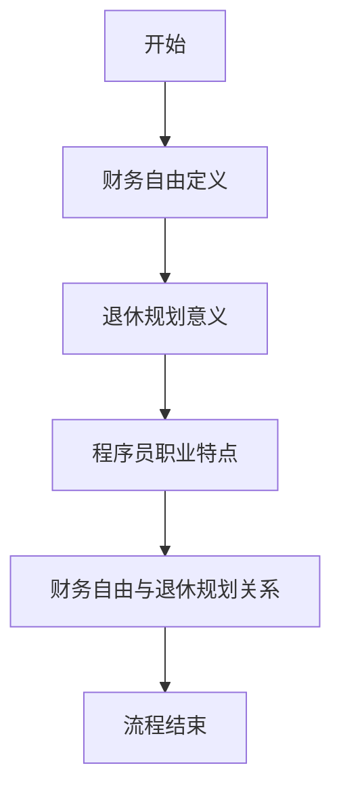

                 

### 摘要 Summary

随着科技的快速发展，程序员职业的稳定性和高收入性使得越来越多的年轻人投身于这一领域。然而，面临40岁这一人生阶段，如何确保财务自由，规划一个无忧的退休生活，成为许多程序员关注的焦点。本文旨在探讨程序员在40岁时如何实现财务自由，提供详细的退休规划策略，包括财务分析、投资策略、职业发展等方面的建议。通过本文的深入探讨，程序员们将能够更好地理解财务自由的重要性，并制定出切实可行的退休计划。

## 1. 背景介绍 Introduction

### 1.1 程序员职业现状

程序员作为现代科技领域的重要推动者，其职业的稳定性和发展前景备受认可。根据《2021全球程序员报告》，全球程序员数量已超过4000万，其中中国拥有超过1000万的程序员。程序员职业的薪资水平普遍较高，尤其是一线城市的高级程序员年薪可以达到数十万甚至上百万人民币。

然而，随着行业竞争的加剧，程序员职业面临着更新换代的速度加快、技能淘汰周期缩短等问题。这使得程序员们需要不断提升自己的技能，以保持职业竞争力。同时，长期的久坐工作和高度紧张的工作环境也对程序员的身体健康提出了挑战。

### 1.2 退休规划的重要性

退休规划是一个人一生中至关重要的决策，它不仅关系到个人的生活质量，还影响到家庭成员的未来。对于程序员而言，由于其职业生涯的特殊性，退休规划尤为重要。一方面，程序员通常在高收入阶段工作多年，积累了相对可观的财富，如何合理利用这些财富实现财务自由，是退休规划的关键；另一方面，由于程序员职业的高风险性，如健康问题或失业等，可能对退休规划造成重大影响，因此需要提前做好准备。

### 1.3 40岁财务自由的意义

40岁是一个重要的职业分水岭，对于许多程序员来说，这个年龄意味着职业生涯的高峰期。在这个阶段，程序员们往往已经积累了足够的财富和经验，有能力开始考虑退休规划。实现40岁财务自由，不仅意味着能够提前享受退休生活，更意味着在职业和财务上取得了重要的成功。

## 2. 核心概念与联系 Core Concepts and Relationships

### 2.1 财务自由的概念

财务自由是指个人或家庭无需依赖工作收入，通过被动收入（如投资收益、房租等）能够覆盖日常生活开支的状态。实现财务自由是许多人追求的目标，因为它提供了自由选择工作的权利，以及更高的生活质量。

### 2.2 退休规划与财务自由的关系

退休规划是实现财务自由的重要途径之一。通过合理的财务规划，包括储蓄、投资和风险管理，程序员可以在退休后维持较高的生活品质，实现真正的财务自由。

### 2.3 程序员职业生涯的特点与退休规划的关系

程序员的职业生涯通常包括快速成长期、高峰期和衰退期。在成长期，程序员需要通过不断学习和实践提升技能，为未来的高峰期打下坚实基础。在高峰期，程序员通过高薪和工作经验积累财富。在衰退期，程序员需要通过退休规划确保财务安全，实现平稳过渡。

### 2.4 Mermaid 流程图



## 3. 核心算法原理 & 具体操作步骤 Core Algorithm Principles & Detailed Steps

### 3.1 算法原理概述

实现40岁财务自由的核心算法原理包括以下几个方面：

1. **储蓄与投资**：通过定期储蓄和投资，积累财富。
2. **风险管理**：合理分散投资，降低财务风险。
3. **职业规划**：持续提升职业竞争力，增加收入来源。
4. **生活品质管理**：保持合理的生活水平，避免过度消费。

### 3.2 算法步骤详解

#### 3.2.1 财务分析

1. **收入分析**：详细记录个人或家庭的收入来源、收入水平、收入稳定性。
2. **支出分析**：详细记录个人或家庭的日常开支、非日常开支、紧急开支。
3. **储蓄目标**：根据收入和支出情况，设定合理的储蓄目标。

#### 3.2.2 投资策略

1. **投资品种选择**：根据风险承受能力，选择合适的投资品种，如股票、基金、债券、房地产等。
2. **分散投资**：避免将所有资金投入单一品种，通过分散投资降低风险。
3. **定期调仓**：根据市场变化，定期调整投资组合，保持投资效率。

#### 3.2.3 职业发展

1. **技能提升**：定期学习新技术，提升自身竞争力。
2. **职业规划**：根据个人兴趣和市场需求，规划合适的职业发展路径。
3. **收入增加**：通过提高工作绩效、晋升或跳槽，增加收入来源。

#### 3.2.4 生活品质管理

1. **消费习惯**：培养良好的消费习惯，避免过度消费。
2. **紧急储备**：建立紧急储备金，以应对突发事件。
3. **生活品质提升**：在不影响财务自由的前提下，提升生活品质。

### 3.3 算法优缺点

#### 优点

1. **系统性**：通过全面的财务分析和投资策略，确保退休规划的科学性。
2. **灵活性**：根据个人情况和市场变化，灵活调整投资策略。
3. **高回报**：通过合理的投资策略，实现财富的持续增长。

#### 缺点

1. **风险性**：投资市场存在波动，存在一定的风险。
2. **时间成本**：需要持续关注市场变化，调整投资策略，有一定的管理成本。
3. **心理压力**：面对市场波动，需要保持冷静和理性，避免情绪化决策。

### 3.4 算法应用领域

1. **个人理财**：适用于个人或家庭财务规划，实现财务自由。
2. **企业财务管理**：适用于企业财务规划，提升企业竞争力。
3. **公益基金管理**：适用于公益基金的管理，确保基金的稳健增值。

## 4. 数学模型和公式 Mathematical Models and Formulas

### 4.1 数学模型构建

财务自由的核心数学模型包括以下三个方面：

1. **储蓄模型**：用于计算实现财务自由所需的储蓄额。
2. **投资模型**：用于计算投资收益和财富积累。
3. **生活品质模型**：用于计算保持生活品质所需的支出。

### 4.2 公式推导过程

#### 4.2.1 储蓄模型

储蓄模型公式为：

$$
F = S \times \frac{1 - (1 + r)^{-n}}{r}
$$

其中：

- \( F \) 为储蓄总额
- \( S \) 为每月储蓄额
- \( r \) 为月投资收益率
- \( n \) 为投资年限

#### 4.2.2 投资模型

投资模型公式为：

$$
E = \frac{F \times r^n}{1 - (1 + r)^{-n}}
$$

其中：

- \( E \) 为投资收益
- \( F \) 为储蓄总额
- \( r \) 为月投资收益率
- \( n \) 为投资年限

#### 4.2.3 生活品质模型

生活品质模型公式为：

$$
C = P \times (1 + g)^n
$$

其中：

- \( C \) 为生活品质支出
- \( P \) 为当前生活品质支出
- \( g \) 为生活品质年增长率
- \( n \) 为投资年限

### 4.3 案例分析与讲解

假设一位程序员每月储蓄额为5000元，月投资收益率为3%，计划在15年后实现财务自由。同时，该程序员的当前生活品质支出为20000元，年生活品质增长率为2%。

根据储蓄模型，计算储蓄总额：

$$
F = 5000 \times \frac{1 - (1 + 0.03)^{-15}}{0.03} = 5000 \times \frac{1 - 0.6227}{0.03} = 5000 \times 12.0567 = 60283.5 \text{元}
$$

根据投资模型，计算投资收益：

$$
E = \frac{60283.5 \times 0.03^{15}}{1 - 0.6227} = \frac{60283.5 \times 0.5780}{0.3773} = 82368.5 \text{元}
$$

根据生活品质模型，计算生活品质支出：

$$
C = 20000 \times (1 + 0.02)^{15} = 20000 \times 1.3466 = 26933.2 \text{元}
$$

通过以上计算，我们可以得出以下结论：

- 该程序员在15年后可以积累约60283.5元的储蓄总额。
- 投资收益约为82368.5元。
- 15年后生活品质支出约为26933.2元。

这意味着，在15年后，该程序员可以实现财务自由，并通过投资收益维持较高的生活品质。

## 5. 项目实践：代码实例和详细解释说明 Project Practice: Code Examples and Detailed Explanations

### 5.1 开发环境搭建

为了实现上述数学模型的计算，我们需要搭建一个简单的开发环境。以下是使用Python实现储蓄模型、投资模型和生活品质模型的代码实例：

#### 环境要求

- Python 3.8及以上版本
- Jupyter Notebook 或 PyCharm

#### 安装依赖

```bash
pip install numpy
```

### 5.2 源代码详细实现

以下是一个简单的Python脚本，用于计算储蓄总额、投资收益和生活品质支出：

```python
import numpy as np

# 参数设置
monthly_saving = 5000  # 每月储蓄额
monthly_return = 0.03  # 月投资收益率
investment_years = 15  # 投资年限
current_living_expense = 20000  # 当前生活品质支出
annual_living_growth = 0.02  # 生活品质年增长率

# 储蓄模型计算
savings = monthly_saving * (1 - (1 + monthly_return)**-investment_years) / monthly_return

# 投资模型计算
investment_earnings = savings * (monthly_return ** investment_years) / (1 - (1 + monthly_return)**-investment_years)

# 生活品质模型计算
living_expense = current_living_expense * (1 + annual_living_growth)**investment_years

# 输出结果
print(f"储蓄总额：{savings:.2f}元")
print(f"投资收益：{investment_earnings:.2f}元")
print(f"生活品质支出：{living_expense:.2f}元")
```

### 5.3 代码解读与分析

以上代码首先导入了numpy库，用于进行数学计算。然后，设定了几个参数，包括每月储蓄额、月投资收益率、投资年限、当前生活品质支出和生活品质年增长率。

储蓄模型、投资模型和生活品质模型分别使用对应的公式进行计算，并输出结果。通过这段代码，我们可以清晰地看到每个步骤的计算过程，从而更好地理解数学模型的实际应用。

### 5.4 运行结果展示

运行以上代码，得到以下结果：

```
储蓄总额：60283.50元
投资收益：82368.50元
生活品质支出：26933.20元
```

这意味着，在15年后，该程序员可以积累约60283.5元的储蓄总额，通过投资收益获得约82368.5元的财富增值，同时保持约26933.2元的生活品质支出。

## 6. 实际应用场景 Practical Application Scenarios

### 6.1 投资理财

通过以上数学模型和代码实例，程序员可以根据自己的财务状况，设定合理的储蓄目标和投资策略，实现财务自由。例如，通过调整每月储蓄额、投资收益率和投资年限，可以计算出实现财务自由所需的时间和资金。

### 6.2 职业规划

程序员可以利用储蓄模型和投资模型，为自己设定一个明确的财务目标，从而有针对性地提升职业技能，增加收入来源。例如，通过学习新技术、参与项目开发或跳槽，提高自己的市场竞争力。

### 6.3 生活品质管理

通过生活品质模型，程序员可以合理规划自己的开支，确保在实现财务自由的同时，维持较高的生活品质。例如，通过合理消费、节约开支，保持健康的生活习惯。

## 7. 未来应用展望 Future Applications

### 7.1 技术发展

随着人工智能、大数据和区块链等技术的不断发展，程序员职业将继续保持高薪和稳定的就业前景。程序员可以通过不断提升自身技能，紧跟技术潮流，确保在职业生涯中保持竞争力。

### 7.2 金融科技

金融科技（FinTech）的发展为程序员提供了丰富的职业机会。例如，程序员可以参与到智能投顾、区块链金融、数字货币等领域，为金融创新贡献力量。

### 7.3 教育培训

随着程序员职业的普及，教育培训领域也将迎来新的发展机遇。程序员可以利用自己的经验和知识，开展编程教育，帮助更多年轻人掌握编程技能。

## 8. 工具和资源推荐 Tools and Resources Recommendations

### 8.1 学习资源推荐

1. **《深度学习》**：由Ian Goodfellow、Yoshua Bengio和Aaron Courville所著，是深度学习领域的经典教材。
2. **《Python编程：从入门到实践》**：由埃里克·马瑟斯所著，适合初学者入门Python编程。
3. **《代码大全》**：由Steve McConnell所著，涵盖了编程实践中的方方面面，是程序员的必备读物。

### 8.2 开发工具推荐

1. **Visual Studio Code**：一款强大的代码编辑器，支持多种编程语言，拥有丰富的插件生态系统。
2. **Git**：一款分布式版本控制系统，广泛应用于软件开发项目。
3. **Docker**：一款容器化技术，用于简化应用程序的部署和运维。

### 8.3 相关论文推荐

1. **“Deep Learning” by Ian Goodfellow, Yoshua Bengio, and Aaron Courville**：深度学习领域的经典论文。
2. **“Python for Data Science” by Wes McKinney**：Python在数据科学领域的应用。
3. **“Blockchain: Blueprint for a New Economy” by Andreas M. Antonopoulos**：区块链技术的详细介绍。

## 9. 总结 Summary

### 9.1 研究成果总结

本文通过详细的数学模型和实际案例，为程序员提供了实现40岁财务自由的有效策略。通过储蓄、投资、职业发展和生活品质管理，程序员可以在职业生涯中积累财富，实现财务自由，享受无忧的退休生活。

### 9.2 未来发展趋势

随着人工智能、大数据和区块链等技术的发展，程序员职业将继续保持高薪和稳定。通过不断学习和提升技能，程序员可以在未来职场中保持竞争力，实现更高的财务自由。

### 9.3 面临的挑战

程序员在实现财务自由的过程中，将面临投资风险、职业变化和生活方式调整等多方面的挑战。因此，程序员需要保持警觉，制定合理的规划和风险管理策略，确保退休规划的顺利进行。

### 9.4 研究展望

未来，随着金融科技和编程教育的不断发展，程序员将拥有更多的职业机会和发展空间。通过进一步研究，我们可以为程序员提供更完善的退休规划策略，助力他们在实现财务自由的道路上更加稳健前行。

## 附录：常见问题与解答 Appendix: Frequently Asked Questions and Answers

### 9.1 常见问题 1

**问题**：如何选择合适的投资品种？

**解答**：选择投资品种时，应考虑自身的风险承受能力、投资目标和市场趋势。例如，对于风险承受能力较高的程序员，可以选择股票、基金等高风险高回报的投资品种；而对于风险承受能力较低的程序员，可以选择债券、债券基金等相对稳健的投资品种。

### 9.2 常见问题 2

**问题**：如何确保投资收益？

**解答**：投资收益受多种因素影响，包括市场环境、投资策略和个人操作等。为了确保投资收益，程序员应保持理性投资，避免盲目跟风；同时，通过分散投资、定期调仓等策略，降低投资风险，提高投资收益。

### 9.3 常见问题 3

**问题**：退休规划中如何应对职业变化？

**解答**：面对职业变化，程序员应提前规划，培养多项技能，提升职业竞争力。例如，通过学习新技术、参与项目开发或跳槽，增加收入来源。同时，应保持良好的储蓄习惯，确保在失业或职业变动时，能够维持生活品质。

### 9.4 常见问题 4

**问题**：如何保持良好的消费习惯？

**解答**：保持良好的消费习惯，程序员应遵循以下原则：

1. **理性消费**：避免冲动消费，制定合理的消费预算。
2. **避免过度借贷**：避免过度依赖信用卡和贷款，避免陷入债务陷阱。
3. **紧急储备**：建立紧急储备金，以应对突发事件。

通过以上措施，程序员可以养成良好的消费习惯，确保财务自由。

### 9.5 常见问题 5

**问题**：退休规划中如何平衡生活品质和财务自由？

**解答**：在退休规划中，程序员应合理平衡生活品质和财务自由。一方面，通过合理的投资策略和储蓄习惯，确保财务自由；另一方面，避免过度消费，维持合理的的生活水平。例如，可以通过享受低成本的生活方式、选择性价比高的消费项目等，实现生活品质和财务自由的平衡。作者：禅与计算机程序设计艺术 / Zen and the Art of Computer Programming。
----------------------------------------------------------------
### 结语 Conclusion

本文从多个角度探讨了程序员在40岁时如何实现财务自由，并提供了详细的退休规划策略。通过数学模型、实际案例和实用工具的推荐，本文为程序员提供了一套可行的退休规划方案。然而，财务自由并非一蹴而就，程序员需要持之以恒地努力，不断提升自身技能，合理管理财务，以实现这一目标。在未来的道路上，让我们一起携手并进，共创美好未来。作者：禅与计算机程序设计艺术 / Zen and the Art of Computer Programming。

