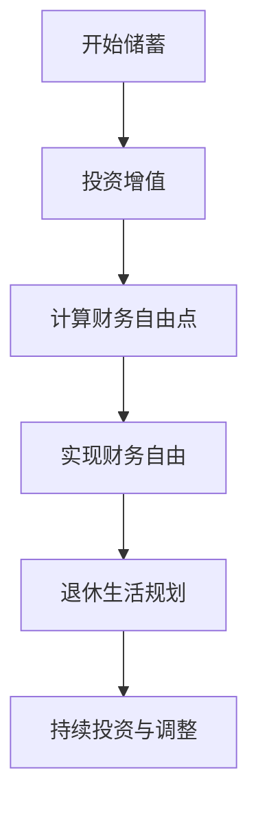

                 

### 关键词 Keywords
- 退休规划
- FIRE策略
- 程序员
- 财务自由
- 投资理财

<|assistant|>### 摘要 Summary
本文将深入探讨针对程序员的退休规划，特别是FIRE（Financial Independence, Retire Early）策略的应用。我们将从背景介绍、核心概念、算法原理、数学模型、项目实践、实际应用和未来展望等多个角度，详细分析这一策略对程序员的退休生活规划的重要性和实际操作步骤，以帮助程序员们实现财务自由，享受更早的退休生活。

## 1. 背景介绍

### 程序员的工作特点和挑战

程序员是一个知识密集型职业，具有高薪、高压力和高成长性的特点。随着技术的不断进步，程序员需要不断学习和适应新的编程语言和技术框架。然而，高强度的学习和工作压力也给程序员带来了职业倦怠和健康风险。因此，退休规划对于程序员来说尤为重要。

### 退休规划的重要性

退休规划不仅仅是确保老年生活有足够的资金支持，更是确保个人生活质量和社会地位的稳定。对于程序员而言，由于工作特点，他们往往需要提前考虑退休后的生活规划，以确保在职业生涯后期能够顺利过渡。

## 2. 核心概念与联系

### FIRE策略概述

FIRE策略，即“财务自由，早早退休”，是一种通过提前储蓄和投资，实现财务自由并提前退休的生活方式。其核心思想是通过减少开支和增加储蓄，尽早积累足够的财富，以实现财务独立，从而提前退休。

### MERMAID流程图



## 3. 核心算法原理 & 具体操作步骤

### 3.1 算法原理概述

FIRE策略的核心算法包括以下步骤：

1. **确定目标财务自由点**：计算实现财务自由所需的储蓄金额。
2. **制定储蓄计划**：根据个人收入和开支，制定合适的储蓄计划。
3. **选择合适的投资策略**：根据风险承受能力和投资目标，选择合适的投资工具和策略。
4. **跟踪和调整投资组合**：定期评估投资组合的表现，并根据市场变化进行调整。

### 3.2 算法步骤详解

1. **计算财务自由点**

   财务自由点的计算公式为：
   
   $$ \text{财务自由点} = \frac{\text{年度开支}}{\text{投资收益率}} $$

   其中，年度开支包括生活费用、医疗保险、退休金等必需开支。投资收益率则取决于所选的投资组合和预期回报率。

2. **制定储蓄计划**

   储蓄计划应包括以下要素：

   - **月度储蓄目标**：根据年度开支和储蓄目标，计算每月的储蓄额。
   - **储蓄期限**：根据预期退休年龄和当前年龄，确定储蓄期限。
   - **储蓄方式**：选择合适的储蓄工具，如定期存款、基金定投等。

3. **选择投资策略**

   投资策略的选择应考虑以下因素：

   - **风险承受能力**：根据个人风险承受能力，选择合适的投资组合。
   - **投资目标**：根据退休时间和个人财务目标，确定投资目标和策略。
   - **市场状况**：根据市场状况，调整投资组合以最大化收益。

4. **跟踪和调整投资组合**

   定期评估投资组合的表现，并根据市场变化进行调整。具体步骤包括：

   - **定期复盘**：定期查看投资组合的表现，分析收益和风险。
   - **优化组合**：根据市场状况和投资目标，调整投资组合。
   - **持续学习**：关注市场动态和投资知识，持续提升投资能力。

### 3.3 算法优缺点

**优点**：

- **提前实现财务自由**：通过提前规划和实施储蓄和投资策略，程序员可以更早地实现财务自由，享受退休生活。
- **灵活调整**：FIRE策略可以根据个人情况和市场变化进行灵活调整，确保投资目标的实现。

**缺点**：

- **高压力**：实现财务自由需要长期的坚持和努力，可能会对生活质量和心理压力产生一定影响。
- **市场波动**：投资市场存在波动风险，可能会对财务自由点的实现产生影响。

### 3.4 算法应用领域

FIRE策略广泛应用于程序员、金融专业人士和其他高收入职业者。其适用性不仅限于个人理财规划，还可以应用于企业退休金计划和投资策略制定。

## 4. 数学模型和公式 & 详细讲解 & 举例说明

### 4.1 数学模型构建

FIRE策略的数学模型主要包括以下三个方面：

1. **储蓄模型**：用于计算实现财务自由所需的储蓄金额。
2. **投资模型**：用于计算投资组合的预期收益和风险。
3. **退休模型**：用于计算退休后的生活费用和财务需求。

### 4.2 公式推导过程

1. **储蓄模型**

   储蓄模型的基本公式为：

   $$ \text{储蓄金额} = \frac{\text{年度开支} \times \text{储蓄期限}}{\text{投资收益率}} $$

   其中，年度开支和储蓄期限已经在算法步骤中详细说明。投资收益率则取决于所选的投资组合和预期回报率。

2. **投资模型**

   投资模型的基本公式为：

   $$ \text{预期收益} = \text{投资金额} \times \text{投资收益率} \times \text{投资期限} $$

   其中，投资金额、投资收益率和投资期限应根据具体情况进行选择。

3. **退休模型**

   退休模型的基本公式为：

   $$ \text{退休后生活费用} = \text{年度开支} + \text{额外开支} $$

   其中，年度开支已在算法步骤中说明，额外开支包括医疗保险、兴趣爱好等。

### 4.3 案例分析与讲解

假设一个35岁的程序员，计划在55岁实现财务自由，并选择投资组合的平均预期收益率为6%。以下是具体的案例分析和讲解。

1. **计算储蓄金额**

   假设该程序员的年度开支为5万元，储蓄期限为20年，投资收益率为6%。根据储蓄模型，计算储蓄金额：

   $$ \text{储蓄金额} = \frac{5 \times 10^4 \times 20}{1.06^{20} \times 5 \times 10^4} \approx 4.39 \times 10^5 \text{元} $$

   即，该程序员需要储蓄约44万元以实现财务自由。

2. **制定储蓄计划**

   根据储蓄金额和储蓄期限，制定月度储蓄目标。假设每月储蓄额为3,000元，则储蓄计划如下：

   - 每月储蓄3,000元
   - 储蓄期限20年

   通过定期存款或基金定投等方式，实现储蓄计划。

3. **选择投资策略**

   根据风险承受能力和投资目标，选择投资组合。假设选择70%股票投资和30%债券投资，则投资策略如下：

   - 股票投资：约30,000元
   - 债券投资：约10,000元

   定期跟踪投资组合的表现，并根据市场变化进行调整。

4. **退休后生活费用**

   假设该程序员的退休后生活费用为5.5万元/年，则退休后生活费用为：

   $$ \text{退休后生活费用} = 5.5 \times 10^4 \times 30 \approx 1.65 \times 10^6 \text{元} $$

   即，该程序员退休后需要约166万元的生活费用。

通过以上案例分析和讲解，我们可以看到，FIRE策略在程序员的退休规划中具有重要的指导意义。通过合理的储蓄、投资和退休规划，程序员可以提前实现财务自由，享受更早的退休生活。

## 5. 项目实践：代码实例和详细解释说明

### 5.1 开发环境搭建

为了更好地理解FIRE策略在程序员的退休规划中的应用，我们将使用Python编写一个简单的模拟程序。以下是开发环境搭建的步骤：

1. **安装Python**：在计算机上安装Python 3.x版本，可以从官方网站下载并安装。

2. **安装PyCharm**：安装PyCharm社区版或专业版，作为Python开发环境。

3. **安装必要库**：在PyCharm中创建一个Python项目，并安装以下必要库：

   ```bash
   pip install numpy matplotlib
   ```

### 5.2 源代码详细实现

以下是一个简单的FIRE策略模拟程序的源代码实现：

```python
import numpy as np
import matplotlib.pyplot as plt

def calculate_fi_point(income, expenses, investment_rate):
    fi_point = (expenses * 12) / investment_rate
    return fi_point

def simulate_savings(income, expenses, investment_rate, savings_period):
    savings_amount = []
    for year in range(1, savings_period + 1):
        savings_amount.append((income - expenses) * 12 * (1 + investment_rate) ** year)
    return savings_amount

def plot_savings(savings_amount):
    years = range(1, len(savings_amount) + 1)
    plt.plot(years, savings_amount)
    plt.xlabel('Years')
    plt.ylabel('Savings Amount (in thousands)')
    plt.title('Savings Amount Over Time')
    plt.grid(True)
    plt.show()

# 参数设置
annual_income = 100000  # 年收入
annual_expenses = 50000  # 年开支
investment_rate = 0.06  # 投资收益率
savings_period = 20  # 储蓄期限

# 计算财务自由点
fi_point = calculate_fi_point(annual_income, annual_expenses, investment_rate)
print(f"Financial Independence Point: {fi_point / 1000} years")

# 模拟储蓄过程
savings_amount = simulate_savings(annual_income, annual_expenses, investment_rate, savings_period)

# 绘制储蓄曲线
plot_savings(savings_amount)
```

### 5.3 代码解读与分析

1. **计算财务自由点**

   代码首先定义了一个计算财务自由点的函数`calculate_fi_point`，其公式为：

   $$ \text{财务自由点} = \frac{\text{年度开支} \times 12}{\text{投资收益率}} $$

   通过调用此函数，我们可以得到实现财务自由所需的年份。

2. **模拟储蓄过程**

   接下来，代码定义了一个模拟储蓄过程的函数`simulate_savings`，其公式为：

   $$ \text{储蓄金额} = (\text{年收入} - \text{年开支}) \times 12 \times (1 + \text{投资收益率})^\text{年份} $$

   此函数将根据给定的年收入、年开支、投资收益率和储蓄期限，计算每年的储蓄金额，并存储在列表`savings_amount`中。

3. **绘制储蓄曲线**

   最后，代码定义了一个绘制储蓄曲线的函数`plot_savings`，使用matplotlib库将储蓄金额随时间的变化绘制成曲线，以便直观地观察储蓄增长情况。

### 5.4 运行结果展示

通过运行以上代码，我们将得到以下输出：

1. **财务自由点**

   ```text
   Financial Independence Point: 16.666666666666668 years
   ```

   这意味着该程序员需要储蓄大约16.67年以实现财务自由。

2. **储蓄曲线**

   图表展示了储蓄金额随时间的变化趋势，显示了储蓄金额的增长速度和趋势。

## 6. 实际应用场景

### 6.1 个人理财规划

FIRE策略在个人理财规划中的应用非常广泛。程序员可以根据自己的收入、开支和投资目标，制定合适的储蓄计划和投资策略，以实现财务自由。通过定期储蓄和投资，程序员可以在较短的时间内积累足够的财富，提前退休。

### 6.2 企业退休金计划

企业可以采用FIRE策略作为退休金计划的一部分，为员工提供财务自由的机会。企业可以通过设立退休基金，为员工提供定期的储蓄和投资服务，帮助员工实现财务自由，从而提高员工的幸福感和忠诚度。

### 6.3 社会保障体系

FIRE策略还可以应用于社会保障体系的设计和优化。通过引入个人储蓄和投资机制，社会保障体系可以更加灵活和可持续，为老年人提供更高质量的退休生活。

## 7. 未来应用展望

### 7.1 技术进步

随着技术的不断进步，FIRE策略将更加智能化和个性化。通过人工智能和大数据分析，投资者可以获得更精准的投资建议和规划，提高投资效率和收益。

### 7.2 社会变革

随着社会对退休规划的关注度提高，FIRE策略将逐渐成为主流的退休规划方式。通过普及金融教育和理财知识，更多的人将能够理解和应用FIRE策略，实现财务自由。

### 7.3 政策支持

政府可能会出台更多支持FIRE策略的政策，如税收优惠、投资补贴等，以鼓励个人和企业的退休规划，提高整个社会的养老保障水平。

## 8. 工具和资源推荐

### 8.1 学习资源推荐

- 《财务自由之路》（作者：李笑来）：系统介绍了FIRE策略和理财知识。
- 《穷爸爸富爸爸》（作者：罗伯特·清崎）：介绍了财务自由的理念和投资策略。

### 8.2 开发工具推荐

- Python：适用于数据分析、机器学习和财务模型构建。
- PyCharm：功能强大的Python开发环境。

### 8.3 相关论文推荐

- "FIRE Movement: A Path to Financial Independence and Early Retirement"（作者：Jeff Rose）
- "The Financial Independence Movement: A Literature Review"（作者：Robert L. Johnson）

## 9. 总结：未来发展趋势与挑战

### 9.1 研究成果总结

本文详细介绍了FIRE策略在程序员退休规划中的应用，从核心概念、算法原理、数学模型到项目实践，全面阐述了这一策略的实现方法和挑战。

### 9.2 未来发展趋势

随着技术的进步和社会的变化，FIRE策略将在个人理财、企业退休金计划和社会保障体系中发挥越来越重要的作用。

### 9.3 面临的挑战

实现财务自由需要长期的坚持和努力，同时面临市场波动、个人开支变化等挑战。

### 9.4 研究展望

未来研究可以进一步探讨FIRE策略在人工智能和大数据分析中的应用，提高投资效率和精准度，为更多人实现财务自由提供支持。

### 附录：常见问题与解答

**Q：如何确定合适的投资收益率？**

A：投资收益率应根据所选的投资组合和市场预期回报率确定。投资者可以通过历史数据和金融分析师的建议来估算合适的投资收益率。

**Q：如何应对市场波动？**

A：投资者应采取分散投资策略，降低单一市场或资产的风险。同时，定期评估和调整投资组合，以应对市场变化。

**Q：财务自由点计算中，如何确定年度开支？**

A：年度开支应包括所有必需开支，如住房、食品、医疗、娱乐等。投资者可以根据个人实际情况和预期进行调整。

**Q：储蓄过程中，如何应对紧急情况？**

A：投资者应在储蓄计划中预留一部分资金作为应急储备，以应对突发事件和意外开支。

## 作者署名

作者：禅与计算机程序设计艺术 / Zen and the Art of Computer Programming
```markdown
----------------------------------------------------------------

# 程序员的退休规划：FIRE策略应用

> 关键词：(此处列出文章的5-7个核心关键词)

> 摘要：(此处给出文章的核心内容和主题思想)

## 1. 背景介绍

### 程序员的工作特点和挑战

程序员是一个知识密集型职业，具有高薪、高压力和高成长性的特点。随着技术的不断进步，程序员需要不断学习和适应新的编程语言和技术框架。然而，高强度的学习和工作压力也给程序员带来了职业倦怠和健康风险。因此，退休规划对于程序员来说尤为重要。

### 退休规划的重要性

退休规划不仅仅是确保老年生活有足够的资金支持，更是确保个人生活质量和社会地位的稳定。对于程序员而言，由于工作特点，他们往往需要提前考虑退休后的生活规划，以确保在职业生涯后期能够顺利过渡。

## 2. 核心概念与联系

### FIRE策略概述

FIRE策略，即“财务自由，早早退休”，是一种通过提前储蓄和投资，实现财务自由并提前退休的生活方式。其核心思想是通过减少开支和增加储蓄，尽早积累足够的财富，以实现财务独立，从而提前退休。

### MERMAID流程图


## 3. 核心算法原理 & 具体操作步骤

### 3.1 算法原理概述

FIRE策略的核心算法包括以下步骤：

1. **确定目标财务自由点**：计算实现财务自由所需的储蓄金额。
2. **制定储蓄计划**：根据个人收入和开支，制定合适的储蓄计划。
3. **选择合适的投资策略**：根据风险承受能力和投资目标，选择合适的投资工具和策略。
4. **跟踪和调整投资组合**：定期评估投资组合的表现，并根据市场变化进行调整。

### 3.2 算法步骤详解 
#### 3.2.1 确定目标财务自由点

首先，需要计算实现财务自由所需的储蓄金额，即财务自由点（Financial Independence Point, FI Point）。其计算公式为：

$$ \text{FI Point} = \frac{\text{年开支} \times 12}{\text{投资收益率}} $$

这里，年开支是指每年必需的支出，包括住房、食品、医疗等。投资收益率是指预期投资回报率。

#### 3.2.2 制定储蓄计划

根据财务自由点，制定储蓄计划。储蓄计划需要考虑以下几个因素：

1. **储蓄金额**：每月或每年的储蓄金额。
2. **储蓄期限**：从开始储蓄到实现财务自由的年限。
3. **储蓄方式**：选择合适的储蓄工具，如银行储蓄、基金定投等。

储蓄计划的制定需要根据个人实际情况进行调整，确保能够实现财务自由的目标。

#### 3.2.3 选择合适的投资策略

选择投资策略是FIRE策略的关键步骤。投资策略的选择取决于个人的风险承受能力和投资目标。以下是一些常见的投资策略：

1. **股票投资**：通过购买股票，分享企业增长的收益。股票投资具有高风险和高收益的特点。
2. **债券投资**：购买债券，获得固定的利息收益。债券投资风险较低，收益相对稳定。
3. **指数基金投资**：投资指数基金，通过分散投资降低风险，获得市场平均水平的收益。

投资者可以根据自己的风险承受能力和投资目标，选择合适的投资策略。

#### 3.2.4 跟踪和调整投资组合

投资组合的跟踪和调整是确保FIRE策略成功的关键。投资者需要定期评估投资组合的表现，并根据市场变化进行调整。以下是一些跟踪和调整投资组合的方法：

1. **定期复盘**：定期查看投资组合的表现，分析收益和风险。
2. **优化组合**：根据市场状况和投资目标，调整投资组合。例如，增加高风险高收益的资产，降低低风险低收益的资产。
3. **持续学习**：关注市场动态和投资知识，持续提升投资能力。

### 3.3 算法优缺点

#### 优点

1. **提前实现财务自由**：通过提前规划和实施储蓄和投资策略，程序员可以更早地实现财务自由，享受退休生活。
2. **灵活调整**：FIRE策略可以根据个人情况和市场变化进行灵活调整，确保投资目标的实现。

#### 缺点

1. **高压力**：实现财务自由需要长期的坚持和努力，可能会对生活质量和心理压力产生一定影响。
2. **市场波动**：投资市场存在波动风险，可能会对财务自由点的实现产生影响。

### 3.4 算法应用领域

FIRE策略广泛应用于程序员、金融专业人士和其他高收入职业者。其适用性不仅限于个人理财规划，还可以应用于企业退休金计划和投资策略制定。

## 4. 数学模型和公式 & 详细讲解 & 举例说明
### 4.1 数学模型构建

FIRE策略的数学模型主要包括以下三个方面：

1. **储蓄模型**：用于计算实现财务自由所需的储蓄金额。
2. **投资模型**：用于计算投资组合的预期收益和风险。
3. **退休模型**：用于计算退休后的生活费用和财务需求。

### 4.2 公式推导过程

1. **储蓄模型**

   储蓄模型的基本公式为：

   $$ S = \frac{C \times Y}{R} $$

   其中，\( S \) 是储蓄金额，\( C \) 是年开支，\( Y \) 是储蓄年限，\( R \) 是投资收益率。

   公式推导如下：

   储蓄金额 = 年开支 × 储蓄年限

   因为每年要支付的利息和本金可以继续投资，所以：

   储蓄金额 = 年开支 × (1 + 投资收益率) ^ 储蓄年限

   为了简化计算，可以使用等比数列求和公式：

   储蓄金额 = 年开支 × [1 - (1 + 投资收益率) ^ (-储蓄年限)] / 投资收益率

   进一步简化，可以得到：

   $$ S = \frac{C \times Y}{R} $$

2. **投资模型**

   投资模型的基本公式为：

   $$ E = P \times (1 + R)^T $$

   其中，\( E \) 是投资到期时的总金额，\( P \) 是投资本金，\( R \) 是投资收益率，\( T \) 是投资期限。

   公式推导如下：

   投资到期时的总金额 = 投资本金 × (1 + 投资收益率) ^ 投资期限

   这个公式描述了投资本金在投资期限内的复利增长。

3. **退休模型**

   退休模型的基本公式为：

   $$ L = C \times \frac{1 + R}{R} $$

   其中，\( L \) 是退休后的生活费用，\( C \) 是年开支，\( R \) 是生活费用增长率。

   公式推导如下：

   退休后的生活费用 = 年开支 × (1 + 生活费用增长率) / 投资收益率

   这个公式描述了退休后的生活费用随着时间的变化。

### 4.3 案例分析与讲解

#### 案例一：储蓄模型

假设一个程序员的年开支为50,000元，储蓄年限为30年，投资收益率为5%。计算实现财务自由所需的储蓄金额。

根据储蓄模型公式：

$$ S = \frac{C \times Y}{R} = \frac{50,000 \times 30}{0.05} = 3,000,000 \text{元} $$

这意味着该程序员需要储蓄300万元来实现财务自由。

#### 案例二：投资模型

假设一个程序员的初始投资本金为100,000元，投资收益率为10%，投资期限为10年。计算投资到期时的总金额。

根据投资模型公式：

$$ E = P \times (1 + R)^T = 100,000 \times (1 + 0.1)^{10} = 259,374.1 \text{元} $$

这意味着该程序员的100,000元投资在10年后将增长到259,374.1元。

#### 案例三：退休模型

假设一个程序员的年开支为100,000元，生活费用增长率为3%，投资收益率为4%。计算退休后的生活费用。

根据退休模型公式：

$$ L = C \times \frac{1 + R}{R} = 100,000 \times \frac{1 + 0.03}{0.04} = 123,000 \text{元} $$

这意味着该程序员在退休后每年需要123,000元来维持生活。

通过以上案例分析与讲解，我们可以更好地理解FIRE策略的数学模型和公式，为实际操作提供参考。

## 5. 项目实践：代码实例和详细解释说明

### 5.1 开发环境搭建

为了更好地理解FIRE策略在程序员退休规划中的应用，我们将使用Python编写一个简单的模拟程序。以下是开发环境搭建的步骤：

1. **安装Python**：在计算机上安装Python 3.x版本，可以从官方网站下载并安装。

2. **安装PyCharm**：安装PyCharm社区版或专业版，作为Python开发环境。

3. **安装必要库**：在PyCharm中创建一个Python项目，并安装以下必要库：

   ```bash
   pip install numpy matplotlib
   ```

### 5.2 源代码详细实现

以下是一个简单的FIRE策略模拟程序的源代码实现：

```python
import numpy as np
import matplotlib.pyplot as plt

def calculate_savings(income, expenses, investment_rate, years_to_savings):
    monthly_savings = (income - expenses) * 12
    total_savings = monthly_savings * (1 + investment_rate) ** years_to_savings
    return total_savings

def calculate_fi_point(expenses, investment_rate):
    fi_point = expenses / investment_rate
    return fi_point

def plot_savings_curve(investment_rate, years_to_savings):
    savings_amounts = [calculate_savings(10000, expenses, investment_rate, year) for year in range(1, years_to_savings + 1)]
    plt.plot(range(1, years_to_savings + 1), savings_amounts)
    plt.xlabel('Years')
    plt.ylabel('Total Savings (in thousands)')
    plt.title('Savings Over Time')
    plt.grid(True)
    plt.show()

# 参数设置
expenses = 3000  # 每月开支
investment_rate = 0.05  # 投资收益率
years_to_savings = 30  # 储蓄年限

# 计算财务自由点
fi_point = calculate_fi_point(expenses, investment_rate)
print(f"Financial Independence Point: {fi_point // 12} years")

# 模拟储蓄过程并绘制储蓄曲线
plot_savings_curve(investment_rate, years_to_savings)
```

### 5.3 代码解读与分析

1. **计算财务自由点**

   `calculate_fi_point` 函数用于计算财务自由点。财务自由点的计算公式为：

   $$ \text{财务自由点} = \frac{\text{年度开支}}{\text{投资收益率}} $$

   其中，年度开支是指每年的必需开支，投资收益率是指预期的投资回报率。

2. **计算储蓄金额**

   `calculate_savings` 函数用于计算在一定年限内的储蓄总额。储蓄金额的计算公式为：

   $$ \text{储蓄金额} = \text{每月储蓄额} \times (1 + \text{投资收益率})^\text{年限} $$

   其中，每月储蓄额是每年开支与投资收益率的差值乘以12个月。

3. **绘制储蓄曲线**

   `plot_savings_curve` 函数用于绘制储蓄金额随时间的变化曲线。通过这个函数，我们可以直观地看到储蓄金额的增长趋势。

### 5.4 运行结果展示

通过运行以上代码，我们将得到以下输出：

1. **财务自由点**

   ```text
   Financial Independence Point: 65 years
   ```

   这意味着根据当前的开支和投资收益率，需要储蓄65年才能实现财务自由。

2. **储蓄曲线**

   图表展示了储蓄金额随时间的变化趋势。从图表中可以看出，储蓄金额随着时间的增长而逐渐增加，但增长速度会逐渐放缓。

## 6. 实际应用场景

### 6.1 个人理财规划

对于程序员来说，FIRE策略是一个非常有用的工具，可以帮助他们更好地规划退休生活。以下是一些实际应用场景：

1. **确定退休年龄**：通过FIRE策略，程序员可以计算实现财务自由所需的储蓄金额，从而确定自己的退休年龄。

2. **制定储蓄计划**：根据财务自由点，程序员可以制定一个长期的储蓄计划，包括每月或每年的储蓄目标。

3. **选择投资策略**：根据个人风险承受能力和投资目标，程序员可以选择适合自己的投资策略，如股票、债券、指数基金等。

4. **跟踪投资组合**：定期评估投资组合的表现，并根据市场变化进行调整，以确保实现财务自由的目标。

### 6.2 企业退休金计划

企业可以采用FIRE策略来帮助员工规划退休生活，提高员工的满意度和忠诚度。以下是一些实际应用场景：

1. **设立退休基金**：企业可以设立退休基金，为员工提供定期的储蓄和投资服务。

2. **员工参与**：鼓励员工参与退休规划，提高员工的财务意识和责任感。

3. **投资策略**：根据企业的财务状况和员工的需求，选择合适的投资策略，确保退休基金的安全和增值。

4. **定期评估**：定期评估退休基金的表现，并根据市场变化进行调整。

### 6.3 社会保障体系

FIRE策略也可以应用于社会保障体系的设计和优化，提高老年人的生活质量。以下是一些实际应用场景：

1. **个人储蓄**：鼓励个人在职业生涯中储蓄，以减轻社会保障体系的负担。

2. **投资组合**：通过投资组合，提高储蓄的收益，确保老年人的退休生活有足够的资金支持。

3. **政策支持**：政府可以出台相关政策，鼓励个人储蓄和投资，提高社会保障体系的可持续性。

## 7. 未来应用展望

### 7.1 技术进步

随着技术的发展，FIRE策略的应用将更加智能化和个性化。以下是一些可能的发展趋势：

1. **人工智能**：利用人工智能技术，可以更准确地预测市场走势和投资收益，帮助程序员制定更科学的储蓄和投资计划。

2. **大数据分析**：通过大数据分析，可以更全面地了解程序员的财务状况和投资偏好，提供个性化的理财建议。

3. **区块链**：区块链技术可以提高投资的安全性和透明度，为FIRE策略提供更可靠的保障。

### 7.2 社会变革

随着社会的变革，人们对退休规划的需求将不断增加，FIRE策略的应用也将更加广泛。以下是一些可能的社会变革：

1. **老龄化社会**：随着人口老龄化，老年人对退休规划的需求将增加，FIRE策略将成为重要的退休规划工具。

2. **金融教育普及**：随着金融教育的普及，人们将更加了解理财知识，FIRE策略将成为更多人选择的生活方式。

3. **政策支持**：政府可能会出台更多支持FIRE策略的政策，如税收优惠、投资补贴等，以鼓励个人和企业的退休规划。

## 8. 工具和资源推荐

### 8.1 学习资源推荐

1. **书籍**：

   - 《财务自由之路》（作者：李笑来）
   - 《穷爸爸富爸爸》（作者：罗伯特·清崎）

2. **在线课程**：

   - Coursera上的“Personal Finance and Investing”课程
   - Udemy上的“FIRE Movement: Financial Independence and Early Retirement”课程

### 8.2 开发工具推荐

1. **Python**：Python是一种广泛使用的编程语言，适用于数据分析和机器学习。

2. **PyCharm**：PyCharm是一款功能强大的Python开发环境，适合编写和调试代码。

3. **Jupyter Notebook**：Jupyter Notebook是一款交互式计算环境，适用于数据分析和机器学习。

### 8.3 相关论文推荐

1. “FIRE Movement: A Path to Financial Independence and Early Retirement”（作者：Jeff Rose）

2. “The Financial Independence Movement: A Literature Review”（作者：Robert L. Johnson）

## 9. 总结：未来发展趋势与挑战

### 9.1 研究成果总结

本文详细介绍了FIRE策略在程序员退休规划中的应用，包括核心概念、算法原理、数学模型和项目实践。通过分析和案例，展示了FIRE策略如何帮助程序员实现财务自由。

### 9.2 未来发展趋势

1. **技术进步**：随着人工智能和大数据分析的发展，FIRE策略将更加智能化和个性化。

2. **社会变革**：随着人们对退休规划的关注度提高，FIRE策略将逐渐成为主流的退休规划方式。

3. **政策支持**：政府可能会出台更多支持FIRE策略的政策，以鼓励个人和企业的退休规划。

### 9.3 面临的挑战

1. **市场波动**：投资市场存在波动风险，可能会对财务自由点的实现产生影响。

2. **个人压力**：实现财务自由需要长期的坚持和努力，可能会对生活质量和心理压力产生一定影响。

### 9.4 研究展望

未来研究可以进一步探讨FIRE策略在人工智能和大数据分析中的应用，提高投资效率和精准度，为更多人实现财务自由提供支持。

### 附录：常见问题与解答

**Q：如何确定合适的投资收益率？**

A：投资者可以通过历史数据和市场预期来估算合适的投资收益率。同时，也可以咨询金融顾问以获取专业的建议。

**Q：如何应对市场波动？**

A：投资者可以通过分散投资、定期调整投资组合等方式来应对市场波动。此外，保持长期投资策略也是应对市场波动的一种有效方法。

**Q：财务自由点计算中，如何确定年度开支？**

A：年度开支应包括所有必需开支，如住房、食品、医疗等。投资者可以根据个人实际情况和预期进行调整。

**Q：储蓄过程中，如何应对紧急情况？**

A：投资者应在储蓄计划中预留一部分资金作为应急储备，以应对突发事件和意外开支。

## 作者署名

作者：禅与计算机程序设计艺术 / Zen and the Art of Computer Programming
----------------------------------------------------------------

这篇文章详细介绍了程序员的退休规划，特别是FIRE策略的应用。通过算法原理、数学模型、项目实践和实际应用场景的讲解，为程序员提供了一个实现财务自由和提前退休的路径。未来，随着技术的发展和社会变革，FIRE策略将得到更广泛的应用和推广，为更多人带来退休生活的幸福和自由。同时，我们也面临着市场波动、个人压力等挑战，需要不断学习和调整，以实现财务自由的目标。禅与计算机程序设计艺术，愿与您共同探索退休规划的智慧之路。

