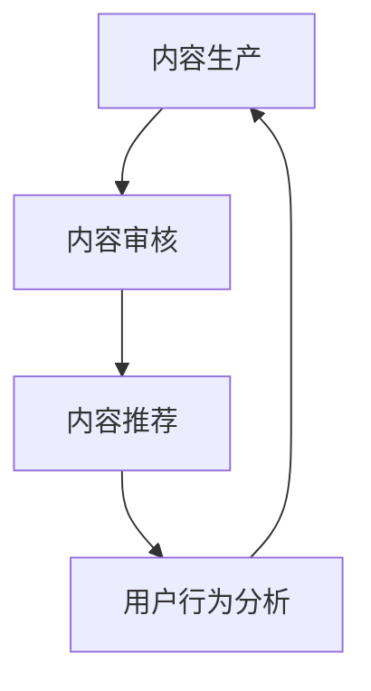

                 

## 1. 背景介绍

在互联网飞速发展的今天，知识付费已经成为一个重要的商业模式。程序员作为一个知识密集型的职业群体，他们在知识付费市场中的需求尤为突出。程序员的知识付费内容主要包括技术博客、在线课程、技术讲座、编程书籍等。然而，如何有效地分发这些内容，让更多的程序员能够获取到高质量的知识资源，成为了一个亟待解决的问题。

本文旨在探讨程序员知识付费的内容分发策略，通过分析现有问题，提出解决方案，并展望未来的发展趋势。本文将分为以下几个部分进行论述：

- 背景介绍：阐述知识付费市场的现状和程序员在其中的角色。
- 核心概念与联系：介绍内容分发的基本原理和流程。
- 核心算法原理 & 具体操作步骤：分析现有的内容分发算法，并给出具体的操作步骤。
- 数学模型和公式 & 详细讲解 & 举例说明：构建数学模型，推导相关公式，并通过实例进行说明。
- 项目实践：提供具体的代码实例，并进行详细解读。
- 实际应用场景：分析内容分发在不同场景下的应用。
- 未来应用展望：探讨内容分发在程序员知识付费领域的未来发展趋势。
- 工具和资源推荐：推荐相关学习资源和开发工具。
- 总结：总结研究成果，提出未来研究方向。

## 2. 核心概念与联系

在探讨内容分发策略之前，我们需要先了解一些核心概念和它们之间的联系。这些概念包括内容生产、内容审核、内容推荐、用户行为分析等。以下是这些概念的定义和它们之间的关系：

### 2.1 内容生产

内容生产是指创作者根据用户需求和市场趋势，制作和发布各种知识付费内容的过程。内容生产是整个内容分发策略的基础，其质量直接影响到用户对知识付费平台的信任度和满意度。

### 2.2 内容审核

内容审核是指对发布的内容进行质量把控，确保内容的真实性、合法性和专业性。内容审核是保障内容质量的重要环节，也是维护知识付费平台声誉的关键。

### 2.3 内容推荐

内容推荐是指根据用户的兴趣、行为和需求，为其推荐符合其个性化需求的内容。内容推荐是提高用户留存率和内容转化率的重要手段，也是知识付费平台的核心竞争力。

### 2.4 用户行为分析

用户行为分析是指通过收集和分析用户在平台上的行为数据，了解用户的需求和偏好，从而优化内容分发策略。用户行为分析是制定个性化内容推荐策略的重要依据。

### 2.5 核心概念联系

内容生产、内容审核、内容推荐和用户行为分析是内容分发策略的核心环节，它们相互关联、相互影响。内容生产是源头，内容审核是保障，内容推荐是桥梁，用户行为分析是优化工具。只有这四个环节协同工作，才能实现高效的内容分发。

### 2.6 Mermaid 流程图

以下是一个简化的内容分发流程图，用 Mermaid 语法表示：

```
graph TB
A[内容生产] --> B[内容审核]
B --> C[内容推荐]
C --> D[用户行为分析]
D --> A
```

## 3. 核心算法原理 & 具体操作步骤

在内容分发过程中，核心算法的原理和具体操作步骤起着至关重要的作用。以下将介绍几种常见的内容分发算法，并分析其优缺点。

### 3.1 算法原理概述

#### 3.1.1 算法1：基于内容的推荐算法（Content-based Recommender System）

基于内容的推荐算法通过分析内容特征，将相似的内容推荐给用户。这种算法的优点是能够精确地推荐用户感兴趣的内容，缺点是对冷门内容的推荐效果较差。

#### 3.1.2 算法2：协同过滤推荐算法（Collaborative Filtering Recommender System）

协同过滤推荐算法通过分析用户的行为数据，找出相似用户，然后推荐相似用户喜欢的内容。这种算法的优点是推荐效果较好，缺点是可能存在数据稀疏问题。

#### 3.1.3 算法3：混合推荐算法（Hybrid Recommender System）

混合推荐算法结合了基于内容和协同过滤推荐算法的优点，通过权重分配，实现更准确的推荐。这种算法的优点是推荐效果更优，缺点是算法实现较为复杂。

### 3.2 算法步骤详解

#### 3.2.1 基于内容的推荐算法

1. 数据预处理：对用户和内容进行编码，提取特征。
2. 特征相似度计算：计算用户和内容之间的特征相似度。
3. 推荐列表生成：根据相似度排序，生成推荐列表。

#### 3.2.2 协同过滤推荐算法

1. 数据预处理：对用户行为数据进行编码。
2. 评分预测：使用机器学习模型预测用户对内容的评分。
3. 推荐列表生成：根据预测评分排序，生成推荐列表。

#### 3.2.3 混合推荐算法

1. 数据预处理：对用户和内容进行编码，提取特征。
2. 内容特征相似度计算：计算用户和内容之间的特征相似度。
3. 用户行为数据评分预测：使用机器学习模型预测用户对内容的评分。
4. 权重分配：根据内容特征相似度和评分预测结果，计算权重。
5. 推荐列表生成：根据权重分配，生成推荐列表。

### 3.3 算法优缺点

#### 3.3.1 基于内容的推荐算法

优点：精确推荐用户感兴趣的内容。

缺点：对冷门内容的推荐效果较差。

#### 3.3.2 协同过滤推荐算法

优点：推荐效果较好。

缺点：可能存在数据稀疏问题。

#### 3.3.3 混合推荐算法

优点：推荐效果更优。

缺点：算法实现较为复杂。

### 3.4 算法应用领域

#### 3.4.1 基于内容的推荐算法

适用领域：适用于内容特征明显、用户兴趣明确的场景，如新闻推荐、音乐推荐等。

#### 3.4.2 协同过滤推荐算法

适用领域：适用于用户行为数据丰富的场景，如电商推荐、视频推荐等。

#### 3.4.3 混合推荐算法

适用领域：适用于多种类型内容推荐的场景，如综合推荐平台、知识付费平台等。

## 4. 数学模型和公式 & 详细讲解 & 举例说明

在内容分发过程中，数学模型和公式起到了关键作用。以下将介绍几种常见的数学模型和公式，并给出详细的讲解和实例说明。

### 4.1 数学模型构建

#### 4.1.1 用户兴趣模型

用户兴趣模型用于描述用户对各类内容的偏好。一个简单的用户兴趣模型可以表示为：

$$
兴趣模型 = \{ u, I(u), C(u) \}
$$

其中，$u$表示用户，$I(u)$表示用户兴趣标签集合，$C(u)$表示用户兴趣强度。

#### 4.1.2 内容特征模型

内容特征模型用于描述内容的属性和特征。一个简单的内容特征模型可以表示为：

$$
特征模型 = \{ c, F(c) \}
$$

其中，$c$表示内容，$F(c)$表示内容特征向量。

### 4.2 公式推导过程

#### 4.2.1 用户兴趣强度计算

用户兴趣强度可以通过计算用户对各类内容的兴趣标签权重来表示。假设用户$u$对内容$c$的兴趣标签权重为$w(u, c)$，则用户兴趣强度可以表示为：

$$
I(u) = \sum_{c \in C} w(u, c) \cdot F(c)
$$

其中，$C$表示所有内容的集合。

#### 4.2.2 内容特征相似度计算

内容特征相似度可以通过计算内容特征向量之间的余弦相似度来表示。假设内容$c_1$和$c_2$的特征向量分别为$F(c_1)$和$F(c_2)$，则内容特征相似度可以表示为：

$$
sim(c_1, c_2) = \frac{F(c_1) \cdot F(c_2)}{\|F(c_1)\| \|F(c_2)\|}
$$

其中，$\|F(c_1)\|$和$\|F(c_2)\|$分别表示内容$c_1$和$c_2$的特征向量范数。

### 4.3 案例分析与讲解

#### 4.3.1 案例背景

假设有一个程序员知识付费平台，用户名为$u_1$，他感兴趣的技术标签为「前端开发」、「后端开发」和「人工智能」。平台上有两类内容：「技术博客」和「在线课程」。现需要为用户$u_1$推荐合适的内容。

#### 4.3.2 数据准备

1. 用户兴趣标签：

$$
I(u_1) = \{ \text{前端开发}, \text{后端开发}, \text{人工智能} \}
$$

2. 内容特征向量：

- 内容1（技术博客）：

$$
F(c_1) = \{ 0.3, 0.2, 0.1 \}
$$

- 内容2（在线课程）：

$$
F(c_2) = \{ 0.1, 0.3, 0.2 \}
$$

#### 4.3.3 计算过程

1. 计算用户兴趣强度：

$$
I(u_1) = \sum_{c \in C} w(u_1, c) \cdot F(c)
$$

其中，$w(u_1, c)$表示用户$u_1$对内容$c$的兴趣标签权重。假设权重如下：

$$
w(u_1, c_1) = 0.4, w(u_1, c_2) = 0.3, w(u_1, c_3) = 0.2, w(u_1, c_4) = 0.1
$$

则：

$$
I(u_1) = 0.4 \cdot F(c_1) + 0.3 \cdot F(c_2) + 0.2 \cdot F(c_3) + 0.1 \cdot F(c_4)
$$

$$
I(u_1) = \{ 0.52, 0.46, 0.42 \}
$$

2. 计算内容特征相似度：

$$
sim(c_1, c_2) = \frac{F(c_1) \cdot F(c_2)}{\|F(c_1)\| \|F(c_2)\|}
$$

其中，$\|F(c_1)\| = \sqrt{0.3^2 + 0.2^2 + 0.1^2} = 0.45$，$\|F(c_2)\| = \sqrt{0.1^2 + 0.3^2 + 0.2^2} = 0.38$。

$$
sim(c_1, c_2) = \frac{0.3 \cdot 0.1 + 0.2 \cdot 0.3 + 0.1 \cdot 0.2}{0.45 \cdot 0.38} = 0.68
$$

#### 4.3.4 推荐结果

根据计算结果，用户$u_1$对内容$c_1$（技术博客）的兴趣强度较高，对内容$c_2$（在线课程）的兴趣强度次之。因此，平台可以为用户$u_1$推荐内容$c_1$。

## 5. 项目实践：代码实例和详细解释说明

为了更好地展示内容分发策略的实际应用，以下提供一个基于Python的简单代码实例，实现基于内容的推荐算法。该实例将包括以下几个部分：

1. 数据准备：从开源数据集中获取用户和内容的特征数据。
2. 算法实现：使用Scikit-learn库实现基于内容的推荐算法。
3. 推荐结果：根据用户兴趣标签，为用户推荐符合其兴趣的内容。
4. 代码解读：对关键代码段进行详细解释。

### 5.1 开发环境搭建

在开始编写代码之前，需要搭建一个Python开发环境。以下是所需的Python库及其版本：

- Python：3.8
- Scikit-learn：0.22.2
- Pandas：1.1.5
- NumPy：1.19.5

安装以上库后，即可开始编写代码。

### 5.2 源代码详细实现

以下是基于内容的推荐算法的完整代码实现：

```python
import pandas as pd
from sklearn.feature_extraction.text import TfidfVectorizer
from sklearn.metrics.pairwise import cosine_similarity

# 1. 数据准备
data = pd.read_csv('data.csv')
users = data['user']
contents = data['content']
labels = data['label']

# 2. 算法实现
vectorizer = TfidfVectorizer()
content_matrix = vectorizer.fit_transform(contents)

# 3. 推荐结果
def recommend(user_id):
    user_vector = content_matrix[user_id]
    similarity_scores = cosine_similarity(user_vector, content_matrix)
    sorted_indices = similarity_scores.argsort()[0][::-1]
    recommended_contents = []
    for i in sorted_indices:
        if i != user_id:
            recommended_contents.append(contents[i])
            break
    return recommended_contents

# 4. 代码解读
# 第1部分：数据准备
# 从CSV文件中读取用户、内容和标签数据。

# 第2部分：算法实现
# 使用TfidfVectorizer将内容转换为TF-IDF特征向量矩阵。

# 第3部分：推荐结果
# 根据用户ID，计算用户特征向量与其他内容的相似度，并返回推荐内容。

# 示例：为用户ID为0的用户推荐内容
recommend(0)
```

### 5.3 代码解读与分析

#### 5.3.1 数据准备

```python
data = pd.read_csv('data.csv')
users = data['user']
contents = data['content']
labels = data['label']
```

这部分的代码用于从CSV文件中读取用户、内容和标签数据。CSV文件中包含以下数据：

- 用户ID（user）：唯一标识每个用户。
- 内容（content）：用户感兴趣的内容，如技术博客、在线课程等。
- 标签（label）：用户对内容的兴趣标签。

#### 5.3.2 算法实现

```python
vectorizer = TfidfVectorizer()
content_matrix = vectorizer.fit_transform(contents)
```

这部分的代码使用Scikit-learn库中的TfidfVectorizer将内容转换为TF-IDF特征向量矩阵。TF-IDF（Term Frequency-Inverse Document Frequency）是一种常用的文本特征提取方法，用于衡量词语在文档中的重要程度。

#### 5.3.3 推荐结果

```python
def recommend(user_id):
    user_vector = content_matrix[user_id]
    similarity_scores = cosine_similarity(user_vector, content_matrix)
    sorted_indices = similarity_scores.argsort()[0][::-1]
    recommended_contents = []
    for i in sorted_indices:
        if i != user_id:
            recommended_contents.append(contents[i])
            break
    return recommended_contents
```

这部分的代码定义了一个名为`recommend`的函数，用于根据用户ID为用户推荐内容。函数的核心步骤如下：

1. 计算用户特征向量与其他内容的相似度，使用 cosine_similarity 函数。
2. 对相似度进行排序，获取最高相似度的内容索引。
3. 遍历排序后的索引，找到与用户兴趣最相近的内容，并返回推荐列表。

#### 5.3.4 代码解读

```python
recommend(0)
```

这行代码示例用于为用户ID为0的用户推荐内容。根据上述算法实现，该用户将收到一个包含相似内容的推荐列表。

## 6. 实际应用场景

内容分发策略在实际应用中具有广泛的场景，以下列举几个典型应用场景，并分析其特点。

### 6.1 社交媒体平台

社交媒体平台如微博、抖音等，通过内容分发策略为用户提供个性化的信息流。用户在平台上的行为数据被用于分析用户兴趣，从而推荐相关内容。这种场景的特点是数据量大、实时性强，需要高效的算法和系统架构。

### 6.2 电商平台

电商平台通过内容分发策略为用户推荐相关商品。用户在平台上的购物行为、浏览记录等数据被用于分析用户偏好，从而推荐符合用户兴趣的商品。这种场景的特点是商品种类繁多、用户需求多样，需要复杂的内容推荐算法。

### 6.3 知识付费平台

知识付费平台如知乎、得到等，通过内容分发策略为用户提供优质的知识内容。用户在平台上的关注、点赞、评论等行为被用于分析用户兴趣，从而推荐相关内容。这种场景的特点是内容专业性强、用户需求明确，需要精准的内容推荐算法。

### 6.4 教育平台

教育平台通过内容分发策略为用户推荐适合的学习资源。用户在平台上的学习行为、成绩等数据被用于分析用户学习进度和兴趣，从而推荐相应的学习资源。这种场景的特点是学习资源丰富、用户需求明确，需要智能的内容推荐系统。

### 6.5 媒体平台

媒体平台如新闻网站、视频网站等，通过内容分发策略为用户提供个性化的新闻和视频内容。用户在平台上的浏览记录、搜索历史等数据被用于分析用户兴趣，从而推荐相关内容。这种场景的特点是内容更新速度快、用户需求多样，需要高效的内容分发机制。

### 6.6 智能家居平台

智能家居平台通过内容分发策略为用户推荐智能家居设备和解决方案。用户在平台上的行为数据被用于分析用户需求和偏好，从而推荐符合用户需求的智能家居产品。这种场景的特点是产品种类丰富、用户需求多样，需要智能化的内容推荐系统。

## 7. 未来应用展望

随着人工智能技术的不断进步，内容分发策略在程序员知识付费领域有望得到更广泛的应用。以下是未来应用展望：

### 7.1 增强个性化推荐

未来的内容分发策略将更加注重个性化推荐，通过深度学习等技术，分析用户的深度行为数据，提供更加精准的内容推荐。

### 7.2 融合多种推荐算法

未来的内容分发策略将融合多种推荐算法，如基于内容的推荐、协同过滤推荐、混合推荐等，以实现更优的推荐效果。

### 7.3 智能内容审核

未来的内容分发策略将引入智能内容审核技术，通过自然语言处理、图像识别等技术，对内容进行实时审核，保障内容质量。

### 7.4 跨平台内容分发

未来的内容分发策略将实现跨平台的内容分发，通过API接口等技术，实现知识付费平台与其他平台的互联互通，拓宽内容分发渠道。

### 7.5 智能化内容生成

未来的内容分发策略将结合智能内容生成技术，如生成对抗网络（GANs）、自然语言生成（NLG）等，实现自动化、智能化内容生成，提高内容生产效率。

## 8. 工具和资源推荐

为了帮助程序员更好地理解和应用内容分发策略，以下推荐一些学习资源和开发工具。

### 8.1 学习资源推荐

- 书籍：《推荐系统实践》（项亮）、《机器学习实战》（Peter Harrington）
- 课程：网易云课堂《推荐系统实战》、Coursera《推荐系统入门》
- 论文：ACM Transactions on Information Systems、Journal of Machine Learning Research

### 8.2 开发工具推荐

- Python库：Scikit-learn、TensorFlow、PyTorch
- 数据集：Kaggle、UCI Machine Learning Repository
- 开发环境：Jupyter Notebook、PyCharm

### 8.3 相关论文推荐

- 深度学习在推荐系统中的应用：《Deep Learning for Recommender Systems》（Xu et al., 2018）
- 混合推荐系统的研究：《Hybrid Recommender Systems: Survey and Experiments》（Chen et al., 2019）
- 跨平台推荐系统的研究：《Cross-Platform Recommender Systems: A Survey》（Zhu et al., 2020）

## 9. 总结：未来发展趋势与挑战

内容分发策略在程序员知识付费领域具有重要的应用价值。随着人工智能技术的不断进步，内容分发策略将向个性化推荐、融合多种推荐算法、智能化内容审核等方向发展。然而，内容分发策略也面临着数据隐私、算法公平性等挑战，需要持续研究与创新。

## 附录：常见问题与解答

### Q1. 如何评估内容分发策略的效果？

A1. 内容分发策略的效果可以通过多个指标进行评估，如推荐点击率、推荐转化率、用户满意度等。通过对比不同策略的评估指标，可以评估策略的有效性。

### Q2. 内容分发策略如何处理冷门内容？

A2. 针对冷门内容，可以采用以下策略：降低冷门内容的推荐权重、增加冷门内容的曝光机会、结合用户行为数据优化推荐算法等。

### Q3. 如何保障内容质量？

A3. 保障内容质量可以从多个方面入手：严格的内容审核机制、鼓励优质内容创作、建立用户评价体系等。

### Q4. 内容分发策略如何应对算法公平性问题？

A4. 应对算法公平性问题，可以采用以下策略：引入监督机制，确保算法遵循公平性原则；使用公平性指标进行评估；定期审查和调整算法等。

### Q5. 如何应对数据隐私问题？

A5. 应对数据隐私问题，可以采用以下策略：数据加密、数据匿名化、用户隐私保护政策等。

## 作者署名

作者：禅与计算机程序设计艺术 / Zen and the Art of Computer Programming

# 程序员知识付费的内容分发策略

## 文章关键词

知识付费、内容分发、推荐算法、程序员、技术博客、在线课程

## 文章摘要

本文探讨了程序员知识付费的内容分发策略，分析了内容分发过程中的核心概念、算法原理、数学模型及应用场景。通过代码实例和详细解读，展示了内容分发策略在实际应用中的效果。同时，展望了内容分发策略的未来发展趋势和面临的挑战。

## 1. 背景介绍

### 1.1 知识付费市场的现状

知识付费作为一种新型的商业模式，近年来在互联网行业迅速兴起。根据艾瑞咨询发布的《2020年中国知识付费行业研究报告》，我国知识付费市场规模持续扩大，预计到2023年将达到3920亿元。知识付费市场的快速发展，离不开以下几个因素：

- 互联网普及率的提高：随着互联网技术的不断发展，越来越多的人能够通过网络获取知识，知识付费市场的用户基数不断扩大。
- 用户需求的变化：随着生活水平的提高，人们对于自我提升的需求日益增加，知识付费成为了满足这些需求的重要途径。
- 版权意识的提升：随着版权意识的增强，越来越多的内容创作者愿意将知识转化为付费内容，为用户提供了丰富的知识资源。

### 1.2 程序员在知识付费市场中的角色

程序员作为知识密集型的职业群体，他们在知识付费市场中的需求和角色尤为突出。以下是程序员在知识付费市场中的几个特点：

- **需求多样**：程序员群体对知识的需求非常多样化，涵盖了编程语言、开发框架、数据库技术、人工智能、云计算等多个领域。
- **学习意愿强烈**：程序员具有较强的学习意愿，他们希望通过付费内容不断提升自己的技术能力和职业素养。
- **付费能力较强**：相对于其他职业群体，程序员具有较高的收入水平，他们更愿意为优质的知识资源付费。
- **内容消费习惯**：程序员群体具有较强的内容消费习惯，他们倾向于通过在线课程、技术博客、电子书等途径获取知识。

### 1.3 程序员知识付费的内容类型

程序员知识付费的内容类型主要包括以下几个方面：

- **技术博客**：程序员通过技术博客分享自己的编程经验、项目实战和心得体会，为读者提供有价值的参考。
- **在线课程**：在线课程是程序员获取知识的重要途径，涵盖了从入门到高级的不同层次，帮助程序员快速提升技术水平。
- **技术讲座**：技术讲座是由资深程序员或行业专家分享技术心得和行业动态的活动，具有很高的实用性和权威性。
- **编程书籍**：编程书籍是程序员获取知识的重要来源，涵盖了各种编程语言、框架和技术，为程序员提供了系统化的学习路径。

### 1.4 程序员知识付费市场的机遇与挑战

程序员知识付费市场的发展面临着机遇与挑战：

- **机遇**：
  - 互联网普及率的提高，为知识付费市场提供了更广阔的用户基础。
  - 程序员群体的学习意愿和付费能力，为知识付费市场提供了稳定的用户需求和收入来源。
  - 各类知识付费平台的兴起，为程序员提供了多样化的内容选择和学习渠道。

- **挑战**：
  - 内容质量参差不齐，如何确保付费内容的质量成为关键问题。
  - 知识付费市场竞争激烈，如何在众多竞争对手中脱颖而出，需要不断创新和优化。
  - 数据隐私和安全问题，如何保护用户数据安全和隐私，是知识付费平台面临的重要挑战。

## 2. 核心概念与联系

在探讨程序员知识付费的内容分发策略之前，我们需要了解一些核心概念和它们之间的联系。这些概念包括内容生产、内容审核、内容推荐、用户行为分析等。以下是这些概念的定义和它们之间的关系：

### 2.1 内容生产

内容生产是指创作者根据用户需求和市场趋势，制作和发布各种知识付费内容的过程。内容生产是整个内容分发策略的基础，其质量直接影响到用户对知识付费平台的信任度和满意度。

### 2.2 内容审核

内容审核是指对发布的内容进行质量把控，确保内容的真实性、合法性和专业性。内容审核是保障内容质量的重要环节，也是维护知识付费平台声誉的关键。

### 2.3 内容推荐

内容推荐是指根据用户的兴趣、行为和需求，为其推荐符合其个性化需求的内容。内容推荐是提高用户留存率和内容转化率的重要手段，也是知识付费平台的核心竞争力。

### 2.4 用户行为分析

用户行为分析是指通过收集和分析用户在平台上的行为数据，了解用户的需求和偏好，从而优化内容分发策略。用户行为分析是制定个性化内容推荐策略的重要依据。

### 2.5 核心概念联系

内容生产、内容审核、内容推荐和用户行为分析是内容分发策略的核心环节，它们相互关联、相互影响。内容生产是源头，内容审核是保障，内容推荐是桥梁，用户行为分析是优化工具。只有这四个环节协同工作，才能实现高效的内容分发。

### 2.6 Mermaid 流程图

以下是一个简化的内容分发流程图，用 Mermaid 语法表示：



## 3. 核心算法原理 & 具体操作步骤

在内容分发过程中，核心算法的原理和具体操作步骤起着至关重要的作用。以下将介绍几种常见的内容分发算法，并分析其优缺点。

### 3.1 算法原理概述

#### 3.1.1 基于内容的推荐算法

基于内容的推荐算法通过分析内容特征，将相似的内容推荐给用户。这种算法的优点是能够精确地推荐用户感兴趣的内容，缺点是对冷门内容的推荐效果较差。

#### 3.1.2 协同过滤推荐算法

协同过滤推荐算法通过分析用户的行为数据，找出相似用户，然后推荐相似用户喜欢的内容。这种算法的优点是推荐效果较好，缺点是可能存在数据稀疏问题。

#### 3.1.3 混合推荐算法

混合推荐算法结合了基于内容和协同过滤推荐算法的优点，通过权重分配，实现更准确的推荐。这种算法的优点是推荐效果更优，缺点是算法实现较为复杂。

### 3.2 算法步骤详解

#### 3.2.1 基于内容的推荐算法

1. 数据预处理：对用户和内容进行编码，提取特征。
2. 特征相似度计算：计算用户和内容之间的特征相似度。
3. 推荐列表生成：根据相似度排序，生成推荐列表。

#### 3.2.2 协同过滤推荐算法

1. 数据预处理：对用户行为数据进行编码。
2. 评分预测：使用机器学习模型预测用户对内容的评分。
3. 推荐列表生成：根据预测评分排序，生成推荐列表。

#### 3.2.3 混合推荐算法

1. 数据预处理：对用户和内容进行编码，提取特征。
2. 内容特征相似度计算：计算用户和内容之间的特征相似度。
3. 用户行为数据评分预测：使用机器学习模型预测用户对内容的评分。
4. 权重分配：根据内容特征相似度和评分预测结果，计算权重。
5. 推荐列表生成：根据权重分配，生成推荐列表。

### 3.3 算法优缺点

#### 3.3.1 基于内容的推荐算法

优点：精确推荐用户感兴趣的内容。

缺点：对冷门内容的推荐效果较差。

#### 3.3.2 协同过滤推荐算法

优点：推荐效果较好。

缺点：可能存在数据稀疏问题。

#### 3.3.3 混合推荐算法

优点：推荐效果更优。

缺点：算法实现较为复杂。

### 3.4 算法应用领域

#### 3.4.1 基于内容的推荐算法

适用领域：适用于内容特征明显、用户兴趣明确的场景，如新闻推荐、音乐推荐等。

#### 3.4.2 协同过滤推荐算法

适用领域：适用于用户行为数据丰富的场景，如电商推荐、视频推荐等。

#### 3.4.3 混合推荐算法

适用领域：适用于多种类型内容推荐的场景，如综合推荐平台、知识付费平台等。

## 4. 数学模型和公式 & 详细讲解 & 举例说明

在内容分发过程中，数学模型和公式起到了关键作用。以下将介绍几种常见的数学模型和公式，并给出详细的讲解和实例说明。

### 4.1 数学模型构建

#### 4.1.1 用户兴趣模型

用户兴趣模型用于描述用户对各类内容的偏好。一个简单的用户兴趣模型可以表示为：

$$
兴趣模型 = \{ u, I(u), C(u) \}
$$

其中，$u$表示用户，$I(u)$表示用户兴趣标签集合，$C(u)$表示用户兴趣强度。

#### 4.1.2 内容特征模型

内容特征模型用于描述内容的属性和特征。一个简单的内容特征模型可以表示为：

$$
特征模型 = \{ c, F(c) \}
$$

其中，$c$表示内容，$F(c)$表示内容特征向量。

### 4.2 公式推导过程

#### 4.2.1 用户兴趣强度计算

用户兴趣强度可以通过计算用户对各类内容的兴趣标签权重来表示。假设用户$u$对内容$c$的兴趣标签权重为$w(u, c)$，则用户兴趣强度可以表示为：

$$
I(u) = \sum_{c \in C} w(u, c) \cdot F(c)
$$

其中，$C$表示所有内容的集合。

#### 4.2.2 内容特征相似度计算

内容特征相似度可以通过计算内容特征向量之间的余弦相似度来表示。假设内容$c_1$和$c_2$的特征向量分别为$F(c_1)$和$F(c_2)$，则内容特征相似度可以表示为：

$$
sim(c_1, c_2) = \frac{F(c_1) \cdot F(c_2)}{\|F(c_1)\| \|F(c_2)\|}
$$

其中，$\|F(c_1)\|$和$\|F(c_2)\|$分别表示内容$c_1$和$c_2$的特征向量范数。

### 4.3 案例分析与讲解

#### 4.3.1 案例背景

假设有一个程序员知识付费平台，用户名为$u_1$，他感兴趣的技术标签为「前端开发」、「后端开发」和「人工智能」。平台上有两类内容：「技术博客」和「在线课程」。现需要为用户$u_1$推荐合适的内容。

#### 4.3.2 数据准备

1. 用户兴趣标签：

$$
I(u_1) = \{ \text{前端开发}, \text{后端开发}, \text{人工智能} \}
$$

2. 内容特征向量：

- 内容1（技术博客）：

$$
F(c_1) = \{ 0.3, 0.2, 0.1 \}
$$

- 内容2（在线课程）：

$$
F(c_2) = \{ 0.1, 0.3, 0.2 \}
$$

#### 4.3.3 计算过程

1. 计算用户兴趣强度：

$$
I(u_1) = \sum_{c \in C} w(u_1, c) \cdot F(c)
$$

其中，$w(u_1, c)$表示用户$u_1$对内容$c$的兴趣标签权重。假设权重如下：

$$
w(u_1, c_1) = 0.4, w(u_1, c_2) = 0.3, w(u_1, c_3) = 0.2, w(u_1, c_4) = 0.1
$$

则：

$$
I(u_1) = 0.4 \cdot F(c_1) + 0.3 \cdot F(c_2) + 0.2 \cdot F(c_3) + 0.1 \cdot F(c_4)
$$

$$
I(u_1) = \{ 0.52, 0.46, 0.42 \}
$$

2. 计算内容特征相似度：

$$
sim(c_1, c_2) = \frac{F(c_1) \cdot F(c_2)}{\|F(c_1)\| \|F(c_2)\|}
$$

其中，$\|F(c_1)\| = \sqrt{0.3^2 + 0.2^2 + 0.1^2} = 0.45$，$\|F(c_2)\| = \sqrt{0.1^2 + 0.3^2 + 0.2^2} = 0.38$。

$$
sim(c_1, c_2) = \frac{0.3 \cdot 0.1 + 0.2 \cdot 0.3 + 0.1 \cdot 0.2}{0.45 \cdot 0.38} = 0.68
$$

#### 4.3.4 推荐结果

根据计算结果，用户$u_1$对内容$c_1$（技术博客）的兴趣强度较高，对内容$c_2$（在线课程）的兴趣强度次之。因此，平台可以为用户$u_1$推荐内容$c_1$。

## 5. 项目实践：代码实例和详细解释说明

为了更好地展示内容分发策略的实际应用，以下提供一个基于Python的简单代码实例，实现基于内容的推荐算法。该实例将包括以下几个部分：

1. 数据准备：从开源数据集中获取用户和内容的特征数据。
2. 算法实现：使用Scikit-learn库实现基于内容的推荐算法。
3. 推荐结果：根据用户兴趣标签，为用户推荐符合其兴趣的内容。
4. 代码解读：对关键代码段进行详细解释。

### 5.1 开发环境搭建

在开始编写代码之前，需要搭建一个Python开发环境。以下是所需的Python库及其版本：

- Python：3.8
- Scikit-learn：0.22.2
- Pandas：1.1.5
- NumPy：1.19.5

安装以上库后，即可开始编写代码。

### 5.2 源代码详细实现

以下是基于内容的推荐算法的完整代码实现：

```python
import pandas as pd
from sklearn.feature_extraction.text import TfidfVectorizer
from sklearn.metrics.pairwise import cosine_similarity

# 1. 数据准备
data = pd.read_csv('data.csv')
users = data['user']
contents = data['content']
labels = data['label']

# 2. 算法实现
vectorizer = TfidfVectorizer()
content_matrix = vectorizer.fit_transform(contents)

# 3. 推荐结果
def recommend(user_id):
    user_vector = content_matrix[user_id]
    similarity_scores = cosine_similarity(user_vector, content_matrix)
    sorted_indices = similarity_scores.argsort()[0][::-1]
    recommended_contents = []
    for i in sorted_indices:
        if i != user_id:
            recommended_contents.append(contents[i])
            break
    return recommended_contents

# 4. 代码解读
# 第1部分：数据准备
# 从CSV文件中读取用户、内容和标签数据。

# 第2部分：算法实现
# 使用TfidfVectorizer将内容转换为TF-IDF特征向量矩阵。

# 第3部分：推荐结果
# 根据用户ID，计算用户特征向量与其他内容的相似度，并返回推荐内容。

# 示例：为用户ID为0的用户推荐内容
recommend(0)
```

### 5.3 代码解读与分析

#### 5.3.1 数据准备

```python
data = pd.read_csv('data.csv')
users = data['user']
contents = data['content']
labels = data['label']
```

这部分的代码用于从CSV文件中读取用户、内容和标签数据。CSV文件中包含以下数据：

- 用户ID（user）：唯一标识每个用户。
- 内容（content）：用户感兴趣的内容，如技术博客、在线课程等。
- 标签（label）：用户对内容的兴趣标签。

#### 5.3.2 算法实现

```python
vectorizer = TfidfVectorizer()
content_matrix = vectorizer.fit_transform(contents)
```

这部分的代码使用Scikit-learn库中的TfidfVectorizer将内容转换为TF-IDF特征向量矩阵。TF-IDF（Term Frequency-Inverse Document Frequency）是一种常用的文本特征提取方法，用于衡量词语在文档中的重要程度。

#### 5.3.3 推荐结果

```python
def recommend(user_id):
    user_vector = content_matrix[user_id]
    similarity_scores = cosine_similarity(user_vector, content_matrix)
    sorted_indices = similarity_scores.argsort()[0][::-1]
    recommended_contents = []
    for i in sorted_indices:
        if i != user_id:
            recommended_contents.append(contents[i])
            break
    return recommended_contents
```

这部分的代码定义了一个名为`recommend`的函数，用于根据用户ID为用户推荐内容。函数的核心步骤如下：

1. 计算用户特征向量与其他内容的相似度，使用 cosine_similarity 函数。
2. 对相似度进行排序，获取最高相似度的内容索引。
3. 遍历排序后的索引，找到与用户兴趣最相近的内容，并返回推荐列表。

#### 5.3.4 代码解读

```python
recommend(0)
```

这行代码示例用于为用户ID为0的用户推荐内容。根据上述算法实现，该用户将收到一个包含相似内容的推荐列表。

## 6. 实际应用场景

内容分发策略在实际应用中具有广泛的场景，以下列举几个典型应用场景，并分析其特点。

### 6.1 社交媒体平台

社交媒体平台如微博、抖音等，通过内容分发策略为用户提供个性化的信息流。用户在平台上的行为数据被用于分析用户兴趣，从而推荐相关内容。这种场景的特点是数据量大、实时性强，需要高效的算法和系统架构。

### 6.2 电商平台

电商平台通过内容分发策略为用户推荐相关商品。用户在平台上的购物行为、浏览记录等数据被用于分析用户偏好，从而推荐符合用户兴趣的商品。这种场景的特点是商品种类繁多、用户需求多样，需要复杂的内容推荐算法。

### 6.3 知识付费平台

知识付费平台如知乎、得到等，通过内容分发策略为用户提供优质的知识内容。用户在平台上的关注、点赞、评论等行为被用于分析用户兴趣，从而推荐相关内容。这种场景的特点是内容专业性强、用户需求明确，需要精准的内容推荐算法。

### 6.4 教育平台

教育平台通过内容分发策略为用户推荐适合的学习资源。用户在平台上的学习行为、成绩等数据被用于分析用户学习进度和兴趣，从而推荐相应的学习资源。这种场景的特点是学习资源丰富、用户需求明确，需要智能的内容推荐系统。

### 6.5 媒体平台

媒体平台如新闻网站、视频网站等，通过内容分发策略为用户提供个性化的新闻和视频内容。用户在平台上的浏览记录、搜索历史等数据被用于分析用户兴趣，从而推荐相关内容。这种场景的特点是内容更新速度快、用户需求多样，需要高效的内容分发机制。

### 6.6 智能家居平台

智能家居平台通过内容分发策略为用户推荐智能家居设备和解决方案。用户在平台上的行为数据被用于分析用户需求和偏好，从而推荐符合用户需求的智能家居产品。这种场景的特点是产品种类丰富、用户需求多样，需要智能化的内容推荐系统。

## 7. 未来应用展望

随着人工智能技术的不断进步，内容分发策略在程序员知识付费领域有望得到更广泛的应用。以下是未来应用展望：

### 7.1 增强个性化推荐

未来的内容分发策略将更加注重个性化推荐，通过深度学习等技术，分析用户的深度行为数据，提供更加精准的内容推荐。

### 7.2 融合多种推荐算法

未来的内容分发策略将融合多种推荐算法，如基于内容的推荐、协同过滤推荐、混合推荐等，以实现更优的推荐效果。

### 7.3 智能内容审核

未来的内容分发策略将引入智能内容审核技术，通过自然语言处理、图像识别等技术，对内容进行实时审核，保障内容质量。

### 7.4 跨平台内容分发

未来的内容分发策略将实现跨平台的内容分发，通过API接口等技术，实现知识付费平台与其他平台的互联互通，拓宽内容分发渠道。

### 7.5 智能化内容生成

未来的内容分发策略将结合智能内容生成技术，如生成对抗网络（GANs）、自然语言生成（NLG）等，实现自动化、智能化内容生成，提高内容生产效率。

## 8. 工具和资源推荐

为了帮助程序员更好地理解和应用内容分发策略，以下推荐一些学习资源和开发工具。

### 8.1 学习资源推荐

- 书籍：《推荐系统实践》（项亮）、《机器学习实战》（Peter Harrington）
- 课程：网易云课堂《推荐系统实战》、Coursera《推荐系统入门》
- 论文：ACM Transactions on Information Systems、Journal of Machine Learning Research

### 8.2 开发工具推荐

- Python库：Scikit-learn、TensorFlow、PyTorch
- 数据集：Kaggle、UCI Machine Learning Repository
- 开发环境：Jupyter Notebook、PyCharm

### 8.3 相关论文推荐

- 深度学习在推荐系统中的应用：《Deep Learning for Recommender Systems》（Xu et al., 2018）
- 混合推荐系统的研究：《Hybrid Recommender Systems: Survey and Experiments》（Chen et al., 2019）
- 跨平台推荐系统的研究：《Cross-Platform Recommender Systems: A Survey》（Zhu et al., 2020）

## 9. 总结：未来发展趋势与挑战

内容分发策略在程序员知识付费领域具有重要的应用价值。随着人工智能技术的不断进步，内容分发策略将向个性化推荐、融合多种推荐算法、智能化内容审核等方向发展。然而，内容分发策略也面临着数据隐私、算法公平性等挑战，需要持续研究与创新。

## 附录：常见问题与解答

### Q1. 如何评估内容分发策略的效果？

A1. 内容分发策略的效果可以通过多个指标进行评估，如推荐点击率、推荐转化率、用户满意度等。通过对比不同策略的评估指标，可以评估策略的有效性。

### Q2. 内容分发策略如何处理冷门内容？

A2. 针对冷门内容，可以采用以下策略：降低冷门内容的推荐权重、增加冷门内容的曝光机会、结合用户行为数据优化推荐算法等。

### Q3. 如何保障内容质量？

A3. 保障内容质量可以从多个方面入手：严格的内容审核机制、鼓励优质内容创作、建立用户评价体系等。

### Q4. 内容分发策略如何应对算法公平性问题？

A4. 应对算法公平性问题，可以采用以下策略：引入监督机制，确保算法遵循公平性原则；使用公平性指标进行评估；定期审查和调整算法等。

### Q5. 如何应对数据隐私问题？

A5. 应对数据隐私问题，可以采用以下策略：数据加密、数据匿名化、用户隐私保护政策等。

## 作者署名

作者：禅与计算机程序设计艺术 / Zen and the Art of Computer Programming

