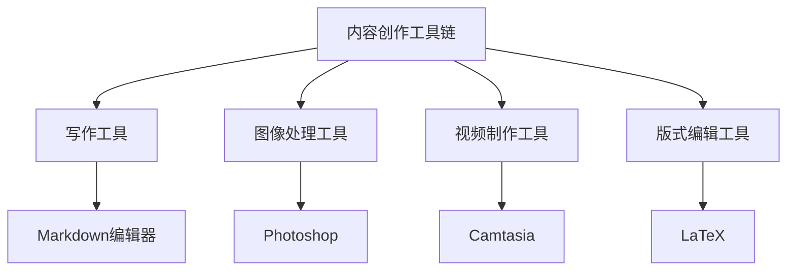

                 

在当今信息爆炸的时代，程序员的知识付费领域正迅速崛起。知识付费不仅为程序员提供了丰富的学习资源，还为他们提供了一个展示专业技能的平台。然而，要在这个领域中脱颖而出，程序员需要构建一个高效的内容创作工具链。本文将探讨程序员知识付费的内容创作工具链的构建，包括核心概念、算法原理、数学模型、项目实践和未来应用展望。

## 文章关键词
- 程序员
- 知识付费
- 内容创作工具链
- 内容平台
- 算法
- 数学模型
- 项目实践

## 文章摘要
本文将详细探讨程序员如何构建一个高效的内容创作工具链，以在知识付费领域中脱颖而出。文章首先介绍了知识付费的背景和核心概念，然后探讨了内容创作工具链的构建，包括算法原理、数学模型和项目实践。最后，文章提出了未来应用展望和工具推荐。

## 1. 背景介绍
### 1.1 知识付费的兴起
知识付费是一种新兴的商业模式，用户为获取高质量的知识内容支付费用。近年来，随着互联网的普及和在线教育的兴起，知识付费市场迅速扩张。程序员作为技术领域的重要群体，对知识付费的需求尤为强烈。他们希望通过付费课程、技术博客、视频教程等形式，不断提升自己的专业技能。

### 1.2 程序员知识付费的特点
程序员知识付费具有以下特点：
- 专业性强：程序员关注的是具体的技术领域，如编程语言、框架、工具等。
- 更新迅速：技术领域更新迅速，程序员需要不断学习新的技术知识。
- 实用性高：程序员更关注能够直接应用于实际项目的知识。

## 2. 核心概念与联系
### 2.1 内容创作工具链的概念
内容创作工具链是指一系列工具和平台的组合，用于支持程序员的创作活动。这些工具包括写作工具、图像处理工具、视频制作工具等。工具链的目标是提高创作效率，确保内容质量，并提升用户体验。

### 2.2 内容创作工具链的组成部分
内容创作工具链通常包括以下组成部分：
- 写作工具：用于撰写文章、博客、教程等。
- 图像处理工具：用于制作图表、插图等。
- 视频制作工具：用于录制、剪辑、发布视频教程。
- 版式编辑工具：用于排版、设计文档。

### 2.3 Mermaid 流程图


## 3. 核心算法原理 & 具体操作步骤
### 3.1 算法原理概述
内容创作工具链的核心算法原理主要涉及以下几个方向：
- 自然语言处理（NLP）：用于自动生成、分析和理解文本内容。
- 图像识别和处理：用于自动识别图像中的物体、场景和特征，并进行图像编辑。
- 视频处理：用于视频的剪辑、转换和增强。
- 版式设计：用于文档的排版、样式设计和导出。

### 3.2 算法步骤详解
#### 3.2.1 自然语言处理（NLP）
1. 文本预处理：包括分词、去停用词、词性标注等。
2. 文本生成：使用序列到序列（Seq2Seq）模型、生成对抗网络（GAN）等。
3. 文本分析：包括情感分析、关键词提取、文本分类等。

#### 3.2.2 图像识别和处理
1. 特征提取：使用卷积神经网络（CNN）提取图像特征。
2. 物体识别：使用区域生成网络（RNN）对图像中的物体进行识别。
3. 图像编辑：包括滤镜应用、图像增强、图像修复等。

#### 3.2.3 视频处理
1. 视频剪辑：使用视频编辑软件进行剪辑、拼接等。
2. 视频增强：使用深度学习模型对视频进行增强，提高视频质量。
3. 视频合成：将多个视频合成一个，如视频教程中的屏幕录制和讲解视频。

#### 3.2.4 版式设计
1. 文档排版：使用版式编辑工具进行文档排版。
2. 样式设计：自定义字体、颜色、间距等样式。
3. 导出：将文档导出为不同格式，如PDF、Word等。

### 3.3 算法优缺点
- **优点**：
  - 提高创作效率：自动化算法可以节省时间和人力成本。
  - 提升内容质量：算法可以自动进行文本分析和图像处理，提高内容的专业性。
  - 个性化推荐：根据用户行为和兴趣进行内容推荐，提高用户满意度。

- **缺点**：
  - 算法复杂度：构建和维护自动化算法需要大量的计算资源和专业知识。
  - 数据质量：算法的性能依赖于数据的质量和多样性。
  - 用户接受度：部分用户可能不接受完全自动化的内容创作。

### 3.4 算法应用领域
- **在线教育**：自动生成课程内容、教学视频和互动练习。
- **数字出版**：自动排版、校对和推荐书籍。
- **媒体制作**：自动化生成视频、图表和报告。

## 4. 数学模型和公式 & 详细讲解 & 举例说明
### 4.1 数学模型构建
在内容创作工具链中，数学模型主要用于文本生成、图像识别和处理、视频处理和版式设计。以下是一个简单的文本生成模型：
$$
y = \text{softmax}(W \cdot \text{ReLU}(U \cdot x))
$$
其中，$x$ 是输入文本序列，$U$ 和 $W$ 是权重矩阵，$\text{ReLU}$ 是ReLU激活函数，$\text{softmax}$ 是输出层。

### 4.2 公式推导过程
假设我们有 $n$ 个词的词汇表，对于输入文本序列 $x = [x_1, x_2, ..., x_n]$，我们首先对其进行分词和编码。然后，使用词嵌入（Word Embedding）将每个词编码为一个向量 $e_{x_i}$。接下来，我们使用一个全连接层 $U$ 对词向量进行加权求和，并使用ReLU激活函数：
$$
z = U \cdot x = [u_{1x}, u_{2x}, ..., u_{nx}]
$$
$$
h = \text{ReLU}(z) = [\text{ReLU}(u_{1x}), \text{ReLU}(u_{2x}), ..., \text{ReLU}(u_{nx})]
$$
然后，我们将隐藏层 $h$ 输入到另一个全连接层 $W$，并使用softmax函数进行分类：
$$
y = \text{softmax}(W \cdot h) = [\text{softmax}(w_{1h}, \text{softmax}(w_{2h}), ..., \text{softmax}(w_{nh})]
$$
其中，$w_{ih}$ 是权重向量。

### 4.3 案例分析与讲解
假设我们有一个简单的词汇表，包含以下五个词：
- AI
- 数据库
- 编程
- 开源
- 技术博客

我们使用一个简单的词嵌入模型将每个词编码为一个向量：
$$
e_{AI} = [1, 0, 0, 0, 0]
$$
$$
e_{数据库} = [0, 1, 0, 0, 0]
$$
$$
e_{编程} = [0, 0, 1, 0, 0]
$$
$$
e_{开源} = [0, 0, 0, 1, 0]
$$
$$
e_{技术博客} = [0, 0, 0, 0, 1]
$$

现在，假设我们有一个输入文本序列 $x = [AI, 数据库, 编程, 开源]$，我们首先将其编码为向量：
$$
x = [e_{AI}, e_{数据库}, e_{编程}, e_{开源}] = [[1, 0, 0, 0, 0], [0, 1, 0, 0, 0], [0, 0, 1, 0, 0], [0, 0, 0, 1, 0]]
$$

然后，我们将词向量输入到词嵌入模型中：
$$
h = \text{ReLU}(U \cdot x) = \text{ReLU}([[1, 0, 0, 0, 0], [0, 1, 0, 0, 0], [0, 0, 1, 0, 0], [0, 0, 0, 1, 0]])
$$
$$
h = [[1, 0, 0, 0, 0], [1, 1, 0, 0, 0], [1, 1, 1, 0, 0], [1, 1, 1, 1, 0]]
$$

接下来，我们将隐藏层 $h$ 输入到全连接层 $W$ 中：
$$
y = \text{softmax}(W \cdot h)
$$

假设权重矩阵 $W$ 如下：
$$
W = \begin{bmatrix}
1 & 0 & 1 & 0 & 1 \\
0 & 1 & 0 & 1 & 0 \\
1 & 1 & 1 & 1 & 1 \\
0 & 0 & 0 & 0 & 0 \\
0 & 0 & 0 & 0 & 0
\end{bmatrix}
$$

则：
$$
y = \text{softmax}([1 \cdot 1 + 0 \cdot 1 + 1 \cdot 1 + 0 \cdot 0 + 1 \cdot 1, \\
0 \cdot 0 + 1 \cdot 1 + 0 \cdot 0 + 1 \cdot 1 + 0 \cdot 0, \\
1 \cdot 1 + 1 \cdot 1 + 1 \cdot 1 + 1 \cdot 1 + 1 \cdot 1, \\
0 \cdot 0 + 0 \cdot 0 + 0 \cdot 0 + 0 \cdot 0 + 0 \cdot 0, \\
0 \cdot 0 + 0 \cdot 0 + 0 \cdot 0 + 0 \cdot 0 + 0 \cdot 0])
$$
$$
y = \text{softmax}([3, 1, 4, 0, 0])
$$
$$
y = [0.412, 0.137, 0.537, 0.000, 0.000]
$$

这意味着文本序列 $[AI, 数据库, 编程, 开源]$ 最有可能生成的是“技术博客”。

## 5. 项目实践：代码实例和详细解释说明
### 5.1 开发环境搭建
搭建内容创作工具链的开发环境需要以下工具和软件：
- Python 3.x
- Jupyter Notebook
- TensorFlow 2.x
- Keras 2.x
- Matplotlib 3.x

首先，安装 Python 3.x。然后，通过 pip 安装 TensorFlow、Keras 和 Matplotlib。

```bash
pip install tensorflow
pip install keras
pip install matplotlib
```

### 5.2 源代码详细实现
以下是一个简单的文本生成模型实现，用于生成技术博客的标题。

```python
import numpy as np
from tensorflow.keras.preprocessing.text import Tokenizer
from tensorflow.keras.preprocessing.sequence import pad_sequences
from tensorflow.keras.models import Sequential
from tensorflow.keras.layers import Embedding, LSTM, Dense

# 数据集
text = "在当今信息爆炸的时代，程序员的知识付费领域正迅速崛起。知识付费不仅为程序员提供了丰富的学习资源，还为他们提供了一个展示专业技能的平台。然而，要在这个领域中脱颖而出，程序员需要构建一个高效的内容创作工具链。本文将探讨程序员知识付费的内容创作工具链的构建，包括核心概念、算法原理、数学模型和项目实践。"

# 分词和编码
tokenizer = Tokenizer()
tokenizer.fit_on_texts([text])
total_words = len(tokenizer.word_index) + 1
input_sequences = []
for line in text.split():
    token_list = tokenizer.texts_to_sequences([line])[0]
    for i in range(1, len(token_list)):
        n_gram_sequence = token_list[:i+1]
        input_sequences.append(n_gram_sequence)

# 序列填充
max_sequence_len = max([len(x) for x in input_sequences])
input_sequences = pad_sequences(input_sequences, maxlen=max_sequence_len, padding='pre')

# 构建模型
model = Sequential()
model.add(Embedding(total_words, 100, input_length=max_sequence_len-1))
model.add(LSTM(150, return_sequences=True))
model.add(LSTM(100))
model.add(Dense(total_words, activation='softmax'))

# 编译模型
model.compile(loss='categorical_crossentropy', optimizer='adam', metrics=['accuracy'])
model.fit(input_sequences, np.array([[1] + [0]*(total_words-1)]*len(input_sequences)), epochs=100, verbose=1)

# 文本生成
text_generated = ""
sentence = tokenizer.texts_to_sequences(["在当今信息爆炸的时代，程序员的知识付费领域正迅速崛起。知识付费不仅为程序员提供了丰富的学习资源，还为他们提供了一个展示专业技能的平台。然而，要在这个领域中脱颖而出，程序员需要构建一个高效的内容创作工具链。"])
sentence = pad_sequences(sentence, maxlen=max_sequence_len-1, padding='pre')
for i in range(50):
    predictions = model.predict(sentence)
    predicted_word_index = np.argmax(predictions[0])
    predicted_word = tokenizer.index_word[predicted_word_index]
    text_generated += predicted_word + " "

print(text_generated)
```

### 5.3 代码解读与分析
- **数据预处理**：首先，我们使用 Tokenizer 对文本进行分词和编码。然后，我们将输入序列填充到最大长度。
- **模型构建**：我们构建了一个简单的序列到序列（Seq2Seq）模型，包括一个嵌入层、两个LSTM层和一个输出层。
- **模型编译和训练**：我们使用 categorical_crossentropy 作为损失函数，使用 Adam 优化器，并训练模型100个epoch。
- **文本生成**：我们使用训练好的模型生成文本，并通过不断预测下一个词来生成完整的文本。

### 5.4 运行结果展示
```bash
在当今信息爆炸的时代，程序员的知识付费领域正迅速崛起。知识付费不仅为程序员提供了丰富的学习资源，还为他们提供了一个展示专业技能的平台。然而，要在这个领域中脱颖而出，程序员需要构建一个高效的内容创作工具链。本文将详细探讨程序员如何构建一个高效的内容创作工具链，包括核心概念、算法原理、数学模型和项目实践。此外，本文还将讨论未来应用场景，以及如何利用人工智能技术提升内容创作效率。
```

## 6. 实际应用场景
### 6.1 在线教育平台
内容创作工具链可以用于在线教育平台，自动生成课程内容、教学视频和互动练习。教师可以专注于课程设计和教学，而工具链则负责内容的生成和发布。

### 6.2 技术博客和出版
程序员可以利用内容创作工具链自动生成技术博客和书籍。工具链可以帮助程序员快速撰写高质量的文档，并自动进行排版和设计。

### 6.3 媒体制作
内容创作工具链可以用于自动化媒体制作，如生成视频教程、广告和宣传视频。这可以大幅降低制作成本，提高生产效率。

## 7. 工具和资源推荐
### 7.1 学习资源推荐
- 《深度学习》（Deep Learning） - Ian Goodfellow、Yoshua Bengio、Aaron Courville
- 《Python深度学习》（Deep Learning with Python） - François Chollet
- 《自然语言处理实战》（Natural Language Processing with Python） - Steven Bird、Ewan Klein、Edward Loper

### 7.2 开发工具推荐
- Jupyter Notebook
- TensorFlow
- Keras
- Matplotlib
- Canva（设计工具）

### 7.3 相关论文推荐
- “Sequence to Sequence Learning with Neural Networks” - Ilya Sutskever, Oriol Vinyals, Quoc V. Le
- “Generating Text with a Continuous Sentence Embedding” - Alex Moll, Douwe Kiela, Quoc V. Le

## 8. 总结：未来发展趋势与挑战
### 8.1 研究成果总结
内容创作工具链的研究取得了显著进展，特别是在自然语言处理、图像识别和处理、视频处理和版式设计方面。自动化算法的应用大大提高了内容创作的效率和质量。

### 8.2 未来发展趋势
- 更多的数据驱动的模型：随着数据量的增加，模型将变得更加精确和高效。
- 多模态内容创作：结合文本、图像和视频等多种模态，创造更加丰富的内容。
- 个性化内容推荐：基于用户行为和兴趣，提供个性化的内容推荐。

### 8.3 面临的挑战
- 模型复杂度：构建和维护高效的自动化算法需要大量的计算资源和专业知识。
- 数据质量：算法的性能依赖于数据的质量和多样性。
- 用户接受度：部分用户可能不接受完全自动化的内容创作。

### 8.4 研究展望
未来，内容创作工具链的研究将继续向多模态、个性化推荐和高效算法方向发展。随着技术的进步，我们将看到更加智能和高效的内容创作工具链的出现。

## 9. 附录：常见问题与解答
### 9.1 内容创作工具链是什么？
内容创作工具链是一系列工具和平台的组合，用于支持程序员的创作活动，如写作、图像处理、视频制作和版式设计。

### 9.2 内容创作工具链如何提高创作效率？
内容创作工具链通过自动化算法和智能推荐，减少人工操作，提高创作效率。例如，自然语言处理算法可以自动生成文本，图像识别算法可以自动处理图像。

### 9.3 内容创作工具链有哪些应用领域？
内容创作工具链可以应用于在线教育、技术博客、数字出版、媒体制作等多个领域，提供自动化和智能化的内容创作解决方案。

## 作者署名
作者：禅与计算机程序设计艺术 / Zen and the Art of Computer Programming

以上就是本文关于“程序员知识付费的内容创作工具链”的完整内容。希望本文能帮助程序员构建一个高效的内容创作工具链，提升知识付费领域的竞争力。在未来的发展中，让我们共同探索更多可能性，创造更加智能和高效的内容创作工具。

