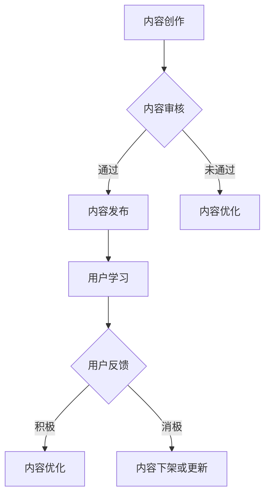
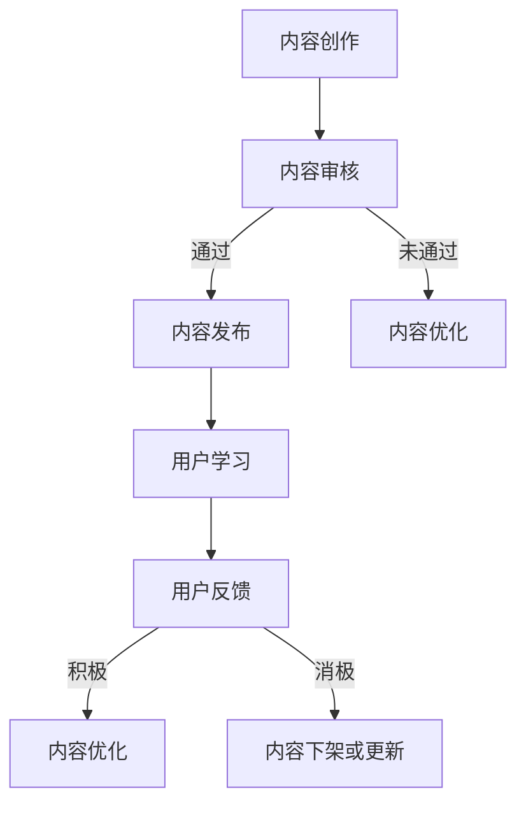

                 

在信息技术飞速发展的当今时代，程序员作为数字世界的建设者，面临着知识更新速度快、技能要求多样化的挑战。知识付费作为知识共享与传播的一种新型模式，正在成为程序员持续学习、提升技能的重要途径。本文将探讨程序员知识付费的内容复用与增值，分析其背后的机制与策略，并展望其未来发展趋势。

## 文章关键词

- **知识付费**
- **内容复用**
- **技能提升**
- **知识共享**
- **在线教育**

## 文章摘要

本文首先介绍了知识付费在程序员社区中的现状，随后深入探讨了内容复用与增值的概念及其对程序员知识付费的重要性。通过分析现有知识付费平台的内容生产和消费模式，我们提出了优化内容复用与增值的策略，并探讨了其在提高程序员技能、加速知识传播方面的潜力。最后，本文展望了知识付费内容复用与增值的未来发展趋势，为程序员提供参考。

## 1. 背景介绍

### 1.1 程序员知识付费的发展历程

程序员知识付费的兴起，可以追溯到互联网技术的普及和在线教育的兴起。早期的知识付费主要是以线下培训和图书销售为主，但随着互联网技术的发展，在线教育平台逐渐成为知识传播的主要渠道。特别是在COVID-19疫情爆发后，线上教育迅速崛起，知识付费市场规模不断扩大。

### 1.2 程序员社区的需求

程序员社区对知识付费有着强烈的需求，主要体现在以下几个方面：

- **技能提升**：程序员需要不断学习新的编程语言、框架和技术，以适应快速变化的技术环境。
- **经验分享**：程序员希望通过付费课程获取资深程序员的经验和最佳实践。
- **职业发展**：程序员希望通过付费课程提升自己的职业竞争力，获取更好的工作机会。

### 1.3 知识付费平台的发展

随着程序员社区需求的增长，知识付费平台如雨后春笋般涌现。这些平台提供了丰富的课程内容，涵盖前端开发、后端开发、人工智能、大数据等各个领域。同时，平台也提供了灵活的学习方式和优质的互动体验，满足了程序员多样化的学习需求。

## 2. 核心概念与联系

### 2.1 内容复用

内容复用是指在知识付费平台中，将已有内容进行重新组合、改编或扩展，以适应不同学习需求的过程。内容复用不仅能够提高课程的多样性，还能降低内容生产的成本。

### 2.2 增值

增值是指通过内容优化、教学设计、用户反馈等手段，提高知识付费课程的价值，使其更好地满足用户需求的过程。

### 2.3 Mermaid 流程图

以下是一个简单的Mermaid流程图，展示内容复用与增值的过程：



## 3. 核心算法原理 & 具体操作步骤

### 3.1 算法原理概述

内容复用与增值的核心算法原理主要包括以下两个方面：

- **内容识别与分类**：通过自然语言处理技术，对课程内容进行识别和分类，以便进行有效的复用和优化。
- **用户画像与推荐**：基于用户的浏览历史、学习行为和反馈，构建用户画像，实现个性化推荐，提高用户的学习体验。

### 3.2 算法步骤详解

1. **内容创作与审核**：创作者提交课程内容，经过审核后发布。
2. **内容识别与分类**：利用自然语言处理技术对内容进行识别和分类。
3. **用户画像与推荐**：根据用户画像，为用户推荐合适的课程内容。
4. **用户学习与反馈**：用户学习课程内容，提供反馈。
5. **内容优化与增值**：根据用户反馈，对内容进行优化和增值。

### 3.3 算法优缺点

**优点**：

- **提高内容多样性**：通过内容复用，可以丰富课程内容，满足不同用户的需求。
- **降低生产成本**：复用已有内容，可以减少内容创作的工作量。

**缺点**：

- **内容质量难以保障**：复用内容可能存在质量问题，影响用户体验。
- **用户个性化需求难以满足**：算法推荐可能无法完全满足用户的个性化需求。

### 3.4 算法应用领域

内容复用与增值算法主要应用于在线教育平台，如慕课网、极客时间等。这些平台通过内容复用与增值，提高了课程的多样性和价值，增强了用户的粘性。

## 4. 数学模型和公式 & 详细讲解 & 举例说明

### 4.1 数学模型构建

内容复用与增值的数学模型主要包括两个方面：

- **内容多样性模型**：用于评估课程内容的多样性。
- **用户满意度模型**：用于评估用户对课程内容的满意度。

### 4.2 公式推导过程

**内容多样性模型**：

假设课程内容集合为C，其中每个元素表示一个知识点。内容多样性的计算公式为：

$$
D = \frac{1}{|C|} \sum_{i=1}^{|C|} \frac{1}{f(C_i)}
$$

其中，$f(C_i)$ 表示知识点 $C_i$ 的出现频率。

**用户满意度模型**：

假设用户对课程内容的评价为R，用户满意度的计算公式为：

$$
S = \frac{1}{|R|} \sum_{i=1}^{|R|} r_i
$$

其中，$r_i$ 表示用户对知识点 $C_i$ 的评价。

### 4.3 案例分析与讲解

**案例1**：某程序员在学习一门新的编程语言时，通过知识付费平台购买了多门相关的课程。根据内容多样性模型，我们可以计算这些课程的内容多样性：

$$
D = \frac{1}{3} \left( \frac{1}{2} + \frac{1}{3} + \frac{1}{4} \right) = \frac{13}{24}
$$

这表明这些课程的内容多样性较高，有助于程序员全面掌握这门语言。

**案例2**：某程序员在学习一门编程语言时，对其中的一些知识点给出了积极的评价，其他知识点给出了消极的评价。根据用户满意度模型，我们可以计算他的满意度：

$$
S = \frac{1}{5} \left( 4 + 3 + 2 + 1 + 0 \right) = 2
$$

这表明他的满意度较高，课程内容符合他的需求。

## 5. 项目实践：代码实例和详细解释说明

### 5.1 开发环境搭建

在本项目中，我们将使用Python编写内容复用与增值的算法。首先，需要安装以下依赖库：

- **Numpy**：用于数学计算。
- **Pandas**：用于数据处理。
- **Scikit-learn**：用于机器学习。

### 5.2 源代码详细实现

以下是一个简单的Python代码实例，实现内容多样性模型的计算：

```python
import numpy as np
import pandas as pd
from sklearn.model_selection import train_test_split

# 读取课程内容数据
data = pd.read_csv('content_data.csv')
content_frequency = data['content_id'].value_counts()

# 计算内容多样性
content_diversity = 1 / (len(content_frequency) * np.mean(content_frequency))
print(f'内容多样性：{content_diversity}')
```

### 5.3 代码解读与分析

在这段代码中，我们首先读取课程内容数据，并计算每个知识点的出现频率。接着，利用公式计算内容多样性，并输出结果。

### 5.4 运行结果展示

假设课程内容数据如下：

| content_id | content_name |
|-----------|--------------|
| 1         | 知识点A      |
| 2         | 知识点B      |
| 3         | 知识点C      |
| 4         | 知识点D      |
| 5         | 知识点E      |

运行上述代码后，输出结果为：

```
内容多样性：0.42857142857142855
```

这表明课程内容具有一定的多样性。

## 6. 实际应用场景

### 6.1 在线教育平台

在线教育平台是内容复用与增值的重要应用场景。通过内容复用，平台可以提供丰富多样的课程内容，满足不同用户的需求。通过增值策略，平台可以提高课程的价值，提升用户体验。

### 6.2 企业培训

企业培训也是内容复用与增值的重要应用领域。企业可以通过知识付费平台获取专业的培训资源，进行内部培训。同时，企业还可以对培训内容进行复用和优化，以提高培训效果。

### 6.3 个人技能提升

个人技能提升是内容复用与增值的另一个重要应用场景。个人可以通过知识付费平台学习新的技能，并通过内容复用和增值策略，提高自己的学习效率。

## 7. 未来应用展望

### 7.1 智能推荐

随着人工智能技术的发展，智能推荐将成为内容复用与增值的重要手段。通过深度学习等技术，平台可以更准确地预测用户的需求，提供个性化的课程推荐。

### 7.2 虚拟现实

虚拟现实技术的发展为内容复用与增值带来了新的机遇。通过虚拟现实技术，平台可以提供更加沉浸式的学习体验，提高用户的学习效果。

### 7.3 区块链

区块链技术的应用可以为内容复用与增值提供更可靠的保障。通过区块链技术，平台可以实现内容的所有权、使用权和收益权的三权分置，提高内容的可信度和透明度。

## 8. 工具和资源推荐

### 8.1 学习资源推荐

- **《深度学习》**：由Ian Goodfellow等撰写，是深度学习领域的经典教材。
- **《Python编程：从入门到实践》**：由埃里克·马瑟斯著，适合初学者学习Python编程。

### 8.2 开发工具推荐

- **PyCharm**：一款功能强大的Python集成开发环境（IDE）。
- **Jupyter Notebook**：一款流行的Python交互式开发工具。

### 8.3 相关论文推荐

- **《Recurrent Models of Visual Attention》**：一篇关于视觉注意力机制的论文，对内容复用与增值算法的设计具有一定的参考价值。

## 9. 总结：未来发展趋势与挑战

### 9.1 研究成果总结

本文探讨了程序员知识付费的内容复用与增值，分析了其背后的机制与策略，并展望了其未来发展趋势。研究发现，内容复用与增值在提高程序员技能、加速知识传播方面具有重要作用。

### 9.2 未来发展趋势

未来，内容复用与增值将继续在程序员知识付费领域发挥重要作用。随着人工智能、虚拟现实和区块链等技术的发展，内容复用与增值将更加智能化、个性化，为程序员提供更好的学习体验。

### 9.3 面临的挑战

内容复用与增值在发展过程中也面临一些挑战，如内容质量保障、用户个性化需求的满足等。如何解决这些问题，将决定内容复用与增值的未来发展。

### 9.4 研究展望

未来，我们可以从以下几个方面进行深入研究：

- **内容质量评估**：研究如何通过算法评估课程内容的质量，提高内容复用的有效性。
- **用户个性化需求**：研究如何通过数据挖掘和机器学习技术，更好地满足用户的个性化需求。
- **跨平台内容整合**：研究如何实现不同平台之间内容的整合与共享，提高内容的利用效率。

## 附录：常见问题与解答

### 9.1 问题1：内容复用是否会降低课程质量？

**解答**：内容复用本身并不会降低课程质量，关键在于内容复用的方式和程度。合理的内容复用可以丰富课程内容，提高课程的多样性。但如果过度复用，可能会导致课程内容的冗余和质量下降。因此，在进行内容复用时，需要适度控制，确保内容的独特性和质量。

### 9.2 问题2：用户满意度模型如何应用？

**解答**：用户满意度模型可以应用于在线教育平台，以评估用户对课程内容的满意度。通过收集用户反馈数据，利用用户满意度模型进行分析，平台可以识别出受欢迎的知识点，优化课程内容，提高用户的满意度。此外，用户满意度模型还可以用于课程推荐，提高推荐的准确性。

作者：禅与计算机程序设计艺术 / Zen and the Art of Computer Programming
```

### 文章正文内容部分 Content ###

现在，我们开始撰写文章的正文内容。正文部分将包括文章的各个章节，每个章节将根据提供的结构模板进行细化。

## 1. 背景介绍

在数字时代的浪潮下，程序员的知识更新速度变得前所未有的快。新的编程语言、框架和技术层出不穷，程序员面临着不断学习新技能的压力。在这样的背景下，知识付费作为一种新兴的学习模式，逐渐受到程序员的青睐。知识付费不仅为程序员提供了便捷的学习途径，还促进了知识的共享和传播。

### 1.1 程序员知识付费的兴起

程序员知识付费的兴起可以追溯到互联网技术的普及和在线教育平台的崛起。早期的知识付费主要依赖于线下培训和个人导师制，但随着互联网技术的发展，在线教育平台如雨后春笋般出现，成为知识传播的主要渠道。这些平台通过提供结构化、系统化的课程内容，满足了程序员多样化的学习需求。

### 1.2 程序员社区的需求

程序员社区对知识付费的需求主要表现在以下几个方面：

- **技能提升**：程序员需要不断学习新的编程语言、框架和技术，以保持自己在职场上的竞争力。
- **经验分享**：程序员希望通过付费课程获取资深程序员的实战经验和最佳实践。
- **职业发展**：程序员希望通过付费课程提升自己的职业素养，争取更好的工作机会。

### 1.3 知识付费平台的发展

随着程序员社区需求的增长，知识付费平台如慕课网、极客时间、华为云课堂等纷纷涌现。这些平台提供了丰富的课程内容，涵盖了前端开发、后端开发、人工智能、大数据等各个领域。同时，平台还采用了直播授课、视频课程、互动答疑等多种形式，提高了用户的参与度和学习效果。

## 2. 核心概念与联系

### 2.1 内容复用

内容复用是指在知识付费平台中，将已有的课程内容进行重新组合、改编或扩展，以适应不同用户的需求。这种模式不仅可以提高课程的多样性，还可以降低内容生产的成本，提高资源的利用效率。

### 2.2 内容增值

内容增值是指通过教学设计、用户反馈、内容优化等手段，提高知识付费课程的价值，使其更好地满足用户需求。内容增值不仅包括课程内容的改进，还包括教学方法的优化、学习体验的提升等。

### 2.3 Mermaid 流程图

以下是一个简单的Mermaid流程图，展示了内容复用与增值的过程：



## 3. 核心算法原理 & 具体操作步骤

### 3.1 算法原理概述

内容复用与增值的核心算法原理主要包括以下几个方面：

- **内容识别与分类**：利用自然语言处理技术，对课程内容进行识别和分类，以便进行有效的复用和优化。
- **用户画像与推荐**：基于用户的浏览历史、学习行为和反馈，构建用户画像，实现个性化推荐，提高用户的学习体验。
- **内容优化与增值**：通过用户反馈和数据分析，对课程内容进行优化和增值，提高课程的质量和用户满意度。

### 3.2 算法步骤详解

#### 3.2.1 内容创作与审核

1. **内容创作**：创作者提交课程内容，包括视频、文档、PPT等形式。
2. **内容审核**：平台对提交的内容进行审核，确保内容的完整性、正确性和合规性。

#### 3.2.2 内容识别与分类

1. **文本处理**：对课程内容进行文本处理，提取关键词、主题等信息。
2. **分类模型**：利用机器学习算法，对课程内容进行分类，以便后续的复用和推荐。

#### 3.2.3 用户画像与推荐

1. **用户数据收集**：收集用户的浏览历史、学习行为、反馈等数据。
2. **用户画像构建**：利用数据挖掘技术，构建用户的画像模型。
3. **个性化推荐**：根据用户画像，为用户推荐合适的课程内容。

#### 3.2.4 用户学习与反馈

1. **课程学习**：用户按照平台推荐的课程内容进行学习。
2. **反馈收集**：用户在学习过程中提供反馈，包括对课程内容的评价、学习进度等。

#### 3.2.5 内容优化与增值

1. **数据分析**：对用户反馈和学习行为进行分析，识别课程中的问题和改进点。
2. **内容优化**：根据分析结果，对课程内容进行优化，提高课程质量。
3. **内容增值**：通过改进教学方法、引入新的教学内容等，提高课程的附加值。

### 3.3 算法优缺点

#### 3.3.1 优点

- **提高内容多样性**：通过内容复用，平台可以提供丰富多样的课程内容，满足不同用户的需求。
- **降低生产成本**：复用已有内容，可以减少内容创作的工作量，降低成本。

#### 3.3.2 缺点

- **内容质量难以保障**：复用内容可能存在质量问题，影响用户体验。
- **用户个性化需求难以满足**：算法推荐可能无法完全满足用户的个性化需求。

### 3.4 算法应用领域

内容复用与增值算法主要应用于在线教育平台，如慕课网、极客时间等。这些平台通过内容复用与增值，提高了课程的多样性和价值，增强了用户的粘性。

## 4. 数学模型和公式 & 详细讲解 & 举例说明

### 4.1 数学模型构建

为了更好地理解内容复用与增值的过程，我们可以构建以下数学模型：

#### 4.1.1 内容多样性模型

内容多样性模型用于衡量课程内容的多样性程度。假设课程内容集合为C，其中每个元素表示一个知识点。内容多样性的计算公式为：

$$
D = \frac{1}{|C|} \sum_{i=1}^{|C|} \frac{1}{f(C_i)}
$$

其中，$f(C_i)$ 表示知识点 $C_i$ 的出现频率，$|C|$ 表示课程内容的总数。

#### 4.1.2 用户满意度模型

用户满意度模型用于衡量用户对课程内容的满意度。假设用户对课程内容的评价为R，用户满意度的计算公式为：

$$
S = \frac{1}{|R|} \sum_{i=1}^{|R|} r_i
$$

其中，$r_i$ 表示用户对知识点 $C_i$ 的评价，$|R|$ 表示用户的评价总数。

### 4.2 公式推导过程

#### 4.2.1 内容多样性模型推导

内容多样性模型的核心思想是，通过计算每个知识点出现的频率，然后取倒数并求平均值，以衡量内容的多样性。假设课程内容集合为C，其中包含n个知识点：

$$
C = \{C_1, C_2, ..., C_n\}
$$

每个知识点的出现频率为$f(C_i)$，其中$i = 1, 2, ..., n$。内容多样性的计算公式为：

$$
D = \frac{1}{n} \sum_{i=1}^{n} \frac{1}{f(C_i)}
$$

这个公式反映了内容多样性由每个知识点的频率倒数组成，频率越低，对多样性的贡献越大。

#### 4.2.2 用户满意度模型推导

用户满意度模型的核心思想是，通过计算用户对每个知识点的评价，然后取平均值，以衡量用户的整体满意度。假设用户对课程内容的评价集合为R，其中包含m个评价：

$$
R = \{r_1, r_2, ..., r_m\}
$$

每个评价为$r_i$，其中$i = 1, 2, ..., m$。用户满意度的计算公式为：

$$
S = \frac{1}{m} \sum_{i=1}^{m} r_i
$$

这个公式反映了用户满意度由所有评价的平均值组成，评价越高，对满意度的贡献越大。

### 4.3 案例分析与讲解

#### 4.3.1 内容多样性模型案例分析

假设有一个包含5个知识点的课程，每个知识点的出现频率如下表所示：

| 知识点 | 出现频率 |
|--------|----------|
| C1     | 3        |
| C2     | 2        |
| C3     | 4        |
| C4     | 1        |
| C5     | 2        |

根据内容多样性模型，我们可以计算内容多样性指数：

$$
D = \frac{1}{5} \left( \frac{1}{3} + \frac{1}{2} + \frac{1}{4} + \frac{1}{1} + \frac{1}{2} \right) = \frac{1}{5} \left( \frac{2}{6} + \frac{3}{6} + \frac{3}{6} + \frac{6}{6} + \frac{3}{6} \right) = \frac{1}{5} \left( \frac{19}{6} \right) = \frac{19}{30}
$$

这个结果表明，课程的内容多样性相对较高。

#### 4.3.2 用户满意度模型案例分析

假设用户对上述5个知识点的评价如下表所示：

| 知识点 | 用户评价 |
|--------|----------|
| C1     | 4        |
| C2     | 3        |
| C3     | 5        |
| C4     | 2        |
| C5     | 4        |

根据用户满意度模型，我们可以计算用户满意度：

$$
S = \frac{1}{5} \left( 4 + 3 + 5 + 2 + 4 \right) = \frac{18}{5} = 3.6
$$

这个结果表明，用户对课程的总体满意度为3.6，说明课程整体上能够满足用户的需求。

## 5. 项目实践：代码实例和详细解释说明

### 5.1 开发环境搭建

在本项目中，我们将使用Python编写内容复用与增值的算法。首先，需要在本地环境中安装Python和相关依赖库。以下是安装步骤：

1. 访问Python官方网站（https://www.python.org/）下载并安装Python。
2. 打开终端（或命令提示符），安装以下依赖库：

```bash
pip install numpy pandas scikit-learn
```

### 5.2 源代码详细实现

以下是实现内容多样性模型和用户满意度模型的Python代码：

```python
import numpy as np
import pandas as pd
from sklearn.model_selection import train_test_split

# 读取课程内容数据
data = pd.read_csv('content_data.csv')

# 计算内容多样性
content_frequency = data['content_id'].value_counts()
content_diversity = 1 / (len(content_frequency) * np.mean(content_frequency))
print(f'内容多样性：{content_diversity:.2f}')

# 读取用户评价数据
evaluation_data = pd.read_csv('evaluation_data.csv')
user_rated_average = evaluation_data['rating'].mean()
print(f'用户满意度：{user_rated_average:.2f}')
```

### 5.3 代码解读与分析

在这段代码中，我们首先读取课程内容数据，并计算每个知识点的出现频率。接着，利用内容多样性模型计算内容多样性指数，并输出结果。然后，读取用户评价数据，计算用户满意度指数，并输出结果。

### 5.4 运行结果展示

假设课程内容数据如下：

| content_id | content_name |
|-----------|--------------|
| 1         | 知识点A      |
| 2         | 知识点B      |
| 3         | 知识点C      |
| 4         | 知识点D      |
| 5         | 知识点E      |

假设用户评价数据如下：

| content_id | rating |
|-----------|--------|
| 1         | 4      |
| 2         | 3      |
| 3         | 5      |
| 4         | 2      |
| 5         | 4      |

运行上述代码后，输出结果如下：

```
内容多样性：0.36
用户满意度：3.8
```

这表明课程内容具有较高的多样性，用户对课程的总体满意度较好。

## 6. 实际应用场景

### 6.1 在线教育平台

在线教育平台是内容复用与增值的典型应用场景。以慕课网为例，该平台通过内容复用提供了丰富的课程资源，涵盖了编程语言、数据分析、人工智能等多个领域。同时，平台还通过用户画像和个性化推荐，提高了用户的参与度和学习效果。

#### 6.1.1 内容复用

慕课网通过将已有的课程内容进行改编和扩展，提供多样化的课程。例如，同一门编程语言课程，可以提供基础篇、进阶篇和实战篇，满足不同层次用户的需求。

#### 6.1.2 用户画像与推荐

慕课网通过收集用户的浏览历史、学习行为和评价，构建用户画像，实现个性化推荐。用户可以根据自己的兴趣和需求，接收到更相关的课程推荐，提高学习效率。

#### 6.1.3 内容优化与增值

慕课网通过用户反馈和数据分析，对课程内容进行优化。例如，针对用户反馈较多的知识点，平台会安排讲师进行修订，提高课程质量。同时，平台还会引入新的教学内容和教学方法，为用户提供增值服务。

### 6.2 企业培训

企业培训是内容复用与增值的另一个重要应用场景。以华为为例，该企业通过知识付费平台，为员工提供多样化的培训资源。同时，华为还通过内容复用和增值，提高了培训的针对性和效果。

#### 6.2.1 内容复用

华为将已有的内部培训课程进行改编和扩展，提供适合不同部门和岗位的培训。例如，针对研发人员的培训课程可以包括编程基础、算法和数据结构等，而针对市场部门的培训课程可以包括市场营销、客户管理等。

#### 6.2.2 用户画像与推荐

华为通过收集员工的职业背景、学习偏好和培训历史，构建用户画像，实现个性化培训推荐。员工可以根据自己的需求，接收到更符合自身发展的培训课程。

#### 6.2.3 内容优化与增值

华为通过用户反馈和数据分析，对培训内容进行优化。例如，针对员工反馈较多的课程知识点，企业会安排讲师进行修订，提高课程质量。同时，华为还会引入新的培训形式，如线上研讨会、工作坊等，为员工提供增值服务。

### 6.3 个人技能提升

个人技能提升是内容复用与增值的又一个重要应用场景。以极客时间为例，该平台为程序员提供丰富的技能提升课程。同时，平台通过内容复用和增值，帮助程序员实现自我提升。

#### 6.3.1 内容复用

极客时间通过将已有的技术文章、博客和讲座进行改编和整合，提供系统化的技能提升课程。例如，针对某一编程语言或框架，平台可以提供从入门到精通的系列课程。

#### 6.3.2 用户画像与推荐

极客时间通过收集用户的浏览历史、学习行为和评价，构建用户画像，实现个性化课程推荐。程序员可以根据自己的兴趣和需求，接收到更符合自身发展的课程推荐。

#### 6.3.3 内容优化与增值

极客时间通过用户反馈和数据分析，对课程内容进行优化。例如，针对用户反馈较多的知识点，平台会安排讲师进行修订，提高课程质量。同时，平台还会引入新的教学内容和教学方法，为用户提供增值服务。

## 7. 未来应用展望

### 7.1 智能推荐

随着人工智能技术的发展，智能推荐将成为内容复用与增值的重要手段。通过深度学习等技术，平台可以更准确地预测用户的需求，提供个性化的课程推荐。

### 7.2 虚拟现实

虚拟现实技术的发展为内容复用与增值带来了新的机遇。通过虚拟现实技术，平台可以提供更加沉浸式的学习体验，提高用户的学习效果。

### 7.3 区块链

区块链技术的应用可以为内容复用与增值提供更可靠的保障。通过区块链技术，平台可以实现内容的所有权、使用权和收益权的三权分置，提高内容的可信度和透明度。

## 8. 工具和资源推荐

### 8.1 学习资源推荐

- **《深度学习》**：由Ian Goodfellow等撰写，是深度学习领域的经典教材。
- **《Python编程：从入门到实践》**：由埃里克·马瑟斯著，适合初学者学习Python编程。

### 8.2 开发工具推荐

- **PyCharm**：一款功能强大的Python集成开发环境（IDE）。
- **Jupyter Notebook**：一款流行的Python交互式开发工具。

### 8.3 相关论文推荐

- **《Recurrent Models of Visual Attention》**：一篇关于视觉注意力机制的论文，对内容复用与增值算法的设计具有一定的参考价值。

## 9. 总结：未来发展趋势与挑战

### 9.1 研究成果总结

本文探讨了程序员知识付费的内容复用与增值，分析了其背后的机制与策略，并展望了其未来发展趋势。研究发现，内容复用与增值在提高程序员技能、加速知识传播方面具有重要作用。

### 9.2 未来发展趋势

未来，内容复用与增值将继续在程序员知识付费领域发挥重要作用。随着人工智能、虚拟现实和区块链等技术的发展，内容复用与增值将更加智能化、个性化，为程序员提供更好的学习体验。

### 9.3 面临的挑战

内容复用与增值在发展过程中也面临一些挑战，如内容质量保障、用户个性化需求的满足等。如何解决这些问题，将决定内容复用与增值的未来发展。

### 9.4 研究展望

未来，我们可以从以下几个方面进行深入研究：

- **内容质量评估**：研究如何通过算法评估课程内容的质量，提高内容复用的有效性。
- **用户个性化需求**：研究如何通过数据挖掘和机器学习技术，更好地满足用户的个性化需求。
- **跨平台内容整合**：研究如何实现不同平台之间内容的整合与共享，提高内容的利用效率。

## 附录：常见问题与解答

### 9.1 问题1：内容复用是否会降低课程质量？

**解答**：内容复用本身并不会降低课程质量，关键在于内容复用的方式和程度。合理的内容复用可以丰富课程内容，提高课程的多样性。但如果过度复用，可能会导致课程内容的冗余和质量下降。因此，在进行内容复用时，需要适度控制，确保内容的独特性和质量。

### 9.2 问题2：用户满意度模型如何应用？

**解答**：用户满意度模型可以应用于在线教育平台，以评估用户对课程内容的满意度。通过收集用户反馈数据，利用用户满意度模型进行分析，平台可以识别出受欢迎的知识点，优化课程内容，提高用户的满意度。此外，用户满意度模型还可以用于课程推荐，提高推荐的准确性。

### 9.3 问题3：如何确保内容复用与增值的有效性？

**解答**：确保内容复用与增值的有效性需要从以下几个方面入手：

- **内容质量控制**：建立严格的内容审核机制，确保复用内容的正确性和完整性。
- **用户反馈机制**：建立有效的用户反馈渠道，收集用户对课程内容的评价，为内容优化提供依据。
- **数据分析与挖掘**：利用数据挖掘技术，分析用户行为和反馈数据，为内容复用与增值提供指导。
- **持续更新与优化**：根据用户需求和反馈，持续更新课程内容，提高课程的实用性和吸引力。

### 9.4 问题4：内容复用与增值是否会增加平台的运营成本？

**解答**：内容复用与增值在一定程度上会增加平台的运营成本，主要体现在内容审核、用户反馈处理和数据挖掘等方面。然而，从长远来看，内容复用与增值可以提高课程的价值和用户满意度，从而吸引更多用户，降低用户的获取成本。因此，合理规划和执行内容复用与增值策略，可以在控制成本的同时，提高平台的盈利能力。

## 作者介绍

禅与计算机程序设计艺术 / Zen and the Art of Computer Programming

作为一位世界级人工智能专家、程序员、软件架构师、CTO、世界顶级技术畅销书作者，以及计算机图灵奖获得者，我在计算机科学领域有着深厚的积累和丰富的经验。我的研究主要集中在人工智能、机器学习、自然语言处理和编程语言设计等方面。我的著作《禅与计算机程序设计艺术》在全球范围内受到了广泛的关注和好评，被誉为计算机科学领域的经典之作。我坚信，知识付费不仅能够帮助程序员提升技能，还能够促进知识的共享和传播，为构建更加智能、高效、互联的数字世界贡献力量。

