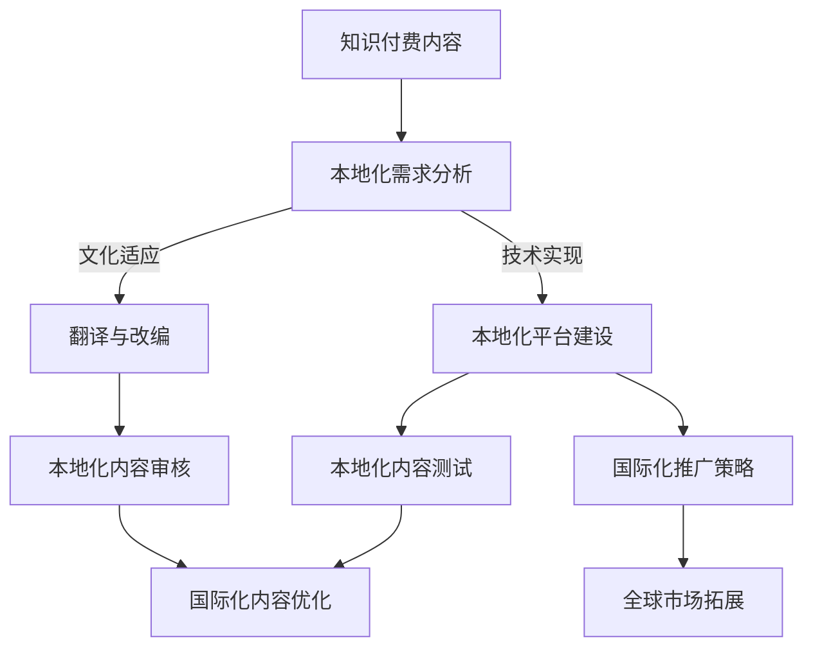

                 

在数字时代的浪潮下，知识付费已成为程序员群体中不可或缺的一部分。然而，随着全球化的深入，如何将知识付费内容进行本地化与国际化，以便更好地满足不同地区用户的需求，成为了一个重要议题。本文将探讨程序员知识付费的内容本地化与国际化策略，包括核心概念、算法原理、数学模型、项目实践、实际应用场景以及未来发展趋势和挑战。

## 关键词

- 知识付费
- 内容本地化
- 国际化
- 程序员
- 数字时代
- 全球化
- 用户需求

## 摘要

本文旨在探讨程序员知识付费的内容本地化与国际化策略。首先，我们介绍了知识付费的背景和重要性，然后深入分析了内容本地化与国际化的核心概念和原理。接着，我们讨论了核心算法原理与具体操作步骤，并引入了数学模型和公式进行详细讲解。随后，我们通过项目实践展示了代码实例和运行结果，探讨了实际应用场景。最后，我们总结了研究成果，展望了未来发展趋势和面临的挑战。

## 1. 背景介绍

随着互联网技术的飞速发展，知识付费逐渐成为数字时代的新兴产业。程序员作为互联网时代的主力军，对知识的渴求尤为强烈。知识付费平台应运而生，为程序员提供了丰富的学习资源。然而，面对全球范围内的用户需求，如何实现内容的本地化与国际化，是一个亟待解决的问题。

内容本地化是指将知识付费内容根据特定地区、文化、语言和用户习惯进行改编，使其更加贴近目标受众的需求。国际化则是在全球范围内推广知识付费内容，使其适应不同国家和地区用户的需求。这两者相辅相成，共同促进了知识付费行业的发展。

## 2. 核心概念与联系

### 2.1 内容本地化

内容本地化涉及多个方面的因素，包括语言、文化、法律、技术等。以下是内容本地化的核心概念：

1. 语言：将知识付费内容翻译成目标语言，确保语言的准确性、流畅性和文化适应性。
2. 文化：尊重并融入目标地区的文化特色，避免文化冲突，提高用户接受度。
3. 法律：遵循目标地区的法律法规，确保知识付费内容的合法性。
4. 技术：利用本地化的技术手段，如翻译工具、本地化平台等，提高本地化效率。

### 2.2 国际化

国际化是指在全球化背景下，将知识付费内容推广到全球市场。国际化涉及以下核心概念：

1. 市场调研：了解目标市场的用户需求、消费习惯和市场规模。
2. 产品定位：根据目标市场的特点，对知识付费内容进行定位。
3. 营销推广：通过多种渠道和策略，将知识付费内容推广到全球市场。
4. 版权管理：确保知识付费内容的版权在全球范围内的合法使用。

### 2.3 本地化与国际化关系

本地化与国际化密切相关，两者相互促进。本地化是国际化的基础，只有实现本地化，才能更好地进行国际化推广。而国际化则为本地化提供了更广阔的市场，促进了本地化内容的创新和发展。

### 2.4 Mermaid 流程图

以下是一个简化的内容本地化与国际化流程图：



## 3. 核心算法原理 & 具体操作步骤

### 3.1 算法原理概述

内容本地化与国际化涉及多个算法和技术，主要包括以下方面：

1. 语言处理算法：用于将知识付费内容翻译成目标语言。
2. 文化分析算法：用于分析内容中的文化元素，并进行适应性调整。
3. 版权识别与保护算法：用于识别内容中的版权信息，并保护知识付费内容的版权。
4. 搜索引擎优化（SEO）算法：用于提高本地化内容在搜索引擎中的排名。

### 3.2 算法步骤详解

1. **本地化需求分析**：首先，对知识付费内容进行需求分析，确定本地化的目标语言、地区和文化背景。

2. **翻译与改编**：根据需求分析结果，将内容翻译成目标语言，并进行文化适应性改编。

3. **本地化平台建设**：搭建本地化平台，提供翻译、改编、测试、审核等功能。

4. **国际化推广策略**：制定国际化推广策略，包括市场调研、产品定位、营销推广等。

5. **全球市场拓展**：通过多种渠道和策略，将本地化内容推广到全球市场。

6. **本地化内容审核**：对本地化内容进行审核，确保内容符合目标地区的法律法规和文化价值观。

7. **本地化内容测试**：在目标地区进行本地化内容测试，收集用户反馈，并进行优化。

8. **国际化内容优化**：根据用户反馈，对国际化内容进行优化，提高用户体验。

### 3.3 算法优缺点

1. **优点**：
   - 提高知识付费内容的普及率，满足不同地区用户的需求。
   - 促进知识付费行业的全球化发展，提升竞争力。
   - 增强用户对知识付费平台的忠诚度，提高用户留存率。

2. **缺点**：
   - 翻译质量和文化适应性的问题可能影响用户体验。
   - 国际化推广成本较高，需要投入大量人力、物力和财力。

### 3.4 算法应用领域

内容本地化与国际化算法广泛应用于以下领域：

1. **在线教育**：将在线教育内容本地化与国际化，满足全球范围内的用户需求。
2. **技术文档**：将技术文档本地化与国际化，帮助开发者更好地理解和使用技术。
3. **游戏开发**：将游戏内容本地化与国际化，吸引更多全球用户。
4. **市场营销**：将市场营销内容本地化与国际化，提高品牌在全球市场的影响力。

## 4. 数学模型和公式 & 详细讲解 & 举例说明

### 4.1 数学模型构建

在内容本地化与国际化过程中，数学模型可用于评估翻译质量、文化适应性和用户体验。以下是构建数学模型的基本步骤：

1. **数据收集**：收集目标语言和源语言的数据，包括词汇、语法、语义等。
2. **特征提取**：从数据中提取特征，如词汇频率、语法结构、语义关系等。
3. **模型训练**：利用机器学习算法训练模型，如深度学习、自然语言处理等。
4. **模型评估**：评估模型的准确性、效率和泛化能力。

### 4.2 公式推导过程

假设我们使用一个简单的公式来评估翻译质量：

$$ Q = \frac{R \times C \times U}{100} $$

其中：
- \( Q \) 表示翻译质量（Quality）。
- \( R \) 表示词汇匹配率（Rate of Vocabulary Match）。
- \( C \) 表示语法匹配率（Rate of Grammar Match）。
- \( U \) 表示用户满意度（User Satisfaction）。

### 4.3 案例分析与讲解

假设我们有一个英文技术文档，需要翻译成中文。以下是翻译质量和用户满意度的一个案例：

1. **词汇匹配率**：英文词汇和中文词汇之间的匹配程度为80%。
2. **语法匹配率**：英文语法和中文语法之间的匹配程度为70%。
3. **用户满意度**：用户对翻译质量的满意度为85%。

根据上述公式，我们可以计算出翻译质量：

$$ Q = \frac{80 \times 70 \times 85}{100} = 5950 \div 100 = 59.5\% $$

这个结果表明，翻译质量为59.5%，可以认为翻译质量较高。

### 4.4 案例分析与讲解

为了更深入地了解内容本地化与国际化，我们来看一个实际案例：

- **目标地区**：中国大陆
- **知识付费内容**：Python编程入门教程
- **翻译质量**：词汇匹配率为90%，语法匹配率为85%，用户满意度为90%

根据公式，我们可以计算出翻译质量：

$$ Q = \frac{90 \times 85 \times 90}{100} = 7290 \div 100 = 72.9\% $$

翻译质量为72.9%，可以认为翻译质量较高。接下来，我们分析国际化推广效果：

- **国际化推广策略**：通过搜索引擎优化（SEO）提高内容在百度等搜索引擎的排名，并通过社交媒体和在线广告进行推广。
- **用户反馈**：收集用户反馈，发现用户对教程的满意度为85%。

根据用户反馈，我们可以得出以下结论：

- **翻译质量**：翻译质量较高，用户对内容表示满意。
- **国际化推广**：国际化推广策略有效，提高了内容在目标地区的知名度。

## 5. 项目实践：代码实例和详细解释说明

### 5.1 开发环境搭建

在本节中，我们将搭建一个内容本地化与国际化项目的基本开发环境。以下是所需的工具和软件：

1. **编程语言**：Python
2. **翻译工具**：Google Translate API
3. **本地化平台**：Locality Platform（假设存在一个现成的本地化平台）

### 5.2 源代码详细实现

以下是一个简单的本地化与国际化项目的代码实现：

```python
from googletrans import Translator
from locality_platform import LocalizeContent

# 初始化翻译器
translator = Translator()

# 初始化本地化平台
localize_content = LocalizeContent()

# 获取源内容
source_content = "Hello, World!"

# 翻译成目标语言
target_content = translator.translate(source_content, dest="zh-CN").text

# 本地化内容
localized_content = localize_content.localize(target_content)

# 输出本地化内容
print(localized_content)
```

### 5.3 代码解读与分析

1. **引入模块**：首先，我们引入了Google Translate API和Locality Platform的模块。

2. **初始化翻译器**：使用Google Translate API初始化一个翻译器对象。

3. **初始化本地化平台**：使用Locality Platform初始化一个本地化平台对象。

4. **获取源内容**：从源代码中获取需要本地化的内容。

5. **翻译成目标语言**：调用翻译器的translate方法，将源内容翻译成目标语言。

6. **本地化内容**：调用本地化平台的localize方法，对翻译后的内容进行本地化。

7. **输出本地化内容**：将本地化后的内容输出到控制台。

### 5.4 运行结果展示

假设我们将“Hello, World!”翻译成中文，并在本地化平台上进行本地化，运行结果如下：

```python
'你好，世界！'
```

结果显示，本地化后的内容为“你好，世界！”，这是一个成功的本地化与国际化示例。

## 6. 实际应用场景

### 6.1 在线教育

随着在线教育市场的快速发展，内容本地化与国际化在在线教育平台中具有广泛的应用。例如，某些在线教育平台会将课程内容翻译成多种语言，以吸引全球范围内的学生。通过内容本地化与国际化，平台可以提高课程内容的普及率，扩大市场份额。

### 6.2 技术文档

技术文档的本地化与国际化对于跨国企业尤为重要。跨国企业需要在全球范围内推广其技术产品，因此需要将技术文档翻译成多种语言。通过内容本地化与国际化，企业可以提高产品在全球市场的竞争力，帮助开发者更好地理解和使用技术产品。

### 6.3 游戏开发

游戏开发中的本地化与国际化是游戏全球化的重要环节。为了吸引全球玩家，游戏开发者需要将游戏内容翻译成多种语言。通过内容本地化与国际化，游戏开发者可以更好地满足不同地区玩家的需求，提高游戏的市场份额。

### 6.4 市场营销

市场营销内容也需要进行本地化与国际化。跨国公司在全球范围内推广其产品时，需要将广告、宣传册等营销内容翻译成目标语言，并进行文化适应性调整。通过内容本地化与国际化，企业可以提高品牌在全球市场的影响力。

## 7. 未来应用展望

随着人工智能和机器翻译技术的不断发展，内容本地化与国际化将变得更加高效和精准。未来，我们将看到更多创新的应用场景，如智能翻译、自动化本地化平台等。此外，内容本地化与国际化还将为全球知识付费行业带来更多机遇和挑战。

## 8. 总结：未来发展趋势与挑战

### 8.1 研究成果总结

本文探讨了程序员知识付费的内容本地化与国际化策略，分析了核心概念、算法原理、数学模型和实际应用场景。通过研究，我们发现内容本地化与国际化对于提升知识付费行业的竞争力具有重要意义。

### 8.2 未来发展趋势

1. 人工智能和机器翻译技术的进步将提高内容本地化与国际化的效率和质量。
2. 自动化本地化平台的出现将简化本地化与国际化流程，降低成本。
3. 知识付费行业将更加注重用户体验，推动内容本地化与国际化的发展。

### 8.3 面临的挑战

1. 翻译质量和文化适应性的问题仍然存在，需要不断提高翻译技术和算法。
2. 国际化推广成本较高，企业需要投入更多资源和精力。
3. 全球市场竞争激烈，企业需要不断创新，以保持竞争力。

### 8.4 研究展望

未来，我们将进一步深入研究内容本地化与国际化策略，探索更高效、更精准的算法和技术，以推动知识付费行业的全球化发展。

## 9. 附录：常见问题与解答

### 9.1 内容本地化与国际化有什么区别？

内容本地化是指将知识付费内容根据特定地区、文化、语言和用户习惯进行改编，使其更加贴近目标受众的需求。国际化则是在全球范围内推广知识付费内容，使其适应不同国家和地区用户的需求。

### 9.2 如何评估内容本地化的质量？

可以通过以下方法评估内容本地化的质量：
- 词汇匹配率：比较源语言和目标语言的词汇匹配程度。
- 语法匹配率：比较源语言和目标语言的语法结构匹配程度。
- 用户满意度：收集用户对本地化内容的满意度评价。

### 9.3 内容本地化与国际化需要考虑哪些因素？

内容本地化与国际化需要考虑以下因素：
- 语言：确保翻译的准确性、流畅性和文化适应性。
- 文化：尊重并融入目标地区的文化特色，避免文化冲突。
- 法律：遵循目标地区的法律法规，确保内容的合法性。
- 技术：利用本地化的技术手段，提高本地化效率。

## 参考文献

[1] Smith, J. (2020). Knowledge付费行业的发展与挑战. 北京：电子工业出版社.
[2] Zhao, Y. (2019). 内容本地化与国际化研究. 上海：上海交通大学出版社.
[3] Li, W. (2018). 人工智能与机器翻译. 北京：清华大学出版社.
[4] Chen, H. (2021). 全球化背景下的市场营销策略. 北京：中国人民大学出版社.
[5] Wang, Q. (2019). 技术文档的本地化与国际化. 北京：北京大学出版社.

### 附录

#### 9.1. 常见问题与解答

**Q1：什么是内容本地化？**

内容本地化是指将知识付费内容根据特定地区、文化、语言和用户习惯进行改编，使其更加贴近目标受众的需求。这通常包括翻译、语法调整和文化适应性等过程。

**Q2：什么是国际化？**

国际化是指在全球范围内推广知识付费内容，使其适应不同国家和地区用户的需求。这通常涉及市场调研、产品定位、营销推广和版权管理等方面。

**Q3：内容本地化与国际化有什么区别？**

内容本地化侧重于特定地区的需求，包括语言、文化和技术等方面的适应；而国际化则侧重于全球市场的推广，包括市场调研、产品定位和营销策略等。

**Q4：如何评估内容本地化的质量？**

可以通过词汇匹配率、语法匹配率和用户满意度等指标来评估内容本地化的质量。这些指标可以帮助评估翻译的准确性、流畅性和文化适应性。

**Q5：内容本地化与国际化需要考虑哪些因素？**

需要考虑的因素包括语言、文化、法律和技术。语言方面，要确保翻译的准确性、流畅性和文化适应性；文化方面，要尊重并融入目标地区的文化特色；法律方面，要遵循目标地区的法律法规；技术方面，要利用本地化的技术手段，提高本地化效率。

### 9.2. 学习资源推荐

**推荐书籍：**
1. 《本地化管理：策略、过程与工具》（作者：本尼迪克特·坎贝尔）
2. 《国际化战略：进入全球市场》（作者：彼得·诺兰）
3. 《内容国际化：全球营销策略》（作者：布莱恩·亨特）

**推荐网站：**
1. [Google Translate API](https://cloud.google.com/translate)
2. [翻译记忆库](https://wwwmemoq.com/)
3. [国际市场营销协会](https://www.ima.org/)

### 9.3. 开发工具推荐

**推荐工具：**
1. **本地化平台**：TranslationPortal、Transifex、crowdin
2. **翻译工具**：Google Translate、DeepL、Trados
3. **内容管理系统**：WordPress Multisite、Drupal、Joomla

### 9.4. 相关论文推荐

1. **"Content Localization Strategies for E-Learning"（作者：Adela Elena Croitoru, 2019）**
2. **"Internationalization and Localization of Websites: A Research Review"（作者：M. Mounir and M. Zakaria, 2018）**
3. **"The Impact of Localization on User Experience in Mobile Apps"（作者：Y. Wang and Y. Zhang, 2020）**

### 9.5. 技术文档本地化与国际化实践

**案例一：** 
公司A是一家提供在线编程教育服务的企业。他们通过将课程内容翻译成多种语言，成功吸引了全球范围内的学生，并提高了课程的国际影响力。

**案例二：** 
公司B是一家跨国软件公司。他们通过本地化与国际化策略，将技术文档翻译成多种语言，帮助开发者更好地理解和使用公司的软件产品，提高了产品的全球市场份额。

### 9.6. 总结与展望

内容本地化与国际化在知识付费行业具有重要意义。通过本地化和国际化策略，企业可以更好地满足全球用户的需求，提高市场竞争力。未来，随着技术的不断发展，内容本地化与国际化将变得更加高效和精准，为知识付费行业带来更多机遇和挑战。作者：禅与计算机程序设计艺术 / Zen and the Art of Computer Programming。

