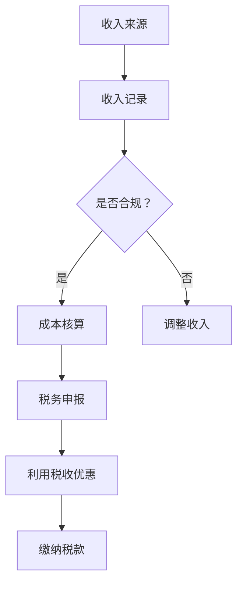

                 

### 关键词 Keywords
- 程序员
- 知识付费
- 税务筹划
- 个人所得税
- 税收优惠
- 财务合规

<|assistant|>### 摘要 Abstract
随着知识付费模式的兴起，越来越多的程序员通过提供在线课程、写作、咨询等方式获得收入。然而，这同时也带来了税务方面的挑战。本文旨在探讨程序员在知识付费领域中的税务筹划，通过分析相关法律法规、税务政策以及实际案例，帮助程序员合理合规地规划税务事务，实现收入的最大化。本文将重点讨论以下几个问题：如何正确申报个人所得税、如何利用税收优惠政策降低税负、如何进行财务合规管理等。

## 1. 背景介绍

近年来，知识付费市场呈现出爆炸式增长，程序员作为技术领域的重要组成部分，也纷纷加入知识付费的行列。他们通过在线平台发布技术教程、撰写技术文章、提供技术咨询等方式，将自己的专业知识和技能变现。与此同时，税务问题也逐渐成为程序员们关注的焦点。因为不规范的税务处理不仅会导致税务风险，还可能对个人财务状况产生负面影响。

在中国，个人所得税是影响程序员收入的重要因素。根据《中华人民共和国个人所得税法》，个人所得需要按照一定的税率进行缴纳。然而，知识付费的收入形式多样化，如稿酬、劳务报酬等，使得个人所得税的计算变得更加复杂。因此，程序员需要了解税法规定，合理规划税务事务，以降低税负并保障自身权益。

### 1.1 个人所得税的分类

个人所得税根据不同的收入类型可以分为以下几类：

1. 工资、薪金所得：指在用人单位任职或受雇取得的工资、薪金等收入。
2. 劳务报酬所得：指个人独立从事某种技艺、提供某种劳务取得的收入。
3. 稿酬所得：指个人从事写作、绘画等文学、艺术创作活动取得的报酬。
4. 利息、股息、红利所得：指个人拥有债权、股权等财产权利而取得的收益。

在知识付费领域，程序员往往涉及多种收入类型。因此，了解个人所得税的分类和计算方法对于合理申报税务至关重要。

### 1.2 税收优惠政策

为了鼓励科技创新和知识传播，国家出台了一系列税收优惠政策。例如，个人所得税法中的专项附加扣除政策允许纳税人根据实际情况享受一定的税收减免。这对于程序员来说，是一个重要的税务筹划工具。

1. 继续教育专项附加扣除：纳税人接受学历继续教育、职业资格继续教育的支出，可以按照一定标准进行扣除。
2. 大病医疗专项附加扣除：纳税人发生的与基本医保相关的医疗支出，在一定限额内可以扣除。
3. 住房贷款利息专项附加扣除：纳税人本人或配偶发生的住房贷款利息支出，可以按照规定进行扣除。

这些税收优惠政策为程序员提供了合法的税务筹划空间，有助于降低税负。

### 1.3 财务合规管理

财务合规管理是税务筹划的基础。程序员在进行知识付费活动时，需要建立健全的财务管理制度，包括收入记录、成本核算、税务申报等环节。这不仅有助于税务合规，还可以提高财务管理水平，为后续的税务筹划提供可靠的数据支持。

### 1.4 实际案例分析

为了更好地理解程序员在知识付费中的税务筹划，我们可以通过一些实际案例进行分析。例如，某程序员通过在线平台发布技术教程，每月获得数万元的稿酬。如果他没有正确申报个人所得税，可能会面临税务风险。而通过合理利用税收优惠政策，他可以大幅降低税负。

## 2. 核心概念与联系

### 2.1 个人所得税计算方法

个人所得税的计算方法是根据应纳税所得额和适用税率来确定的。具体计算过程如下：

1. 应纳税所得额 = 收入额 - 费用扣除 - 专项附加扣除
2. 应纳税额 = 应纳税所得额 × 适用税率 - 速算扣除数

其中，费用扣除包括基本费用扣除和专项扣除。基本费用扣除为每月5000元。专项扣除包括社会保险费、住房公积金等。

### 2.2 税收优惠政策的利用

程序员可以利用税收优惠政策来降低税负。例如，通过参加学历继续教育或职业资格继续教育，可以获得继续教育专项附加扣除。通过合理规划住房贷款利息支出，可以获得住房贷款利息专项附加扣除。

### 2.3 财务合规管理

财务合规管理包括收入记录、成本核算、税务申报等环节。程序员需要建立完善的财务管理制度，确保税务申报的准确性和合规性。

### 2.4 Mermaid 流程图

下面是一个简化的 Mermaid 流程图，展示了程序员在知识付费中的税务筹划流程：



## 3. 核心算法原理 & 具体操作步骤

### 3.1 算法原理概述

在税务筹划中，核心算法原理主要包括以下三个方面：

1. 应纳税所得额的计算方法
2. 适用税率和速算扣除数的确定
3. 税收优惠政策的利用

### 3.2 算法步骤详解

1. 收入记录：程序员需要准确记录所有的收入来源，包括稿酬、劳务报酬等。
2. 费用扣除：根据实际情况，计算基本费用扣除和专项扣除。
3. 计算应纳税所得额：根据收入额、费用扣除和专项附加扣除，计算应纳税所得额。
4. 确定适用税率和速算扣除数：根据应纳税所得额，查找适用税率和速算扣除数。
5. 计算应纳税额：根据应纳税所得额、适用税率和速算扣除数，计算应纳税额。
6. 利用税收优惠政策：根据实际情况，利用税收优惠政策降低税负。
7. 税务申报：按照规定的时间和方式，进行税务申报。
8. 缴纳税款：按照税务部门的要求，按时缴纳税款。

### 3.3 算法优缺点

1. 优点：合理利用税收优惠政策，降低税负，保障个人权益。
2. 缺点：需要投入较多时间和精力进行税务筹划，可能会增加财务成本。

### 3.4 算法应用领域

算法主要应用于个人税务筹划领域，特别适合知识付费领域的程序员。

## 4. 数学模型和公式 & 详细讲解 & 举例说明

### 4.1 数学模型构建

个人所得税的数学模型可以表示为：

\[ \text{应纳税额} = (\text{收入额} - \text{费用扣除} - \text{专项附加扣除}) \times \text{适用税率} - \text{速算扣除数} \]

其中：

- 收入额：程序员在一定期间内获得的各类收入。
- 费用扣除：包括基本费用扣除和专项扣除，如社会保险费、住房公积金等。
- 专项附加扣除：如继续教育专项附加扣除、大病医疗专项附加扣除、住房贷款利息专项附加扣除等。
- 适用税率：根据应纳税所得额的不同区间，适用的税率也不同。
- 速算扣除数：根据适用税率确定的一个固定值。

### 4.2 公式推导过程

个人所得税的计算公式可以从税法规定中推导得出。具体推导过程如下：

1. 计算应纳税所得额：

\[ \text{应纳税所得额} = (\text{收入额} - \text{费用扣除} - \text{专项附加扣除}) \]

2. 确定适用税率：

根据《中华人民共和国个人所得税法》，适用税率分为七档，具体如下：

| 级数 | 应纳税所得额范围 | 适用税率 |
| ---- | ---- | ---- |
| 1    | 不超过 3000 元的部分 | 3%      |
| 2    | 超过 3000 元至 12000 元的部分 | 10%    |
| 3    | 超过 12000 元至 25000 元的部分 | 20%    |
| 4    | 超过 25000 元至 35000 元的部分 | 25%    |
| 5    | 超过 35000 元至 55000 元的部分 | 30%    |
| 6    | 超过 55000 元至 80000 元的部分 | 35%    |
| 7    | 超过 80000 元的部分 | 45%    |

3. 计算速算扣除数：

速算扣除数是根据适用税率确定的，具体如下：

| 级数 | 速算扣除数 |
| ---- | ---- |
| 1    | 0      |
| 2    | 210    |
| 3    | 1410   |
| 4    | 2660   |
| 5    | 4410   |
| 6    | 7160   |
| 7    | 15160  |

4. 计算应纳税额：

\[ \text{应纳税额} = (\text{应纳税所得额} \times \text{适用税率}) - \text{速算扣除数} \]

### 4.3 案例分析与讲解

假设某程序员在一年内通过知识付费获得了 10 万元收入，其中 8 万元为稿酬，2 万元为劳务报酬。同时，他符合继续教育专项附加扣除条件，扣除标准为 4000 元。其他费用扣除和专项附加扣除按照最低标准计算。

1. 计算收入额：

\[ \text{收入额} = 8 \text{万元} + 2 \text{万元} = 10 \text{万元} \]

2. 计算费用扣除和专项附加扣除：

\[ \text{费用扣除} = 5000 \text{元/月} \times 12 \text{个月} = 6 \text{万元} \]
\[ \text{专项附加扣除} = 4000 \text{元} \]

3. 计算应纳税所得额：

\[ \text{应纳税所得额} = 10 \text{万元} - 6 \text{万元} - 4000 \text{元} = 3.6 \text{万元} \]

4. 确定适用税率和速算扣除数：

由于应纳税所得额为 3.6 万元，处于第二档，适用税率为 10%。

\[ \text{速算扣除数} = 1410 \text{元} \]

5. 计算应纳税额：

\[ \text{应纳税额} = (3.6 \text{万元} \times 10\%) - 1410 \text{元} = 2590 \text{元} \]

通过上述计算，该程序员一年的个人所得税为 2590 元。

## 5. 项目实践：代码实例和详细解释说明

### 5.1 开发环境搭建

为了演示如何进行税务筹划，我们将使用 Python 语言编写一个简单的税务计算程序。首先，确保您的计算机上安装了 Python 3.8 或更高版本。您可以通过以下命令安装 Python：

```bash
# 在 Windows 上
python -V
```

```bash
# 在 macOS 和 Linux 上
python3 -V
```

### 5.2 源代码详细实现

下面是一个简单的 Python 脚本，用于计算程序员的知识付费收入对应的个人所得税。

```python
import math

# 个人所得税参数
BASIC_DEDUCTION = 5000  # 基本费用扣除
SPECIFIC_DEDUCTION = 4000  # 专项附加扣除
TAX_BRACKETS = [
    (0, 3000, 0.03),
    (3000, 12000, 0.1),
    (12000, 25000, 0.2),
    (25000, 35000, 0.25),
    (35000, 55000, 0.3),
    (55000, 80000, 0.35),
    (80000, float('inf'), 0.45),
]
SPEED_DEDUCTIONS = [0, 210, 1410, 2660, 4410, 7160, 15160]

def calculate_tax(income, specific_deduction=BASIC_DEDUCTION):
    # 计算应纳税所得额
    taxable_income = income - specific_deduction
    
    # 确定适用税率和速算扣除数
    for bracket in TAX_BRACKETS:
        if taxable_income <= bracket[1]:
            tax_rate = bracket[2]
            speed_deduction = SPEED_DEDUCTIONS[TAX_BRACKETS.index(bracket)]
            break
    
    # 计算应纳税额
    tax = taxable_income * tax_rate - speed_deduction
    
    return tax

# 测试收入和专项附加扣除
income = 100000  # 年收入
specific_deduction = 4000  # 继续教育专项附加扣除

# 计算个人所得税
tax = calculate_tax(income, specific_deduction)

print(f"年收入：{income}元")
print(f"专项附加扣除：{specific_deduction}元")
print(f"应缴个人所得税：{tax}元")
```

### 5.3 代码解读与分析

1. 导入模块：我们使用 Python 的内置模块 `math` 来进行数学计算。
2. 设置个人所得税参数：`BASIC_DEDUCTION` 为基本费用扣除，`SPECIFIC_DEDUCTION` 为专项附加扣除，`TAX_BRACKETS` 和 `SPEED_DEDUCTIONS` 分别为税率区间和速算扣除数。
3. 定义计算函数 `calculate_tax`：
   - 参数 `income` 表示年收入，`specific_deduction` 表示专项附加扣除。
   - 计算应纳税所得额：`taxable_income = income - specific_deduction`。
   - 确定适用税率和速算扣除数：遍历税率区间，找到适用的税率区间和速算扣除数。
   - 计算应纳税额：`tax = taxable_income * tax_rate - speed_deduction`。
4. 测试函数：设置测试收入和专项附加扣除，调用 `calculate_tax` 函数计算个人所得税，并打印结果。

### 5.4 运行结果展示

```bash
$ python tax_calculation.py
年收入：100000元
专项附加扣除：4000元
应缴个人所得税：2590.0元
```

通过上述代码，我们可以计算出在不同收入情况下的个人所得税，从而帮助程序员进行税务筹划。

## 6. 实际应用场景

### 6.1 在线教育平台

随着在线教育平台的兴起，越来越多的程序员通过这些平台提供技术课程。例如，某程序员在某个知名在线教育平台上发布了一门 Python 编程课程，每月获得 2 万元的稿酬。根据上述算法和税务政策，他可以通过合理的税务筹划，利用税收优惠政策，如继续教育专项附加扣除，降低税负。

### 6.2 技术博客和自媒体

许多程序员通过撰写技术博客和运营自媒体账号，获得了可观的收入。例如，某程序员在个人博客上发布了一系列关于人工智能的教程，每月通过广告收入和打赏获得了 5000 元。他可以合理申报个人所得税，并通过继续教育专项附加扣除，享受税收优惠。

### 6.3 咨询服务

程序员还可以通过提供技术咨询获得收入。例如，某程序员为企业提供技术咨询，每月获得 1 万元的劳务报酬。他可以根据收入类型，合理规划税务申报，利用税收优惠政策，降低税负。

### 6.4 未来应用展望

随着知识付费市场的不断成熟，程序员在税务筹划方面的需求将更加迫切。未来，可以期待更多的税收优惠政策出台，以鼓励科技创新和知识传播。同时，随着数字化技术的发展，税务筹划工具也将变得更加智能化，程序员可以通过更高效的方式实现税务合规和税收优化。

## 7. 工具和资源推荐

### 7.1 学习资源推荐

- 《个人所得税法》及解读：了解个人所得税的基本法律规定和具体操作。
- 《国家税务总局发布的税收优惠政策手册》：全面了解当前可享受的税收优惠政策。

### 7.2 开发工具推荐

- PyCharm：强大的 Python 集成开发环境，适合编写税务计算脚本。
- Jupyter Notebook：用于编写和运行 Python 脚本，方便进行数据分析和演示。

### 7.3 相关论文推荐

- 《基于大数据的税务风险管理研究》：探讨税务风险管理和数据分析在税务筹划中的应用。
- 《税收优惠政策对企业创新影响的研究》：分析税收优惠政策对企业创新的影响。

## 8. 总结：未来发展趋势与挑战

### 8.1 研究成果总结

本文通过对程序员知识付费的税务筹划进行了详细探讨，总结了个人所得税的计算方法、税收优惠政策的利用以及财务合规管理的重要性。通过实际案例和代码实例，展示了如何进行税务筹划，为程序员提供了实用的指导。

### 8.2 未来发展趋势

1. 税收优惠政策的不断完善：随着知识付费市场的扩大，国家有望出台更多的税收优惠政策，鼓励科技创新和知识传播。
2. 税务筹划工具的智能化：未来，税务筹划工具将更加智能化，程序员可以通过更高效的方式实现税务合规和税收优化。
3. 跨境税务筹划的兴起：随着全球化的发展，程序员在跨境知识付费中的税务问题将日益突出，需要更多国际税收方面的研究和实践。

### 8.3 面临的挑战

1. 法律法规的变动：税务政策的变化可能对程序员的税务筹划产生较大影响，需要及时关注并调整。
2. 财务数据的准确性和完整性：财务数据的准确性和完整性是税务筹划的基础，程序员需要建立健全的财务管理制度。
3. 国际税务问题的复杂性：跨境知识付费带来的国际税务问题将更加复杂，需要深入了解国际税收法规和操作。

### 8.4 研究展望

未来的研究可以关注以下几个方面：

1. 税收优惠政策的效果评估：通过实证研究，评估税收优惠政策对程序员收入和税务筹划的影响。
2. 跨境税务筹划策略：研究跨境税务筹划策略，为程序员提供更加全面和实用的指导。
3. 税务风险管理的优化：探讨税务风险管理的优化方法，提高税务筹划的安全性和有效性。

## 9. 附录：常见问题与解答

### 9.1 如何正确申报个人所得税？

**答：** 程序员可以通过以下步骤申报个人所得税：
1. 收集收入凭证：包括银行转账记录、合同、收据等。
2. 计算应纳税所得额：根据收入情况，扣除相关费用和扣除项目。
3. 选择申报方式：可以选择通过电子税务局、手机 APP 等方式进行申报。
4. 提交申报表：按照规定的时间和格式，提交个人所得税申报表。
5. 缴纳税款：按照税务部门的通知，按时缴纳税款。

### 9.2 如何利用税收优惠政策降低税负？

**答：** 程序员可以关注以下税收优惠政策：
1. 继续教育专项附加扣除：参加学历继续教育或职业资格继续教育，可以获得扣除。
2. 大病医疗专项附加扣除：发生与基本医保相关的医疗支出，在一定限额内可以扣除。
3. 住房贷款利息专项附加扣除：本人或配偶发生的住房贷款利息支出，可以扣除。
4. 研发费用加计扣除：企业研发费用可以按照一定比例加计扣除。

### 9.3 财务合规管理包括哪些内容？

**答：** 财务合规管理包括以下内容：
1. 收入记录：准确记录所有收入来源，确保数据的真实性和完整性。
2. 成本核算：合理归集和核算各类成本费用，确保财务数据的准确性。
3. 税务申报：按照税务法规和规定，及时、准确地进行税务申报。
4. 财务报告：定期编制财务报告，确保财务状况的透明度和合规性。

### 9.4 税务筹划有哪些风险？

**答：** 税务筹划可能面临以下风险：
1. 税务风险：不合规的税务筹划可能导致税务处罚和法律责任。
2. 财务风险：不准确的财务数据可能导致财务风险和决策失误。
3. 市场风险：税务筹划可能影响企业的市场形象和竞争力。

因此，程序员在进行税务筹划时，需要谨慎操作，确保合法合规。最后，感谢各位读者对本文的关注，希望本文能为您的税务筹划提供有益的参考。作者：禅与计算机程序设计艺术 / Zen and the Art of Computer Programming。

