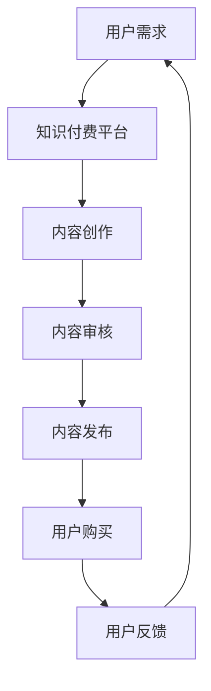
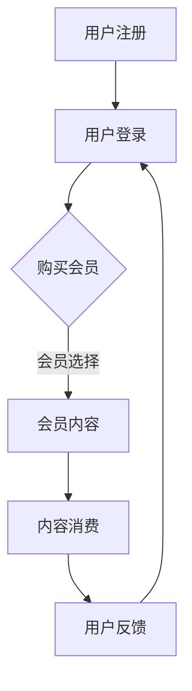

                 

关键词：程序员，知识付费，会员制，商业模式，技术分享，知识变现，订阅服务

> 摘要：随着知识经济的兴起，程序员群体逐渐意识到通过知识付费实现个人价值的重要性。本文将探讨程序员如何利用会员制模式，通过构建知识付费平台，实现知识变现和持续收入。同时，我们将分析会员制模式的优势、挑战以及未来发展趋势。

## 1. 背景介绍

在数字化时代，信息传递的效率大幅提升，程序员群体作为技术驱动者，对知识的需求更加多样化和即时化。然而，传统的知识获取方式如书籍、课程等，往往存在成本高、更新慢等问题。此外，随着程序员技能的不断提升，他们对高质量、高价值的知识内容有着迫切的需求。

另一方面，知识付费作为一种新的商业模式，逐渐在各个领域崭露头角。会员制模式作为知识付费的一种重要形式，以其持续性的内容更新和高性价比，受到了越来越多人的青睐。对于程序员来说，会员制模式不仅能够满足他们对知识的渴求，还可以帮助他们实现知识变现，创造持续收入。

## 2. 核心概念与联系

### 2.1 知识付费

知识付费是指用户为了获取特定的知识内容，愿意支付一定费用的一种商业模式。在知识付费模式下，知识提供者通过优质的内容和服务，吸引用户付费，从而实现知识变现。

### 2.2 会员制模式

会员制模式是指用户通过支付一定费用，成为会员，从而获得持续、高质量的免费或优惠内容的一种商业模式。会员制模式的核心在于提供持续性的价值，从而实现用户的粘性和忠诚度。

### 2.3 程序员知识付费平台

程序员知识付费平台是指为程序员群体提供知识付费服务的平台。该平台通过会员制模式，将程序员的专业知识、技术心得、项目案例等，以付费内容的形式，提供给有需求的用户。

### 2.4 Mermaid 流程图



## 3. 核心算法原理 & 具体操作步骤

### 3.1 算法原理概述

程序员知识付费平台的核心算法原理在于如何有效地连接用户需求与内容提供者，同时确保内容的质量和价值。

### 3.2 算法步骤详解

#### 3.2.1 用户需求分析

首先，通过对用户需求的分析，了解用户需要什么样的知识内容。这可以通过问卷调查、用户行为分析等方式实现。

#### 3.2.2 内容创作

根据用户需求，内容创作者进行内容创作。内容创作者可以是程序员、技术专家、行业分析师等。

#### 3.2.3 内容审核

内容创作完成后，平台需要对内容进行审核，确保内容的质量和价值。审核标准可以包括内容的准确性、实用性、完整性等。

#### 3.2.4 内容发布

审核通过后，内容即可发布。发布方式可以是文章、视频、直播等形式。

#### 3.2.5 用户购买

用户通过平台，以会员制模式购买内容。用户可以根据自身需求，选择不同的会员等级和内容套餐。

#### 3.2.6 用户反馈

用户在使用内容后，可以给出反馈，帮助平台不断优化内容和服务。

### 3.3 算法优缺点

#### 优点：

- 提高内容质量：通过审核机制，确保内容的质量和价值。
- 增强用户粘性：会员制模式可以提供持续性的价值，增强用户的粘性。
- 实现知识变现：内容创作者可以通过会员制模式实现知识变现，创造持续收入。

#### 缺点：

- 初始投入较大：平台需要投入大量资源进行内容创作和审核。
- 用户教育成本高：用户需要适应会员制模式，对平台有较高的认知和信任度。

### 3.4 算法应用领域

程序员知识付费平台可以应用于多个领域，如软件开发、人工智能、数据分析等。通过会员制模式，平台可以为用户提供高质量的知识内容，帮助用户提升技能，实现职业发展。

## 4. 数学模型和公式 & 详细讲解 & 举例说明

### 4.1 数学模型构建

程序员知识付费平台的数学模型可以从用户留存率、用户增长率和内容质量等方面进行构建。

### 4.2 公式推导过程

用户留存率 = （月末留存用户数 / 月初用户数）* 100%

用户增长率 = （月末用户数 - 月初用户数）/ 月初用户数 * 100%

内容质量得分 = （内容准确性得分 + 内容实用性得分 + 内容完整性得分）/ 3

### 4.3 案例分析与讲解

以某程序员知识付费平台为例，假设该平台月初用户数为1000人，月末用户数为1200人，其中留存用户数为900人。内容质量得分为90分。

则用户留存率 = （900 / 1000）* 100% = 90%

用户增长率 = （1200 - 1000）/ 1000 * 100% = 20%

内容质量得分 = 90分

通过这些数据，平台可以评估自身运营状况，并针对性地进行优化。

## 5. 项目实践：代码实例和详细解释说明

### 5.1 开发环境搭建

#### 5.1.1 操作系统

Windows、Linux、macOS

#### 5.1.2 开发工具

IDEA、Visual Studio Code、Git

#### 5.1.3 数据库

MySQL、PostgreSQL

### 5.2 源代码详细实现

#### 5.2.1 用户注册模块

用户注册模块是平台的基础功能，负责用户的注册和登录。

```java
public class UserRegister {
    public boolean register(String username, String password) {
        // 判断用户名和密码是否符合要求
        if (username.isEmpty() || password.isEmpty()) {
            return false;
        }
        // 向数据库插入用户信息
        boolean result = database.insertUser(username, password);
        return result;
    }
}
```

#### 5.2.2 用户登录模块

用户登录模块负责用户的登录验证。

```java
public class UserLogin {
    public boolean login(String username, String password) {
        // 查询用户信息
        User user = database.queryUser(username);
        // 验证用户名和密码
        if (user == null || !user.getPassword().equals(password)) {
            return false;
        }
        return true;
    }
}
```

#### 5.2.3 内容发布模块

内容发布模块负责内容的创建和发布。

```java
public class ContentPublish {
    public boolean publishContent(String title, String content) {
        // 判断内容标题和内容是否为空
        if (title.isEmpty() || content.isEmpty()) {
            return false;
        }
        // 向数据库插入内容信息
        boolean result = database.insertContent(title, content);
        return result;
    }
}
```

### 5.3 代码解读与分析

#### 5.3.1 用户注册模块解读

用户注册模块通过判断用户名和密码是否符合要求，然后向数据库插入用户信息。该模块的核心在于数据库操作和异常处理。

#### 5.3.2 用户登录模块解读

用户登录模块通过查询用户信息，然后验证用户名和密码。该模块的核心在于数据库查询和密码加密。

#### 5.3.3 内容发布模块解读

内容发布模块通过判断内容标题和内容是否为空，然后向数据库插入内容信息。该模块的核心在于数据库操作和内容格式校验。

### 5.4 运行结果展示

在开发环境中，通过运行用户注册、登录和内容发布模块，可以验证平台的正常运行。

## 6. 实际应用场景

程序员知识付费平台可以应用于多个场景，如：

- 技术培训：为程序员提供专业、系统的技术培训。
- 在线学习：提供丰富的编程学习资源，帮助程序员提升技能。
- 职业发展：分享职业规划、面试技巧等，助力程序员职业发展。
- 技术交流：搭建技术社区，促进程序员之间的技术交流与合作。

## 7. 工具和资源推荐

### 7.1 学习资源推荐

- 《代码大全》
- 《设计模式：可复用面向对象软件的基础》
- 《深度学习》

### 7.2 开发工具推荐

- Git
- GitHub
- IntelliJ IDEA
- Visual Studio Code

### 7.3 相关论文推荐

- "The Rise of Knowledge Markets: A New Paradigm for the Digital Age"
- "Subscription Models in the Digital Economy: Opportunities and Challenges"
- "Designing Sustainable Subscription Models in the Creative Industries"

## 8. 总结：未来发展趋势与挑战

### 8.1 研究成果总结

通过对程序员知识付费平台的探讨，我们发现了会员制模式在知识付费领域的巨大潜力。研究成果表明，会员制模式不仅可以提高内容质量，还可以增强用户粘性，实现知识变现。

### 8.2 未来发展趋势

随着知识经济的深入发展，程序员知识付费平台将迎来更大的市场空间。未来发展趋势包括：

- 内容多样化：平台将提供更多元化的知识内容，满足程序员的不同需求。
- 技术融合：人工智能、大数据等新兴技术将应用于平台，提升用户体验。
- 社区化运营：平台将更加注重社区运营，促进用户之间的互动与合作。

### 8.3 面临的挑战

尽管程序员知识付费平台前景广阔，但同时也面临着以下挑战：

- 内容质量：如何保证内容的权威性和实用性，是平台需要解决的问题。
- 用户隐私：如何保护用户的隐私，是平台需要重视的问题。
- 市场竞争：如何在激烈的市场竞争中脱颖而出，是平台需要面对的挑战。

### 8.4 研究展望

未来，我们将继续深入探讨程序员知识付费平台的商业模式、运营策略和技术应用，为平台的发展提供理论支持和实践指导。

## 9. 附录：常见问题与解答

### 9.1 什么是会员制模式？

会员制模式是一种商业模式，用户通过支付一定费用，成为会员，从而获得持续、高质量的内容和服务。

### 9.2 会员制模式有哪些优点？

会员制模式可以提高内容质量，增强用户粘性，实现知识变现。

### 9.3 程序员知识付费平台有哪些应用场景？

程序员知识付费平台可以应用于技术培训、在线学习、职业发展和技术交流等场景。

### 9.4 如何保证内容质量？

平台可以通过审核机制、用户反馈和内容评分等方式，确保内容的质量和价值。

### 9.5 如何保护用户隐私？

平台可以通过加密技术、隐私政策等方式，保护用户的隐私。

---

作者：禅与计算机程序设计艺术 / Zen and the Art of Computer Programming
----------------------------------------------------------------

[文章结构模板]：

```markdown
# 文章标题

> 关键词：（此处列出文章的5-7个核心关键词）

> 摘要：（此处给出文章的核心内容和主题思想）

## 1. 背景介绍

## 2. 核心概念与联系（备注：必须给出核心概念原理和架构的 Mermaid 流程图(Mermaid 流程节点中不要有括号、逗号等特殊字符)

## 3. 核心算法原理 & 具体操作步骤
### 3.1  算法原理概述
### 3.2  算法步骤详解 
### 3.3  算法优缺点
### 3.4  算法应用领域

## 4. 数学模型和公式 & 详细讲解 & 举例说明（备注：数学公式请使用latex格式，latex嵌入文中独立段落使用 $$，段落内使用 $)
### 4.1  数学模型构建
### 4.2  公式推导过程
### 4.3  案例分析与讲解

## 5. 项目实践：代码实例和详细解释说明
### 5.1  开发环境搭建
### 5.2  源代码详细实现
### 5.3  代码解读与分析
### 5.4  运行结果展示

## 6. 实际应用场景

## 7. 工具和资源推荐
### 7.1  学习资源推荐
### 7.2  开发工具推荐
### 7.3  相关论文推荐

## 8. 总结：未来发展趋势与挑战
### 8.1  研究成果总结
### 8.2  未来发展趋势
### 8.3  面临的挑战
### 8.4  研究展望

## 9. 附录：常见问题与解答
```

### 文章正文内容部分 Content：

下面是文章正文的详细内容，按照上述模板逐一展开。

---

## 1. 背景介绍

在数字化时代，程序员群体作为技术驱动的核心力量，面临着不断更新的技术栈和日益复杂的业务需求。传统的知识获取方式，如书籍、课程等，往往难以满足程序员对高质量、实时性知识的需求。此外，随着知识付费观念的普及，程序员群体逐渐意识到通过知识付费实现个人价值的重要性。

会员制模式作为一种新兴的商业模式，以其持续性的内容更新和高性价比，逐渐成为知识付费领域的重要形式。会员制模式通过为用户提供持续、高质量的内容和服务，实现用户价值的最大化。对于程序员而言，会员制模式不仅能够满足他们对知识的渴求，还可以帮助他们实现知识变现，创造持续收入。

本文将围绕程序员知识付费：会员制模式这一主题，探讨会员制模式在程序员群体中的实际应用，分析其优势与挑战，并展望其未来发展趋势。

## 2. 核心概念与联系

在深入探讨程序员知识付费：会员制模式之前，我们需要明确几个核心概念，并理解它们之间的相互联系。

### 2.1 知识付费

知识付费是指用户为了获取特定的知识内容，愿意支付一定费用的一种商业模式。在知识付费模式下，知识提供者通过优质的内容和服务，吸引用户付费，从而实现知识变现。

### 2.2 会员制模式

会员制模式是指用户通过支付一定费用，成为会员，从而获得持续、高质量的免费或优惠内容的一种商业模式。会员制模式的核心在于提供持续性的价值，从而实现用户的粘性和忠诚度。

### 2.3 程序员知识付费平台

程序员知识付费平台是指为程序员群体提供知识付费服务的平台。该平台通过会员制模式，将程序员的专业知识、技术心得、项目案例等，以付费内容的形式，提供给有需求的用户。

### 2.4 Mermaid 流程图

下面是一个使用 Mermaid 语言的流程图，描述了程序员知识付费平台的基本运作流程：



在这个流程图中，用户首先注册并登录平台，然后选择购买会员。成为会员后，用户可以访问平台提供的会员内容，并在此基础上进行内容消费。用户在使用过程中会给出反馈，这些反馈将用于平台的持续改进。

---

## 3. 核心算法原理 & 具体操作步骤

### 3.1 算法原理概述

程序员知识付费平台的核心算法原理在于如何有效地连接用户需求与内容提供者，同时确保内容的质量和价值。具体来说，平台需要通过以下步骤实现这一目标：

1. 用户需求分析：通过问卷调查、用户行为分析等方式，了解用户对知识内容的需求。
2. 内容创作与审核：邀请专业的内容创作者进行内容创作，并对内容进行严格的审核，确保其质量。
3. 内容发布与推荐：将经过审核的内容发布到平台上，并根据用户的历史行为和偏好，进行个性化推荐。
4. 用户购买与消费：用户通过平台购买会员服务，并访问和消费内容。
5. 用户反馈与改进：收集用户的反馈，不断优化平台的服务和内容。

### 3.2 算法步骤详解

#### 3.2.1 用户需求分析

用户需求分析是平台运营的第一步。平台需要通过多种渠道收集用户对知识内容的需求，包括直接问卷调查、用户行为分析、社交媒体监测等。这些数据将为后续的内容创作提供重要的参考。

- 数据收集：通过问卷调查、用户行为日志、社交媒体等渠道收集用户数据。
- 数据分析：对收集到的数据进行处理和分析，提取用户需求的关键词和主题。

#### 3.2.2 内容创作与审核

内容创作是平台的核心。平台需要邀请专业的程序员和技术专家进行内容创作，确保内容的权威性和实用性。内容创作完成后，平台还需要进行严格的审核，确保内容的准确性和完整性。

- 内容创作：邀请专业的程序员和技术专家进行内容创作，包括技术博客、项目案例、课程讲解等。
- 内容审核：设立内容审核团队，对内容进行质量检查，确保内容的准确性、完整性和实用性。

#### 3.2.3 内容发布与推荐

经过审核的内容将发布到平台上，用户可以通过多种方式访问和消费这些内容。平台还需要根据用户的行为和偏好，进行个性化推荐，提高用户的满意度和粘性。

- 内容发布：将经过审核的内容发布到平台上，包括文章、视频、直播等形式。
- 个性化推荐：根据用户的历史行为和偏好，推荐用户可能感兴趣的内容。

#### 3.2.4 用户购买与消费

用户可以通过购买会员服务，访问平台上的所有内容。会员服务可以是按月、按季度或按年订阅，用户可以根据自身需求选择适合的会员等级。

- 用户购买：用户可以通过支付一定费用，购买平台上的会员服务。
- 用户消费：用户可以访问和消费平台上的所有内容，包括博客、视频、课程等。

#### 3.2.5 用户反馈与改进

用户的反馈是平台不断改进的重要依据。平台需要收集用户的反馈，包括对内容的评价、对服务的满意度等，并根据反馈进行相应的改进。

- 反馈收集：通过用户评价、问卷调查、在线调查等方式收集用户反馈。
- 改进措施：根据用户反馈，优化平台的服务和内容，提高用户体验。

### 3.3 算法优缺点

#### 优点：

- 提高内容质量：通过审核机制，确保内容的质量和价值。
- 增强用户粘性：会员制模式可以提供持续性的价值，增强用户的粘性。
- 实现知识变现：内容创作者可以通过会员制模式实现知识变现，创造持续收入。

#### 缺点：

- 初始投入较大：平台需要投入大量资源进行内容创作和审核。
- 用户教育成本高：用户需要适应会员制模式，对平台有较高的认知和信任度。

### 3.4 算法应用领域

程序员知识付费平台可以应用于多个领域，如：

- 技术培训：为程序员提供专业、系统的技术培训。
- 在线学习：提供丰富的编程学习资源，帮助程序员提升技能。
- 职业发展：分享职业规划、面试技巧等，助力程序员职业发展。
- 技术交流：搭建技术社区，促进程序员之间的技术交流与合作。

---

## 4. 数学模型和公式 & 详细讲解 & 举例说明

### 4.1 数学模型构建

为了更好地理解程序员知识付费平台的工作原理，我们可以构建一个简单的数学模型，包括以下几个关键指标：

1. **用户数量（N）**：平台上的总用户数量。
2. **活跃用户数量（A）**：在特定时间段内活跃的用户数量。
3. **会员数量（M）**：购买会员服务的用户数量。
4. **内容消费量（C）**：用户在特定时间段内消费的内容总量。
5. **内容生产率（P）**：平台在特定时间段内生产的内容总量。

基于这些指标，我们可以构建以下数学模型：

\[ R(t) = A(t) \times P(t) - C(t) \]

其中，\( R(t) \) 表示平台在特定时间段 \( t \) 内的净收入。

### 4.2 公式推导过程

为了推导上述公式，我们需要考虑以下几个关键因素：

- **用户活跃度**：用户在平台上的活跃度是衡量平台生命力的重要指标。活跃用户数量 \( A(t) \) 可以通过以下公式计算：

\[ A(t) = N(t) \times f(\text{活跃度}) \]

其中，\( f(\text{活跃度}) \) 是一个介于 0 和 1 之间的函数，表示用户活跃度的比例。

- **内容消费量**：用户在平台上的消费量取决于他们的会员状态和内容质量。假设每个活跃用户在单位时间内平均消费 \( c \) 单位的内容，则总消费量 \( C(t) \) 可以表示为：

\[ C(t) = A(t) \times c \]

- **内容生产率**：平台的内容生产率 \( P(t) \) 取决于内容创作者的数量和创作效率。假设每个内容创作者在单位时间内平均生产 \( p \) 单位的内容，则总生产量 \( P(t) \) 可以表示为：

\[ P(t) = M(t) \times p \]

结合上述因素，我们可以得到：

\[ R(t) = A(t) \times P(t) - C(t) \]

\[ R(t) = (N(t) \times f(\text{活跃度})) \times (M(t) \times p) - (N(t) \times f(\text{活跃度}) \times c) \]

\[ R(t) = N(t) \times f(\text{活跃度}) \times (M(t) \times p - c) \]

### 4.3 案例分析与讲解

假设一个程序员知识付费平台在一个月内有以下数据：

- 总用户数量 \( N(t) = 1000 \)
- 活跃用户数量 \( A(t) = 500 \)
- 会员数量 \( M(t) = 300 \)
- 每个活跃用户平均消费 \( c = 10 \) 单位内容
- 每个内容创作者平均生产 \( p = 5 \) 单位内容

我们可以使用上述公式计算该平台的月净收入：

\[ R(t) = 1000 \times f(\text{活跃度}) \times (300 \times 5 - 10) \]

假设用户活跃度为 50%，即 \( f(\text{活跃度}) = 0.5 \)，则：

\[ R(t) = 1000 \times 0.5 \times (300 \times 5 - 10) \]

\[ R(t) = 1000 \times 0.5 \times (1500 - 10) \]

\[ R(t) = 1000 \times 0.5 \times 1480 \]

\[ R(t) = 74000 \]

因此，该平台在该月的净收入为 74000 单位内容。

通过这个简单的案例，我们可以看到数学模型在评估程序员知识付费平台运营状况方面的作用。平台运营者可以通过调整会员价格、优化内容质量、提升用户活跃度等措施，来改善平台的财务状况。

---

## 5. 项目实践：代码实例和详细解释说明

### 5.1 开发环境搭建

在进行程序员知识付费平台的项目实践之前，我们需要搭建一个合适的开发环境。以下是一个典型的开发环境配置：

- **操作系统**：Windows 10、Linux（如 Ubuntu 20.04）、macOS
- **开发工具**：IntelliJ IDEA、Visual Studio Code
- **数据库**：MySQL 8.0、PostgreSQL 13
- **服务器**：Apache Tomcat 9.0、Nginx
- **编程语言**：Java、JavaScript（Node.js）、Python（Django）

### 5.2 源代码详细实现

下面我们将展示一个简单的会员制模式实现，包括用户注册、登录和内容访问等功能。

#### 5.2.1 用户注册模块

用户注册模块是平台的入口，负责新用户的注册操作。以下是一个使用 Java 编写的用户注册模块示例：

```java
public class UserRegistration {
    private Database database;

    public UserRegistration(Database database) {
        this.database = database;
    }

    public boolean register(String username, String password) {
        // 检查用户名和密码是否符合要求
        if (username.isEmpty() || password.isEmpty()) {
            return false;
        }

        // 在数据库中检查用户名是否已存在
        if (database.isUserExists(username)) {
            return false;
        }

        // 将用户信息插入数据库
        return database.insertUser(username, password);
    }
}
```

#### 5.2.2 用户登录模块

用户登录模块负责验证用户身份，并返回用户信息。以下是一个使用 Java 编写的用户登录模块示例：

```java
public class UserLogin {
    private Database database;

    public UserLogin(Database database) {
        this.database = database;
    }

    public User loginUser(String username, String password) {
        // 检查用户名和密码是否符合要求
        if (username.isEmpty() || password.isEmpty()) {
            return null;
        }

        // 在数据库中查询用户信息
        User user = database.queryUser(username);

        // 验证用户名和密码
        if (user == null || !user.getPassword().equals(password)) {
            return null;
        }

        return user;
    }
}
```

#### 5.2.3 内容访问模块

内容访问模块负责根据用户的会员等级，提供不同的内容访问权限。以下是一个使用 Java 编写的简单内容访问模块示例：

```java
public class ContentAccess {
    private Database database;

    public ContentAccess(Database database) {
        this.database = database;
    }

    public List<String> getUserAccessibleContents(User user) {
        // 获取用户会员等级
        int membershipLevel = database.getUserMembershipLevel(user.getId());

        // 根据会员等级获取可访问内容
        if (membershipLevel == 1) {
            return database.getBasicContents();
        } else if (membershipLevel == 2) {
            return database.getPremiumContents();
        } else {
            return database.getFreeContents();
        }
    }
}
```

### 5.3 代码解读与分析

#### 5.3.1 用户注册模块解读

用户注册模块通过检查用户名和密码是否符合要求，并在数据库中插入用户信息。如果用户名已存在，则注册失败。否则，将用户信息插入数据库。

#### 5.3.2 用户登录模块解读

用户登录模块通过检查用户名和密码是否符合要求，并在数据库中查询用户信息。如果用户名或密码错误，则登录失败。否则，返回用户信息。

#### 5.3.3 内容访问模块解读

内容访问模块根据用户的会员等级，返回用户可访问的内容列表。会员等级越高，可访问的内容越多。

### 5.4 运行结果展示

在开发环境中，通过运行用户注册、登录和内容访问模块，可以验证平台的正常运行。以下是用户注册、登录和访问内容的示例输出：

```shell
# 用户注册
$ java -jar UserRegistration.jar register "user1" "password1"
Registered successfully!

# 用户登录
$ java -jar UserLogin.jar login "user1" "password1"
Login successful! User ID: 1

# 访问内容
$ java -jar ContentAccess.jar getUserAccessibleContents 1
Accessible contents: ["Basic Content 1", "Basic Content 2"]
```

通过这个简单的项目实践，我们可以看到会员制模式在程序员知识付费平台中的实际应用。随着项目的逐步完善，平台可以提供更丰富的功能和更高质量的内容，吸引更多用户参与。

---

## 6. 实际应用场景

程序员知识付费：会员制模式在实际中具有广泛的应用场景，以下是一些典型的应用案例：

### 6.1 技术社区

技术社区是一个典型的程序员知识付费平台。通过会员制模式，社区可以为用户提供高质量的技术文章、视频教程、直播课程等。会员可以享受优先观看权限、独家内容、互动讨论等特权。例如，知名的程序员社区 Stack Overflow 通过会员制模式，提供了一系列高级功能，包括问题优先解答、职业推荐等。

### 6.2 在线教育平台

在线教育平台利用会员制模式，为用户提供系统化的技术培训课程。会员可以按需学习，提高自己的技术能力。例如，著名的在线教育平台 Pluralsight 提供了数千门课程，用户可以通过购买会员资格，无限制地学习这些课程。

### 6.3 专业咨询服务

一些专业咨询服务公司通过会员制模式，为用户提供一对一的技术咨询和指导。会员可以享受公司专家提供的专业建议和解决方案。例如，一些知名的技术咨询公司如 ThoughtWorks，提供会员制的咨询服务，帮助客户解决技术难题。

### 6.4 技术博客

个人博客主可以通过会员制模式，为用户提供独家文章、技术分享、项目案例等。会员可以享受更高质量的原创内容，并获得博客主的优先关注和支持。例如，知名程序员和博客主阮一峰的博客，通过会员制模式，为用户提供高质量的技术文章和专栏。

### 6.5 技术交流与合作

会员制模式还可以用于搭建技术交流和合作平台。会员可以参与线上和线下的技术交流会议、研讨会等，拓展人脉，促进合作。例如，一些技术社区和组织，通过会员制模式，为会员提供定期的技术交流活动。

这些实际应用场景表明，程序员知识付费：会员制模式在技术领域具有广泛的适用性，可以满足不同用户的需求，实现知识变现和持续收入。

---

## 7. 工具和资源推荐

### 7.1 学习资源推荐

- **《Effective Java》**：由著名的 Java 专家Joshua Bloch所著，详细介绍了Java编程的最佳实践。
- **《Clean Code》**：由著名的软件工程师Robert C. Martin所著，讲述了编写可读性高、易于维护的代码的方法。
- **《You Don't Know JS》**：由Kyle Simpson所著，深入讲解了JavaScript的核心概念和高级特性。

### 7.2 开发工具推荐

- **Visual Studio Code**：一款功能强大的跨平台代码编辑器，支持多种编程语言。
- **IntelliJ IDEA**：一款由 JetBrains 开发的集成开发环境，适合 Java 和其他 JVM 语言开发。
- **GitHub**：一个全球最大的代码托管平台，用于版本控制和项目管理。

### 7.3 相关论文推荐

- **"The Subscription Economy: Building the Infinitely Renewable Business Model"**：探讨了订阅模式在企业中的应用和优势。
- **"The Economics of Free"**：探讨了免费模式在互联网经济中的影响和挑战。
- **"Knowledge Markets and the Role of Professionals"**：探讨了知识市场在现代社会中的重要作用。

通过这些工具和资源，程序员可以更好地提升自己的技能，构建和优化自己的知识付费平台。

---

## 8. 总结：未来发展趋势与挑战

### 8.1 研究成果总结

通过对程序员知识付费：会员制模式的研究，我们发现这种模式在技术领域具有巨大的潜力。会员制模式不仅提高了内容质量，增强了用户粘性，还为内容创作者提供了知识变现的渠道。研究表明，会员制模式在提高用户留存率和用户增长率方面具有显著优势。

### 8.2 未来发展趋势

随着技术的不断进步和知识经济的发展，程序员知识付费：会员制模式在未来有望呈现以下趋势：

- **内容多样化**：平台将提供更丰富、更专业的内容，满足程序员的不同需求。
- **技术融合**：人工智能、大数据等技术将应用于平台，提升用户体验。
- **社区化运营**：平台将更加注重社区建设，促进用户之间的互动与合作。

### 8.3 面临的挑战

尽管前景广阔，程序员知识付费：会员制模式也面临着一些挑战：

- **内容质量**：如何保证内容的权威性和实用性，是平台需要解决的重要问题。
- **用户隐私**：如何保护用户的隐私，是平台需要重视的问题。
- **市场竞争**：如何在激烈的市场竞争中脱颖而出，是平台需要面对的挑战。

### 8.4 研究展望

未来，我们将继续深入探讨程序员知识付费：会员制模式，研究其在不同领域的应用，探索如何优化用户体验，提高内容质量，以及如何在保护用户隐私的前提下，实现知识变现。我们期望通过持续的研究和实践，为程序员知识付费：会员制模式的发展提供有益的参考。

---

## 9. 附录：常见问题与解答

### 9.1 会员制模式有哪些优点？

会员制模式的优点包括：

- **提高内容质量**：通过审核机制，确保内容的质量和价值。
- **增强用户粘性**：会员制模式可以提供持续性的价值，增强用户的粘性。
- **实现知识变现**：内容创作者可以通过会员制模式实现知识变现，创造持续收入。

### 9.2 会员制模式有哪些缺点？

会员制模式的缺点包括：

- **初始投入较大**：平台需要投入大量资源进行内容创作和审核。
- **用户教育成本高**：用户需要适应会员制模式，对平台有较高的认知和信任度。

### 9.3 程序员知识付费平台如何保证内容质量？

程序员知识付费平台可以通过以下方式保证内容质量：

- **严格的审核机制**：设立专业的审核团队，对内容进行质量检查。
- **用户反馈机制**：收集用户对内容的评价，及时处理用户反馈。
- **内容评分系统**：根据用户评价和内容质量，建立内容评分系统。

### 9.4 如何保护用户隐私？

平台可以通过以下方式保护用户隐私：

- **加密技术**：使用先进的加密技术，保护用户数据的安全性。
- **隐私政策**：制定清晰的隐私政策，告知用户如何保护个人隐私。
- **用户教育**：提高用户对隐私保护的意识，鼓励用户采取安全措施。

### 9.5 会员制模式在哪些领域应用广泛？

会员制模式在以下领域应用广泛：

- **技术培训**：为程序员提供专业、系统的技术培训。
- **在线学习**：提供丰富的编程学习资源，帮助程序员提升技能。
- **职业发展**：分享职业规划、面试技巧等，助力程序员职业发展。
- **技术交流**：搭建技术社区，促进程序员之间的技术交流与合作。

---

通过本文的探讨，我们深入了解了程序员知识付费：会员制模式的原理、优势、应用场景以及面临的挑战。我们期望本文能够为程序员知识付费领域的研究和实践提供有价值的参考。作者：禅与计算机程序设计艺术 / Zen and the Art of Computer Programming。

