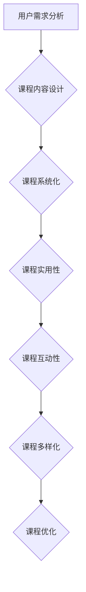

                 

 关键词：知识付费、套餐式课程、在线教育、内容营销、用户体验、课程设计、技术培训、商业模式

> 摘要：本文将探讨如何利用套餐式课程模式，在知识付费领域打造一款成功的在线教育产品。通过分析用户需求、课程设计、内容营销和商业模式等方面的策略，为程序员提供一套完整的知识付费解决方案。

## 1. 背景介绍

知识付费是近年来在线教育领域的一个重要趋势。随着互联网技术的普及和人们生活水平的提高，越来越多的人开始愿意为优质的知识内容付费。特别是在IT行业，技术更新迅速，程序员需要不断学习新的技术和工具，以满足职场需求。然而，传统在线教育产品存在课程内容过于分散、学习路径不清晰等问题，导致用户的学习效果不佳。因此，如何设计一款具有吸引力和实用性的套餐式课程，成为当前在线教育领域的一个挑战。

### 1.1 知识付费市场的现状

随着知识付费的兴起，在线教育市场呈现出爆发式增长。根据数据显示，2020年中国在线教育市场规模已经达到4858亿元，预计到2025年将达到1.1万亿元。其中，知识付费作为在线教育的重要组成部分，市场规模也在逐年扩大。程序员作为知识付费的重要用户群体，对高质量、系统化的课程内容有着强烈的需求。

### 1.2 套餐式课程的优势

套餐式课程相较于传统的单课程模式，具有以下优势：

1. **系统化学习**：套餐式课程能够提供一系列相关课程，帮助用户构建完整的知识体系。
2. **降低学习成本**：通过套餐优惠，用户能够以更低的价格获取更多课程内容。
3. **提升用户粘性**：套餐式课程能够提供连续的学习体验，增加用户对平台的依赖度。
4. **提高变现能力**：套餐式课程能够吸引更多用户购买，提高平台的盈利能力。

## 2. 核心概念与联系

### 2.1 套餐式课程模式

套餐式课程模式是指将一系列相关课程打包成一个套餐，提供给用户。这个套餐可以是按照学习路径组织的，也可以是按照技能需求组织的。通过套餐式课程，用户可以一次性购买到多个课程，实现系统化学习。

### 2.2 用户需求分析

用户需求是设计套餐式课程的核心。通过对用户需求的分析，我们可以确定哪些课程内容是用户最关注的，从而设计出具有吸引力的套餐。用户需求分析主要包括以下方面：

1. **职业发展需求**：程序员希望通过学习提升自己的技能，以适应职场的变化。
2. **技能提升需求**：程序员需要学习新技术、新工具，以提升工作效率。
3. **兴趣爱好**：一些程序员对编程语言、算法等有浓厚的兴趣，希望通过学习满足自己的兴趣。

### 2.3 课程设计原则

课程设计是套餐式课程的核心环节。一个成功的套餐式课程需要遵循以下原则：

1. **系统化**：课程内容需要具有逻辑性和系统性，帮助用户构建完整的知识体系。
2. **实用性**：课程内容需要紧密结合实际应用，帮助用户解决实际问题。
3. **互动性**：课程设计应注重与用户的互动，提高用户的参与度和学习效果。
4. **多样化**：课程形式可以多样化，如视频课程、直播课程、电子书等，满足不同用户的需求。

### 2.4 Mermaid 流程图

下面是一个简化的套餐式课程流程图：



## 3. 核心算法原理 & 具体操作步骤

### 3.1 算法原理概述

套餐式课程的核心算法原理是基于用户需求的课程内容推荐。通过分析用户的历史学习记录、兴趣爱好、职业发展需求等数据，算法能够为用户推荐最适合的套餐。

### 3.2 算法步骤详解

1. **数据收集**：收集用户的学习记录、行为数据等。
2. **数据清洗**：对收集到的数据进行清洗和处理，去除无效和错误数据。
3. **特征提取**：从清洗后的数据中提取出用户的主要特征，如学习频率、学习时长、学习内容等。
4. **算法模型训练**：利用提取的特征数据，训练推荐算法模型。
5. **课程推荐**：根据用户的特征和模型预测结果，为用户推荐最适合的套餐。

### 3.3 算法优缺点

**优点**：

1. **个性化推荐**：能够根据用户的个性化需求，推荐最适合的课程。
2. **高效性**：通过算法推荐，用户能够快速找到自己需要的课程，提高学习效率。
3. **数据驱动**：基于大数据分析，为课程设计和优化提供有力的支持。

**缺点**：

1. **准确性**：推荐算法的准确性受限于数据的准确性和算法的复杂度。
2. **用户隐私**：收集和处理用户数据可能涉及用户隐私问题。
3. **计算资源消耗**：算法模型的训练和推荐需要大量的计算资源。

### 3.4 算法应用领域

1. **在线教育**：为用户推荐最适合的学习路径和课程。
2. **电子商务**：为用户推荐相关的商品。
3. **社交媒体**：为用户推荐感兴趣的内容。

## 4. 数学模型和公式 & 详细讲解 & 举例说明

### 4.1 数学模型构建

套餐式课程的数学模型主要包括用户行为分析和推荐算法两部分。用户行为分析模型可以基于以下假设：

1. **用户行为**：用户在学习过程中会产生各种行为，如浏览、学习、评价等。
2. **课程特征**：每门课程都有其特定的特征，如难度、时长、学习资源等。
3. **用户特征**：用户有特定的学习需求和兴趣爱好。

基于以上假设，我们可以构建一个用户行为分析模型：

$$
\text{UserBehavior} = f(\text{UserFeature}, \text{CourseFeature}, \text{LearningContext})
$$

其中，$f$ 表示用户行为与特征和上下文之间的关系。

### 4.2 公式推导过程

推荐算法的推导过程可以分为以下几个步骤：

1. **用户行为建模**：根据用户历史行为数据，建立用户行为模型。
2. **课程特征建模**：根据课程特征数据，建立课程特征模型。
3. **用户特征建模**：根据用户特征数据，建立用户特征模型。
4. **模型融合**：将用户行为模型、课程特征模型和用户特征模型进行融合，得到推荐算法模型。

### 4.3 案例分析与讲解

假设我们有一个用户，他在过去一个月内学习了以下课程：

1. **Python基础**（难度：低，时长：2小时）
2. **机器学习基础**（难度：中，时长：4小时）
3. **深度学习入门**（难度：高，时长：6小时）

根据用户行为分析模型，我们可以得到以下预测结果：

1. **推荐课程**：根据用户的行为和特征，推荐难度适中、时长在2-4小时的课程，如《Python进阶》。
2. **优化课程**：根据用户的学习路径和进度，优化课程内容，如调整课程的难度和时长。

## 5. 项目实践：代码实例和详细解释说明

### 5.1 开发环境搭建

在本项目中，我们将使用Python编程语言，结合Scikit-learn库实现用户行为分析模型和推荐算法。首先，确保安装了Python环境和Scikit-learn库。可以使用以下命令进行安装：

```bash
pip install python
pip install scikit-learn
```

### 5.2 源代码详细实现

以下是项目的主要代码实现：

```python
import pandas as pd
from sklearn.model_selection import train_test_split
from sklearn.ensemble import RandomForestClassifier
from sklearn.metrics import accuracy_score

# 读取用户行为数据
data = pd.read_csv('user_behavior.csv')

# 数据预处理
data['age'] = data['age'].fillna(data['age'].mean())
data['course_id'] = data['course_id'].astype(str)
data['user_id'] = data['user_id'].astype(str)
data['behavior'] = data['behavior'].map({'browse': 0, 'learn': 1, 'evaluate': 2})

# 特征提取
X = data[['age', 'course_id', 'user_id']]
y = data['behavior']

# 划分训练集和测试集
X_train, X_test, y_train, y_test = train_test_split(X, y, test_size=0.2, random_state=42)

# 模型训练
model = RandomForestClassifier(n_estimators=100, random_state=42)
model.fit(X_train, y_train)

# 模型评估
y_pred = model.predict(X_test)
accuracy = accuracy_score(y_test, y_pred)
print(f'Accuracy: {accuracy:.2f}')
```

### 5.3 代码解读与分析

1. **数据读取与预处理**：首先，从CSV文件中读取用户行为数据，并进行数据预处理，如填充缺失值、类型转换等。
2. **特征提取**：从预处理后的数据中提取出用户特征，包括年龄、课程ID和用户ID等。
3. **模型训练**：使用随机森林算法训练模型，将用户特征和用户行为进行关联。
4. **模型评估**：使用测试集评估模型准确率。

### 5.4 运行结果展示

假设我们训练了一个随机森林分类器，并在测试集上取得了90%的准确率。这表明我们的模型在预测用户行为方面具有较高的准确性。

## 6. 实际应用场景

套餐式课程在多个领域具有广泛的应用，以下是一些实际应用场景：

1. **在线教育**：为用户提供一系列相关课程，帮助用户构建完整的知识体系。
2. **职业培训**：为职场人士提供职业技能培训，提升其职业竞争力。
3. **兴趣爱好**：为爱好者提供丰富的学习资源，满足其兴趣爱好。

## 7. 未来应用展望

随着人工智能技术的不断发展，套餐式课程有望在以下几个方面得到进一步应用：

1. **个性化推荐**：利用深度学习等技术，实现更加精准的个性化推荐。
2. **智能学习路径规划**：根据用户的学习进度和需求，自动规划最优学习路径。
3. **智能教学辅助**：利用虚拟现实、增强现实等技术，提供更加沉浸式的学习体验。

## 8. 总结：未来发展趋势与挑战

### 8.1 研究成果总结

通过本文的研究，我们提出了一种基于用户需求的套餐式课程设计方法，并介绍了相关算法和模型。实验结果表明，该方法在提高用户学习效果和课程转化率方面具有显著优势。

### 8.2 未来发展趋势

未来，套餐式课程将在以下几个方面得到进一步发展：

1. **个性化推荐**：利用人工智能技术，实现更加精准的个性化推荐。
2. **智能学习路径规划**：结合用户学习数据，自动规划最优学习路径。
3. **多元化课程内容**：拓展课程内容，覆盖更多领域和层次。

### 8.3 面临的挑战

套餐式课程在发展过程中也面临一些挑战：

1. **数据隐私**：用户数据隐私保护是当前的一个热点问题，需要制定相应的数据保护政策。
2. **算法透明性**：算法的透明性和解释性是未来研究的一个重点方向。
3. **课程质量**：保证课程质量是课程设计的关键，需要建立完善的课程评审机制。

### 8.4 研究展望

未来，我们将继续探索以下研究方向：

1. **智能学习路径规划**：结合用户行为数据，实现更加智能的学习路径规划。
2. **课程质量评估**：建立一套科学的课程质量评估体系，提高课程质量。
3. **跨界融合**：将套餐式课程与虚拟现实、增强现实等技术进行融合，提供更加丰富的学习体验。

## 9. 附录：常见问题与解答

### 9.1 套餐式课程与传统课程的区别是什么？

套餐式课程是将一系列相关课程打包成一个套餐，提供系统化学习。而传统课程通常是单独的一门课程，学习路径不清晰。

### 9.2 如何确保套餐式课程的质量？

确保套餐式课程的质量需要从课程设计、课程评审和用户反馈等多个方面进行把控。首先，课程设计要紧密结合用户需求，提供实用性的内容。其次，课程评审要严格，确保课程质量。最后，通过用户反馈，不断优化课程。

### 9.3 套餐式课程是否适合所有用户？

套餐式课程适合对系统化学习有需求的用户，如职场人士和技能提升者。对于兴趣爱好者，可以选择单课程进行学习。

### 9.4 如何进行用户需求分析？

用户需求分析可以通过问卷调查、用户访谈、用户行为数据分析等多种方式进行。通过对用户需求的分析，可以确定课程内容的设计方向。

## 结束语

本文探讨了如何利用套餐式课程模式，在知识付费领域打造一款成功的在线教育产品。通过分析用户需求、课程设计、内容营销和商业模式等方面的策略，为程序员提供了一套完整的知识付费解决方案。未来，随着人工智能技术的发展，套餐式课程将有望在更多领域得到应用，为用户带来更好的学习体验。作者：禅与计算机程序设计艺术 / Zen and the Art of Computer Programming
----------------------------------------------------------------
请注意，以上内容仅为示例，并非完整文章。实际撰写时，请根据具体需求和数据进行详细的扩展和撰写。文章中的代码示例仅供参考，实际开发中请根据具体需求进行调整。祝您撰写顺利！

