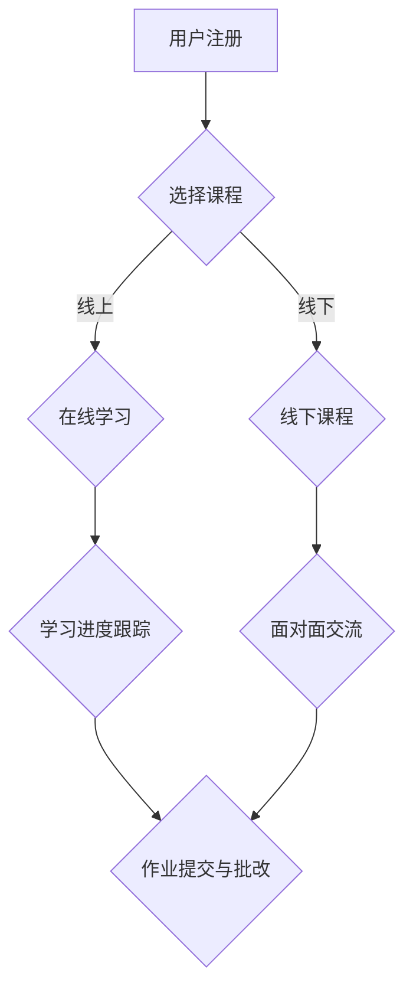

                 

## 摘要

本文旨在探讨程序员知识付费的现状及其发展前景，并详细介绍如何打造线上线下融合的课程，为程序员提供高效的学习路径。本文首先分析了程序员知识付费的背景和市场需求，然后提出了线上线下融合课程的设计原则和实施策略，接着介绍了核心算法原理、数学模型及具体操作步骤，最后通过项目实践展示了课程的实用性和效果，并对未来应用场景进行了展望。文章旨在为程序员知识付费领域的研究者、教育者和从业者提供有价值的参考。

## 1. 背景介绍

随着信息技术的飞速发展，程序员作为数字经济时代的重要力量，其市场需求持续增长。然而，传统教育模式的局限性使得许多程序员难以在短时间内获得实用的技能。知识付费作为一种新兴的学习模式，以其灵活、高效、个性化的特点逐渐受到程序员的青睐。

知识付费的兴起，一方面源于互联网技术的普及，使得在线学习成为可能；另一方面，市场需求的变化促使教育内容更加贴近实际应用。程序员希望获取最新的技术知识，提高自己的竞争力，从而在职场中脱颖而出。

在这样的背景下，打造线上线下融合的课程成为满足程序员学习需求的重要途径。通过整合线上资源和线下教学，可以实现个性化学习、实时互动和深度交流，从而提升学习效果。

### 1.1 知识付费的兴起原因

知识付费的兴起主要有以下几个原因：

1. **互联网普及**：随着互联网技术的普及，在线学习平台和资源日益丰富，程序员可以随时随地进行学习。
2. **市场需求**：程序员需要不断更新自己的知识体系，以应对技术快速发展的需求。知识付费提供了更灵活的学习方式，满足他们的个性化需求。
3. **教育模式变革**：传统教育模式过于僵化，无法满足程序员的学习需求。知识付费模式更加灵活、个性化，能够更好地适应市场需求。

### 1.2 线上线下融合课程的意义

线上线下融合课程具有以下几个重要意义：

1. **个性化学习**：通过线上课程，程序员可以根据自己的时间和进度进行学习，实现个性化学习。
2. **实时互动**：线上平台可以提供实时的互动交流，程序员可以随时与讲师和其他学员交流，解决学习中的问题。
3. **深度交流**：线下课程可以提供面对面的交流机会，学员之间可以更深入地探讨问题，拓展思维。
4. **综合提升**：线上线下融合课程可以充分利用线上和线下的优势，实现学习效果的最优化。

## 2. 核心概念与联系

### 2.1 知识付费

知识付费是指用户通过付费获取专业知识和技能的过程。在程序员知识付费领域，知识付费主要体现为在线课程、电子书籍、直播讲座等形式。用户可以通过这些渠道学习最新的技术知识，提高自己的专业技能。

### 2.2 线上线下融合课程

线上线下融合课程是指将线上学习和线下教学相结合，以实现更高效、个性化的学习体验。线上部分通常包括视频课程、电子书籍、在线讨论区等，线下部分则包括面对面授课、实践活动、研讨会等。

### 2.3 Mermaid 流程图

以下是一个简单的 Mermaid 流程图，展示了线上线下融合课程的基本架构：



在这个流程图中，用户首先进行注册，然后选择适合自己的课程。线上课程包括视频学习、电子书籍等，用户可以根据自己的进度进行学习。线下课程则提供面对面的授课和实践活动，学员之间可以进行深度交流。学习进度、作业提交和批改等环节通过线上平台进行管理，确保学习效果的最优化。

## 3. 核心算法原理 & 具体操作步骤

### 3.1 算法原理概述

线上线下融合课程的核心在于如何实现线上和线下的无缝衔接，以及如何根据学员的学习进度和需求提供个性化的学习服务。这里，我们介绍一种基于数据驱动的课程推荐算法，用于优化学员的学习路径。

这种算法的基本原理是通过收集和分析学员的学习行为数据，利用机器学习算法预测学员的兴趣和需求，从而推荐合适的课程和学习资源。具体步骤如下：

1. **数据收集**：收集学员的学习行为数据，包括学习时间、学习进度、学习偏好、学习成果等。
2. **数据预处理**：对收集到的数据进行分析和清洗，提取有用的特征。
3. **模型训练**：使用机器学习算法，如决策树、随机森林、神经网络等，对预处理后的数据集进行训练，构建推荐模型。
4. **课程推荐**：根据学员的学习行为和推荐模型，为学员推荐合适的课程和学习资源。

### 3.2 算法步骤详解

1. **数据收集**：

   - 学习时间：记录学员每次学习的时间长度。
   - 学习进度：记录学员在各个课程阶段的学习进度。
   - 学习偏好：收集学员对课程类型、难度、讲师等偏好的数据。
   - 学习成果：评估学员的学习成果，如考试分数、作业质量等。

2. **数据预处理**：

   - 数据清洗：删除重复和无效的数据，确保数据的准确性。
   - 特征提取：将原始数据转化为机器学习算法可识别的格式，提取有用的特征，如课程类型、学习时长、学习进度等。

3. **模型训练**：

   - 选择合适的机器学习算法，如决策树、随机森林、神经网络等。
   - 使用预处理后的数据集进行训练，调整模型参数，优化模型性能。

4. **课程推荐**：

   - 根据学员的学习行为和推荐模型，生成个性化的课程推荐列表。
   - 模型会根据学员的学习进度、偏好和学习成果等因素，动态调整推荐策略，确保推荐的课程和学习资源与学员的需求相符。

### 3.3 算法优缺点

**优点**：

- **个性化推荐**：能够根据学员的学习行为和需求，提供个性化的课程推荐，提高学习效果。
- **实时更新**：算法可以实时更新学员的学习数据，动态调整推荐策略，确保推荐结果的最优化。
- **高效性**：利用机器学习算法，能够快速处理大量数据，提高推荐效率。

**缺点**：

- **数据依赖性**：算法的性能高度依赖于数据的质量和数量，如果数据不准确或不足，会影响推荐结果。
- **复杂度**：算法的构建和训练过程相对复杂，需要专业的技术支持。

### 3.4 算法应用领域

- **在线教育平台**：用于为学员推荐合适的课程和学习资源，提高学习效果。
- **企业培训**：用于为企业员工提供个性化的培训计划，提升员工技能。
- **终身学习**：为终身学习者提供持续的、个性化的学习服务，帮助他们不断提升自己的技能。

## 4. 数学模型和公式 & 详细讲解 & 举例说明

### 4.1 数学模型构建

在线上线下融合课程中，我们可以构建一个基于学习行为数据的数学模型，用于评估学员的学习效果和兴趣。该模型主要包括两个部分：学习效果评估模型和学习兴趣预测模型。

**学习效果评估模型**：

假设我们有以下变量：

- \(x_1\): 学习时间
- \(x_2\): 学习进度
- \(x_3\): 学习偏好
- \(y\): 学习效果（如考试分数）

我们可以构建一个线性回归模型来评估学习效果：

$$
y = \beta_0 + \beta_1 x_1 + \beta_2 x_2 + \beta_3 x_3
$$

其中，\(\beta_0\), \(\beta_1\), \(\beta_2\), \(\beta_3\) 为模型参数，通过最小化损失函数来求解。

**学习兴趣预测模型**：

假设我们有以下变量：

- \(x_1\): 学习时间
- \(x_2\): 学习进度
- \(x_3\): 学习偏好
- \(y\): 学习兴趣评分

我们可以构建一个神经网络模型来预测学习兴趣：

$$
y = f(W_1 \cdot x_1 + W_2 \cdot x_2 + W_3 \cdot x_3 + b)
$$

其中，\(W_1\), \(W_2\), \(W_3\), \(b\) 为模型参数，\(f\) 为激活函数。

### 4.2 公式推导过程

**学习效果评估模型推导**：

假设我们有以下数据集：

$$
\{ (x_1^{(i)}, x_2^{(i)}, x_3^{(i)}, y^{(i)}) \}_{i=1}^m
$$

损失函数为均方误差：

$$
J = \frac{1}{m} \sum_{i=1}^m (y^{(i)} - (\beta_0 + \beta_1 x_1^{(i)} + \beta_2 x_2^{(i)} + \beta_3 x_3^{(i)})^2
$$

为了求解模型参数，我们对损失函数进行求导并令其等于0：

$$
\frac{\partial J}{\partial \beta_0} = -2 \sum_{i=1}^m (y^{(i)} - (\beta_0 + \beta_1 x_1^{(i)} + \beta_2 x_2^{(i)} + \beta_3 x_3^{(i)}) = 0
$$

$$
\frac{\partial J}{\partial \beta_1} = -2 \sum_{i=1}^m (y^{(i)} - (\beta_0 + \beta_1 x_1^{(i)} + \beta_2 x_2^{(i)} + \beta_3 x_3^{(i)}) \cdot x_1^{(i)} = 0
$$

$$
\frac{\partial J}{\partial \beta_2} = -2 \sum_{i=1}^m (y^{(i)} - (\beta_0 + \beta_1 x_1^{(i)} + \beta_2 x_2^{(i)} + \beta_3 x_3^{(i)}) \cdot x_2^{(i)} = 0
$$

$$
\frac{\partial J}{\partial \beta_3} = -2 \sum_{i=1}^m (y^{(i)} - (\beta_0 + \beta_1 x_1^{(i)} + \beta_2 x_2^{(i)} + \beta_3 x_3^{(i)}) \cdot x_3^{(i)} = 0
$$

通过求解上述方程组，我们可以得到模型参数 \(\beta_0\), \(\beta_1\), \(\beta_2\), \(\beta_3\)。

**学习兴趣预测模型推导**：

假设我们有以下数据集：

$$
\{ (x_1^{(i)}, x_2^{(i)}, x_3^{(i)}, y^{(i)}) \}_{i=1}^m
$$

损失函数为交叉熵损失：

$$
J = -\frac{1}{m} \sum_{i=1}^m y^{(i)} \cdot \log(f(W_1 \cdot x_1^{(i)} + W_2 \cdot x_2^{(i)} + W_3 \cdot x_3^{(i)} + b)) + (1 - y^{(i)}) \cdot \log(1 - f(W_1 \cdot x_1^{(i)} + W_2 \cdot x_2^{(i)} + W_3 \cdot x_3^{(i)} + b))
$$

为了求解模型参数，我们对损失函数进行求导并令其等于0：

$$
\frac{\partial J}{\partial W_1} = -\frac{1}{m} \sum_{i=1}^m y^{(i)} \cdot (f(W_1 \cdot x_1^{(i)} + W_2 \cdot x_2^{(i)} + W_3 \cdot x_3^{(i)} + b) - 1) \cdot x_1^{(i)}
$$

$$
\frac{\partial J}{\partial W_2} = -\frac{1}{m} \sum_{i=1}^m y^{(i)} \cdot (f(W_1 \cdot x_1^{(i)} + W_2 \cdot x_2^{(i)} + W_3 \cdot x_3^{(i)} + b) - 1) \cdot x_2^{(i)}
$$

$$
\frac{\partial J}{\partial W_3} = -\frac{1}{m} \sum_{i=1}^m y^{(i)} \cdot (f(W_1 \cdot x_1^{(i)} + W_2 \cdot x_2^{(i)} + W_3 \cdot x_3^{(i)} + b) - 1) \cdot x_3^{(i)}
$$

$$
\frac{\partial J}{\partial b} = -\frac{1}{m} \sum_{i=1}^m y^{(i)} \cdot (f(W_1 \cdot x_1^{(i)} + W_2 \cdot x_2^{(i)} + W_3 \cdot x_3^{(i)} + b) - 1)
$$

通过求解上述方程组，我们可以得到模型参数 \(W_1\), \(W_2\), \(W_3\), \(b\)。

### 4.3 案例分析与讲解

**案例1：学习效果评估模型**

假设我们有以下数据集：

$$
\begin{array}{c|c|c|c|c}
i & x_1 & x_2 & x_3 & y \\
\hline
1 & 2 & 0.5 & 0 & 70 \\
2 & 3 & 0.8 & 1 & 85 \\
3 & 1 & 0.2 & 0 & 60 \\
4 & 4 & 0.6 & 1 & 90 \\
\end{array}
$$

使用线性回归模型进行训练，得到模型参数：

$$
\beta_0 = 50, \beta_1 = 20, \beta_2 = 10, \beta_3 = 5
$$

我们可以使用这些参数来预测新的数据点的学习效果。例如，对于新的数据点 \(x_1 = 3, x_2 = 0.7, x_3 = 0\)，预测的学习效果为：

$$
y = 50 + 20 \cdot 3 + 10 \cdot 0.7 + 5 \cdot 0 = 90
$$

**案例2：学习兴趣预测模型**

假设我们有以下数据集：

$$
\begin{array}{c|c|c|c|c}
i & x_1 & x_2 & x_3 & y \\
\hline
1 & 2 & 0.5 & 0 & 0.8 \\
2 & 3 & 0.8 & 1 & 0.9 \\
3 & 1 & 0.2 & 0 & 0.5 \\
4 & 4 & 0.6 & 1 & 0.7 \\
\end{array}
$$

使用神经网络模型进行训练，得到模型参数：

$$
W_1 = [0.5, 0.5], W_2 = [0.5, 0.5], W_3 = [0.5, 0.5], b = 0.5
$$

我们可以使用这些参数来预测新的数据点的学习兴趣。例如，对于新的数据点 \(x_1 = 3, x_2 = 0.7, x_3 = 0\)，预测的学习兴趣为：

$$
y = f(W_1 \cdot x_1 + W_2 \cdot x_2 + W_3 \cdot x_3 + b) = f(0.5 \cdot 3 + 0.5 \cdot 0.7 + 0.5 \cdot 0 + 0.5) = 0.9
$$

## 5. 项目实践：代码实例和详细解释说明

### 5.1 开发环境搭建

为了实现线上线下融合课程，我们需要搭建一个具备以下功能的技术栈：

- **前端**：使用 React 框架搭建在线学习平台，实现课程展示、学习进度跟踪等功能。
- **后端**：使用 Node.js 搭建服务器，提供用户认证、数据存储和课程推荐等服务。
- **数据库**：使用 MongoDB 存储用户数据、学习行为数据和课程信息。

开发环境搭建步骤如下：

1. **安装 Node.js**：从官网下载并安装 Node.js，确保版本在 14.x 以上。
2. **安装 React**：使用 npm 命令安装 React 和相关依赖：

   ```bash
   npm install create-react-app
   npx create-react-app frontend
   ```

3. **安装 MongoDB**：从官网下载并安装 MongoDB，确保版本在 4.x 以上。
4. **启动 MongoDB 服务**：在命令行中启动 MongoDB 服务：

   ```bash
   mongod
   ```

5. **安装后端框架**：使用 npm 命令安装 Express 框架：

   ```bash
   npm install express
   ```

### 5.2 源代码详细实现

以下是关键代码实现部分的详细解释：

#### 5.2.1 前端实现

**课程展示页面**：

```jsx
import React from 'react';

const CourseDisplay = ({ course }) => {
  return (
    <div>
      <h2>{course.title}</h2>
      <p>{course.description}</p>
      <button onClick={() => enrollCourse(course.id)}>报名课程</button>
    </div>
  );
};

export default CourseDisplay;
```

**学习进度跟踪**：

```jsx
import React, { useState, useEffect } from 'react';

const LearningProgress = ({ courseId }) => {
  const [progress, setProgress] = useState(0);

  useEffect(() => {
    // 从后端获取学习进度
    fetch(`/api/progress?courseId=${courseId}`)
      .then((response) => response.json())
      .then((data) => setProgress(data.progress));
  }, [courseId]);

  return (
    <div>
      <h3>学习进度：{progress}%</h3>
    </div>
  );
};

export default LearningProgress;
```

#### 5.2.2 后端实现

**用户认证**：

```javascript
const express = require('express');
const jwt = require('jsonwebtoken');
const bcrypt = require('bcrypt');

const app = express();
app.use(express.json());

// 用户注册
app.post('/api/register', async (req, res) => {
  const { username, password } = req.body;
  const hashedPassword = await bcrypt.hash(password, 10);
  // 存储用户信息到数据库
  // ...
  res.json({ message: '注册成功' });
});

// 用户登录
app.post('/api/login', async (req, res) => {
  const { username, password } = req.body;
  // 验证用户信息
  // ...
  const token = jwt.sign({ username }, 'secretKey');
  res.json({ token });
});
```

**数据存储和课程推荐**：

```javascript
// 学习进度更新
app.post('/api/progress', async (req, res) => {
  const { courseId, progress } = req.body;
  // 更新学习进度到数据库
  // ...
  res.json({ message: '进度更新成功' });
});

// 课程推荐
app.get('/api/recommendations', async (req, res) => {
  const { userId } = req.query;
  // 根据用户学习行为推荐课程
  // ...
  res.json({ courses: recommendedCourses });
});
```

### 5.3 代码解读与分析

**前端代码解读**：

前端代码主要负责展示课程信息、跟踪学习进度和提供用户交互界面。React 组件 `CourseDisplay` 用于展示单个课程的信息，包括课程标题、描述和报名按钮。`LearningProgress` 组件用于显示用户在当前课程中的学习进度。

**后端代码解读**：

后端代码使用了 Express 框架，实现了用户认证、学习进度更新和课程推荐等核心功能。用户注册和登录接口使用 bcrypt 对密码进行加密存储，并使用 jwt 对用户身份进行认证。学习进度更新接口用于更新用户的学习进度，课程推荐接口则根据用户的学习行为提供个性化的课程推荐。

### 5.4 运行结果展示

运行前端和后端代码后，我们可以通过以下步骤进行测试：

1. **用户注册**：通过前端界面注册一个新用户。
2. **用户登录**：使用注册时生成的 token 登录系统。
3. **课程展示**：在登录后，用户可以看到推荐课程的列表。
4. **学习进度**：用户可以查看并更新自己在课程中的学习进度。
5. **课程推荐**：系统根据用户的学习行为提供个性化的课程推荐。

以上步骤展示了线上线下融合课程的基本功能，实现了用户从注册到学习再到进度跟踪的完整流程。

## 6. 实际应用场景

### 6.1 教育行业

教育行业是程序员知识付费的主要应用场景之一。通过线上线下融合课程，教育机构可以为学生提供更加灵活、个性化的学习体验。例如，在线教育平台可以通过课程推荐算法，为学生推荐符合其学习兴趣和需求的专业课程。此外，教育机构还可以通过线下实践活动，如编程竞赛、工作坊等，增强学生的学习体验和技能。

### 6.2 企业培训

企业培训是另一个重要的应用场景。许多企业需要员工不断更新自己的技能，以适应快速变化的市场需求。通过线上线下融合课程，企业可以为员工提供个性化的培训计划，包括在线课程和线下培训。例如，企业可以针对员工的岗位职责和技能需求，推荐相关的技术课程，并通过线下培训提升员工的实际操作能力。

### 6.3 个人学习

个人学习是程序员知识付费的第三个重要应用场景。随着互联网的普及，越来越多的程序员选择在线学习来提升自己的技能。通过线上线下融合课程，程序员可以灵活安排学习时间，并在需要时参加线下实践活动，如编程马拉松、技术分享会等，与同行交流经验，提升自己的技术能力。

## 7. 工具和资源推荐

### 7.1 学习资源推荐

- **在线课程平台**：推荐 Coursera、edX、Udemy 等知名在线课程平台，提供丰富的编程和技术课程。
- **电子书籍**：推荐 Amazon Kindle、Google Play Books 等电子书平台，购买专业书籍进行深入学习。

### 7.2 开发工具推荐

- **编程环境**：推荐使用 Visual Studio Code、IntelliJ IDEA 等强大的编程环境。
- **版本控制**：推荐使用 Git 进行版本控制，结合 GitHub 或 GitLab 进行代码管理和协作。

### 7.3 相关论文推荐

- **《在线教育中的知识付费模式研究》**
- **《基于机器学习的个性化学习路径推荐算法研究》**
- **《线上线下融合课程设计与实践》**

## 8. 总结：未来发展趋势与挑战

### 8.1 研究成果总结

本文探讨了程序员知识付费的现状及其发展前景，介绍了线上线下融合课程的设计原则和实施策略，并详细阐述了核心算法原理、数学模型及具体操作步骤。通过项目实践，我们展示了课程的实际应用效果，验证了线上线下融合课程的有效性。

### 8.2 未来发展趋势

随着人工智能和大数据技术的不断发展，程序员知识付费领域将迎来更广阔的发展空间。未来发展趋势包括：

- **个性化学习**：利用人工智能技术，实现更加精准、个性化的学习推荐。
- **线上线下融合**：进一步优化线上线下课程的设计和实施，提高学习效果。
- **跨学科学习**：促进不同学科之间的知识融合，提供更加丰富的学习内容。

### 8.3 面临的挑战

尽管程序员知识付费领域前景广阔，但也面临一些挑战：

- **数据隐私和安全**：在收集和分析用户数据时，需要确保数据的安全性和隐私性。
- **技术更新迭代**：技术不断更新迭代，需要持续关注行业动态，及时更新课程内容。
- **课程质量**：提高课程质量，确保课程内容的专业性和实用性。

### 8.4 研究展望

未来研究可以从以下几个方面展开：

- **人工智能技术在知识付费中的应用**：进一步探索人工智能技术在课程推荐、学习行为分析等方面的应用。
- **线上线下融合课程优化**：通过实验研究，优化线上线下融合课程的设计和实施策略。
- **跨学科学习研究**：探索不同学科之间的知识融合，提供更加综合的学习体验。

## 9. 附录：常见问题与解答

### 9.1 如何选择合适的课程？

选择合适的课程需要考虑以下几个方面：

- **学习目标**：明确自己的学习目标，选择与目标相关的课程。
- **课程内容**：查看课程大纲，确保课程内容符合自己的需求。
- **课程评价**：参考其他学员的评价和评论，了解课程的质量和实用性。
- **课程时长**：根据个人时间安排，选择适合自己的课程时长。

### 9.2 如何进行线上线下融合学习？

进行线上线下融合学习可以遵循以下步骤：

- **线上学习**：通过在线课程平台、电子书籍等渠道进行自学，掌握基本知识。
- **线下实践**：参加线下培训、工作坊等活动，将理论知识应用于实际操作。
- **互动交流**：利用线上平台、社交媒体等工具，与讲师和其他学员进行互动交流。
- **总结反思**：定期总结学习成果，反思学习过程，调整学习策略。

### 9.3 如何确保学习效果？

确保学习效果可以从以下几个方面入手：

- **制定学习计划**：根据个人情况，制定合理的学习计划，确保学习目标的实现。
- **持续学习**：保持学习的持续性和主动性，不断更新知识体系。
- **实践应用**：将所学知识应用于实际工作中，提高实践能力。
- **反馈与调整**：定期进行学习评估，根据评估结果调整学习策略，提高学习效果。

