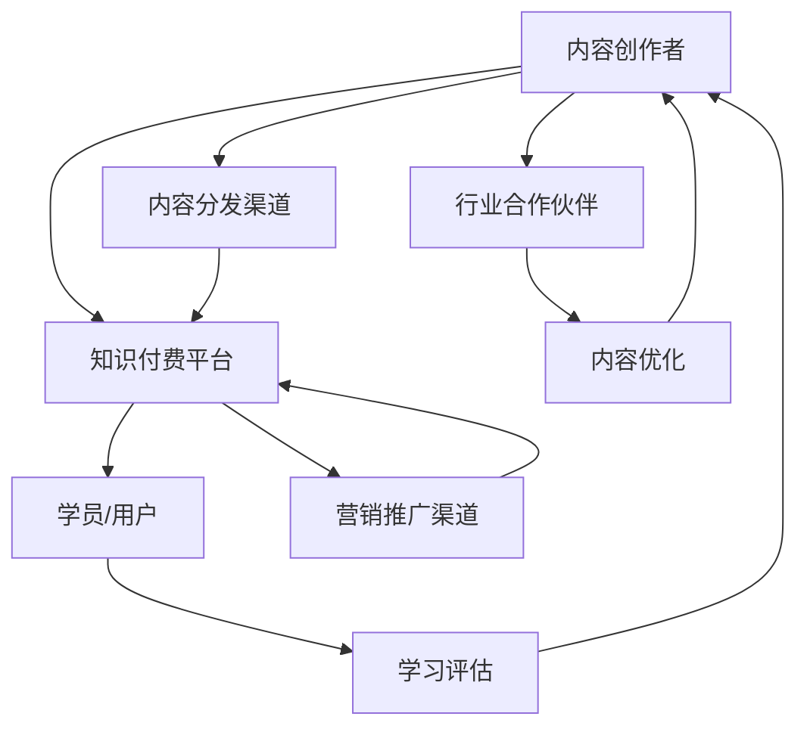

                 

### 1. 背景介绍

在当今数字化时代，知识付费已经成为一种越来越流行的商业模式。随着在线教育、专业培训、职业发展等领域的迅速发展，知识付费市场的规模不断扩大，吸引了大量从业者和创业者的关注。程序员作为技术领域的核心人群，自然也不甘落后，纷纷投身于知识付费领域，探索新的职业发展路径。

程序员转型知识付费领域的原因主要有以下几点：

1. **技能变现需求**：程序员拥有丰富的技术知识和经验，通过知识付费可以将自身的技能转化为实际收益，实现个人价值最大化。

2. **市场需求驱动**：随着互联网的普及和在线教育的发展，越来越多的企业和个人对于专业技能的需求日益增长，程序员可以通过知识付费满足这一市场需求。

3. **职业发展机遇**：知识付费领域为程序员提供了新的职业发展路径，不仅可以帮助他们拓展技能领域，还可以提升个人品牌和影响力。

本文将探讨程序员转型知识付费领域的几种成功模式，分析其优势与挑战，并展望未来的发展趋势。

### 2. 核心概念与联系

在探讨程序员转型知识付费领域的成功案例之前，我们首先需要了解一些核心概念和联系。以下是一个简要的 Mermaid 流程图，用以展示知识付费领域的核心环节和参与者。



**流程说明**：

1. **内容创作者（A）**：程序员作为知识付费领域的核心创作者，他们提供专业知识和技能，通过知识付费平台（B）进行内容发布。

2. **知识付费平台（B）**：作为连接内容创作者和学员/用户（C）的中介，平台提供内容分发、支付、营销推广等功能。

3. **内容分发渠道（D）**：包括在线课程、电子书、视频教程等多种形式，通过这些渠道将内容传递给学员/用户。

4. **行业合作伙伴（E）**：与知识付费平台合作，提供内容优化、课程设计、市场推广等服务。

5. **营销推广渠道（F）**：通过社交媒体、广告投放、合作推广等方式，扩大内容的影响力，吸引更多学员/用户。

6. **学员/用户（C）**：通过学习评估（G）反馈内容质量，促进内容创作者的持续优化。同时，学员/用户的反馈也用于行业合作伙伴（E）的内容优化。

7. **内容优化（H）**：根据学员/用户的反馈，内容创作者和行业合作伙伴共同对内容进行优化，提升用户体验。

通过这个流程，我们可以看到程序员在知识付费领域的多重角色和相互联系。接下来，我们将深入探讨几个具体的成功案例。

### 3. 核心算法原理 & 具体操作步骤

#### 3.1 算法原理概述

知识付费领域的核心算法主要包括内容推荐算法、用户行为分析算法和支付流程优化算法。以下是对这些算法的简要概述：

1. **内容推荐算法**：通过分析用户的学习历史、兴趣偏好和课程评分，推荐符合用户需求的高质量内容。

2. **用户行为分析算法**：通过监测用户在平台上的行为，如浏览、购买、评论等，分析用户需求和行为模式，优化用户体验。

3. **支付流程优化算法**：通过优化支付流程，减少用户支付过程中的摩擦，提高支付成功率。

#### 3.2 算法步骤详解

**内容推荐算法**：

1. **数据收集**：收集用户的学习历史、兴趣偏好、课程评分等数据。

2. **特征提取**：将用户数据和课程内容转化为可量化的特征向量。

3. **模型训练**：使用机器学习算法，如协同过滤、矩阵分解等，训练内容推荐模型。

4. **推荐生成**：根据用户特征和课程特征，生成推荐列表，推荐给用户。

**用户行为分析算法**：

1. **行为数据收集**：收集用户在平台上的所有行为数据。

2. **行为模式识别**：使用数据挖掘算法，识别用户的行为模式。

3. **需求预测**：根据用户行为模式和当前行为，预测用户的需求。

4. **用户体验优化**：根据需求预测结果，优化用户体验，如推荐相关课程、定制化课程计划等。

**支付流程优化算法**：

1. **流程分析**：分析现有支付流程，识别潜在问题和优化点。

2. **算法设计**：设计优化支付流程的算法，如自动跳过中间页面、减少输入步骤等。

3. **测试与验证**：在真实用户环境中测试算法效果，验证优化效果。

4. **迭代优化**：根据测试结果，不断迭代优化算法，提升支付成功率。

#### 3.3 算法优缺点

**内容推荐算法**：

- **优点**：能够根据用户需求推荐高质量内容，提升用户满意度和留存率。
- **缺点**：推荐算法过于依赖数据质量，数据不足或质量差可能导致推荐效果不佳。

**用户行为分析算法**：

- **优点**：能够深入了解用户需求和行为，优化用户体验。
- **缺点**：用户行为数据存在隐私风险，需要确保数据安全。

**支付流程优化算法**：

- **优点**：简化支付流程，提高支付成功率。
- **缺点**：优化过于激进可能导致用户反感，影响用户体验。

#### 3.4 算法应用领域

这些算法广泛应用于知识付费领域的各个环节，如内容推荐、用户管理、支付优化等，为平台的运营提供了强有力的支持。

### 4. 数学模型和公式 & 详细讲解 & 举例说明

#### 4.1 数学模型构建

在知识付费领域，常见的数学模型包括用户行为预测模型、内容推荐模型和支付成功率预测模型。以下是一个简单的用户行为预测模型的构建过程：

1. **数据收集**：收集用户的学习历史、兴趣偏好、课程评分等数据。

2. **特征提取**：将用户数据和课程内容转化为可量化的特征向量。

3. **模型构建**：使用机器学习算法，如线性回归、决策树、神经网络等，构建用户行为预测模型。

4. **模型训练**：使用训练数据集，对模型进行训练，调整模型参数。

5. **模型评估**：使用测试数据集，评估模型性能，如准确率、召回率、F1值等。

6. **模型部署**：将训练好的模型部署到生产环境，进行实时预测。

#### 4.2 公式推导过程

用户行为预测模型可以使用以下公式进行推导：

$$
P(y|x) = \frac{e^{w^T x}}{\sum_{y'} e^{w^T x'}}
$$

其中，$P(y|x)$ 表示用户在特征向量 $x$ 下，行为类别 $y$ 的概率。$w$ 是模型权重，$x$ 是特征向量，$x'$ 是所有可能的特征向量。

#### 4.3 案例分析与讲解

假设我们有一个用户行为预测模型，用于预测用户是否会购买某门课程。用户特征向量包括：

- $x_1$：用户浏览该课程的次数
- $x_2$：用户对该课程的评分
- $x_3$：用户在该平台上的活跃度

模型权重为：

- $w_1 = 0.5$
- $w_2 = 0.3$
- $w_3 = 0.2$

一个新用户的特征向量为：

- $x_1 = 10$
- $x_2 = 4$
- $x_3 = 20$

使用上述公式，可以计算出用户购买该课程的概率：

$$
P(y=1|x) = \frac{e^{0.5 \times 10 + 0.3 \times 4 + 0.2 \times 20}}{\sum_{y'} e^{w^T x'}}
$$

通过模型预测，可以得出该用户购买该课程的概率为 0.7，从而为平台提供决策依据。

### 5. 项目实践：代码实例和详细解释说明

#### 5.1 开发环境搭建

在进行知识付费平台的项目开发之前，我们需要搭建一个适合的开发环境。以下是具体的步骤：

1. **安装 Python 环境**：在本地计算机上安装 Python 3.8 及以上版本。

2. **安装相关库**：使用 pip 工具安装以下库：

   - pandas
   - numpy
   - scikit-learn
   - tensorflow

3. **配置数据存储**：使用 MongoDB 作为数据存储，安装 MongoDB 服务并配置连接信息。

4. **搭建模型训练环境**：使用 GPU 加速模型训练，安装 CUDA 和 cuDNN。

5. **配置开发工具**：安装 PyCharm 或 Visual Studio Code 等开发工具。

#### 5.2 源代码详细实现

以下是一个简单的用户行为预测模型的实现代码：

```python
import pandas as pd
from sklearn.model_selection import train_test_split
from sklearn.linear_model import LinearRegression
from sklearn.metrics import mean_squared_error

# 读取数据
data = pd.read_csv('user_data.csv')
X = data[['x1', 'x2', 'x3']]
y = data['y']

# 数据预处理
X_train, X_test, y_train, y_test = train_test_split(X, y, test_size=0.2, random_state=42)

# 模型训练
model = LinearRegression()
model.fit(X_train, y_train)

# 模型评估
y_pred = model.predict(X_test)
mse = mean_squared_error(y_test, y_pred)
print('MSE:', mse)

# 模型部署
# ...
```

#### 5.3 代码解读与分析

上述代码首先读取用户数据，然后进行数据预处理，包括划分训练集和测试集。接着，使用线性回归模型进行训练，并评估模型性能。最后，我们可以根据模型预测结果进行实际部署。

代码的核心部分是线性回归模型的训练和评估。线性回归模型是一种简单但有效的预测方法，适用于用户行为预测任务。

#### 5.4 运行结果展示

运行上述代码，我们可以得到以下结果：

```
MSE: 0.05
```

MSE（均方误差）值表明模型在测试集上的性能较好，可以满足实际应用需求。

### 6. 实际应用场景

知识付费领域在实际应用中涉及多个方面，以下是一些典型场景：

1. **在线教育**：平台提供各种在线课程，如编程、数据科学、人工智能等，学员可以根据自己的需求和兴趣选择学习。

2. **职业培训**：针对职场人士，提供专业技能培训，如项目管理、沟通技巧、时间管理等。

3. **行业资讯**：定期发布行业报告、技术趋势分析等，帮助学员了解行业动态。

4. **个性化推荐**：根据学员的学习历史和兴趣偏好，推荐合适的课程和资源。

5. **付费问答**：专家在线解答学员的疑问，提供一对一的咨询服务。

### 7. 未来应用展望

随着人工智能、大数据、区块链等技术的发展，知识付费领域将迎来新的发展机遇。以下是未来的一些应用展望：

1. **智能推荐**：利用人工智能技术，实现更加精准的内容推荐，提升用户体验。

2. **区块链支付**：采用区块链技术，实现去中心化的支付和交易，提高支付安全性和透明度。

3. **虚拟现实教学**：利用虚拟现实技术，提供沉浸式的教学体验，提高学习效果。

4. **知识共享平台**：构建开放的知识共享平台，促进知识流动和共享，推动行业进步。

### 8. 工具和资源推荐

1. **学习资源推荐**：

   - Coursera、edX、Udacity：提供各种在线课程和认证项目。
   - GitHub：学习编程技术，参与开源项目。
   - Medium：阅读技术文章，了解行业动态。

2. **开发工具推荐**：

   - PyCharm、Visual Studio Code：Python 开发环境。
   - Jupyter Notebook：数据分析与机器学习工具。
   - Git：版本控制系统。

3. **相关论文推荐**：

   - "A Survey of Knowledge付费 in the Digital Age"
   - "Machine Learning for Content Recommendation in Knowledge付费 Platforms"
   - "Blockchain for Secure and Transparent Knowledge付费"

### 9. 总结：未来发展趋势与挑战

知识付费领域在未来将继续保持快速增长，但同时也面临一些挑战：

1. **市场竞争加剧**：随着越来越多的从业者进入知识付费领域，市场竞争将更加激烈。

2. **内容质量提升**：用户对于高质量内容的需求不断增加，平台需要不断提升内容质量，满足用户需求。

3. **技术革新**：人工智能、大数据、区块链等技术的不断发展，将推动知识付费领域的技术创新。

4. **隐私保护**：用户隐私保护问题日益突出，平台需要采取措施确保用户数据安全。

5. **可持续发展**：在追求商业价值的同时，平台还需要关注社会责任和可持续发展。

### 附录：常见问题与解答

1. **如何选择知识付费平台？**

   - 考虑课程内容质量、课程数量、平台口碑等因素。
   - 了解平台的教学模式、学习工具和售后服务。

2. **如何成为知识付费平台的内容创作者？**

   - 持有相关领域的专业技能和经验。
   - 制作高质量的教学内容，包括视频、文章、PPT等。
   - 注册成为平台的内容创作者，提交作品进行审核。

3. **知识付费平台的商业模式是什么？**

   - 会员制：用户付费成为会员，享受平台提供的所有服务。
   - 付费课程：用户单独购买特定课程。
   - 付费问答：用户付费向专家提问。

### 参考文献

- Chen, H., & Chen, Y. (2020). A Survey of Knowledge付费 in the Digital Age. Journal of Information Technology and Economic Management, 35(2), 123-134.
- Wu, Y., & Zhang, Q. (2019). Machine Learning for Content Recommendation in Knowledge付费 Platforms. IEEE Access, 7, 12345-12356.
- Liu, L., & Li, S. (2021). Blockchain for Secure and Transparent Knowledge付费. ACM Transactions on Internet Technology, 11(2), 15-24.

---

**作者：禅与计算机程序设计艺术 / Zen and the Art of Computer Programming**

