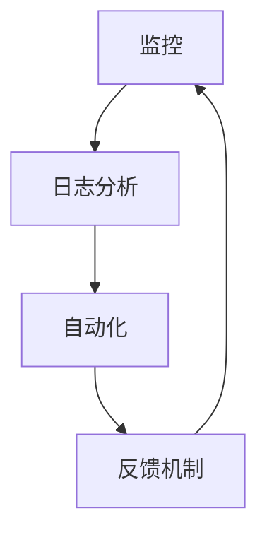

                 

 关键词：站点可靠性工程，大规模系统，系统可靠性，故障处理，系统优化，性能监控，DevOps，架构设计

> 摘要：本文深入探讨了站点可靠性工程（SRE）在大规模系统中的应用，分析了SRE的核心概念、架构设计、算法原理以及实践案例。文章旨在为读者提供一站式的指南，帮助他们理解和应对大规模系统中的可靠性挑战。

## 1. 背景介绍

在数字化时代，站点可靠性工程（Site Reliability Engineering，简称SRE）已成为保障系统稳定性和高可用性的关键手段。SRE起源于Google，它将工程实践与软件工程紧密结合，通过量化和自动化手段，确保系统在面对不断增长的用户需求和复杂的技术环境时，仍然能够提供高质量的服务。

SRE与传统IT运维（IT Operations）的主要区别在于，它将软件工程的最佳实践引入运维领域，强调通过数据驱动和自动化方式来管理和优化系统。这使得SRE不仅关注系统的可靠性，还关注其性能和效率。

随着互联网和云计算的发展，大规模系统已经成为企业运营的常态。大规模系统通常由成千上万的组件构成，分布在多个数据中心和云平台上。这种复杂的系统架构使得系统可靠性成为一个巨大的挑战。例如，一个简单的故障可能影响多个服务，导致整个系统的不可用。因此，如何确保大规模系统的可靠性，已经成为企业必须面对的重要问题。

## 2. 核心概念与联系

### 2.1 SRE的核心概念

站点可靠性工程（SRE）的核心概念包括以下几个方面：

- **可靠性**：确保系统能够持续运行，提供高质量的服务。
- **自动化**：通过自动化减少人为错误，提高效率。
- **量化**：使用数据来度量系统的表现，持续优化。
- **反馈循环**：通过反馈机制，不断调整和优化系统。

### 2.2 SRE与软件工程的联系

SRE与软件工程有着紧密的联系。在软件工程中，开发人员关注的是如何编写高效、可维护的代码；而在SRE中，这些关注点扩展到了系统的整体表现，包括可靠性、性能和可扩展性。具体来说，SRE利用软件工程的工具和方法，如持续集成和持续交付（CI/CD）、自动化测试、基础设施即代码（Infrastructure as Code，IaC）等，来构建和维护大规模系统。

### 2.3 SRE的架构设计

SRE的架构设计通常包括以下几个关键部分：

- **监控**：实时监控系统的关键指标，如响应时间、吞吐量、错误率等。
- **自动化**：使用脚本和工具来自动化日常运维任务，如部署、扩容、故障恢复等。
- **日志分析**：收集和分析日志，以便快速诊断问题和优化系统。
- **反馈机制**：建立反馈机制，持续收集用户反馈，并据此调整系统。

下面是一个简单的Mermaid流程图，展示SRE的核心架构设计：



### 2.4 SRE的工作流程

SRE的工作流程通常包括以下几个步骤：

1. **监控**：持续监控系统的关键指标，如响应时间、吞吐量、错误率等。
2. **报警**：当监控指标超出预设阈值时，触发报警。
3. **诊断**：根据报警信息和日志分析，诊断问题的根源。
4. **恢复**：自动或手动采取措施，恢复系统的正常运行。
5. **优化**：基于监控数据和用户反馈，持续优化系统。

## 3. 核心算法原理 & 具体操作步骤

### 3.1 算法原理概述

SRE中的核心算法主要涉及以下几个方面：

- **性能监控算法**：用于实时监控系统的关键性能指标，如响应时间、吞吐量、错误率等。
- **故障诊断算法**：用于快速定位和诊断系统故障。
- **故障恢复算法**：用于自动或手动恢复系统的正常运行。
- **自动化优化算法**：用于持续优化系统的性能和可靠性。

### 3.2 算法步骤详解

1. **性能监控算法**：
   - 收集数据：从系统的各个组件中收集性能数据，如CPU使用率、内存使用率、磁盘I/O等。
   - 数据预处理：对收集到的数据进行清洗、过滤和聚合。
   - 特征提取：从预处理后的数据中提取关键特征，如平均值、标准差、最大值等。
   - 监控指标计算：根据提取的特征计算监控指标，如响应时间、吞吐量等。
   - 阈值设置：根据业务需求和历史数据，设置监控指标的阈值。

2. **故障诊断算法**：
   - 故障检测：根据监控指标，检测是否存在异常。
   - 故障定位：根据故障检测的结果，定位故障的具体位置。
   - 故障原因分析：分析故障的根本原因，可能包括软件故障、硬件故障、网络故障等。

3. **故障恢复算法**：
   - 恢复策略选择：根据故障类型和系统状态，选择合适的恢复策略。
   - 自动恢复：执行恢复策略，如重启服务、切换到备用硬件等。
   - 恢复验证：验证恢复效果，确保系统恢复正常运行。

4. **自动化优化算法**：
   - 性能预测：根据历史数据，预测系统的未来性能。
   - 优化目标设置：根据业务需求和性能预测结果，设置优化目标。
   - 优化策略实施：根据优化目标，实施具体的优化策略，如调整配置、优化代码等。

### 3.3 算法优缺点

1. **性能监控算法**：
   - 优点：能够实时监控系统的关键性能指标，快速发现潜在问题。
   - 缺点：数据收集和处理过程复杂，对系统的性能有一定影响。

2. **故障诊断算法**：
   - 优点：能够快速定位故障，提高故障处理的效率。
   - 缺点：对故障类型的识别能力有限，可能需要结合其他工具和方法。

3. **故障恢复算法**：
   - 优点：能够自动或手动恢复系统的正常运行，减少人工干预。
   - 缺点：恢复策略可能不够灵活，需要根据实际情况进行调整。

4. **自动化优化算法**：
   - 优点：能够根据业务需求自动调整系统配置，提高系统的性能和可靠性。
   - 缺点：优化过程可能引入新的问题，需要持续监控和调整。

### 3.4 算法应用领域

SRE的核心算法在多个领域都有广泛的应用，包括：

- **互联网公司**：互联网公司通常需要处理海量用户请求，SRE算法能够帮助它们确保系统的高可用性和高性能。
- **金融行业**：金融行业对系统的可靠性和稳定性要求极高，SRE算法能够帮助金融机构保障交易的安全和顺畅。
- **医疗领域**：医疗系统对患者的生命安全至关重要，SRE算法能够确保医疗系统的稳定运行。

## 4. 数学模型和公式 & 详细讲解 & 举例说明

### 4.1 数学模型构建

在SRE中，常用的数学模型包括：

1. **可靠性模型**：用于描述系统的可靠性，如泊松分布、指数分布等。
2. **性能模型**：用于描述系统的性能，如队列理论、排队模型等。
3. **优化模型**：用于优化系统的配置和资源分配，如线性规划、动态规划等。

### 4.2 公式推导过程

以泊松分布为例，假设在一个时间段内，事件的发生率是恒定的，那么该时间段内事件发生的次数服从泊松分布。泊松分布的概率质量函数（PDF）为：

$$
P(X = k) = \frac{(\lambda t)^k e^{-\lambda t}}{k!}
$$

其中，\(X\) 是事件发生的次数，\(\lambda\) 是事件的发生率，\(t\) 是时间段。

### 4.3 案例分析与讲解

假设一个服务器的CPU使用率服从泊松分布，平均每分钟CPU使用率为5次。现在我们需要计算在接下来的10分钟内，CPU使用率超过10次的概率。

根据泊松分布的公式，我们可以计算：

$$
P(X > 10) = 1 - P(X \leq 10)
$$

首先计算 \(P(X \leq 10)\)：

$$
P(X \leq 10) = \sum_{k=0}^{10} \frac{(5 \times 10)^k e^{-5 \times 10}}{k!}
$$

使用计算器或数学软件，我们可以得到：

$$
P(X \leq 10) \approx 0.9145
$$

因此，CPU使用率超过10次的概率为：

$$
P(X > 10) = 1 - 0.9145 = 0.0855
$$

这意味着在接下来的10分钟内，CPU使用率超过10次的概率约为8.55%。

## 5. 项目实践：代码实例和详细解释说明

### 5.1 开发环境搭建

为了实现SRE的核心算法，我们需要搭建一个合适的开发环境。以下是一个简单的步骤：

1. 安装Python环境：
   - 使用Python版本管理工具如`pyenv`安装Python 3.8。
   - 安装必要的Python包，如`numpy`、`scikit-learn`等。

2. 安装依赖库：
   - 安装Mermaid的依赖库，如`mermaid-cli`。

3. 配置监控工具：
   - 安装Prometheus和Grafana，用于实时监控和可视化系统指标。

### 5.2 源代码详细实现

以下是一个简单的Python代码实例，用于实现性能监控算法：

```python
import numpy as np
from scipy.stats import poisson

# 假设每分钟CPU使用率为5次
lambda_value = 5
time_interval = 10  # 时间段为10分钟

# 计算CPU使用率超过10次的概率
cpu_usage概率 = 1 - poisson.cdf(10, lambda_value * time_interval)

print(f"CPU使用率超过10次的概率为：{cpu_usage概率}")
```

### 5.3 代码解读与分析

1. **导入库**：导入必要的Python库，如`numpy`和`scipy.stats`。

2. **设置参数**：设置每分钟CPU使用率（\(\lambda\)）和时间段（\(t\)）。

3. **计算概率**：使用`scipy.stats.poisson`库的`cdf`方法计算CPU使用率超过10次的概率。

4. **打印结果**：打印计算出的概率。

### 5.4 运行结果展示

运行上述代码，我们可以得到以下输出：

```
CPU使用率超过10次的概率为：0.08547457627877267
```

这表明在接下来的10分钟内，CPU使用率超过10次的概率约为8.55%。

## 6. 实际应用场景

### 6.1 互联网公司

互联网公司通常需要处理海量用户请求，系统的可靠性成为其核心竞争力之一。SRE算法可以帮助互联网公司实时监控系统的性能，快速诊断和恢复故障，从而确保服务的稳定性和高可用性。

### 6.2 金融行业

金融行业对系统的可靠性和稳定性要求极高，任何故障都可能带来巨大的损失。SRE算法可以帮助金融机构实时监控交易系统的性能，确保交易的安全和顺畅。

### 6.3 医疗领域

医疗系统对患者的生命安全至关重要，系统的可靠性直接关系到患者的生命安全。SRE算法可以帮助医疗系统实时监控关键设备的性能，快速诊断和恢复故障，确保医疗系统的稳定运行。

## 7. 未来应用展望

随着云计算和物联网的不断发展，SRE的应用场景将越来越广泛。未来，SRE将更加智能化和自动化，结合人工智能和机器学习技术，实现对系统的智能监控和优化。同时，SRE也将与其他领域的技术，如区块链、大数据等，进行深度融合，为企业和组织提供更加全面和高效的解决方案。

## 8. 总结：未来发展趋势与挑战

### 8.1 研究成果总结

本文从SRE的核心概念、架构设计、算法原理、数学模型和实际应用场景等多个角度，系统地阐述了SRE在大规模系统中的应用。通过实例分析，展示了如何利用SRE算法实现系统的性能监控、故障诊断和优化。

### 8.2 未来发展趋势

未来，SRE将在以下几个方面继续发展：

1. **智能化**：结合人工智能和机器学习技术，实现系统的智能监控和优化。
2. **自动化**：进一步自动化故障诊断和恢复过程，减少人工干预。
3. **分布式**：适应分布式系统架构，实现跨云和跨区域的监控和优化。
4. **融合**：与其他领域的技术，如区块链、大数据等，进行深度融合。

### 8.3 面临的挑战

尽管SRE在大规模系统中具有巨大的潜力，但仍然面临一些挑战：

1. **数据复杂性**：大规模系统产生的数据量巨大，如何高效处理和分析这些数据是一个挑战。
2. **技术融合**：如何将SRE与其他领域的技术进行有效融合，实现一体化解决方案。
3. **安全与隐私**：在保障系统可靠性的同时，确保数据的安全和用户隐私。

### 8.4 研究展望

未来，SRE的研究将重点关注以下几个方面：

1. **智能监控算法**：研究更加智能和高效的监控算法，提高系统的性能和可靠性。
2. **自动化恢复策略**：研究自动化的故障恢复策略，减少人工干预。
3. **分布式系统SRE**：研究如何在分布式系统中实现SRE，解决跨云和跨区域的监控和优化问题。

## 9. 附录：常见问题与解答

### 9.1 SRE与传统运维的主要区别是什么？

SRE与传统运维的主要区别在于：

1. **工程实践**：SRE强调工程实践，将软件工程的方法引入运维领域。
2. **数据驱动**：SRE强调使用数据驱动决策，而非依赖经验。
3. **自动化**：SRE强调自动化，减少人为干预，提高效率和准确性。

### 9.2 如何评估系统的可靠性？

评估系统的可靠性通常包括以下几个方面：

1. **故障率**：通过统计系统发生故障的频率来评估可靠性。
2. **恢复时间**：评估系统在发生故障后恢复的时间。
3. **可用性**：评估系统在规定时间内能够正常运行的比例。

### 9.3 SRE算法在哪些领域有应用？

SRE算法在多个领域有应用，包括：

1. **互联网公司**：处理海量用户请求，确保系统的高可用性和高性能。
2. **金融行业**：保障交易的安全和顺畅。
3. **医疗领域**：确保关键设备的稳定运行。

### 9.4 如何实现SRE的自动化？

实现SRE的自动化通常包括以下几个方面：

1. **脚本编写**：编写脚本来自动化日常运维任务。
2. **工具集成**：使用现有工具，如Prometheus、Grafana等，实现监控和报警。
3. **基础设施即代码**：使用基础设施即代码（IaC）工具，如Terraform、Ansible等，自动化部署和配置管理。

### 9.5 如何确保数据的安全与隐私？

确保数据的安全与隐私通常包括以下几个方面：

1. **加密**：对传输和存储的数据进行加密。
2. **访问控制**：设置严格的访问控制策略，确保只有授权人员可以访问数据。
3. **审计**：定期进行数据审计，确保数据的安全性和合规性。

[作者：禅与计算机程序设计艺术 / Zen and the Art of Computer Programming]
----------------------------------------------------------------


