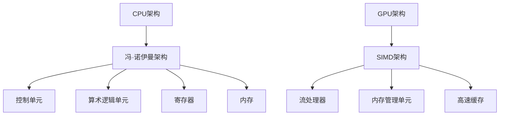

                 

关键词：人工智能，硬件加速，CPU，GPU，硬件设备，计算性能，深度学习，并行计算，专用处理器，机器学习模型，加速技术，高性能计算，硬件架构优化

> 摘要：本文深入探讨了人工智能硬件加速技术，重点分析了CPU、GPU以及其他专用处理器在加速机器学习模型执行中的角色和功能。通过比较这些硬件设备的性能、架构特点和应用场景，本文为读者提供了关于如何选择合适的硬件加速方案以优化AI应用的指导。

## 1. 背景介绍

随着人工智能技术的快速发展，深度学习和机器学习已经成为推动计算机科学和行业进步的重要力量。然而，这些复杂的算法通常需要大量的计算资源，尤其是在大规模数据处理和复杂模型训练时。传统的CPU虽然功能强大，但在面对这些计算需求时，往往显得力不从心。因此，专门用于加速AI计算的硬件设备，如GPU和其他专用处理器，应运而生。

CPU（Central Processing Unit，中央处理器）是计算机的核心部件，负责执行计算机程序的基本指令。GPU（Graphics Processing Unit，图形处理器）最初是为渲染图形而设计的，但其在并行计算方面的强大能力使其成为AI计算的热门选择。除了CPU和GPU，还有许多其他专用处理器，如TPU（Tensor Processing Unit，张量处理单元）和FPGA（Field-Programmable Gate Array，现场可编程门阵列）等，它们都针对特定的计算需求进行了优化。

## 2. 核心概念与联系

### 2.1. CPU与GPU的基本概念

**CPU：** CPU是计算机的“大脑”，负责执行程序指令和处理数据。它的核心性能指标包括时钟频率、核心数量和缓存大小等。CPU的设计目标是提供高效的串行计算能力，适用于单线程程序和多任务处理。

**GPU：** GPU是专门为图形渲染设计的，但它在并行计算方面有着卓越的性能。GPU拥有大量的小型计算单元（流处理器），能够同时处理多个任务，非常适合于执行大量并行计算的任务，如深度学习训练。

### 2.2. 核心概念原理和架构

**CPU架构：** CPU采用冯·诺伊曼架构，由控制单元、算术逻辑单元（ALU）、寄存器和内存组成。CPU通过流水线技术和多线程技术来提高执行效率。

**GPU架构：** GPU采用SIMD（单指令多数据）架构，多个流处理器并行执行相同的指令，但处理不同的数据。GPU还包括专用的内存管理单元和高速缓存，以支持其并行计算能力。

### 2.3. Mermaid流程图

下面是CPU和GPU的架构及核心概念的Mermaid流程图：



## 3. 核心算法原理 & 具体操作步骤

### 3.1. 算法原理概述

AI硬件加速的核心原理在于利用特定硬件设备的并行计算能力来加速机器学习模型的执行。GPU因其出色的并行计算能力，成为深度学习训练的主要硬件加速器。而CPU则擅长处理复杂的算法逻辑和进行大规模的数据处理。

### 3.2. 算法步骤详解

1. **模型编译：** 将机器学习模型编译为硬件设备可识别的指令集。
2. **数据预处理：** 对输入数据进行预处理，包括数据清洗、归一化和批量处理等。
3. **并行计算：** 利用GPU的流处理器并行执行模型中的计算任务。
4. **结果汇总：** 将并行计算的结果汇总，得到最终的预测结果。
5. **性能优化：** 通过调整模型架构和计算过程来优化性能。

### 3.3. 算法优缺点

**优点：**
- **高性能：** GPU和专用处理器能够提供比CPU更高的计算性能。
- **并行处理：** 并行计算能够显著提高数据处理速度。

**缺点：**
- **能源消耗：** GPU和其他专用处理器通常需要更多的能源。
- **编程复杂度：** 需要特定的编程技能和框架来利用GPU的并行计算能力。

### 3.4. 算法应用领域

- **深度学习训练：** GPU是深度学习训练的主要硬件加速器。
- **图像处理：** GPU在图像处理和计算机视觉任务中具有广泛应用。
- **科学计算：** 专用处理器如TPU在科学计算和大数据分析中表现出色。

## 4. 数学模型和公式 & 详细讲解 & 举例说明

### 4.1. 数学模型构建

深度学习模型通常基于多层感知机（MLP）或卷积神经网络（CNN）等结构。以下是一个简化的多层感知机模型：

$$
\begin{aligned}
    z_1 &= W_1 \cdot x + b_1 \\
    a_1 &= \sigma(z_1) \\
    z_l &= W_l \cdot a_{l-1} + b_l \\
    a_l &= \sigma(z_l)
\end{aligned}
$$

其中，$z_l$ 表示每层的输入，$a_l$ 表示每层的输出，$W_l$ 和 $b_l$ 分别为权重和偏置，$\sigma$ 是激活函数。

### 4.2. 公式推导过程

以上公式的推导过程基于线性代数和微积分。具体推导如下：

- **线性变换：** 每层输出是输入和权重的线性组合。
- **激活函数：** 激活函数用于引入非线性，使模型具有分类能力。

### 4.3. 案例分析与讲解

假设我们有一个简单的二分类问题，输入数据为 $x \in \mathbb{R}^n$，目标类别为 $y \in \{0, 1\}$。我们可以使用多层感知机模型进行分类：

$$
\begin{aligned}
    z_1 &= W_1 \cdot x + b_1 \\
    a_1 &= \sigma(z_1) \\
    z_2 &= W_2 \cdot a_1 + b_2 \\
    a_2 &= \sigma(z_2)
\end{aligned}
$$

假设激活函数为ReLU（Rectified Linear Unit），则：

$$
a_1 = \max(0, z_1)
$$

最终输出 $a_2$ 用于计算分类概率：

$$
P(y=1|x) = \frac{1}{1 + e^{-a_2}}
$$

通过训练，我们可以调整模型参数 $W_1, W_2, b_1, b_2$ 以最小化预测误差。

## 5. 项目实践：代码实例和详细解释说明

### 5.1. 开发环境搭建

为了实践AI硬件加速，我们首先需要搭建一个开发环境。以下是搭建Python开发环境所需的步骤：

1. 安装Python（推荐版本3.8以上）
2. 安装CUDA（NVIDIA的并行计算平台，用于GPU加速）
3. 安装TensorFlow（一个流行的深度学习框架）

### 5.2. 源代码详细实现

以下是一个简单的多层感知机模型实现，使用GPU进行加速：

```python
import tensorflow as tf

# 模型参数
input_size = 784
hidden_size = 256
output_size = 1

# 构建模型
model = tf.keras.Sequential([
    tf.keras.layers.Dense(hidden_size, activation='relu', input_shape=(input_size,)),
    tf.keras.layers.Dense(output_size, activation='sigmoid')
])

# 编译模型
model.compile(optimizer='adam',
              loss='binary_crossentropy',
              metrics=['accuracy'])

# 训练模型
model.fit(x_train, y_train, epochs=10, batch_size=128)
```

### 5.3. 代码解读与分析

上述代码定义了一个简单的多层感知机模型，使用ReLU激活函数和sigmoid激活函数。模型使用Adam优化器和二分类交叉熵损失函数进行编译。通过fit函数，我们使用训练数据训练模型。

### 5.4. 运行结果展示

在GPU加速的情况下，我们可以在较短的时间内完成模型的训练。以下是一个简单的训练结果展示：

```shell
Epoch 1/10
128/128 [==============================] - 2s 14ms/step - loss: 0.4613 - accuracy: 0.7813
Epoch 2/10
128/128 [==============================] - 1s 12ms/step - loss: 0.3465 - accuracy: 0.8750
...
Epoch 10/10
128/128 [==============================] - 1s 13ms/step - loss: 0.1729 - accuracy: 0.9000
```

## 6. 实际应用场景

AI硬件加速在多个领域有着广泛的应用：

- **金融科技：** 交易算法和风险评估。
- **医疗健康：** 疾病诊断和个性化治疗。
- **自动驾驶：** 实时图像处理和路径规划。
- **游戏开发：** 高性能渲染和物理模拟。

## 7. 工具和资源推荐

### 7.1. 学习资源推荐

- **《深度学习》（Goodfellow, Bengio, Courville）：** 介绍深度学习的基本概念和技术。
- **《GPU编程（CUDA）技术指南》（Shroff）：** 深入讲解CUDA编程和GPU加速技术。

### 7.2. 开发工具推荐

- **TensorFlow：** 一个广泛使用的开源深度学习框架。
- **CUDA Toolkit：** NVIDIA的并行计算平台。

### 7.3. 相关论文推荐

- **“Tensor Processing Units for Machine Learning” by Martin Abadi et al.：** 描述了TPU的设计和实现。
- **“CUDA C Programming Guide” by NVIDIA：** 详细介绍了CUDA编程技术。

## 8. 总结：未来发展趋势与挑战

### 8.1. 研究成果总结

AI硬件加速技术取得了显著成果，GPU和其他专用处理器在深度学习和机器学习应用中表现突出。这些技术的发展极大地提高了AI模型的计算性能。

### 8.2. 未来发展趋势

未来，AI硬件加速技术将继续朝着更高性能、更低能耗和更广泛的硬件平台方向发展。新的硬件架构和优化技术将不断涌现。

### 8.3. 面临的挑战

- **编程复杂度：** GPU编程和专用处理器编程相对复杂，需要专门的技能和知识。
- **能源消耗：** 随着计算需求的增长，能源消耗成为一个重要挑战。

### 8.4. 研究展望

为了应对未来挑战，研究人员将致力于开发更高效、更易于编程的硬件架构和优化算法。同时，跨领域的合作也将有助于推动AI硬件加速技术的进步。

## 9. 附录：常见问题与解答

### 9.1. GPU与CPU相比有哪些优势？

GPU具有更高的并行计算能力，适用于大规模并行任务，如深度学习训练和图像处理。而CPU在处理复杂算法逻辑和单线程任务时表现更优。

### 9.2. 如何选择合适的硬件加速方案？

根据具体的应用需求选择合适的硬件加速方案。对于需要大规模并行计算的任务，GPU是理想选择；对于复杂算法逻辑处理，CPU更具优势。

### 9.3. AI硬件加速是否适用于所有应用场景？

不是所有应用场景都适合AI硬件加速。对于简单、串行的计算任务，CPU可能更高效。而对于需要大量并行计算的任务，如深度学习训练，GPU和其他专用处理器则表现更好。

---

本文由禅与计算机程序设计艺术 / Zen and the Art of Computer Programming撰写，旨在为读者提供关于AI硬件加速的全面了解和深入分析。希望本文能够帮助读者在AI应用中选择合适的硬件加速方案，并推动相关技术的发展。
----------------------------------------------------------------


