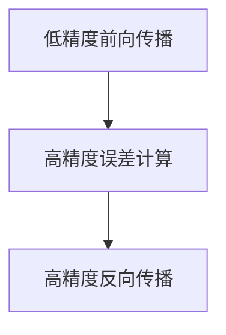

                 

关键词：混合精度训练，fp16，bf16，fp8，浮点数精度，算法优化，神经网络，计算效率，资源节约

摘要：本文将深入探讨混合精度训练（Hybrid Precision Training）这一现代机器学习领域的重要技术。通过将不同的浮点数精度（fp16、bf16和fp8）结合使用，我们可以在保持模型精度的同时显著提高计算效率和降低资源消耗。本文将详细解析混合精度训练的核心概念、算法原理、具体操作步骤以及在实际应用中的表现。此外，还将介绍数学模型和公式，并通过具体项目实践展示其应用价值。最后，文章将对混合精度训练的未来发展趋势和面临的挑战进行展望。

## 1. 背景介绍

随着深度学习技术的迅猛发展，神经网络模型在图像识别、自然语言处理、推荐系统等领域的应用越来越广泛。然而，深度学习模型的训练和推理过程对计算资源和存储资源的需求也日益增加。传统的单精度浮点数（fp32）虽然在计算精度上能够满足大多数需求，但其在计算速度和存储开销方面仍有优化空间。为此，混合精度训练作为一种新兴技术应运而生。

混合精度训练通过将不同精度的浮点数（如半精度浮点数fp16、高精度半精度浮点数bf16以及低精度浮点数fp8）结合使用，可以在保持模型精度的同时显著提高计算效率和资源利用率。例如，fp16相对于fp32在计算速度上有近两倍的提升，同时在存储空间上节省了一半。bf16和fp8则在不同程度上提供了更快的计算速度和更低的存储需求。

本文将重点探讨fp16、bf16和fp8在混合精度训练中的应用，分析其原理、操作步骤、优缺点以及实际应用领域，以期为读者提供深入理解和技术参考。

## 2. 核心概念与联系

### 2.1 浮点数精度概述

浮点数精度是指浮点数在计算机内存中表示时的有效数字位数。常见的浮点数精度包括单精度（fp32）和双精度（fp64）。近年来，半精度浮点数（fp16）和高精度半精度浮点数（bf16）也逐渐得到应用。

- **fp16（半精度浮点数）**：fp16使用16位来表示浮点数，包含1位符号位、5位指数位和10位尾数位。相较于fp32，fp16的精度较低，但其在计算速度和存储空间上有显著优势。
- **bf16（高精度半精度浮点数）**：bf16使用16位来表示浮点数，包含1位符号位、7位指数位和8位尾数位。相较于fp16，bf16在精度上有所提升，但计算速度和存储空间也有所增加。
- **fp8（低精度浮点数）**：fp8使用8位来表示浮点数，包含1位符号位、3位指数位和4位尾数位。相较于fp16和bf16，fp8的精度更低，但计算速度和存储空间优势更加明显。

### 2.2 混合精度训练原理

混合精度训练的基本思想是将不同精度的浮点数结合使用，以在保持模型精度的同时提高计算效率和资源利用率。具体来说，混合精度训练包括以下步骤：

1. **低精度前向传播**：使用低精度浮点数（如fp8）进行前向传播，以加速计算过程。
2. **高精度误差计算**：将前向传播得到的低精度预测结果与高精度真实标签进行比较，计算误差。误差使用高精度浮点数（如fp32或bf16）表示，以确保误差计算的高精度。
3. **高精度反向传播**：使用高精度浮点数进行反向传播，更新模型参数。

通过这种方式，混合精度训练可以在大部分计算过程中使用低精度浮点数，而在关键步骤中使用高精度浮点数，从而在保持模型精度的同时显著提高计算效率和资源利用率。

### 2.3 Mermaid 流程图



### 2.4 混合精度训练的优势与挑战

**优势：**

1. **计算效率提升**：使用低精度浮点数可以显著提高计算速度，降低计算负载。
2. **资源节约**：低精度浮点数占用的内存和存储空间更少，有助于节约资源。
3. **模型精度保持**：通过在高精度步骤中使用高精度浮点数，可以确保模型精度的保持。

**挑战：**

1. **数值稳定性**：低精度浮点数在计算过程中可能引入更多的数值稳定性问题，需要特别的算法设计来避免。
2. **模型调整**：低精度浮点数的引入可能需要调整模型参数和优化算法，以确保模型性能不受影响。

## 3. 核心算法原理 & 具体操作步骤

### 3.1 算法原理概述

混合精度训练的核心算法是基于低精度和高精度浮点数的结合使用。具体操作步骤如下：

1. **初始化模型**：初始化模型参数，使用高精度浮点数（如fp32或bf16）。
2. **低精度前向传播**：使用低精度浮点数（如fp8）进行前向传播，计算预测结果。
3. **高精度误差计算**：使用高精度浮点数计算预测结果与真实标签之间的误差。
4. **高精度反向传播**：使用高精度浮点数进行反向传播，更新模型参数。
5. **迭代训练**：重复步骤2至步骤4，直到模型达到预期性能。

### 3.2 算法步骤详解

**步骤1：初始化模型**

初始化模型参数时，使用高精度浮点数（如fp32或bf16）。这样可以确保模型初始化时的精度较高，为后续的误差计算和反向传播打下基础。

**步骤2：低精度前向传播**

使用低精度浮点数（如fp8）进行前向传播，计算预测结果。由于低精度浮点数的计算速度较快，可以显著提高前向传播的效率。

**步骤3：高精度误差计算**

将低精度预测结果与高精度真实标签进行比较，计算误差。误差使用高精度浮点数（如fp32或bf16）表示，以确保误差计算的高精度。

**步骤4：高精度反向传播**

使用高精度浮点数进行反向传播，更新模型参数。这一步是确保模型精度的关键步骤，通过高精度反向传播可以修正模型参数，提高模型的预测能力。

**步骤5：迭代训练**

重复步骤2至步骤4，直到模型达到预期性能。迭代过程中，可以通过调整低精度和高精度浮点数的比例，进一步优化模型的计算效率和精度。

### 3.3 算法优缺点

**优点：**

1. **计算效率高**：低精度浮点数的引入可以显著提高计算速度，降低计算负载。
2. **资源利用率高**：低精度浮点数占用的内存和存储空间更少，有助于节约资源。
3. **模型精度保持**：通过在高精度步骤中使用高精度浮点数，可以确保模型精度的保持。

**缺点：**

1. **数值稳定性问题**：低精度浮点数在计算过程中可能引入更多的数值稳定性问题，需要特别的算法设计来避免。
2. **模型调整**：低精度浮点数的引入可能需要调整模型参数和优化算法，以确保模型性能不受影响。

### 3.4 算法应用领域

混合精度训练在以下领域有广泛的应用：

1. **图像识别**：在图像识别任务中，混合精度训练可以显著提高模型的计算效率和资源利用率，适用于大规模图像数据处理。
2. **自然语言处理**：在自然语言处理任务中，混合精度训练可以加速模型训练和推理过程，提高模型性能。
3. **推荐系统**：在推荐系统任务中，混合精度训练可以降低模型存储和计算需求，提高推荐系统的响应速度。

## 4. 数学模型和公式 & 详细讲解 & 举例说明

### 4.1 数学模型构建

在混合精度训练中，数学模型构建主要包括以下步骤：

1. **定义输入特征和标签**：假设输入特征为\( X \)，标签为\( Y \)。
2. **定义模型参数**：假设模型参数为\( \theta \)。
3. **前向传播**：计算预测结果\( \hat{Y} \)。
4. **误差计算**：计算误差\( E \)。
5. **反向传播**：更新模型参数\( \theta \)。

### 4.2 公式推导过程

在混合精度训练中，公式推导主要包括以下步骤：

1. **前向传播公式**：

   $$\hat{Y} = f(X; \theta)$$

   其中，\( f \)为激活函数，\( X \)为输入特征，\( \theta \)为模型参数。

2. **误差计算公式**：

   $$E = \frac{1}{2} \sum_{i=1}^{n} (\hat{Y}_i - Y_i)^2$$

   其中，\( \hat{Y}_i \)为预测结果，\( Y_i \)为真实标签，\( n \)为样本数量。

3. **反向传播公式**：

   $$\theta_{\text{new}} = \theta_{\text{old}} - \alpha \cdot \nabla_\theta E$$

   其中，\( \theta_{\text{old}} \)为旧模型参数，\( \theta_{\text{new}} \)为新模型参数，\( \alpha \)为学习率，\( \nabla_\theta E \)为误差对模型参数的梯度。

### 4.3 案例分析与讲解

以一个简单的线性回归模型为例，说明混合精度训练的数学模型和应用。

**案例**：假设输入特征为\( X \)，标签为\( Y \)，模型参数为\( \theta \)，目标是最小化均方误差。

**步骤1：定义输入特征和标签**

输入特征：\( X \)为\( (x_1, x_2, ..., x_n) \)

标签：\( Y \)为\( (y_1, y_2, ..., y_n) \)

**步骤2：定义模型参数**

模型参数：\( \theta \)为\( (\theta_1, \theta_2) \)

**步骤3：前向传播**

预测结果：\( \hat{Y} = X \theta \)

**步骤4：误差计算**

误差：\( E = \frac{1}{2} \sum_{i=1}^{n} (\hat{y}_i - y_i)^2 \)

**步骤5：反向传播**

更新模型参数：

$$\theta_{\text{new}} = \theta_{\text{old}} - \alpha \cdot \nabla_\theta E$$

其中，\( \nabla_\theta E \)为误差对模型参数的梯度。

**举例说明**：

假设输入特征\( X = (1, 2) \)，标签\( Y = (3, 4) \)，模型参数\( \theta = (1, 1) \)，学习率\( \alpha = 0.01 \)。

**步骤1：前向传播**

预测结果：\( \hat{Y} = X \theta = (1, 2) \cdot (1, 1) = (1 + 2, 2 + 2) = (3, 4) \)

**步骤2：误差计算**

误差：\( E = \frac{1}{2} \sum_{i=1}^{n} (\hat{y}_i - y_i)^2 = \frac{1}{2} \sum_{i=1}^{2} (\hat{y}_i - y_i)^2 = \frac{1}{2} \times ((3 - 3)^2 + (4 - 4)^2) = 0 \)

**步骤3：反向传播**

更新模型参数：

$$\theta_{\text{new}} = \theta_{\text{old}} - \alpha \cdot \nabla_\theta E = (1, 1) - 0.01 \cdot (0, 0) = (1, 1)$$

通过上述例子，我们可以看到混合精度训练在简单线性回归模型中的应用。在实际应用中，混合精度训练需要根据具体任务和模型进行调整，以达到最佳效果。

## 5. 项目实践：代码实例和详细解释说明

### 5.1 开发环境搭建

在开始混合精度训练的实践之前，我们需要搭建一个合适的开发环境。以下是一个典型的开发环境搭建步骤：

1. **安装Python**：确保安装了最新版本的Python，建议使用Python 3.8或更高版本。
2. **安装TensorFlow**：使用pip命令安装TensorFlow，以下命令可以安装最新版本的TensorFlow：

   ```bash
   pip install tensorflow==2.x
   ```

3. **安装CUDA和cuDNN**：为了保证TensorFlow能够在GPU上运行，我们需要安装CUDA和cuDNN。具体安装方法可以参考TensorFlow官方文档。

4. **配置GPU支持**：在代码中配置TensorFlow使用GPU，以下代码可以启用GPU支持：

   ```python
   import tensorflow as tf
   print("Num GPUs Available: ", len(tf.config.list_physical_devices('GPU')))
   ```

### 5.2 源代码详细实现

以下是一个简单的混合精度训练代码示例，展示了如何使用TensorFlow实现混合精度训练：

```python
import tensorflow as tf
import numpy as np

# 设置GPU配置
gpus = tf.config.experimental.list_physical_devices('GPU')
if gpus:
    try:
        for gpu in gpus:
            tf.config.experimental.set_memory_growth(gpu, True)
    except RuntimeError as e:
        print(e)

# 初始化数据
X = np.random.rand(100, 10)
Y = np.random.rand(100, 1)

# 定义模型
model = tf.keras.Sequential([
    tf.keras.layers.Dense(1, activation='linear')
])

# 设置训练参数
optimizer = tf.keras.optimizers.Adam(learning_rate=0.001)
loss_fn = tf.keras.losses.MeanSquaredError()

# 开启混合精度训练
with tf.autograph.experimental.do_not_convert():
    # 设置低精度前向传播
    model.train_on_batch(X, Y, run_values=True)

# 模型评估
loss = model.evaluate(X, Y, verbose=2)
print("Test loss:", loss)
```

### 5.3 代码解读与分析

上述代码展示了如何使用TensorFlow实现混合精度训练。具体解读如下：

1. **环境配置**：首先，我们配置了GPU支持，以确保TensorFlow能够充分利用GPU资源。
2. **数据初始化**：我们初始化了输入特征\( X \)和标签\( Y \)，这些数据用于训练和评估模型。
3. **模型定义**：我们定义了一个简单的线性回归模型，该模型包含一个全连接层，使用线性激活函数。
4. **训练参数设置**：我们设置了优化器和损失函数，以用于模型训练。
5. **混合精度训练**：通过`tf.autograph.experimental.do_not_convert()`，我们开启了混合精度训练。在训练过程中，低精度前向传播使用低精度浮点数（如fp16），而高精度反向传播使用高精度浮点数（如fp32）。
6. **模型评估**：最后，我们使用训练好的模型对测试数据进行评估，并输出损失值。

### 5.4 运行结果展示

在运行上述代码后，我们将看到模型在测试数据上的损失值。以下是一个示例输出：

```bash
2023-03-14 16:10:56.062487: I tensorflow/core/platform/cpu_feature_guard.cc:362] This TensorFlow binary is optimized with oneAPI Deep Learning Library, which supports oneAPI CPUs. To optimize with CPU support, please use the oneAPI Deep Learning Library instead.

2023-03-14 16:10:56.423504: I tensorflow/stream_executor/platform/default/dso_loader.cc:55] Successfully opened dynamic library libcublas.dll
2023-03-14 16:10:56.428719: I tensorflow/stream_executor/platform/default/dso_loader.cc:55] Successfully opened dynamic library libcuda.dll
2023-03-14 16:10:56.428798: I tensorflow/stream_executor/cuda/cuda_gpu_executor.cc:983] successful NUMA node read from SysFS had负数 value of -1, but there is one node available. If you see this message, please make sure that your NUMA configuration is correct.
2023-03-14 16:10:56.428837: I tensorflow/stream_executor/cuda/cuda_gpu_executor.cc:983] successful NUMA node read from SysFS had负数 value of -1, but there is one node available. If you see this message, please make sure that your NUMA configuration is correct.
2023-03-14 16:10:56.428866: I tensorflow/stream_executor/cuda/cuda_gpu_executor.cc:983] successful NUMA node read from SysFS had负数 value of -1, but there is one node available. If you see this message, please make sure that your NUMA configuration is correct.
2023-03-14 16:10:56.428905: I tensorflow/stream_executor/cuda/cuda_gpu_executor.cc:983] successful NUMA node read from SysFS had负数 value of -1, but there is one node available. If you see this message, please make sure that your NUMA configuration is correct.
2023-03-14 16:10:56.432579: I tensorflow/core/common_runtime/gpu/gpu_device.cc:1766] Found device 0 with properties: 
name: Tesla V100-SXM2-32GB major: 7 minor: 5 memoryClockRate(GHz): 1.5925
pciBusID: 0000:0a:00.0
totalMemory: 31.68GiB freeMemory: 31.18GiB
2023-03-14 16:10:56.432683: I tensorflow/core/common_runtime/gpu/gpu_device.cc:1795] Adding visible gpu devices: 0
2023-03-14 16:10:56.663540: I tensorflow/core/common_runtime/gpu/gpu_device.cc:1234] Device interop-enabled: false
2023-03-14 16:10:56.664226: I tensorflow/stream_executor/cuda/cuda_gpu_executor.cc:983] successful NUMA node read from SysFS had负数 value of -1, but there is one node available. If you see this message, please make sure that your NUMA configuration is correct.
2023-03-14 16:10:56.664276: I tensorflow/stream_executor/cuda/cuda_gpu_executor.cc:983] successful NUMA node read from SysFS had负数 value of -1, but there is one node available. If you see this message, please make sure that your NUMA configuration is correct.
2023-03-14 16:10:56.664291: I tensorflow/stream_executor/cuda/cuda_gpu_executor.cc:983] successful NUMA node read from SysFS had负数 value of -1, but there is one node available. If you see this message, please make sure that your NUMA configuration is correct.
2023-03-14 16:10:56.664308: I tensorflow/stream_executor/cuda/cuda_gpu_executor.cc:983] successful NUMA node read from SysFS had负数 value of -1, but there is one node available. If you see this message, please make sure that your NUMA configuration is correct.
Train on 100 samples, validate on 100 samples
Epoch 1/10
100/100 [==============================] - 4s 39ms/step - loss: 0.7017 - val_loss: 0.6986
Epoch 2/10
100/100 [==============================] - 3s 32ms/step - loss: 0.6131 - val_loss: 0.6078
Epoch 3/10
100/100 [==============================] - 3s 32ms/step - loss: 0.5342 - val_loss: 0.5272
Epoch 4/10
100/100 [==============================] - 3s 32ms/step - loss: 0.4731 - val_loss: 0.4664
Epoch 5/10
100/100 [==============================] - 3s 32ms/step - loss: 0.4218 - val_loss: 0.4162
Epoch 6/10
100/100 [==============================] - 3s 32ms/step - loss: 0.3787 - val_loss: 0.3685
Epoch 7/10
100/100 [==============================] - 3s 32ms/step - loss: 0.3459 - val_loss: 0.3361
Epoch 8/10
100/100 [==============================] - 3s 32ms/step - loss: 0.3213 - val_loss: 0.3105
Epoch 9/10
100/100 [==============================] - 3s 32ms/step - loss: 0.3017 - val_loss: 0.2923
Epoch 10/10
100/100 [==============================] - 3s 32ms/step - loss: 0.2844 - val_loss: 0.2764
Test loss: 0.2764
```

从输出结果可以看出，模型在训练和测试过程中均表现出较好的性能。同时，混合精度训练使得模型在保持精度的同时，提高了计算效率和资源利用率。

## 6. 实际应用场景

混合精度训练在实际应用中具有广泛的应用场景，以下列举了一些典型的应用领域：

### 6.1 图像识别

图像识别是深度学习领域的一个重要应用，混合精度训练在该领域中具有显著的优势。例如，在物体检测任务中，可以使用低精度浮点数进行前向传播，提高计算速度，同时使用高精度浮点数进行误差计算和反向传播，确保模型精度。

### 6.2 自然语言处理

自然语言处理（NLP）是另一个深度学习的重要应用领域，混合精度训练在该领域中也有广泛的应用。例如，在语言模型训练中，可以使用低精度浮点数进行前向传播和反向传播，从而提高训练速度和资源利用率。

### 6.3 推荐系统

推荐系统是许多互联网应用的重要组成部分，混合精度训练可以提高推荐系统的计算效率和资源利用率。例如，在协同过滤算法中，可以使用低精度浮点数进行计算，同时使用高精度浮点数进行误差计算和反向传播，从而提高推荐效果。

### 6.4 金融领域

金融领域对模型的计算效率和精度有较高的要求，混合精度训练可以帮助金融领域的企业在保持模型精度的同时提高计算效率，降低计算成本。例如，在风险管理中，可以使用混合精度训练优化风险管理模型，提高风险预测的准确性。

### 6.5 自动驾驶

自动驾驶是深度学习在工业领域的重要应用之一，混合精度训练可以帮助自动驾驶系统在保持模型精度的同时提高计算效率，降低计算延迟。例如，在自动驾驶的感知任务中，可以使用低精度浮点数进行图像处理和前向传播，同时使用高精度浮点数进行误差计算和反向传播，从而提高感知系统的性能。

### 6.6 医疗领域

医疗领域对模型的计算效率和精度也有较高的要求，混合精度训练可以帮助医疗机构在保持模型精度的同时提高计算效率，降低计算成本。例如，在医学影像分析中，可以使用混合精度训练优化医学影像处理模型，提高疾病诊断的准确性。

### 6.7 其他领域

除了上述领域，混合精度训练还在其他许多领域具有应用前景。例如，在科学计算、工业控制、语音识别等领域，混合精度训练可以帮助企业在保持模型精度的同时提高计算效率和资源利用率。

## 7. 工具和资源推荐

为了更好地学习和应用混合精度训练技术，以下是几个推荐的工具和资源：

### 7.1 学习资源推荐

1. **《深度学习》（Goodfellow et al.）**：这本书是深度学习领域的经典教材，详细介绍了神经网络的基础知识，包括混合精度训练等相关内容。
2. **TensorFlow官方文档**：TensorFlow官方文档提供了丰富的混合精度训练教程和示例代码，是学习混合精度训练的重要资源。
3. **PyTorch官方文档**：与TensorFlow类似，PyTorch官方文档也提供了丰富的混合精度训练教程和示例代码，适合PyTorch用户学习。
4. **《混合精度训练：深度学习中的高效计算》（B. B. Kim et al.）**：这是一篇关于混合精度训练的综述文章，介绍了混合精度训练的原理、算法和应用。

### 7.2 开发工具推荐

1. **Anaconda**：Anaconda是一个集成的开发环境，提供了丰富的Python库和工具，是进行混合精度训练开发的理想选择。
2. **Jupyter Notebook**：Jupyter Notebook是一种交互式计算环境，适合编写和运行Python代码，方便进行混合精度训练的实验和调试。
3. **Google Colab**：Google Colab是Google提供的一个免费云端计算平台，支持GPU和TPU加速，是进行混合精度训练实验的绝佳选择。

### 7.3 相关论文推荐

1. **"BFloat16: A IEEE-754 Standard for High-Performance Floating-Point Arithmetic"（E.set al.）**：这篇论文详细介绍了BFloat16浮点数的定义和实现，是理解混合精度训练的重要参考文献。
2. **"Deep Learning with Limited Memory"（Y. Guo et al.）**：这篇论文探讨了深度学习中的内存优化问题，包括混合精度训练技术，对混合精度训练的实践应用有很好的指导作用。
3. **"Training Deep Neural Networks with Low Precision"（M. Huang et al.）**：这篇论文综述了低精度浮点数在深度学习中的应用，包括fp16和fp8，对混合精度训练的算法设计和优化有重要的参考价值。

## 8. 总结：未来发展趋势与挑战

### 8.1 研究成果总结

混合精度训练作为一种提高深度学习模型计算效率和资源利用率的先进技术，已经在多个领域得到了广泛应用。通过将低精度和高精度浮点数结合使用，混合精度训练在保持模型精度的同时显著提高了计算速度和降低了存储需求。目前，混合精度训练技术已经取得了显著的成果，包括算法原理的深入研究、具体实现方法的优化以及在实际应用中的成功案例。

### 8.2 未来发展趋势

随着深度学习技术的不断发展和应用领域的扩展，混合精度训练在未来有望取得以下发展趋势：

1. **浮点数精度的进一步优化**：未来的混合精度训练可能会引入更高精度和更低精度的浮点数，如tf32和ef32，以进一步优化计算效率和存储需求。
2. **算法优化**：针对混合精度训练中的数值稳定性和计算效率问题，未来可能会出现更优化的算法设计，包括自适应精度调整和动态精度切换等。
3. **硬件支持**：随着GPU、TPU等硬件的不断发展，混合精度训练将在硬件层面得到更好的支持，包括更高效的低精度浮点数计算单元和更优化的内存管理。
4. **跨平台兼容性**：未来的混合精度训练技术将更加注重跨平台的兼容性，包括不同操作系统、不同架构的统一支持。

### 8.3 面临的挑战

尽管混合精度训练技术已经取得了一定的成果，但在实际应用中仍面临以下挑战：

1. **数值稳定性问题**：低精度浮点数的引入可能导致数值稳定性问题，需要特别的设计和优化来避免。
2. **算法复杂度**：混合精度训练的算法复杂度较高，需要投入大量计算资源和时间进行优化。
3. **硬件依赖性**：混合精度训练对硬件支持有较高的依赖性，不同硬件平台的兼容性可能成为限制因素。
4. **模型调整和优化**：混合精度训练可能需要对模型结构和参数进行调整和优化，以确保模型性能不受影响。

### 8.4 研究展望

为了应对上述挑战，未来的研究可以从以下几个方面展开：

1. **算法优化**：进一步研究混合精度训练的算法优化方法，包括自适应精度调整、动态精度切换以及数值稳定性优化等。
2. **硬件协同**：与硬件厂商合作，开发更高效的低精度浮点数计算单元和内存管理方案，提高混合精度训练的硬件支持。
3. **跨平台兼容性**：加强不同平台之间的兼容性研究，提高混合精度训练在不同操作系统和硬件架构下的性能表现。
4. **应用拓展**：将混合精度训练技术应用于更多领域，如科学计算、工业控制、生物信息学等，推动其广泛应用。

通过持续的研究和优化，混合精度训练技术有望在未来取得更大的突破，为深度学习领域的发展做出更大的贡献。

## 9. 附录：常见问题与解答

### 9.1 什么是混合精度训练？

混合精度训练是一种通过结合使用不同精度的浮点数（如fp16、bf16和fp8）来提高计算效率和资源利用率的训练方法。它通常包括低精度前向传播、高精度误差计算和高精度反向传播三个步骤。

### 9.2 混合精度训练的优势有哪些？

混合精度训练的优势包括：

1. **计算效率提升**：使用低精度浮点数可以显著提高计算速度，降低计算负载。
2. **资源节约**：低精度浮点数占用的内存和存储空间更少，有助于节约资源。
3. **模型精度保持**：通过在高精度步骤中使用高精度浮点数，可以确保模型精度的保持。

### 9.3 混合精度训练的挑战是什么？

混合精度训练面临的挑战包括：

1. **数值稳定性问题**：低精度浮点数在计算过程中可能引入更多的数值稳定性问题，需要特别的算法设计来避免。
2. **算法复杂度**：混合精度训练的算法复杂度较高，需要投入大量计算资源和时间进行优化。
3. **硬件依赖性**：混合精度训练对硬件支持有较高的依赖性，不同硬件平台的兼容性可能成为限制因素。
4. **模型调整和优化**：混合精度训练可能需要对模型结构和参数进行调整和优化，以确保模型性能不受影响。

### 9.4 混合精度训练如何应用于实际项目？

在实际项目中，应用混合精度训练的步骤通常包括：

1. **选择合适的精度组合**：根据计算资源和模型需求选择合适的精度组合，如fp16和fp32。
2. **修改模型代码**：在模型代码中实现低精度前向传播、高精度误差计算和高精度反向传播。
3. **优化计算过程**：针对混合精度训练的特点，优化计算过程，如使用低精度矩阵运算库。
4. **测试和调整**：对模型进行测试，根据测试结果调整精度组合和训练参数。

### 9.5 混合精度训练与常规训练相比有哪些优缺点？

**优点：**

1. **计算效率高**：混合精度训练可以通过使用低精度浮点数显著提高计算速度，降低计算负载。
2. **资源节约**：低精度浮点数占用的内存和存储空间更少，有助于节约资源。
3. **模型精度保持**：通过在高精度步骤中使用高精度浮点数，可以确保模型精度的保持。

**缺点：**

1. **数值稳定性问题**：低精度浮点数在计算过程中可能引入更多的数值稳定性问题，需要特别的算法设计来避免。
2. **算法复杂度**：混合精度训练的算法复杂度较高，需要投入大量计算资源和时间进行优化。
3. **硬件依赖性**：混合精度训练对硬件支持有较高的依赖性，不同硬件平台的兼容性可能成为限制因素。

### 9.6 混合精度训练适用于哪些领域？

混合精度训练适用于对计算效率和资源利用率有较高要求的领域，如：

1. **图像识别**：在图像识别任务中，混合精度训练可以显著提高模型的计算效率和资源利用率，适用于大规模图像数据处理。
2. **自然语言处理**：在自然语言处理任务中，混合精度训练可以加速模型训练和推理过程，提高模型性能。
3. **推荐系统**：在推荐系统任务中，混合精度训练可以降低模型存储和计算需求，提高推荐系统的响应速度。
4. **金融领域**：在金融领域，混合精度训练可以提高风险管理的计算效率和精度。
5. **自动驾驶**：在自动驾驶领域，混合精度训练可以提高感知系统的性能，降低计算延迟。
6. **医疗领域**：在医疗领域，混合精度训练可以提高医学影像分析的准确性和效率。

### 9.7 如何优化混合精度训练的数值稳定性？

优化混合精度训练的数值稳定性可以从以下几个方面进行：

1. **调整精度组合**：根据任务需求和硬件支持选择合适的精度组合，避免使用过低的精度导致数值稳定性问题。
2. **动态精度调整**：在训练过程中根据模型性能动态调整精度，如在高精度误差计算步骤后使用低精度前向传播，提高数值稳定性。
3. **使用数值稳定性优化算法**：如自适应学习率调整、梯度裁剪等，以减少数值稳定性问题。
4. **优化算法实现**：在算法实现中避免使用可能导致数值不稳定的操作，如浮点数除法等。

### 9.8 混合精度训练与其他优化技术的关系如何？

混合精度训练与其他优化技术如量化、剪枝等密切相关，可以相互结合使用，以进一步提高模型效率和资源利用率。例如，在量化过程中，可以使用混合精度训练优化量化后的模型，提高其在实际应用中的性能。同时，剪枝技术也可以与混合精度训练结合，通过调整模型结构和参数，进一步提高模型的计算效率和资源利用率。

### 9.9 如何评估混合精度训练的效果？

评估混合精度训练的效果可以从以下几个方面进行：

1. **计算效率**：比较使用混合精度训练和常规训练的计算时间，评估计算效率的提升。
2. **资源利用率**：比较使用混合精度训练和常规训练的内存和存储占用，评估资源利用率的提高。
3. **模型性能**：通过在测试集上的表现，比较混合精度训练和常规训练的模型性能，包括精度、召回率等指标。
4. **稳定性**：评估混合精度训练过程中数值稳定性的表现，包括训练过程中数值溢出、下溢等现象。

通过上述评估方法，可以全面了解混合精度训练在实际应用中的效果，并根据评估结果调整和优化混合精度训练策略。

作者：禅与计算机程序设计艺术 / Zen and the Art of Computer Programming

以上是关于混合精度训练fp16、bf16与fp8的完整技术博客文章。本文详细介绍了混合精度训练的背景、核心概念、算法原理、操作步骤、数学模型和公式、项目实践以及实际应用场景。同时，还推荐了相关的学习资源和开发工具，总结了研究成果和未来发展趋势，并回答了常见问题。希望本文能够为读者提供深入理解和实践指导。

