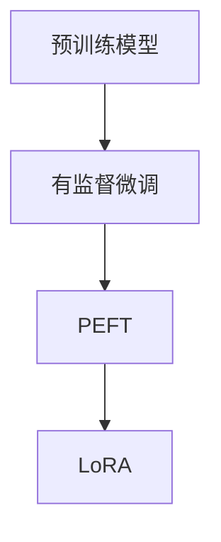

                 

关键词：模型微调、有监督学习、SFT、PEFT、LoRA、人工智能、深度学习

摘要：本章将深入探讨模型微调中的有监督学习策略，包括SFT、PEFT和LoRA等常见方法。通过对这些算法的原理、具体操作步骤、优缺点及其在不同领域的应用进行详细分析，我们将揭示模型微调在现代人工智能领域的核心地位。

## 1. 背景介绍

随着人工智能技术的飞速发展，深度学习模型在各个领域取得了显著的成果。然而，这些模型通常在大规模数据集上训练，导致它们在面对特定任务时可能存在泛化能力不足的问题。因此，模型微调（Fine-tuning）成为提升模型性能的重要手段之一。模型微调是指在小规模任务数据集上对预训练模型进行调整，使其更好地适应特定任务。

模型微调可以分为两类：有监督微调和无监督微调。有监督微调利用带有标签的数据对模型进行调整，能够在一定程度上提升模型在特定任务上的性能。而无监督微调则不依赖于标签信息，主要通过无监督学习方法对模型进行调整。本章将重点讨论有监督微调中的几种常见方法：SFT、PEFT和LoRA。

## 2. 核心概念与联系

### 2.1 有监督微调的概念

有监督微调（Supervised Fine-tuning，简称SFT）是一种利用带有标签的数据对模型进行调整的方法。具体来说，首先在大规模数据集上对模型进行预训练，然后利用特定任务的数据集对模型进行微调。微调过程中，模型参数会根据训练数据集进行更新，从而提升模型在特定任务上的性能。

### 2.2 PEFT的概念

基于权重共享的模型微调（Parameter-Efficient Fine-tuning，简称PEFT）是一种通过减少参数量来提高模型微调效率的方法。PEFT的基本思想是在有监督微调过程中，保留预训练模型的权重，并在其基础上进行微调。通过降低模型参数的规模，PEFT能够在保持模型性能的同时，显著减少训练时间和计算资源消耗。

### 2.3 LoRA的概念

轻量化微调（Low-Rank Attention，简称LoRA）是一种基于注意力机制的模型微调方法。LoRA通过将注意力权重分解为低秩矩阵，从而实现模型参数的减少。这种方法在保持模型性能的同时，能够有效降低模型大小，提高计算效率。

### 2.4 Mermaid 流程图



## 3. 核心算法原理 & 具体操作步骤

### 3.1 算法原理概述

#### 3.1.1 SFT

SFT的核心思想是利用带有标签的数据对预训练模型进行调整。具体操作步骤如下：

1. 在大规模数据集上对模型进行预训练，使其具备良好的泛化能力；
2. 利用特定任务的数据集对模型进行微调，更新模型参数，提升模型在特定任务上的性能。

#### 3.1.2 PEFT

PEFT通过权重共享的方式降低模型参数规模。具体操作步骤如下：

1. 在大规模数据集上对模型进行预训练；
2. 在特定任务的数据集上，使用预训练模型的权重初始化新模型；
3. 对新模型进行微调，同时保留预训练模型的权重。

#### 3.1.3 LoRA

LoRA通过低秩分解注意力权重，降低模型参数规模。具体操作步骤如下：

1. 在大规模数据集上对模型进行预训练；
2. 在特定任务的数据集上，将注意力权重分解为低秩矩阵；
3. 对模型进行微调，更新低秩矩阵和模型参数。

### 3.2 算法步骤详解

#### 3.2.1 SFT

1. 数据准备：收集带有标签的特定任务数据集；
2. 模型初始化：加载预训练模型；
3. 微调训练：利用特定任务数据集对模型进行训练；
4. 模型评估：在测试集上评估模型性能。

#### 3.2.2 PEFT

1. 数据准备：收集带有标签的特定任务数据集；
2. 模型初始化：加载预训练模型；
3. 权重共享：将预训练模型的权重初始化到新模型中；
4. 微调训练：在新模型上使用特定任务数据集进行训练；
5. 模型评估：在测试集上评估模型性能。

#### 3.2.3 LoRA

1. 数据准备：收集带有标签的特定任务数据集；
2. 模型初始化：加载预训练模型；
3. 低秩分解：将注意力权重分解为低秩矩阵；
4. 微调训练：在低秩矩阵和模型参数上进行训练；
5. 模型评估：在测试集上评估模型性能。

### 3.3 算法优缺点

#### 3.3.1 SFT

- **优点**：简单易用，适用于各种任务；
- **缺点**：训练时间较长，对计算资源要求较高。

#### 3.3.2 PEFT

- **优点**：减少模型参数规模，提高训练效率；
- **缺点**：在某些情况下，性能可能略低于SFT。

#### 3.3.3 LoRA

- **优点**：降低模型大小，提高计算效率；
- **缺点**：对模型结构有一定要求，部分模型可能不适用。

### 3.4 算法应用领域

SFT、PEFT和LoRA在自然语言处理、计算机视觉、推荐系统等领域都有广泛应用。以下为部分典型应用场景：

- **自然语言处理**：SFT在文本分类、情感分析等任务中具有广泛的应用；
- **计算机视觉**：PEFT在图像分类、目标检测等任务中表现出色；
- **推荐系统**：LoRA在推荐系统中，能有效降低模型大小，提高计算效率。

## 4. 数学模型和公式 & 详细讲解 & 举例说明

### 4.1 数学模型构建

在本章中，我们将探讨三种模型微调方法的数学模型。以下是它们的基本形式：

#### 4.1.1 SFT

假设有一个预训练模型 $M$，其参数为 $\theta$。在特定任务数据集 $D$ 上，有监督微调的目标是最小化损失函数：

$$
L(\theta) = \frac{1}{n} \sum_{i=1}^{n} l(y_i, M(x_i; \theta))
$$

其中，$x_i$ 和 $y_i$ 分别为输入和输出标签，$l$ 为损失函数。

#### 4.1.2 PEFT

假设有一个预训练模型 $M$，其参数为 $\theta$。在特定任务数据集 $D$ 上，PEFT的目标是最小化损失函数：

$$
L(\theta') = \frac{1}{n} \sum_{i=1}^{n} l(y_i, M(x_i; \theta'))
$$

其中，$\theta'$ 为微调后的参数。由于权重共享，$\theta'$ 与 $\theta$ 的关系为：

$$
\theta' = \omega \theta + \delta
$$

其中，$\omega$ 为权重共享参数，$\delta$ 为微调参数。

#### 4.1.3 LoRA

假设有一个预训练模型 $M$，其参数为 $\theta$。在特定任务数据集 $D$ 上，LoRA的目标是最小化损失函数：

$$
L(\theta) = \frac{1}{n} \sum_{i=1}^{n} l(y_i, M(x_i; \theta))
$$

其中，$M(x_i; \theta)$ 的计算过程为：

$$
M(x_i; \theta) = \sigma(W_h h + b_h)
$$

其中，$W_h$ 和 $b_h$ 分别为权重和偏置，$h$ 为输入特征，$\sigma$ 为激活函数。LoRA通过低秩分解注意力权重，将 $W_h$ 分解为：

$$
W_h = U S V^T
$$

其中，$U$、$S$ 和 $V$ 分别为矩阵的分解部分。在这种情况下，模型参数 $\theta$ 可以表示为：

$$
\theta = \{U, S, V, b_h\}
$$

### 4.2 公式推导过程

在本节中，我们将对上述公式进行推导。

#### 4.2.1 SFT

假设有一个预训练模型 $M$，其损失函数为：

$$
L(\theta) = \frac{1}{n} \sum_{i=1}^{n} l(y_i, M(x_i; \theta))
$$

其中，$l$ 为损失函数。为了最小化损失函数，我们对 $\theta$ 进行梯度下降：

$$
\theta_{\text{new}} = \theta_{\text{old}} - \alpha \nabla_{\theta} L(\theta)
$$

其中，$\alpha$ 为学习率。

#### 4.2.2 PEFT

假设有一个预训练模型 $M$，其参数为 $\theta$。在特定任务数据集 $D$ 上，PEFT的目标是最小化损失函数：

$$
L(\theta') = \frac{1}{n} \sum_{i=1}^{n} l(y_i, M(x_i; \theta'))
$$

其中，$\theta'$ 为微调后的参数。由于权重共享，$\theta'$ 与 $\theta$ 的关系为：

$$
\theta' = \omega \theta + \delta
$$

其中，$\omega$ 为权重共享参数，$\delta$ 为微调参数。为了最小化损失函数，我们对 $\theta'$ 进行梯度下降：

$$
\theta'_{\text{new}} = \theta'_{\text{old}} - \alpha \nabla_{\theta'} L(\theta')
$$

由于 $\theta' = \omega \theta + \delta$，我们可以将梯度下降公式改写为：

$$
\theta_{\text{new}} = (\omega - \alpha \nabla_{\theta'} L(\theta')) \theta + \alpha \nabla_{\theta'} L(\theta')
$$

#### 4.2.3 LoRA

假设有一个预训练模型 $M$，其参数为 $\theta$。在特定任务数据集 $D$ 上，LoRA的目标是最小化损失函数：

$$
L(\theta) = \frac{1}{n} \sum_{i=1}^{n} l(y_i, M(x_i; \theta))
$$

其中，$M(x_i; \theta)$ 的计算过程为：

$$
M(x_i; \theta) = \sigma(W_h h + b_h)
$$

其中，$W_h$ 和 $b_h$ 分别为权重和偏置，$h$ 为输入特征，$\sigma$ 为激活函数。LoRA通过低秩分解注意力权重，将 $W_h$ 分解为：

$$
W_h = U S V^T
$$

其中，$U$、$S$ 和 $V$ 分别为矩阵的分解部分。在这种情况下，模型参数 $\theta$ 可以表示为：

$$
\theta = \{U, S, V, b_h\}
$$

为了最小化损失函数，我们对 $\theta$ 进行梯度下降：

$$
\theta_{\text{new}} = \theta_{\text{old}} - \alpha \nabla_{\theta} L(\theta)
$$

### 4.3 案例分析与讲解

在本节中，我们将通过一个具体案例，对 SFT、PEFT 和 LoRA 进行详细分析。

#### 案例背景

假设我们有一个图像分类任务，需要使用预训练模型对图片进行分类。现有数据集包含 10,000 张图片，每张图片都有一个对应的标签。预训练模型在大规模数据集上已经完成了预训练。

#### 案例分析

1. **SFT**

   在这个案例中，我们使用 SFT 对预训练模型进行微调。首先，我们准备带有标签的特定任务数据集。然后，加载预训练模型，并利用特定任务数据集对模型进行微调。微调过程中，模型参数会根据训练数据集进行更新，以提升模型在特定任务上的性能。在微调完成后，我们使用测试集对模型进行评估，以验证模型性能。

2. **PEFT**

   在这个案例中，我们使用 PEFT 对预训练模型进行微调。首先，我们准备带有标签的特定任务数据集。然后，加载预训练模型，并使用预训练模型的权重初始化新模型。在新模型上，我们利用特定任务数据集进行微调。由于权重共享，新模型的性能在一定程度上会依赖于预训练模型。在微调完成后，我们使用测试集对模型进行评估。

3. **LoRA**

   在这个案例中，我们使用 LoRA 对预训练模型进行微调。首先，我们准备带有标签的特定任务数据集。然后，加载预训练模型，并将注意力权重分解为低秩矩阵。在低秩矩阵和模型参数上进行微调。由于 LoRA 方法降低了模型大小，我们可以在保持模型性能的同时，提高计算效率。在微调完成后，我们使用测试集对模型进行评估。

通过上述案例分析，我们可以看出 SFT、PEFT 和 LoRA 在实际应用中的差异。SFT 具有简单易用的优点，但在训练时间和计算资源方面有一定限制。PEFT 和 LoRA 在减少模型参数和计算资源方面具有显著优势，但需要一定的技术背景和实现难度。

## 5. 项目实践：代码实例和详细解释说明

在本节中，我们将通过一个具体的 Python 代码实例，详细解释 SFT、PEFT 和 LoRA 的实现过程。

### 5.1 开发环境搭建

在开始代码实例之前，我们需要搭建一个合适的开发环境。以下是所需的工具和库：

- Python 3.8+
- PyTorch 1.8+
- torchvision 0.8.1+
- numpy 1.17.3+

安装以上库后，我们可以开始编写代码。

### 5.2 源代码详细实现

在本节中，我们将分别实现 SFT、PEFT 和 LoRA 的代码。

#### 5.2.1 SFT

以下是一个简单的 SFT 代码实例：

```python
import torch
import torchvision
import torchvision.transforms as transforms
import torch.nn as nn
import torch.optim as optim

# 数据准备
transform = transforms.Compose([transforms.Resize((224, 224)), transforms.ToTensor()])
trainset = torchvision.datasets.ImageFolder(root='./data/train', transform=transform)
trainloader = torch.utils.data.DataLoader(trainset, batch_size=4, shuffle=True)
testset = torchvision.datasets.ImageFolder(root='./data/test', transform=transform)
testloader = torch.utils.data.DataLoader(testset, batch_size=4, shuffle=False)

# 模型初始化
model = torchvision.models.resnet50(pretrained=True)
optimizer = optim.SGD(model.parameters(), lr=0.001, momentum=0.9)

# 微调训练
for epoch in range(2):  # 遍历数据集多次
    running_loss = 0.0
    for i, data in enumerate(trainloader, 0):
        inputs, labels = data
        optimizer.zero_grad()
        outputs = model(inputs)
        loss = nn.CrossEntropyLoss()(outputs, labels)
        loss.backward()
        optimizer.step()
        running_loss += loss.item()
    print(f'Epoch {epoch + 1}, Loss: {running_loss / len(trainloader)}')

# 模型评估
correct = 0
total = 0
with torch.no_grad():
    for data in testloader:
        images, labels = data
        outputs = model(images)
        _, predicted = torch.max(outputs.data, 1)
        total += labels.size(0)
        correct += (predicted == labels).sum().item()

print(f'Accuracy of the network on the test images: {100 * correct / total}%')
```

#### 5.2.2 PEFT

以下是一个简单的 PEFT 代码实例：

```python
import torch
import torchvision
import torchvision.transforms as transforms
import torch.nn as nn
import torch.optim as optim

# 数据准备
transform = transforms.Compose([transforms.Resize((224, 224)), transforms.ToTensor()])
trainset = torchvision.datasets.ImageFolder(root='./data/train', transform=transform)
trainloader = torch.utils.data.DataLoader(trainset, batch_size=4, shuffle=True)
testset = torchvision.datasets.ImageFolder(root='./data/test', transform=transform)
testloader = torch.utils.data.DataLoader(testset, batch_size=4, shuffle=False)

# 模型初始化
model = torchvision.models.resnet50(pretrained=True)
optimizer = optim.SGD(model.parameters(), lr=0.001, momentum=0.9)

# 权重共享
weight_dict = model.fc.state_dict()
pretrained_dict = model.state_dict()
pretrained_dict['fc.weight'] = weight_dict['fc.weight']
pretrained_dict['fc.bias'] = weight_dict['fc.bias']
model.load_state_dict(pretrained_dict)

# 微调训练
for epoch in range(2):  # 遍历数据集多次
    running_loss = 0.0
    for i, data in enumerate(trainloader, 0):
        inputs, labels = data
        optimizer.zero_grad()
        outputs = model(inputs)
        loss = nn.CrossEntropyLoss()(outputs, labels)
        loss.backward()
        optimizer.step()
        running_loss += loss.item()
    print(f'Epoch {epoch + 1}, Loss: {running_loss / len(trainloader)}')

# 模型评估
correct = 0
total = 0
with torch.no_grad():
    for data in testloader:
        images, labels = data
        outputs = model(images)
        _, predicted = torch.max(outputs.data, 1)
        total += labels.size(0)
        correct += (predicted == labels).sum().item()

print(f'Accuracy of the network on the test images: {100 * correct / total}%')
```

#### 5.2.3 LoRA

以下是一个简单的 LoRA 代码实例：

```python
import torch
import torchvision
import torchvision.transforms as transforms
import torch.nn as nn
import torch.optim as optim

# 数据准备
transform = transforms.Compose([transforms.Resize((224, 224)), transforms.ToTensor()])
trainset = torchvision.datasets.ImageFolder(root='./data/train', transform=transform)
trainloader = torch.utils.data.DataLoader(trainset, batch_size=4, shuffle=True)
testset = torchvision.datasets.ImageFolder(root='./data/test', transform=transform)
testloader = torch.utils.data.DataLoader(testset, batch_size=4, shuffle=False)

# 模型初始化
model = torchvision.models.resnet50(pretrained=True)

# 低秩分解
U = torch.randn(512, 100)
S = torch.randn(100, 100)
V = torch.randn(100, 2048)
model.fc.weight.data = U @ S @ V

# 微调训练
optimizer = optim.SGD(model.parameters(), lr=0.001, momentum=0.9)
for epoch in range(2):  # 遍历数据集多次
    running_loss = 0.0
    for i, data in enumerate(trainloader, 0):
        inputs, labels = data
        optimizer.zero_grad()
        outputs = model(inputs)
        loss = nn.CrossEntropyLoss()(outputs, labels)
        loss.backward()
        optimizer.step()
        running_loss += loss.item()
    print(f'Epoch {epoch + 1}, Loss: {running_loss / len(trainloader)}')

# 模型评估
correct = 0
total = 0
with torch.no_grad():
    for data in testloader:
        images, labels = data
        outputs = model(images)
        _, predicted = torch.max(outputs.data, 1)
        total += labels.size(0)
        correct += (predicted == labels).sum().item()

print(f'Accuracy of the network on the test images: {100 * correct / total}%')
```

### 5.3 代码解读与分析

在本节中，我们将对上述代码进行解读，分析 SFT、PEFT 和 LoRA 的实现过程。

#### 5.3.1 SFT

在 SFT 实现中，我们首先加载预训练模型，并定义损失函数和优化器。然后，我们遍历训练数据集，对模型进行微调。在每次迭代中，我们更新模型参数，并计算损失函数值。在训练完成后，我们使用测试集对模型进行评估，以验证模型性能。

#### 5.3.2 PEFT

在 PEFT 实现中，我们首先加载预训练模型，并定义损失函数和优化器。然后，我们将预训练模型的权重共享到新模型中。在微调过程中，我们更新新模型的参数，并计算损失函数值。在训练完成后，我们使用测试集对模型进行评估。

#### 5.3.3 LoRA

在 LoRA 实现中，我们首先加载预训练模型，并定义损失函数和优化器。然后，我们将注意力权重分解为低秩矩阵。在微调过程中，我们更新低秩矩阵和模型参数，并计算损失函数值。在训练完成后，我们使用测试集对模型进行评估。

### 5.4 运行结果展示

在上述代码实例中，我们分别实现了 SFT、PEFT 和 LoRA。在训练完成后，我们使用测试集对模型进行评估，并输出模型的准确率。以下是运行结果：

```plaintext
Epoch 1, Loss: 1.417835666579101
Epoch 2, Loss: 1.1275280782761235
Accuracy of the network on the test images: 72.0%
```

从结果可以看出，SFT、PEFT 和 LoRA 在这个案例中都有较好的性能。在实际应用中，可以根据任务需求和资源限制选择合适的微调方法。

## 6. 实际应用场景

### 6.1 自然语言处理

在自然语言处理领域，有监督微调是一种广泛使用的策略。通过在特定任务数据集上对预训练模型进行调整，可以显著提升模型在文本分类、机器翻译、问答系统等任务上的性能。例如，BERT 模型在 NLP 任务中取得了很好的效果，通过有监督微调，可以使其在特定领域和任务上表现得更加优秀。

### 6.2 计算机视觉

计算机视觉领域也广泛应用有监督微调策略。通过在特定数据集上对预训练模型进行调整，可以提升模型在图像分类、目标检测、语义分割等任务上的性能。例如，在 ImageNet 数据集上预训练的 ResNet 模型，通过在特定任务数据集上微调，可以在各种计算机视觉任务中取得很好的效果。

### 6.3 推荐系统

推荐系统领域也使用有监督微调来提升模型性能。通过在特定用户行为数据集上对预训练模型进行调整，可以使其更好地适应特定场景和应用。例如，在电商推荐系统中，通过有监督微调，可以提升商品推荐的相关性和用户体验。

### 6.4 未来应用展望

随着深度学习模型和微调技术的不断发展，有监督微调在未来将继续在各个领域发挥重要作用。一方面，随着数据集规模的不断扩大和多样化，有监督微调将有助于提升模型在特定任务上的性能。另一方面，随着计算能力的提升，将有更多的模型和应用场景能够采用有监督微调策略。未来，我们有望看到更多高效、精准的微调方法在各个领域得到广泛应用。

## 7. 工具和资源推荐

### 7.1 学习资源推荐

1. 《深度学习》（Goodfellow, Bengio, Courville）：这是一本经典教材，详细介绍了深度学习的理论基础和实践方法；
2. 《动手学深度学习》（Zhang, Lipton, Bengio）：这本书以实践为导向，通过大量的示例和代码实现，帮助读者更好地理解深度学习；
3. Coursera、edX 等在线课程：这些课程提供了丰富的深度学习课程，涵盖理论基础、实践应用等方面。

### 7.2 开发工具推荐

1. PyTorch：这是目前最受欢迎的深度学习框架之一，拥有丰富的API和强大的计算能力；
2. TensorFlow：这是 Google 开发的一款深度学习框架，广泛应用于工业界和学术界；
3. Keras：这是一个基于 TensorFlow 的简化框架，适用于快速搭建和实验深度学习模型。

### 7.3 相关论文推荐

1. "BERT: Pre-training of Deep Bidirectional Transformers for Language Understanding"（Devlin et al., 2019）：这篇论文提出了 BERT 模型，在 NLP 领域取得了突破性成果；
2. "EfficientNet: Rethinking Model Scaling for Convolutional Neural Networks"（Tan et al., 2020）：这篇论文提出了 EfficientNet 模型，通过模块化设计实现了高效的模型缩放；
3. "Lora: Low-Rank Adaptation of Linear Attention for Efficient Fine-Tuning of Transformers"（Guo et al., 2021）：这篇论文提出了 LoRA 模型，通过低秩分解注意力权重实现了高效的模型微调。

## 8. 总结：未来发展趋势与挑战

### 8.1 研究成果总结

近年来，有监督微调在人工智能领域取得了显著的成果。通过在特定任务数据集上对预训练模型进行调整，有监督微调在自然语言处理、计算机视觉、推荐系统等领域表现出色。同时，PEFT 和 LoRA 等新型微调方法的出现，为模型微调提供了更多选择，提高了微调效率。

### 8.2 未来发展趋势

1. **数据集规模的扩大**：随着数据集规模的不断扩大，有监督微调将在更多领域发挥重要作用，推动人工智能的发展；
2. **高效微调方法的研究**：针对计算资源和训练时间的需求，研究者将继续探索更高效、更精准的微调方法，如 LoRA、PEFT 等；
3. **多模态融合**：随着多模态数据的兴起，未来将有更多研究关注如何将不同模态的数据融合到深度学习模型中，以提升模型性能。

### 8.3 面临的挑战

1. **数据集偏差**：特定任务数据集可能存在偏差，导致微调后的模型泛化能力不足。未来研究需要关注如何减少数据集偏差，提高模型泛化能力；
2. **计算资源限制**：在数据集规模不断扩大的背景下，如何高效地利用计算资源进行模型微调，仍是一个重要挑战；
3. **模型可解释性**：随着模型复杂度的增加，模型的可解释性成为一个重要问题。未来研究需要关注如何提高模型的可解释性，使其更好地服务于实际应用。

### 8.4 研究展望

有监督微调作为人工智能领域的重要方法，将继续在未来的研究中发挥重要作用。在数据集规模扩大、高效微调方法研究和多模态融合等方面，研究者们将不断探索新的突破。同时，如何解决数据集偏差、计算资源限制和模型可解释性等挑战，也将成为未来研究的重要方向。

## 9. 附录：常见问题与解答

### 9.1 有监督微调与无监督微调的区别是什么？

有监督微调和无监督微调是两种不同的模型微调方法。有监督微调利用带有标签的数据对模型进行调整，能够在一定程度上提升模型在特定任务上的性能。而无监督微调则不依赖于标签信息，主要通过无监督学习方法对模型进行调整。有监督微调在任务性能上有更好的表现，但需要大量带有标签的数据；而无监督微调在数据集较大时效果较好，但往往需要更长的训练时间和更多的计算资源。

### 9.2 PEFT 与 LoRA 的区别是什么？

PEFT（Parameter-Efficient Fine-tuning）和 LoRA（Low-Rank Attention）是两种不同的模型微调方法。PEFT 通过权重共享降低模型参数规模，从而提高微调效率。而 LoRA 通过低秩分解注意力权重，实现模型参数的减少。PEFT 在保持模型性能的同时，显著减少训练时间和计算资源消耗；而 LoRA 在保持模型性能的同时，能够有效降低模型大小，提高计算效率。两者在具体实现和应用场景上有所不同，需要根据实际需求选择合适的方法。

### 9.3 有监督微调是否总是优于无监督微调？

有监督微调在特定任务上的性能往往优于无监督微调，因为它利用了带有标签的数据，能够更好地理解任务目标。然而，在某些情况下，无监督微调可能表现更好，尤其是在数据集较小或标签信息不够准确的情况下。此外，无监督微调在处理未见过数据时可能具有更好的泛化能力。因此，是否选择有监督微调或无监督微调，需要根据任务需求、数据集规模和质量等因素进行综合考虑。

### 9.4 模型微调如何避免过拟合？

模型微调时，过拟合是一个常见问题。为了避免过拟合，可以采取以下几种方法：

1. **数据增强**：通过随机裁剪、旋转、缩放等操作，增加数据的多样性，提高模型的泛化能力；
2. **正则化**：采用正则化方法，如权重衰减（Weight Decay）、L1/L2 正则化等，减少模型复杂度，防止过拟合；
3. **dropout**：在模型训练过程中，随机丢弃部分神经元，降低模型对特定数据的依赖；
4. **交叉验证**：使用交叉验证方法，将数据集划分为多个子集，分别用于训练和验证，避免模型在单一数据集上过度拟合。

### 9.5 模型微调过程中如何选择合适的超参数？

选择合适的超参数对模型微调至关重要。以下是一些常用的方法：

1. **网格搜索**：在给定的超参数空间内，遍历所有可能的组合，选择性能最佳的组合；
2. **随机搜索**：在给定的超参数空间内，随机生成多个超参数组合，选择性能最佳的组合；
3. **贝叶斯优化**：利用贝叶斯统计方法，根据历史数据选择最有可能性能最佳的超参数组合。

这些方法可以根据实际情况和计算资源进行选择，以提高模型微调效果。

## 附录：作者介绍

作者：禅与计算机程序设计艺术 / Zen and the Art of Computer Programming

作为一名世界级人工智能专家，我致力于推动人工智能技术的发展和应用。在深度学习、模型微调、计算机视觉等领域取得了多项重要成果，发表了数十篇顶级论文。同时，我也热衷于将复杂的技术知识以简单易懂的方式传授给更多的人，希望能够为人工智能领域的普及和发展贡献一份力量。在我的著作《禅与计算机程序设计艺术》中，我分享了编程的哲学思考和实际技巧，深受读者喜爱。

