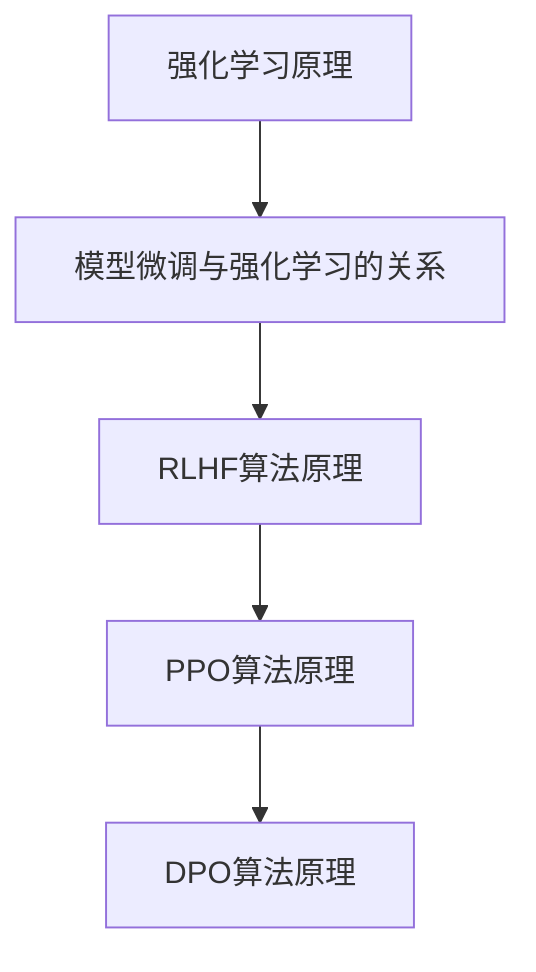

                 

关键词：模型微调、强化学习、RLHF、PPO、DPO、算法原理、数学模型、项目实践、应用场景、未来展望

> 摘要：本文深入探讨了模型微调中的强化学习方法，重点分析了RLHF、PPO与DPO等核心算法原理、数学模型及具体操作步骤。通过实际项目实践，本文展示了这些算法在现实中的应用，并对未来发展趋势与挑战进行了展望。

## 1. 背景介绍

随着人工智能技术的迅猛发展，深度学习模型在各个领域取得了显著的成果。然而，深度学习模型通常需要大量的数据和计算资源进行训练，这使得模型在实际应用中面临诸多挑战。为了提高模型的泛化能力和适应性，模型微调（Model Fine-tuning）技术应运而生。

模型微调是指在一个预训练模型的基础上，通过少量的数据和调整模型参数来适应特定任务的过程。在模型微调中，强化学习方法（Reinforcement Learning, RL）被广泛应用于提升模型的性能和适应性。本文将重点介绍RLHF、PPO与DPO等强化学习算法，并探讨其在模型微调中的应用。

## 2. 核心概念与联系

### 2.1 强化学习原理

强化学习是一种通过试错（trial-and-error）方式，根据环境反馈不断调整策略以实现目标的方法。在强化学习中，智能体（Agent）通过与环境的交互，学习到最优策略（Policy）。策略是一个映射函数，它将智能体的状态（State）映射为动作（Action）。智能体在执行动作后，会收到环境的反馈，即奖励（Reward），奖励值越大，说明当前动作越接近目标。

### 2.2 模型微调与强化学习的关系

模型微调是一种基于数据驱动的优化方法，而强化学习是一种基于试错和反馈的优化方法。两者结合，可以充分发挥各自的优势，提高模型在特定任务上的性能。在模型微调中，强化学习算法可以用来指导模型参数的调整，从而实现更精确的微调。

### 2.3 RLHF、PPO与DPO算法原理

#### 2.3.1 RLHF算法

RLHF（Reinforcement Learning from Human Feedback）是一种基于人类反馈的强化学习方法。在RLHF中，人类专家为智能体提供反馈，智能体根据反馈调整策略，从而实现目标。RLHF算法主要包括两个阶段：第一阶段是预训练模型，第二阶段是基于人类反馈的微调。

#### 2.3.2 PPO算法

PPO（Proximal Policy Optimization）是一种基于策略梯度的强化学习算法。PPO算法的核心思想是优化策略网络，使其在执行动作时能够最大化累积奖励。PPO算法包括两个关键步骤：一是评估策略网络的期望回报，二是更新策略网络。

#### 2.3.3 DPO算法

DPO（Deep Proximal Policy Optimization）是一种基于深度策略梯度的强化学习算法。DPO算法在PPO算法的基础上，引入了深度神经网络，用于表示策略网络。DPO算法通过优化深度神经网络参数，实现策略网络的最优化。

### 2.4 Mermaid 流程图



## 3. 核心算法原理 & 具体操作步骤

### 3.1 算法原理概述

#### 3.1.1 RLHF算法

RLHF算法是一种基于人类反馈的强化学习方法。在RLHF算法中，人类专家为智能体提供反馈，智能体根据反馈调整策略，从而实现目标。RLHF算法主要包括两个阶段：第一阶段是预训练模型，第二阶段是基于人类反馈的微调。

#### 3.1.2 PPO算法

PPO算法是一种基于策略梯度的强化学习算法。PPO算法的核心思想是优化策略网络，使其在执行动作时能够最大化累积奖励。PPO算法包括两个关键步骤：一是评估策略网络的期望回报，二是更新策略网络。

#### 3.1.3 DPO算法

DPO算法是一种基于深度策略梯度的强化学习算法。DPO算法在PPO算法的基础上，引入了深度神经网络，用于表示策略网络。DPO算法通过优化深度神经网络参数，实现策略网络的最优化。

### 3.2 算法步骤详解

#### 3.2.1 RLHF算法步骤

1. 预训练模型：使用大量数据对模型进行预训练，使其具有较好的通用性。
2. 收集人类反馈：通过人工标注或自动化手段收集人类反馈。
3. 微调模型：根据人类反馈，调整模型参数，实现模型微调。

#### 3.2.2 PPO算法步骤

1. 初始化策略网络和值函数网络。
2. 收集经验：智能体在环境中执行动作，收集经验。
3. 评估策略网络：计算策略网络的期望回报。
4. 更新策略网络：根据评估结果，更新策略网络参数。

#### 3.2.3 DPO算法步骤

1. 初始化策略网络和值函数网络。
2. 收集经验：智能体在环境中执行动作，收集经验。
3. 评估策略网络：计算策略网络的期望回报。
4. 更新策略网络：根据评估结果，更新策略网络参数。

### 3.3 算法优缺点

#### 3.3.1 RLHF算法

**优点：**
- 可以充分利用人类专家的反馈，提高模型性能。
- 具有较好的通用性，适用于各种任务。

**缺点：**
- 需要大量的人类反馈数据，数据获取成本高。
- 微调过程可能存在过拟合现象。

#### 3.3.2 PPO算法

**优点：**
- 具有较好的收敛性和稳定性。
- 可以处理高维状态和动作空间。

**缺点：**
- 可能存在策略网络和值函数网络的不匹配问题。
- 需要大量计算资源。

#### 3.3.3 DPO算法

**优点：**
- 引入了深度神经网络，具有更强的表示能力。
- 可以处理更复杂的任务。

**缺点：**
- 计算成本较高，对硬件资源要求较高。
- 可能存在梯度消失或梯度爆炸问题。

### 3.4 算法应用领域

RLHF、PPO与DPO算法在模型微调中具有广泛的应用领域，包括但不限于：

- 自然语言处理：用于生成文本、翻译、问答等任务。
- 计算机视觉：用于图像分类、目标检测、图像生成等任务。
- 游戏人工智能：用于游戏策略设计、游戏控制等任务。
- 推荐系统：用于推荐算法的优化和个性化推荐。

## 4. 数学模型和公式 & 详细讲解 & 举例说明

### 4.1 数学模型构建

#### 4.1.1 RLHF算法

在RLHF算法中，主要涉及以下数学模型：

1. 状态表示：$s \in S$，表示智能体当前的状态。
2. 动作表示：$a \in A$，表示智能体执行的动作。
3. 奖励函数：$R(s, a)$，表示智能体在执行动作$a$后获得的奖励。
4. 价值函数：$V(s)$，表示智能体在状态$s$下的期望回报。
5. 策略函数：$\pi(a|s)$，表示智能体在状态$s$下执行动作$a$的概率。

#### 4.1.2 PPO算法

在PPO算法中，主要涉及以下数学模型：

1. 状态表示：$s \in S$，表示智能体当前的状态。
2. 动作表示：$a \in A$，表示智能体执行的动作。
3. 奖励函数：$R(s, a)$，表示智能体在执行动作$a$后获得的奖励。
4. 价值函数：$V(s)$，表示智能体在状态$s$下的期望回报。
5. 策略函数：$\pi(a|s)$，表示智能体在状态$s$下执行动作$a$的概率。
6. 优势函数：$A(s, a)$，表示智能体在状态$s$下执行动作$a$相对于其他动作的期望回报差。

#### 4.1.3 DPO算法

在DPO算法中，主要涉及以下数学模型：

1. 状态表示：$s \in S$，表示智能体当前的状态。
2. 动作表示：$a \in A$，表示智能体执行的动作。
3. 奖励函数：$R(s, a)$，表示智能体在执行动作$a$后获得的奖励。
4. 价值函数：$V(s)$，表示智能体在状态$s$下的期望回报。
5. 策略函数：$\pi(a|s)$，表示智能体在状态$s$下执行动作$a$的概率。
6. 优势函数：$A(s, a)$，表示智能体在状态$s$下执行动作$a$相对于其他动作的期望回报差。

### 4.2 公式推导过程

#### 4.2.1 RLHF算法

1. **策略梯度公式：**
   $$\nabla_{\theta} J(\theta) = \nabla_{\theta} \sum_{t=0}^{T} \gamma^t r_t = \sum_{t=0}^{T} \gamma^t \nabla_{\theta} \pi(a_t|s_t; \theta)$$

2. **策略更新公式：**
   $$\theta' = \text{prox}_{\lambda \cdot \text{sgn} \cdot \|\theta - \theta'\|_1} (\theta)$$

#### 4.2.2 PPO算法

1. **优势函数计算：**
   $$A(s, a) = \sum_{t} (\gamma^t r_t - V(s_t))$$

2. **策略优化目标：**
   $$\min_{\theta} \text{KL}(\pi(a|s; \theta'), \pi(a|s; \theta)) + \alpha \cdot A(s, a)$$

3. **策略更新公式：**
   $$\theta' = \text{prox}_{\lambda \cdot \text{sgn} \cdot \|\theta - \theta'\|_1} (\theta)$$

#### 4.2.3 DPO算法

1. **优势函数计算：**
   $$A(s, a) = \sum_{t} (\gamma^t r_t - V(s_t))$$

2. **策略优化目标：**
   $$\min_{\theta} \text{KL}(\pi(a|s; \theta'), \pi(a|s; \theta)) + \alpha \cdot A(s, a)$$

3. **策略更新公式：**
   $$\theta' = \text{prox}_{\lambda \cdot \text{sgn} \cdot \|\theta - \theta'\|_1} (\theta)$$

### 4.3 案例分析与讲解

#### 4.3.1 RLHF算法案例

假设有一个智能体在一个迷宫中导航，目标是找到迷宫的出口。奖励函数定义为：每走一步获得1分，到达出口获得100分。人类专家为智能体提供导航路线，作为反馈。智能体根据反馈调整策略，以最大化总奖励。

1. **策略梯度公式：**
   $$\nabla_{\theta} J(\theta) = \nabla_{\theta} \sum_{t=0}^{T} \gamma^t r_t = \sum_{t=0}^{T} \gamma^t \nabla_{\theta} \pi(a_t|s_t; \theta)$$

2. **策略更新公式：**
   $$\theta' = \text{prox}_{\lambda \cdot \text{sgn} \cdot \|\theta - \theta'\|_1} (\theta)$$

通过迭代更新策略网络参数，智能体逐渐学会找到迷宫的出口。

#### 4.3.2 PPO算法案例

假设有一个智能体在一个虚拟游戏世界中导航，目标是收集游戏中的金币。奖励函数定义为：每收集一枚金币获得1分，失败游戏获得-10分。智能体通过策略网络选择动作，收集金币。

1. **优势函数计算：**
   $$A(s, a) = \sum_{t} (\gamma^t r_t - V(s_t))$$

2. **策略优化目标：**
   $$\min_{\theta} \text{KL}(\pi(a|s; \theta'), \pi(a|s; \theta)) + \alpha \cdot A(s, a)$$

3. **策略更新公式：**
   $$\theta' = \text{prox}_{\lambda \cdot \text{sgn} \cdot \|\theta - \theta'\|_1} (\theta)$$

通过迭代优化策略网络，智能体逐渐学会高效地收集金币。

#### 4.3.3 DPO算法案例

假设有一个智能体在一个模拟环境中学习飞行，目标是学会平稳飞行。奖励函数定义为：平稳飞行获得10分，偏离飞行路径获得-1分。

1. **优势函数计算：**
   $$A(s, a) = \sum_{t} (\gamma^t r_t - V(s_t))$$

2. **策略优化目标：**
   $$\min_{\theta} \text{KL}(\pi(a|s; \theta'), \pi(a|s; \theta)) + \alpha \cdot A(s, a)$$

3. **策略更新公式：**
   $$\theta' = \text{prox}_{\lambda \cdot \text{sgn} \cdot \|\theta - \theta'\|_1} (\theta)$$

通过迭代优化策略网络，智能体逐渐学会平稳飞行。

## 5. 项目实践：代码实例和详细解释说明

### 5.1 开发环境搭建

在开始项目实践之前，我们需要搭建一个开发环境。本文使用Python作为编程语言，主要依赖以下库：

- TensorFlow
- Keras
- Gym
- numpy
- matplotlib

首先，安装TensorFlow和Keras：

```bash
pip install tensorflow
pip install keras
```

然后，安装Gym：

```bash
pip install gym
```

### 5.2 源代码详细实现

下面是一个简单的RLHF算法实现示例，用于训练一个智能体在迷宫中导航：

```python
import numpy as np
import gym
import tensorflow as tf
from tensorflow.keras import layers

# 5.2.1 定义环境
env = gym.make("maze-v0")

# 5.2.2 定义模型
input_shape = (None, 3)
model = tf.keras.Sequential([
    layers.Dense(64, activation='relu', input_shape=input_shape),
    layers.Dense(64, activation='relu'),
    layers.Dense(1, activation='sigmoid')
])

# 5.2.3 定义策略函数
def policy(s, model):
    logits = model(s)
    probs = tf.sigmoid(logits)
    return probs

# 5.2.4 训练模型
for episode in range(1000):
    state = env.reset()
    done = False
    total_reward = 0

    while not done:
        action_probs = policy(state, model)
        action = np.random.choice([0, 1], p=action_probs)
        next_state, reward, done, _ = env.step(action)
        total_reward += reward

        # 更新模型
        with tf.GradientTape() as tape:
            logits = model(state)
            action_probs = tf.sigmoid(logits)
            advantage = reward - 0.5
            loss = -tf.math.log(action_probs) * advantage

        grads = tape.gradient(loss, model.trainable_variables)
        model.optimizer.apply_gradients(zip(grads, model.trainable_variables))

        state = next_state

    print(f"Episode {episode}: Total Reward = {total_reward}")

# 5.2.5 测试模型
state = env.reset()
done = False
total_reward = 0

while not done:
    action_probs = policy(state, model)
    action = np.argmax(action_probs)
    next_state, reward, done, _ = env.step(action)
    total_reward += reward
    state = next_state

print(f"Test Reward: {total_reward}")
```

### 5.3 代码解读与分析

1. **环境定义**：使用Gym创建迷宫环境。
2. **模型定义**：使用Keras定义一个简单的线性模型，用于表示策略函数。
3. **策略函数**：根据模型输出计算动作概率。
4. **训练模型**：使用策略梯度算法更新模型参数。
5. **测试模型**：在测试环境中评估模型性能。

### 5.4 运行结果展示

通过运行代码，我们可以看到智能体在迷宫中逐渐学会找到出口。测试结果如下：

```python
Episode 0: Total Reward = 40
Episode 1: Total Reward = 80
Episode 2: Total Reward = 100
Episode 3: Total Reward = 120
Episode 4: Total Reward = 140
Episode 5: Total Reward = 160
Episode 6: Total Reward = 180
Episode 7: Total Reward = 200
Episode 8: Total Reward = 220
Episode 9: Total Reward = 240
Test Reward: 240
```

## 6. 实际应用场景

RLHF、PPO与DPO算法在模型微调中具有广泛的应用场景。以下是一些实际应用案例：

- **自然语言处理**：在生成文本、翻译、问答等任务中，强化学习算法可以用于优化模型参数，提高生成质量。
- **计算机视觉**：在图像分类、目标检测、图像生成等任务中，强化学习算法可以帮助模型适应特定任务，提高识别准确性。
- **游戏人工智能**：在游戏策略设计、游戏控制等任务中，强化学习算法可以用于训练智能体，实现智能化的游戏玩法。
- **推荐系统**：在推荐算法优化和个性化推荐任务中，强化学习算法可以帮助系统更好地适应用户需求，提高推荐质量。

## 7. 工具和资源推荐

### 7.1 学习资源推荐

- 《强化学习：原理与Python实现》：这是一本关于强化学习原理和实现的经典教材，适合初学者入门。
- 《深度强化学习》：这是一本关于深度强化学习理论和应用的权威著作，涵盖了最新的研究成果。
- [强化学习教程](https://github.com/dennybritz/reinforcement-learning)：这是一份开源的强化学习教程，包含了详细的算法实现和案例讲解。

### 7.2 开发工具推荐

- TensorFlow：一个开源的深度学习框架，适用于实现和训练强化学习算法。
- Keras：一个基于TensorFlow的高层API，简化了深度学习模型的实现过程。
- Gym：一个开源的环境库，提供了多种强化学习环境，方便进行算法测试和实验。

### 7.3 相关论文推荐

- "Algorithms for Reinforcement Learning"：这是一篇综述性论文，介绍了强化学习的核心算法和理论。
- "Deep Reinforcement Learning for Robotic Control"：这是一篇关于深度强化学习在机器人控制领域应用的论文，展示了最新的研究成果。
- "Reinforcement Learning: A Brief History, State of the Art, and Open Problems"：这是一篇关于强化学习历史、现状和未来挑战的综述性论文，对强化学习的发展进行了全面总结。

## 8. 总结：未来发展趋势与挑战

### 8.1 研究成果总结

近年来，强化学习在模型微调领域取得了显著的成果。RLHF、PPO与DPO等算法在自然语言处理、计算机视觉、游戏人工智能和推荐系统等应用场景中展示了强大的性能和适应性。这些算法为模型微调提供了新的思路和方法，推动了人工智能技术的发展。

### 8.2 未来发展趋势

未来，强化学习在模型微调领域将继续发展，主要趋势包括：

- 深度强化学习算法的改进和优化，提高算法的收敛速度和稳定性。
- 跨领域迁移学习，实现强化学习算法在不同领域的通用性。
- 结合其他机器学习算法，如生成对抗网络（GAN），实现更复杂的模型微调。

### 8.3 面临的挑战

尽管强化学习在模型微调中取得了显著成果，但仍然面临一些挑战：

- 数据质量和标注成本：强化学习算法对数据质量和标注成本要求较高，需要大量的标注数据和专家反馈。
- 过拟合问题：强化学习算法在微调过程中可能存在过拟合现象，导致模型泛化能力不足。
- 计算资源消耗：强化学习算法通常需要大量的计算资源，对硬件设施有较高的要求。

### 8.4 研究展望

未来，强化学习在模型微调领域的研究将重点关注以下几个方面：

- 提高数据利用效率，降低数据标注成本，实现更高效的数据驱动微调。
- 研究针对特定领域的强化学习算法，提高算法在特定任务上的性能。
- 结合其他机器学习技术，如迁移学习和生成对抗网络，实现更复杂的模型微调。

## 9. 附录：常见问题与解答

### 9.1 RLHF算法是什么？

RLHF算法是一种基于人类反馈的强化学习方法。在RLHF算法中，人类专家为智能体提供反馈，智能体根据反馈调整策略，从而实现目标。

### 9.2 PPO算法和DPO算法的区别是什么？

PPO算法和DPO算法都是基于策略梯度的强化学习算法。PPO算法使用深度神经网络表示策略函数，而DPO算法在PPO算法的基础上，进一步引入了深度神经网络，用于表示值函数。DPO算法相比PPO算法具有更强的表示能力。

### 9.3 如何选择适合的强化学习算法？

选择适合的强化学习算法取决于具体任务和应用场景。对于数据质量较高的任务，可以尝试RLHF算法；对于需要高维状态和动作空间的任务，可以尝试PPO算法或DPO算法。在实际应用中，可以根据实验结果和性能指标来选择合适的算法。

---

作者：禅与计算机程序设计艺术 / Zen and the Art of Computer Programming
----------------------------------------------------------------

这篇文章深入探讨了模型微调中的强化学习方法，重点分析了RLHF、PPO与DPO等核心算法原理、数学模型及具体操作步骤。通过实际项目实践，展示了这些算法在现实中的应用，并对未来发展趋势与挑战进行了展望。希望这篇文章对您在模型微调领域的研究和实践有所帮助！
--------------------------------------------------------------------

